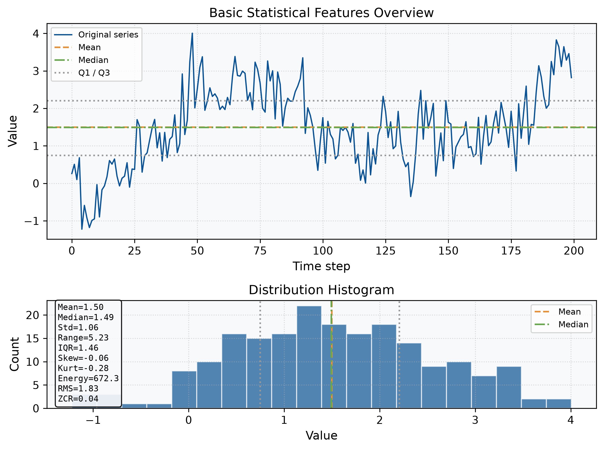
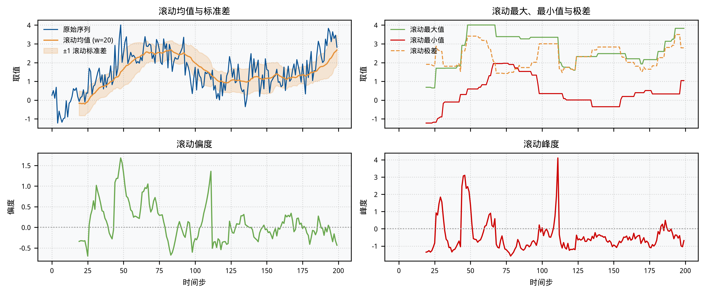
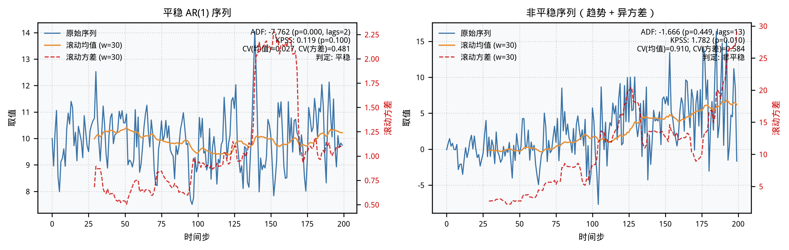
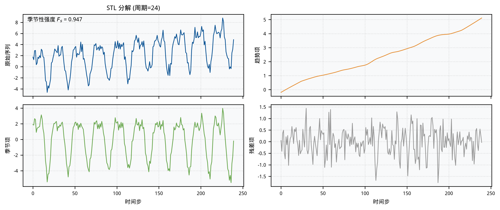
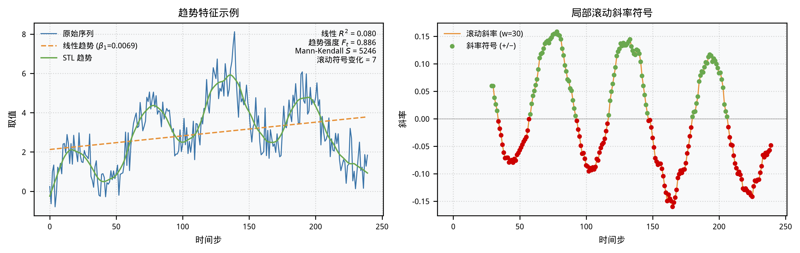
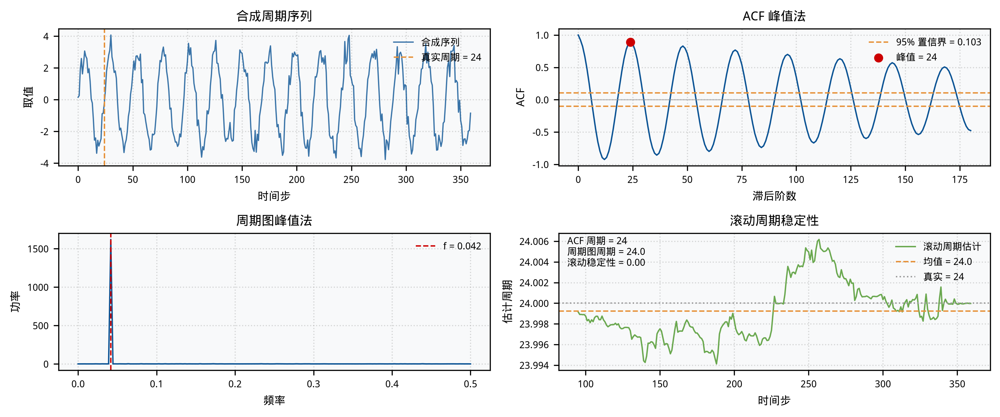
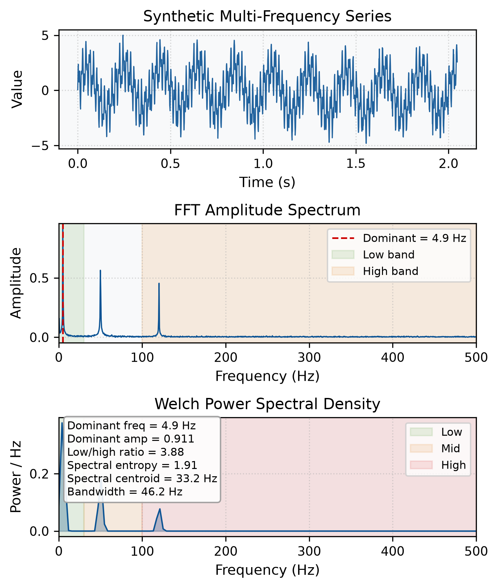

# 第 3 章 特征提取

特征提取是时间序列分析的首要步骤。好的特征能够以少量标量或向量刻画序列的核心模式，为后续的分类、异常检测、预测与因果分析提供可解释且稳定的输入。本章从统计特征、时域特征与频域特征三个层面展开，并讨论特征组合与工程实践中的常见问题。

## 本章目标

- 掌握常用的全局与局部统计特征：均值、方差、偏度、峰度、分位数、滑动窗口统计量等。
- 理解平稳性、季节性、趋势性与周期性等时域特征的刻画方法。
- 能够使用傅里叶变换与功率谱密度提取频域特征，并解释频带能量的物理意义。
- 了解特征组合、缩放与选择在时序工程实践中的典型流程。
- 能够使用 Python（`numpy`、`pandas`、`scipy`、`statsmodels`）计算并可视化上述特征。

## 1. 引言

## 2. 统计特征

统计特征用少量标量刻画整条序列或局部窗口的数值特性，是后续建模最直接、最可解释的特征来源。下面按全局基本量、分布形态、能量与计数、滑动窗口四个层面展开。

### 2.1 基本统计量

基本统计量描述序列的中心位置与离散程度，是所有特征工程的基础。

| 特征 | 直观含义 |
|------|----------|
| 均值（Mean） | 序列的算术平均中心 |
| 中位数（Median） | 排序后位于中间位置的值，对异常值更稳健 |
| 众数（Mode） | 出现频率最高的值，适合离散或近似重复的序列 |
| 方差（Variance） / 标准差（Std） | 序列偏离均值的平均幅度 |
| 极差（Range） | 最大值与最小值之差，反映整体波动范围 |
| 四分位距（IQR） | 第三四分位数与第一四分位数之差，反映中间 50% 数据的离散程度 |

常用公式如下：

$$
\bar{x} = \frac{1}{N}\sum_{i=1}^{N}x_i
$$

$$
\sigma = \sqrt{\frac{1}{N}\sum_{i=1}^{N}(x_i - \bar{x})^2}
$$

$$
\text{Range} = \max(\mathbf{x}) - \min(\mathbf{x})
$$

$$
\text{IQR} = Q_3 - Q_1
$$

其中 $Q_1$ 与 $Q_3$ 分别为第 25% 与第 75% 分位数。

使用 `numpy`/`pandas` 可一行计算：

```python
import numpy as np

mean = np.mean(x)
median = np.median(x)
std = np.std(x)
q1, q3 = np.percentile(x, [25, 75])
iqr = q3 - q1
range_val = np.ptp(x)  # np.max(x) - np.min(x)
```

完整脚本见 [`assets/code/03-example-01-basic-stats.py`](./assets/code/03-example-01-basic-stats.py)。



**图 3-1** 基本统计量概览。

### 2.2 分布形态特征

分布形态特征刻画序列取值分布的不对称性与尾部厚度，对异常检测与模型假设检验尤为重要。

**偏度（Skewness）**衡量分布的不对称程度：

$$
\gamma_1 = \frac{1}{N}\sum_{i=1}^{N}\left(\frac{x_i-\bar{x}}{\sigma}\right)^3
$$

- $\gamma_1 = 0$ 表示大致对称；
- $\gamma_1 > 0$ 表示右偏（长尾在右）；
- $\gamma_1 < 0$ 表示左偏（长尾在左）。

**峰度（Kurtosis）**衡量分布尾部的厚重程度，工程上常用超额峰度：

$$
\gamma_2 = \frac{1}{N}\sum_{i=1}^{N}\left(\frac{x_i-\bar{x}}{\sigma}\right)^4 - 3
$$

- $\gamma_2 = 0$ 接近正态分布尾部；
- $\gamma_2 > 0$ 尾部更厚、极端值更多；
- $\gamma_2 < 0$ 尾部更轻、取值更集中。

```python
from scipy import stats

skewness = stats.skew(x)      # 偏度
kurtosis = stats.kurtosis(x)  # 超额峰度（已减去 3）
```

完整脚本见 [`assets/code/03-example-01-basic-stats.py`](./assets/code/03-example-01-basic-stats.py)。


**图 3-1** 基本统计量概览。

### 2.3 能量与计数特征

能量特征反映序列整体的“强度”，计数特征则关注序列穿越某一参考水平的频繁程度。

**绝对能量（Absolute Energy）**是序列平方和：

$$
E = \sum_{t=1}^{N}x_t^2
$$

**均方根（Root Mean Square, RMS）**是能量的平均开方：

$$
\text{RMS} = \sqrt{\frac{1}{N}\sum_{t=1}^{N}x_t^2}
$$

**过零率（Zero Crossing Rate, ZCR）**统计相邻样本符号变化的次数，常用于信号处理与振动分析：

$$
\text{ZCR} = \frac{1}{N-1}\sum_{t=1}^{N-1}\mathbb{1}\{x_t \cdot x_{t+1} < 0\}
$$

```python
energy = np.sum(x ** 2)
rms = np.sqrt(np.mean(x ** 2))
zcr = np.sum((x[:-1] * x[1:]) < 0) / (len(x) - 1)
```

完整脚本见 [`assets/code/03-example-01-basic-stats.py`](./assets/code/03-example-01-basic-stats.py)。


**图 3-1** 基本统计量概览。

### 2.4 滑动窗口统计特征

全局统计量会抹平时序的局部变化。滑动窗口统计特征在固定长度的窗口内重复计算上述指标，从而捕捉序列的局部平稳性、趋势转折与异常段。

给定窗口长度 $w$，在时刻 $t$ 的窗口为 $\{x_{t-w+1}, \dots, x_t\}$，其滚动均值、标准差与极值可写为：

$$
\bar{x}_t^{(w)} = \frac{1}{w}\sum_{k=t-w+1}^{t}x_k
$$

$$
\sigma_t^{(w)} = \sqrt{\frac{1}{w}\sum_{k=t-w+1}^{t}(x_k - \bar{x}_t^{(w)})^2}
$$

$$
\text{Range}_t^{(w)} = \max_{k\in w}(x_k) - \min_{k\in w}(x_k)
$$

同理可定义滚动偏度与滚动峰度。`pandas` 的 `rolling` 对象已经封装了这些计算：

```python
import pandas as pd

s = pd.Series(x)
w = 20

rolling_mean = s.rolling(window=w).mean()
rolling_std = s.rolling(window=w).std()
rolling_max = s.rolling(window=w).max()
rolling_min = s.rolling(window=w).min()
rolling_range = rolling_max - rolling_min
rolling_skew = s.rolling(window=w).skew()
rolling_kurt = s.rolling(window=w).kurt()
```

完整脚本见 [`assets/code/03-example-02-rolling-stats.py`](./assets/code/03-example-02-rolling-stats.py)。



**图 3-2** 滑动窗口统计量概览。

## 3. 时域特征

### 3.1 平稳性特征

**平稳性（Stationarity）** 是指时间序列的统计特性（均值、方差、自相关结构）不随时间推移而显著变化。它是许多经典时序模型（如 ARMA、ARIMA）的重要前提：非平稳序列的均值或方差漂移会让参数估计失去意义，而平稳序列更易于建模与预测。

#### 3.1.1 ADF 检验

**ADF（Augmented Dickey-Fuller）检验** 是最常用的单位根检验，其回归模型可写为：

$$
\Delta x_t = \alpha + \beta t + \gamma x_{t-1} + \sum_{i=1}^{p}\delta_i \Delta x_{t-i} + \varepsilon_t
$$

其中 $\Delta x_t = x_t - x_{t-1}$ 为一阶差分，$p$ 为滞后阶数。原假设为序列存在单位根（非平稳）；当 p-value 小于显著性水平（通常取 0.05）时，拒绝原假设，认为序列平稳。

从 ADF 检验可提取以下特征：

- `adf_statistic`：ADF 统计量（越负越倾向于平稳）。
- `adf_pvalue`：对应 p-value。
- `adf_is_stationary`：布尔值，p-value < 0.05 时为 `True`。
- `adf_lags`：检验时自动选择的滞后阶数。

`statsmodels` 中的调用方式如下：

```python
import numpy as np
from statsmodels.tsa.stattools import adfuller

# x 为已加载的时间序列，例如：x = np.array([...])
x = np.random.randn(100)  # 占位示例序列，请替换为实际数据

adf_res = adfuller(x, autolag="AIC")
adf_stat, adf_pvalue, used_lags = adf_res[0], adf_res[1], adf_res[2]
is_stationary = adf_pvalue < 0.05
```

#### 3.1.2 KPSS 检验

**KPSS（Kwiatkowski-Phillips-Schmidt-Shin）检验** 与 ADF 检验的假设正好相反：原假设为序列平稳，备择假设为序列存在单位根。因此解读时需要注意 p-value 的方向：

- `kpss_statistic`：LM 统计量。
- `kpss_pvalue`：对应 p-value。
- `kpss_is_stationary`：布尔值，p-value >= 0.05 时为 `True`。

```python
import numpy as np
from statsmodels.tsa.stattools import kpss

# x 为已加载的时间序列，例如：x = np.array([...])
x = np.random.randn(100)  # 占位示例序列，请替换为实际数据

kpss_res = kpss(x, regression="c", nlags="auto")
kpss_stat, kpss_pvalue = kpss_res[0], kpss_res[1]
is_stationary = kpss_pvalue >= 0.05
```

实际工程中，通常同时报告 ADF 与 KPSS 结果。当两者结论冲突时，可结合滚动统计量的稳定性进一步判断。

#### 3.1.3 滚动统计量稳定性特征

全局检验只能给出整条序列是否平稳的结论，而滚动统计量可以刻画平稳性随时间的局部变化。给定窗口长度 $w$，时刻 $t$ 的滚动均值与滚动方差分别为：

$$
m_t^{(w)} = \frac{1}{w}\sum_{k=t-w+1}^{t}x_k
$$

$$
v_t^{(w)} = \frac{1}{w}\sum_{k=t-w+1}^{t}\left(x_k - m_t^{(w)}\right)^2
$$

为了用单个标量衡量滚动均值或滚动方差自身的波动程度，可计算其**变异系数（Coefficient of Variation, CV）**：

$$
CV_m = \frac{\sigma\left(m_t^{(w)}\right)}{\bar{m}_t^{(w)}}, \quad
CV_v = \frac{\sigma\left(v_t^{(w)}\right)}{\bar{v}_t^{(w)}}
$$

$CV_m$ 与 $CV_v$ 越大，说明序列的局部均值或局部方差随时间变化越剧烈，平稳性越差。需要注意，当序列均值或方差接近零时，CV 可能不稳定，此时可改用绝对标准差或 MAD。

```python
import numpy as np
import pandas as pd

# x 为已加载的时间序列，例如：x = np.array([...])
x = np.random.randn(100)  # 占位示例序列，请替换为实际数据

s = pd.Series(x)
window = 30
rolling_mean = s.rolling(window=window).mean()
rolling_var = s.rolling(window=window).var()

cv_mean = rolling_mean.std() / rolling_mean.mean()
cv_var = rolling_var.std() / rolling_var.mean()
```

完整脚本见 [`assets/code/03-example-03-stationarity-features.py`](./assets/code/03-example-03-stationarity-features.py)。



**图 3-3** 平稳序列与非平稳序列的 ADF/KPSS 检验与滚动统计量对比。

### 3.2 季节性特征

**季节性（Seasonality）** 是指时间序列在固定时间间隔（如小时、天、周、年）上重复出现的模式。与趋势性不同，季节性通常围绕一个相对稳定的周期波动，例如电力负荷的日内峰谷、零售销量的周末效应等。刻画季节性不仅有助于理解业务规律，还能为后续的去季节、预测与异常检测提供结构化特征。

#### 3.2.1 季节性强度

给定序列的 STL 分解 $x_t = T_t + S_t + R_t$，其中 $T_t$ 为趋势项、$S_t$ 为季节项、$R_t$ 为残差项，**季节性强度（Seasonal Strength）** 可定义为：

$$
F_s = 1 - \frac{\text{Var}(R_t)}{\text{Var}(S_t + R_t)}
$$

$F_s$ 越接近 1，说明序列的波动主要由季节性解释；越接近 0，则季节性越弱。该指标在 `statsmodels.tsa.seasonal.STL` 分解后可直接计算。

#### 3.2.2 周期内统计量

将序列按周期位置 $p = t \bmod m$ 分组（$m$ 为周期长度），可计算每个位置上的均值、标准差、偏度与峰度：

$$
\bar{x}^{(p)} = \frac{1}{n_p}\sum_{t: t \bmod m = p} x_t
$$

$$
\sigma^{(p)} = \sqrt{\frac{1}{n_p}\sum_{t: t \bmod m = p}(x_t - \bar{x}^{(p)})^2}
$$

同理可计算位置 $p$ 上的偏度 $\gamma_1^{(p)}$ 与峰度 $\gamma_2^{(p)}$。这些向量特征可以捕捉季节性波形在不同相位上的形态差异。

#### 3.2.3 季节滞后自相关特征

若序列存在周期为 $m$ 的季节性，则在滞后 $k = m, 2m, \dots$ 处的自相关系数通常显著为正。取前几个季节滞后的 ACF 值作为标量特征：

$$
\rho_{m}, \rho_{2m}, \rho_{3m}, \dots
$$

它们既可作为季节性强度的补充指标，也可直接输入下游模型。

```python
from statsmodels.tsa.seasonal import STL
from statsmodels.tsa.stattools import acf
import numpy as np
import pandas as pd
from scipy import stats

# x 为已加载的时间序列，m 为已知周期
m = 24
s = pd.Series(x)
res = STL(s, period=m).fit()

# 季节性强度
F_s = 1 - np.var(res.resid, ddof=1) / np.var(res.seasonal + res.resid, ddof=1)

# 周期内统计量
df = pd.DataFrame({"value": x, "pos": np.arange(len(x)) % m})
grouped = df.groupby("pos")["value"]
intra_mean = grouped.mean().values
intra_std = grouped.std(ddof=1).values
intra_skew = grouped.apply(lambda g: stats.skew(g, bias=False)).values
intra_kurt = grouped.apply(lambda g: stats.kurtosis(g, bias=False)).values

# 季节滞后 ACF
acf_vals = acf(x, nlags=3 * m, fft=True)
seasonal_acf = [acf_vals[m], acf_vals[2 * m], acf_vals[3 * m]]
```

完整脚本见 [`assets/code/03-example-04-seasonality-features.py`](./assets/code/03-example-04-seasonality-features.py)。



**图 3-4** STL 分解与季节性强度示例。

### 3.3 趋势性特征

**趋势性（Trend）** 是指时间序列在较长时间尺度上呈现的持续上升、下降或保持稳定的倾向。与季节性不同，趋势通常不呈现固定周期，而是反映序列整体的演化方向，例如业务增长、设备老化、温度长期变化等。准确地刻画趋势不仅有助于理解序列的长期行为，也能为去趋势、预测与异常检测提供关键特征。

#### 3.3.1 线性趋势特征

最简单的趋势模型是线性回归：

$$
x_t = \beta_0 + \beta_1 t + \varepsilon_t
$$

其中 $t$ 为时间索引，$\beta_1$ 为斜率，$\beta_0$ 为截距，$\varepsilon_t$ 为残差。拟合后可提取以下标量特征：

- `trend_slope`：斜率 $\beta_1$，正值表示上升，负值表示下降，绝对值越大趋势越陡。
- `trend_intercept`：截距 $\beta_0$，表示 $t=0$ 时的序列水平。
- `trend_r2`：决定系数 $R^2$，衡量线性趋势对序列波动的解释程度。

决定系数定义为：

$$
R^2 = 1 - \frac{\sum_{t=1}^{N}(x_t - \hat{x}_t)^2}{\sum_{t=1}^{N}(x_t - \bar{x})^2}
$$

其中 $\hat{x}_t = \beta_0 + \beta_1 t$ 为线性拟合值。$R^2$ 接近 1 表示序列整体呈明显线性趋势；接近 0 则说明线性模型无法捕捉序列的长期演化。

```python
import numpy as np

t = np.arange(len(x))
coefs = np.polyfit(t, x, 1)  # [slope, intercept]
slope, intercept = coefs
linear_trend = slope * t + intercept
r2 = 1.0 - np.sum((x - linear_trend) ** 2) / np.sum((x - np.mean(x)) ** 2)
```

#### 3.3.2 趋势强度

当趋势并非严格线性时，可使用 **STL 分解** 将序列拆分为趋势项 $T_t$、季节项 $S_t$ 与残差项 $R_t$：

$$
x_t = T_t + S_t + R_t
$$

借鉴季节性强度的定义，**趋势强度（Trend Strength）** 可写为：

$$
F_t = 1 - \frac{\text{Var}(R_t)}{\text{Var}(T_t + R_t)}
$$

$F_t$ 越接近 1，说明序列的波动主要由趋势项解释；越接近 0，则趋势越弱。该指标特别适合评估非线性趋势的显著程度。

```python
from statsmodels.tsa.seasonal import STL
import numpy as np
import pandas as pd

s = pd.Series(x)
res = STL(s, period=11).fit()  # period 根据数据周期选取，需为奇数

F_t = 1 - np.var(res.resid, ddof=1) / np.var(res.trend + res.resid, ddof=1)
```

#### 3.3.3 Mann-Kendall 趋势检验

**Mann-Kendall 检验** 是一种非参数趋势检验，不假设数据分布，对异常值较为稳健。其核心统计量为 Kendall's $S$：

$$
S = \sum_{i=1}^{N-1}\sum_{j=i+1}^{N} \text{sign}(x_j - x_i)
$$

其中 $\text{sign}(\cdot)$ 为符号函数。$S$ 为正且较大时，序列呈显著上升趋势；$S$ 为负且较小时，呈显著下降趋势。$S$ 的绝对值越大，趋势越显著。工程上常将 $|S|$ 或标准化后的 $Z$ 分数作为趋势显著性特征。

```python
import numpy as np
from scipy import stats

# 手动实现 Kendall's S
def mann_kendall_s(series):
    x_arr = np.asarray(series)
    n_val = len(x_arr)
    s = 0
    for i in range(n_val - 1):
        s += np.sum(np.sign(x_arr[i + 1:] - x_arr[i]))
    return int(s)

mk_s = mann_kendall_s(x)

# 或用 scipy.stats.kendalltau 与时间的相关性等价计算
tau, pvalue = stats.kendalltau(np.arange(len(x)), x)
mk_s_check = int(tau * len(x) * (len(x) - 1) / 2)
```

#### 3.3.4 局部趋势变化特征

全局线性趋势只能刻画序列整体的长期方向，而**局部趋势变化特征**可以捕捉趋势方向的转折。常用方法是在滑动窗口内拟合线性回归，记录斜率的符号序列：

$$
\text{sign}_t^{(w)} = \text{sign}(\beta_{1,t}^{(w)})
$$

其中 $\beta_{1,t}^{(w)}$ 为以 $t$ 结尾、长度为 $w$ 的窗口内线性拟合的斜率。通过统计符号变化次数或正/负斜率窗口的比例，可得到趋势方向稳定性的量化指标。

```python
import numpy as np
import pandas as pd

window = 30
s = pd.Series(x)

# pandas 暂未直接提供 rolling slope，可通过 apply 或 numpy 实现
def rolling_slope(series, window):
    s_arr = np.asarray(series)
    n_val = len(s_arr)
    slopes = np.full(n_val, np.nan)
    for i in range(window - 1, n_val):
        y = s_arr[i - window + 1 : i + 1]
        x_win = np.arange(window) - (window - 1) / 2.0
        slopes[i] = np.sum((x_win - np.mean(x_win)) * (y - np.mean(y))) / np.sum(
            (x_win - np.mean(x_win)) ** 2
        )
    return slopes

rolling_slopes = rolling_slope(s, window)
rolling_signs = np.sign(rolling_slopes)
sign_changes = np.sum(np.abs(np.diff(rolling_signs[~np.isnan(rolling_signs)])) > 1e-12)
```

完整脚本见 [`assets/code/03-example-05-trend-features.py`](./assets/code/03-example-05-trend-features.py)。



**图 3-5** 趋势性特征示例。上图展示了原始序列、线性趋势与 STL 趋势，以及线性 $R^2$、趋势强度 $F_t$、Mann-Kendall $S$ 和滚动斜率符号变化次数；下图展示了滚动窗口斜率及其符号变化。

### 3.4 周期性特征

**周期性（Periodicity）** 是指序列中重复出现的波动模式，其周期长度可以与日历无关。与季节性强调固定日历间隔（如小时、天、周）不同，周期性更关注数据本身内在的循环长度，例如机械振动、心电节律或网络流量的 burst 周期。刻画周期性不仅需要估计周期长度，还需要评估周期是否稳定。

#### 3.4.1 ACF 峰值法

自相关函数（ACF）是判断周期性的直接工具。对于序列 $\mathbf{x}$，滞后 $k$ 的自相关系数为：

$$
\rho_k = \frac{\sum_{t=1}^{N-k}(x_t - \bar{x})(x_{t+k} - \bar{x})}{\sum_{t=1}^{N}(x_t - \bar{x})^2}
$$

若序列存在周期 $T$，则 ACF 在 $k = T, 2T, \dots$ 处出现局部极大值。工程上常用一个近似置信区间判断峰值是否显著：

$$
\text{CI}_{0.95}(\rho_k) \approx \pm \frac{1.96}{\sqrt{N}}
$$

找到第一个同时满足局部最大且越过置信区间上界的滞后，即可作为周期估计：

$$
\hat{T}_{\text{ACF}} = \min\{k > 0: \rho_k > \frac{1.96}{\sqrt{N}}, \rho_k > \rho_{k-1}, \rho_k > \rho_{k+1}\}
$$

#### 3.4.2 周期图峰值法

周期图通过离散傅里叶变换将序列的功率按频率分解。对于采样频率 $f_s = 1$ 的序列，功率谱可写为：

$$
P(f) = \frac{1}{N}\left|\sum_{t=0}^{N-1} x_t e^{-j 2\pi f t}\right|^2
$$

取非零频率中功率最大的频率 $f_{\max}$，对应周期为：

$$
\hat{T}_{\text{FFT}} = \frac{1}{f_{\max}}
$$

实际实现中，为提高频率分辨率，可对 FFT 峰值附近进行抛物线插值。

#### 3.4.3 周期稳定性特征

全局周期估计可能掩盖序列局部的周期变化。通过在滚动窗口内重复估计周期，并计算各窗口周期估计的标准差，可量化周期稳定性：

$$
\sigma_T = \sqrt{\frac{1}{n_w}\sum_{t}\left(\hat{T}_t^{(w)} - \bar{T}^{(w)}\right)^2}
$$

其中 $\hat{T}_t^{(w)}$ 是以 $t$ 结尾、长度为 $w$ 的窗口估计出的周期，$\bar{T}^{(w)}$ 为这些估计的均值。$\sigma_T$ 越小，说明周期越稳定；若 $\sigma_T$ 较大，则提示序列的波动节律可能随时间发生了变化。

```python
import numpy as np
from scipy.signal import periodogram
from statsmodels.tsa.stattools import acf

# x 为已加载的时间序列
n = len(x)

# 1) ACF 峰值法
acf_vals = acf(x, nlags=n // 2, fft=True)
bound = 1.96 / np.sqrt(n)
acf_peaks = [
    k for k in range(1, len(acf_vals) - 1)
    if acf_vals[k] > bound
    and acf_vals[k] > acf_vals[k - 1]
    and acf_vals[k] > acf_vals[k + 1]
]
acf_period = acf_peaks[0] if acf_peaks else None

# 2) 周期图峰值法
freqs, power = periodogram(x, fs=1.0)
dominant_idx = 1 + np.argmax(power[1:])
fft_period = 1.0 / freqs[dominant_idx]

# 3) 滚动窗口周期稳定性
window = 96
periods = []
for i in range(window - 1, n):
    win = x[i - window + 1 : i + 1]
    f_win, p_win = periodogram(win, fs=1.0)
    idx = 1 + np.argmax(p_win[1:])
    periods.append(1.0 / f_win[idx])
period_stability = np.std(periods)
```

完整脚本见 [`assets/code/03-example-06-periodicity-features.py`](./assets/code/03-example-06-periodicity-features.py)。



**图 3-6** 周期性特征示例。上图展示合成的周期性序列；中间左右分别为 ACF 峰值法与周期图峰值法估计周期；下图展示滚动窗口周期估计的稳定性。

## 4. 频域特征

频域特征通过将时间序列从时域变换到频域，揭示其内在的周期与能量分布。对于周期性、振动、声学或网络流量等序列，频域特征往往比单纯的时域统计量更具解释力。下面介绍三类最常用的频域特征：傅里叶变换特征、功率谱密度特征与频带能量特征。

### 4.1 傅里叶变换特征

**离散傅里叶变换（Discrete Fourier Transform, DFT）** 将长度为 $N$ 的序列 $\mathbf{x}$ 映射为频率分量 $X_k$：

$$
X_k = \sum_{t=0}^{N-1} x_t e^{-i 2\pi k t / N}, \quad k = 0, 1, \dots, N-1
$$

工程实现通常使用快速傅里叶变换（FFT）。从频谱中可以提取以下标量特征：

- **主导频率（Dominant Frequency）**：幅值最大的非零频率分量对应的频率 $f_{\max}$。
- **主导频率幅值（Dominant Amplitude）**：$|X_{k_{\max}}| / N$，反映该频率成分的强度。
- **低频/高频能量比（Low/High Frequency Energy Ratio）**：

$$
R_{\text{L/H}} = \frac{\sum_{f \in \text{low}} |X(f)|^2}{\sum_{f \in \text{high}} |X(f)|^2}
$$

比值越大，说明序列能量越集中在低频；比值越小，高频噪声或快速振荡越显著。

```python
import numpy as np

# x 为已加载的时间序列，fs 为采样频率
fs = 1000.0
n = len(x)

fft_vals = np.fft.rfft(x)
fft_freqs = np.fft.rfftfreq(n, d=1.0 / fs)
fft_power = np.abs(fft_vals) ** 2 / n
fft_magnitude = np.abs(fft_vals) / n

# 主导频率（排除直流分量）
dominant_idx = 1 + int(np.argmax(fft_magnitude[1:]))
dominant_freq = fft_freqs[dominant_idx]
dominant_amp = fft_magnitude[dominant_idx]

# 低频 / 高频能量比
low_mask = (fft_freqs >= 0.0) & (fft_freqs < 30.0)
high_mask = (fft_freqs >= 100.0) & (fft_freqs <= fs / 2.0)
low_high_ratio = np.sum(fft_power[low_mask]) / (np.sum(fft_power[high_mask]) + 1e-12)
```

### 4.2 功率谱密度特征

周期图对频率分辨率敏感且方差较大。**Welch 法**通过分段加窗、重叠平均来估计功率谱密度（Power Spectral Density, PSD），能得到更平滑的谱估计。

设 Welch 估计得到的功率谱为 $P(f)$，定义归一化谱分布：

$$
p_f = \frac{P(f)}{\sum_f P(f)}
$$

基于 $p_f$ 可提取以下特征：

- **谱熵（Spectral Entropy）**：衡量功率在频率上的分散程度，值越大表示谱越平坦、周期性越弱。

$$
H = -\sum_f p_f \log p_f
$$

- **谱质心（Spectral Centroid）**：功率分布的“重心”频率，越高说明信号整体越尖锐。

$$
\text{SC} = \sum_f f \cdot p_f
$$

- **谱带宽（Spectral Bandwidth）**：功率分布围绕谱质心的离散程度。

$$
\text{SBW} = \sqrt{\sum_f p_f (f - \text{SC})^2}
$$

```python
from scipy.signal import welch

psd_freqs, psd_power = welch(x, fs=fs, nperseg=256, noverlap=128, window="hann")
p_f = psd_power / (np.sum(psd_power) + 1e-12)

spectral_entropy = -np.sum(p_f * np.log(p_f + 1e-12))
spectral_centroid = np.sum(psd_freqs * p_f)
spectral_bandwidth = np.sqrt(np.sum(p_f * (psd_freqs - spectral_centroid) ** 2))
```

### 4.3 频带能量特征

将频谱按业务或物理意义划分为若干频带（如低频、中频、高频），计算各频带能量占总能量之比，可得到更稳定的物理可解释特征。常见划分示例：

| 频带 | 频率范围 | 典型含义 |
|------|----------|----------|
| 低频（Low） | $0 \sim 30\ \text{Hz}$ | 缓慢漂移、长期趋势 |
| 中频（Mid） | $30 \sim 100\ \text{Hz}$ | 主要周期成分 |
| 高频（High） | $100 \sim f_s/2$ | 快速振荡、噪声 |

各频带能量占比定义为：

$$
E_{\text{band}}^{\text{ratio}} = \frac{\sum_{f \in \text{band}} P(f)}{\sum_{f} P(f)}
$$

```python
bands = {
    "low":  (0.0, 30.0),
    "mid":  (30.0, 100.0),
    "high": (100.0, fs / 2.0),
}

def band_energy(freqs, power, fmin, fmax):
    mask = (freqs >= fmin) & (freqs < fmax)
    return np.sum(power[mask])

band_energies = {
    name: band_energy(psd_freqs, psd_power, *b) for name, b in bands.items()
}
total_energy = sum(band_energies.values()) + 1e-12
band_ratios = {name: energy / total_energy for name, energy in band_energies.items()}
```

完整脚本见 [`assets/code/03-example-07-frequency-features.py`](./assets/code/03-example-07-frequency-features.py)。



**图 3-7** 频域特征示例。上图：合成的多频率时序；中图：FFT 幅频谱与主导频率；下图：Welch 功率谱与低/中/高频带划分，右下角标注了主导频率、谱熵、谱质心与谱带宽等关键指标。

## 5. 特征组合与工程实践

前面各节分别介绍了统计特征、时域特征与频域特征。在实际工程中，通常会将这些特征组合成一个固定长度的特征向量，再输入到分类器、检测器或预测模型中。本节讨论特征组合的基本流程、多尺度窗口的重要性，以及三类典型任务中的应用方式。

### 5.1 构建特征向量

对于一个长度为 $N$ 的时间序列 $\mathbf{x}$，可以按以下层次构建特征向量：

1. **全局统计特征**：均值、中位数、标准差、偏度、峰度、极差、IQR、绝对能量、RMS、过零率等。
2. **局部窗口特征**：在多个窗口长度（如 5、20、50）下计算滚动均值、标准差、极差、偏度、峰度等，并进一步聚合为各窗口统计量的均值、标准差、最大值、最小值。
3. **时域结构特征**：ADF/KPSS 检验统计量与 p-value、季节性强度 $F_s$、趋势强度 $F_t$、线性趋势斜率与 $R^2$、Mann-Kendall $S$、主导周期 $\hat{T}$ 与周期稳定性 $\sigma_T$。
4. **频域特征**：主导频率、主导频率幅值、低/高频能量比、谱熵、谱质心、谱带宽、各频带能量占比。

将这些标量按固定顺序拼接，即可得到：

$$
\mathbf{f} = [f_{\text{stat}},\ f_{\text{window}},\ f_{\text{time}},\ f_{\text{freq}}]^\top
$$

其中每个子向量内部可再做标准化或无量纲化处理。对于多条时间序列，最终形成特征矩阵 $\mathbf{F} \in \mathbb{R}^{M \times D}$，$M$ 为样本数，$D$ 为特征维度。

以下代码为示意框架，实际使用时需补充输入序列 `x` 以及时域、频域特征提取函数：

```python
import numpy as np
import pandas as pd
from scipy import stats

def extract_basic_features(x):
    return {
        "mean": np.mean(x),
        "std": np.std(x),
        "skew": stats.skew(x),
        "kurt": stats.kurtosis(x),
        "q25": np.percentile(x, 25),
        "q75": np.percentile(x, 75),
        "iqr": np.percentile(x, 75) - np.percentile(x, 25),
        "rms": np.sqrt(np.mean(x ** 2)),
        "zcr": np.sum((x[:-1] * x[1:]) < 0) / (len(x) - 1),
    }

def extract_window_features(x, windows=[10, 30, 60]):
    feats = {}
    s = pd.Series(x)
    for w in windows:
        rm = s.rolling(window=w).mean().dropna()
        rs = s.rolling(window=w).std().dropna()
        feats[f"rolling_mean_mean_w{w}"] = rm.mean()
        feats[f"rolling_mean_std_w{w}"] = rm.std()
        feats[f"rolling_std_mean_w{w}"] = rs.mean()
        feats[f"rolling_std_max_w{w}"] = rs.max()
    return feats

# 拼接为特征向量
basic = extract_basic_features(x)
window = extract_window_features(x)
# 此处需调用时域、频域特征提取函数并拼接
feature_vector = np.array(list(basic.values()) + list(window.values()))
```

### 5.2 多尺度窗口的重要性

单一大小的滑动窗口难以兼顾不同时间尺度的模式：

- **短窗口**（如 5、10）：对突发抖动、尖峰敏感，适合捕捉局部异常与高频扰动。
- **中窗口**（如 30、60）：反映阶段性的均值漂移与波动聚集，适合刻画趋势转折。
- **长窗口**（如 240、1440）：刻画长期水平与慢变周期，适合识别基线漂移与低频周期。

工程实践中通常同时提取多个窗口下的统计量，并通过聚合（均值、标准差、最大/最小值）将其压缩为固定维度。多尺度窗口不仅能提高特征对尺度变化的鲁棒性，还能为下游模型提供不同粒度的信息，是时间序列特征工程中最有效的技巧之一。

### 5.3 典型应用场景

#### 分类

在时序分类任务中，特征向量可以直接输入 **随机森林（Random Forest）**、**梯度提升树（Gradient Boosting Decision Tree, GBDT）** 或 **支持向量机（Support Vector Machine, SVM）**。例如，在设备振动信号分类中，可提取 RMS、频带能量占比、主导频率与滚动标准差最大值，用于区分正常、磨损与故障三种状态。

以下代码为示意框架，实际使用时需补充训练数据 `X_train`、`y_train` 与特征提取函数 `extract_features`：

```python
from sklearn.ensemble import RandomForestClassifier

X_train = np.vstack([extract_features(signal) for signal in signals])
clf = RandomForestClassifier(n_estimators=200, random_state=42)
clf.fit(X_train, y_train)
```

#### 异常检测

在异常检测中，特征向量用于刻画“正常行为”的分布。通过计算待检测样本与正常样本在特征空间中的偏离程度（如马氏距离、孤立森林得分）来识别异常。例如，在服务器 KPI 监控中，可提取滚动均值、方差、谱熵与周期性强度；当近期窗口的谱熵突然升高或周期性强度显著下降时，往往预示着业务模式发生变化。

以下代码为示意框架，实际使用时需补充滑动窗口数据 `sliding_windows` 与特征提取函数 `extract_features`：

```python
from sklearn.ensemble import IsolationForest

X = np.vstack([extract_features(window) for window in sliding_windows])
detector = IsolationForest(contamination=0.01, random_state=42)
detector.fit(X)
```

#### 预测

在时间序列预测中，特征向量可作为回归模型的输入，用于预测未来一个或多个时刻的值。例如，在电力负荷预测中，可提取日内周期性相位统计量、趋势斜率、历史同期均值与频带能量比，作为 **XGBoost** 或 **LightGBM** 的特征，辅助模型捕捉周期与趋势。

以下代码为示意框架，实际使用时需补充训练特征 `X_train` 与目标值 `y_train`：

```python
import lightgbm as lgb

model = lgb.LGBMRegressor(n_estimators=500)
model.fit(X_train, y_train)
```

## 6. 本章小结

- 时间序列特征可分为统计特征、时域特征与频域特征三个层面：统计特征刻画数值分布，时域特征刻画结构与演化规律，频域特征刻画周期与能量分布。
- 滑动窗口与多尺度分析是时序特征工程的核心手段，能够在捕捉局部动态的同时兼顾不同时间尺度的模式。
- 平稳性、季节性、趋势性与周期性是理解时间序列行为的四个关键维度，相应的特征（如 ADF/KPSS 统计量、季节/趋势强度、Mann-Kendall $S$、主导周期）为下游任务提供了可解释的输入。
- 频域特征通过傅里叶变换与功率谱密度将周期信息显式化，谱熵、谱质心、谱带宽与频带能量占比等指标在振动、声学、网络流量等场景中尤为有效。
- 在实际工程中，应将多类特征按固定顺序拼接为特征向量，并根据任务（分类、异常检测、预测）选择合适的模型与评估方式。

## 参考与延伸阅读

- [本章引用](./references.md)
- [本章习题](./exercises.md)

---

*本章图片由 Python 脚本生成，详见 `assets/code/` 目录。*
