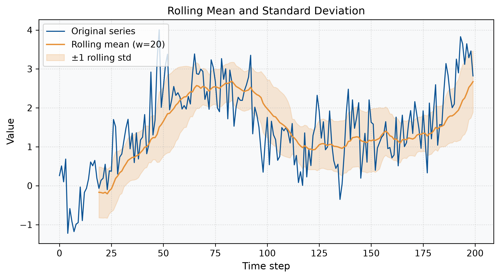

# 第 3 章 统计特征

统计特征是最直观、最常用的时间序列特征。它们从全局或局部窗口出发，用少量标量刻画序列的中心趋势、离散程度、分布形态与极值行为，为后续的分类、异常检测与预测提供基础输入。

## 本章目标

- 掌握常用的全局统计特征：均值、方差、标准差、偏度、峰度、极差、分位数等。
- 理解滑动窗口统计特征对非平稳序列的局部刻画能力。
- 能够使用 Python（`numpy`、`pandas`、`scipy`）计算并可视化这些特征。
- 了解统计特征在时序异常检测与分类中的典型应用。

## 1. 核心概念

给定长度为 $N$ 的时间序列 $\mathbf{x} = (x_1, x_2, \dots, x_N)$，最常用的全局统计特征包括：

- **均值（Mean）**：描述序列的中心位置
  $$
  \bar{x} = \frac{1}{N} \sum_{i=1}^{N} x_i
  $$

- **标准差（Standard Deviation）**：描述序列的离散程度
  $$
  \sigma = \sqrt{\frac{1}{N} \sum_{i=1}^{N} (x_i - \bar{x})^2}
  $$

- **偏度（Skewness）**：描述分布的不对称性
  $$
  \gamma_1 = \frac{1}{N} \sum_{i=1}^{N} \left( \frac{x_i - \bar{x}}{\sigma} \right)^3
  $$

- **峰度（Kurtosis）**：描述分布尾部的厚重程度
  $$
  \gamma_2 = \frac{1}{N} \sum_{i=1}^{N} \left( \frac{x_i - \bar{x}}{\sigma} \right)^4 - 3
  $$

- **极差（Range）** 与 **四分位距（IQR）**：
  $$
  \text{Range} = \max(\mathbf{x}) - \min(\mathbf{x})
  $$
  $$
  \text{IQR} = Q_3 - Q_1
  $$

## 2. 滑动窗口统计特征

全局统计量假设序列是平稳的，但实际工业时序往往具有趋势、季节性与局部波动。为此，我们引入**滑动窗口统计特征**：对长度为 $w$ 的窗口计算局部均值、标准差、最大值、最小值等，从而捕捉序列的局部动态。

设窗口长度为 $w$，则时刻 $t$ 的局部均值为：

$$
\bar{x}_t^{(w)} = \frac{1}{w} \sum_{i=t-w+1}^{t} x_i
$$

类似地可定义局部标准差 $\sigma_t^{(w)}$、局部最大值、局部最小值等。

## 3. Python 实践

下面的脚本构造一条带有趋势和噪声的随机游走序列，并计算其全局统计量与滑动窗口统计量。

```python
"""
03-example-01-rolling-stats.py
Generated for book/part-01-feature-extraction/03-statistical-features/README.md
"""
import numpy as np
import pandas as pd
from scipy import stats

# 1. 构造示例序列：趋势 + 随机游走 + 噪声
rng = np.random.default_rng(42)
n = 200
trend = np.linspace(0, 5, n)
walk = np.cumsum(rng.normal(scale=0.3, size=n))
noise = rng.normal(scale=0.5, size=n)
x = trend + walk + noise

# 2. 全局统计特征
print(f"均值:        {np.mean(x):.3f}")
print(f"标准差:      {np.std(x):.3f}")
print(f"偏度:        {stats.skew(x):.3f}")
print(f"峰度:        {stats.kurtosis(x):.3f}")
print(f"极差:        {np.ptp(x):.3f}")
print(f"中位数:      {np.median(x):.3f}")

# 3. 滑动窗口统计特征
s = pd.Series(x)
window = 20
rolling_mean = s.rolling(window=window).mean()
rolling_std = s.rolling(window=window).std()
rolling_max = s.rolling(window=window).max()
rolling_min = s.rolling(window=window).min()
```

完整可视化脚本见 [`assets/code/03-example-01-rolling-stats.py`](./assets/code/03-example-01-rolling-stats.py)，运行后将生成下图：



**图 3-1** 滚动均值与标准差示例。橙色实线为 20 步滚动均值，阴影区域表示 ±1 倍滚动标准差。

## 4. 应用提示

1. **异常检测**：当某时刻的取值超出局部均值 ±3 倍局部标准差时，可标记为潜在异常点。
2. **特征工程**：在时序分类任务中，可将全局统计量与多尺度窗口统计量拼接为特征向量，输入到随机森林或 XGBoost 中。
3. **平稳性判断**：若全局标准差与局部标准差差异很大，说明序列可能非平稳，需要先进行差分或变换。

## 5. 本章小结

- 统计特征是时序分析的基础，计算高效、解释性强。
- 全局统计量适合刻画平稳序列；滑动窗口统计量更适合非平稳序列。
- 实践中常将多种统计量组合使用，形成多维度特征向量。

## 参考与延伸阅读

- [本章引用](./references.md)
- [本章习题](./exercises.md)
- [附录 A：统计特征相关论文](../appendix/A-papers/README.md)

---

*本章图片由 Python 脚本生成，详见 `assets/code/03-example-01-rolling-stats.py`。*
