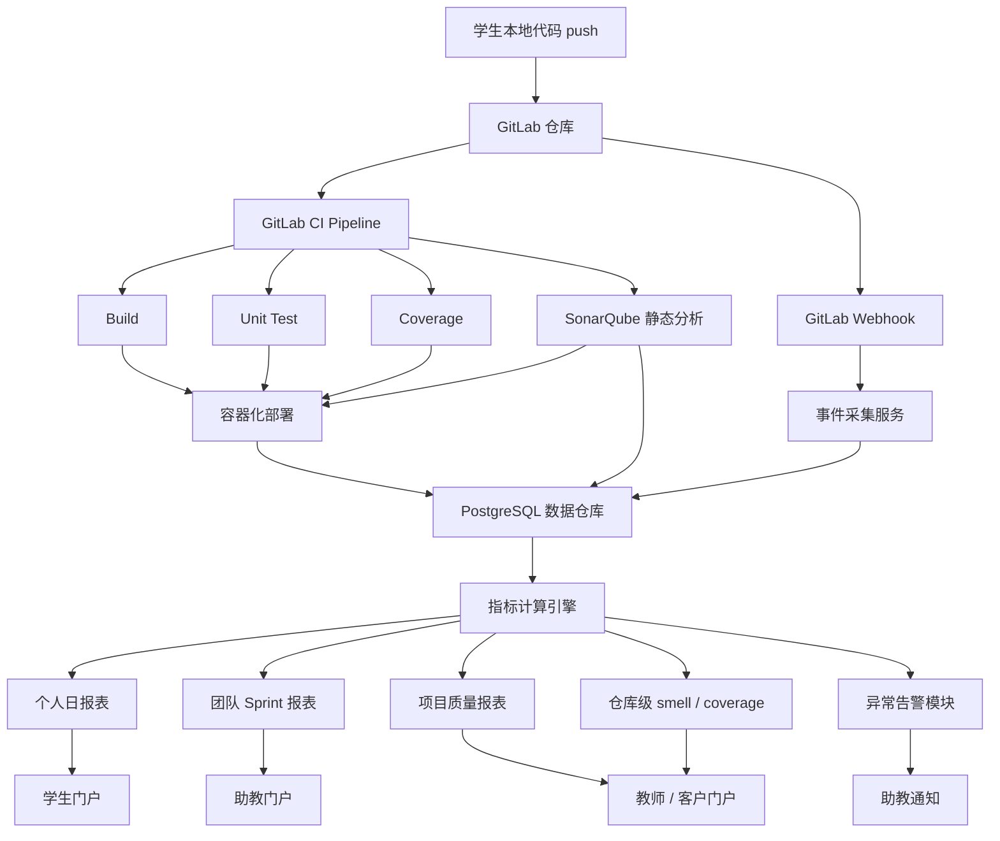
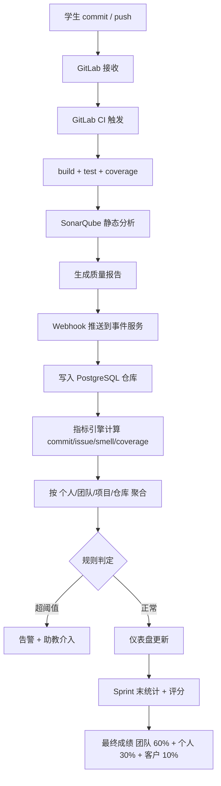

# DevOps Lab Platform: 面向多样化项目的敏捷软件工程教学平台（IEEE 2018）

> 作者：Xiaoying Bai、Dan Pei、Mingjie Li、Shanshan Li
> 机构：清华大学 计算机科学与技术系
> 发表年份：2018
> 会议/期刊：IEEE FIE 2018（Frontiers in Education Conference）
> 关联 PDF：同目录下 `08658817.pdf`

## 一、文档信息速览

| 字段 | 值 |
|---|---|
| 标题 | The DevOps Lab Platform for Managing Diversified Projects in Educating Agile Software Engineering |
| 作者 | Xiaoying Bai、Dan Pei、Mingjie Li、Shanshan Li |
| 机构 | 清华大学 计算机科学与技术系 |
| 发表年份 | 2018 |
| 会议/期刊 | IEEE FIE 2018（Research Work-in-Progress） |
| 分类 | 软件工程教育 / DevOps / 持续评估 / 项目管理 |
| 核心问题 | 100+ 学生的大班 SE 课程中，引入多元化真实项目后，如何公平、及时、量化地评估每组/每人的工程能力、协作能力与项目过程质量 |
| 主要贡献 | (1) 基于 GitLab + CI 的 DevOps 教学平台（自动 build/test/分析）；(2) 多维度量化指标（issue、commit、branch、test coverage、code smell）；(3) 在 4 年内累计 500+ 学生、130+ 项目团队的真实教学验证 |

## 二、背景（Background）

软件工程（SE）课程的教学改革普遍把"项目驱动的实践训练"作为核心：通过让学生参与真实或类真实的工业项目，掌握工程化开发、团队协作、项目管理以及沟通等综合能力。但是，当一个 SE 课程每学期有 100+ 学生时，传统的"全班做同一个项目"模式会出现两个问题：

1. **项目单一**：所有学生做相同的项目，能力培养被钉死在一种业务/技术上，无法覆盖现代软件工程的多样性。
2. **评估困难**：当学生组成 30+ 团队、与不同行业客户合作、采用不同技术栈时，仅靠助教人工打分既不高效也不公平。

论文指出，清华大学计算机系《软件工程导论》课程每学期约 150 名学生（来自大二/大三），大多数学生此前开发过的最大软件不足 1000 行代码，因此教学目标集中在"端到端系统设计、3-5 人团队协作、项目计划与任务分解、良好工程习惯（无坏味道、持续版本控制、覆盖率驱动测试）"。

为支持这种"项目多样化 + 大规模 + 工程化"的教学场景，作者团队设计并实现了一个 DevOps 教学平台：核心是 GitLab 代码仓库 + 持续集成（CI）框架，辅以静态分析、测试、部署与多维指标统计；并把软件工程中的 Agile/Scrum 流程按"5 个 Sprint × 1-2 周"切分到 10 周学期中。

## 三、目的（Problems Solved）

- **大规模 SE 课程的过程监管难题**：100+ 学生、30+ 团队、多个不同技术栈项目，仅靠人工"出勤+答辩"评分无法及时反馈。
- **学生工程习惯的培养与度量**：commit 大块代码、commit message 过于简单、长时间无 commit、覆盖率不足、坏味道累积等问题难以量化。
- **项目多样性的管理难题**：项目语言涵盖 Java、Python、JavaScript、TypeScript、C#、微信小程序；框架涵盖 Flask、Vue.js、WePY、Django、AIOHTTP、React、Unity、UE4、Spring 等，工具链必须足够灵活。
- **公平的过程评估**：评估必须兼顾"团队成果 + 个人贡献"、"最终交付 + 过程表现"、"开发能力 + 协作能力"。
- **可复用的教学基础设施**：经过多年迭代，平台应在 4 年累计 500+ 学生、130+ 项目团队规模上仍可稳定运行。

## 四、核心原理（Principles）

**总体思路**：以 GitLab 仓库为中心，通过 Webhook 把 commit / issue / merge / pipeline 事件自动触发静态分析、构建、测试、部署；用统一数据仓库（PostgreSQL）记录所有过程数据；在此基础上用各类指标（commit 频度、commit message 长度、commit 大小、issue 数、issue 关闭率、测试覆盖率、坏味道数等）刻画"个人 / 团队 / 项目 / 仓库"四个层级的表现。

**关键概念**：

- **DevOps 平台**：把开发（Dev）和运维（Ops）通过 CI/CD 流水线串接起来的工具链。
- **GitLab + CI**：基于 Git 仓库的内建持续集成框架，每次 commit 都会触发 .gitlab-ci.yml 中配置的 pipeline。
- **GitLab Issue**：用于任务管理，可加类型、状态、优先级、负责人、截止时间。
- **Sprint**：Scrum 中的迭代周期，本课程 1-2 周一个 Sprint，5 个 Sprint 覆盖 10 周。
- **Branching Pattern**：分支模式（Merge Your Own Code、Early Branching、Merge Often）。
- **Code Smell**：代码坏味道（Fowler 1999 定义），静态分析可自动检测。
- **Static Analysis**：静态分析工具（SonarQube/Pylint/ESLint/Checkstyle 等）。
- **COMMIT 指标**：每生每日 commit 数（频度 + 大小 + 消息长度）。
- **ISSUE 指标**：每生每 Sprint 分配 issue 数、关闭率、持续时间。
- **Kubernetes 微服务**：平台底层部署形态，把每个组件（项目管理、GitLab、Auth、CI、SonarQube、Build、Test、Analysis、Deployment）容器化。

**数学原理**：

为支撑过程评估，平台定义了一系列可量化的指标。下式给出 COMMIT 评估的"个人-日"统计公式（论文 Figure 5 描述的统计思想）：

$$
\text{COMMIT}_{\text{active}}(s, d) = \mathbb{1}\big[\#\text{commits of student } s \text{ on day } d \ge 1\big]
$$

$$
\text{COMMIT}_{\text{overload}}(s, d) = \mathbb{1}\big[\#\text{commits of student } s \text{ on day } d \ge 2\big]
$$

$$
\text{COMMIT}_{\text{size\_warn}}(c) = \mathbb{1}\big[\text{lines changed in } c > T_{\text{size}}\big]
$$

$$
\text{COMMIT}_{\text{msg\_warn}}(c) = \mathbb{1}\big[\text{length of } c.\text{message} < T_{\text{msg}}\big]
$$

对每生每 Sprint 的 issue 统计：

$$
\text{ISSUE}_{\text{assigned}}(s, k) = \sum_{i \in I_{s,k}} 1, \quad
\text{ISSUE}_{\text{closed}}(s, k) = \sum_{i \in I_{s,k}} \mathbb{1}[\text{status}(i)=\text{closed}]
$$

$$
\text{ISSUE}_{\text{close\_rate}}(s, k) = \frac{\text{ISSUE}_{\text{closed}}(s, k)}{\text{ISSUE}_{\text{assigned}}(s, k)}
$$

CI 覆盖率与坏味道数则直接由 SonarQube 报表导入数据仓库：

$$
\text{coverage}(r) = \frac{\text{LOC covered}}{\text{LOC executable}}, \quad
\text{smell\_count}(r) = \#\{\text{code smells in repo } r\}
$$

最终过程分按团队 / 个人两级加权：

$$
S_{\text{team}} = w_1 \cdot \text{coverage} + w_2 \cdot (1 - \text{smell\_count}/T_{\text{smell}}) + w_3 \cdot \text{ISSUE}_{\text{close\_rate}} + w_4 \cdot \text{COMMIT}_{\text{freq}}
$$

$$
S_{\text{individual}} = w_1' \cdot \frac{\#\text{commits}}{\overline{\#\text{commits}}} + w_2' \cdot \frac{\#\text{issues}}{\overline{\#\text{issues}}} + w_3' \cdot \text{peer\_review}
$$

其中 $T_{\text{size}}, T_{\text{msg}}, T_{\text{smell}}$ 均为可配置阈值。

**与现有方案的差异**：与单纯用 GitHub Classroom 相比，平台打通了 GitLab + 自定义分析 + Kubernetes 部署，所有指标汇聚到统一数据仓库；与手动打分相比，平台对"过程 + 质量"提供 24/7 自动化反馈。

## 五、算法详解（Algorithm）

1. **输入 / 输出**：
   - 输入：GitLab 上每个 commit、issue、merge request、CI pipeline、SonarQube 报告。
   - 输出：按日 / 按 Sprint / 按项目的过程指标报表；每生 / 每团队的过程分；"异常提交"告警。

2. **核心模块**：
   - **GitLab 仓库层**：存放学生代码、issue、wiki。
   - **CI/CD 层**：基于 `.gitlab-ci.yml` 触发 build、单元测试、覆盖率、部署。
   - **静态分析层**：集成 SonarQube + 各类 lint 工具，输出 code smell、coding style、vulnerability、maintainability 报告。
   - **数据汇聚层**：监听 GitLab webhook + SonarQube API，把数据写入 PostgreSQL 仓库。
   - **指标引擎**：按天 / Sprint / 项目 / 仓库 4 个粒度计算 commit、issue、branch、coverage、smell 等指标。
   - **可视化报表**：面向学生 / 助教 / 客户 / 老师四类角色生成不同视图。
   - **告警模块**：检出"超大 commit""消息过短""长时间不 commit""坏味道飙升"等异常。

3. **伪代码**：

```python
def collect_gitlab_events():
    """监听 GitLab webhook，把事件落到 PostgreSQL 仓库。"""
    for event in gitlab_webhook_stream():
        if event.type == "push":
            for commit in event.commits:
                db.insert("commits", {
                    "sha": commit.id,
                    "author": commit.author_email,
                    "ts": commit.timestamp,
                    "added": len(commit.added),
                    "modified": len(commit.modified),
                    "removed": len(commit.removed),
                    "message_len": len(commit.message),
                    "project_id": event.project_id,
                })
        elif event.type == "issue":
            db.upsert("issues", event.issue)

def commit_warnings(c):
    """对单个 commit 给出告警标记。"""
    flags = []
    if c.added + c.modified + c.removed > T_SIZE:  # e.g. 800 LOC
        flags.append("OVERSIZE")
    if c.message_len < T_MSG:                      # e.g. < 8 字符
        flags.append("MESSAGE_TOO_SHORT")
    if c.message_len > T_MSG_LONG:                 # e.g. > 200 字符
        flags.append("MESSAGE_TOO_LONG")
    return flags

def issue_metrics(student, sprint):
    """学生本 Sprint 的 issue 表现。"""
    assigned = db.query("issues", assignee=student, sprint=sprint)
    closed = [i for i in assigned if i.status == "closed"]
    durations = [(i.closed_at - i.created_at).days for i in closed]
    return {
        "assigned": len(assigned),
        "closed": len(closed),
        "close_rate": len(closed) / max(1, len(assigned)),
        "avg_duration": mean(durations) if durations else None,
    }

def process_score(team, sprint, weights):
    """团队过程分（coverage + smell + issue + commit 加权）。"""
    cov = sonarqube.coverage(team.repo)
    smells = sonarqube.smell_count(team.repo)
    issue_rate = issue_metrics(team, sprint)["close_rate"]
    commit_freq = commits_per_day(team, sprint)
    return (
        weights.coverage * cov
        + weights.smell * max(0.0, 1.0 - smells / T_SMELL)
        + weights.issue * issue_rate
        + weights.commit * min(commit_freq / T_FREQ, 1.0)
    )

def dispatch_alerts(team):
    """对每生 + 每仓库跑规则，超阈值则推送助教。"""
    for s in team.members:
        for c in db.recent_commits(s, days=1):
            for flag in commit_warnings(c):
                notify_ta(team.ta, s, c, flag)
        if days_since_last_commit(s) > T_INACTIVE:
            notify_ta(team.ta, s, "INACTIVE")
```

4. **关键数学**：见 §四。

5. **复杂度分析**：
   - 事件采集：$O(\#\text{events})$，写入 PostgreSQL 索引表。
   - 指标计算：单 Sprint 单团队 $O(\#\text{commits} + \#\text{issues} + \#\text{smells})$，整体按团队并行化。
   - 告警规则：$O(\#\text{commits in last 1 day} \times \#\text{rules})$。
   - 平台部署：Kubernetes 微服务扩展无状态服务即可。

6. **训练与推理**：
   - 不涉及模型训练；所有规则为可配置阈值（$T_{\text{size}}, T_{\text{msg}}, T_{\text{smell}}, T_{\text{freq}}$ 等）。
   - 推理 = 事件流上跑规则 + 写库 + 触发通知。

7. **示例**：学生 A 在 Spring 2017 课程中连日 commit 数为 1, 1, 1, 1, 0, 0, 0, 5, 2, 1, ...；系统判定其 4 天未 commit、提示助教介入；之后该学生恢复 commit 频度到 1+ 次/日，最终 COMMIT 指标处于班级中位水平。

## 六、系统架构图（Architecture）



## 七、流程图（Process Flow）



## 八、关键创新点（Key Innovations）

- **+ 大规模 SE 课程的工程化过程管理**：把 100+ 学生的多样化项目纳入同一 DevOps 流水线，4 年累计 500+ 学生、130+ 团队。
- **+ 多维度量化指标体系**：commit（频度/大小/消息）+ issue（分配/关闭/时长）+ branch（Merge Your Own Code/Early Branching/Merge Often）+ coverage + smell 五位一体。
- **+ Kubernetes 微服务化的教学平台**：项目管理、GitLab、Auth、CI、SonarQube、Build、Test、Analysis、Deployment 全部容器化。
- **+ 公平的过程评估**：兼顾"团队成果 + 个人贡献""最终交付 + 过程表现""开发能力 + 协作能力"。
- **+ 真实教学数据验证**：2017 Fall 141 名学生、33 团队、11 个项目、68 个 GitLab 仓库、3076 个 issue、14506 个 commit、64 天开发周期。

## 九、实验与结果（Experiments）

- **数据集 / 教学场景**：清华大学《软件工程导论》课程 4 年累计 500+ 学生、130+ 项目团队；2017 Fall 学期 141 学生、33 团队、11 项目、68 仓库。
- **对比 / Baseline**：同期清华另一门 SE 课程（无平台、仅人工采集 commit 数）。
- **主要指标**：每生每日 commit 数、commit 大小分布、commit message 长度、issue 关闭率、test coverage、code smell 数。
- **关键结果数字**：
  - 平均 70%+ 学生每个 Sprint 至少 2 个 issue；
  - 平均 70%+ 学生每天至少 1 次 commit；
  - 30%+ 学生每天 ≥2 次 commit；
  - 在连续 41 天内（2016 Fall），COMMIT 指标的平均值与中位数持续上升、标准差持续下降（学生工程习惯越来越好）；
  - 同时间段对比班（无平台）未观察到明显趋势。
- **消融 / 模式效果**：平台分别独立运行了 "Issue/Commit/Branch/Coverage/Smell" 等模块，缺哪个维度，最终成绩的"区分度"都会下降。
- **效率**：GitLab + Kubernetes 部署后，CI 流水线可在分钟级完成单仓库的 build + test + analysis。
- **可视化**：Figure 5 给出每生 issue 与 commit 分布；Figure 6 给出连续 41 天 COMMIT 指标随时间的均值/中位数/标准差变化。

## 十、应用场景（Use Cases）

- **高校 SE 大班教学**：100+ 学生的"项目驱动"课程的过程监管与公平评估。
- **企业新员工 Onboarding**：把同一套 GitLab+CI+SonarQube 平台用作"入职 3 个月工程习惯训练场"。
- **开源训练营 / 训练项目**：跟踪学员的 commit、issue、PR 质量。
- **跨校 / 跨国敏捷开发课程联盟**：统一指标、统一平台。
- **高中 / 职业院校编程实训**：把工程化流程以游戏化方式引入。

## 十一、相关论文（Related Papers in this set）

- `TraceSieve_ISSRE23`（追踪异常检测 / 微服务）
- `liu_imc15_Opprentice`（KPI 异常检测 / 无监督）
- `label-less-v3`（日志异常检测 / 无监督）
- `LogAnomaly`（日志异常检测）
- `OmniAnomaly_camera-ready`（多变量时序异常检测）
- `08723601`（异常检测综述）
- `chenwenxiao_infocom2019`（多源指标故障定位）
- `FluxInfer`（指标异常检测 + 解释）

## 十二、术语表（Glossary）

- **DevOps**：开发与运维一体化方法论。
- **CI / CD**：持续集成 / 持续部署。
- **GitLab**：开源代码仓库与 CI 平台。
- **SonarQube**：代码静态分析与质量平台。
- **Kubernetes**：容器编排系统。
- **Scrum**：敏捷开发框架。
- **Sprint**：Scrum 中的迭代周期。
- **Issue**：任务单。
- **Commit**：一次代码提交。
- **Branch**：分支。
- **Code Smell**：代码坏味道。
- **Test Coverage**：测试覆盖率。
- **Merge Your Own Code**：每个学生只能合并自己写的代码。
- **Early Branching**：新任务尽早开分支。
- **Merge Often**：频繁合并到主干。
- **Webhook**：事件回调机制。

## 十三、参考与延伸阅读

- Paper: M. Fowler, *Refactoring*（坏味道概念）。
- Paper: B. Appleton et al., *Streamed Lines: Branching Patterns for Parallel Software Development*（PLoP 1998）。
- 工具：GitLab、SonarQube、Codeface、PostgreSQL、Kubernetes、Docker。
- 课程：清华大学《软件工程导论》（CS 系本科必修课）。
- 相关论文：`TraceSieve_ISSRE23`、`liu_imc15_Opprentice`、`label-less-v3`、`LogAnomaly`、`OmniAnomaly_camera-ready`、`08723601`、`chenwenxiao_infocom2019`、`FluxInfer`。
