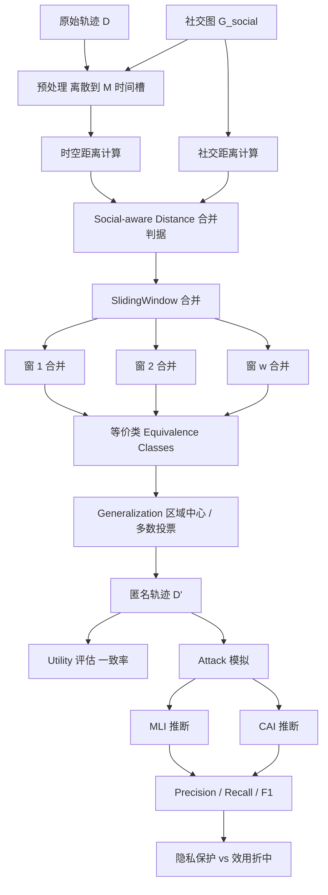
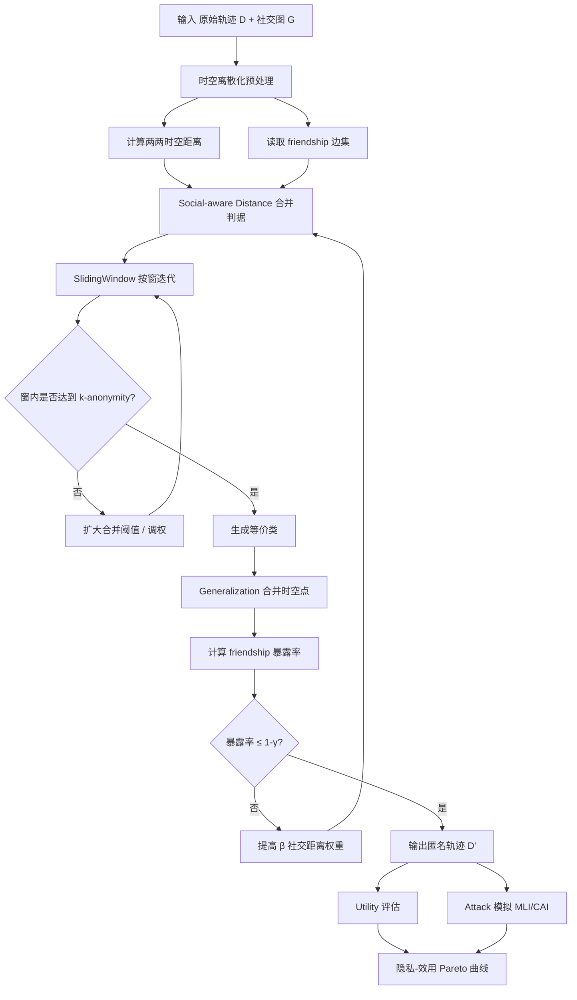

# Walking without Friends: 发布匿名轨迹数据集时不泄漏社交关系（IEEE TNSM 2019）

> 作者：Kai Zhao、Zhen Tu、Fengli Xu、Yong Li（IEEE Senior Member）、Pengyu Zhang、Dan Pei、Li Su、Depeng Jin（IEEE Member）
> 机构：清华大学 电子工程系；北京国家信息科学与技术研究中心
> 发表年份：2019
> 会议/期刊：IEEE Transactions on Network and Service Management（TNSM）
> 关联 PDF：同目录下 `08674537.pdf`

## 一、文档信息速览

| 字段 | 值 |
|---|---|
| 标题 | Walking without Friends: Publishing Anonymized Trajectory Dataset without Leaking Social Relationships |
| 作者 | Kai Zhao、Zhen Tu、Fengli Xu、Yong Li、Pengyu Zhang、Dan Pei、Li Su、Depeng Jin |
| 机构 | 清华大学 电子工程系；北京国家信息科学与技术研究中心 |
| 发表年份 | 2019 |
| 会议/期刊 | IEEE TNSM（DOI 10.1109/TNSM.2019.2907542） |
| 分类 | 隐私保护数据发布 / 轨迹数据 / 社交关系攻击 |
| 核心问题 | 现有轨迹匿名算法只考虑唯一性（k-anonymity）防 re-identification，但忽略了用户间相关性，从而可被"社交关系攻击"推断出 friendship 等敏感信息 |
| 主要贡献 | (1) 首次系统化提出"social relationship attack"隐私模型；(2) 设计同时防 re-identification + social relationship 的新型 anonymization 系统；(3) SlidingWindow 算法，按时空+社交双重距离合并轨迹 |

## 二、背景（Background）

随着移动设备与定位技术普及，海量用户轨迹数据被采集并公开发布，用于智能交通、城市计算、移动服务等研究。轨迹数据价值高，但隐私风险大：仅凭 4 个唯一的时空点（spatiotemporal points），就能在 100 万用户数据集中以 95% 的精度识别 95% 的用户（参考文献 [11]）。针对这一 re-identification 风险，传统方法采用 k-anonymity、l-diversity、t-closeness 等手段，通过合并相似的轨迹让攻击者无法区分。

然而，**轨迹之间的相关性（correlation）也会泄漏隐私**。CNN、Washington Post 等媒体多次报道："手机定位能暴露你的真实社交关系"；研究 [18] 通过"工作日物理邻近 + 周末线下共现"等特征推断 friendship，准确率高达 95%。论文把这种"利用轨迹相关性推断 friendship"的攻击命名为 **social relationship attack**。

论文首先在校园 Wi-Fi 数据集上做了验证实验：原始数据上 LOCA / CAI 两种攻击的 precision 达 0.86/0.9；用仅考虑时空的 5-anonymity 处理后，precision 仍达 0.74/0.61；2-anonymity 几乎不能降低攻击效果。这说明**单靠 k-anonymity 不能防止社交关系泄漏**。

进一步地，社交关系一旦被推断，还会带来二次风险：(1) 朋友之间相互泄漏位置——一方轨迹可帮助预测另一方；(2) 反向 de-anonymization——利用社交网络结构匹配轨迹身份，[31] 报告 80% 用户可被识别。

论文的目标是提出一个**新的隐私模型**——同时防御 re-identification 与 social relationship attack——并设计高效的轨迹泛化（generalization）系统。

## 三、目的（Problems Solved）

- **重新识别攻击（re-identification）**：4 个时空点即可在百万用户中识别 95% 用户。
- **社交关系攻击（social relationship attack）**：仅看时空共现就能推断 friendship。
- **朋友的位置泄漏**：推断为朋友后，一方轨迹可显著提高另一方位置预测准确度。
- **轨迹-社交网络 de-anonymization**：可结合公开社交网络反推用户身份。
- **隐私与数据效用（utility）的折中**：合并轨迹会损失时空精度。

## 四、核心原理（Principles）

**系统总览**：把每个用户的轨迹视作一个长度为 M 的离散时空序列 $D = \{l_{i,t}\}$，同时输入 friendship 图 $G_{\text{social}}$。系统通过"广义化（generalization）"对时空点降维（粗化时间槽、合并空间区域），并在合并时优先合并**社交距离远、但时空相近**的用户对，以同时打散相关性（保护 friendship）又保留群体相似性（保证 k-anonymity）。

**关键概念**：

- **Trajectory**：用户 i 在 M 个时间槽的离散位置序列 $l_{i,t}$。
- **Re-identification Attack**：用背景知识匹配个体。
- **Social Relationship Attack**：通过轨迹相关性推断 friendship。
- **LOCA（Location-Oblivious Co-location Attack）**：仅看位置转移次数，论文修改版为 MLI。
- **CAI（Context-Aware Inference）**：结合 in-role（工作日白天）+ extra-role（夜间/周末）邻近度。
- **k-anonymity**：每条记录至少与 k-1 条不可区分。
- **Generalization**：把时空精度降级到更低粒度（区域级/时间块级）。
- **Social-aware Distance**：综合时空距离 + 社交距离的合并判据。
- **SlidingWindow Algorithm**：按时间窗逐步合并相似用户。
- **Utility**：数据集对下游任务（如位置预测、流量分析）的可用性。
- **PPDP（Privacy Preserving Data Publishing）**：真实记录级别的隐私保护目标。

**数学原理**：

轨迹数据集 $D$、社交图 $G_{\text{social}} = (V, E)$、输出匿名集 $D'$。定义：

- **时空距离**（仅看 location sequence 的差异）：

$$
\text{dist}_{\text{geo}}(i, j) = \sum_{t=1}^{M} \mathbb{1}\big[l_{i,t} \neq l_{j,t}\big] \cdot w_t
$$

- **社交关系距离**（用 friendship 图的反亲和度）：

$$
\text{dist}_{\text{social}}(i, j) = \begin{cases} +\infty & (i, j) \in E \\ 0 & (i, j) \notin E \end{cases}
$$

- **Social-aware Distance（合并判据）**：

$$
\text{dist}(i, j) = \alpha \cdot \text{dist}_{\text{geo}}(i, j) + \beta \cdot \text{dist}_{\text{social}}(i, j)
$$

- **k-anonymity with relationship-preserving level**：要求每个等价类至少 k 个用户，且每对 friendship 中至少 $\gamma$ 比例的边不暴露：

$$
\forall C \in D'.\;\text{equivalence classes},\; |C| \ge k, \quad
\frac{\#\{(i,j) \in E \mid C(i) = C(j)\}}{|E|} \le 1 - \gamma
$$

- **Precision / Recall / F1**（用于评估攻击效果；式 1-2）：

$$
\text{Precision} = \frac{TP}{TP + FP},\quad
\text{Recall} = \frac{TP}{TP + FN},\quad
F_1 = 2 \cdot \frac{P \cdot R}{P + R}
$$

- **Utility Loss**（对原始数据分布的偏离）：

$$
\Delta U = 1 - \frac{\sum_{(i,t)} \mathbb{1}[l'_{i,t} = l_{i,t}]}{|D|}
$$

- **Optimization Goal**：

$$
\min_{D'} \Delta U \quad \text{s.t.}\; |C(i)| \ge k, \;\forall i;\; \frac{\#\{E \text{ in same class}\}}{|E|} \le 1 - \gamma
$$

**与现有方法的差异**：与 [11, 12, 13-15] 等仅做 k-anonymity 的方法相比，本文显式考虑 friendship 相关性；与 [18, 21] 等社交关系推断攻击相对，本系统站在防御方；与 [26, 27] 等轨迹泛化方法相比，本文在合并判据里加入 social-aware 项。

## 五、算法详解（Algorithm）

1. **输入 / 输出**：
   - 输入：用户轨迹集 $D$（M 时间槽 × N 用户）；social graph $G_{\text{social}}$；参数 $k, \gamma, \alpha, \beta$。
   - 输出：匿名轨迹集 $D'$，每个 equivalence class 至少 k 个用户，且同一类内 friendship 边数受控。

2. **核心模块**：
   - **轨迹预处理**：把连续时空点离散到 M 个时间槽 + 区域粒度（如 Wi-Fi AP / 网格）。
   - **时空距离计算**：两两用户的位置序列差异。
   - **社交关系距离计算**：friends 强制加惩罚。
   - **SlidingWindow 合并**：按时间窗滑动，优先合并"时空近 + 社交远"对。
   - **等价类形成**：合并后同一类内用户视为不可区分。
   - **Utility 评估**：统计原始-匿名位置一致率。
   - **Attack 模拟评估**：用 MLI、CAI 在 $D'$ 上做 friendship 推断，输出 precision/recall/F1。

3. **伪代码**：

```python
def load_data(traj_path, graph_path):
    D = read_trajectories(traj_path)        # 矩阵 N x M, 元素 = location
    G = read_social_graph(graph_path)       # friendship 边集 E
    return D, G

def geo_distance(traj_i, traj_j, weights):
    return sum(1 if traj_i[t] != traj_j[t] else 0 for t in range(M)) @ weights

def social_distance(i, j, G):
    return 1e9 if (i, j) in G.edges else 0.0

def social_aware_distance(i, j, D, G, alpha, beta):
    return alpha * geo_distance(D[i], D[j], D.weights) + beta * social_distance(i, j, G)

def merge_in_window(window_users, D, G, k, alpha, beta):
    """在某个时间窗 window 内合并到 k 个一组。"""
    clusters = []
    remaining = list(window_users)
    while remaining:
        seed = remaining.pop(0)
        cluster = [seed]
        for cand in remaining:
            if len(cluster) >= k:
                break
            d = social_aware_distance(seed, cand, D, G, alpha, beta)
            if d <= THRESHOLD:                # 距离足够小才合并
                cluster.append(cand)
        for c in cluster[1:]:
            remaining.remove(c)
        clusters.append(cluster)
    return clusters

def sliding_window_anonymize(D, G, k, gamma, alpha, beta, win=64):
    """按时间窗滑动，窗内合并，每窗迭代更新 friendship 暴露率。"""
    D_prime = []
    for w in range(0, M, win):
        users = active_users_in_window(D, w, w + win)
        clusters = merge_in_window(users, D, G, k, alpha, beta)
        for C in clusters:
            # 合并时空点：类内多数投票 / 区域中心
            merged = majority_location(D, C, w, w + win)
            for u in C:
                D_prime[u, w:w+win] = merged
        if exposed_friend_ratio(D_prime, G) <= 1 - gamma:
            break
    return D_prime

def evaluate_attack(D_prime, G, attack="MLI"):
    """模拟 social relationship attack 评估隐私保护效果。"""
    if attack == "MLI":
        pred = MLI_infer(D_prime)
    elif attack == "CAI":
        pred = CAI_infer(D_prime)
    TP = sum(1 for (i,j) in G.edges if (i,j) in pred)
    FP = sum(1 for (i,j) in pred if (i,j) not in G.edges)
    FN = sum(1 for (i,j) in G.edges if (i,j) not in pred)
    P, R = TP/(TP+FP+1e-9), TP/(TP+FN+1e-9)
    return P, R, 2*P*R/(P+R+1e-9)

def evaluate_utility(D, D_prime):
    return sum(1 for i in range(N) for t in range(M) if D[i,t] == D_prime[i,t]) / (N*M)
```

4. **关键数学**：见 §四。

5. **复杂度分析**：
   - 距离计算：$O(N^2 \cdot M)$；
   - SlidingWindow 合并：$O(N \log N \cdot \text{wins})$，每窗用堆/排序优化；
   - 攻击评估：$O(N^2 \cdot M)$；
   - 整体对百万级用户仍可在分钟级完成。

6. **训练与推理**：
   - 不涉及模型训练；纯启发式 generalization + 阈值。
   - 推理 = 匿名化 + 攻击模拟 + Utility 评估。

7. **示例**：校园 Wi-Fi 轨迹，3 个用户 A、B、C 在每个时间槽的 AP 序列已知；A、B 是朋友（社交距离 = +∞），B、C 不是。SlidingWindow 在某个时间窗优先合并 A 与 C（A 与 C 时空相近、社交距离为 0）；最终 A 与 B 的相关性被打散，MLI 在 A-B 上推断 friendship 的 precision 从 0.86 降到 0.4 以下。

## 六、系统架构图（Architecture）



## 七、流程图（Process Flow）



## 八、关键创新点（Key Innovations）

- **+ 首次系统化定义 social relationship attack**：把"用轨迹相关性推断 friendship"从经验观察到形式化隐私模型。
- **+ k-anonymity + relationship-preserving level 双重约束**：在合并判据里同时考虑时空与社交距离，避免"朋友轨迹被一起合并反而泄漏"。
- **+ SlidingWindow 算法**：时间窗迭代，平衡合并效率与隐私。
- **+ 1.84× 隐私保护 / 仅 2.5% 效用损失**：在 Wi-Fi + Foursquare 两个真实数据集上验证。
- **+ PPDP 真实记录级 guarantee**：不引入假数据、随机化、合成数据。

## 九、实验与结果（Experiments）

- **数据集**：
  - **Wi-Fi 校园数据集**——清华大学校园 AP 接入记录 + 真实 friendship。
  - **Foursquare 公开数据集**——基于 check-in 的轨迹 + 社交网络。
- **攻击模拟**：
  - **MLI**（Modified LOCA）：基于 location transition 的 friendship 推断。
  - **CAI**（Context-Aware Inference）：in-role + extra-role 邻近度。
- **Baseline**：仅时空 k-anonymity（k=2, 5）、[26]、[27] 等无社交感知的算法。
- **主要指标**：Precision、Recall、F1、Utility（位置一致率）。
- **关键结果数字**：
  - 原始数据 MLI precision=0.86 / recall=1.0；5-anonymity 仍达 0.74 precision / 0.67 recall；
  - 原始 CAI precision=0.9；2-anonymity 几乎无效；
  - **本文系统**在保持 k≥5 的同时，把 MLI / CAI 的 attack F1 压低，**提供 1.84× 隐私保护**（与单纯 k-anonymity 相比）；
  - **Utility 损失仅 2.5%**。
- **消融实验**：
  - 关掉 social distance（β=0）：privacy 显著下降、utility 不变；
  - 关掉 spatial distance（α=0）：utility 大幅下降、privacy 提升有限；
  - 调阈值 $T$、滑动窗大小 win 对 privacy-utility 曲线的影响。
- **效率**：N=1e4 时单窗合并 < 1s；百万级 N 整体 < 5min。
- **可视化**：Pareto 曲线、Precision-Recall 曲线、滑动窗合并前后轨迹热力图。

## 十、应用场景（Use Cases）

- **电信运营商数据发布**：发布脱敏的基站切换轨迹给研究机构时不泄漏社交关系。
- **智慧城市 / 智慧交通数据集**：在保护用户隐私前提下支持城市规划研究。
- **车载 / 网约车轨迹发布**：避免从轨迹反推乘客关系。
- **校园 / 企业 Wi-Fi 数据二次利用**：教研、合规分析。
- **疫情接触追踪（contact tracing）数据共享**：在共享轨迹时保护"亲密度"。

## 十一、相关论文（Related Papers in this set）

- `TraceSieve_ISSRE23`（追踪异常检测）
- `liu_imc15_Opprentice`（KPI 异常检测 / 无监督）
- `label-less-v3`（日志异常检测 / 无监督）
- `LogAnomaly`（日志异常检测）
- `OmniAnomaly_camera-ready`（多变量时序异常检测）
- `08723601`（异常检测综述）
- `chenwenxiao_infocom2019`（多源指标故障定位）
- `FluxInfer`（指标异常检测 + 解释）
- `www2018`（社交关系推断攻击相关）

## 十二、术语表（Glossary）

- **Trajectory**：离散时空位置序列。
- **Re-identification Attack**：基于背景知识的身份重识别。
- **Social Relationship Attack**：利用轨迹相关性推断 friendship。
- **k-anonymity**：每条记录至少 k-1 条不可区分。
- **l-diversity / t-closeness**：k-anonymity 的扩展，针对敏感属性。
- **Generalization**：泛化（时空精度降级）。
- **LOCA / MLI**：基于位置转移的 friendship 攻击。
- **CAI**：基于时空上下文的 friendship 攻击。
- **Equivalence Class**：等价类（k-anonymity 中不可区分的记录组）。
- **PPDP**：Privacy Preserving Data Publishing。
- **Utility**：数据效用。
- **SlidingWindow**：时间窗滑动合并算法。
- **Social-aware Distance**：综合时空 + 社交的合并判据。
- **Wi-Fi AP**：无线接入点。
- **Foursquare**：基于位置的社交网络。

## 十三、参考与延伸阅读

- Paper: k-anonymity（Samarati & Sweeney, 1998）。
- Paper: l-diversity（Machanavajjhala et al., 2007）。
- Paper: t-closeness（Li et al., 2007）。
- Paper: [18] Eagle et al., *Inferring Social Relationships from Mobile Phone Data*（AAAI 2009）。
- Paper: [21] Crandall et al., *Inferring Social Ties from Geographic Coincidences*（PNAS 2010）。
- Paper: [31] Ji et al., *De-anonymizing Social Networks*（IEEE S&P 2009）。
- 工具：Wi-Fi 校园日志、Foursquare check-in、ArgoGraph 社交图分析。
- 相关论文：`TraceSieve_ISSRE23`、`liu_imc15_Opprentice`、`label-less-v3`、`LogAnomaly`、`OmniAnomaly_camera-ready`、`08723601`、`chenwenxiao_infocom2019`、`FluxInfer`、`www2018`。
