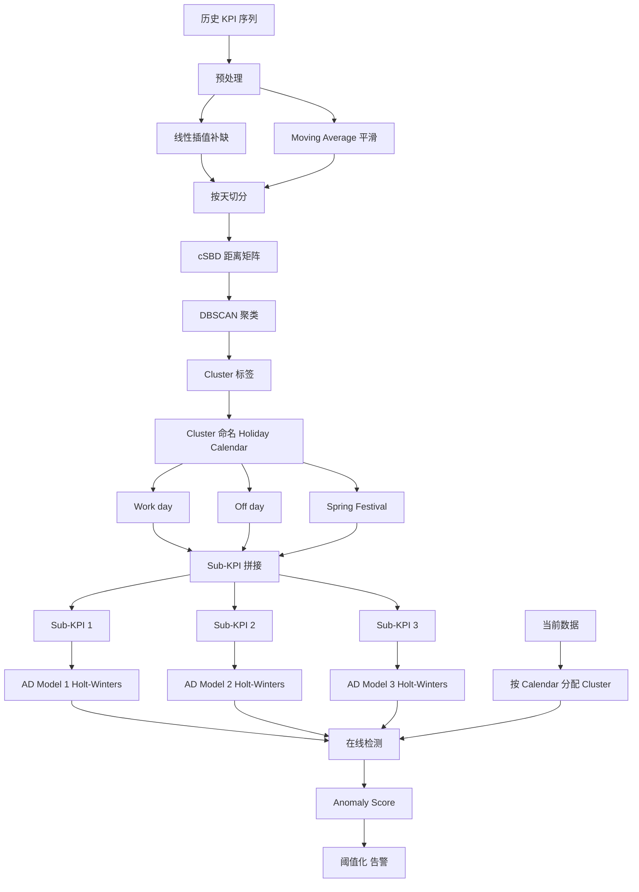
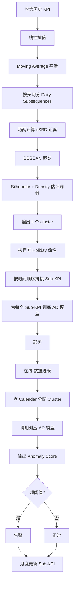

# Period: Automatic and Generic Periodicity Adaptation for KPI Anomaly Detection（IEEE TNSM 2019）

> 作者：Nengwen Zhao、Jing Zhu（通讯）、Yao Wang、Minghua Ma、Wenchi Zhang、Dapeng Liu、Ming Zhang、Dan Pei
> 机构：清华大学；北京国家信息科学与技术研究中心（BNRist）；BizSeer；中国建设银行
> 发表年份：2019
> 会议/期刊：IEEE Transactions on Network and Service Management（TNSM, DOI 10.1109/TNSM.2019.2919327）
> 关联 PDF：同目录下 `08723601.pdf`

## 一、文档信息速览

| 字段 | 值 |
|---|---|
| 标题 | Automatic and Generic Periodicity Adaptation for KPI Anomaly Detection |
| 作者 | Nengwen Zhao、Jing Zhu、Yao Wang、Minghua Ma、Wenchi Zhang、Dapeng Liu、Ming Zhang、Dan Pei |
| 机构 | 清华大学；BNRist；BizSeer；中国建设银行 |
| 发表年份 | 2019 |
| 会议/期刊 | IEEE TNSM |
| 分类 | KPI 异常检测 / 周期自适应 / 通用框架 |
| 核心问题 | 工业 KPI 受工作日/休息日/节日/促销影响呈现"周期性档案（periodicity profile）"，现有方法需要人工指定 season length，复杂/不完美周期下效果差 |
| 主要贡献 | (1) Period 框架：自动检测 KPI 的周期性档案，无需人工指定周期；(2) 基于约束形状距离 cSBD + DBSCAN 的日级子序列聚类；(3) 在 56 个真实 KPI 上把 SOTA 方法 F-score 最高提升 0.66 |

## 二、背景（Background）

KPI（Key Performance Indicator，如 PV、在线用户数、CPU 利用率）是监控互联网服务（搜索引擎、电商、社交网络）健康度的核心数据。KPI 异常（如 jitters、ramp-up、spikes、dips）往往预示着服务器故障、过载、网络异常、外部攻击等。及时准确地检测 KPI 异常是 AIOps 的基础。

由于用户行为受工作日、休息日、节日（如春节）、促销活动等影响，KPI 不会呈现"简单周期性"——同一个 KPI 在不同日子里可能呈现完全不同的形状，这种"每天的形状集合"被称为 **periodicity profile**。论文 Figure 1 给出真实例子：电商 TPS 在工作日高、双休日低、春节期间进一步下降。

现有 KPI 异常检测方法可以分为三类：
1. **传统异常检测器**：MA、EWMA、Holt-Winters、TSD。这些方法需要 season length 作为参数，而人工常把参数误设为"天"或"周"，结果在复杂周期下产生大量 FP/FN。
2. **监督集成**：Opprentice、EGADS。需要大量标注。
3. **无监督**：Donut 等。仍依赖超参或简单周期假设。

不论哪一类，都没有**通用、自动**地适配复杂 periodicity profile 的能力。开源/商业监控工具（Graphite、Prometheus、Grok、Kibana 等）大多要求人工配 season length；Anodot 试图用 ACF 自适应但效果有限（仅能输出 1 个数字，无法应对"一个 KPI 内有多个 daily pattern"的情况）。

论文提出 **Period** 框架，核心思想是：把"未知周期"问题转化为"在 k 个 clear daily periodicity 的子 KPI 上分别做异常检测"，而这 k 个子 KPI 由"日级子序列聚类"自动得到。

## 三、目的（Problems Solved）

- **人工指定 season length 不可靠**：复杂/不完美周期下，TSD-day / TSD-week 都会产生 FP/FN。
- **周期检测不准确**：Periodogram（DFT）和 ACF 在长周期下精度差、易被 anomalies 干扰。
- **同一天内多个 pattern**：电商 TPS 在"工作日"和"春节"完全不同，必须分模型。
- **业务活动注入新 pattern**：每周五促销 → 出现新日型，模型需能自动感知。
- **零配置 / 通用**：适用于 100+ KPI 的工业场景。

## 四、核心原理（Principles）

**系统总览**：Period 分两阶段——(1) 离线周期性检测（preprocess → cSBD 距离 → DBSCAN 聚类 → 命名）；(2) 在线异常检测适配（按官方 holiday 日历把当天数据分配到对应 cluster 的 AD 模型）。每个 cluster 对应一个 sub-KPI，sub-KPI 内有"清晰的每日周期"，任何传统 AD 模型（HW、EWMA、Donut 等）都能直接应用。

**关键概念**：

- **KPI**：Key Performance Indicator 监控指标。
- **Periodicity Profile**：KPI 在不同"日型"上呈现的形状集合。
- **Daily Subsequence**：一天内的 KPI 序列片段。
- **Imperfect Periodicity**：不完美周期（工作日 vs 周末 vs 节日）。
- **Constrained Periodicity Drift**：受控周期漂移——同一活动在 10:00-14:00 内发生，shape 大致相同但时间略有偏移。
- **cSBD**：constrained Shape-Based Distance，论文定义的距离。
- **DBSCAN**：基于密度的聚类，可自动输出 k。
- **Periodogram**：基于 DFT 功率谱的周期检测。
- **ACF**：自相关函数。
- **AD Adaptation**：把当前数据分配到正确的 AD 模型。

**数学原理**：

- **Periodogram**（式 1-2）：

$$
P(k/N) = \|X(k/N)\|^2,\quad
X(k/N) = \frac{1}{\sqrt{N}} \sum_{n=0}^{N-1} x(n) e^{-j 2\pi k n / N}
$$

其中 $X$ 是 DFT，输出能量谱；最大能量处对应推断的 season length。

- **Auto-correlation Function**（式 3）：

$$
\text{ACF}(l) = \frac{\sum_{i=0}^{N-1} x(i) x(i+l)}{N}
$$

第一个峰值对应的 lag 即推断周期。

- **Shape-Based Distance (SBD)**（基础距离，对 shift 鲁棒）：

给定两个序列 $\vec{x}, \vec{y}$，先归一化，然后计算 cross-correlation $CC_w(\vec{x}, \vec{y})$，取最大值 $CC^* = \max_w CC_w$；最后：

$$
\text{SBD}(\vec{x}, \vec{y}) = 1 - \frac{CC^*}{\|\vec{x}\|_2 \cdot \|\vec{y}\|_2}
$$

- **Constrained SBD (cSBD)**：仅在受控 shift 范围 $[-w, w]$ 内取 max，复杂度 $O(m \log m)$（用 FFT）。

$$
\text{cSBD}_w(\vec{x}, \vec{y}) = 1 - \frac{\max_{|s| \le w} CC_s(\vec{x}, \vec{y})}{\|\vec{x}\|_2 \cdot \|\vec{y}\|_2}
$$

- **DBSCAN 聚类**：用 cSBD 作为距离，DBSCAN 自身可推断 k，无需事先指定。

- **Cluster Accuracy (ACC)**：通过 Hungarian 算法把聚类标签与真类标签最佳对齐后的准确率。

$$
\text{ACC} = \frac{1}{n} \sum_{i=1}^{n} \mathbb{1}[r_i = \text{map}(r'_i)]
$$

- **Normalized Mutual Information (NMI)**：评估聚类质量的归一化互信息。

$$
\text{NMI} = \frac{2 \cdot I(R; R')}{H(R) + H(R')}
$$

- **F-score 改进**：对每个 baseline AD 模型，把其输出接 Period 适配层，在 56 个 KPI 上 best F-score 提升最高达 0.66。

**与现有方法的差异**：与 Anodot 用的 ACF 相比，cSBD 对 shift 鲁棒且能输出多个 cluster；与 K-medoids、Spectral 相比，DBSCAN 不用预设 k；与传统 AD 模型相比，Period 是"插件式"适配层。

## 五、算法详解（Algorithm）

1. **输入 / 输出**：
   - 输入：KPI 历史数据 $x_{1..N}$；官方 holiday 日历。
   - 输出：k 个 cluster（带名称，如 work day / off day / Spring Festival）；k 个 AD 模型；每个新时间点的 anomaly label。

2. **核心模块**：
   - **Preprocess**：线性插值补缺；Moving Average 平滑；按天切分为 daily subsequences。
   - **cSBD Distance**：受控 shape-based distance，复杂度 $O(m \log m)$。
   - **DBSCAN Clustering**：自动输出 cluster 数 k。
   - **Cluster Naming**：根据 cluster 的时间分布 + 官方 holiday 日历命名（work day / off day / Spring Festival）。
   - **Sub-KPI Concatenation**：把同一 cluster 的 daily subsequences 按时间顺序串成 sub-KPI，sub-KPI 内有"清晰每日周期"。
   - **Per-Cluster AD Model Training**：用 Holt-Winters、Donut、Opprentice 等任一 AD 模型独立训练每个 sub-KPI。
   - **Online Adaptation**：当前数据按官方日历分配到 cluster，调用对应 AD 模型。

3. **伪代码**：

```python
def preprocess_kpi(x, ma_window=30):
    x = linear_interpolate(x)
    x = moving_average(x, window=ma_window)
    return x

def cSBD(x, y, w):
    """Constrained Shape-Based Distance, shift range [-w, w]."""
    nx = (x - x.mean()) / (x.std() + 1e-9)
    ny = (y - y.mean()) / (y.std() + 1e-9)
    cc = cross_correlation_via_fft(nx, ny)
    cc_constrained = cc[len(cc)//2 - w: len(cc)//2 + w + 1]
    return 1.0 - cc_constrained.max() / (np.linalg.norm(nx) * np.linalg.norm(ny) + 1e-9)

def cluster_daily_subsequences(daily_seqs, eps, min_samples, w):
    n = len(daily_seqs)
    dist = np.zeros((n, n))
    for i in range(n):
        for j in range(i+1, n):
            d = cSBD(daily_seqs[i], daily_seqs[j], w)
            dist[i, j] = dist[j, i] = d
    # DBSCAN
    from sklearn.cluster import DBSCAN
    db = DBSCAN(eps=eps, min_samples=min_samples, metric="precomputed").fit(dist)
    return db.labels_

def name_clusters(labels, daily_dates, holiday_calendar):
    """根据 cluster 在日历中的分布命名。"""
    names = {}
    for c in set(labels):
        if c == -1: continue
        dates = [daily_dates[i] for i, l in enumerate(labels) if l == c]
        weekday_ratio = sum(1 for d in dates if d.weekday() < 5) / len(dates)
        in_festival = sum(1 for d in dates if d in holiday_calendar.festival) / len(dates)
        if in_festival > 0.5: names[c] = "Spring Festival"
        elif weekday_ratio > 0.7: names[c] = "Work day"
        else: names[c] = "Off day"
    return names

def build_sub_kpis(daily_seqs, labels, k):
    sub_kpis = {c: [] for c in set(labels) if c != -1}
    for seq, l in zip(daily_seqs, labels):
        if l != -1:
            sub_kpis[l].append(seq)
    # Concatenate chronologically
    return {c: np.concatenate(seqs) for c, seqs in sub_kpis.items()}

def train_ad_models(sub_kpis, ad_algo="HoltWinters"):
    models = {}
    for c, x in sub_kpis.items():
        if ad_algo == "HoltWinters":
            models[c] = HoltWinters(period=len(daily_seqs[0])).fit(x)
        elif ad_algo == "Donut":
            models[c] = Donut(window=120).fit(x)
    return models

def online_adapt_and_detect(models, cluster_names, holiday_calendar, today, today_data):
    c = assign_cluster(today, cluster_names, holiday_calendar)
    score = models[c].anomaly_score(today_data)
    return score

def period_pipeline(x, holiday_calendar, ad_algo="HoltWinters"):
    x = preprocess_kpi(x)
    daily_seqs = cut_by_day(x)
    labels = cluster_daily_subsequences(daily_seqs, eps=0.3, min_samples=5, w=24)
    cluster_names = name_clusters(labels, [d for d, _ in daily_seqs], holiday_calendar)
    sub_kpis = build_sub_kpis([s for _, s in daily_seqs], labels, len(set(labels))-1)
    models = train_ad_models(sub_kpis, ad_algo=ad_algo)
    return models, cluster_names
```

4. **关键数学**：见 §四。

5. **复杂度分析**：
   - 预处理：$O(N)$；
   - cSBD 距离计算：$O(n^2 \cdot m \log m)$，$n$ 为日数；
   - DBSCAN 聚类：$O(n^2)$；
   - AD 模型训练（每 cluster 独立）：$O(k \cdot T_{AD})$，$T_{AD}$ 是单个 AD 训练时间；
   - 整体对 100+ KPI 可在分钟级完成 offline 阶段。

6. **训练与推理**：
   - 训练：历史 KPI → preprocess → cSBD + DBSCAN → sub-KPI → per-cluster AD；
   - 推理：当前数据 → 按 calendar 分配到 cluster → 调用对应 AD → anomaly score。

7. **示例**：银行 TPS KPI A 6 个月 1 分钟粒度，含 3 个 daily pattern。Period 自动聚出 work day / off day / Spring Festival 三个 cluster；为每个 cluster 训练 Holt-Winters；在线时按 official holiday 调对应模型；在与 4 个 baseline (HW、EWMA、MA、TSD) 结合时 F-score 平均提升 0.2+。

## 六、系统架构图（Architecture）



## 七、流程图（Process Flow）



## 八、关键创新点（Key Innovations）

- **+ 自动周期检测**：无需人工指定 season length。
- **+ 多个 daily pattern 联合建模**：一个 KPI 内可有 work day / off day / Spring Festival 等多个 pattern。
- **+ cSBD 距离**：用 FFT 把 shift 鲁棒距离降到 $O(m \log m)$，并支持受控 shift 范围。
- **+ DBSCAN 聚类**：无需预设 k，自动通过密度估计给出。
- **+ 插件式 AD Adaptation**：任何 baseline AD 模型（HW、Donut、Opprentice、MA、EWMA、TSD）都可插入 Period 提升 F-score。
- **+ 真实工业 KPI 验证**：在 6 个银行 + 50 个其他业务 KPI 上，best F-score 最高提升 0.66。

## 九、实验与结果（Experiments）

- **数据集**：
  - 6 个真实 KPI（A-F）来自某大型商业银行实时监控系统；
  - 50 个额外 KPI 来自大型商业服务，用于验证通用性；
  - 监控间隔 1-30 分钟，KPI 数量 105-336 天；
  - KPI 类型包括 TPS、CPU 利用率、内存利用率。
- **聚类 baseline**：K-medoids、Spectral Clustering；距离度量 baseline：ED（欧氏距离）、cDTW。
- **AD baseline**：Holt-Winters、EWMA、MA、TSD、Diff、Opprentice、Donut、EGADS。
- **主要指标**：ACC、NMI、Precision、Recall、F-score、Wilcoxon 显著性检验。
- **关键结果数字**：
  - **聚类准确率**：Period 在 6 个 KPI 上 ACC 平均 ~0.95；
  - **F-score 提升**：在 56 个 KPI 上把多种 SOTA AD 方法的 best F-score 最高提升 **0.66**；
  - **Wilcoxon 检验**：Period 适配后 vs 原始 baseline，p<0.01（99% 置信度）；
  - **ROC**：Period 适配后的 HW、Donut 在 TPR/FPR 上均优于 baseline。
- **消融实验**：
  - cSBD vs ED vs cDTW：cSBD 在 ACC/NMI 上均更优；
  - DBSCAN vs K-medoids vs Spectral：DBSCAN 自动推断 k 胜出；
  - 受控 shift 范围 $w$：太短导致真实漂移被惩罚，太长导致不同 pattern 误聚。
- **效率**：Table II 给出 cSBD + DBSCAN 在 6 个 KPI 上的运行时间，单 KPI < 数秒。
- **可视化**：Figure 10 ACC / NMI 对比；Figure 12 best F-score 对比；ROC 曲线。

## 十、应用场景（Use Cases）

- **大型商业银行 KPI 监控**：TPS、CPU、内存。
- **电商 PV / GMV 监控**：含促销、618、双 11 等活动。
- **互联网服务（搜索 / 社交 / 视频）在线用户监控**：节假日、突发热点。
- **电信运营商 KPI 监控**：通话量、流量。
- **工业 IoT 传感器时序监控**：含工作 / 维护周期。

## 十一、相关论文（Related Papers in this set）

- `TraceSieve_ISSRE23`（追踪异常检测）
- `liu_imc15_Opprentice`（KPI 异常检测 / 无监督）
- `label-less-v3`（日志异常检测 / 无监督）
- `LogAnomaly`（日志异常检测）
- `OmniAnomaly_camera-ready`（多变量时序异常检测）
- `FluxInfer`（指标异常检测 + 解释）
- `chenwenxiao_infocom2019`（多源指标故障定位）
- `www2018`（基于 KPI 的 AIOps / 异常检测）

## 十二、术语表（Glossary）

- **KPI**：Key Performance Indicator。
- **Periodicity Profile**：周期档案。
- **Imperfect Periodicity**：不完美周期。
- **Daily Subsequence**：按天切分的 KPI 片段。
- **Constrained Periodicity Drift**：受控周期漂移。
- **cSBD**：constrained Shape-Based Distance。
- **SBD**：Shape-Based Distance。
- **DBSCAN**：Density-Based Spatial Clustering of Applications with Noise。
- **DFT / FFT**：离散傅里叶变换 / 快速傅里叶变换。
- **Periodogram**：功率谱。
- **ACF**：Auto-correlation Function，自相关函数。
- **Holt-Winters (HW)**：三次指数平滑。
- **EWMA / MA**：指数加权 / 普通移动平均。
- **TSD**：Time Series Decomposition。
- **Donut**：基于 VAE 的无监督 KPI 异常检测。
- **Opprentice**：基于 ensemble 的监督 KPI 异常检测。
- **EGADS**：Yahoo 异常检测平台。
- **ACC / NMI**：聚类准确率 / 归一化互信息。
- **F-score**：分类 F1。

## 十三、参考与延伸阅读

- Paper: Holt-Winters, *Forecasting seasonals and trends by exponentially weighted moving averages*。
- Paper: Donut, *Unsupervised Anomaly Detection for Seasonal KPIs in Web Applications*（Xu et al., WWW 2018）。
- Paper: Opprentice, *Opprentice: Towards Practical and Automatic Anomaly Detection Through Machine Learning*（Liu et al., IMC 2015）。
- Paper: SBD, *Generic and Robust Localization of Multi-Dimensional Time Series Motifs*（Papadimitriou et al., 2014）。
- Paper: DBSCAN, *A Density-Based Algorithm for Discovering Clusters in Large Spatial Databases with Noise*（Ester et al., KDD 1996）。
- 工具：Holt-Winters、Donut、Opprentice、EGADS、Anodot、Prometheus、Grok、Kibana。
- 相关论文：`TraceSieve_ISSRE23`、`liu_imc15_Opprentice`、`label-less-v3`、`LogAnomaly`、`OmniAnomaly_camera-ready`、`FluxInfer`、`chenwenxiao_infocom2019`、`www2018`。
