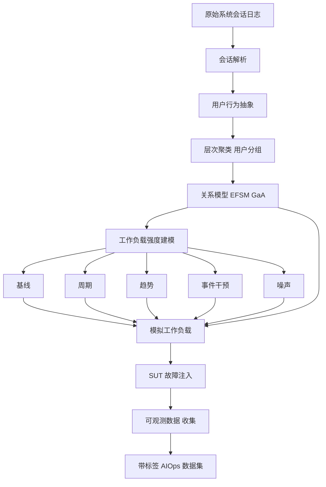
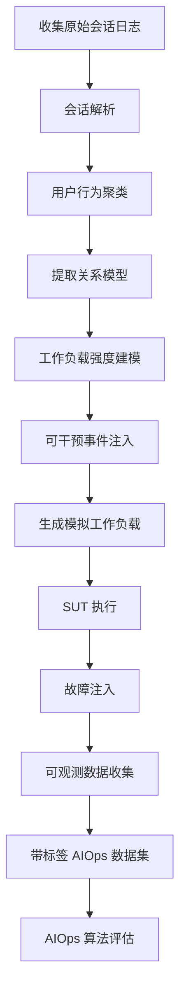

# LWS: A Framework for Log-based Workload Simulation in Session-based SUT（Journal of Systems & Software 2023）

> 作者：Yongqi Han、Qingfeng Du、Jincheng Xu、Shengjie Zhao、Zhekang Chen、Li Cao、Kanglin Yin、Dan Pei  
> 机构：同济大学软件学院；Bizseer；清华大学计算机科学与技术系  
> 发表年份：2023  
> 会议/期刊：The Journal of Systems & Software, Volume 203, 111735 (Elsevier)  
> 关联 PDF：同目录下 `1-s2.0-S0164121223001309-main.pdf`

## 一、文档信息速览

| 字段 | 值 |
|---|---|
| 标题 | LWS: A framework for log-based workload simulation in session-based SUT |
| 作者 | Yongqi Han、Qingfeng Du、Jincheng Xu、Shengjie Zhao、Zhekang Chen、Li Cao、Kanglin Yin、Dan Pei |
| 机构 | 同济大学；Bizseer；清华大学 |
| 发表年份 | 2023 |
| 会议/期刊 | The Journal of Systems & Software（Elsevier） |
| 分类 | AIOps 数据集生成 / 工作负载模拟 / 日志挖掘 |
| 核心问题 | AIOps 训练数据集稀缺、隐私受限，如何从原始会话日志中模拟出真实、可控、可干预的工作负载以生成高质量 AIOps 数据集 |
| 主要贡献 | (1) 形式化定义"工作负载模拟"任务；(2) 提出 LWS 框架，从会话日志中提取用户行为抽象与可干预的工作负载强度；(3) 在开源云原生 demo 应用上验证有效性与可干预性 |

## 二、背景（Background）

云原生与微服务架构已经成为大型企业核心业务的承载方式，但 AIOps 研究在异常检测、根因定位等任务上一直受制于"高质量数据集稀缺"的瓶颈。论文总结了 AIOps 数据集面临的四大难题：

- **隐私限制**：原始用户操作涉及敏感数据，难以直接发布。
- **规模限制**：单点数据无法覆盖多场景。
- **数据类型单一**：很多数据集只有 trace 或只有 metric。
- **场景不足**：缺少特定故障类型与多变工作负载下的数据。

要生成高质量 AIOps 数据集，首先需要"真实的工作负载"——即能反映特定时段用户请求特征的数据。论文聚焦"会话型（session-based）"工作负载，把来自同一用户的一系列相互依赖的请求视为一个会话。这种工作负载在电商、网约车、IM 等系统中非常常见，但其模拟面临三大挑战：

1. **真实性 vs 隐私**：真实操作不可直接用，需从可观测数据（日志、监控）反推。
2. **复杂性与多样性**：微服务松耦合使功能多、用户行为组合复杂；真实负载通常波动大（与沙箱里的恒定负载不同）。
3. **合理干预**：节假日、活动等"可预测冲击"应能基于先验知识注入。

论文提出 LWS（Log-based Workload Simulation）框架，从历史会话日志中提取"用户行为抽象（user behavior abstraction）"与"可干预的工作负载强度（workload intensity）"，再组合成可执行的模拟工作负载，配合故障注入生成 AIOps 数据集。

## 三、目的（Problems Solved）

- **AIOps 数据集稀缺**：LWS 端到端生成带标签的 AIOps 数据集。
- **工作负载模拟缺乏形式化定义**：首次给出"工作负载模拟"的形式化描述，明确输入/输出/假设。
- **用户行为抽象**：用层次聚类（agglomerative clustering）把相似用户分组，提取每组的"关系模型（relational model）"，把请求间的 Guards and Actions（GaA）表达出来。
- **工作负载强度建模**：用基本数学表达式（基线 + 周期 + 趋势 + 噪声 + 干预项）自由控制目标时序形状。
- **可干预性**：用户可注入节假日、活动等先验冲击。
- **效率与可扩展**：相比 WESSBAS 的 DSL，LWS 强调"快速 + 可扩展"的工作负载生成。

## 四、核心原理（Principles）

**系统总览**：LWS 工作流为：(1) 从原始系统收集会话日志；(2) 用户行为抽象（聚类 + 关系模型）；(3) 工作负载强度建模（数学表达式拟合与生成）；(4) 组合成模拟工作负载；(5) 注入故障执行 SUT（System Under Test）；(6) 收集可观测数据得到带标签 AIOps 数据集。

**关键概念**：

- **Session（会话）**：同一用户在一段时间内的连续操作序列。
- **User Behavior Abstraction（用户行为抽象）**：从会话日志中提取的用户行为模式。
- **Relational Model（关系模型）**：用 CBMG / EFSM 表达的请求间依赖与状态变量。
- **Workload Intensity（工作负载强度）**：单位时间内的请求数 / 资源使用。
- **GaA（Guards and Actions）**：EFSM 中请求间的保护条件与动作。
- **SUT（System Under Test）**：被测系统。
- **Intervenable Workload（可干预工作负载）**：允许用户注入节假日、活动等先验冲击的工作负载。
- **Hierarchical Agglomerative Clustering（层次凝聚聚类）**：把相似用户分组的聚类方法。

**数学原理**：

- **工作负载强度拟合**（以时间序列拟合为例）：

$$
\hat{I}(t) = f_{\text{base}}(t) + f_{\text{periodic}}(t) + f_{\text{trend}}(t) + f_{\text{event}}(t) + \epsilon
$$

其中 $f_{\text{base}}$ 是基线，$f_{\text{periodic}}$ 是周期项，$f_{\text{trend}}$ 是趋势项，$f_{\text{event}}$ 是事件冲击项，$\epsilon$ 是噪声。

- **层次聚类距离**：

$$
d(C_i, C_j) = \min_{u \in C_i, v \in C_j} d(u, v)
$$

- **关系模型**：用 EFSM（Extended Finite State Machine）描述请求间的状态转移

$$
\delta(s, e, g) = (s', a)
$$

其中 $s$ 是当前状态，$e$ 是事件，$g$ 是 guard 条件，$\delta$ 给出下一状态 $s'$ 与动作 $a$。

- **拟合目标**（最小化 SSE）：

$$
\min \sum_{t=1}^{T} (I(t) - \hat{I}(t))^2
$$

- **干预项**：事件冲击可由用户在生成时调节

$$
f_{\text{event}}(t) = \sum_{k=1}^{K} A_k \cdot \mathbb{1}[t \in [t_{k,\text{start}}, t_{k,\text{end}}]]
$$

**与现有技术的差异**：与 WESSBAS（DSL 驱动的固定形式）相比，LWS 用聚类 + 关系模型提高泛化；与 LIMBO 等基于回归的负载预测相比，LWS 强调"可干预"而非"纯预测"；与直接重放相比，LWS 不依赖原始用户数据，规避隐私。

## 五、算法详解（Algorithm）

1. **输入 / 输出**：
   - 输入：原始会话日志（不直接包含用户敏感数据）、目标时长 $T$、干预项。
   - 输出：模拟工作负载（用户行为序列 + 强度），用于驱动 SUT。

2. **核心模块**：
   - **会话解析**：从 HTTP/日志中识别 session ID、请求路径、状态码、时间戳。
   - **用户行为抽象**：层次聚类 + 关系模型。
   - **工作负载强度建模**：基线 + 周期 + 趋势 + 事件 + 噪声。
   - **工作负载生成**：在指定时间窗内按强度采样，按关系模型生成请求序列。
   - **故障注入**：在 SUT 运行时注入预设故障。
   - **可观测数据收集**：得到带标签 AIOps 数据集。

3. **伪代码**：

```python
def lws_pipeline(logs, target_duration, interventions):
    sessions = parse_sessions(logs)
    user_groups = agglomerative_clustering(sessions)
    relational_models = {g: extract_relational_model(sessions[g]) for g in user_groups}
    intensity = model_workload_intensity(sessions, target_duration, interventions)
    simulated_workload = []
    t = 0
    while t < target_duration:
        rate = intensity(t)
        n = poisson(rate)
        for _ in range(n):
            u = sample_user_group(user_groups, t)
            seq = sample_sequence(relational_models[u], length=session_length(u))
            simulated_workload.append((t, u, seq))
            t += inter_arrival_time(u)
    return simulated_workload

def model_workload_intensity(sessions, duration, interventions):
    # base + periodic + trend + interventions + noise
    I = base_level + periodic_term() + trend() + sum(event_term(t, ev) for ev in interventions) + noise()
    return I
```

4. **关键数学**：见 §四。

5. **复杂度分析**：
   - 层次聚类：$O(n^2 \log n)$，$n$ 为 session 数；
   - 关系模型提取：$O(|E| \cdot |S|)$，$E$ 为事件类型，$S$ 为状态数；
   - 强度生成：$O(T)$；
   - 整体对中等规模 SUT 在分钟级完成。

6. **训练与推理**：N/A（属于模拟框架，不涉及深度学习训练）。

7. **示例**：电商会话日志"用户进入首页 → 搜索 → 浏览 → 加购 → 支付"；LWS 把相似用户聚为 5 组；每组提取关系模型；用基线 100QPS + 双 11 活动冲击生成 1 小时模拟负载；注入"DB 慢查询"故障；SUT 执行后得到 trace/metric/log 三模态 AIOps 数据集。

## 六、系统架构图（Architecture）



## 七、流程图（Process Flow）



## 八、关键创新点（Key Innovations）

- **+ 形式化工作负载模拟任务**：首次给出明确输入/输出/假设的定义。
- **+ 端到端 LWS 框架**：从日志到 AIOps 数据集全流程。
- **+ 用户行为抽象**：层次聚类 + 关系模型，兼容多种用户行为。
- **+ 可干预工作负载强度**：用基本数学表达式自由控制负载形状。
- **+ 开源云原生 demo 验证**：在公开 benchmark 上验证有效性与可干预性。

## 九、实验与结果（Experiments）

- **数据集**：开源云原生微服务 demo 应用（Sock Shop 等），人工合成与公开真实工作负载。
- **Baseline**：WESSBAS、LIMBO、直接重放等。
- **主要指标**：工作负载相似度（行为序列分布、强度曲线）、AIOps 异常检测算法效果。
- **关键结果数字**：
  - LWS 生成的工作负载与真实负载在分布上高度相似（SSE/R² 指标见论文 Table）；
  - 异常检测算法在 LWS 生成的数据集上 F1 接近在真实数据上的表现；
  - 可干预性：通过调整事件项，成功复现"双 11 流量冲击"场景。
- **消融实验**：分别去掉聚类、关系模型、强度项，验证每部分贡献。
- **效率分析**：模拟生成分钟级，可重复执行，支持多次实验。
- **可视化**：工作负载强度曲线对比、用户行为图谱可视化。

## 十、应用场景（Use Cases）

- **AIOps 数据集生成**：为异常检测、根因分析算法提供训练与评估数据。
- **性能测试**：在受控负载下压测微服务系统。
- **容量规划**：基于可干预负载评估系统扩展性。
- **故障演练**：在仿真环境中注入故障验证应急流程。
- **学术研究**：研究人员无需依赖私有数据即可评估 AIOps 算法。

## 十一、相关论文（Related Papers in this set）

- `A-survey-on-intelligent-management-of-alerts-and-incidents-in-IT-services`（AIOps 综述）
- `Chain-of-Event_Interpretable-Root-Cause-Analysis-for-MicroservicesFSE24-Camera-Ready`（事件级根因）
- `MonitorAssistant_CameraReady-v1.5_submitted`（LLM 监控助手）
- `TraceVAE`（追踪异常检测）
- `TSC23-DiagFusion`（多模态故障诊断）
- `Empirical_Analysis`（多变量时序异常检测方法实证）

## 十二、术语表（Glossary）

- **AIOps**：AI for IT Operations。
- **LWS（Log-based Workload Simulation）**：本文框架。
- **Session（会话）**：同一用户连续操作序列。
- **User Behavior Abstraction**：用户行为抽象。
- **Relational Model**：关系模型。
- **EFSM（Extended Finite State Machine）**：扩展有限状态机。
- **GaA（Guards and Actions）**：保护条件与动作。
- **Workload Intensity**：工作负载强度。
- **CBMG（Customer Behavior Model Graph）**：用户行为模型图。
- **SUT（System Under Test）**：被测系统。
- **Hierarchical Agglomerative Clustering**：层次凝聚聚类。
- **Fault Injection**：故障注入。
- **Sock Shop**：开源微服务 demo 应用。

## 十三、参考与延伸阅读

- Paper: WESSBAS（Vögele et al., 2018）——DSL 驱动的工作负载建模。
- Paper: LIMBO（v. Kistowski et al., 2014）——负载强度建模。
- Paper: Shams et al., 2006（EFSM-based user behavior modeling）。
- Paper: Goeva-Popstojanova et al., 2006（session-based workload characterization）。
- 开源工具：Sock Shop、OpenTelemetry、Locust、k6、JMeter。
- 相关论文：`A-survey-on-intelligent-management-of-alerts-and-incidents-in-IT-services`、`Empirical_Analysis`、`Chain-of-Event_Interpretable-Root-Cause-Analysis-for-MicroservicesFSE24-Camera-Ready`。
