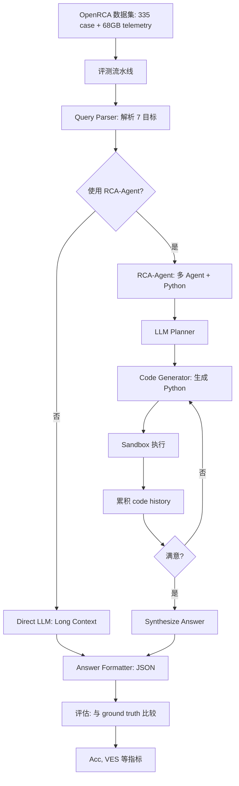
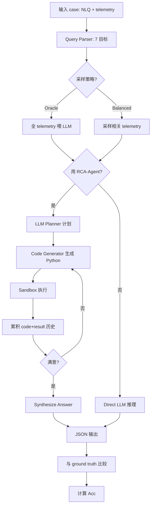

# OpenRCA：LLM 在真实软件系统根因分析中的基准评测（ICLR 2025）

> 作者：Junjielong Xu、Qinan Zhang、Zhiqing Zhong、Shilin He、Chaoyun Zhang、Qingwei Lin、Dan Pei、Pinjia He、Dongmei Zhang、Qi Zhang
> 机构：CUHK Shenzhen、Microsoft、清华
> 发表年份：2025
> 会议/期刊：ICLR 2025
> 关联 PDF：同目录下 `13411_OpenRCA_Can_Large_Langua.pdf`

## 一、文档信息速览

| 字段 | 值 |
|---|---|
| 标题 | OpenRCA: Can Large Language Models Locate the Root Cause of Software Failures? |
| 作者 | Junjielong Xu, Qinan Zhang, Zhiqing Zhong, Shilin He, Chaoyun Zhang, Qingwei Lin, Dan Pei, Pinjia He, Dongmei Zhang, Qi Zhang |
| 机构 | CUHK Shenzhen、Microsoft、清华 |
| 发表年份 | 2025 |
| 会议/期刊 | ICLR 2025 |
| 分类 | 评测 / RCA / LLM / 基准 |
| 核心问题 | 现有 LLM 是否能解决真实软件系统的根因分析（RCA）？缺乏标准化、目标驱动、含丰富 telemetry 的基准 |
| 主要贡献 | 1) 335 个真实故障 + 68GB telemetry；2) 7 个目标驱动的 RCA 任务；3) RCA-Agent 多 Agent 框架；4) Claude 3.5 仅解决 11.34% case |

## 二、背景（Background）

LLM 正在颠覆软件工程——Copilot、Cursor 等工具改变开发实践。但现有工作集中在开发早期（代码生成），对**后开发阶段**（运维、调试）关注不足。运维事故代价巨大（CrowdStrike 故障损失数亿美元），RCA 至关重要。

AI 领域的 RCA 方法包括：因果发现（Li et al., 2022a; Chakraborty et al., 2023; Bi et al., 2024）、依赖图分析、神经网络等。但 RCA 仍极难，因真实系统复杂、需多步异构数据推理。

LLM 在代码、数学、写作等任务上取得突破，但在 RCA 上能力未知。OpenAI o1、DeepSeek-R1 等"推理增强"模型可能对 RCA 有帮助，但缺乏标准化基准来评估。

现有 RCA 数据集（Li et al., 2022a; Ikram et al., 2022）多合成或小规模、目标单一、跨系统不可比。

OpenRCA 提出：335 个真实故障 + 68GB telemetry + 7 个目标驱动任务的标准化基准，量化当前 LLM 在 RCA 上的真实能力。

## 三、目的（Problems Solved）

- **痛点 1：缺真实大规模 RCA 数据。** 现有数据集合成或小规模。
- **痛点 2：缺目标驱动统一任务。** 现有方法各做各的。
- **痛点 3：缺异构 telemetry 综合。** metric、log、trace 难统一处理。
- **痛点 4：缺对 LLM 推理能力的公平评测。** 不知 LLM 在 RCA 上做到什么程度。
- **解决方案**：
  1) 用 AIOps Challenge 数据构造 335 真实故障；
  2) 定义 7 个 RCA 目标（time / component / reason 组合）；
  3) 提供 68GB 多模态 telemetry；
  4) 评估 SOTA LLM + 提出 RCA-Agent。

## 四、核心原理（Principles）

**总览**：OpenRCA 是 ICLR 2025 的 RCA 基准。它提供 335 个真实故障 + 68GB telemetry，定义 7 个 RCA 目标，评估 SOTA LLM，并提出多 Agent RCA-Agent 框架用 Python 程序合成+执行代替长上下文推理。

**三大数据集**：

- **Telecom**（51 case, 17.6GB）：电信数据库系统。
- **Bank**（136 case, 26.4GB）：银行系统。
- **Market**（148 case, 24.5GB）：在线市场系统（Cloudbed）。
- 总计 335 case、73 unique components、28 unique reasons。

**7 个 RCA 目标（goal-driven）**：

根因 3 元素：(1) time 故障开始时间、(2) component 故障源组件、(3) reason 故障原因。
- 7 个目标 = 3 个单元素 + 3 个两元素 + 1 个全元素。
- 模拟真实 RCA 场景（有时只需时间，有时需要完整定位）。

**数据构建 4 步**：

1. **System Selection**：从 1753 原始记录中筛选 3 个系统。
2. **Data Balancing**：downsample 让数据集规模相近。
3. **Data Calibration**：统一命名规范、3 个工程师人工校准 root cause 标签。
4. **Query Synthesis**：用 GPT-4 合成自然语言 query，人工校对。

**telemetry 组成**：

- Trace：38.4%（含完整调用图）
- Log：17.8%
- Metric：21.1%
- Market：82.2%（数据集大小占比）
- Telecom、Bank 各 0%、12.1%

**RCA-Agent（提出方法）**：

- 多 Agent 系统，基于程序合成 + 执行；
- 用 Python 代码做数据检索与分析，把 LLM 从"长上下文处理"解放到"推理 + 代码生成"；
- 模型生成 Python 代码 → 执行 → 拿到结果 → 继续推理；
- 显著降低 token 消耗、避免 LLM 在 GB 级 telemetry 上"迷失"。

**关键数学**：

- **评估准确率**：
  $$Acc = \frac{1}{|D|} \sum_{i=1}^{|D|} \mathbb{1}[\hat y_i = y_i]$$
  所有元素（time / component / reason）都正确得 1 分，否则 0。
- **多种采样策略**：
  - Oracle telemetry：所有 telemetry 喂给 LLM。
  - Balanced sampling：从 telemetry 中抽样可能相关部分。

**为什么这么做**：
- 真实数据 + 校准 = 可信评测；
- 7 个目标 = 模拟真实 RCA 场景的多样性；
- RCA-Agent = 把 LLM 推理 + 程序执行结合，扩展到大规模 telemetry。

**与现有技术的差异**：
- vs. 合成 RCA 数据集：OpenRCA 用真实故障。
- vs. 单一目标数据集：OpenRCA 7 个目标，跨场景可比。
- vs. AIOpsLab、GAIA 等：OpenRCA 专注 RCA，且 LLM-ready。

## 五、算法详解（Algorithm）

### 1. 输入 / 输出
- **输入**：故障 case（自然语言 query + telemetry）。
- **输出**：JSON 格式的根因（time / component / reason 子集）。

### 2. 核心模块
- **Query Parser**：解析 NLQ，确定目标（7 个之一）。
- **Telemetry Loader**：加载 metric/log/trace。
- **LLM Reasoner**：推理（用 RCA-Agent）。
- **RCA-Agent**：多 Agent + Python 代码生成。
- **Answer Formatter**：输出 JSON。

### 3. 伪代码（RCA-Agent）

```python
def rca_agent(query, telemetry, llm, max_iter=5):
    plan = llm.plan(query)  # 制定分析计划
    code_history = []
    for it in range(max_iter):
        # 1) 生成 Python 代码
        code = llm.generate_code(query, telemetry, plan, code_history)
        # 2) 执行代码
        try:
            result = exec_in_sandbox(code, telemetry)
        except Exception as e:
            result = f"Error: {e}"
        # 3) 累积到历史
        code_history.append({'code': code, 'result': result})
        # 4) 判断是否完成
        done = llm.is_satisfied(query, code_history)
        if done:
            break
    # 5) 输出最终答案
    answer = llm.synthesize_answer(query, code_history)
    return answer
```

### 4. 关键数学
- 见上文 "关键数学" 章节。

### 5. 复杂度分析
- 单 case 推理：RCA-Agent 5-10 轮 LLM 调用 + Python 执行。
- Token 消耗：~20-100K tokens（取决于 case）。
- 评测总开销：~1-2 GPU·天（335 case × 多 LLM × 2 策略）。

### 6. 训练与推理
- 训练：OpenRCA 是评测基准，无训练阶段。
- 推理：LLM 直接推理或用 RCA-Agent 框架。

### 7. 示例
- Query: "On March 20, 2022, between 09:00 and 09:30, the online market service system cloudbed-1 experienced a failure. Please identify the root cause component and the reason."
- Answer: `{"root cause 1": {"component": "shippingservice-1", "reason": "container read I/O load"}}`

## 六、系统架构图（Architecture）



## 七、流程图（Process Flow）



## 八、关键创新点（Key Innovations）

- **+ 真实大规模 RCA 基准**：335 case + 68GB telemetry，覆盖电信、银行、市场三类系统。
- **+ 7 个目标驱动的统一任务**：time/component/reason 组合，模拟真实 RCA 多样性。
- **+ 4 步数据构建流程**：Selection → Balancing → Calibration → Synthesis，保证质量。
- **+ RCA-Agent 多 Agent 框架**：用 Python 代码合成+执行代替长上下文推理，可扩展到 GB 级 telemetry。
- **+ 揭示 LLM 在 RCA 上的真实能力**：Claude 3.5 + RCA-Agent 仅解决 11.34% case，揭示巨大改进空间。

## 九、实验与结果（Experiments）

- **数据集**：OpenRCA 335 case（Telecom 51 + Bank 136 + Market 148）。
- **LLM**：GPT-3.5/4/4o、Claude 3 Opus/Sonnet/Haiku、DeepSeek-Coder、CodeLlama、Mistral 等。
- **策略**：Oracle telemetry / Balanced sampling。
- **RCA-Agent 评估**：Claude 3.5。
- **关键结果**：
  - Claude 3.5 + Oracle telemetry：仅解决 5.37% case；
  - Claude 3.5 + Balanced sampling：3.88%；
  - Claude 3.5 + RCA-Agent：11.34%（提升 ~2×）；
  - 其他模型表现更差（多数 0-5%）。
- **分析**：
  - LLM 在 "easy" 任务上偶尔能做对，但 "all 3 elements" 任务几乎做不对；
  - 长上下文 + 异构 telemetry 严重挑战 LLM 推理；
  - RCA-Agent 通过代码执行显著降低难度。

## 十、应用场景（Use Cases）

- **LLM RCA 能力评估**：作为标准基准。
- **AIOps 厂商选型**：用 OpenRCA 评估商业 LLM 在 RCA 上的能力。
- **新方法开发**：作为论文 baseline。
- **RCA 数据集补充**：可整合到其他评测体系。
- **培训与教育**：让 LLM 学习 RCA 任务的 prompt 工程。

## 十一、相关论文（Related Papers in this set）

- 同为 RCA 系列的 **FoundRoot** 用 LLM 增强 RCA 推理，OpenRCA 是其评测基准。
- **LagRCA** 关注异构 lag 时空因果，OpenRCA 可作为其结果展示平台。
- **Xiaoyu Empirical Study** 评估多源故障诊断方法，OpenRCA 提供真实大规模数据集。
- **DeST、ChronoSage** 等异常检测可作为 OpenRCA 上游"故障检测"。

## 十二、术语表（Glossary）

- **RCA (Root Cause Analysis)**：根因分析。
- **Goal-driven Task**：目标驱动任务，7 个目标。
- **Telemetry**：遥测数据（metric + log + trace）。
- **Oracle Telemetry**：理想情况，所有 telemetry 可用。
- **Balanced Sampling**：平衡采样，从 telemetry 中抽样可能相关部分。
- **Program Synthesis & Execution**：程序合成与执行。
- **Sandbox**：安全沙箱，执行 LLM 生成的代码。
- **RCA-Agent**：本文提出的多 Agent 框架。
- **VES (Valid Efficiency Score)**：有效效率分数。

## 十三、参考与延伸阅读

- AIOps Challenge 2018-2022：被 OpenRCA 使用的原始数据。
- MetaGPT、SWE-Agent、OpenDevin：相关 LLM Agent 工作。
- RCA 经典工作：因果发现、依赖图分析。
- Claude 3.5 Sonnet、GPT-4o、DeepSeek-Coder：被评测 LLM。
- 代码与数据：GitHub OpenRCA
