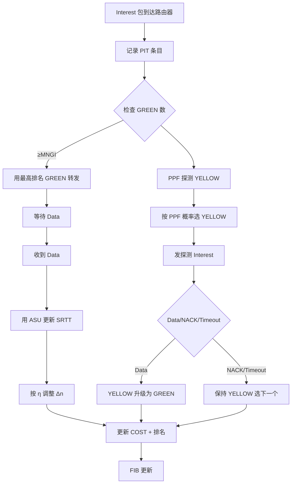
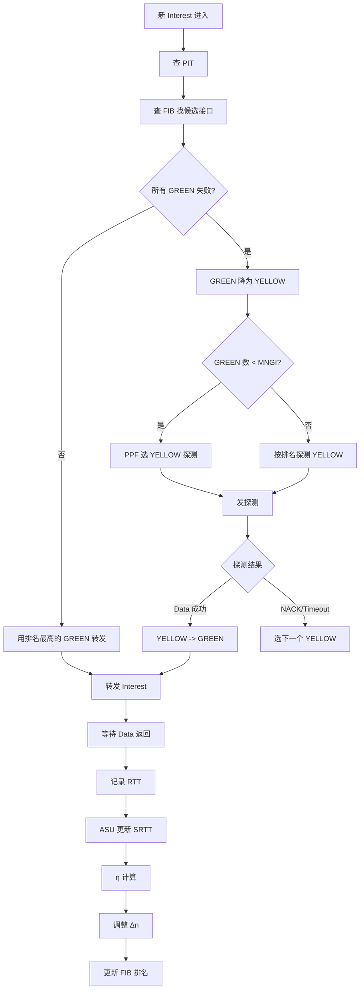

# Improving the Freshness of NDN Forwarding States（IFIP 2016 / 1570235179）

> 标题：Improving the Freshness of NDN Forwarding States
> 作者：Jianxun Cao、Dan Pei、Zhelun Wu、Xiaoping Zhang、Beichuan Zhang、Lan Wang、Youjian Zhao
> 机构：清华大学；亚利桑那大学；University of Memphis
> 发表年份：2016
> 会议/期刊：IFIP/IEEE 国际学术会议（CR 版）
> 关联 PDF：同目录下 `1570235179.pdf`

## 一、文档信息速览

| 字段 | 值 |
|---|---|
| 标题 | Improving the Freshness of NDN Forwarding States |
| 作者 | Jianxun Cao、Dan Pei、Zhelun Wu、Xiaoping Zhang、Beichuan Zhang、Lan Wang、Youjian Zhao |
| 机构 | 清华大学 TNList；亚利桑那大学；Memphis 大学 |
| 发表年份 | 2016 |
| 会议/期刊 | IFIP 学术会议（CR 版） |
| 分类 | 命名数据网络 / 自适应转发 / 接口排名 |
| 核心问题 | 现有 NDN 接口排名策略因 SRTT 测量频率低 + 缓存命中导致 RTT 突变而出现 SRTT 慢收敛；多路径 + 共享瓶颈链路导致 probing oscillation |
| 主要贡献 | (1) 提出 Adaptive SRTT Update (ASU) 算法，动态调整采样间隔；(2) 提出 Proactive Probing 策略，含 Multi-GREEN-Interface + Probing Probability Function (PPF)；(3) SRTT 收敛时间减少 37.9%，丢包率降低 75%-94.75% |

## 二、背景（Background）

Named Data Networking (NDN) [1] 是新型互联网架构，关注"内容是什么"而非"在哪里"。消费者发送 Interest 包请求命名数据，匹配的 Data 包可从任何地方返回。NDN 把网络服务抽象从"把包送到目的地"转为"取命名数据"，带来网络内缓存、组播、数据中心化安全等优势。

NDN 的独特之处是自适应转发平面 [2, 3]：路由器在 FIB 中记录每个 name prefix 的多个出接口；观察 Interest/Data 交换性能后可动态选最佳路径、检测/恢复故障、负载均衡、缓解 prefix hijacking 和 DDoS。

自适应转发的关键组件是接口排名（interface ranking）——决定何时、如何更新接口的 metrics 和排名。接口颜色分类：GREEN（能成功取数据）、YELLOW（未知）、RED（不可用）。NDN 有两大自适应转发策略：Best-Route [3] 和 NCC [5]（CCNx 0.7.2 默认）。

接口排名依赖两个关键部分：
1. **周期性测量（Periodical Measurement）**：路由器周期性向所有接口发 Interest 副本测 SRTT 等指标。
2. **颜色分类（Color Classification）**：用 NACK 或 Timeout 反馈更新颜色。

NDN 转发平面与 IP 不同：能实时感知拥塞状态并基于 RTT 更新每个出接口 cost。但 NDN 的 in-network cache 让 Interest 满足位置高度不确定，导致网络 metric 频繁变化。简单的周期性测量会出现两个 NDN 特有（IP 没有）的问题：
1. **SRTT 慢收敛（SRTT Slow-Convergence）**：低频测量下 SRTT 跟不上 RTT 突变。
2. **Probing Oscillation**：多路径转发 + 共享瓶颈链路 + 包级触发探测，造成 GREEN/YELLOW 颜色高频切换。

## 三、目的（Problems Solved）

- **SRTT 慢收敛**：用 Adaptive SRTT Update (ASU) 动态调整采样间隔；RTT 变化大时增加采样频率。
- **Probing Oscillation**：用 Proactive Probing + Multi-GREEN-Interface + PPF；维持多个 GREEN 备份路径；用概率函数代替严格按排名探测。
- **EOR（Extra Overhead Ratio）降低**：ASU 把额外开销比降 46.7%。
- **丢包率降低**：在 r=0.01/0.1 时丢包率降 75%-94.75%。
- **理论分析闭环**：推导收敛时间与丢包率公式。

## 四、核心原理（Principles）

**系统总览**：改进 NDN 自适应转发平面：
1. **ASU**：用 Changing Factor η 衡量 RTT 变化剧烈度；η 大时减小采样间隔 Δn、η 小时增大 Δn。
2. **Proactive Probing**：(a) Multi-GREEN-Interface 策略保持 MNGI 个 GREEN 接口作为备份路径；(b) PPF 算法用 $1/COST_i$ 加权分配探测概率。

**关键概念**：

- **NDN**：Named Data Networking 命名数据网络。
- **Interest / Data / NACK**：NDN 三种包。
- **PIT (Pending Interest Table)**：待处理 Interest 表。
- **FIB (Forwarding Information Base)**：转发信息库。
- **SRTT (Smoothed Round-Trip Time)**：平滑往返时延。
- **Color Classification**：颜色分类 GREEN / YELLOW / RED。
- **Interface Ranking**：接口排名。
- **Best-Route / NCC**：两种 NDN 转发策略。
- **Triggered Top-N Probing**：触发式 top-N 探测。
- **ASU (Adaptive SRTT Update)**：自适应 SRTT 更新算法。
- **Proactive Probing**：主动探测。
- **Multi-GREEN-Interface**：多 GREEN 备份。
- **MNGI (Minimal Number of GREEN Interfaces)**：最小 GREEN 接口数。
- **PPF (Probing Probability Function)**：探测概率函数。
- **Changing Factor η**：RTT 与 SRTT 的差异度量。
- **Slope threshold η_threshold**：η 阈值（取 0.1）。
- **EOR (Extra Overhead Ratio)**：额外开销比。
- **CN (Consumer) / P (Producer) / Ri**：消费者/生产者/路由器。
- **COST = OSPF + RTT**：接口 cost 复合值。
- **tout**：超时时间。
- **NDN-CXX / NFD / NDNSim 2.0**：NDN C++ 库/转发守护/仿真器。

**数学原理**：

- **SRTT 更新（经典 EWMA）**：

$$
SRTT_i = α \cdot SRTT_{i-1} + (1 - α) \cdot RTT_i
$$

α = 0.8。

- **Changing Factor η**：

$$
η = \frac{RTT - SRTT}{RTT + SRTT}, \quad 0 ≤ η < 1
$$

- **ASU 采样间隔 Δn**：

$$
Δn_i = \begin{cases} \max(Δn_{min}, (1-η_i) Δn_{i-1}) & η ≥ η_{threshold} \\ \min(Δn_{max}, (1+β) Δn_{i-1}) & η < η_{threshold} \end{cases}
$$

- **EOR**（额外开销比）：

$$
EOR = \frac{1}{Δn_{max}}
$$

- **SRTT 收敛步数 ic**（η<η_threshold 时）：

$$
i_c = \lceil \log_α \frac{2η_{threshold}}{1-η_{threshold}} \rceil
$$

当 m=RTT/SRTT₀=3, η_threshold=0.1, α=0.8 时 ic=6。

- **PPF (Probing Probability Function)**：

$$
PPF(i) = \frac{1/COST_i}{\sum_j (1/COST_j)}
$$

单调递减：COST 大 → PPF 小。

- **退出 probing oscillation 的期望 nq**：

$$
E(n_q) = \frac{1}{p}, \quad p \approx \frac{(1-PPF(2)) + (1-PPF(3))}{2}
$$

当 PPF(2)=PPF(3)=0.8 时，E(nq)=5。

**与现有技术的差异**：Best-Route/NCC 是被动（triggered top-N）探测；本工作改为主动（proactive）探测，且动态调整 SRTT 采样间隔。ASU 解决 SRTT 慢收敛；Multi-GREEN-Interface + PPF 解决 Probing Oscillation。

## 五、算法详解（Algorithm）

1. **输入 / 输出**：
   - 输入：每个 prefix 在每个出接口上的 RTT 采样、当前 SRTT/Δn、COST。
   - 输出：更新后的 SRTT、调整后的 Δn、更新后的接口颜色和排名。

2. **核心模块**：
   - **SRTT 更新**：每个 Interest 返回时计算新 RTT，用 ASU 公式更新 SRTT。
   - **Δn 动态调整**：根据 η 调整下次探测间隔。
   - **Multi-GREEN-Interface**：每收到一个 Interest，检查 GREEN 数是否小于 MNGI；若是则触发 PPF 探测。
   - **PPF 探测**：对所有 YELLOW 接口按 PPF 概率选一个探测；探测成功 → YELLOW → GREEN；探测失败 → 仍 YELLOW。
   - **颜色更新**：NACK/Timeout → GREEN 降级为 YELLOW；Data 成功 → YELLOW 升级为 GREEN。
   - **新拓扑设计**：路由器缓存命中时 OSPF 不准确，PPF 通过 COST 概率化解决。

3. **伪代码**：

```python
def adaptive_srtt_update(srtt_prev, rtt_new, alpha=0.8):
    return alpha * srtt_prev + (1 - alpha) * rtt_new

def update_delta_n(delta_n_prev, rtt, srtt, delta_n_min=1, delta_n_max=100, eta_th=0.1, beta=0.1):
    eta = (rtt - srtt) / (rtt + srtt) if (rtt + srtt) > 0 else 0
    if eta >= eta_th:
        return max(delta_n_min, (1 - eta) * delta_n_prev)
    else:
        return min(delta_n_max, (1 + beta) * delta_n_prev)

def proactive_probe(interfaces, mngi=2):
    green = [i for i in interfaces if i.color == GREEN]
    yellow = [i for i in interfaces if i.color == YELLOW]
    if len(green) < mngi and yellow:
        # PPF 概率选择
        weights = [1.0 / i.cost for i in yellow]
        total = sum(weights)
        probs = [w / total for w in weights]
        chosen = random.choices(yellow, probs)[0]
        # 探测
        if probe_success(chosen):
            chosen.color = GREEN
        # 否则保持 YELLOW

def cost(i):
    return i.ospf + i.rtt  # 归一化

def ppf(i, all_yellow):
    return (1.0 / i.cost) / sum(1.0 / j.cost for j in all_yellow)
```

4. **关键数学**：见 §四。

5. **复杂度分析**：
   - SRTT 更新：O(1)。
   - Δn 调整：O(1)。
   - PPF 探测：O(K)（K 为 YELLOW 数）。
   - Multi-GREEN 检查：O(K)。

6. **训练与推理**：
   - 无离线训练，纯在线算法。
   - 每个 Interest/Data 触发 O(1) 更新；每 Δn 包触发一次探测。

7. **示例**：清华校园网子拓扑（Con-Rc-R2-Rp-Pro），R2 缓存命中时 RTT 从 150ms 降到 50ms。RTT 变化大时 η 接近 1，Δn 减小、采样加快；SRTT 在 6 步内收敛。链路 Rp-Pro 拥塞时，R2 反复 GREEN/YELLOW；Multi-GREEN 策略保留 MNGI=2 个 GREEN 备份；PPF 概率选择最优 YELLOW 升级为 GREEN；E(nq)=5 后退出 oscillation，丢包率降 94.75%。

## 六、系统架构图（Architecture）



## 七、流程图（Process Flow）



## 八、关键创新点（Key Innovations）

- **+ ASU 动态采样间隔**：根据 η 自适应调整；SRTT 收敛时间从慢到 6 步。
- **+ Multi-GREEN-Interface**：保持多个 GREEN 备份，避免 oscillation。
- **+ PPF 探测概率函数**：$1/COST$ 加权概率，保留探索性。
- **+ 理论分析**：收敛步数、EOR、丢包率、E(nq) 全推导。
- **+ SRTT 收敛减 37.9% / 丢包率降 75%-94.75%**。
- **+ NDNSim 2.0 仿真验证**。

## 九、实验与结果（Experiments）

- **平台**：NDNSim 2.0（修改版）+ ndn-cxx + NFD；清华校园网子拓扑 Con-Rc-R2/R3/R4-Rp-Pro。
- **参数**：tdata=100ms、tout=120ms、k=100 Interest/s、η_threshold=0.1。
- **Baseline**：Best-Route (Triggered Top-1)、NCC (Triggered Top-2)、固定 Δn SRTT 测量。
- **主要指标**：SRTT 收敛时间、丢包率、EOR、收敛步数。
- **关键结果数字**：
  - ASU + 15s 仿真：EOR 降 46.7%（探测数 30→16，平均间隔 0.5s→0.94s）。
  - SRTT 收敛时间减少 37.9%。
  - 丢包率降 75% (r=0.01) - 94.75% (r=0.1)。
  - Multi-GREEN 退出 oscillation 期望 5 步。
  - SRTT 慢收敛示例：RTT 突变 150ms→50ms 后 SRTT 滞后 5s 才收敛。
- **消融实验**：分别关闭 ASU、关闭 Multi-GREEN、关闭 PPF。
- **效率分析**：算法 O(1) 每 Interest；适合在线部署。
- **可视化**：SRTT 曲线、丢包率曲线、拥塞恢复曲线。

## 十、应用场景（Use Cases）

- **NDN 网络转发性能优化**：自适应转发平面。
- **内容分发网络（CDN）**：多路径回源。
- **边缘计算多路径**：备份链路切换。
- **车联网 NDN**：高动态拓扑。
- **IoT 多跳网络**：节能 + 可靠。
- **卫星网络**：长时延 + 高抖动。

## 十一、相关论文（Related Papers in this set）

- `TraceSieve_ISSRE23`（追踪异常检测）
- `CMDiagnostor`（指标根因）
- `KDD21_InterFusion_Li`（多源 KPI 异常）
- `AlertRCA_CCGRID2024_CameraReady`（告警根因）
- `TSC23-DiagFusion`（多模态故障诊断）
- `Chain-of-Event_Interpretable-Root-Cause-Analysis-for-MicroservicesFSE24-Camera-Ready`（事件根因）

## 十二、术语表（Glossary）

- **NDN**：Named Data Networking。
- **Interest / Data / NACK**：NDN 三种包。
- **PIT**：Pending Interest Table。
- **FIB**：Forwarding Information Base。
- **SRTT**：Smoothed RTT。
- **Color Classification**：GREEN/YELLOW/RED。
- **Best-Route / NCC**：两种 NDN 策略。
- **Triggered Top-N Probing**：触发式 top-N 探测。
- **ASU**：Adaptive SRTT Update。
- **Proactive Probing**：主动探测。
- **Multi-GREEN-Interface**：多 GREEN 备份。
- **MNGI**：最小 GREEN 接口数。
- **PPF**：Probing Probability Function。
- **η (Changing Factor)**：RTT 变化度。
- **EOR**：Extra Overhead Ratio。
- **COST = OSPF + RTT**：接口 cost。
- **NDN-CXX / NFD / NDNSim 2.0**：NDN 工具链。

## 十三、参考与延伸阅读

- Paper: NDN 架构 [1]（Zhang et al.）。
- Paper: 自适应转发 [2, 3]。
- Paper: Best-Route / NCC [3, 5]。
- Paper: TCP EWMA（Jacobson, 1988）。
- Paper: MCTS / UCB（AlphaGo 思路 [4, 5]）。
- 工具：NDN-CXX、NFD、NDNSim 2.0。
- 相关论文：`TraceSieve_ISSRE23` 等。
- 网址：`https://named-data.net/`。
