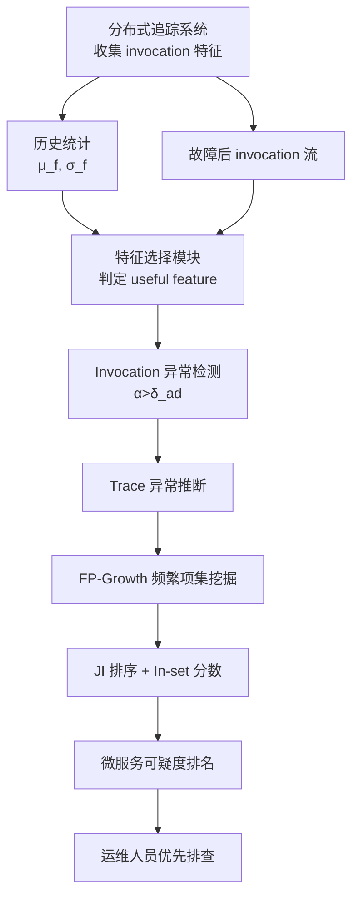
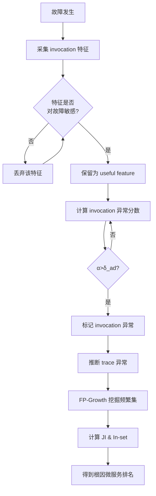

# TraceRCA: Practical Root Cause Localization for Microservice Systems via Trace Analysis（ISSTA 2021）

> 作者：Zeyan Li, Junjie Chen, Rui Jiao, Nengwen Zhao, Zhijun Wang, Shuwei Zhang, Yanjun Wu, Long Jiang, Leiqin Yan, Zikai Wang, Zhekang Chen, Wenchi Zhang, Xiaohui Nie, Kaixin Sui, Dan Pei
> 机构：清华大学、天津大学、中国民生银行、BizSeer、北京信息科学与技术国家研究中心（BNRist）
> 发表年份：2021
> 会议/期刊：ISSTA 2021（ACM SIGSOFT International Symposium on Software Testing and Analysis）
> 关联 PDF：同目录下 `1570705191.pdf`

## 一、文档信息速览

| 字段 | 值 |
|---|---|
| 标题 | Practical Root Cause Localization for Microservice Systems via Trace Analysis |
| 作者 | Zeyan Li, Junjie Chen, Rui Jiao, Nengwen Zhao, Zhijun Wang, Shuwei Zhang, Yanjun Wu, Long Jiang, Leiqin Yan, Zikai Wang, Zhekang Chen, Wenchi Zhang, Xiaohui Nie, Kaixin Sui, Dan Pei |
| 机构 | Tsinghua University, Tianjin University, China Minsheng Bank, BizSeer, BNRist |
| 发表年份 | 2021 |
| 会议/期刊 | ISSTA 2021 |
| 分类 | 根因分析 / 微服务可观测性 |
| 核心问题 | 在大规模微服务系统中，如何基于分布式追踪数据无监督地快速定位故障根因微服务。 |
| 主要贡献 | 1) 提出基于"异常 trace 多 / 正常 trace 少"的简洁无监督根因定位思路；2) 设计自适应的多指标 trace 异常检测与特征选择方法；3) 通过频繁项集挖掘与 Jaccard Index 挖掘可疑微服务集合；4) 在 222 个注入故障（10 类）上完成迄今最大规模实验，top-1 准确率较 SOTA 无监督方法提升 44.8%；5) 已在中国民生银行生产环境落地。 |

## 二、背景（Background）

微服务架构已经成为现代分布式系统的事实标准。它通过将单体应用拆分为数十甚至数千个轻量、松耦合、可独立部署的微服务，提供了更快的交付节奏、更好的可扩展性以及更高的自治能力。但这种架构也带来了新的可观测性挑战：一个用户请求往往会跨越多个微服务节点，调用链路过长、调用关系错综复杂，使得故障的传播路径变得难以追踪。亚马逊 2018 年 Prime Day 的一次一小时宕机曾造成约 1 亿美元的损失，可以想见生产环境对快速定位故障根因的诉求有多强烈。

在 TraceRCA 出现之前，微服务根因定位方法可以分为两大类：

1. **基于调用（invocation-based）的方法**：只检查相邻微服务之间的调用是否异常。这类方法假设"根因一定是异常调用最严重的相邻服务"，但实际生产中，异常可能跨越多层调用传播，因此只看相邻微服务不足以反映根因。
2. **基于追踪（trace-based）的方法**：通过整条 trace 关联所有涉及的微服务。代表方法包括 MicroScope（使用 DAG 表示微服务依赖，假设不存在环）、TraceAnomaly（专注于 trace 的结构或时延异常）、MEPFL（基于监督学习的根因预测）。这些方法存在如下局限：MicroScope 的 DAG 假设在真实生产系统和 Train-Ticket 基准中都不成立（有环）；TraceAnomaly 只关注单一指标（时延），且固定异常传播方向；MEPFL 需要大量高质量故障注入样本做训练，泛化能力差。

工业界生产中往往无法保证训练数据的全类型覆盖，且系统拓扑常常存在环路，因此迫切需要一种更实用（practical）、不依赖监督、不假设固定传播方向、不假设无环的根因定位方法。

## 三、目的（Purpose / Problems Solved）

TraceRCA 旨在解决以下 5 个具体问题：

- **痛点 1**：基于 trace 的根因定位现有方法依赖监督或环状拓扑假设。**解决方案**：提出一个简单而通用的"异常 trace 多 / 正常 trace 少"洞察，无需训练，无需假设无环。
- **痛点 2**：trace 是变长的，直接对 trace 做异常检测效率低、准确率差。**解决方案**：改为先检测 span（invocation）的异常，再通过 span 推断 trace 的异常状态。
- **痛点 3**：微服务系统有大量监控指标（CPU、内存、时延、HTTP 状态、网络吞吐、磁盘 IO 等），并非所有指标都与本次故障相关，无关指标的噪声会污染异常检测。**解决方案**：在每类故障发生时，自适应地选择"对故障敏感"的有用特征。
- **痛点 4**：很多情况下只有经过特定微服务组合的 trace 才会被故障影响，单看每个微服务可能分数都不高。**解决方案**：在集合层面而非单服务层面挖掘可疑微服务集合，使用频繁项集挖掘降低搜索空间。
- **痛点 5**：现有方法假设异常永远从上游向下游传播（MicroScope、TraceAnomaly），但实际生产中异常也可能反向传播。**解决方案**：基于"incoming / outcoming 异常调用数之差"动态推断异常传播方向。

## 四、核心原理（Principles）

TraceRCA 的整体方案可分为三阶段：① trace 异常检测；② 可疑微服务集合挖掘；③ 微服务排序。整体洞察是：**一个微服务若有更多异常 trace 流经它、更少正常 trace 流经它，则它更可能是根因。** 这个洞察借鉴自软件工程领域的频谱缺陷定位（SBFL）和多维根因定位，并在 25 + 22 个真实故障上验证了根因集合的 P(X|Y) 与 P(Y|X) 都集中在右上角（图 4）。

**关键概念**：
- **Invocation（Span）**：单个微服务对（caller→callee）之间的 API 调用，包含时延、状态码等特征。
- **Trace**：实现同一用户请求的所有 invocation 集合。
- **Anomaly Severity（异常严重度）**：对于特征 f，定义 α = |v_f − μ_f| / σ_f，其中 μ_f、σ_f 是该特征的历史均值与标准差。
- **Useful Feature**：故障后该特征上的平均异常严重度 α_after 比历史 α_before 显著增大（α_after − α_before > δ_fs · α_before）。
- **Support P(X|Y)**：在异常 trace 中流经某微服务集合 X 的比例。
- **Confidence P(Y|X)**：流经 X 的 trace 中异常 trace 的比例。
- **Jaccard Index (JI)**：综合 Support 和 Confidence 的统一度量。

**与现有方法的差异**：

| 维度 | MicroScope | TraceAnomaly | MEPFL | TraceRCA |
|---|---|---|---|---|
| 是否监督 | 否 | 否 | 是 | 否 |
| 拓扑假设 | DAG 无环 | DAG | — | 不假设 |
| 异常检测指标 | 多指标 | 仅时延 | 多指标 | 多指标 + 自适应特征选择 |
| 异常传播方向 | 固定上游→下游 | 固定上游→下游 | — | 动态推断 |
| 根因粒度 | 单微服务 | 单微服务 | 单微服务 | 可疑集合 + 单微服务 |

**数学公式**：

异常严重度：

$$
\alpha_f = \frac{|v_f - \mu_f|}{\sigma_f}
$$

特征是否"有用"：

$$
\alpha_{after} - \alpha_{before} > \delta_{fs} \cdot \alpha_{before}
$$

Jaccard Index（其中 H 为调和平均）：

$$
JI = \frac{P(X \cap Y)}{P(X \cup Y)} = \frac{2 - H(P(X|Y), P(Y|X))}{H(P(X|Y), P(Y|X))}
$$

最终可疑分数（对微服务 m）：

$$
Score(m) = \max_{S \ni m} \big( JI(S) \cdot IS(m, S) \big)
$$

其中 IS(m, S) 是微服务 m 在集合 S 内的 in-set 分数 = |流入异常数 − 流出异常数|。

## 五、算法详解（Algorithm）

### 1. 输入 / 输出
- **输入**：故障发生后的 trace 流（每个 trace 由若干 invocation 组成），以及每个微服务对的历史 invocation 特征值。
- **输出**：根因微服务排名列表。

### 2. 核心模块
- **A. Multi-metric Invocation Anomaly Detection**：多指标调用异常检测。
  - 1) 计算每个特征 f 在历史窗口的 μ_f、σ_f。
  - 2) 对每个特征比较 α_after 与 α_before，选择"有用"特征。
  - 3) 对每个 invocation 计算其在"有用"特征上的异常分数；只要任何一个分数 > δ_ad，则该 invocation 异常。
- **B. Trace Anomaly Inference**：只要一条 trace 包含至少一个异常 invocation，则该 trace 被判定为异常。
- **C. Suspicious Set Mining**：使用 FP-Growth 频繁项集挖掘，在异常 trace 中寻找出现频率 ≥ δ_spt 的微服务集合，然后对频繁集合按 JI 排序，取 top-k。
- **D. Microservice Ranking**：对每个可疑集合 S 计算每个微服务 m ∈ S 的 in-set 分数，最终可疑分数 = max(JI(S) · IS(m, S))。

### 3. 伪代码

```python
def TraceRCA(invocations_after_fault, historical_stats):
    # Stage 1: 多指标 invocation 异常检测
    useful_features = []
    for f in all_features:
        alpha_after = mean_anomaly_severity(invocations_after_fault, f)
        alpha_before = mean_anomaly_severity(historical_invocations, f)
        if alpha_after - alpha_before > delta_fs * alpha_before:
            useful_features.append(f)

    abnormal_invocations = set()
    for inv in invocations_after_fault:
        for f in useful_features:
            if anomaly_severity(inv, f) > delta_ad:
                abnormal_invocations.add(inv.id)
                break

    # Stage 2: trace 异常推断
    abnormal_traces = {t.id for t in all_traces
                       if any(inv.id in abnormal_invocations for inv in t.invocations)}

    # Stage 3: 可疑微服务集合挖掘
    candidates = FP_Growth(abnormal_traces, delta_spt)   # 支持度 >= 10% 的集合
    candidates = sorted(candidates, key=lambda S: JI(S))[:k]   # top-k

    # Stage 4: 微服务排序
    for m in all_microservices:
        score = 0.0
        for S in candidates:
            if m in S:
                IS = abs(incoming_abnormal_count(m, S) - outcoming_abnormal_count(m, S))
                score = max(score, JI(S) * IS)
        yield (m, score)
```
```

### 4. 关键数学
- 异常严重度用均值-标准差 z-score 形式计算，简单高效。
- 特征是否有用用 α_after 与 α_before 的相对差值判断。
- JI 同时编码了 support 和 confidence 两个条件。

### 5. 复杂度分析
- **FP-Growth** 复杂度 O(n · m)，其中 n 为异常 trace 数，m 为 trace 平均长度。论文实验每个故障 < 10s 完成。
- **异常检测**部分对每个 invocation 独立计算，可并行化；μ_f、σ_f 在线更新，每分钟滚动一次，开销低。

### 6. 训练与推理
TraceRCA **不需要训练**。μ_f、σ_f 是从历史 invocation 统计量直接计算，不依赖标签。

### 7. 示例
参考论文 Fig. 2：5 条 trace 经过微服务 {S_A, S_B, S_C, S_D, S_E}，红色虚线表示异常 invocation。
- 异常 trace 集合 Y = {T1, T2, T3}（即含异常 invocation 的 trace）。
- FP-Growth 在异常 trace 上挖掘频繁集合，得到 {S_A, S_B} 支持度 1。
- 进一步计算 JI 和 in-set 分数，得到 S_A 是最可能的根因。

## 六、系统架构图（Architecture）



## 七、流程图（Process Flow）



## 八、关键创新点（Key Innovations）

- **+ 简洁的无监督洞察**：将 SBFL 思想迁移到微服务根因定位领域，把"异常 trace 多 / 正常 trace 少"作为唯一判据，简单、可解释。
- **+ 自适应多指标特征选择**：通过 α_after − α_before 检验，自动过滤无关指标的噪声，避免误判。
- **+ 在集合层面挖掘根因**：使用 FP-Growth 频繁项集 + JI 排序，解决了"只有特定微服务组合受影响"的实际问题。
- **+ 动态推断异常传播方向**：通过 in-set 分数 |incoming − outcoming| 动态判断异常是上游→下游还是下游→上游，避免了固定方向假设。
- **+ 大规模真实实验与工业落地**：222 个故障 × 10 类场景，并在民生银行生产环境部署并公开部署经验。

## 九、实验与结果（Experiments）

**数据集**：
- **A（Train-Ticket）**：41 个微服务，部署在 7 台物理机（12 核 2.4GHz CPU、12GB RAM）。注入 200 个故障，涵盖 application bug、CPU exhausted、network delay 三类，分别在 microservice / container / API 三个层级注入。其中 11 个为多根因故障。共 242,259 条 trace，其中 22,675 条（9.36%）受故障影响。
- **B（生产系统）**：某大型 ISP 的真实微服务系统，13 个微服务，服务超过 5000 万用户。22 个真实故障，5 类（CPU 耗尽、内存耗尽、主机网络错误、容器网络错误、数据库故障）。共 1,136,825 条 trace，17,041 条（1.50%）受影响。
- 合计 **222 个故障、1,379,084 条 trace、39,728 条异常 trace**。

**Baseline**：
- **无监督调用级**：Random Walk (RW)、RCSF
- **无监督 trace 级**：MicroScope (MS)、TraceAnomaly (TA)
- **有监督**：MEPFL (RF)

**主要指标**：Top-k 准确率（A@1, A@2, A@3）、Mean Average Rank (MAR)、Mean First Rank (MFR)。

**关键结果数字**（Table II）：
- 在 A 上：TraceRCA 的 A@1 = 0.82，A@2 = 0.91，A@3 = 0.95，MAR = 1.54，MFR = 1.50。无监督 SOTA MS 在 A@1 仅 0.55，TraceRCA **提升 51.02%**。
- 在 B 上：TraceRCA 的 A@1 = 0.88，A@2 = 1.0，A@3 = 1.0，MAR = 1.12，MFR = 1.12。无监督 SOTA MS A@1 = 0.82，**提升 7.32%**。
- 与监督 MEPFL (RF) 相比：TraceRCA 在 A 上 A@1 仅低 10.72%，但无需训练数据；MEPFL 的效果在缺失故障类型或微服务时迅速退化（图 5）。
- 多根因故障（Table IV）：TraceRCA 的 A@1 = 0.45，A@2 = 0.82，MAR = 1.77，显著优于无监督方法（MS 的 A@1 仅 0.27）。
- 三种粒度（Table III）：microservice 级 A@1 = 0.83，container 级 A@1 = 0.80，API 级 A@1 = 0.83。
- TraceRCA-AD（异常检测）F1-score > 0.8，与监督 RF-Trace 持平，远超 IF 和 TA-AD。

**消融实验**：
- 特征选择：去掉特征选择后，F1 从 0.83 降到 0.81。
- 超参数 δ_ad 和 δ_fs 的影响（图 7、8）：存在最优区间。
- 噪声比实验（图 9、10）：随噪声增加，MS/RW 退化明显，TraceRCA 保持稳定。

**效率分析**：单个故障端到端 < 10 秒（普通 CPU 机器）。

## 十、应用场景（Use Cases）

- **金融支付系统**：当出现交易失败率上升时，TraceRCA 可快速定位是哪个微服务（如账户服务、风控服务、网关）异常。
- **电商订单系统**：在大促期间，订单创建失败、库存不足等问题常因微服务链路抖动引发，TraceRCA 可基于 trace 推断根因。
- **银行核心系统**：民生银行已部署该方案于生产，定位 CPU 耗尽、内存耗尽、网络错误、数据库故障等。
- **多根因异常排查**：当一次故障由多个微服务共同引发（少数容器异常 + 数据库响应慢），TraceRCA 通过集合挖掘和 in-set 分数找出全部根因。
- **微服务架构演进期**：当拓扑存在环、依赖经常变化时，TraceRCA 不需要假设 DAG，可直接适用。

## 十一、相关论文（Related Papers in this set）

本批次中：
- `paper-INFOCOM21-cfp`（CTF）也是面向多元时序异常检测，与 TraceRCA 的多指标异常检测可互补。
- `wch_ISSRE-1`（RCLCF）也是关于在线服务系统根因指标识别，可与 TraceRCA 串联做"指标→微服务"两级根因。
- `SCWarn` 关于代码变更级别的异常检测，可与 TraceRCA 联合做变更→故障的归因。
- `刘平issre` 关于服务级深度贝叶斯网络 trace 异常检测，可作为 TraceRCA 异常检测阶段的替代。

## 十二、术语表（Glossary）

- **Microservice（微服务）**：单一职责、可独立部署的小型服务。
- **Trace（追踪）**：实现同一用户请求的所有 invocation 集合。
- **Span / Invocation（调用）**：两个微服务对之间的一次 API 调用。
- **Anomaly Severity（异常严重度）**：z-score 形式衡量当前值偏离历史均值的程度。
- **SBFL（Spectrum-Based Fault Localization）**：频谱缺陷定位，源自软件工程。
- **Jaccard Index（Jaccard 相似度）**：两集合交集占并集的比例。
- **FP-Growth**：高效的频繁项集挖掘算法。
- **δ_fs, δ_ad, δ_spt, k**：TraceRCA 的关键超参数（特征选择阈值、异常判定阈值、支持度阈值、top-k 集合数）。
- **In-set Score**：在某个可疑集合内，incoming 异常数与 outcoming 异常数之差的绝对值。

## 十三、参考与延伸阅读

- MicroScope (ISSTA 2020) — 假设 DAG 的无监督 trace-based 根因定位。
- TraceAnomaly (ISSRE 2018) — 单一指标异常检测。
- MEPFL (IWQOS 2021) — 监督学习根因预测。
- Random Walk、Isolation Forest — 经典图/无监督方法。
- FP-Growth (Han et al., 2000) — 频繁项集挖掘算法。
- 开源实现与数据集：https://github.com/NetManAIOps/TraceRCA
