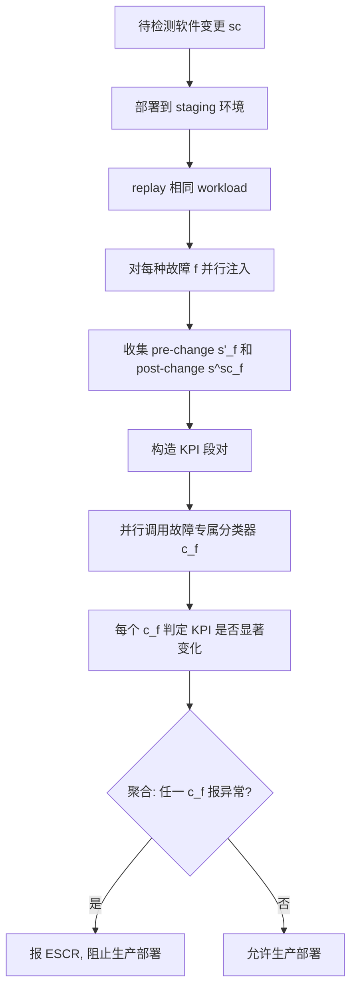

# ResilienceGuardian: Detecting Erroneous Software Changes That Reduce Fault Resilience in Microservices（ICSE 2025）

> 作者：Guanglei He, Xiaohui Nie, Ruming Tang, Kun Wang, Zhaoyang Yu, Xidao Wen, Kanglin Yin, Dan Pei  
> 机构：清华大学、中国科学院 CNIC、BizSeer  
> 发表年份：2025  
> 会议/期刊：ICSE 2025（IEEE/ACM International Conference on Software Engineering）  
> 关联 PDF：同目录下 `1570994962-final.pdf`

## 一、文档信息速览

| 字段 | 值 |
|---|---|
| 标题 | Guardian of the Resiliency: Detecting Erroneous Software Changes Before They Make Your Microservice System Less Fault-Resilient |
| 作者 | Guanglei He, Xiaohui Nie, Ruming Tang, Kun Wang, Zhaoyang Yu, Xidao Wen, Kanglin Yin, Dan Pei |
| 机构 | 清华大学、BNRist、中科院 CNIC、BizSeer |
| 发表年份 | 2025 |
| 会议/期刊 | ICSE 2025 |
| 分类 | 微服务 / 软件变更 / 故障注入 / 弹性评估 / KPI 分析 |
| 核心问题 | 某些软件变更（ESCRs）部署后短期内看似无害，但会悄悄降低系统对故障的弹性；等真实故障（网络抖动、CPU 飙高）到来时才暴露问题，传统上线后监控无法覆盖。 |
| 主要贡献 | 1) 第一次对 ESCR（Erroneous Software Changes that Reduce fault Resilience）的系统化 empirical study（256 个真实事故、4 大微服务系统）；2) ResilienceGuardian 框架：在 staging 环境做故障注入 + 训练轻量级故障专属分类器；3) 数据增强 + 迁移学习 + 并行化解决训练开销；4) 平均 F1=0.90，训练时间减少 56.23%–97.53%，支持百万级 KPI 的分钟级 ESCR 检测。 |

## 二、背景（Background）

微服务架构已成为大型在线服务系统的主流，单个团队每天可能实施上万次软件变更（Google 案例）。然而这些变更是"易出错"的：Google 内部数据表明约 70% 的服务事故可归因于软件变更错误。当变更导致系统对故障的弹性降低时（如错误地减少了冗余资源、配置了无效的备份节点、放行了过期请求、错误配置了请求转发策略），表面看系统正常运行，但一旦真实故障发生（网络抖动、CPU 异常飙高、磁盘 I/O 失败等），系统就会因缺乏弹性而失败。

论文把这种变更定义为 **ESCR**（Erroneous Software Changes that Reduce fault Resilience），区别于传统的 **ESCF**（变更直接引发事故）。ESCR 的恐怖之处在于：监控其变更"短期内不报错"——等真实故障到来时才出问题；但故障是不可预测的，传统上线后 K 个小时的监控窗口几乎不可能"刚好"覆盖到一次故障，导致 ESCR 长期潜伏在生产中。

研究背景示例：Google 的一个案例——一个看似无害的"冗余资源削减"变更，部署后正常运行了数小时，直到一次意外的工作负载峰值触发了事故；事故前一切正常，监控窗口已关闭。

为系统理解 ESCR，作者从 Google、AWS、GitHub、GitLab 等四家公司的微服务系统收集了 6 年 256 起事故做 empirical study，发现 37.87% 的错误软件变更是 ESCR 类型，即它们确实会让系统对故障的弹性降低。

ResilienceGuardian 就是在 staging 环境对每个软件变更做"故障注入 + KPI 分析"，提前识别 ESCR，避免把 ESCR 部署到生产。

## 三、目的（Purpose / Problems Solved）

论文在 Introduction 中明确给出三大挑战：

- **挑战 1：缺乏训练数据。** 256 个事故分散在 6 年里。即使做故障注入也缺少"哪个 KPI 段对是 ESCR" 的标签。解决方案：**数据增强**——基于 6 类 KPI 变化模式（Fig.2）生成伪标签训练对，让分类器能在没有真实 ESCR 标签的情况下训练。
- **挑战 2：KPI 模式极其复杂。** 一个变更可能涉及数十种故障注入，每种故障让 KPI 模式变化 10x–100x，单模型难以驾驭。解决方案：**故障专属分类器**——为每种故障单独训练一个轻量级分类器，简化每个分类器需要处理的模式复杂度；输入特征是"KPI 段对"（pre-change vs post-change）的简单"显著变化"分类。
- **挑战 3：巨大开销。** 一次变更要检查百万级 KPI、数十种故障，训练阶段用 1 GPU 也要跑数月；检测阶段要处理 #fault × #KPI（千万级）检测空间。解决方案：**训练阶段用迁移学习**——让一个故障专属分类器能低成本迁移到其他故障；**检测阶段用并行化**——大幅加速检测。

## 四、核心原理（Principles）

ResilienceGuardian 框架（Fig.1）分两阶段：

- **离线训练（Offline Training）**：
  1. 在 staging 环境对系统 replay 相同工作负载；
  2. 用 ChaosBlade 注入典型故障（F1–F8：workload spike、expired requests、network delay、packet loss、duplication、CPU 异常、memory 异常、Disk I/O 失败）；
  3. 用 Locust 控制 workload 形态，用 Prometheus 收集 KPI；
  4. 对每个故障 $f$ 收集 pre-change KPI 段 $s'_f$ 和 normal KPI 段 $s'_n$；
  5. 用数据增强（基于 noise intensity scaling）生成带伪标签的 KPI 段对数据集；
  6. 为每种故障训练一个轻量级分类器 $c_f$；用迁移学习让一个分类器能扩展到其他故障。
- **在线检测（Online Detection）**：
  1. 部署软件变更 $sc$；
  2. 收集变更后的 KPI 段 $s^{sc}_f$（对每种故障 $f$）；
  3. 构造 KPI 段对 $(s'_f, s^{sc}_f)$ 输入对应的 $c_f$；
  4. 聚合所有故障分类器结果判断 $sc$ 是否为 ESCR。

KPI 段定义（III-B2）：对 KPI 时序 $X = \{x_1, ..., x_w\}$，在故障 $f$ 持续时间 $d$ 内提取段 $s = (x_{ts}, ..., x_{ts+d}, x_{ts+d+1}, ..., x_{ts+d+\lceil 0.5d \rceil})$，最后 $\lceil 0.5d \rceil$ 个点捕捉"故障的持续影响"。

**KPI 段对**：3 类（Table III）：
- $p_1$：pre-change $s'_f$（故障下）vs post-change $s^{sc}_f$（变更后故障下）——核心任务
- $p_2$：pre-change normal $s'_n$ vs pre-change $s'_f$——辅助
- $p_3$：post-change normal $s^{sc}_n$ vs post-change $s^{sc}_f$——辅助

**数据增强**：
- 基础：随机选 KPI 段，注入噪声生成新段，构成 KPI 段对。
- 噪声强度 NI（公式 1）：对周期时序 $X$，$NI_X$ = 各时间点跨周期标准差的均值，衡量"自然噪声强度"。
- 弱噪声 $(0, 3\times NI]$ / 强噪声 $(3\times NI, 10\times NI]$。
- 噪声强度缩放（公式 2）：$x_{i\text{-scaled}} = x_i \times (NI_{\text{default}}/NI_X)$，把不同 KPI 的 NI 标准化到 $NI_{\text{default}}=1.5$。
- 6 类变化模式（Fig.2）：包含 ESCR 影响下 KPI 的形状变化。

**与现有方法差异**：
- vs 传统 ESCF 检测：传统方法监控变更后 KPI 看是否"立即"异常；ESCR 在没有故障时不异常，传统方法失效。
- vs 通用异常检测：本方法聚焦"pre-change vs post-change 在相同故障下的对比"，是因果性的而非统计性的。
- vs 之前工作用 KPI 模式特征：本方法把问题重新定义为"两段是否有显著变化"，特征更简单、对故障复杂度的鲁棒性更好。

数学核心：

噪声强度（公式 1）：

$$NI_X = \sqrt{\frac{1}{T}\sum_{i=0}^{T-1}\left(\sqrt{\frac{1}{K}\sum_{j=0}^{K-1}(x_{i+j\times T} - \bar{x}_i)^2}\right)^2}$$

其中 $\bar{x}_i = \frac{1}{K}\sum_{j=0}^{K-1}x_{i+j\times T}$。

噪声强度缩放（公式 2）：

$$x_{i\text{-scaled}} = x_i \times \frac{NI_{\text{default}}}{NI_X}$$

KPI 段对是输入，分类器输出"KPI 段对是否呈现显著变化"的概率，最终聚合判断 ESCR。

## 五、算法详解（Algorithm）

### 1. 输入 / 输出

- **输入**：staging 环境的 KPI 监控数据、典型故障集、待检测的软件变更 $sc$。
- **输出**：$sc$ 是否为 ESCR 的判定（带概率）。

### 2. 核心模块

- **Fault Injection（ChaosBlade）**：注入 8 类典型故障。
- **Workload Management（Locust）**：replay 相同工作负载，KPI 表现出周期性。
- **KPI Collection（Prometheus）**：收集 business + machine KPIs。
- **KPI Segment Extraction**：按故障持续时间切片。
- **Data Augmentation**：噪声注入 + 噪声强度缩放生成伪标签训练对。
- **Fault-specific Classifier**：每种故障一个轻量级分类器。
- **Transfer Learning**：一个分类器迁移到其他故障以降低训练成本。
- **Parallel Detection**：并行化检测阶段。

### 3. 伪代码

```python
# === Offline Training ===
def train_resilience_guardian(system, faults):
    # 1) 数据收集
    d_n = collect_normal_kpis(system)  # normal 时段
    D_f = {f: collect_fault_kpis(system, f) for f in faults}  # 每种故障下
    # 2) 数据增强
    train_data = {}
    for f in faults:
        train_data[f] = []
        for s_f in D_f[f]:
            # 噪声强度缩放
            s_f_scaled = noise_intensity_scale(s_f, NI_default=1.5)
            # 强噪声注入 -> 正样本（ESCR 表现）
            pos = inject_strong_noise(s_f_scaled, patterns=6_VARIATIONS)
            # 弱噪声注入 -> 负样本
            neg = inject_weak_noise(s_f_scaled)
            train_data[f].append((s_f_scaled, pos, 1))
            train_data[f].append((s_f_scaled, neg, 0))
    # 3) 训练故障专属分类器（迁移学习）
    base_model = train_classifier(train_data[first_fault])
    classifiers = {first_fault: base_model}
    for f in faults[1:]:
        # 迁移：基于 base_model + 少量新故障数据微调
        classifiers[f] = transfer_learn(base_model, train_data[f], epochs=2)
    return classifiers

# === Online Detection ===
def detect_escr(classifiers, system, sc):
    deploy(system, sc)
    d_n_sc = collect_normal_kpis(system)
    D_f_sc = {f: collect_fault_kpis(system, f) for f in classifiers}
    # 并行化：每种故障跑对应分类器
    results = parallel_map(
        lambda f: classify(classifiers[f], D_f[first_fault], D_f_sc[f]),
        classifiers.keys()
    )
    # 聚合：任一故障分类器判为 ESCR 概率超过阈值 -> 报 ESCR
    return aggregate(results)
```

### 4. 关键数学

Noise Intensity (公式 1)：

$$NI_X = \sqrt{\frac{1}{T}\sum_{i=0}^{T-1}\left(\sqrt{\frac{1}{K}\sum_{j=0}^{K-1}(x_{i+j\times T} - \bar{x}_i)^2}\right)^2}$$

Noise Intensity Scaling (公式 2)：

$$x_{i\text{-scaled}} = x_i \times \frac{NI_{\text{default}}}{NI_X}$$

F1-score (评估指标)：

$$F1 = 2\times\frac{P\times R}{P+R}$$

### 5. 复杂度分析

论文强调开销：
- 训练阶段：naive 需要 1 GPU 连续跑数月（每个故障 × 数百万 KPI）。
- 引入迁移学习后：训练时间减少 56.23%–97.53%。
- 检测阶段：#fault × #KPI（千万级）检测空间，通过并行化策略压低到分钟级。

### 6. 训练与推理

- **训练**：每种故障一个轻量级分类器，迁移学习降低训练成本。
- **推理**：并行化对每种故障跑对应分类器，聚合判断 ESCR。
- **关键工程**：ChaosBlade（故障注入）、Locust（workload）、Prometheus（KPI 收集）。

### 7. 示例

论文 Fig.2 给出 6 类 KPI 段对变化模式（如 spike、trend shift、level shift、pattern change、fade、recovery），每类配 ESCR 影响下 KPI 形状的示例。Table IV 给出 8 类作者设计的 ESCR：E1-E2 减少 CPU/内存资源、E3-E4 配置不足资源、E5-E6 允许过期请求访问无效数据库/进入死循环、E7-E8 中断请求转发/转发到无效备份节点。Table I 把 256 个事故中的 ESCR 归为 4 大类：I. 冗余不足（29.69%）、II. 备份节点配置错误（23.44%）、III. 请求配置错误（32.81%）、IV. 转发策略错误（14.06%）。

## 六、系统架构图（Architecture）

```mermaid
graph TB
    subgraph Offline["Offline Training"]
        A1[staging 环境 + 相同 workload]
        A2[ChaosBlade 注入 8 类故障]
        A3[Locust 控制 workload]
        A4[Prometheus 收集 KPI]
        A5[KPI 段提取]
        A6[数据增强: 噪声注入 + NI 缩放]
        A7[故障专属轻量级分类器 + 迁移学习]
    end
    subgraph Online["Online Detection"]
        B1[新软件变更 sc]
        B2[部署到 staging]
        B3[对每种故障 f 注入]
        B4[收集变更后 KPI 段]
        B5[构造 KPI 段对 (s'_f, s^sc_f)]
        B6[并行: 每种故障跑对应分类器]
        B7[聚合结果判断 ESCR]
    end
    A1 --> A2 --> A3 --> A4 --> A5 --> A6 --> A7
    B1 --> B2 --> B3 --> B4 --> B5 --> B6 --> B7
    A7 --> B6
```

## 七、流程图（Process Flow）



## 八、关键创新点（Key Innovations）

- **+ 第一次对 ESCR 的系统化 empirical study**：从 Google/AWS/GitHub/GitLab 四家微服务系统收集 6 年 256 起事故，揭示 37.87% 错误软件变更是 ESCR、4 大类（I-IV）、57.42% 事故涉及故障；为 ResilienceGuardian 设计提供数据驱动基础。
- **+ 故障专属轻量级分类器**：放弃"一个模型管所有故障"的传统思路，为每种故障单独训练一个轻量级分类器，把"故障让 KPI 模式变得 10x–100x 复杂"的问题通过"分而治之"化解。
- **+ 重新定义任务为"两段是否有显著变化"**：区别于之前工作用"KPI 模式特征"，本方法聚焦"pre-change vs post-change 在相同故障下的对比"，特征更简单、对故障复杂度鲁棒性更好。
- **+ 数据增强 + 噪声强度缩放**：基于 6 类 KPI 变化模式（Fig.2）生成伪标签训练对，让分类器能在没有真实 ESCR 标签的情况下训练；NI 缩放让不同 KPI 可比较。
- **+ 迁移学习 + 并行化**：训练阶段用迁移学习让一个分类器扩展到其他故障，减少训练时间 56.23%–97.53%；检测阶段并行化让 #fault × #KPI（千万级）检测空间降到分钟级。
- **+ 工业级工具链整合**：ChaosBlade（故障注入）、Locust（workload）、Prometheus（KPI）三大开源工具，覆盖完整的 staging 环境"故障注入 + KPI 监控 + 弹性评估"流程。

## 九、实验与结果（Experiments）

- **数据集**：基于两个广泛使用的开源微服务 benchmark——HipsterShop [10] 和 TrainTicket [11]，作者设计了 8 类 ESCR（Table IV：E1-E8）共 200 个实例（HipsterShop 10/类、TrainTicket 15/类）。
- **Baseline**：传统 ESCF 检测方法 + 其他异常检测方法。
- **评估指标**：F1-score、训练时间、检测延迟。
- **关键结果数字**：
  - 平均 F1 = **0.90**（在 ESCR 识别上），显著超过所有 baseline。
  - 训练时间减少 **56.23%–97.53%**（相对 baseline）。
  - 支持**分钟级** ESCR 检测，处理百万级 KPI 的大规模微服务系统。
- **消融实验**：故障专属分类器、数据增强、迁移学习、并行化各组件的贡献。
- **效率分析**：训练时间、检测延迟的实测；迁移学习的成本节省。
- **empirical study 结果**：
  - 256 个事故中 66.02% 由错误软件变更引起，其中 **37.87% 是 ESCR**。
  - 57.42% 事故涉及故障（ESCR + ESCF + 原系统设计缺陷）。
  - 4 大类 ESCR 分布：I. 冗余不足 29.69%、II. 备份配置错误 23.44%、III. 请求配置错误 32.81%、IV. 转发策略错误 14.06%。

## 十、应用场景（Use Cases）

- **CI/CD 流水线集成**：作为发版门禁，ESCR 变更自动阻止生产部署。
- **微服务架构师风险评估**：在新功能上线前评估对系统弹性的影响。
- **SRE 团队故障演练**：配合 ChaosBlade 做"上线前故障演练"，减少 ESCR 进入生产。
- **多团队协作变更管理**：在大型微服务系统中，多团队同时提交变更时，ResilienceGuardian 可并行评估所有变更的弹性影响。
- **AIOps 平台集成**：作为"变更风险评估"模块嵌入。
- **故障回溯**：在事故发生后追溯"是哪个 ESCR 让系统对该故障失去弹性"。

## 十一、相关论文（Related Papers in this set）

- `Mengyao__SiameseLSTM`：KPI 时序异常检测（单点 KPI），与本篇"KPI 段对"视角互补。
- `TSC-TADBench`：trace 异常检测，与本篇"KPI 段对"互补。
- `Shiyu__Accurate_and_Interpretable_Log_Fault_Diagnosis_using_Large_Language_Models-2`：日志故障诊断，与本篇"KPI 故障影响"互补。
- `InformationSciences-OmniFed`：联邦异常检测，与本篇"故障注入"思路可结合。
- `1570994962-final`（本篇，ResilienceGuardian）：ESCR 主动检测，ICSE 2025。

## 十二、术语表（Glossary）

- **ESCR（Erroneous Software Changes that Reduce fault Resilience）**：降低系统对故障弹性的错误软件变更。
- **ESCF（Erroneous Software Changes that induce immediate Failures）**：立即引发事故的错误软件变更。
- **Fault Resilience（故障弹性）**：系统在故障发生时仍能维持服务质量的能力。
- **Fault Injection（故障注入）**：在 staging 环境人为注入典型故障，模拟生产环境。
- **ChaosBlade**：阿里开源的故障注入工具，ResilienceGuardian 的核心工具之一。
- **Locust**：开源 load testing 工具，用于管理 workload。
- **Prometheus**：开源监控系统，用于收集 KPI。
- **KPI Segment Pair（KPI 段对）**：pre-change 与 post-change 在相同故障下的两段 KPI 时序。
- **Noise Intensity (NI)**：KPI 时序在每个时间点跨周期标准差的均值，衡量自然噪声强度。
- **Noise Intensity Scaling**：用 $NI_{\text{default}}/NI_X$ 缩放 KPI，使不同 KPI 可比较。
- **Data Augmentation（数据增强）**：基于 6 类变化模式生成伪标签训练对。
- **Transfer Learning（迁移学习）**：让一个故障专属分类器扩展到其他故障。
- **Fault-specific Classifier（故障专属分类器）**：每种故障一个轻量级分类器。
- **HipsterShop / TrainTicket**：Google 微服务 benchmark / 西安交大微服务 benchmark。
- **ESCR Category I-IV**：4 大类 ESCR——冗余不足、备份配置错误、请求配置错误、转发策略错误。
- **6 Variations of KPI Patterns**：6 类 KPI 段对变化模式（图 2）。

## 十三、参考与延伸阅读

- **ChaosBlade**（论文 [13]）：阿里开源的故障注入工具，覆盖 8 类典型故障。
- **Locust**（论文 [14]）：开源 load testing 工具。
- **Prometheus**（论文 [12]）：开源监控系统。
- **HipsterShop**（论文 [10]）：Google 的微服务 benchmark。
- **TrainTicket**（论文 [11]）：西安交大的微服务 benchmark。
- **OmniCluster**（论文 [15]）：KPI 段对聚类工具，用于发现 6 类变化模式。
- **k-σ rule**（论文 [17]）：工业界常用的噪声强度判定规则。
- **ESCF / ESCR**：由本文首次正式区分并形式化。
- **AIOps 故障注入研究**：可与本文思路结合做"上线前主动弹性评估"。
