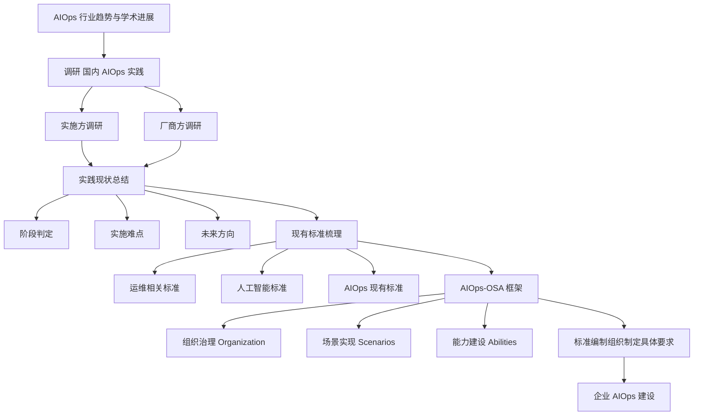
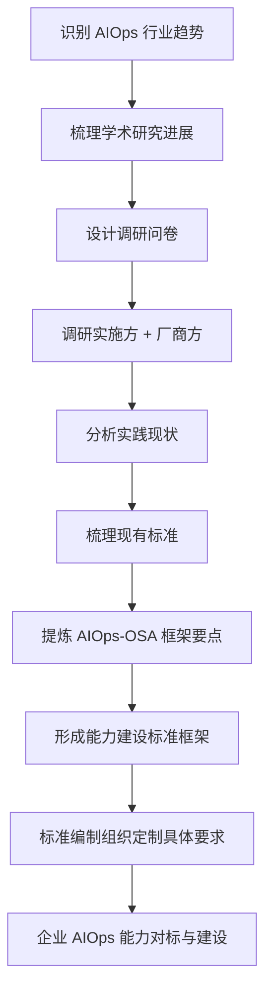

# AIOps in Practice: Status Quo and Standardization（软件学报 2022）

> 作者：包航宇、殷康璘、曹立、李世宁、孙永敬、尹汇锋、汤汝鸣、侯岳、王士强、裴丹、杨晓勤、王立新  
> 机构：中国建设银行运营数据中心；清华大学；北京必示科技有限公司；国家智能运维标准编制组/指导组  
> 发表年份：2022  
> 会议/期刊：软件学报（Journal of Software）  
> 关联 PDF：同目录下 `2.-mt008.pdf`

## 一、文档信息速览

| 字段 | 值 |
|---|---|
| 标题 | AIOps in Practice: Status Quo and Standardization（智能运维的实践：现状与标准化） |
| 作者 | 包航宇、殷康璘、曹立、李世宁、孙永敬、尹汇锋、汤汝鸣、侯岳、王士强、裴丹、杨晓勤、王立新 |
| 机构 | 中国建设银行运营数据中心；清华大学；北京必示科技；国家智能运维标准编制组/指导组 |
| 发表年份 | 2022 |
| 会议/期刊 | 软件学报（中文核心期刊） |
| 分类 | 综述 / 智能运维 / 标准化 / 调研 |
| 核心问题 | 国内 AIOps 行业实践现状、难点与标准化需求；提出 AIOps 能力建设标准框架 AIOps-OSA |
| 主要贡献 | (1) 对国内多行业 AIOps 实践单位进行系统问卷调研；(2) 梳理国内外现有运维、人工智能、AIOps 相关标准；(3) 提出 AIOps-OSA 能力建设标准框架（组织治理、场景实现、能力建设） |

## 二、背景（Background）

随着云计算、边缘计算的普及，企业 IT 系统的软硬件规模和复杂度急剧上升，金融、电信等行业对故障的"时间敏感性"极强——一次故障可能造成巨大经济损失。传统人工运维需要多团队沟通协作、人工成本高、处理周期长，已经难以满足数字化时代的运维要求。Gartner 在 2016 年率先提出 "Algorithmic IT Operations" 概念，2017 年正式提出 "AIOps（Artificial Intelligence for IT Operations）"，强调以大数据与机器学习分析海量、多源、异构的运维数据，提供主动性、个性化、动态可视化的运维分析能力。我国"十四五规划"和 2035 年远景目标纲要也明确把智能运维列为重点推广技术。

学术界已经在异常检测、根因分析、日志分析等方向积累了大量研究成果，但工程化落地时仍面临"业务需求模糊、算法性能不可控、运维人员缺乏 AI 知识、与现有系统难集成、运维基础薄弱"等问题。不同企业运维基础不同，即便看到其他企业的优秀实践，也难以"从零起步"落地 AIOps。标准化（Standardization）是基于行业共识形成可复用的技术规范、保障产品质量、减少不必要多样性、提高互操作性的关键手段；AIOps 国家标准的建立能帮助企业"对标差距—规划建设—验收—持续优化"。

作者作为国家智能运维标准编制组核心成员，调研国内多行业 AIOps 实施单位与厂商，系统梳理现状与标准，并提出 AIOps-OSA 框架。

## 三、目的（Problems Solved）

- **AIOps 行业现状认知不足**：通过问卷调研、能力维度划分、阶段判断，回答"国内 AIOps 处于什么阶段、各场景实施率、组织治理与平台建设现状"。
- **实施难点缺乏系统总结**：分实施方与厂商方视角分别梳理实施难点。
- **现有标准无法直接对接 AIOps**：梳理国内外运维相关标准、人工智能相关标准、AIOps 相关标准，明确各标准对 AIOps 实践的支撑作用。
- **缺乏能力建设标准框架**：提出 AIOps-OSA（Organization, Scenarios, Abilities）三维度框架，作为标准编制组织定制具体要求的参考。
- **AIOps 能力评估无依据**：框架为组织治理、场景实现、能力建设三方面提供详细要点清单。
- **未来提升方向不明**：基于调研给出 AIOps 实施方的未来提升方向与计划。

## 四、核心原理（Principles）

**系统总览**：论文分为 5 节。第 1 节介绍 AIOps 行业趋势与学术研究进展；第 2 节基于问卷调研给出国内 AIOps 实践现状；第 3 节梳理国内外相关标准；第 4 节提出 AIOps-OSA 框架；第 5 节总结并展望。核心是 AIOps-OSA 三维度能力建设标准框架。

**关键概念**：

- **AIOps**：人工智能 + IT 运维。
- **ITOA（IT Operations Analytics）**：IT 运维分析。
- **AIOps-OSA**：AIOps 能力建设标准框架（Organization 治理、Scenarios 场景、Abilities 能力）。
- **组织治理（Organization）**：组织结构、岗位、考核、培训。
- **场景实现（Scenarios）**：故障自愈、异常根因、变更智能授权、故障预测、故障影响分析。
- **能力建设（Abilities）**：数据治理、算法工程化、平台工具、效果评估、安全合规。
- **AIOps 阶段**：探索期、建设期、应用期、规模化期。
- **AIOps 实施方 vs 厂商方**：两者的视角、难点、提升方向不同。
- **国家智能运维标准编制组**：由清华、建行、必示等核心单位推动的标准化组织。

**数学原理**：本文是调研/标准化类论文，主体内容为定性分析与框架设计，不涉及具体公式。涉及"现状量化"的部分使用调研数据统计：

- 实施率统计：

$$
P(\text{scenario}) = \frac{N_{\text{implemented}}}{N_{\text{total}}}
$$

- 能力成熟度评估（参考 ITIL/CMM 风格）：

$$
\text{Maturity} = \sum_{d=1}^{D} w_d \cdot \text{score}_d
$$

其中 $d$ 是能力维度，$w_d$ 是权重。

**与现有技术的差异**：本文与"学术研究综述"不同，强调"工程实践"与"标准化"；与"ITIL/ISO 20000"等传统运维标准相比，首次从 AIOps 视角给出可落地的能力框架。

## 五、算法详解（Algorithm）

1. **输入 / 输出**：
   - 输入：行业调研问卷数据；现有标准文档。
   - 输出：调研报告、能力框架、未来方向建议。

2. **核心模块**：
   - **调研方法**：对象筛选（多行业 AIOps 实施单位、厂商）、问卷设计、数据收集、定量与定性分析。
   - **能力维度划分**：组织治理、场景实现、能力建设。
   - **阶段判定**：探索期/建设期/应用期/规模化期。
   - **实施难点分类**：实施方 vs 厂商方。
   - **标准梳理**：运维标准 + AI 标准 + AIOps 标准。
   - **AIOps-OSA 框架设计**：组织治理、场景实现、能力建设三个视角。
   - **未来方向建议**：数据治理、算法可解释、效果评估、人才培养。

3. **伪代码**（以"能力评估"为例）：

```python
def assess_aiops_capability(org):
    scores = {}
    # 组织治理
    scores['org'] = {
        'governance': grade(org.governance),
        'staffing': grade(org.aiops_staff),
        'training': grade(org.training_plan)
    }
    # 场景实现
    scores['scenarios'] = {s: 1 if s in org.implemented_scenarios else 0
                            for s in ['fault_self_healing', 'rca',
                                      'change_auth', 'fault_prediction',
                                      'fault_impact']}
    # 能力建设
    scores['abilities'] = {
        'data_governance': grade(org.data_quality),
        'model_engineering': grade(org.model_pipeline),
        'platform_tools': grade(org.platform),
        'evaluation': grade(org.evaluation_metrics),
        'security_compliance': grade(org.security)
    }
    maturity = weighted_sum(scores, weights={
        'org': 0.3, 'scenarios': 0.4, 'abilities': 0.3
    })
    return maturity, scores
```

4. **关键数学**：见 §四（能力评估加权打分）。

5. **复杂度分析**：本论文是定性研究，复杂度主要体现在调研规模与框架完整性；评估方法可以工具化以支持企业自评。

6. **训练与推理**：N/A；属于规范/框架论文。

7. **示例**：某银行数据中心通过 AIOps-OSA 框架自评：组织治理 3/5、场景实现 4/5（已实现根因分析、故障预测）、能力建设 2/5（数据治理弱、模型工程化弱）。结论：处于"应用期"，下一步重点加强能力建设，特别是数据治理与模型工程化。

## 六、系统架构图（Architecture）



## 七、流程图（Process Flow）



## 八、关键创新点（Key Innovations）

- **+ 国内 AIOps 行业首份大规模调研**：覆盖多行业（金融、运营商、互联网、政务等）的实施方与厂商方，给出 AIOps 实施阶段、场景实施率、组织治理现状的量化结论。
- **+ 提出 AIOps-OSA 框架**：从组织治理、场景实现、能力建设三维度给出 AIOps 能力建设要点清单，可作为标准编制组织定制具体要求的基础。
- **+ 系统梳理国内外标准**：把 IT 运维、人工智能、AIOps 三类标准映射到 AIOps 实践需求，给出"标准对实践的支撑作用"评估。
- **+ 区分实施方与厂商方视角**：在实施难点与未来方向上分别讨论两类主体的诉求，避免视角混淆。
- **+ 国家智能运维标准编制组背书**：框架直接对接国家标准制定工作，具有行业指导意义。

## 九、实验与结果（Experiments）

- **数据集**：国内多行业 AIOps 实施单位与厂商单位的问卷调研数据；国内外相关标准文档。
- **Baseline**：N/A（综述/标准类论文）。
- **主要指标**：实施率、阶段分布、场景覆盖率、组织治理评分。
- **关键结果数字**：
  - 调研覆盖单位广泛（建设银行、运营商、互联网厂商、政务单位等）；
  - 高难度场景（故障自愈、根因分析、变更智能授权、故障预测、故障影响分析）实施率较低；
  - 实施方认为主要难点是"运维数据质量 + AI 人才缺乏 + 与现有系统集成"；
  - 厂商方认为主要难点是"客户需求模糊 + 业务理解不深入 + 难以规模化复制"；
  - 整体行业处于"应用期"向"规模化期"过渡阶段。
- **消融实验**：N/A。
- **效率分析**：N/A（定性研究）。
- **可视化**：以 Gartner 成熟度曲线、能力框架图、标准映射表展示关键结论。

## 十、应用场景（Use Cases）

- **金融行业 AIOps 标准化**：银行、证券、保险数据中心按 AIOps-OSA 框架自评。
- **电信运营商 AIOps 建设**：运营商运维部门按框架规划建设路径。
- **大型互联网厂商 AIOps 治理**：互联网公司运维团队按框架优化组织治理与平台建设。
- **国家智能运维标准编制**：标准编制组以 AIOps-OSA 为基础定制具体要求。
- **企业 AIOps 能力评估**：咨询机构基于框架提供企业自评工具。

## 十一、相关论文（Related Papers in this set）

- `A-survey-on-intelligent-management-of-alerts-and-incidents-in-IT-services`（AIOps 综述）
- `Empirical_Analysis`（多变量时序异常检测方法实证分析）
- `MonitorAssistant_CameraReady-v1.5_submitted`（LLM 监控助手）
- `OutSpot`（大规模 KPI 异常检测）
- `Final_AutoKAD_ISSRE23_Camera-Ready-v2.3`（自动 KPI 模型选择）

## 十二、术语表（Glossary）

- **AIOps（Artificial Intelligence for IT Operations）**：智能运维。
- **ITOA（IT Operations Analytics）**：IT 运维分析。
- **AIOps-OSA**：本文提出的 AIOps 能力建设标准框架。
- **ITIL（IT Infrastructure Library）**：IT 基础设施库。
- **CMDB（Configuration Management Database）**：配置管理数据库。
- **AIOps 阶段**：探索期/建设期/应用期/规模化期。
- **AIOps 场景**：故障自愈、根因分析、变更智能授权、故障预测、故障影响分析。
- **能力维度**：组织治理、场景实现、能力建设。
- **数据治理**：数据质量、标注、血缘、安全。
- **国家智能运维标准编制组**：标准化组织。
- **Maturity（成熟度）**：能力评估等级。

## 十三、参考与延伸阅读

- 标准：ITIL、ISO 20000、ISO/IEC 23053、ISO/IEC 23094、ISO/IEC TR 24027、ISO/IEC TR 24028、ISO/IEC TR 24372、GB/T 等。
- 报告：Gartner Hype Cycle for I&O Automation（2021）、Gartner Hype Cycle for ICT in China（2021）。
- 论文：包航宇等 2022（本文）、A-survey-on-intelligent-management-of-alerts-and-incidents-in-IT-services（同批）。
- 工具：必示 AIOps 平台、阿里云日志服务、华为 AIOps 平台。
- 政策：十四五规划、2035 远景目标纲要。
- 行业组织：中国通信标准化协会（CCSA）、全国信息技术标准化技术委员会。
