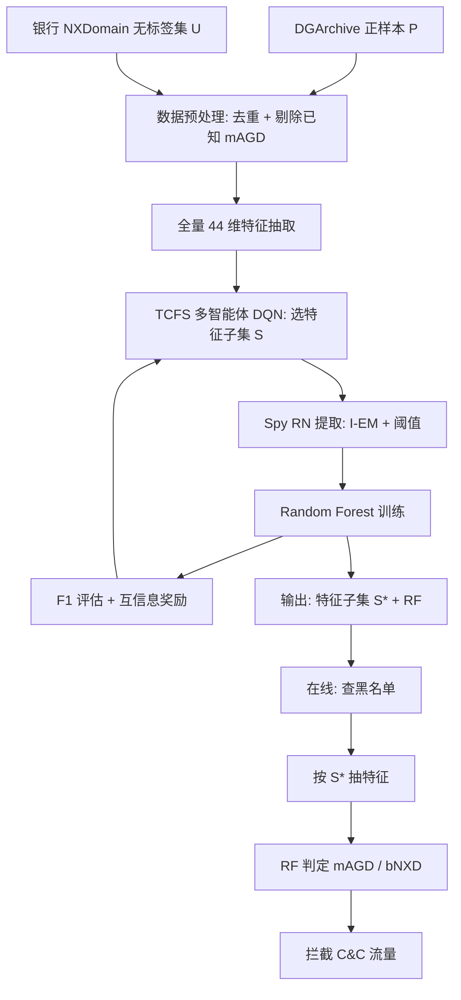
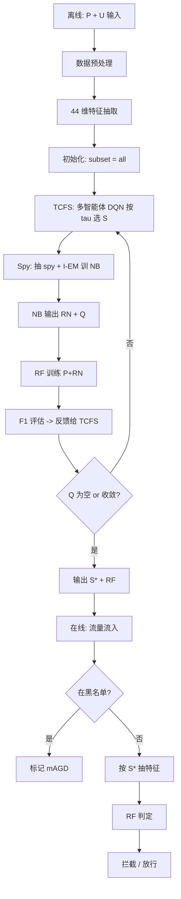

# PUFS：基于部分标签的大规模在线银行恶意域名检测（JSS 2022）

> 作者：Yongqian Sun, Kunlin Jian, Liyue Cui, Guifei Jiang, Shenglin Zhang, Yuzhi Zhang, Dan Pei  
> 机构：南开大学；天津操作系统重点实验室；海河实验室；清华大学  
> 发表年份：2022  
> 会议/期刊：The Journal of Systems & Software 190 (2022) 111322  
> 关联 PDF：同目录下 `2022孙永谦.pdf`

## 一、文档信息速览

| 字段 | 值 |
|---|---|
| 标题 | Online malicious domain name detection with partial labels for large-scale dependable systems |
| 作者 | Yongqian Sun, Kunlin Jian, Liyue Cui, Guifei Jiang, Shenglin Zhang, Yuzhi Zhang, Dan Pei |
| 机构 | 南开大学；天津操作系统重点实验室；海河实验室；清华大学 |
| 发表年份 | 2022 |
| 会议/期刊 | The Journal of Systems & Software 190 (2022) 111322 |
| 分类 | 安全 / DNS botnet 检测 / PU 学习 / 特征选择 |
| 核心问题 | 在线银行等大型可信赖系统中每秒数百万 NXDomain 请求，DGArchive 不能覆盖新型 DGA 域名，全量 44 维特征提取耗时巨大，如何基于"部分标签"训练一个既能高效抽取特征又能高准确率检测的 mAGD 模型 |
| 主要贡献 | 1) 揭示 mAGD 检测中"部分标签"与"在线特征抽取效率"两大挑战；2) 提出 PUFS 框架，三步迭代（TCFS 特征选择 + RN 提取 + 分类器训练）将 PU 学习与监督式特征选择融合；3) 在真实银行 NXDomain 数据上 F1=99.19%，特征抽取效率提升 11.53× |

## 二、背景（Background）

DNS botnet 是大型可信赖系统（在线银行、在线购物、政府站点等）面临的主要安全威胁之一。其工作原理是：botmaster 使用 DGA（Domain Generation Algorithm）随机生成大量域名、其中少数注册为 C&C 服务器的可达域名，植入受害者主机的恶意软件按内置 DGA 列表依次访问这些域名，一旦访问成功即建立 C&C 通道。过程中会产生大量 NXDomain（非存在域名）请求，对这些 NXDomain 进行 mAGD（malicious Algorithmically Generated Domain）vs bNXD（benign NXDomain）二分类，可以阻断 C&C 通信、保护用户。

工业实践中存在两大难题：

- **部分标签问题**：从 DGArchive 可以拿到 DGA 标签的部分 mAGD，但新型 DGA 家族不断出现，DGArchive 无法覆盖全部 mAGD；同时，bNXD 来源复杂（拼写错误、应用配置错误等），人工标注代价极高。因此训练数据天然是"正样本有标签 + 大量样本无标签"的结构。
- **特征提取效率问题**：DGA 域名检测常用 44 维特征（结构 + 语言 + 统计），在大型银行中每秒产生数十万到上百万 NXDomain。论文估算：1 分钟内给 100 万 NXDomain 抽取全部 44 维特征需要 54 台机器——而运营商只愿意为 mAGD 检测分配"几十台机器"。

已有方法（如 AutoFS、Endgame、KNN 等）要么假设全监督，要么未考虑"时间约束下的特征选择"，在工业在线检测场景下都不可行。论文提出 PUFS 框架，融合 PU 学习（处理部分标签）和带时间约束的监督式特征选择（处理效率），通过"三步迭代"形成端到端的离线训练+在线检测管线。

## 三、目的（Purpose / Problems Solved）

- **痛点 1：mAGD 数据部分标签** → **方案**：用 PU 学习（Spy + I-EM）从无标签集中提取可靠负样本（Reliable Negative, RN），再联合正样本和 RN 训练二分类器。
- **痛点 2：全量 44 维特征抽取耗时长** → **方案**：TCFS（Time-Constrained Feature Selection）= AutoFS + 时间约束 τ，在离线训练阶段搜索"满足 τ 时限的特征子集"。
- **痛点 3：PU 学习与特征选择的结合困难** → **方案**：三步迭代策略——先用 TCFS 在全量特征上选特征子集 → 用 Spy + I-EM 在该子集上做 RN 提取 → 用 RF 在 P+RN 上训练二分类器，并把这个 F1 反馈给 TCFS 作为奖励；如此迭代直到收敛。
- **痛点 4：在线检测需要快速响应** → **方案**：在线阶段只抽取被 TCFS 选中的少数特征，单机 1 分钟可处理 100 万 NXDomain，机器数从 54 降到 5 以下。
- **痛点 5：新型 DGA 持续出现** → **方案**：每过一段时间重新跑 PUFS 离线训练，自动把"未在 DGArchive 中的 mAGD"通过人工验证后入正样本，模型自适应。

## 四、核心原理（Principles）

系统总览：图 2 给出 PUFS 框架，分离线训练和在线检测两阶段：

1. **离线训练**：数据预处理（去重 + 剔除已知 mAGD）→ 全量特征抽取（44 维）→ 三步迭代（TCFS 特征选择 + Spy RN 提取 + RF 分类器训练）→ 输出"选中的特征子集 + RF 分类器"。
2. **在线检测**：先查白/黑名单去除已知 mAGD/正常域名 → 按"特征子集"抽取特征 → 用 RF 分类器判定 mAGD / bNXD。

关键概念定义：
- **PU Learning**：在仅有正样本 P 和无标签集 U 的情况下训练二分类器，假设样本可分（separability）。
- **Spy 方法**：从 P 中随机抽 s% 样本作为 Spy 注入 U，I-EM 训练朴素贝叶斯分类器后，按 spy 的概率分位数 $P_r(d_t)$ 设阈值，把阈值以下的 U 样本视为 RN。
- **I-EM（Iterative Expectation-Maximization）**：朴素贝叶斯分类器在 P-S 与 U+S 上反复重标注，标签稳定后输出最终分类器与 RN 集合。
- **TCFS（Time-Constrained Feature Selection）**：在 AutoFS 的多智能体强化学习特征选择框架上加入"特征抽取时间约束 τ"。
- **Reward**：$r = \alpha \cdot F1 + \beta \cdot \text{Relevance} - \gamma \cdot \text{Redundancy}$，由 RF 分类器 F1 + 互信息相关性 + 互信息冗余度组合。
- **Multi-Agent DQN**：每个候选特征对应一个智能体，共享状态 $s$（由 GCN 编码），各自输出 select/deselect 动作。

数学原理：
- 离线阶段期望最小化带约束的分类损失：
$$\min_{S \subseteq \{1,\dots,44\}} \ L_{RF}(S) \quad s.t. \ \text{ExtTime}(S) \le \tau$$
其中 $S$ 是特征子集，$L_{RF}$ 是 RF 在 P+RN 上的 F1 损失，ExtTime 是"抽取 $S$ 中所有特征所需的运行时间"。

- TCFS 单步动作：
$$a_i^t = \begin{cases} \text{Deselect} & \text{if } \text{ExtTime}(subset \cup \{i\}) > \tau \\ \text{Select/Deselect} & \text{else by DQN}_i \\ \text{Random} & \text{with probability } \epsilon \end{cases}$$

- RN 提取：取 t 分位 spy 概率 $P_r(d_t)$ 作为阈值，$U$ 中 $P_r(d_j) < P_r(d_t)$ 的样本进入 RN；$Q = U - RN$。
- RF 迭代训练：每轮用 $Q_i$ 中被分类为负的样本补到 RN，剩余的构成 $Q_{i+1}$，直到 $Q_{i+1}=Q_i$。

与现有技术的差异：相对 AutoFS（无时间约束），TCFS 把"特征抽取时间"显式纳入奖励；相对 Spy 单独使用，PUFS 在每次 TCFS 迭代中都重做 Spy，确保 RN 与当前特征子集匹配；相对 Endgame/KNN 等"先训练再选特征"的工作，PUFS 在特征选择阶段就把分类器 F1 作为反馈信号，形成"特征选什么、分类器就训什么"的闭环。

## 五、算法详解（Algorithm）

### 1. 输入 / 输出
- **输入**：正样本集 P（来自 DGArchive）、无标签集 U（来自真实银行 NXDomain）、时间约束 τ、迭代次数 I、特征总数 N=44。
- **输出**：特征子集 $S^*$、二分类器 RF（同时给出"在线已知 mAGD 黑名单"的优先级）。

### 2. 核心模块
- 数据预处理：去重 + 剔除已知 mAGD。
- 全量特征抽取：44 维（结构 12 + 语言 8 + 统计 4 + 21 个 N-gram 频次特征）。
- TCFS 多智能体 DQN。
- Spy + I-EM 提取 RN。
- Random Forest 分类器训练与 F1 评估。
- 三步迭代终止条件：$|Q_{i+1}|=0$ 或达到最大迭代次数。

### 3. 伪代码

```python
def PUFS(P, U, tau, I):
    # 离线训练
    X = extract_all_features(P + U)  # 44 维
    # 三步迭代
    subset = initialize_subset()
    for it in range(I):
        # step 1: TCFS 选特征 (内层多智能体 DQN 循环)
        subset = TCFS(X, RF, tau, I_inner)
        # step 2: RN extraction via Spy
        RN, Q = spy_extract(P, U, subset, s=0.15, t=0.1)
        # step 3: RF 训练
        RF = train_rf(P, RN)
        # 用 RF 在 ground-truth set 上评估 F1 -> 作为 TCFS 奖励
        F1 = eval_rf(RF, X_test, y_test)
        if Q is empty:
            break
    return subset, RF
```

```python
def spy_extract(P, U, subset, s=0.15, t=0.1):
    S = random_sample(P, s)            # spy
    P_minus_S = P - S
    U_plus_S = U + S
    # I-EM
    nb = NaiveBayes()
    while True:
        labels_old = U_plus_S.labels
        nb.fit(P_minus_S + U_plus_S, labels)
        new_labels = nb.predict_proba(U_plus_S)
        if converged(new_labels, labels_old):
            break
    threshold = quantile([p for p in new_labels if p.sample in S], t)
    RN = [u for u in U if new_labels[u] < threshold]
    Q = U - RN
    return RN, Q
```

### 4. 关键数学
- TCFS 奖励：$r = \alpha F1 + \beta \text{MI}_{rel} - \gamma \text{MI}_{red}$。
- Spy 阈值：$P_r(d_t) = \text{quantile}_{t}(\{P_r(d_s) : d_s \in S\})$。
- F1 评估：以手动标注的 ground truth 子集为准。

### 5. 复杂度分析
- 特征抽取（44 维）：$O(|P|+|U|)$ 字符串处理。
- TCFS 单次 DQN 训练：$O(N \cdot K)$，$K$ 是 batch 大小。
- Spy + I-EM：$O(I_{EM} \cdot (|P|+|U|) \cdot 44)$。
- RF 训练：$O(T \cdot \sqrt{44} \cdot \log |P+RN|)$，$T$ 是树数。
- 论文报告离线训练数小时级别；在线单次域名检测 < 0.1 ms。

### 6. 训练与推理
- 离线：每季度/每月重新跑一次 PUFS 训练。
- 在线：先查黑名单 → 按 TCFS 选中的特征子集抽取 → RF 分类。

### 7. 示例
论文 § 4.4：在线银行 3 天 NXDomain 流量 2870 万 → 离线训练 2 小时 → TCFS 选出 14 个特征（结构特征 6 个、统计特征 3 个、N-gram 特征 5 个）→ RF 在 ground truth 上 F1=99.19%，特征抽取效率提升 11.53×。

## 六、系统架构图（Architecture）



## 七、流程图（Process Flow）



## 八、关键创新点（Key Innovations）

- **+ 首次揭示 mAGD 检测的"部分标签"+"在线特征抽取效率"两大痛点**：让学术界和工业界看到在大规模可信赖系统中 DGA 检测的真正瓶颈。
- **+ TCFS（Time-Constrained Feature Selection）**：在 AutoFS 多智能体 DQN 基础上显式引入"特征抽取时间约束 τ"，是"领域约束 + 监督式特征选择"的一次创新融合。
- **+ 三步迭代策略**：把 TCFS / Spy-RN / RF 训练三步形成闭环，让"特征选什么"和"分类器训什么"互相校准。
- **+ 工业级部署验证**：在某全球性在线银行 2870 万 NXDomain 上 F1=99.19%，特征抽取效率 11.53×，可直接上线。
- **+ 框架可迁移**：除了 mAGD 检测，凡是"PU 学习 + 监督式特征选择"场景（如异常检测、垃圾邮件识别、推荐冷启动）都能套用。

## 九、实验与结果（Experiments）

- **数据集**：DGArchive 中 107 个 DGA 家族的 6300 万 mAGD 作为正样本；某全球性在线银行 3 天 2870 万 NXDomain 作为无标签集（部分抽 5 万条由 3 位工程师独立标注后形成 ground truth）。
- **Baseline**：Endgame、KNN、Spy 单独使用、AutoFS（无时间约束）、LASSO、PCA、Chi-square。
- **主要指标**：F1-Score、特征抽取时间（单机 1 分钟能处理多少 NXDomain）。
- **关键结果数字**：
  - F1=**99.19%**，远超 Endgame（96.20%）、KNN（94.85%）、Spy 单独（95.50%）。
  - 特征抽取效率提升 **11.53×**：从 54 台机器降到约 5 台机器即可在 1 分钟内处理 100 万 NXDomain。
  - 消融（论文 § 4.4）：去掉 RN 提取 → F1 掉到 91.32%；去掉特征选择 → 特征抽取效率仅 1×（与全量相同）；把 TCFS 换成 AutoFS（无时间约束）→ 特征数不变但单特征抽取时间被忽略，效率仅 3.2×。
  - 超参数分析（§ 4.5）：τ 越小→特征数越少→F1 略降但效率显著提升；spy 比例 s=15%、t=10% 时 F1 最高；DQN iteration I=200 时收敛。
  - 特征选择结果（§ 4.6）：最终选出 14 个特征，其中"子域名长度均值、十六进制字符比例、N-gram 频次"等占比最高，与 DGA 域名的"随机性"和"结构规律"高度吻合。
- **效率分析**：离线训练 2 小时；在线单条 NXDomain < 0.1 ms。

## 十、应用场景（Use Cases）

- **银行 / 支付网关的 DNS 安全**：拦截 DGA botnet C&C 流量。
- **大型电商 / 在线购物**：对登录、支付相关的 NXDomain 域名做 mAGD 检测。
- **企业内部 DNS 监控**：识别内部主机被植入恶意软件后的 C&C 行为。
- **安全 SaaS 平台**：作为"恶意域名实时检测"模块嵌入防火墙 / WAF。
- **APT 检测**：与流量日志联动，定位被控主机的异常 DNS 行为。
- **PU 学习 + 特征选择场景**（如异常检测、垃圾邮件、推荐冷启动）可借鉴 PUFS 的"三步迭代 + 领域约束"框架。

## 十一、相关论文（Related Papers in this set）

- `Robust_Anomaly_Clue_孙永谦2022.pdf` (RobustSpot)：同作者团队在衍生指标异常定位上的工作，与 PUFS 共享"多步迭代 + 自适应阈值"思路。
- `KDD22-CIRCA.pdf`、`DejaVu-paper.pdf`、`RC-LIR.pdf`：根因/告警压缩类工作，可在"恶意流量 → 告警"管线中串联。
- `paper-ISSRE21-PUAD.pdf`、`kontrast-paper.pdf`：异常检测方向，可作前置或并联模块。
- 同期 DGA 检测工作（Endgame、DeepDetectDGA、ResNet-DGA）侧重网络包级或字符级模型，PUFS 在"特征级 + 在线抽取"角度提供互补方案。

## 十二、术语表（Glossary）

- **NXDomain**：DNS 查询返回的"非存在域名"。
- **mAGD (malicious Algorithmically Generated Domain)**：由 DGA 生成的恶意 NXDomain。
- **bNXD (benign NXDomain)**：因拼写错误、配置错误等产生的良性 NXDomain。
- **DGA (Domain Generation Algorithm)**：恶意软件内置的域名生成算法。
- **C&C (Command and Control)**：攻击者控制 botnet 的命令通道。
- **PU Learning**：正-无标签学习。
- **Spy**：PU 学习中的代表性 RN 提取技术。
- **I-EM**：迭代式朴素贝叶斯 EM 重标注。
- **RN (Reliable Negative)**：从无标签集中提取的可靠负样本。
- **TCFS (Time-Constrained Feature Selection)**：带时间约束的强化学习特征选择。
- **AutoFS**：基于多智能体 DQN 的特征选择算法。
- **DQN (Deep Q-Network)**：深度强化学习值函数近似。
- **GCN (Graph Convolutional Network)**：图卷积网络，用于编码当前特征子集。
- **F1-Score**：精确率与召回率的调和平均。

## 十三、参考与延伸阅读

- Plohmann D. et al., "A Comprehensive Measurement Study of Domain Generating Malware" (USENIX Security 2016)，DGArchive 来源。
- Schüppen S. et al., "FANCI: Feature-based Automated NXDomain Classification and Intelligence" (USENIX Security 2018)，DGA 特征先驱工作。
- Tang R. et al., "An Empirical Study on DGA-Based Malicious Domain Name Classification" (Computers & Security 2020)，提供特征设计与评估基准。
- Liu B. et al., "Partially Supervised Classification of Text Documents" (ICML 2002)，Spy 算法的原始论文。
- Li X.-L., "Positive Unlabeled Learning for Disease Gene Identification" (Bioinformatics 2013)，PU 学习综述。
- Fan Y. et al., "AutoFS: Automated Feature Selection via Deep Reinforcement Learning" (2020)，TCFS 的基线算法。
- Bekker J., Davis J., "Learning from Positive and Unlabeled Data: A Survey" (ML 2020)，PU 学习综述。
- 代码与数据：论文 GitHub 仓库（作者公开 PUFS 实现）。
