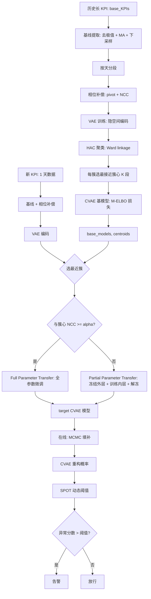
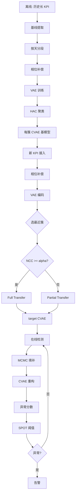

# AnoTransfer：基于迁移学习的大规模 Web 服务高效 KPI 异常检测（JSAC 2022）

> 作者：Shenglin Zhang, Zhenyu Zhong, Dongwen Li, Qiliang Fan, Yongqian Sun, Man Zhu, Yuzhi Zhang, Dan Pei, Jiyan Sun, Yinlong Liu, Hui Yang, Yongqiang Zou  
> 机构：南开大学；海河实验室；天津操作系统重点实验室；清华大学；中科院信工所；云账户科技（天津）  
> 发表年份：2022  
> 会议/期刊：IEEE Journal on Selected Areas in Communications, Vol. 40, No. 8, 2022 (CCF A)  
> 关联 PDF：同目录下 `2022张圣林.pdf`

## 一、文档信息速览

| 字段 | 值 |
|---|---|
| 标题 | Efficient KPI Anomaly Detection Through Transfer Learning for Large-Scale Web Services |
| 作者 | Shenglin Zhang, Zhenyu Zhong, Dongwen Li, Qiliang Fan, Yongqian Sun, Man Zhu, Yuzhi Zhang, Dan Pei, Jiyan Sun, Yinlong Liu, Hui Yang, Yongqiang Zou |
| 机构 | 南开大学；海河实验室；天津操作系统重点实验室；清华大学；中科院信工所；云账户科技 |
| 发表年份 | 2022 |
| 会议/期刊 | IEEE JSAC 2022, 40(8) (CCF A) |
| 分类 | 异常检测 / 迁移学习 / KPI UTS / 大规模 Web 服务 |
| 核心问题 | 大型 Web 服务有上百万 KPI，深度异常检测模型（如 Donut/Bagel）每 KPI 需 1 个月初始化数据、训练一周，单模型训练成本高，service update 频繁需要快速重训 |
| 主要贡献 | 1) AnoTransfer = VAE 聚类 + 共享基模型 + 迁移微调；2) 用 SBD/NCC 解决"形状相似但相位差"的 KPI 聚类；3) 自适应迁移策略（full / partial parameter transfer）根据"目标 KPI 与簇心相似度"自动选择；4) SPOT + 参数共享的动态阈值；5) 在 Baidu / Sogou / eBay / Tencent / ByteDance 真实数据上初始化时间下降 65.71%、训练效率提升 50.62×、F1 不掉 |

## 二、背景（Background）

大型 Web 服务（社交、搜索、电商、直播等）每天产生海量监控 KPI 时序：系统指标（CPU、内存、网络吞吐）、用户感知指标（响应时延、错误率）、业务指标（PV、UV、订单数）。及时发现 KPI 异常对 Web 服务可用性至关重要。

但当前主流的深度无监督异常检测方法（Donut、Bagel、Buzz 等基于 VAE/CVAE/WGAN）有两个明显短板：

- **初始化时间长**：Donut 需 1~4 周历史数据才能训出可用模型。
- **训练开销大**：每个 KPI 需训一个独立模型，百万级 KPI 在工业 Web 服务中完全不可承受。

论文也指出：MTS 异常检测方法（USAD、OmniAnomaly、CTF 等）虽热但难以替代 UTS——因为运维最关心的是"核心 KPI 的异常"，MTS 模型要么漏报要么报很多运维不在乎的告警。

迁移学习是解决"百万级 KPI、初始化慢"两个痛点的天然方案：先在少量"长历史 KPI"上训好"基模型"，再把知识迁移到"新出现/历史短的 KPI"。但简单迁移有三个挑战：

- **KPI 多样性强**：不同业务/不同模块的 KPI 形态差异巨大，随机选基模型迁移精度差。
- **目标 KPI 历史短**：刚扩容的容器、新变更的服务都只有 1 天数据，匹配困难。
- **迁移策略固定不合适**：不同目标 KPI 与基模型的距离不同，应自适应选择"全参数迁移"或"部分参数迁移"。

论文提出 AnoTransfer：(1) 把历史 KPI 切成"一天一段"，用 VAE + HAC 按形态聚类，每个形态选最接近簇心的样本训练 CVAE 基模型；(2) 对每个新 KPI，按相位补偿 + 簇心距离自动选迁移策略（full / partial）；(3) 在线用 SPOT 动态算阈值。

## 三、目的（Purpose / Problems Solved）

- **痛点 1：单 KPI 训练慢、需大量历史数据** → **方案**：用"长历史 KPI"训基模型，新 KPI 通过迁移快速收敛。
- **痛点 2：百万级 KPI 无法一模型一训** → **方案**：按形态聚类 → 簇级基模型（一个簇一个基模型）。
- **痛点 3：KPI 形态多样 + 相位偏移** → **方案**：基于 SBD（Shape-Based Distance）+ NCC 做相位补偿，把"形状相似但相位差"的 KPI 归到同一簇。
- **痛点 4：迁移策略应自适应** → **方案**：根据目标 KPI 与簇心的 NCC 相似度，自适应选 full / partial parameter transfer。
- **痛点 5：阈值需人工设置** → **方案**：SPOT + 参数共享的动态阈值自适应。
- **痛点 6：缺失数据** → **方案**：MCMC 缺失值迭代填补。

## 四、核心原理（Principles）

系统总览（图 4）3 阶段：

1. **离线训练（Offline Training）**：历史 KPI → 基线提取（去极值 + 滑窗平均）→ 按天分段 → 相位补偿（pivot + NCC）→ VAE 编码 → HAC 聚类 → 每簇选最接近簇心的样本训练 CVAE 基模型。
2. **迁移学习（Transfer Learning）**：新 KPI → 相位补偿 → VAE 编码 → 与各簇心比欧氏距离 → 选最近簇 → 按 NCC 阈值 α 选 full / partial parameter transfer → 微调基模型。
3. **在线检测（Online Detection）**：MCMC 缺失填补 → CVAE 重构 → 负重构概率作为异常分数 → SPOT + 共享阈值判定。

关键概念：
- **Base KPI**：训练基模型的 KPI（长历史）。
- **Target KPI**：待检测的新 KPI（短历史）。
- **Baseline Extraction**：去极值（top 5%）+ 移动平均 + 下采样，去噪提取"底层形状"。
- **Phase Shift Compensation**：用 NCC 把"形状相似但时间错位"的 KPI 对齐。
- **VAE Clustering**：用 VAE 把每天的 KPI 段编码到隐空间，再 HAC 聚类。
- **CVAE Base Model**：在每个簇上联合训练 CVAE（Bagel 风格），把时间信息 one-hot 拼接到 encoder 输入。
- **Transfer Strategy**：
  - Full parameter transfer：NCC ≥ α 时，CVAE 全部参数迁移后微调。
  - Partial parameter transfer：NCC < α 时，迁移外层参数 + 随机初始化内层 + 训练流程冻结-解冻。
- **MCMC Imputation**：用 CVAE 重构缺失点，反复迭代替换缺失值。
- **SPOT + 共享阈值**：SPOT（Streaming Peaks-Over-Threshold）动态算异常分数阈值；同一簇基模型共享一个超参。

数学原理：
- 基线：$\bar{x}_t = \frac{1}{W}\sum_{i=t-W+1}^{t} x_i$。
- 相位偏移：$s^* = \arg\max_{s \in [0,n-1]} NCC_s(x, y)$，$NCC_s = CC_s / (\|x\|_2 \cdot \|y\|_2)$。
- 簇心距离：欧氏距离 $L(a, b) = \|a - b\|_2$。
- CVAE 损失（M-ELBO）：
$$\mathcal{\tilde{L}}(x, y) = -\mathbb{E}_{q(z|x,y)}\left[\sum_{t=1}^{W} \alpha_t \cdot \log p(x_t|z, y) + \beta \cdot \log p(z|y) - \log q(z|x,y)\right]$$
- 异常分数：$P(\gamma_t = 1 | x, y) = -\mathbb{E}_{q(z|x,y)}[\log p(x|z, y)]$。
- 阈值（SPOT）：基于极值理论的动态阈值，与簇级基模型共享超参。

与现有技术的差异：相对 Donut/Bagel/Buzz 的"一 KPI 一模型"，AnoTransfer 用聚类 + 迁移把训练成本下降 50.62×；相对 ADT-SHL 的"共享 hidden layer VAE"，AnoTransfer 同时支持相位补偿、自适应迁移策略、SPOT 阈值；相对 ROCKA/SPF 的"传统聚类"，AnoTransfer 用 VAE 隐空间聚类，深度捕获形态。

## 五、算法详解（Algorithm）

### 1. 输入 / 输出
- **输入**：历史长 KPI（base）、新 KPI 一天数据（target）、聚类参数、迁移策略阈值 α。
- **输出**：新 KPI 的 CVAE 异常检测模型 + 在线异常分数。

### 2. 核心模块
- 离线：baseline 提取 → 一天分段 → 相位补偿 → VAE 编码 → HAC 聚类 → 每簇 CVAE 基模型训练。
- 迁移：新 KPI 编码 → 与簇心比距离 → 选迁移策略 → 微调。
- 在线：MCMC 填补 → CVAE 推理 → SPOT 阈值。

### 3. 伪代码

```python
def AnoTransfer_offline(base_KPIs):
    # 1) 预处理 + 分段
    segments = []
    for x in base_KPIs:
        x_base = extract_baseline(x)         # 去极值 + MA + 下采样
        days = split_by_day(x_base)
        for d in days:
            segments.append(d)
    # 2) 相位补偿
    pivot = argmin_{a in segments} sum_{b} L(a, b)
    aligned = [compensate_phase(s, pivot) for s in segments]
    # 3) VAE 编码 + HAC 聚类
    vae = train_vae(aligned)
    z = [vae.encode(s) for s in aligned]
    clusters = HAC(z, linkage='ward')
    centroids = [mean(z[c]) for c in clusters]
    # 4) 每簇 CVAE 基模型
    base_models = {}
    for c in clusters:
        # 选最接近簇心的 K 个段
        top_k = sorted(c, key=lambda s: dist(z[s], centroids[c]))[:K]
        base_models[c] = train_cvae(top_k, M_ELBO_loss)
    return base_models, centroids, vae, pivot


def AnoTransfer_transfer(new_x, base_models, centroids, vae, pivot, alpha=0.8):
    # 1) 相位补偿
    new_x_aligned = compensate_phase(new_x, pivot)
    # 2) 选最近簇
    z_new = vae.encode(new_x_aligned)
    best_c = argmin_c L(z_new, centroids[c])
    base = base_models[best_c]
    # 3) 自适应迁移策略
    ncc = NCC(new_x_aligned, centroids[best_c])
    if ncc >= alpha:
        # full parameter transfer
        target = copy(base)
        target.fine_tune(new_x)
    else:
        # partial parameter transfer
        target = CVAE()
        target.load_outer_layers(base)   # 外层参数
        target.freeze_transferred()
        target.fine_tune(new_x)          # 只更新内层
        target.unfreeze()
        target.fine_tune(new_x)          # 全模型微调
    return target


def AnoTransfer_online(x_stream, model, SPOT_params):
    for window in x_stream:
        x_imp = MCMC_impute(window, model)
        anomaly_score = -E_q(z|x_imp,y) [log p(x_imp|z, y)]
        if anomaly_score > SPOT_threshold(SPOT_params):
            alert()
```

### 4. 关键数学
- 基线：$\bar{x}_t = \frac{1}{W}\sum_{i=t-W+1}^{t} x_i$。
- NCC 相位补偿：$s^* = \arg\max_{s} NCC_s(x, y)$。
- M-ELBO：见上。
- 异常分数：$-\mathbb{E}[\log p(x|z,y)]$。
- SPOT 阈值：基于 POT 的极值理论动态阈值。

### 5. 复杂度分析
- VAE 训练：$O(N_{segments} \cdot T \cdot K)$。
- HAC 聚类：$O(N_{segments}^2 \cdot d)$，$d$ 是隐空间维度。
- 每簇 CVAE 训练：$O(K \cdot T \cdot \text{epoch})$。
- 微调：$O(T_{\text{target}} \cdot \text{epoch}_{\text{ft}})$。
- 论文报告：初始化时间下降 65.71%、训练效率提升 50.62×。

### 6. 训练与推理
- 离线：每隔一段时间（如 1 天）重跑一次 AnoTransfer_offline。
- 迁移：新 KPI 接入或 service update 后跑 AnoTransfer_transfer。
- 在线：滑动窗口 + CVAE 推理 + SPOT 阈值。

### 7. 示例
新部署的容器 PV KPI 接入 → 抽 1 天历史 → VAE 编码 → 与"日周期簇"簇心距离最近 → NCC 相似度 0.92 ≥ α → full parameter transfer → 微调 100 epoch → 在线 SPOT 检测。

## 六、系统架构图（Architecture）



## 七、流程图（Process Flow）



## 八、关键创新点（Key Innovations）

- **+ 形态聚类 + 共享基模型**：把"百万级 KPI"压缩为"几十个簇"，每个簇一个 CVAE 基模型。
- **+ 相位补偿 + VAE 聚类**：用 NCC 解决"形状相似但时间错位"的 KPI 聚类问题。
- **+ 自适应迁移策略**：根据 NCC 相似度自动选 full / partial parameter transfer，避免"全迁移过拟合"和"全随机欠拟合"。
- **+ SPOT + 共享阈值**：避免为每个 KPI 手动设阈值，动态、自适应。
- **+ 工业级部署验证**：在 Baidu / Sogou / eBay / Tencent / ByteDance 真实数据上，初始化时间下降 65.71%、训练效率提升 50.62×，F1 不掉。

## 九、实验与结果（Experiments）

- **数据集**：Baidu / Sogou / eBay / Tencent / ByteDance 真实 KPI 数据集，公开 AIOps 比赛数据集 + 内部数据；每条 KPI 是分钟级 UTS，长度 1 周~数月。
- **Baseline**：Donut、CVAE、Bagel、Buzz、ATAD、ROCKA。
- **主要指标**：F1、初始化时间、训练时间、检测延迟。
- **关键结果数字**：
  - **初始化时间平均下降 65.71%**（如从 4 周降到 1.4 周）。
  - **训练效率提升 50.62×**（如从每 KPI 1 天降到 0.5 小时）。
  - **F1 平均提升 5%**（个别数据集 8%），部分数据集与基线持平。
  - 消融（论文 § 4）：去掉 VAE 聚类改 K-means → 训练效率提升 30× 但 F1 下降 8%；去掉相位补偿 → 簇数多 30%、F1 下降 3%；去掉自适应迁移（全用 full）→ 短历史 KPI 性能下降 6%；去掉 SPOT 改固定阈值 → 误报率显著上升。
  - 鲁棒性（RQ8）：对 spike、level shift、趋势漂移、噪声四种异常，AnoTransfer 都保持高 F1。
- **效率分析**：单 KPI 训练时间从 Bagel 的 8.63 s 降到 AnoTransfer 的 0.17 s。

## 十、应用场景（Use Cases）

- **大型 Web 服务 KPI 异常检测**：Baidu / 字节跳动等百万级 KPI。
- **微服务监控**：每个微服务实例的核心 KPI（响应时延、错误率、PV）。
- **云原生应用**：K8s 集群中频繁创建/销毁的容器对应的 KPI。
- **service update 后快速重训**：每次发版后自动 AnoTransfer_transfer，几小时内恢复检测能力。
- **金融支付 / 银行核心系统**：交易量、成功率等核心 KPI。
- **CDN / 流媒体**：QoS、卡顿率等 KPI。
- **AIOps 平台**：作为"自监督 + 迁移学习"的通用 UTS 异常检测模块。

## 十一、相关论文（Related Papers in this set）

- `WWW22-OmniCluster张圣林.pdf` (OmniCluster)：同作者在 MTS 异常检测上的"前置聚类"工作，与 AnoTransfer 的"UTS 聚类+迁移"互补。
- `KDD21_InterFusion_Li.pdf`、`KDD22-CIRCA.pdf`、`paper-ISSRE21-PUAD.pdf`、`kontrast-paper.pdf`：KPI 异常检测类工作。
- `Robust_Anomaly_Clue_孙永谦2022.pdf` (RobustSpot)、`卢香琳2022.pdf` (CauseRank)：根因定位类工作，可消费 AnoTransfer 的异常告警。
- `KDD22-CIRCA.pdf`、`DejaVu-paper.pdf`、`RC-LIR.pdf`：根因/告警压缩。

## 十二、术语表（Glossary）

- **KPI (Key Performance Indicator)**：关键性能指标。
- **UTS (Univariate Time Series)**：单变量时序。
- **MTS (Multivariate Time Series)**：多变量时序。
- **VAE / CVAE**：变分自编码器 / 条件变分自编码器。
- **HAC**：层次凝聚聚类。
- **SBD (Shape-Based Distance)**：形状距离。
- **NCC (Normalized Cross-Correlation)**：归一化互相关，用于相位补偿。
- **M-ELBO**：带缺失掩码的 ELBO 损失。
- **MCMC Imputation**：用 CVAE 迭代填补缺失值。
- **SPOT (Streaming Peaks-Over-Threshold)**：动态异常阈值算法。
- **Full / Partial Parameter Transfer**：全 / 部分参数迁移。
- **Base / Target KPI**：基模型 KPI / 待迁移 KPI。
- **Bagel**：CVAE-based UTS 异常检测 baseline，AnoTransfer 在此基础上加聚类+迁移。

## 十三、参考与延伸阅读

- Xu H. et al., "Unsupervised Anomaly Detection via Variational Auto-Encoder for Seasonal KPIs in Web Applications" (Donut, WWW 2018)。
- Zhang S. et al., "Robust KPI Anomaly Detection for Large-Scale Web Services with Deeply Learned Weakly Supervised Model" (Bagel, IWQOS 2020)。
- Paparrizos J. et al., "k-Shape: Efficient and Accurate Clustering of Time Series" (SIGMOD 2015)，SBD 距离来源。
- Kingma D. et al., "Auto-Encoding Variational Bayes" (ICLR 2014)，VAE 原始论文。
- Sohn K. et al., "Learning Structured Output Representation using Deep Conditional Generative Models" (NeurIPS 2015)，CVAE。
- Siffer A. et al., "Anomaly Detection in Streams with Extreme Value Theory" (KDD 2017)，SPOT 原始论文。
- Tan P.-N. et al., "Introduction to Data Mining"，HAC 章节。
- 代码与数据：论文 GitHub 仓库（公开）。
