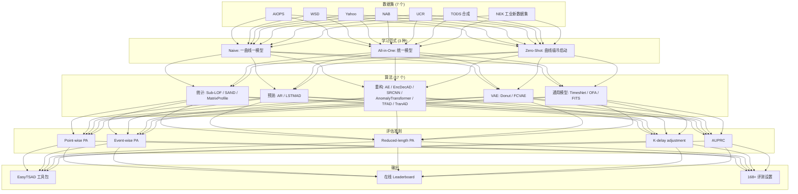
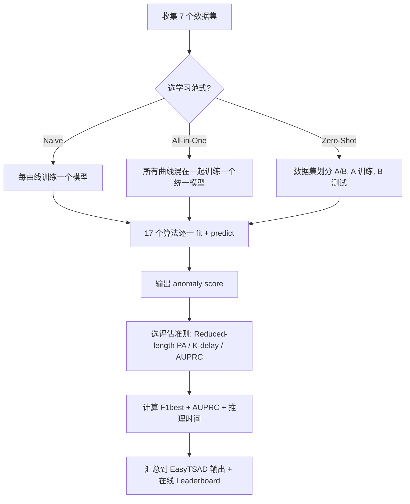

# TimeSeriesBench: An Industrial-Grade Benchmark for Time Series Anomaly Detection Models（AAAI / NeurIPS Workshop 2024）

> 作者：Haotian Si, Jianhui Li, Changhua Pei, Hang Cui, Jingwen Yang, Yongqian Sun, Shenglin Zhang, Jingjing Li, Haiming Zhang, Jing Han, Dan Pei, Gaogang Xie  
> 机构：中国科学院 CNIC、南开大学、吉林大学、清华大学、中兴通讯  
> 发表年份：2024  
> 会议/期刊：arXiv:2402.10802v3，TSAD 评测基准（2024 年 9 月修订）  
> 关联 PDF：同目录下 `2402.10802v3.pdf`  
> 代码：https://github.com/CSTCloudOps/EasyTSAD；数据集 https://github.com/CSTCloudOps/Dataset-for-TSAD；在线 leaderboard：https://adeval.cstcloud.cn

## 一、文档信息速览

| 字段 | 值 |
|---|---|
| 标题 | TimeSeriesBench: An Industrial-Grade Benchmark for Time Series Anomaly Detection Models |
| 作者 | Haotian Si, Jianhui Li, Changhua Pei, Hang Cui, Jingwen Yang, Yongqian Sun, Shenglin Zhang, Jingjing Li, Haiming Zhang, Jing Han, Dan Pei, Gaogang Xie |
| 机构 | 中国科学院 CNIC / 国科大、吉林大学、南开大学、清华大学、中兴通讯 |
| 发表年份 | 2024 |
| 会议/期刊 | arXiv 预印本（EasyTSAD + 评测 leaderboard） |
| 分类 | 评测基准 / 时序异常检测 / 工业部署 |
| 核心问题 | 现有 TSAD 算法在工业部署时存在四大障碍：(I) 每条曲线一个模型、维护成本不可承受；(II) 新上线的曲线没有历史数据；(III) 现有评测指标"作弊"或与工业需求脱节；(IV) 缺乏持续更新的统一平台。 |
| 主要贡献 | 1) 第一个 TSAD 在线 leaderboard 与 EasyTSAD 工具包；2) All-in-One 训练范式 + Zero-Shot 推理范式；3) 事件级 Reduced-length PA 评估准则（解决 Point-wise PA 的"作弊"问题）；4) 17 个算法的 168+ 评测设置 + 工业数据集 NEK（Network Equipment KPI）。 |

## 二、背景（Background）

时序异常检测（TSAD）是 IT 运维、工业过程监控、网络流量安全等领域的关键能力。它通过识别"与历史正常模式显著偏离"的模式，帮助运维人员尽早发现机器故障、流量攻击、磁盘异常等问题，从而缩短 MTTR、减少收入损失、维护品牌信誉。

近年来 TSAD 领域呈现出"算法爆炸"的局面：统计方法（Sub-LOF、SAND、MatrixProfile）、预测式（AR、LSTMAD）、重构式（AE、EncDecAD、SRCNN、Anomaly Transformer、TFAD、TranAD）、VAE（Donut、FCVAE）、通用时序模型（TimesNet、OFA、FITS）百花齐放。然而把论文算法搬到生产环境，工程师却普遍面临四个现实障碍：

1. **每条曲线一个模型的成本**：工业系统动辄上万条 KPI 曲线，每条训练一个模型意味着上万次训练、上万份存储、版本管理与灰度上线都是噩梦。
2. **新上线系统无历史**：刚发布的服务、新上线的设备没有"足够历史数据"训练一个独占模型，需要一个能"零样本"工作的通用模型。
3. **现有评测指标"作弊"**：point-wise PA（F1 在异常段内只要命中一个点就算"整个段命中"）让"Random Guess"也能刷到高分，严重偏离工业对"少误报 + 早检测"的诉求。
4. **缺乏持续更新的统一平台**：学术界和工业界各跑各的，新方法出来工业没法第一时间评估。

TimeSeriesBench 的目标就是把这四个障碍"工程化地解决"：用 All-in-One 训练 + Zero-Shot 推理挑战 1 和 2；用事件级 Reduced-length PA + K-delay 调整 + 异常尾部延长解决 3；用在线 leaderboard + EasyTSAD 工具包解决 4。

## 三、目的（Purpose / Problems Solved）

论文在 Introduction 中明确把上述四点列为核心挑战，对应四类解法：

- **挑战 I：训练 + 部署独占模型维护成本不可承受。** 痛点：工业上万的曲线 × 多个版本 = 维护噩梦。解决方案：**All-in-One 训练范式**——只用一个统一模型在所有曲线上训练，训练/存储成本降到 O(1)。
- **挑战 II：新上线曲线没有历史。** 痛点：模型需要"冷启动"。解决方案：**Zero-Shot 推理范式**——把数据集一分为二，训练时只用一半曲线的训练段，测试时用另一半曲线（模型从未见过的曲线）。
- **挑战 III：现有指标偏离工业诉求。** 痛点：point-wise PA 让 Random Guess 也能刷高分，无法衡量"少误报 + 早检测"。解决方案：**事件级 Reduced-length PA**（对长异常段按 ln(k+e) 调节 TP/FP）+ **K-delay adjustment**（检测必须在异常开始 K 个采样点内命中）+ **Anomaly Lag Elimination**（允许异常段小幅延长，吸收"异常尾巴"假阳性）。
- **挑战 IV：缺乏统一平台。** 痛点：业界跟不上学界。解决方案：**在线 leaderboard** + **EasyTSAD 工具包** + **可扩展接口**（数据集/方法/指标/学习范式/运行时统计）。

## 四、核心原理（Principles）

TimeSeriesBench 是一个"评测套件 + 在线平台"的组合，核心设计有五点。

**All-in-One 学习范式**：把所有曲线的训练段混在一起，只训练一个模型，推理时应用于所有曲线。这与"一曲线一模型"（naive）形成对照，能压低维护成本但存在"曲线间异常定义不一致"的风险。

**Zero-Shot 学习范式**：把数据集划分为两个不相交的子集——A 用于训练，B 用于测试；B 中的曲线在训练时完全未出现，模拟"上线新系统"的冷启动场景。

**Reduced-length Point Adjustment**：原始 point-wise PA 把"命中异常段内任意一点"视为"整个段命中"，导致长段的 Precision 虚高。Reduced-length PA 引入"严重度系数" $\ln(k+e)$（k 为段长、e 为自然常数），对长异常段降权，避免"一段长异常掩盖多次误报"。

**K-delay Adjustment**：工业要求实时性，模型必须在异常开始 K 个采样点内命中才算有效检测（Fig.5）。K 按数据集采样频率与标注质量人工设定。

**Anomaly Lag Elimination**：预测式/重构式方法在"长异常段"结束时容易把后续正常点也判为异常（Fig.6）。论文对长度 <10 的异常段做小幅延长，吸收尾巴上的假阳性。

论文还提供工业数据集 NEK（Network Equipment KPI），与全球大厂运维专家合作人工标注，作为对学术界公开数据集（UCR/AIOPS/NAB/WSD/Yahoo）的补充。

**与现有方法差异**：

- vs 现有 TSAD 评测：现有评测关注"算法 A vs B 在数据集 D 上谁赢"，TimeSeriesBench 关注"工业部署能不能用"，新增 168+ 设置（学习范式 × 指标 × 数据集）。
- vs TODS / UCR / NAB 等数据集级 benchmark：TimeSeriesBench 强调"工业级"和"在线平台"。
- vs Point-wise PA：TimeSeriesBench 默认用 Reduced-length PA + K-delay 等更严格的指标，让"Random Guess"无法刷分。

数学上，Reduced-length PA 的核心权重：

$$w(k) = \ln(k + e)$$

其中 $k$ 为异常段长度，$e$ 为自然常数。该权重让长异常段不会"以一当十"地拉高 Precision。

K-delay 调整要求"检测时间 $t_{\text{detect}}$ 满足 $t_{\text{detect}} - t_{\text{anomaly\_start}} \le K$"，否则视为漏报。

F1best 定义：在所有可能阈值下 Reduced-length PA-F1 的最大值，AUPRC 为对应的 Precision-Recall 曲线下面积。

## 五、算法详解（Algorithm）

### 1. 输入 / 输出

- **输入**：原始时序数据集（5 个真实 + 1 个合成 + 1 个工业 NEK），17 个待评测算法。
- **输出**：每个 (算法, 学习范式, 指标, 数据集) 组合下的 F1best / AUPRC / 推理时间等，发布到 leaderboard。

### 2. 核心模块

- **数据接口**：统一所有数据集为 (T, label) 序列形式。
- **17 个算法基类**：AR、LSTMAD-α、LSTMAD-β、AE、EncDecAD、SRCNN、AnomalyTransformer、TFAD、TranAD、Donut、FCVAE、TimesNet、OFA、FITS + 3 个统计方法（Sub-LOF、SAND、MatrixProfile）。
- **3 种学习范式**：Naive（独模型）、All-in-One（统一模型）、Zero-Shot（曲线级冷启动）。
- **多种评估准则**：Point-wise PA、Event-wise PA、Reduced-length PA、K-delay PA、AUPRC。
- **运行时报表**：训练时间、推理时间、单样本延迟、参数量。
- **EasyTSAD 工具包**：可扩展接口，方便社区接入新算法/新指标/新数据集/新学习范式。
- **在线 leaderboard**：持续集成新方法。

### 3. 伪代码

```python
# === Reduced-length PA ===
def reduced_length_pa_f1(scores, labels):
    anomaly_segments = extract_segments(labels)  # 提取连续异常段
    best_f1 = 0.0
    for threshold in sorted(set(scores)):
        preds = (scores >= threshold).astype(int)
        TP, FP, FN = 0, 0, 0
        for seg in anomaly_segments:
            k = len(seg)                       # 段长
            w = math.log(k + math.e)          # 严重度系数
            if preds[seg].any():
                TP += w                        # 加权 TP
            else:
                FN += w                        # 加权 FN
        FP = sum(1 for p in preds[~labels] if p == 1)  # FP 不加权
        P, R = TP/(TP+FP), TP/(TP+FN)
        F1 = 2*P*R/(P+R)
        best_f1 = max(best_f1, F1)
    return best_f1

# === K-delay adjustment ===
def k_delay_check(detect_time, anomaly_start, K):
    return (detect_time - anomaly_start) <= K

# === All-in-One 训练 ===
def train_all_in_one(model, dataset):
    X = concat([series.train for series in dataset.series])  # 所有曲线混在一起
    return model.fit(X)

# === Zero-Shot 评估 ===
def zero_shot_eval(model, dataset):
    A, B = split_dataset(dataset)        # 曲线级划分
    model.fit(A.train)
    return model.evaluate(B.test)         # B 中曲线模型从未见过

# === EasyTSAD 工具包基类 ===
class TSADAlgorithm:
    def fit(self, train_data): raise NotImplementedError
    def predict(self, test_data): raise NotImplementedError
    def get_anomaly_score(self, test_data): raise NotImplementedError
```

### 4. 关键数学

Reduced-length PA 严重度系数：

$$w(k) = \ln(k + e)$$

F1best：

$$F1_{\text{best}} = \max_{\text{threshold}} F1(\text{scores}, \text{labels}, w)$$

AUPRC：

$$\mathrm{AUPRC} = \int_0^1 P(R)\,dR$$

K-delay 约束：检测必须满足 $t_{\text{detect}} - t_{\text{anomaly\_start}} \le K$。

### 5. 复杂度分析

论文 Fig.13 给出 17 个方法在 AIOPS 数据集约 14 万样本上的推理时间（batch=1）：
- 最快：AR，~10⁻¹s
- 中等：FITS、LSTMAD、AE、Donut、TranAD、OFA、TimesNet，10¹–10²s
- 最慢：FCVAE（多 epoch MCMC）~10⁴s，EncDecAD ~10³s（LSTM 推 100 步）

参数量方面 AR 极小（线性系数），FITS / OFA 中等，Anomaly Transformer、TimesNet 最大。

### 6. 训练与推理

- **训练**：在训练段上自监督（无标签）或半监督训练；在 validation set 上早停。
- **推理**：输入测试时序 → 输出 anomaly score → 按阈值/分段判定。
- **评估**：Reduced-length F1best + AUPRC + 推理时间。

### 7. 示例

论文 Fig.2 给出两种异常类型示意：(a) point-wise outlier（单点或极短尖峰），(b) pattern-wise outlier（持续一段时间的子序列异常）。Fig.8 展示 AIOPS 数据集上各方法在 point-wise 异常上的可视化表现，Anomaly Transformer、TimesNet 等复杂结构方法常因 overfit 噪声而漏报。Fig.9 展示 Yahoo TS13 上 "数据稀缺导致性能差" 的案例，all-in-one 模式把外部曲线数据补上后明显改善。Fig.10 展示 Yahoo TS14 上"长周期趋势"导致模型失效的案例。

## 六、系统架构图（Architecture）



## 七、流程图（Process Flow）



## 八、关键创新点（Key Innovations）

- **+ All-in-One + Zero-Shot 双范式**：打破"一曲线一模型"传统，直接评估"一个统一模型在 N 曲线上的表现"和"在未见曲线上的零样本能力"，前者压低维护成本、后者应对冷启动。
- **+ 事件级 Reduced-length PA**：引入严重度系数 ln(k+e) 解决 point-wise PA 的"一段长异常掩盖多次误报"问题，让 Random Guess 难以刷分。论文 Fig.4 给出直观示意。
- **+ K-delay Adjustment + Anomaly Lag Elimination**：把"实时性"和"异常尾巴假阳性"显式建模进评估，让评测更贴近工业对"少误报 + 早检测"的双重诉求。
- **+ 工业级 NEK 数据集**：与全球大厂运维专家人工标注的生产 KPI 数据，弥补 UCR/NAB/Yahoo 等公开数据集的工业味不足。
- **+ EasyTSAD 工具包 + 在线 leaderboard**：模仿 NLP 领域 GLUE Leaderboard 的思路，把"持续集成新方法"做成基础设施，附数据集/方法/指标/学习范式/运行时统计五大可扩展接口。

## 九、实验与结果（Experiments）

- **数据集**：7 个：AIOPS、WSD、Yahoo、NAB、UCR、TODS 合成（按 TODS 五类异常生成 + 改进）、NEK 工业新数据集。
- **算法**：17 个——AR、LSTMAD-α/β、AE、EncDecAD、SRCNN、AnomalyTransformer、TFAD、TranAD、Donut、FCVAE、TimesNet、OFA、FITS + Sub-LOF、SAND、MatrixProfile（统计方法只跑 Naive 范式）。
- **学习范式**：Naive、All-in-One、Zero-Shot × 7 个数据集 × 5 个评估准则 ≈ 168+ 设置。
- **评估指标**：F1best、AUPRC、Inference Time、参数量。
- **关键结果数字**（Fig.7 + Table I/II）：
  - AR / LSTMAD-α 等"简单结构"方法在 Yahoo / UCR / NEK 上达到 0.94+ F1（Reduced-length），复杂 Transformer 类方法普遍低于 0.5。
  - All-in-One vs Naive 没有统一赢家，Donut 在 NEK Naive 表现好（0.99）但 All-in-One 急剧下降（0.58）；FITS 反之。
  - Zero-Shot 与 All-in-One 性能差异较小（同数据集曲线间有依赖）。
  - VAE 类（Donut、FCVAE）擅长 pattern-wise 异常，但 All-in-One 模式下表现下降。
  - 预测类（AR、LSTMAD）擅长 point-wise 异常。
  - K-delay 约束下 Anomaly Transformer 在 TODS 上从 0.50+ 跌到 0.13；EncDecAD 在 K-delay 下反超 FITS。
  - 推理时间（Fig.13）：AR < 0.1s、FCVAE > 10⁴s（多 epoch MCMC）。
- **消融/分析**：RI 1-14 共 14 条"研究洞察"，涉及学习范式影响、抗噪能力、训练数据需求、长周期趋势、归纳偏置、point-wise vs pattern-wise、推理成本权衡等。
- **效率分析**：Fig.13 用散点图给出"性能 vs 推理时间 vs 参数量"三维 trade-off。

## 十、应用场景（Use Cases）

- **大规模 KPI 异常检测**：上万的 KPI 曲线用 All-in-One 训练一个统一模型，部署/维护成本降到 O(1)。
- **新系统冷启动**：用 Zero-Shot 范式评估哪些模型"冷启动能力"强，作为新系统上线的首选。
- **AIOps 平台集成**：把 leaderboard 当作"算法超市"，平台根据业务侧重点（精度 vs 速度 vs 参数量）选算法。
- **TSAD 算法学术评测**：发表新算法时，在 TimeSeriesBench 7 个数据集 × 3 个学习范式 × 5 个指标上跑，作为公平比较。
- **指标研究**：用 EasyTSAD 工具包快速实验"自定义评估准则"，服务 TSAD 评估方法学。

## 十一、相关论文（Related Papers in this set）

- `TSC-TADBench`：trace 异常检测 benchmark，与本篇 KPI 时序异常检测 benchmark 互为姊妹。
- `Mengyao__SiameseLSTM`：KPI 时序异常检测的具体算法，与本篇"评测视角"形成上下游。
- `24_TOSEM_DeepHunt`：深度异常检测（DeepHunt 命名），可作为被评测算法的候选。
- `InformationSciences-OmniFed`：联邦异常检测，可与 All-in-One + Zero-Shot 视角结合做"联邦 TSAD"。
- `Shiyu__Accurate_and_Interpretable_Log_Fault_Diagnosis_using_Large_Language_Models-2`：日志故障诊断，与本篇 KPI 维度互补。
- `2402.10802v3`（本篇）：TSAD 工业级 benchmark。

## 十二、术语表（Glossary）

- **TSAD（Time Series Anomaly Detection）**：时序异常检测。
- **KPI（Key Performance Indicator）**：关键性能指标，论文 NEK 数据集的核心。
- **Point-wise PA**：点级 point-adjustment，异常段内任一时刻被预测为异常即整段判为命中。
- **Reduced-length PA**：论文提出的事件级 PA，按段长加权。
- **K-delay adjustment**：K 步延迟约束，要求检测在异常开始 K 步内命中。
- **All-in-One / Naive / Zero-Shot**：论文定义的三种学习范式。
- **EasyTSAD**：作者开源的 Python 评测工具包。
- **NEK（Network Equipment KPI）**：作者发布的工业 KPI 数据集。
- **F1best**：在所有可能阈值下 Reduced-length PA-F1 的最大值。
- **AUPRC**：Precision-Recall 曲线下面积。
- **MCMC**：马尔可夫链蒙特卡洛采样，FCVAE 推理用。
- **Foundation Model**：基础/通用大模型，论文倡导 TSAD 未来借鉴 NLP/CV 的 FM 范式。
- **Anomaly Lag Elimination**：异常尾部延长，缓解"异常尾巴假阳性"。

## 十三、参考与延伸阅读

- **TODS**（论文 [13]）：论文合成数据集基于 TODS，并改进异常生成代码以避免"全球异常但局部不可见"。
- **UCR / AIOPS / Yahoo / NAB / WSD**：TSAD 领域的常用公开数据集。
- **Anomaly Transformer / TFAD / TranAD / Donut / FCVAE / TimesNet / OFA / FITS**：被评测的代表性 SOTA 方法，详见各论文。
- **GLUE Leaderboard**（NLP）：论文在线 leaderboard 借鉴的对象。
- **EasyTSAD**（GitHub）：https://github.com/CSTCloudOps/EasyTSAD。
- **NEK Dataset**（GitHub）：https://github.com/CSTCloudOps/Dataset-for-TSAD。
- **Online Leaderboard**：https://adeval.cstcloud.cn。
