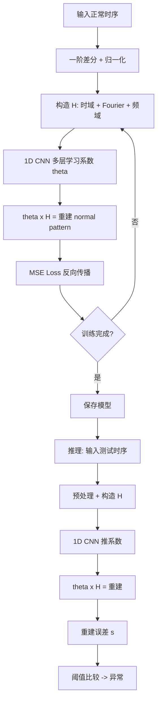

# KAN-AD：基于 Kolmogorov-Arnold 网络的时序异常检测

> 作者：Quan Zhou、Changhua Pei、Haiming Zhang、Gaogang Xie、Jianhui Li、Fei Sun、Jing Han、Zhengwei Gao、Dan Pei
> 机构：中科院 CNIC、中兴、清华
> 发表年份：2024
> 会议/期刊：arXiv 2411.00278v1（2024-11）
> 关联 PDF：同目录下 `2411.00278v1.pdf`

## 一、文档信息速览

| 字段 | 值 |
|---|---|
| 标题 | KAN-AD: Time Series Anomaly Detection with Kolmogorov–Arnold Networks |
| 作者 | Quan Zhou, Changhua Pei, Haiming Zhang, Gaogang Xie, Jianhui Li, Fei Sun, Jing Han, Zhengwei Gao, Dan Pei |
| 机构 | 中科院 CNIC、中兴、清华 |
| 发表年份 | 2024 |
| 会议/期刊 | arXiv preprint |
| 分类 | 时序异常检测 / Kolmogorov-Arnold 网络 / Fourier |
| 核心问题 | 时序数据普遍含局部噪声（peak/drop），黑盒深度模型容易把噪声当模式学，导致异常检测失效 |
| 主要贡献 | 1) 首次将 Kolmogorov-Arnold 表示定理引入 TSAD；2) Fourier series 替代 spline；3) Constant Term Elimination + Periodic-Enhanced；4) F1 提升 29%、推理加速 36× vs. KAN；vs SOTA F1 提升 15%、速度 55× |

## 二、背景（Background）

时序异常检测（Time Series Anomaly Detection, TSAD）是大规模云服务、Web 系统和制造业的关键组件，能及时发现异常提供早期预警，避免更大损失。深度学习预测型方法（TimesNet、Anomaly Transformer 等）已成主流。

但深度学习 TSAD 存在"准确预测 ≠ 准确检测"的悖论：时序数据普遍含**局部噪声**（peaks、drops），黑盒模型容易把这些噪声当成"模式"学，导致在测试时无法正确识别异常段。论文用 TimesNet、KAN 等方法做对照实验：当训练集含噪声时，方法被噪声"误导"，异常分数无法正确上升。

SubLOF 等聚类方法对噪声有一定抗性，但检测精度不够；TimesNet 等深度方法易受噪声影响。

Kolmogorov-Arnold Networks (KAN)（Liu et al., 2024）是一个新的网络架构，基于 Kolmogorov-Arnold 表示定理把多元函数分解为多个单变量函数的组合，每个单变量函数用 B-spline 学习。该设计让 KAN 比 MLP 更可控、可解释，已在科学计算中取得成果。

但直接套用 KAN 到 TSAD 仍然受 B-spline 易受局部异常影响——B-spline 的局部拟合能力让它也容易"学过"局部异常。论文验证：训练集含噪声时，KAN 也无法正确检测异常。

KAN-AD 提出：用 **Fourier series** 替代 spline 作为单变量函数（global representation 抗局部噪声），并把 KAN 改造为"学习 univariate function 系数"而非"学习函数本身"，彻底把 TSAD 从黑盒拟合转为"组合学"，既高效又鲁棒。

## 三、目的（Problems Solved）

- **痛点 1：黑盒深度模型易学噪声。** 局部 peak/drop 被错误当成模式。
- **痛点 2：KAN 的 B-spline 同样易过拟合局部特征。** 在含噪训练集上失效。
- **痛点 3：时序中 trend 让正常 pattern 估计不准。** 移动平均滤波不够。
- **痛点 4：TSAD 推理效率低。** 复杂模型难以大规模部署。
- **解决方案**：KAN-AD：
  1) Fourier series 替代 spline（全局表示抗局部噪声）；
  2) 学习 univariate function 的系数而非函数本身（参数少、可控）；
  3) Constant Term Elimination（一阶差分 + 重归一化）抑制 trend；
  4) Periodic-Enhanced 加入频域单变量函数；
  5) 1D CNN 系数学习，推理快。

## 四、核心原理（Principles）

**总览**：KAN-AD 是基于 Kolmogorov-Arnold 表示定理的 TSAD 方法。它把"学习正常时序 pattern"重新定义为"学习 univariate function 前的系数"，用 Fourier series 作为 univariate function（而非 B-spline），并用 1D CNN 学习系数，从而实现高效鲁棒的异常检测。

**Kolmogorov-Arnold 表示定理**：

$$f(x_1, x_2, \dots, x_n) = \sum_{q=1}^{2n+1} \Phi_q\!\left(\sum_{p=1}^{n} \varphi_{q,p}(x_p)\right)$$

任意多元连续函数可分解为多个单变量函数 $\varphi_{q,p}$ 与外层函数 $\Phi_q$ 的组合。KAN 用神经网络学这些 $\varphi, \Phi$。

**KAN-AD 的重新定义（Function Deconstruction）**：

$$f(x) = A_0 + \underbrace{\sum_{n=1}^{N} A_n \cos(nx) + B_n \sin(nx)}_{g(x): \text{normal pattern}} + \underbrace{\sum_{n=N+1}^{\infty} A_n \cos(nx) + B_n \sin(nx)}_{\epsilon(x): \text{stochastic noise}}$$

把 $f$ 分为有限 N 项 Fourier series（normal pattern）$g(x)$ 与无穷尾项（噪声）$\epsilon(x)$。

**数学表示**：

$$H = \text{Stack}(\cos(x), \sin(x), \dots, \cos(Nx), \sin(Nx))$$
$$\Theta = (A_1, B_1, A_2, B_2, \dots, A_N, B_N)$$
$$x'_{0:i} = A_0 + \Theta(x_{0:i}) \times H$$

只需学习系数 $\Theta$，不学 Fourier 函数本身。

**三阶段 Pipeline**：

- **Mapping 阶段**：用单变量函数（Fourier、时域 X、频域 P）激活输入时间窗，得到矩阵 H。
- **Reducing 阶段**：用 1D CNN 跨通道学习系数 Θ，逐步重建 normal pattern。
- **Projection 阶段**：单层 MLP 预测未来 normal pattern。

**关键模块**：

- **Constant Term Elimination**：用一阶差分 $\Delta X_t = X_t - X_{t-1}$ 消除 trend 残差，再重归一化，让模型专注于 Fourier 系数估计。
- **Periodic-Enhanced**：加入频域单变量函数 $P_n = \{\sin(2\pi n t / T), \cos(2\pi n t / T)\}$，让时域 + 频域联合拟合。

**关键数学**：

**1D CNN 系数学习**：
$$H^{(l)} = \text{CNN}(\text{CNN}(H^{(l-1}))), \quad l = 1, \dots, L$$
$$\text{CNN}(H) = \text{GELU}(\text{BN}(\text{Conv}(H)))$$

**预测下一时刻**：
$$\hat x_{i+1} = A_0 + \Theta(x_{0:i}) \times H(x_{0:i})$$

**异常分数**：
$$s_i = \| \hat x_i - x_i \|$$
阈值自适应：$s_i > \theta \Rightarrow$ 异常。

**为什么这么做**：
- Fourier series 自然提取频率信息，**全局表示**抗局部噪声；
- 系数学习参数少、推理快、可解释；
- 一阶差分消除 trend 让 Fourier 拟合更稳定；
- 1D CNN 利用 GPU 并行加速。

**与现有技术的差异**：

- vs. TimesNet：KAN-AD 系数学习 vs. 黑盒拟合；Fourier 全局 vs. 局部卷积。
- vs. KAN：Fourier series 替代 B-spline；学习系数 vs. 学习函数。
- vs. 传统统计：ARIMA、Prophet 等；KAN-AD 用神经网络学习系数，更灵活。

## 五、算法详解（Algorithm）

### 1. 输入 / 输出
- **输入**：单变量时序 $x_{0:t} = \{x_0, x_1, \dots, x_t\}$。
- **输出**：异常分数 $s_t$（$s_t > \theta$ 判为异常）。

### 2. 核心模块
- **Preprocessor**：一阶差分 + 重归一化。
- **Mapping**：构造 univariate function matrix H。
- **Reducing**：1D CNN 学习系数。
- **Projector**：单层 MLP 输出预测。
- **Anomaly Scorer**：基于预测误差打分。

### 3. 伪代码

```python
def kanad_train(train_x, N, n_layers=3):
    # 1) 一阶差分 + 归一化
    train_x_diff = differencing(train_x)
    train_x_norm = normalize(train_x_diff)
    # 2) 构造 H matrix: 时域 X + Fourier S_n + 频域 P_n
    H = build_univariate_matrix(train_x_norm, N)
    # 3) 1D CNN 学系数
    cnn = StackCNN(in_channels=2*N+1, hidden=64, n_layers=n_layers)
    theta = cnn(H)  # (batch, 2*N+1)
    # 4) 重建 normal pattern
    x_hat = theta @ H
    loss = F.mse_loss(x_hat, train_x_norm)
    return cnn, loss

def kanad_detect(x_test, cnn, N, theta_threshold):
    x_diff = differencing(x_test)
    x_norm = normalize(x_diff, train_stats)
    H = build_univariate_matrix(x_norm, N)
    theta = cnn(H)
    x_hat = theta @ H
    s = ((x_hat - x_norm) ** 2)  # 重建误差
    fault = s > theta_threshold
    return fault, s
```

### 4. 关键数学
- 见上文 "关键数学" 章节。

### 5. 复杂度分析
- 训练：每次前向 $O(T \cdot N \cdot D)$，典型 T=512, N=32 在单 GPU 几小时。
- 推理：单点 ~0.1ms，可实时。

### 6. 训练与推理
- **训练**：用正常时序训练，监督信号是"重建"。
- **推理**：基于重建误差 + 阈值判异常。

### 7. 示例
- KPI 数据集：含 burst anomaly，KAN-AD 用 N=32 Fourier 项 + Periodic-Enhanced，在测试集 anomaly 段重建误差显著上升，准确告警；训练集含少量 burst 时也不被"误导"。

## 六、系统架构图（Architecture）

```mermaid
graph TB
    A[原始时序 X] --> B[Preprocessor: 一阶差分 + 归一化]
    B --> C[Mapping: 构造 H 矩阵]
    C --> C1[时域 X]
    C --> C2[Fourier S_n sin/cos]
    C --> C3[频域 P_n]
    C1 --> D
    C2 --> D
    C3 --> D
    D[Univariate Function Matrix H: Tx(2N+1)] --> E[Reducing: 1D CNN 学习系数 theta]
    E --> F[Theta: 系数向量]
    F --> G[Projector: theta x H = 重建 x_hat]
    G --> H[MSE Loss L = |x_hat - x|^2]
    H --> I[反向传播更新 CNN]
    G --> J[推理: 重建误差 s = |x_hat - x|]
    J --> K{阈值比较}
    K -- 是 --> L[异常判别]
    K -- 否 --> M[正常]
```

## 七、流程图（Process Flow）



## 八、关键创新点（Key Innovations）

- **+ 首次将 Kolmogorov-Arnold 表示定理引入 TSAD**：把"学习 pattern"转为"学习 univariate function 系数"，从黑盒拟合变白盒组合。
- **+ Fourier series 替代 B-spline**：全局表示抗局部噪声，解决 KAN 在含噪训练集失效的问题。
- **+ Constant Term Elimination**：一阶差分 + 归一化消除 trend 残差，让 Fourier 拟合更稳。
- **+ Periodic-Enhanced**：时域 + 频域单变量函数联合，提升周期性捕获。
- **+ 显著效率与精度提升**：F1 比 KAN 高 29%、推理快 36×；比 SOTA 高 15%、快 55×。

## 九、实验与结果（Experiments）

- **数据集**：4 个公开 UTS 基准——KPI、TODS、WSD、UCR。
- **Baseline**：TimesNet、Anomaly Transformer、KAN、SubLOF、传统统计方法。
- **主要指标**：F1、Precision、Recall、推理时间。
- **关键结果**：
  - vs. KAN：F1 提升 29%，推理快 36×；
  - vs. SOTA：F1 提升 15%，推理快 55×；
  - 4 个数据集上均超 baseline。
- **消融实验**：
  - 去掉 Fourier 用 B-spline：F1 退化（验证 Fourier 的抗噪优势）；
  - 去掉 Constant Term Elimination：F1 退化 5-10%；
  - 去掉 Periodic-Enhanced：周期性时序上 F1 退化；
  - 减少 N：拟合能力下降。
- **效率分析**：训练时间适中；推理单点 < 0.1ms；模型参数量小。

## 十、应用场景（Use Cases）

- **云服务 KPI 异常检测**：CPU、内存、流量等时序监控。
- **Web 系统异常告警**：在线服务的请求率、错误率时序。
- **工业制造监测**：设备传感器时序的异常点检测。
- **金融交易异常**：交易量、价格时序的异常波动。
- **AIOps 平台集成**：作为异常检测引擎。

## 十一、相关论文（Related Papers in this set）

- 同为时序异常检测的 **DeST**、**ChronoSage** 关注多模态微服务异常检测，KAN-AD 关注单变量时序；二者在 KPI 等数据集上可互补。
- **CMoS** 关注时序预测，与 KAN-AD 的"重建"思路有相似之处。
- **SPRINT** 关注长时序预测加速，与 KAN-AD 关注单点异常检测互补。

## 十二、术语表（Glossary）

- **TSAD (Time Series Anomaly Detection)**：时序异常检测。
- **KAN (Kolmogorov-Arnold Networks)**：基于 K-A 定理的神经网络。
- **Fourier Series**：傅里叶级数，正余弦基函数展开。
- **B-spline**：B 样条，KAN 原始用的单变量函数。
- **Function Deconstruction (FD)**：函数分解，正常 pattern + 噪声。
- **Constant Term Elimination**：常数项消除，用一阶差分。
- **Periodic-Enhanced**：周期增强，加入频域单变量函数。
- **1D CNN**：一维卷积神经网络。
- **UTS (Univariate Time Series)**：单变量时序。
- **Reconstruction Error**：重建误差，作为异常分数。

## 十三、参考与延伸阅读

- Kolmogorov-Arnold 表示定理：Kolmogorov (1957), Arnold (1957)。
- KAN：Liu et al., 2024 (arXiv 2404.19756)。
- TimesNet、Anomaly Transformer：被比较的 SOTA。
- Fourier Analysis、FFT：经典信号处理。
- B-spline、P-spline：曲线拟合。
