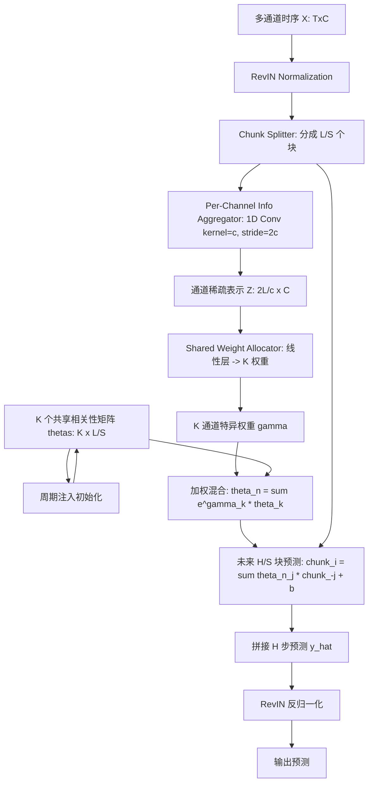
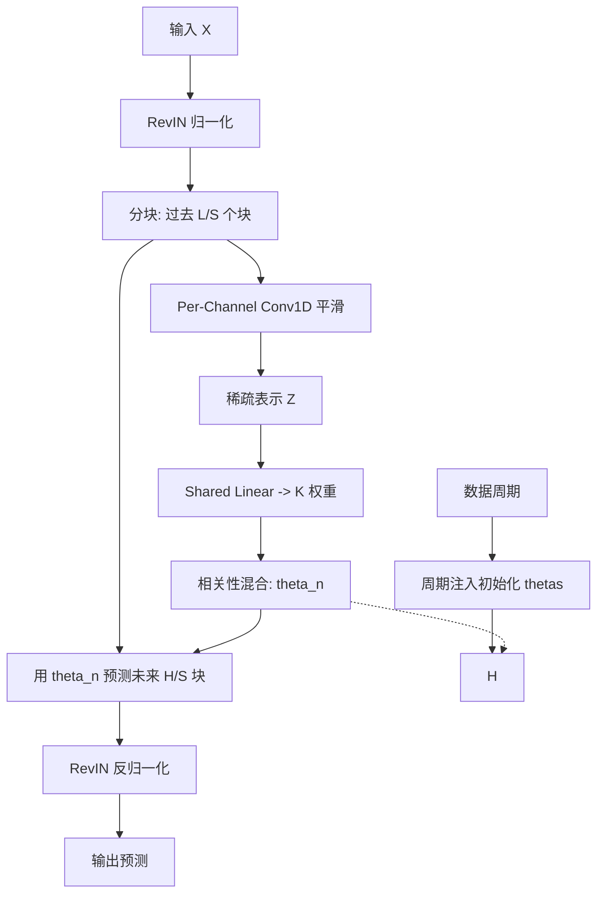

# CMoS：基于块状空间相关性的超轻量时序预测（ICML 2025）

> 作者：Haotian Si、Changhua Pei、Jianhui Li、Dan Pei、Gaogang Xie
> 机构：中科院 CNIC、国科大、杭高院、南京大学、清华
> 发表年份：2025
> 会议/期刊：ICML 2025（Vancouver, Canada, PMLR 267）
> 关联 PDF：同目录下 `2505.19090v1.pdf`
> 代码：https://github.com/CSTCloudOps/CMoS

## 一、文档信息速览

| 字段 | 值 |
|---|---|
| 标题 | CMoS: Rethinking Time Series Prediction Through the Lens of Chunk-wise Spatial Correlations |
| 作者 | Haotian Si, Changhua Pei, Jianhui Li, Dan Pei, Gaogang Xie |
| 机构 | 中科院 CNIC、国科大、南京大学、清华 |
| 发表年份 | 2025 |
| 会议/期刊 | ICML 2025 |
| 分类 | 时序预测 / 轻量模型 / 多变量 / 空间相关性 |
| 核心问题 | 现有时序预测模型（Transformer / DLinear）要么参数爆炸、要么 channel-independent 损失多变量关联，要么 embedding 黑盒难解释 |
| 主要贡献 | 1) 块状空间相关性建模；2) 相关性混合策略（Mixture of Spatial Correlations）；3) 周期注入；4) 仅 DLinear 1% 参数达 SOTA；5) 学习到的相关性矩阵高可解释 |

## 二、背景（Background）

时序预测在金融、能源、气象等领域至关重要。深度学习时代诞生了 RNN、CNN、Transformer 等多类预测模型。但近年研究发现**轻量模型可以超过复杂模型**（DLinear、FITS、SparseTSF、CycleNet 等），引发对"时序预测是否真的需要复杂模型"的反思。

时序预测的两大主流 channel 策略：
- **Channel-Independent (CI)**：每个通道用独立 backbone，避免跨通道干扰但损失多变量关联。代表：DLinear、FITS。
- **Channel-Mixing**：建模跨通道依赖，参数开销大。代表：iTransformer、TimeMixer。

轻量模型在 CI 策略下表现尤佳，但论文指出：**CI 策略让模型只能表达单一时间结构**，缺乏表达多样时间结构的能力。

进一步观察：滑动窗口中各子序列的"形状"可能随时间变化，但**块与块之间的相对位置关系（空间相关性）保持稳定**——这一平移等变性（translation-equivariance）是时序数据的内在属性。

CMoS（Chunk-wise Mixture of Spatial correlations）由此提出：直接建模"块与块之间的空间相关性"，用 Mixture of Experts 思想让多个共享相关性矩阵 + 通道特定权重混合得到通道特异相关性矩阵。

## 三、目的（Problems Solved）

- **痛点 1：Transformer 类模型参数过多。** 推理慢、训练贵。
- **痛点 2：CI 策略损失多变量关联。** 单一 backbone 难以表达多样时间结构。
- **痛点 3：channel-mixing 策略参数负担重。** 复杂模型难部署。
- **痛点 4：黑盒 embedding 难解释。** 工程师无法理解预测依据。
- **解决方案**：
  1) 块状（chunk-wise）空间相关性建模，平移等变 + 抗噪；
  2) 相关性混合策略：K 个共享相关性矩阵 + 通道特定权重；
  3) 周期注入：用先验周期直接编辑初始权重；
  4) 仅 DLinear 1% 参数即可 SOTA。

## 四、核心原理（Principles**

**总览**：CMoS 是一个超轻量时序预测模型，核心思想是直接建模"块与块之间的空间相关性矩阵"，用 Mixture of Spatial Correlations 让 K 个共享相关性矩阵按通道权重混合，得到通道特异相关性。最终预测是过去块的加权线性组合。

**关键概念**：

- **块状空间相关性（Chunk-wise Spatial Correlation）**：把长度为 L 的输入分为 S 个块，每个块长 L/S。第 $i$ 个未来块是过去各块的线性组合：$\hat x_{t+i} = \sum_j \theta_{ij} x_{t-j} + b_i$。
- **平移等变性**：虽然块内具体形状变化，但块与块的相对位置关系稳定，使"空间相关性"是鲁棒特征。
- **噪声鲁棒性**：Theorem 3.2 证明块内加权平均的 $\theta^*$ 比点对点 $\theta_i$ 噪声敏感性更低（$\sigma^2 \sum \theta_i^2 \geq \sigma^2 \theta^{*2}$）。

**三阶段 Pipeline**：

- **Chunk-wise Spatial Correlation Modeling**：把输入与输出都分块，未来块是过去块的线性组合。
- **Correlation Mixing Strategy**：K 个共享相关性矩阵 $\{\theta^k\}_{k=0}^{K-1}$ + 通道特定权重 $\{\gamma_{kn}\}$ → 通道特异相关性 $\Theta_n$：
  $$x_{t+i}^n = \frac{1}{\sum_k e^{\gamma_{kn}}} \sum_{k=0}^{K-1} e^{\gamma_{kn}} \sum_{j=0}^{L/S} \theta_{ij}^k x_{t-j}^n + b_i^k$$
- **Periodicity Injection**：用数据周期直接编辑初始权重 $\theta_{ij}^k$，让模型快速收敛到周期相关性。

**两阶段权重分配**：

- Stage 1：用通道特异 1D Conv（kernel=c, stride=2c）平滑原始数据，得到通道稀疏稳定表示 $z_n$，消除噪声影响。
- Stage 2：共享线性层把 $z_n$ 映射为 K 个权重 $\gamma_{kn}$。

**关键数学**：

**Chunk-wise 预测**：
$$\hat x_{t+i} = \sum_{j=0}^{L/S} \theta_{ij} x_{t-j} + b_i$$

**相关性混合**：
$$x_{t+i}^n = \frac{1}{Z} \sum_{k} e^{\gamma_{kn}} \sum_j \theta_{ij}^k x_{t-j}^n + b_i^k, \quad Z = \sum_k e^{\gamma_{kn}}$$

**平滑（去噪）**：
$$z_t^n = \text{Conv1D}^n(x_{t-L+1:t}^n), \quad \text{kernel size}=c, \text{stride}=2c$$

**权重分配**：
$$\gamma^n = W z^n, \quad W \in \mathbb{R}^{2L/c \times K}$$

**为什么这么做**：
- 块状建模平移等变、抗噪；
- K 个共享矩阵 + 通道特异权重兼顾表达力与参数效率；
- 周期注入用先验知识加速收敛；
- 仅预测未来块是过去块的线性组合，参数极小（< DLinear 1%）。

**与现有技术的差异**：

- vs. DLinear：CMoS 直接建模块间空间相关性，DLinear 做 channel-wise 线性回归；CMoS 可解释、参数少 100×。
- vs. PatchTST：CMoS 块状建模对历史和未来都分块，PatchTST 只对历史 patch；CMoS 块间关系直接可读。
- vs. iTransformer / TimeMixer：CMoS 参数少 1-2 个数量级，部署更轻。
- vs. FITS / SparseTSF：CMoS 显式建模跨通道相关性，这些纯 CI 模型做不到。

## 五、算法详解（Algorithm）

### 1. 输入 / 输出
- **输入**：多通道时序 $X \in \mathbb{R}^{T \times C}$。
- **输出**：未来 H 步预测 $\hat Y \in \mathbb{R}^{H \times C}$。

### 2. 核心模块
- **Chunk Splitter**：把 $X$ 分为 $L/S$ 个块。
- **Shared Correlation Matrices**：$\{\theta^k\}_{k=0}^{K-1}$。
- **Per-Channel Info Aggregator**：1D Conv 平滑。
- **Shared Weight Allocator**：线性层输出 $K$ 个权重。
- **Periodicity Injector**：用数据周期编辑初始 $\theta^k$。
- **Reversible Instance Normalization (RevIN)**：处理 distribution shift。

### 3. 伪代码

```python
def cmos_train(X_train, L, S, H, K, period):
    # 1) 块化
    chunks = split_into_chunks(X_train, chunk_size=S)  # (B, L/S, S, C)
    # 2) 初始化 K 个共享相关性矩阵（周期注入）
    thetas = initialize_with_period(K, L//S, period)  # (K, L/S)
    # 3) 1D Conv 平滑（通道特异）
    Z = per_channel_conv1d(X_train, kernel=c, stride=2c)  # (B, 2L/c, C)
    # 4) 共享线性层分配权重
    gamma = shared_linear(Z)  # (B, K, C)
    # 5) 通道特异相关性 + 预测
    y_hat = []
    for i in range(H // S):
        theta_n = weighted_sum(thetas, gamma)  # (B, L/S, C)
        chunk_pred = sum_over_j(theta_n * chunks_past[:, j]) + bias
        y_hat.append(chunk_pred)
    y_hat = concat(y_hat)  # (B, H, C)
    loss = F.mse_loss(y_hat, Y_train)
    loss.backward(); optim.step()
    return thetas, gamma, Z, cnn
```

### 4. 关键数学
- 见上文 "关键数学" 章节。

### 5. 复杂度分析
- 训练：每 epoch $O(N \cdot C \cdot (L \cdot K + L \cdot d))$，典型 N=10k, C=10, L=96, K=4 在单 GPU 几十分钟。
- 推理：单 batch 毫秒级；模型存储 < 1MB（DLinear ~ 100MB）。

### 6. 训练与推理
- **训练**：标准 MSE 损失 + RevIN。
- **推理**：RevIN 反归一化 + 块状预测。

### 7. 示例
- 电力负荷预测：CMoS 用 4 个共享相关性矩阵 + 通道特异权重混合，预测 96 步未来；模型仅 ~10K 参数。

## 六、系统架构图（Architecture）



## 七、流程图（Process Flow）



## 八、关键创新点（Key Innovations）

- **+ 块状空间相关性建模**：用过去块的线性组合预测未来块，平移等变 + 抗噪 + 高可解释。
- **+ 相关性混合策略**：K 个共享矩阵 + 通道特异权重 = 通道特异相关性，兼顾表达力与参数效率。
- **+ 周期注入**：用数据周期直接编辑初始权重，加速收敛并提升周期性数据表现。
- **+ 极致轻量**：仅 DLinear 1% 参数即可 SOTA（< 10K 参数）。
- **+ 高可解释**：学习到的相关性矩阵直接展示"过去哪一块对未来哪一块有多重要"。

## 九、实验与结果（Experiments）

- **数据集**：ETT（电力）、Weather、Exchange、Traffic、Electricity 等标准 LTSF 基准。
- **Baseline**：DLinear、FITS、SparseTSF、CycleNet、PatchTST、iTransformer、TimesNet 等 SOTA。
- **主要指标**：MSE、MAE。
- **关键结果**：
  - 仅 DLinear 1% 参数即可在多个数据集上 SOTA；
  - 训练时间和推理时间均显著低于 Transformer 类；
  - 学习到的相关性矩阵直观可读（如电力数据有清晰日周期 / 周周期）。
- **消融实验**：
  - 去掉 Chunk-wise：退化为 DLinear 风格，性能下降；
  - 去掉 Correlation Mixing：单一共享矩阵，表达力受限；
  - 去掉 Periodicity Injection：收敛变慢；
  - 改变 K：K=4 通常最优。
- **效率分析**：参数 < DLinear 1%；训练时间 < 10%；推理时间 < 20%。

## 十、应用场景（Use Cases）

- **边缘 / 嵌入式时序预测**：资源受限设备的本地预测。
- **大规模云监控**：多实例 KPI 预测，模型体积小、并发高。
- **能源 / 电力 / 气象**：周期性强、可解释需求高。
- **多变量金融预测**：股票组合、外汇等多通道预测。
- **模型可解释性需求场景**：CMoS 矩阵可读，便于审计。

## 十一、相关论文（Related Papers in this set）

- 同为时序预测的 **SPRINT** 关注长序列加速，CMoS 关注超轻量建模；二者可结合——CMoS 训练轻量模型，SPRINT 在推理时加速。
- **AutoDA-Timeseries** 关注训练时数据增强，CMoS 关注模型架构。
- **KAN-AD** 关注时序异常检测，CMoS 关注预测；可结合做"预测+异常检测"。

## 十二、术语表（Glossary）

- **CMoS (Chunk-wise Mixture of Spatial correlations)**：本文方法。
- **LTSF (Long-Term Time Series Forecasting)**：长时序预测。
- **Chunk**：时序分块。
- **Spatial Correlation**：空间相关性（块与块的相对位置关系）。
- **Translation-Equivariance**：平移等变性。
- **Channel-Independent / Channel-Mixing**：两种通道策略。
- **RevIN (Reversible Instance Normalization)**：可逆实例归一化。
- **Mixture of Experts (MoE)**：专家混合思想。
- **Periodicity Injection**：周期注入。
- **Per-Channel Info Aggregator**：通道特异信息聚合器（1D Conv）。

## 十三、参考与延伸阅读

- DLinear（Zeng et al., 2023）：轻量线性预测模型。
- PatchTST（Nie et al., 2023）：patch-based 预测。
- iTransformer（Liu et al., 2024a）：inverted Transformer。
- FITS（Xu et al., 2024）、SparseTSF（Lin et al., 2024b）、CycleNet（Lin et al., 2024a）：同期轻量模型。
- RevIN（Kim et al., 2021）：可逆归一化。
- 代码：https://github.com/CSTCloudOps/CMoS
