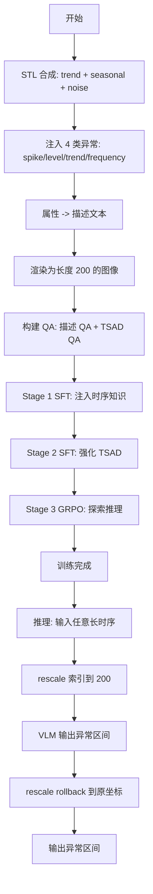

# ViTs: Teaching Machines to See Time Series Anomalies Like Human Experts（WWW 2026）

> 作者：Zexin Wang、Changhua Pei、Yang Liu、Hengyue Jiang、Quan Zhou、Haotian Si、Hang Cui、Jianhui Li、Gaogang Xie、Jingjing Li、Dan Pei  
> 机构：中国科学院计算机网络信息中心；中国科学院大学；杭州国际科创中心；清华大学；南京大学  
> 发表年份：2026  
> 会议/期刊：The ACM Web Conference 2026 (WWW '26)，迪拜，2026 年 4 月 13–17 日  
> 关联 PDF：同目录下 `2510.04710v1_11.pdf`

> 备注：批处理清单中此 PDF 标注为 "Smart Eye"，但实际 PDF 标题为 ViTs（arXiv:2510.04710v1）。本说明以 PDF 内容为准。

## 一、文档信息速览

| 字段 | 值 |
|---|---|
| 标题 | ViTs: Teaching Machines to See Time Series Anomalies Like Human Experts |
| 作者 | Zexin Wang, Changhua Pei, Yang Liu, Hengyue Jiang, Quan Zhou, Haotian Si, Hang Cui, Jianhui Li, Gaogang Xie, Jingjing Li, Dan Pei |
| 机构 | 中国科学院计算机网络信息中心；UCAS；杭州国际科创中心；清华大学；南京大学 |
| 发表年份 | 2026 |
| 会议/期刊 | WWW 2026（CCF A） |
| 分类 | 时序异常检测 / 视觉语言模型 / 零样本 |
| 核心问题 | TSAD 模型需"训练一次、跨场景推理"且能处理任意长度的 KPI 时序；现有 TS-LLM 受上下文限制，PTSE-LLM 长度受限 |
| 主要贡献 | (1) 提出 TS-VLM ViTs，把时序曲线渲染为图像；(2) STL-based 周期数据生成器；(3) 三阶段 Chain-of-TS 微调；(4) 固定长训练 + 自适应长推理范式 |

## 二、背景（Background）

Web 服务管理员需要及时发现 KPI（Key Performance Indicators）时序中的异常以恢复故障。随着业务扩张，需监控的时序数量爆炸式增长，"**train once, infer across scenarios**"（训练一次、跨场景零样本推理）成为 TSAD（Time Series Anomaly Detection）的基本需求。同时，不同 KPI 的最优检测窗口长度差异巨大（1 小时到 1 周），模型还必须**自适应处理不同长度的输入**。

传统深度学习 TSAD 模型（Anomaly-Transformer、TranAD、TimesNet、DCDetector 等）通常假设**固定窗口长度**，迁移到新场景必须重训或微调，缺乏零样本能力。

LLM 的兴起为"训练一次、跨场景"提供了希望，但应用到时序面临两大挑战：
- **极长上下文**：把时序作为文本 token 喂给 LLM，token 数爆炸，远超上下文限制；
- **数值不稳定**：连续数值 token 之间关系弱，LLM 容易重复输出数字或答非所问。

为缓解上下文压力，PTSE-LLM（Patch-based Time Series Encoder + LLM）类方法训练一个独立的时序编码器并和文本模态对齐。这虽然缓解了上下文溢出，但**固定了输入长度**，无法处理比训练更长的时序。

作者观察到**人类专家分析时序异常的过程**：专家不在屏幕上逐点比较，而是把曲线画出来"整体看一眼"——通过趋势、周期、突变、噪声的整体形态做判断。受此启发，作者提出**TS-VLM**：把时序曲线**渲染成图像**输入到视觉语言模型（VLM）。该范式既利用了 VLM 的图像理解能力，又避开了文本 token 的长度瓶颈和数值不稳定问题。

## 三、目的（Problems Solved）

- **时序的视觉化建模**：把时序当"图"输入给 VLM，绕开 LLM 的上下文限制和数值不稳定。
- **任意长度输入的自适应推理**：训练时统一长度（200），推理时按比例 rescale 到 200 再回滚到原长度。
- **数据稀缺问题**：时序-图像-文本三模态对齐数据极少，需要自动化生成。
- **多阶段训练策略**：直接 SFT 通用 VLM 效果不佳，需要专门为 TSAD 设计分阶段训练。
- **超越 SOTA VLM 与专用 TSAD 模型**：用相对小的 7B 参数 + 15k 合成样本，F1 提升 20%+。

## 四、核心原理（Principles）

**总览**：ViTs（Vision Time Series）由四部分组成：(1) **时序图像渲染**：把 1D 序列画成 2D 线图；(2) **STL-based 时序生成器**：用 STL（Seasonal-Trend decomposition using Loess）理论合成包含趋势 / 周期 / 噪声 / 异常的多样化时序；(3) **Attribute-based 文本描述生成器**：把时序属性（趋势、周期、异常类型、噪声水平）自动转成自然语言描述；(4) **Chain-of-TS 三阶段微调**：阶段 1 用描述 QA 注入时序知识，阶段 2 用 TSAD QA 强化检测能力，阶段 3 用 GRPO 强化学习进一步提升。

**关键概念**：
- **TS-LLM / PTSE-LLM / TS-VLM**：三种把 LLM 用于时序的范式。TS-LLM 直接把时序当文本，PTSE-LLM 用专用时序编码器对齐文本，TS-VLM 把时序当图像。
- **时序图像 Rescale**：训练时统一把时序渲染为长度 200 的图像；推理时把任意长度的时序先等比例 rescale 到 200 跑模型，再把区间预测按 rescale 因子还原回原长度。
- **STL 分解**：把时序拆为 Seasonal + Trend + Residual 三部分，生成器对每部分独立采样再相加。
- **四种异常类型**：Spike（尖峰）、Trend（趋势突变）、Level（水平偏移）、Frequency（频率扰动）。
- **Chain-of-TS**：3 阶段微调（时序知识注入 → 异常检测增强 → 异常推理强化）。
- **GRPO**：Group Relative Policy Optimization，类 DeepSeek-R1 的规则式 RL。

**核心数学**：
- 周期分量用傅里叶级数近似（K 个谐波叠加）：
  $$S_N(x) = \frac{a_0}{2} + \sum_{n=1}^{N} \left(a_n \cos nx + b_n \sin nx\right), \quad |f(x) - S_N(x)| \le \sigma$$
- 奖励设计（F1 + Format 混合）：
  $$\text{reward} = 0.9 \times f1\_\text{reward} + 0.1 \times \text{format\_reward}$$
  其中 $f1\_\text{reward}$ 在异常窗口直接用 F1 分数，无异常窗口给 0.5（正确）/ -0.5（误报）；$\text{format\_\text{reward}}$ 是 0/1 二值奖励，要求输出 `[[start, end], ...]` 格式。

**为什么这样做**：
- 视觉模态比文本模态对"曲线形态"更鲁棒（人类也靠"看"做判断）；
- Rescale 保留时序的**形态**（信号值不变，只缩放索引），所以不会平滑掉尖峰；
- 三阶段微调避免 SFT 过拟合，并让 RL 进一步探索解空间。

## 五、算法详解（Algorithm）

1. **输入 / 输出**
   - 输入：时序 $X = \{x_1, x_2, \ldots, x_n\}$，推理时长度 $n$ 任意
   - 输出：异常区间列表 $L = \{[s_1, e_1], [s_2, e_2], \ldots\}$

2. **核心模块**
   - **图像渲染器**：将 1D 时序画成 200×? 的线图（包含原始信号）
   - **STL 数据生成器**：用 seasonal + trend + noise 合成时序并注入 4 类异常
   - **属性文本生成器**：把生成时的属性转成自然语言 QA
   - **VLM 主干**：Qwen2.5-VL-7B-Instruct
   - **3 阶段微调器**：SFT1（描述 QA 全参）→ SFT2（TSAD QA 全参）→ RL（GRPO 冻结视觉）

3. **伪代码**（合成数据 + 训练 + 推理）

```python
# ===== 数据生成（STL-based）=====
def generate_ts(ts_length, period_type, anomaly_type):
    # trend
    trend = random_trend(ts_length)  # 上升/下降/平稳
    # seasonal: K 个谐波
    if period_type == "long":
        period = random(10, ts_length//2)
    else:
        period = random(ts_length//2, 3*ts_length)
    base_f = 1/period
    harmonics = []
    for n in range(1, random_int(1, 10)):
        amp = (amp_series / n) * (1 + 0.05 * sin(random_uniform(1,3)*pi * t/ts_length + phi))
        harmonics.append(amp * sin(2*pi*base_f*n*t + phase))
    seasonal = sum(harmonics)
    # noise
    noise = random_gaussian(scale=low_or_high_based_on_amp)
    ts = trend + seasonal + noise
    # inject anomaly
    if anomaly_type == "spike":      ts = add_spike(ts)
    elif anomaly_type == "level":    ts = add_level_shift(ts)
    elif anomaly_type == "trend":    ts = inject_trend_segment(ts)
    elif anomaly_type == "frequency":ts = perturb_low_freq(ts, FFT_modify=True)
    return ts, attributes

# ===== 阶段 1: 时序知识注入 =====
for sample in ts_description_qa_dataset:
    img = render_ts(sample.ts, length=200)
    text_q = f"<image> analyze the time series."
    text_a = sample.description  # 趋势、周期、异常描述
    sft_step(model, img, text_q, text_a)  # 全参数

# ===== 阶段 2: 异常检测增强 =====
for sample in tsad_qa_dataset:
    img = render_ts(sample.ts, length=200)
    text_q = "<image> detect anomalies and give the ranges."
    text_a = f"<Reasoning> {answer_boxed([[s1,e1], ...])}"
    sft_step(model, img, text_q, text_a)  # 全参数

# ===== 阶段 3: 强化学习（GRPO）=====
for batch in tsad_rl_dataset:
    img = render_ts(sample.ts, length=200)
    text_q = "<image> detect anomalies ..."
    samples = model.sample_group(img, text_q, n=8)   # 采样 N 个候选
    rewards = [compute_f1_reward(pred, label) + 0.1*format_reward(pred) for pred in samples]
    grpo_update(model, samples, rewards)  # 冻结视觉编码器

# ===== 推理 =====
def detect_anomaly(ts):
    n = len(ts)
    # 等比例 rescale 到 200
    scaled_ts = [ts[int(i*(n-1)/199)] for i in range(200)]
    img = render_ts(scaled_ts)
    answer = model.generate(img, "<image> detect anomalies ...")
    # rescale rollback
    boxes = parse_boxes(answer)
    boxes_original = [[int(s*(n-1)/199), int(e*(n-1)/199)] for s,e in boxes]
    return boxes_original
```

4. **关键数学**
   - 周期生成：算法 1（Algorithm 1，详见 PDF）通过随机选周期、随机谐波数、随机相位生成 seasonal 分量
   - 频率异常：对 FFT 后低频分量（高强度）做扰动，再 iFFT 回去
   - 奖励公式：`reward = 0.9 * f1_reward + 0.1 * format_reward`

5. **复杂度分析**（论文未深入讨论）
   - 数据生成：每条样本 $O(L \log L)$（FFT）
   - 训练：标准 VLM 微调，7B 模型在 8×H100 上数小时
   - 推理：单条 200 点 + VLM 一次前向，毫秒级

6. **训练与推理**
   - 训练：SFT1（描述 QA 全参）→ SFT2（TSAD QA 全参）→ RL（GRPO 冻结视觉）
   - 推理：自适应长度 rescale，输出异常区间，rollback 到原坐标

7. **示例**
   - 输入 800 点 KPI，rescale 到 200 点线图，VLM 给出 `[[170,172]]`（在 rescale 后坐标），还原到 800 点坐标为 `[[680, 689]]`，即第 680~689 个点为异常。

## 六、系统架构图（Architecture）

```mermaid
graph TB
    A[KPI 时序 X] --> B[图像渲染器: render length=200]
    B --> C[TS 图像]
    C --> D[VLM 主干: Qwen2.5-VL-7B]
    D --> E{训练阶段}
    E -- Stage 1: 描述 QA SFT --> F1[全参数微调]
    E -- Stage 2: TSAD QA SFT --> F2[全参数微调]
    E -- Stage 3: GRPO RL --> F3[冻结视觉, LLM 探索]
    F1 --> G[训练好的 ViTs]
    F2 --> G
    F3 --> G
    G --> H[推理]
    H --> I[任意长时序 rescale 到 200]
    I --> J[VLM 生成: [[s, e], ...]]
    J --> K[rescale rollback]
    K --> L[原坐标异常区间]
    P[STL 数据生成器] --> Q[属性文本生成器]
    Q --> R[QA 数据集]
    R --> E
```

## 七、流程图（Process Flow）



## 八、关键创新点（Key Innovations）

- **+ 视觉化 TSAD 范式**：受人类专家"画图看曲线"启发，把时序渲染为图像输入 VLM，绕开 LLM 上下文限制和数值不稳定。
- **+ STL-based 时序生成器**：从 STL 分解理论出发，合成包含真实周期、趋势、噪声与 4 类异常的多样化时序，缓解数据稀缺。
- **+ Chain-of-TS 三阶段微调**：描述 QA → TSAD QA → GRPO RL，分阶段逐步把 VLM 从"理解曲线"训练到"检测异常"再"推理优化"。
- **+ 固定长训练 + 自适应长推理**：用 rescale 实现"训练一次、任意长推理"，相比传统"训练时用动态长"在大多数异常类型上 F1 提升 0.001~0.062。
- **+ 简单规则式奖励（带负奖励）**：F1 + Format 混合 + 对无异常窗口加 -0.5 负奖励避免误报，RL 阶段 32 步就达 +0.235 F1 提升。

## 九、实验与结果（Experiments）

- **数据集**：(1) 自合成数据集 2k 样本（覆盖 4 类异常 + Mixed）；(2) 公共数据集 KPI、Yahoo、WSD。
- **Baseline**：Qwen2.5-VL-7B/32B/72B、InternVL3-8B/14B/38B、GPT-4o-mini、GPT-4o 等通用 VLM；以及 Spot、SubLOF、Anomaly-Transformer、DCDetector、TranAD、TimesNet 等专用 TSAD 模型。
- **主要指标**：Precision、Recall、point-adjusted F1、VUS_ROC。
- **关键结果**：
  - 在合成数据上 ViTs（7B）综合 F1=0.8581，比 GPT-4o（0.5983）高 26 个百分点；比最强开源 Qwen2.5-VL-72B（0.5319）高 32 个百分点。
  - 公共数据集 zero-shot：ViTs 在 KPI、Yahoo、WSD 平均 F1=0.8142，超越 TimesNet（0.7633）、TranAD（0.7180）等专用 TSAD。
  - 消融：去掉阶段 1 降 8 个点（0.8581→0.7785），去掉阶段 2 降 21 个点（0.8581→0.6440），去掉阶段 3 降 1 个点（0.8516→0.8581），证明 3 阶段都必要。
  - 自适应长度 vs 动态长度：自适应长度在 Spike/Trend/Frequency/Level Shift/Mixed 上均略胜。
  - 负奖励：去除负奖励在 AIOPS/Yahoo/WSD 上 F1 显著下降（0.762→0.546；0.833→0.597；0.850→0.429）。
- **效率分析**：使用 7B 模型，15k 训练样本，训练量相对轻量。

## 十、应用场景（Use Cases）

- **Web 服务 KPI 监控**：CPU、内存、QPS、延迟等 KPI 的实时异常检测，训练一次可应用于多个业务线。
- **多源异构时序**：对周期、噪声水平差异巨大的时序自适应选窗口长度，无需重训。
- **AIOps 大模型微调**：作为 LLM/VLM 在时序域的微调范式参考，结合 RL 进一步提升。
- **金融/IoT 异常检测**：交易异常、设备异常的零样本检测。
- **运维告警去噪**：在告警泛滥的微服务系统中，先用 ViTs 给时序打标，再二次聚合。

## 十一、相关论文（Related Papers in this set）

- 本批次的 **Eagle**（FSE 2026 industry）也涉及"VLM 评估题生成"，与 ViTs 的"VLM 微调做时序任务"是 VLM 在软件工程领域不同方向的应用。
- 本批次的 **2602.12064v1**（DIVER）使用 LLM/VLM 做 NL2SQL，与 ViTs 共同体现了"VLM 化大模型"在工业 AIOps 中的趋势。
- 同样来自 NetMan 的 **ASE_triangle**（Triangle）使用 LLM-based 多智能体做告警 triage，可与 ViTs 的异常检测输出直接对接。

## 十二、术语表（Glossary）

- **TSAD**：Time Series Anomaly Detection，时序异常检测。
- **KPI**：Key Performance Indicator，关键性能指标。
- **VLM**：Vision Language Model，视觉语言模型。
- **TS-VLM / TS-LLM / PTSE-LLM**：三种把 LLM/VLM 应用于时序的范式。
- **STL**：Seasonal-Trend decomposition using Loess，时序分解为季节 + 趋势 + 残差。
- **GRPO**：Group Relative Policy Optimization，组内相对策略优化（DeepSeek-R1 系列提出的 RL 算法）。
- **SFT**：Supervised Fine-Tuning，监督微调。
- **F1 / P / R**：精确率 / 召回率 / F1 分数。
- **Rescale**：等比例缩放索引（值不变）。
- **Point-adjusted F1**：TSAD 中常用的评估方式，区间内任一点被命中即视为命中。

## 十三、参考与延伸阅读

- Liu et al., **Large Language Models Can Deliver Accurate and Interpretable Time Series Anomaly Detection**（2024, arXiv:2405.15370）：时序异常检测的 LLM 范式。
- Qwen2.5-VL 系列（2025）：本文 VLM 主干。
- DeepSeek-R1（GRPO）：本文 RL 阶段的算法基础。
- TranAD（VLDB 2022）、TimesNet（ICLR 2023）：专用 TSAD baseline。
- 代码与数据：https://anonymous.4open.science/r/ViTs-C484/
