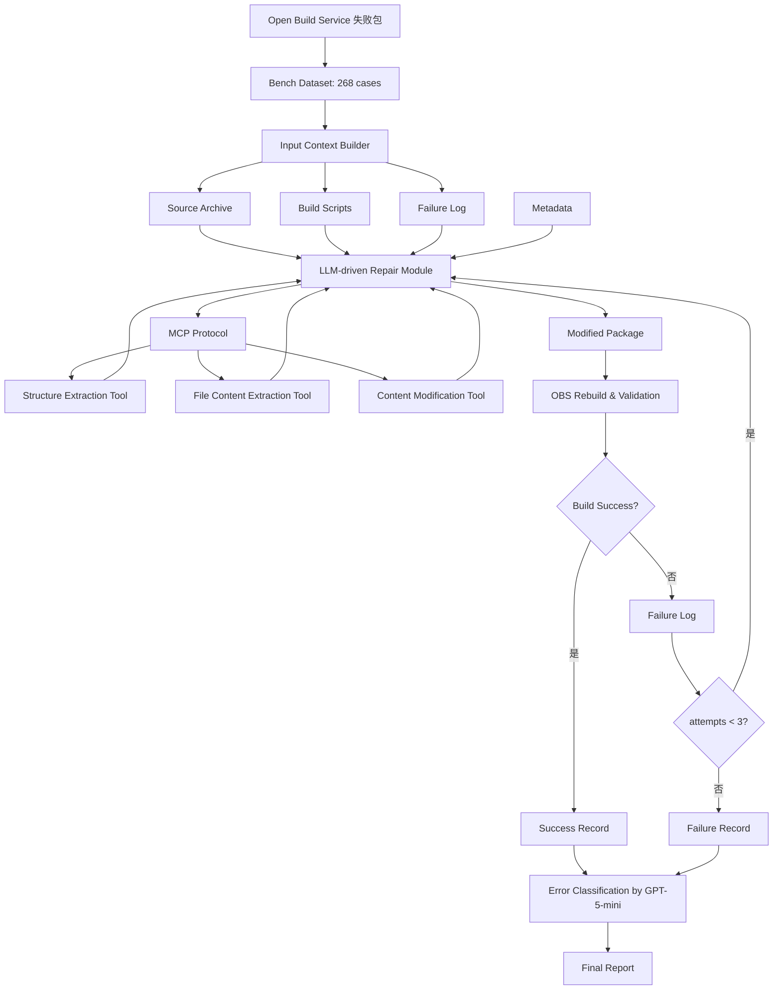
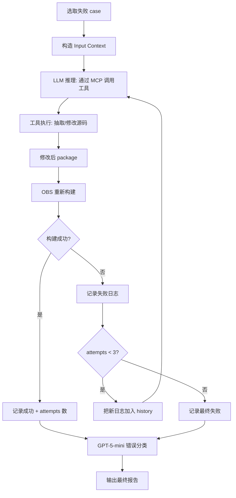

# Build-Bench：跨指令集架构软件包构建修复基准（2026）

> 作者：Weilin Jin、Chenyu Zhao、Zeshun Huang、Chaoyun Zhang、Qingwei Lin、Chetan Bansal、Saravan Rajmohan、Shenglin Zhang、Yongqian Sun、Dan Pei、Yifan Wu、Tong Jia、Ying Li、Zhonghai Wu、Minghua Ma
> 机构：Peking University、Nankai University、Microsoft、Tsinghua University
> 发表年份：2026
> 会议/期刊：待定（arXiv 2601.12927v1，2026 年 1 月）
> 关联 PDF：同目录下 `2601.12927v1.pdf`
> 代码：https://github.com/zcyyc/Build-bench

## 一、文档信息速览

| 字段 | 值 |
|---|---|
| 标题 | A Benchmark for Language Models in Real-World System Building |
| 作者 | Weilin Jin, Chenyu Zhao, Zeshun Huang, Chaoyun Zhang, Qingwei Lin, Chetan Bansal, Saravan Rajmohan, Shenglin Zhang, Yongqian Sun, Dan Pei, Yifan Wu, Tong Jia, Ying Li, Zhonghai Wu, Minghua Ma |
| 机构 | PKU、Nankai、Microsoft、Tsinghua |
| 发表年份 | 2026 |
| 会议/期刊 | arXiv preprint |
| 分类 | 评测 / 软件工程 / LLM / 跨 ISA 构建 |
| 核心问题 | 跨指令集架构（ISA）迁移时软件包构建失败如何自动修复？缺乏评估 LLM 在该任务上的基准 |
| 主要贡献 | 1) 首个跨 ISA 软件包构建修复基准（268 个真实案例）；2) 基于 MCP 的端到端评测流水线；3) 评估 6 个 SOTA LLM；4) GPT-5 最高 63.19% 成功率，揭示巨大改进空间 |

## 二、背景（Background）

LLM 正在颠覆软件工程——Copilot、Cursor 等工具改变了开发实践。然而现有研究主要集中在开发早期阶段（代码生成、代码补全），对**后开发阶段**（构建、部署、运维）关注不足。实际中，软件包在异构硬件（x86、ARM、PowerPC 等）上迁移构建是常见需求：

- Apple 从 PowerPC → x86 → ARM 的过渡；
- Amazon 采用 Graviton 处理器；
- 云超大规模厂商推动从 x86 → ARM 优化云成本。

跨 ISA 构建失败极其复杂：不仅是重新编译，还涉及构建系统、库依赖、工具链、汇编代码的深度修改。传统修复需包维护者人工诊断、调整依赖、修改源码，成本极高。

LLM 理论上可自动化该修复，但缺乏标准化基准来评估 LLM 能力。已有 CoderEval、OpenRCA、AIOpsLab、SWE-bench 等基准都聚焦于代码生成或单 ISA 软件工程问题，无法回答"LLM 在跨 ISA 软件包构建修复上能做多好"。

Build-bench 应运而生：从 Open Build Service（OBS）爬取真实跨 ISA 失败案例，构建标准化评估流水线，用 Model Context Protocol（MCP）连接工具，测试 6 个 SOTA LLM。

## 三、目的（Problems Solved）

- **痛点 1：缺乏跨 ISA 评估基准。** 现有基准都是单 ISA 或同构语言。
- **痛点 2：缺乏标准化评测流程。** 每次评测需重写工具集成。
- **痛点 3：缺乏对 LLM 失败模式分析。** 不知道 LLM 在该任务上的强项与短板。
- **解决方案**：Build-bench——基于 MCP 的端到端评测流水线，268 个真实案例，6 个 LLM 评估，5 类错误分类。

## 四、核心原理（Principles）

**总览**：Build-bench 是一个基于 Model Context Protocol（MCP）的端到端 LLM 驱动软件包构建修复评测框架。从 OBS 收集 268 个真实跨 ISA 失败案例，对每个 case 喂给 LLM 包含源码、构建脚本、错误日志的输入，LLM 通过工具修改源码，然后由 OBS 重新构建验证。

**三大模块**：

- **Input & Diagnosis Context**：包含源码归档、规范文件、元数据、构建脚本、失败日志；迭代时附加上次失败日志。
- **LLM-driven Repair Module**：基于 MCP 协议编排 LLM 修复模块。集成三类工具：
  - **Setup Tools**：准备构建环境
  - **Repair Tools**：实际修改源码（Structure Extraction、File Content Extraction、Content Modification）
  - **Rebuild & Validation Tools**：重新构建并验证
- **Verification & Evaluation**：将修复后的包上传到 Open Build Service 重新构建；最多重试 3 次；记录成功/失败。

**5 类错误分类**（用 GPT-5-mini 自动分析失败日志得到）：

1. **Build Preparation Errors**：依赖缺失、工具链配置错误、编译器 flag 错误。
2. **Compilation Errors**：语言不兼容、构建系统不匹配。
3. **Packaging Errors**：构建产物不完整或规范错误。
4. **Test Failures**：测试用例不通过。
5. **Environment or Infrastructure Errors**：VM 关停、资源中断等外部因素。

**关键数学**：

- **成功率**：
  $$SR = \frac{\#\{\text{cases repaired within 3 attempts}\}}{268}$$
- **方向成功率**：
  $$SR_{\text{x86→aarch64}} = \frac{\#\{x86→aarch64 \text{ fixed}\}}{163}$$
  $$SR_{\text{aarch64→x86}} = \frac{\#\{aarch64→x86 \text{ fixed}\}}{105}$$

**为什么这么做**：
- MCP 协议让 LLM 与工具的集成标准化、可复现；
- 重试机制（最多 3 次）允许 LLM 从失败中恢复；
- OBS 在线重建确保验证的真实性（不是模拟构建）。

**与现有方法的差异**：

- vs. SWE-bench：聚焦代码 bug 修复，Build-bench 聚焦跨 ISA 构建失败。
- vs. OpenRCA、AIOpsLab：聚焦故障定位，Build-bench 聚焦主动构建修复。
- vs. CoderEval：聚焦代码生成，Build-bench 聚焦多文件、多 ISA 真实工程任务。

## 五、算法详解（Algorithm）

### 1. 输入 / 输出
- **输入**：失败软件包（含源码、配置、构建脚本、日志）。
- **输出**：修复后的软件包 + 重新构建结果（成功/失败）。

### 2. 核心模块
- **MCP Client**：与 LLM 通信。
- **Tool Wrappers**：
  - StructureExtractor：解析包结构。
  - FileContentExtractor：抽取文件内容。
  - ContentModifier：修改文件。
  - RebuildValidator：在 OBS 上重新构建。
- **Retry Controller**：最多 3 次重试。
- **Evaluator**：记录成功/失败 + 错误分类。

### 3. 伪代码

```python
def build_bench_evaluate(case, llm, mcp_tools, max_retries=3):
    src_archive, build_log, meta = case
    attempt = 0
    history = []
    while attempt < max_retries:
        # 1) 构造 prompt
        prompt = build_repair_prompt(src_archive, build_log, meta, history)
        # 2) LLM 决策：通过 MCP 工具修改
        actions = llm.plan(prompt, available_tools=mcp_tools)
        # 3) 执行 actions
        for act in actions:
            if act.tool == "structure_extract":
                structure = StructureExtractor(src_archive).run(act.params)
                history.append({"tool": act.tool, "output": structure})
            elif act.tool == "content_modify":
                ContentModifier(src_archive).run(act.params)
            # ...
        # 4) 重新构建（通过 OBS API）
        build_result = RebuildValidator(src_archive).run()
        history.append({"log": build_result.log})
        if build_result.success:
            return {"case": case.id, "success": True, "attempts": attempt+1}
        attempt += 1
    return {"case": case.id, "success": False, "attempts": max_retries}
```

### 4. 关键数学
- 见上文 "关键数学" 章节。
- 错误分类：用 GPT-5-mini 对失败日志分类，多 sample 投票。

### 5. 复杂度分析
- 单个 case：~5-30 分钟（取决于 LLM 推理时间 + OBS 构建时间）。
- 整个 benchmark：~1-2 天（并行执行）。

### 6. 训练与推理
- 训练：Build-bench 是评测基准，无训练阶段。
- 推理：单 case 多轮 LLM 调用 + 工具调用 + OBS 构建。

### 7. 示例
- 包 "ffmpeg-4.4" 在 x86_64 上构建成功但迁移到 aarch64 失败，错误为 "ERROR: assembler specific errors"。
- LLM 通过 MCP 工具识别这是汇编代码不兼容（用了 x86 特定的 SSE intrinsic），修改为 NEON intrinsic，OBS 重新构建成功。

## 六、系统架构图（Architecture）



## 七、流程图（Process Flow）



## 八、关键创新点（Key Innovations）

- **+ 首个跨 ISA 软件包构建修复基准**：填补"LLM 能否修复真实跨 ISA 构建失败"这一空白。
- **+ 268 个真实案例**：从 OBS 直接抓取，163 个 x86_64→aarch64 + 105 个 aarch64→x86_64，覆盖多语言、多构建系统。
- **+ 基于 MCP 的标准化工具集成**：Structure / Content Extraction / Modification / Rebuild 都是 MCP 工具，可复现、可扩展。
- **+ 5 类错误细粒度分类**：从 GPT-5-mini 自动分类得到 Build Prep / Compilation / Packaging / Test / Environment 错误分布。
- **+ 揭示 LLM 局限性**：GPT-5 成功率最高也仅 63.19% (x86→aarch64) / 29.52% (aarch64→x86)，其他模型更差；说明该任务极难。

## 九、实验与结果（Experiments）

- **数据集**：268 个真实跨 ISA 软件包（163 x86→aarch64 + 105 aarch64→x86）。
- **LLM 评估**：GPT-5、GPT-5-mini、GPT-4o、Claude Sonnet 4.5、DeepSeek V3、Qwen3-max。
- **主要指标**：修复成功率（3 次尝试内）。
- **关键结果**：
  - GPT-5 表现最好：x86→aarch64 方向 63.19%，aarch64→x86 方向 29.52%；
  - 其他模型在 30%-50% 区间，且多数只能修复简单依赖或配置问题；
  - 跨方向难度差异大：x86→aarch64 显著更容易（可能因社区已有大量 aarch64 资料）。
- **错误分布**（GPT-5-mini 分类）：
  - Build Preparation：~30%；
  - Compilation：~40%；
  - Packaging：~15%；
  - Test Failures：~10%；
  - Environment：~5%。
- **效率分析**：单 case 平均 10-20 分钟；并行 100 cases ~3 小时；3 次重试覆盖大多数可修复 case。

## 十、应用场景（Use Cases）

- **跨 ISA 软件包维护**：开源软件包从 x86 迁移到 ARM 的自动化修复。
- **云成本优化**：自动把 x86 工作负载迁移到 ARM 架构节省云费用。
- **Apple Silicon 适配**：macOS 软件包从 Intel 迁移到 Apple Silicon。
- **边缘计算**：从服务器 x86 迁移到边缘 ARM 设备。
- **操作系统发行版**：openSUSE、Debian、Fedora 等发行版的跨架构包维护。

## 十一、相关论文（Related Papers in this set）

- 同为评测基准的 **OpsEval** 关注 Ops LLM 评测，**LogEval** 关注日志 LLM 评测，**Eagle** 关注 Ops QA 生成。Build-bench 关注"软件包构建"任务，互补形成完整的 LLM-for-SE 评测矩阵。
- **OpenRCA** 关注故障定位，与 Build-bench 的"主动构建修复"不同。

## 十二、术语表（Glossary）

- **ISA (Instruction Set Architecture)**：指令集架构。
- **x86_64 / aarch64 / ARM / PowerPC**：常见指令集架构。
- **MCP (Model Context Protocol)**：模型上下文协议，标准化 LLM 与工具的集成。
- **OBS (Open Build Service)**：开源构建服务。
- **Build / Build Failure**：构建 / 构建失败。
- **Cross-ISA Migration**：跨指令集架构迁移。
- **Repair Tool**：修复工具，如 Structure Extraction、Content Modification。
- **Retry Mechanism**：重试机制，最多 3 次。
- **SR (Success Rate)**：成功率。
- **Build Prep / Compilation / Packaging / Test / Environment**：5 类错误分类。

## 十三、参考与延伸阅读

- Open Build Service：https://build.opensuse.org
- Model Context Protocol (MCP)：Anthropic 提出。
- CoderEval、OpenRCA、AIOpsLab、SWE-bench：相关 SE 评测基准。
- LLM：GPT-5/4o、Claude Sonnet 4.5、DeepSeek V3、Qwen3-max。
- 代码：https://github.com/zcyyc/Build-bench
