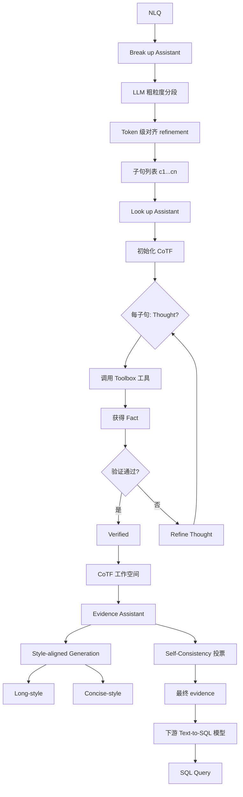
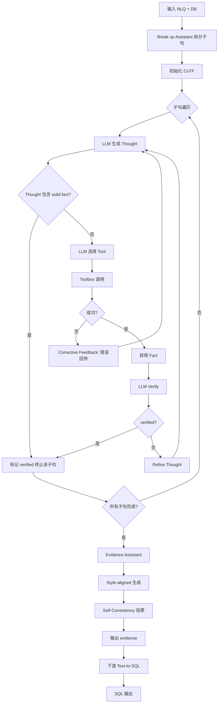

# DIVER：基于动态交互式 Value Linking 与证据推理的鲁棒 Text-to-SQL 系统（SIGMOD 2026）

> 作者：Yafeng Nan、Haifeng Sun、Zirui Zhuang、Qi Qi、Guojun Chu、Jianxin Liao、Dan Pei、Jingyu Wang
> 机构：北京邮电大学、清华大学
> 发表年份：2026
> 会议/期刊：SIGMOD 2026（Bengaluru, India）
> 关联 PDF：同目录下 `2602.12064v1.pdf`

## 一、文档信息速览

| 字段 | 值 |
|---|---|
| 标题 | DIVER: A Robust Text-to-SQL System with Dynamic Interactive Value Linking and Evidence Reasoning |
| 作者 | Yafeng Nan, Haifeng Sun, Zirui Zhuang, Qi Qi, Guojun Chu, Jianxin Liao, Dan Pei, Jingyu Wang |
| 机构 | 北京邮电大学、清华大学 |
| 发表年份 | 2026 |
| 会议/期刊 | SIGMOD 2026 |
| 分类 | Text-to-SQL / 多 Agent / 大模型 |
| 核心问题 | 现有 Text-to-SQL 模型在"无专家证据"的真实场景下执行准确率（EX）暴跌 10%+，其根本原因是 Value Linking 不全 |
| 主要贡献 | 1) 三 Agent 框架（Break up / Look up / Evidence）；2) CoTF 结构化工作空间；3) 动态交互式 Value Linking；4) Style-aligned Evidence 生成；5) 训练免费、模型无关 |

## 二、背景（Background）

Text-to-SQL 是把自然语言问题（NLQ）翻译为可在关系数据库上执行的 SQL 的技术，被视为数据库的"自然语言接口"。在 LLM 时代，BI、数据分析、自动化 Agent 都依赖 Text-to-SQL 从数据库抽取关键信息。

BIRD-bench 等新一代基准更贴近真实场景：大数据库、含噪值、用户问题含糊、SQL 逻辑复杂。研究者们投入大量精力改进底层模型（CodeS、DIN-SQL、DAIL-SQL 等），在 BIRD 上取得令人印象深刻的成绩——但论文发现：**这些成绩在很大程度上依赖专家手工撰写的 evidence（提示证据）**。

论文做了精细分析：
- 专家 evidence 在 BIRD-dev 上包含两大类：VLE（value linking & schema linking evidence）和 SQLE（SQL 函数/公式 evidence）；
- 在 CodeS-1B/3B/7B 等模型上，**仅加入 evidence 就能把 EX 提升 10% 以上**；
- 进一步分析发现，专家 evidence 与 golden SQL 的 token 重叠度高达 19.96%（Simple）/21.65%（Moderate）/26.23%（Challenging），这是"答案泄露"。

关键问题：当非专家用户或 LLM Agent 独立面对数据库时，专家 evidence 不可得。所有 52 个 BIRD 上榜方法中只有 5 个报告了"无 evidence"性能，且其中最好的也只排第 33——真实场景下 Text-to-SQL 性能"塌方"超过 10%。

进一步定位瓶颈：**"value linking"是失效的根源**。具体地：
- 用户问 "state special school" → 数据库里只有 "SSS"（缩写）→ 单纯语义相似度匹配不上；
- "kindergarten to 8th grade" → 需要把 "K" 和 "8" 两个值都映射到 Low/High Grade 列；
- "Multiple Provision Types" → 短文本无法用语义匹配定位到 NSLP Provision Status 列。

VLE 错则 SQLE 救不回来（论文实验 c→d 下降 vs. c→f 上升）。这与"模型规模"无关——GPT-4o 在 value linking 失败时同样会写错 SQL。

## 三、目的（Problems Solved）

- **痛点 1：依赖专家 evidence，真实场景不可用。** 模型在 BIRD 上漂亮但实际工程部署时性能塌方。
- **痛点 2：Value Linking 弱。** 现有方法用简单语义相似度，匹配不到缩写、数字、含噪值。
- **痛点 3：与 Schema 链接的细粒度对齐不足。** 大规模、动态数据库需要灵活且可解释的探索方式。
- **痛点 4：缺乏可扩展、模型无关的鲁棒方案。** 训练一个新 SFT 模型代价大。
- **解决方案**：DIVER——训练免费、模型无关的多 Agent 系统，自动生成高质量 evidence，在没有人类专家的情况下逼近"有专家"的效果。

## 四、核心原理（Principles）

**总览**：DIVER 由三个 Agent 组成：Break up Assistant、Look up Assistant、Evidence Assistant，运行在结构化的 CoTF（Chain of Thoughts and Facts）工作空间上。

**三个 Agent**：

- **Break up Assistant**：把复杂 NLQ 拆分为子句，每句聚焦一个实体或意图。分两步：(i) LLM 粗粒度语义分段；(ii) token-level refinement 与原 NLQ 对齐。
- **Look up Assistant**：核心。在 CoTF 上做多轮交互式 Value Linking。每次迭代：(1) 给出 Thought（假设）；(2) 调用工具箱中的 tool；(3) 拿到 Fact（数据库返回的客观值）；(4) 验证假设——若不通过则 refine 假设、调新工具。8 个工具分三大类：
  - **Value Probing**：`exact_value`, `sim_value_in`, `value_in`（含 reverse linking）
  - **Data Inspection**：`sample_rows`, `uniq_value`（含 null check）
  - **Schema Exploration**：`info`（列元数据）, `related_column`（找相关列）, `column_filter`（按列过滤）
- **Evidence Assistant**：从 CoTF 中提取 verified facts，按 Style-aligned Generation 输出最终 evidence。可选 long-style（适合 SFT-长 prompt 模型）或 concise-style（适合 short-context 模型），并做 self-consistency 多 sample 投票。

**CoTF（Chain of Thoughts and Facts）**：JSON 对象，两维结构——子句 × 交互轮次。每条 entry 包含 Thought、Tool Called、Fact、Verified/Correct/Wrong 状态。CoTF 强制"每个 Thought 都有 tool 验证"。

**为什么这么做**：
- 拆解 NLQ 降低 Look up Agent 复杂度；
- 多轮交互让 Value Linking 像 human expert 一样"探索-验证-修正"；
- CoTF 强制 grounding，消除 CoT 的幻觉；
- Style alignment 让 evidence 适配不同下游模型偏好。

**与现有技术的差异**：
- vs. 传统 schema linking（基于关系感知 embedding）：DIVER 用工具调用 + 数据库真实值做 explicit probing，更鲁棒。
- vs. multi-agent Text-to-SQL（DAgent、DB-GPT）：DIVER 把"多 agent 协作"聚焦在"evidence 生成"，不重写 SQL 生成流程。
- vs. SFT-based 强模型：训练免费、即插即用。

## 五、算法详解（Algorithm）

### 1. 输入 / 输出
- **输入**：自然语言问题 $q$、数据库 $D$（含 schema、values）。
- **输出**：高质量 evidence 文本 $E$，供下游 Text-to-SQL 模型生成 SQL。

### 2. 核心模块
- **Break up Assistant**：$q \to [c_1, c_2, \dots, c_n]$，每 $c_i$ 包含单一实体或意图。
- **CoTF Workspace**：$W = \{ (c_i, t_{i,1}, \text{tool}_{i,1}, f_{i,1}, \text{verified}_{i,1}), \dots \}$，二维结构。
- **Look up Assistant**：在 $W$ 上做 Thought-Verify-Refine 迭代。
- **Toolbox**：8 个原子工具。
- **Evidence Assistant**：从 verified facts 生成最终 evidence。
- **Downstream SQL Generator**：任意 Text-to-SQL 模型接收 $(q, D, E)$ 输出 SQL。

### 3. 伪代码

```python
def diver_generate_evidence(nlq, db, llm, toolbox, max_turns=8):
    # 1) Break up
    clauses = break_up_assistant(nlq, llm)  # [c1, c2, ..., cn]
    
    # 2) 初始化 CoTF
    cotf = {c: [] for c in clauses}
    
    # 3) Look up: 多轮交互
    for c in clauses:
        for turn in range(max_turns):
            thought = llm.thought(nlq, c, cotf)  # 自然语言思考
            if thought.contains_solid_fact():
                cotf[c].append({"thought": thought, "verified": True})
                break
            tool_name, params = llm.choose_tool(thought, toolbox)
            try:
                fact = toolbox.call(tool_name, params, db)
                verified = llm.verify(thought, fact)
            except ToolError as e:
                fact = {"error": str(e)}
                verified = False
            cotf[c].append({"thought": thought, "tool": tool_name, "fact": fact, "verified": verified})
            if verified:
                break
    
    # 4) Evidence 生成
    style = "long" if downstream_model.is_sft_long else "concise"
    candidates = []
    for _ in range(self_consistency_n):
        evidence = evidence_assistant(nlq, cotf, style=style, llm=llm)
        candidates.append(evidence)
    evidence = self_consistency_vote(candidates)
    
    return evidence
```

### 4. 关键数学
- **Self-Consistency 投票**：
  $$\hat E = \arg\max_E \sum_{j=1}^{N} \mathbb{1}\big[\text{sim}(E, E^{(j)}) \geq \tau\big]$$
  其中 $\text{sim}$ 为 ROUGE-L 或 embedding 相似度，$\tau$ 为阈值。
- **Tool Verify 的概率**：
  $$P(\text{verify}|\text{thought}, \text{fact}) = \text{llm\_score}(\text{thought}, \text{fact}) \in [0,1]$$
  阈值 0.5 时通过验证。
- **Corrective Feedback 触发**：
  $$\text{Raise} = \mathbb{1}\big[\text{tool\_status} = \text{ERROR}\big]$$
  系统自动把错误信息回传 LLM，触发下一轮 refine。

### 5. 复杂度分析
- 单条 NLQ 处理：Break up 1 次 LLM 调用 + Look up 每子句 ≤ 8 次 × 2（Thought+Tool）调用 + Evidence N 次生成。
- 整体延迟：~30-60 秒/查询。
- Token 消耗：~5-15K tokens/查询。

### 6. 训练与推理
- **完全训练免费**：DIVER 是推理时的多 Agent 框架。
- **推理**：单次查询多轮 LLM 调用，下游 SQL 生成器可直接消费 evidence。

### 7. 示例
- NLQ: "Of the schools that offers a magnet program serving a grade span of Kindergarten to 8th grade, how many offers Multiple Provision Types?..."
- Break up: 5 个子句（magnet program, grade span K-8, multiple provision types, list cities, count schools）。
- Look up: 子句 1 用 uniq_value 找 "Magnet" 列值；子句 2 找 Low Grade / High Grade；子句 3 用 value_in 验证 "Multiple Provision Types" 字符串；等等。
- Evidence: "magnet program refers to Magnet = 1; Kindergarten to 8th refers to Low Grade='K' and High Grade='8'; offers Multiple Provision Types is checked by NSLP Provision Status = 'Multiple Provision Types'..."
- 下游模型接收 evidence 生成 SQL。

## 六、系统架构图（Architecture）



## 七、流程图（Process Flow）



## 八、关键创新点（Key Innovations）

- **+ 系统性发现 evidence 依赖问题**：通过 BIRD-dev 上的精细分析，定量证明"专家 evidence 含 20-26% 答案泄露"和"无 evidence 时模型性能塌方 10%+"，揭示研究评测的不公平性。
- **+ CoTF 结构化工作空间**：把 Chain of Thoughts（自由 CoT）升级为"每个 Thought 必须有 Tool 验证"的强约束结构，彻底杜绝无根据推理。
- **+ Thought-Verify-Refine 多轮交互**：模拟人类专家的"试错-调整"流程；Corrective Feedback 自动从 tool 错误中恢复（论文统计在 BIRD-dev 上纠正了 94 次错误调用）。
- **+ Style-aligned + Self-Consistency Evidence**：根据下游模型偏好生成 long/short 风格 evidence，并做投票去噪，适配 SFT 模型、prompt-based 模型、CodeS 等。
- **+ 训练免费 + 模型无关**：BIRD 上 EX 提升高达 10.82%，VES 提升 16.09%；无任何 SFT/微调。

## 九、实验与结果（Experiments）

- **数据集**：BIRD-bench、Spider 2.0 等 4 个 Text-to-SQL 基准。
- **下游模型**：CodeS-1B/3B/7B/15B、GPT-4o、DeepSeek-Coder 等 6+ 模型。
- **主要指标**：EX（Execution Accuracy）、VES（Valid Efficiency Score）。
- **关键结果**：
  - 4 个 benchmark 一致提升，最高 EX +10.82%、VES +16.09%；
  - 即使在"无 evidence vs 有 evidence 公平设置"下，DIVER 自动生成的 evidence 让模型超越"有专家 evidence"的旧 baseline；
  - 对 CodeS-1B 这类小模型提升最显著（弥补小模型推理能力）。
- **消融实验**：
  - 去掉 Break up：Look up 容易跑偏，性能下降；
  - 去掉 CoTF（用自由 CoT）：幻觉增多，verified 比例下降；
  - 去掉 Self-Consistency：单 sample 噪声大；
  - 去掉 Style alignment：小模型 (short-context) 性能下降明显。
- **效率分析**：单查询 30-60 秒；Token 消耗 5-15K；Toolbox 调用次数平均 6-12 次/查询；Corrective Feedback 挽救 94 次错误。

## 十、应用场景（Use Cases）

- **企业 BI 系统**：业务人员用自然语言查询数据，无需 SQL 知识。
- **LLM Agent 数据库操作**：Agent 自主查询数据库完成复杂任务。
- **客服系统**：从知识库/订单库自动抽取客户问题答案。
- **金融/医疗报告生成**：自然语言 → SQL → 报告模板自动填充。
- **数据库教学**：学生用自然语言验证 SQL 答案。

## 十一、相关论文（Related Papers in this set）

- 同为 NetMan Lab 的 **FoundRoot** 用 LLM 做 RCA 推理，与 DIVER 共享"结构化思考 + 工具调用"思想（5 步 SDT vs. CoTF）。
- **Eagle** 提供 Ops LLM 评测基准，DIVER 的"自然语言接口"能力可被 Eagle 的 Anomaly Detection / Fault Diagnosis 任务评估。
- 与本批中 AIOpsArena 等关注微服务监控的论文属于不同任务域，但同样体现"LLM Agent + 工具"在企业落地的趋势。

## 十二、术语表（Glossary）

- **Text-to-SQL**：把自然语言翻译为 SQL 的任务。
- **BIRD-bench**：大规模真实数据库 Text-to-SQL 基准。
- **Evidence / Hint**：辅助模型推理的提示信息。
- **Value Linking (VL)**：把 NLQ 中提到的实体映射到数据库中真实值。
- **Schema Linking (SL)**：把 NLQ 中提到的实体映射到数据库表/列。
- **VLE / SQLE**：Value Linking Evidence / SQL Evidence。
- **CoTF (Chain of Thoughts and Facts)**：本文提出的结构化工作空间。
- **Self-Consistency**：多 sample 投票去噪。
- **EX (Execution Accuracy)**：执行准确率。
- **VES (Valid Efficiency Score)**：有效效率分数。
- **Thought-Verify-Refine**：DIVER 的核心循环。
- **Corrective Feedback**：Tool 出错时回传错误信息触发下一轮。

## 十三、参考与延伸阅读

- BIRD-bench：大规模真实 Text-to-SQL 基准。
- CodeS（Ding et al., 2024）、DIN-SQL、DAIL-SQL：被 DIVER 增强的下游 Text-to-SQL 模型。
- RAT-SQL、RESDSQL、PICARD：PLM-era 代表作。
- DB-GPT、DAgent、Chat2Query：BI + Text-to-SQL 的多 Agent 系统。
- 同期 SOTA：BIRD leaderboard 33 名之前的 no-evidence 方法对比。
