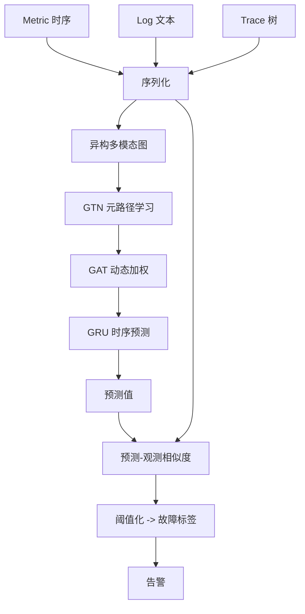
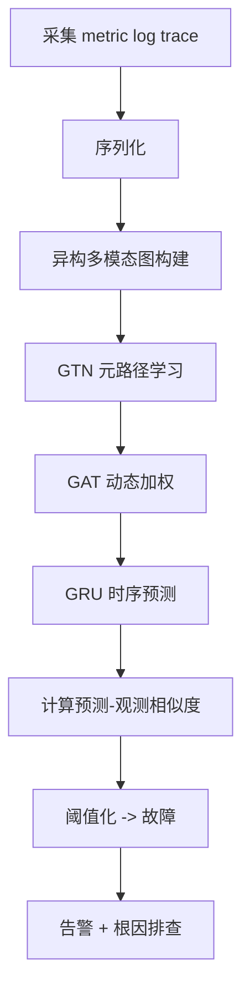

# AnoFusion: Robust Multimodal Failure Detection for Microservice Systems（KDD 2023）

> 作者：Chenyu Zhao、Minghua Ma、Zhenyu Zhong、Shenglin Zhang、Zhiyuan Tan、Xiao Xiong、LuLu Yu、Jiayi Feng、Yongqian Sun、Yuzhi Zhang、Dan Pei、Qingwei Lin、Dongmei Zhang  
> 机构：南开大学；微软；清华大学；海河实验室  
> 发表年份：2023  
> 会议/期刊：KDD 2023（2023 年 8 月 6-10 日，美国 Long Beach）  
> 关联 PDF：同目录下 `3580305.3599902.pdf`

## 一、文档信息速览

| 字段 | 值 |
|---|---|
| 标题 | AnoFusion: Robust Multimodal Failure Detection for Microservice Systems |
| 作者 | Chenyu Zhao、Minghua Ma、Zhenyu Zhong、Shenglin Zhang、Zhiyuan Tan、Xiao Xiong、LuLu Yu、Jiayi Feng、Yongqian Sun、Yuzhi Zhang、Dan Pei、Qingwei Lin、Dongmei Zhang |
| 机构 | 南开大学；微软；清华大学；海河实验室 |
| 发表年份 | 2023 |
| 会议/期刊 | KDD 2023 |
| 分类 | 多模态异常检测 / 微服务 |
| 核心问题 | 微服务实例故障检测中，单模态方法对某些故障（如 QR 码生成失败）漏检，融合 metric/log/trace 多模态数据可提高准确性 |
| 主要贡献 | (1) 提出 AnoFusion 框架，融合 metric/log/trace 三模态；(2) 用 GTN 建模异构多模态图；(3) GAT 优化图结构 + GRU 捕捉时序；(4) 预测-观测相似度判别故障；(5) 两个微服务数据集 F1 0.857/0.922，平均提升 0.278/0.480 |

## 二、背景（Background）

微服务系统通常包含数十到数千个实例，故障可能因单一实例异常触发并传播。论文区分"异常（anomaly）"和"故障（failure）"：异常是监控数据偏离正常状态；故障是服务交付出错、用户感受降级。一次故障往往引发多模态异常，但短期瞬时异常不一定会演变为故障。表 1 给出典型故障-异常对应：QR 码生成失败只反映在指标（内存飙升），登录失败反映在日志（ERROR）和追踪（响应时间延长），文件丢失只反映在追踪。

单模态异常检测方法在实例故障检测中效果有限：(1) 单模态数据无法揭示所有故障类型；(2) 简单组合单模态结果会产生大量误报（如瞬时网络抖动）。论文提出 AnoFusion 框架，用 GTN（Graph Transformer Network）建模 metric/log/trace 异构多模态数据的相关性，用 GAT 优化图结构、GRU 捕捉时序，最后用预测-观测相似度判断实例是否故障。

## 三、目的（Problems Solved）

- **单模态方法漏检**：融合 metric/log/trace。
- **多模态异构性**：用 GTN 建模异构图。
- **动态变化**：用 GAT 自适应图结构 + GRU 捕捉时序。
- **误报高**：用预测-观测相似度替代单模态简单组合。
- **无监督**：避免对标签的依赖。
- **可扩展**：适用 10/28 实例规模。

## 四、核心原理（Principles）

**系统总览**：AnoFusion 工作流为：(1) 序列化各模态数据（metric → 时序向量、log → 模板特征、trace → 树节点特征）；(2) 构造异构多模态图（不同模态为不同节点类型）；(3) GTN 学习多模态节点嵌入与元路径；(4) GAT 在动态图上加权聚合；(5) GRU 捕捉时序信息并预测下一时刻；(6) 用预测值与观测值的相似度判别故障。

**关键概念**：

- **Multimodal Data（多模态数据）**：metric、log、trace。
- **Anomaly（异常）**：监控数据偏离正常。
- **Failure（故障）**：服务交付出错、用户感受降级。
- **GTN（Graph Transformer Network）**：图变换网络，学习异构图元路径。
- **GAT（Graph Attention Network）**：图注意力网络，动态加权聚合。
- **GRU（Gated Recurrent Unit）**：门控循环单元，捕捉时序。
- **Meta-path（元路径）**：异构图中节点类型的连接序列。
- **Heterogeneous Graph（异构图）**：节点/边类型不同的图。

**数学原理**：

- **GTN 元路径学习**：

$$
A^{(l)} = \sigma\left( \sum_{Q \in \mathcal{Q}} \alpha_Q^{(l)} A_Q^{(l-1)} \right)
$$

其中 $A_Q$ 是按元路径 $Q$ 的邻接矩阵，$\alpha_Q$ 是可学习权重。

- **GAT 节点更新**：

$$
h_v' = \phi\left( \sum_{u \in N(v)} \alpha_{vu} W h_u \right)
$$

$\alpha_{vu} = \text{softmax}_u(\text{LeakyReLU}(a^\top [W h_v \| W h_u]))$。

- **GRU 时序预测**：

$$
h_t = \text{GRU}(h_{t-1}, x_t)
$$

- **预测-观测相似度**：

$$
s(t) = \| x_t^{\text{obs}} - \hat{x}_t \|_2^2
$$

$s$ 越大越可能是故障。

- **训练目标**（无监督重建/预测）：

$$
\mathcal{L} = \sum_t \| x_t - \hat{x}_t \|_2^2
$$

- **故障判定**：

$$
\text{Failure}(t) = \mathbb{1}[s(t) > \tau]
$$

**与现有技术的差异**：与单模态方法（USAD、LogCluster、TraceAnomaly）相比，AnoFusion 多模态融合；与 SCWarn（metrics+logs LSTM）相比，AnoFusion 加入 trace + 异构图；与 Eadro 相比，AnoFusion 用 GTN 显式建模异构关系。

## 五、算法详解（Algorithm）

1. **输入 / 输出**：
   - 输入：实例的多模态数据（metric、log、trace）。
   - 输出：每个时间点是否故障。

2. **核心模块**：
   - **模态序列化**：metric → 滑窗时序向量；log → 模板特征 + TF-IDF/BERT；trace → 树节点统计特征。
   - **异构多模态图**：节点 = 实例 + 模态 + 时间步；边 = 调用关系 + 时间邻接 + 模态关联。
   - **GTN**：学习元路径嵌入。
   - **GAT**：动态加权聚合。
   - **GRU**：时序预测。
   - **相似度判别**：阈值化。

3. **伪代码**：

```python
def anofusion_train(modal_data, epochs=100):
    H = serialize(modal_data)   # metric, log, trace -> vectors
    A = build_heterogeneous_graph(H)
    for ep in range(epochs):
        H_gtn = gtn(A)               # meta-path embedding
        H_gat = gat(H_gtn, A)        # dynamic attention
        H_t = gru(H_gat)             # temporal prediction
        loss = mse(H_t, H.shift(-1))
        loss.backward()
    return model

def anofusion_detect(modal_data, model, threshold):
    H = serialize(modal_data)
    A = build_heterogeneous_graph(H)
    H_gtn = gtn(A)
    H_gat = gat(H_gtn, A)
    H_pred = gru(H_gat)
    s = ((H - H_pred) ** 2).mean(dim=-1)
    return (s > threshold).int()
```

4. **关键数学**：见 §四。

5. **复杂度分析**：
   - GTN：$O(|E| d)$；
   - GAT：$O(|V| d^2)$；
   - GRU：$O(T d^2)$；
   - 总计：GPU 上分钟级到小时级（取决于数据规模）。

6. **训练与推理**：无监督训练（重建/预测）；推理用相似度阈值化。

7. **示例**：某实例 QR 码生成失败，metric 显示内存飙升，log 正常，trace 正常；AnoFusion 融合三模态 + GTN 异构图 → GAT 动态聚合 → GRU 预测 → 预测值与观测值在 metric 维度偏差大 → 故障判定。

## 六、系统架构图（Architecture）



## 七、流程图（Process Flow）



## 八、关键创新点（Key Innovations）

- **+ 多模态异构图**：用 GTN 显式建模 metric/log/trace 异构关系。
- **+ GAT + GRU 联合**：动态图加权 + 时序预测。
- **+ 预测-观测相似度判别**：替代单模态简单组合，降低误报。
- **+ 无监督训练**：避免标签依赖。
- **+ 真实工业数据集**：10/28 实例规模。

## 九、实验与结果（Experiments）

- **数据集**：2 个微服务系统（10 实例、28 实例）。
- **Baseline**：单模态方法（USAD、LogCluster、TraceAnomaly）、多模态（SCWarn、Eadro）。
- **主要指标**：F1-score、Precision、Recall。
- **关键结果数字**：
  - AnoFusion F1 0.857 / 0.922；
  - 平均提升 0.278 / 0.480；
  - 在 QR 码生成失败这类"单模态异常"故障上提升尤为显著。
- **消融实验**：分别去掉 GTN、GAT、GRU、模态，验证每部分贡献。
- **效率分析**：训练分钟级到小时级；推理毫秒级。
- **可视化**：异构多模态图、元路径热力图。

## 十、应用场景（Use Cases）

- **微服务实例故障检测**：识别单模态难检的故障。
- **金融支付链路监控**：检测"指标正常但日志异常"等隐蔽故障。
- **电商大促异常监测**：发现"瞬时网络抖动 vs 持续故障"。
- **SaaS 多租户监控**：跨模态识别租户级异常。
- **运营商业务监控**：融合 trace + log 定位根因。

## 十一、相关论文（Related Papers in this set）

- `TSC23-DiagFusion`（多模态故障诊断）
- `DiagFusion` 系列：DiagFusion（同期，作者有重叠）
- `TraceVAE`（追踪异常检测）
- `Chain-of-Event_Interpretable-Root-Cause-Analysis-for-MicroservicesFSE24-Camera-Ready`（事件级根因）
- `AlertRCA_CCGRID2024_CameraReady`（告警根因）
- `LogKG`（日志 KG 诊断）
- `MonitorAssistant_CameraReady-v1.5_submitted`（LLM 监控助手）

## 十二、术语表（Glossary）

- **Multimodal Data**：多模态数据（metric、log、trace）。
- **Anomaly**：异常。
- **Failure**：故障。
- **GTN（Graph Transformer Network）**：图变换网络。
- **GAT（Graph Attention Network）**：图注意力网络。
- **GRU（Gated Recurrent Unit）**：门控循环单元。
- **Meta-path**：元路径。
- **Heterogeneous Graph**：异构图。
- **Failure Detection**：故障检测。
- **Anomaly Detection**：异常检测。
- **Thresholding**：阈值化。
- **MMD（Multimodal Data）**：多模态数据。

## 十三、参考与延伸阅读

- Paper: GTN（Yun et al., NeurIPS 2019）——图变换网络。
- Paper: GAT（Veličković et al., 2018）——图注意力。
- Paper: GRU（Cho et al., 2014）——门控循环单元。
- Paper: USAD（KDD 2020）——单模态基线。
- Paper: SCWarn（KDD 2019）——metrics + logs LSTM。
- Paper: Eadro（KDD 2023）——多模态端到端。
- 工具：Jager、Zipkin、Prometheus、Grafana。
- 数据集：TrainTicket、Sock Shop 等开源微服务 demo。
- 相关论文：`TSC23-DiagFusion`、`TraceVAE`、`Chain-of-Event_Interpretable-Root-Cause-Analysis-for-MicroservicesFSE24-Camera-Ready`、`AlertRCA_CCGRID2024_CameraReady`、`LogKG`、`MonitorAssistant_CameraReady-v1.5_submitted`。
