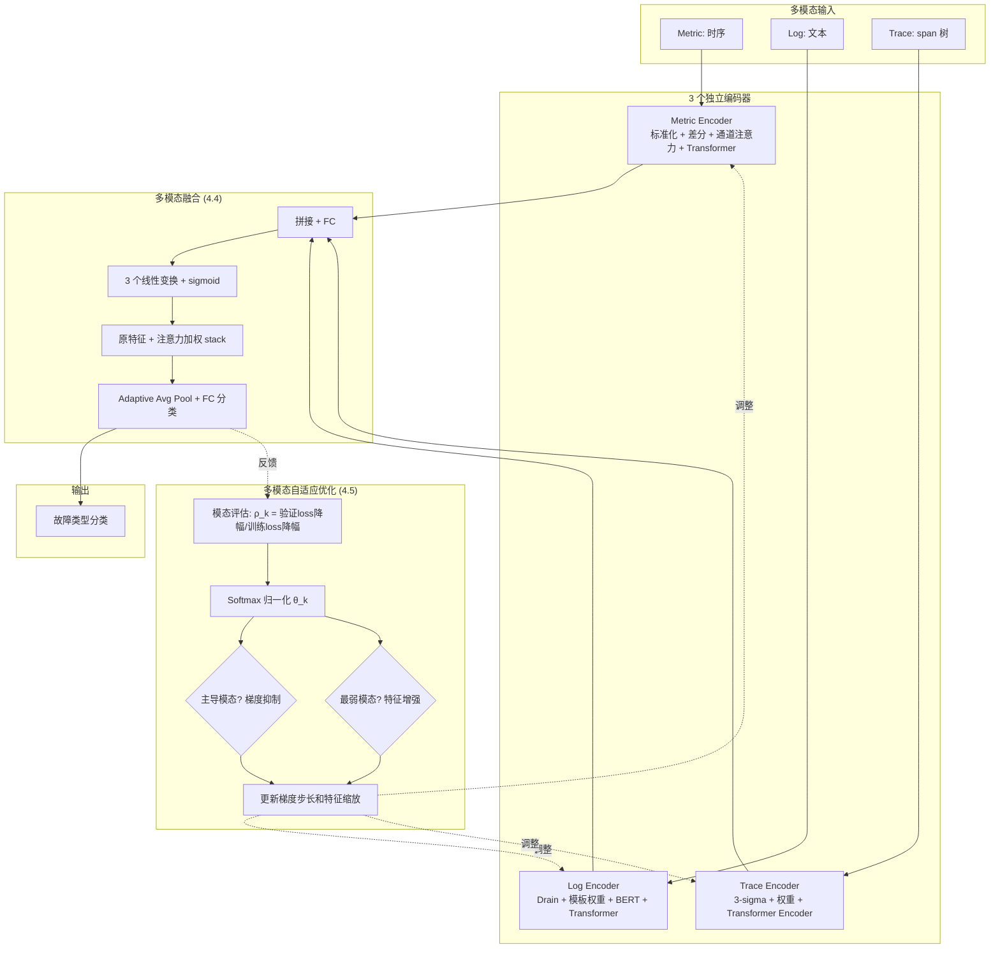
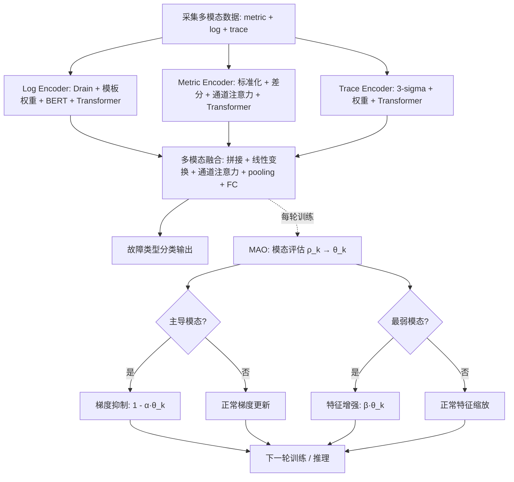

# Medicine: Giving Every Modality a Voice in Microservice Failure Diagnosis via Multimodal Adaptive Optimization（ASE 2024）

> 作者：Lei Tao, Shenglin Zhang, Zedong Jia, Jinrui Sun, Minghua Ma, Zhengdan Li, Yongqian Sun, Canqun Yang, Yuzhi Zhang, Dan Pei  
> 机构：南开大学（HL-IT、TKL-SEHCI）、国防科技大学、NSCC-TJ、Microsoft Redmond、清华大学（BNRist）  
> 发表年份：2024  
> 会议/期刊：ASE 2024（39th IEEE/ACM International Conference on Automated Software Engineering）  
> 关联 PDF：同目录下 `3691620.3695489.pdf`  
> 代码：[28] 公开

## 一、文档信息速览

| 字段 | 值 |
|---|---|
| 标题 | Giving Every Modality a Voice in Microservice Failure Diagnosis via Multimodal Adaptive Optimization（Medicine） |
| 作者 | Lei Tao, Shenglin Zhang, Zedong Jia, Jinrui Sun, Minghua Ma, Zhengdan Li, Yongqian Sun, Canqun Yang, Yuzhi Zhang, Dan Pei |
| 机构 | 南开大学、国防科技大学、NSCC-TJ、Microsoft Redmond、清华大学 |
| 发表年份 | 2024 |
| 会议/期刊 | ASE 2024 |
| 分类 | 微服务 / 故障诊断 / 多模态学习 / 自适应优化 |
| 核心问题 | 微服务故障诊断中，单模态（日志/指标/trace）信息不全面；多模态融合方法存在"主导模态压制其他模态"和"格式统一破坏模态内部结构"的问题。 |
| 主要贡献 | 1) 第一个"模态独立"多模态微服务故障诊断框架 Medicine：分别编码各模态保留独特信息；2) 多模态自适应优化（MAO）模块：模态评估 + 梯度抑制 + 特征增强，让每个模态都有"发言权"；3) 在 3 个公开数据集上 F1 提升 15.72%–70.84%，即便部分模态缺失或质量低也能保持高精度；4) 模态级并行流结构 + 通道注意力融合机制。 |

## 二、背景（Background）

微服务架构把应用拆分成大量独立部署的服务，灵活可维护，但一旦一个服务出故障，依赖链会迅速传播。AWS Lambda 在 2023 年 6 月 13 日因一个潜在软件缺陷导致多个 AWS 服务中断近 4 小时，造成重大经济损失。这种案例凸显了**快速故障诊断**的重要性——准确定位故障类型（硬件故障、软件故障、网络问题等）能帮运维人员更快修复、减少停机。

微服务系统天然生成三类可观测数据：
- **Metrics（指标）**：时序数据，反映业务状态和机器性能。
- **Logs（日志）**：程序执行输出的非结构化文本。
- **Traces（追踪）**：业务调用中产生的 span 树，连接服务调用信息。

单模态方法（仅 metric、仅 log、仅 trace）有显著局限：仅看日志可能漏掉 CPU 飙升、仅看 metric 可能漏掉"Login Failure"等只在日志/trace 中可见的故障。因此多模态融合成为近年趋势，按融合阶段可分为：
- **特征融合**：把多模态映射到统一表示空间再分类（CloudRCA、DiagFusion）。
- **模型融合**：各自提取特征后用图/知识图谱等模型融合（Groot、TrinityRCL、MicroCBR）。
- **结果融合**：各模态独立诊断后投票（PDiagnose）。

然而现有方法存在三大痛点：
1. **数据格式不一致**：把多模态映射到统一空间会破坏各模态内部的信息结构。
2. **不完整和低质量数据**：实际生产中多模态数据经常缺失或质量低，融合方法性能骤降。
3. **模态优化相互干扰**：用统一学习目标和训练策略时，"高产量"模态（通常 metric）会压制其他模态的优化，导致"低产量"模态不能充分利用其特征。

Medicine 直击这三大痛点：分别编码保留各模态独特信息 + 模态级并行流 + MAO 模块让每个模态都有"发言权"。

## 三、目的（Purpose / Problems Solved）

论文给出三大挑战对应方案：

- **挑战 1：数据格式不一致 → 破坏模态结构。** 解决方案：**针对每种模态设计独立的数据处理、特征编码和分类器**，让每个模态的内部信息结构得以保留。
- **挑战 2：不完整和低质量数据。** 解决方案：**并行流结构 + 模态调制**，让每种模态"独立"地贡献信息，不强依赖任何单一模态。
- **挑战 3：模态优化相互干扰 → 高产模态压制低产模态。** 解决方案：**模态评估 → 梯度抑制高产模态 → 特征增强低产模态**，平衡优化过程。

## 四、核心原理（Principles）

Medicine 框架（Fig.3）三大阶段：

### 1) Feature Encoding（特征编码）
- **Log Encoder（4.1）**：
  - 用 Drain 解析日志为模板；
  - 用公式 1-2 统计每个模板在窗口的增量/减量 → 模板权重；
  - 用 BERT 把模板转成语义向量 $h_i$（公式 4）；
  - 按权重 $w_i$ 加权求和（公式 5）得到窗口日志表示 $r_j$；
  - 输入 Transformer + global pooling 提取日志模态高阶表示。
- **Metric Encoder（4.2）**：
  - 标准化（公式 6） + 一阶差分（公式 7）；
  - 把不同实例当 channel，用 SENet 风格的通道注意力机制聚焦 root cause 和 cascade 影响；
  - Transformer + global pooling 提取指标模态表示。
- **Trace Encoder（4.3）**：
  - 标准化 span duration（公式 8）；
  - 用 3-sigma 检测每类 span 的异常 score（公式 9）；
  - 用与 Log Encoder 一致的统计方法给不同类型 span 赋权；
  - Transformer Encoder + 线性分类器提取 trace 模态表示。

### 2) Multimodal Fusion（多模态融合，4.4）
- 三个模态特征 $x, y, z$ 拼接 → 全连接层得 $f_{cout}$；
- 三个模态各自线性变换 $linear_{xout}, linear_{yout}, linear_{zout}$；
- sigmoid 得注意力权重 $\sigma(x_{out}), \sigma(y_{out}), \sigma(z_{out})$；
- 原特征 + 注意力加权特征 stack → adaptive average pooling → 全连接分类。

### 3) Multimodal Adaptive Optimization（MAO，4.5）
- **Modality Evaluation（模态评估）**：用验证集 loss 降幅 / 训练集 loss 降幅 之比 $\rho_k$（公式 10）评估每种模态的"泛化贡献"，softmax 归一化得 $\theta_k$（公式 11）。
- **Gradient Suppression（梯度抑制）**：对 $\theta_k$ 最大的"主导模态"，抑制其梯度更新步长（公式 12-13），避免压制其他模态。
- **Feature Enhancement（特征增强）**：对 $\theta_k$ 最小的"低产模态"，放大其特征（公式 14-15），加速其学习。

**与现有方法差异**：
- vs 特征融合方法（CloudRCA、DiagFusion）：本方法不破坏模态内部结构，分别编码再融合。
- vs 模型融合方法（Groot、MicroCBR）：本方法用 MAO 平衡优化，不让单模态主导。
- vs 结果融合方法（PDiagnose）：本方法在特征级别融合 + MAO 优化，比"投票"更精准。

数学核心：

模态评估（公式 10-11）：

$$\rho_k = \frac{L_k^V(n-1) - L_k^V(n)}{L_k^T(n-1) - L_k^T(n)}$$

$$\theta_k = \frac{e^{\rho_k}}{\sum_{j=1}^{K}e^{\rho_j}}$$

梯度抑制（公式 12-13）：

$$s_k^t = \begin{cases} 1 - \alpha \cdot \theta_k & k = \arg\max(\theta^t_k) \\ 1 & \text{otherwise} \end{cases}$$

$$\omega_{t+1}^k = \omega_t^k - \eta \cdot s_k^t \tilde{g}(\omega_t^k)$$

特征增强（公式 14-15）：

$$s_k^t = \begin{cases} \beta \cdot \theta_k & k = \arg\min(\theta^t_k) \\ 1 & \text{otherwise} \end{cases}$$

$$\tilde{x}_k^t = s_k^t \cdot u_k^t$$

## 五、算法详解（Algorithm）

### 1. 输入 / 输出

- **输入**：微服务系统的 metric、log、trace 三模态数据。
- **输出**：故障类型分类（7 类，Table 1）。

### 2. 核心模块

- **Log Encoder**：Drain 解析 + 模板权重 + BERT + Transformer。
- **Metric Encoder**：标准化 + 差分 + 通道注意力 + Transformer。
- **Trace Encoder**：3-sigma 异常 + 权重 + Transformer。
- **Multimodal Fusion**：拼接 + 线性变换 + 通道注意力 + pooling + 分类。
- **MAO**：模态评估 + 梯度抑制 + 特征增强。

### 3. 伪代码

```python
# === Log Encoder ===
def log_encoder(logs, time_window):
    templates = drain_parse(logs)                      # 模板抽取
    c_prime = log_volume_increment(templates)          # 公式 1
    w = template_weight(c_prime)                       # 公式 2-3
    h = [BERT(t) for t in templates]                   # 公式 4
    r_j = sum(w[i] * h[i] for i in range(n))          # 公式 5
    return transformer(global_pool(r_j))

# === Metric Encoder ===
def metric_encoder(metrics, instances):
    x_prime = standardize(metrics)                    # 公式 6
    x_double_prime = diff(x_prime)                     # 公式 7
    # 通道注意力：把每实例当 channel
    attended = channel_attention(x_double_prime, instances)
    return transformer(global_pool(attended))

# === Trace Encoder ===
def trace_encoder(traces):
    duration = standardize([s.duration for s in traces])   # 公式 8
    S = three_sigma_score(duration)                          # 公式 9
    weight = statistical_weight(S)                            # 与 log 相同
    return transformer_encoder(weight * S)

# === Multimodal Fusion ===
def multimodal_fusion(x, y, z):  # x=log, y=metric, z=trace
    f_concat = fc(concat([x, y, z]))
    sigma_x = sigmoid(linear_xout(x))
    sigma_y = sigmoid(linear_yout(y))
    sigma_z = sigmoid(linear_zout(z))
    stacked = stack([x, sigma_x*x, y, sigma_y*y, z, sigma_z*z])
    pooled = adaptive_avg_pool(stacked)
    return fc(pooled)  # 故障类型分类

# === MAO ===
def mao_step(losses_train, losses_val, thetas):
    rho = (losses_val[mod] - prev_losses_val) / (losses_train[mod] - prev_losses_train)
    theta = softmax(rho)
    # 梯度抑制
    dominant = argmax(theta)
    s_grad = 1 - alpha * theta[dominant] if k == dominant else 1
    # 特征增强
    weakest = argmin(theta)
    s_feat = beta * theta[weakest] if k == weakest else 1
    return s_grad, s_feat
```

### 4. 关键数学

模态评估（公式 10-11）：

$$\rho_k = \frac{L_k^V(n-1) - L_k^V(n)}{L_k^T(n-1) - L_k^T(n)},\quad \theta_k = \frac{e^{\rho_k}}{\sum_{j=1}^{K}e^{\rho_j}}$$

梯度抑制（公式 12-13）：

$$s_k^t = \begin{cases} 1 - \alpha\theta_k, & k=\arg\max(\theta^t_k) \\ 1, & \text{otherwise} \end{cases}$$

$$\omega_{t+1}^k = \omega_t^k - \eta s_k^t \tilde{g}(\omega_t^k)$$

特征增强（公式 14-15）：

$$s_k^t = \begin{cases} \beta\theta_k, & k=\arg\min(\theta^t_k) \\ 1, & \text{otherwise} \end{cases}$$

$$\tilde{x}_k^t = s_k^t \cdot u_k^t$$

### 5. 复杂度分析

论文未给严格复杂度公式，强调：
- **并行流结构**：3 个模态编码器并行运行，相比串行显著降低端到端延迟。
- **检测时间**：Medicine 在 D1 上仅 3.44ms（CloudRCA 35.16ms），D2/D3 ~5ms 与 MicroCBR 相当。

### 6. 训练与推理

- **训练**：3 个模态编码器独立训练 + MAO 动态调整梯度步长和特征缩放。
- **推理**：编码 → 融合 → 分类。
- **超参**：$\alpha=0.5$（梯度抑制强度）、$\beta=0.3$（特征增强强度）。
- **实现**：PyTorch；Linux 20.04；2× Intel Xeon E5-2650 v4 CPU；NVIDIA Tesla M4；125GB RAM。

### 7. 示例

论文 Fig.1 展示一个故障在 metric、log、trace 三模态上的不同表现：
- metric 上：响应时间飙升；
- log 上：错误日志增加；
- trace 上：调用延迟增加。

单一模态可能漏掉某些表现（如 log 错误不一定反映 root cause，metric 飙升可能只是 cascade 影响），多模态融合能给出更全面的诊断。

Table 1 列出 7 类故障 + 各模态表现（✓）：Resource Underprovisioning（仅 metric）、Hardware Damage（仅 metric）、Database Query Failure（log + trace）、Login Failure（log + trace）、Network Congestion（metric + trace）、Code Bugs（metric + trace）、System Misconfigurations（三模态都有）。

## 六、系统架构图（Architecture）



## 七、流程图（Process Flow）



## 八、关键创新点（Key Innovations）

- **+ 模态独立多模态融合**：3 个独立编码器分别处理 metric/log/trace，保留各模态内部信息结构；用通道注意力 + adaptive average pooling 融合，避免统一表示空间破坏模态结构。
- **+ MAO 多模态自适应优化**：通过"模态评估 → 梯度抑制 + 特征增强"三步法，动态平衡各模态的训练过程，让"低产模态"也有充分学习机会，避免被"高产模态"压制。
- **+ Metric 编码器中的通道注意力**：把不同实例当 channel，借鉴 SENet，让编码器同时关注 root cause 和 cascade 影响实例。
- **+ Log 编码器中的"模板权重"机制**：用增量/减量 + 标准化给日志模板赋权（对"突变"模板给高权，对"稳定"模板给低权），让 BERT 编码后的加权求和更聚焦异常。
- **+ 对部分模态缺失/低质量鲁棒**：并行流结构让"某模态质量低"不至于拖垮整体，MAO 进一步让"低产模态"获得学习机会。
- **+ 与 SENet 等通道注意力机制深度融合**：把通道注意力既用在 Metric Encoder 内（不同实例），又用在 Multimodal Fusion（不同模态）。

## 九、实验与结果（Experiments）

- **数据集**（Table 2）：3 个公开多模态微服务数据集：
  - D1：来自某全球顶级商业银行的大型电商微服务 benchmark（10 实例、174 故障 case，26M log + 18M metric + 44M trace）。
  - D2：CloudWise 的 GAIA 数据集（40 实例、1099 case，80M log + 117M metric + 26M trace）。
  - D3：MicroServo 部署 GoogleCloudPlatform 的 Online Boutique（9 实例、119 case，18M log + 50M metric + 30M trace）。
- **Baseline**：单模态（DéjàVu、iSQUAD、Cloud19、LogCluster、MEPFL）+ 多模态（CloudRCA、DiagFusion、MicroCBR）。
- **评估指标**：weighted Precision、Recall、F1-score。
- **关键结果数字**（Table 3 + Fig.9）：
  - Medicine F1：D1=0.9508、D2=0.9136、D3=0.8260。
  - 相对单模态最佳 baseline：F1 提升 41.49%–93.90%。
  - 相对多模态最佳 baseline（DiagFusion）：F1 提升 15.72%–70.84%（D1 35.54%、D2 15.72%、D3 70.84%）。
  - 检测时间：D1 仅 3.44ms（CloudRCA 35.16ms），D2/D3 ~5ms。
- **消融实验**（Table 4）：
  - Only Metric：D1 0.8847、D2 0.7753、D3 0.4538（已超多模态 baseline）。
  - Only Log：D1 0.3820、D2 0.8445、D3 0.4431。
  - Only Trace：D1 0.4020、D2 0.5139、D3 0.2179。
  - w/o MAO：D1 0.9086、D2 0.8953、D3 0.6956。
  - Medicine：D1 0.9508、D2 0.9136、D3 0.8260。MAO 在 D3 提升最显著（+18.75%）。
- **超参分析**（Fig.10）：
  - $\alpha$（梯度抑制）：0.5 最优。
  - $\beta$（特征增强）：0.3 最优。
  - $\alpha$ 太小抑制不足、太大主导模态训练不足；$\beta$ 太大低产模态过强反而拖累主导模态。

## 十、应用场景（Use Cases）

- **微服务系统故障分类**：商业银行/电商/云服务的 7 类故障自动分类。
- **AIOps 平台集成**：作为"故障诊断引擎"嵌入。
- **多模态数据质量参差场景**：当某模态采集质量低（如日志不完整）时，Medicine 仍能保持高准确率。
- **云原生微服务监控**：Kubernetes + Prometheus + 日志 + Jaeger trace 的多源数据联合诊断。
- **故障响应 SOP**：Medicine 输出故障类型后，自动触发对应的修复 playbook。
- **运维人员培训**：用 Medicine 解释各模态在故障诊断中的"贡献度"。

## 十一、相关论文（Related Papers in this set）

- `Mengyao__SiameseLSTM`：KPI 时序异常检测（仅 metric 单模态），与本篇多模态形成对照。
- `TSC-TADBench`：trace 异常检测，与本篇多模态融合互补。
- `Shiyu__Accurate_and_Interpretable_Log_Fault_Diagnosis_using_Large_Language_Models-2`：日志故障诊断（仅 log 单模态），与本篇多模态互补。
- `InformationSciences-OmniFed`：联邦异常检测，与本篇多模态融合可结合做"联邦多模态故障诊断"。
- `3691620.3695489`（本篇，Medicine）：多模态微服务故障诊断，ASE 2024。

## 十二、术语表（Glossary）

- **Multimodal Failure Diagnosis**：多模态故障诊断。
- **Modal Independence**：模态独立，每种模态保留独立编码。
- **Drain**：经典无监督日志模板解析工具。
- **BERT**：预训练语言模型，论文中用于把日志模板转语义向量。
- **SENet（Squeeze-and-Excitation Network）**：通道注意力网络，论文中用于 Metric Encoder 和 Multimodal Fusion。
- **3-sigma Rule**：基于 3 倍标准差的异常判定，论文中用于 trace span 异常 score。
- **MAO（Multimodal Adaptive Optimization）**：多模态自适应优化模块。
- **Modality Evaluation**：模态评估，用验证/训练 loss 降幅比衡量贡献。
- **Gradient Suppression**：梯度抑制，对主导模态降速。
- **Feature Enhancement**：特征增强，对最弱模态放大特征。
- **Channel Attention**：通道注意力，把不同实例 / 模态当 channel。
- **Transformer**：论文中所有编码器都用 Transformer Encoder + global pooling。
- **Global Pooling**：全局池化，把变长序列压缩为定长向量。
- **KPI / Metric / Log / Trace**：微服务系统四大可观测数据。
- **HipsterShop / Online Boutique / GAIA / MicroServo**：常用微服务 benchmark。
- **AWS Lambda Incident**：2023 年 6 月 13 日的 AWS 微服务故障案例。

## 十三、参考与延伸阅读

- **CloudRCA**（论文 [20]）：早期多模态融合方法，特征级映射到统一表示。
- **DiagFusion**（论文 [17]）：事件表示 + GNN 多模态融合。
- **MicroCBR**（论文 [22]）：知识图谱 + 多模态融合，案例推理。
- **Groot**（论文 [23]）：因果图 + 图论模型。
- **TrinityRCL**（论文 [24]）：因果图多模态。
- **PDiagnose**（论文 [13]）：结果融合 + 投票机制。
- **SENet**（论文 [42]）：Squeeze-and-Excitation Network，论文通道注意力基础。
- **NeuralLog**（论文 [40]）：BERT-based 日志异常检测，论文 Log Encoder 借鉴。
- **Drain**（论文 [39]）：日志模板解析工具。
- **Transformer**（论文 [41]）：论文所有编码器骨架。
- **DéjàVu / iSQUAD / Cloud19 / LogCluster / MEPFL**：单模态 baseline。
- **AWS Lambda 2023 故障**：论文引用的真实案例，展示微服务故障的影响。
