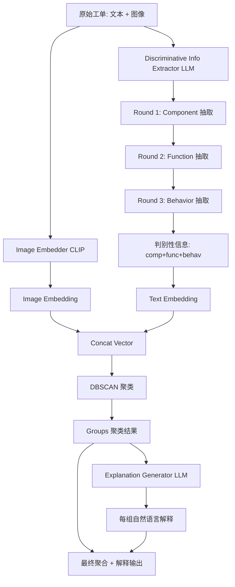
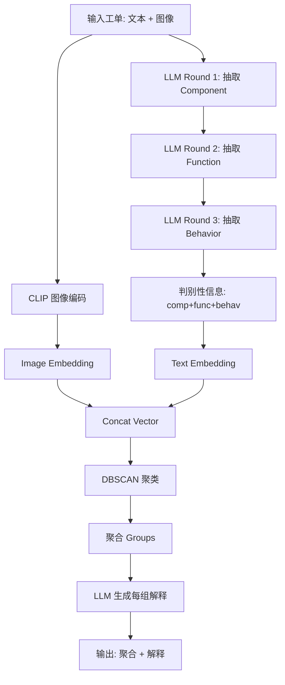

# TixFusion：基于 LLM 增强的低成本移动 OS 工单聚合（FSE Companion 2025）

> 作者：Yongqian Sun、Bowen Hao、Xiaotian Wang、Chenyu Zhao、Yongxin Zhao、Binpeng Shi、Shenglin Zhang、Qiao Ge、Wenhu Li、Hua Wei、Dan Pei
> 机构：南开大学、华为、海河实验室、TKL-SEHCI、清华
> 发表年份：2025
> 会议/期刊：FSE Companion 2025（Trondheim, Norway）
> 关联 PDF：同目录下 `3696630.3728547.pdf`

## 一、文档信息速览

| 字段 | 值 |
|---|---|
| 标题 | LLM-Augmented Ticket Aggregation for Low-cost Mobile OS Defect Resolution |
| 作者 | Yongqian Sun, Bowen Hao, Xiaotian Wang, Chenyu Zhao, Yongxin Zhao, Binpeng Shi, Shenglin Zhang, Qiao Ge, Wenhu Li, Hua Wei, Dan Pei |
| 机构 | 南开、华为、海河实验室、TKL-SEHCI、清华 |
| 发表年份 | 2025 |
| 会议/期刊 | FSE Companion 2025 |
| 分类 | 移动 OS 缺陷 / 工单聚合 / LLM / in-context learning |
| 核心问题 | 移动 OS 测试每天产生 3000+ 工单，重复工单浪费分诊工程师大量时间；现有聚合方法需大量标注数据 |
| 主要贡献 | 1) LLM 增强的工单聚合框架；2) 判别性信息抽取（in-context learning）；3) 图像 + 文本聚合 + 解释生成；4) 华为 3 个月部署，处理 20 万+ 工单，分诊提速 3.78× |

## 二、背景（Background）

移动 OS 复杂度高、迭代快，缺陷难以避免。Android"MediaProvider"漏洞曾影响约 15 亿用户，凸显移动 OS 缺陷的危害性。OS 厂商通过 beta 测试让用户试用新版本并报告缺陷，每个缺陷记录为工单。

华为等顶级 OS 厂商每天产生 3000+ 工单。分诊工程师需要把工单分配给正确的开发团队，每位经验丰富的分诊工程师每天仅能处理约 40 张工单。重复工单浪费大量时间——大量工单指向同一缺陷时本可一起分诊。

工单聚合（Ticket Aggregation）通过把同一缺陷的工单聚在一起，让分诊工程师批量处理，提升效率。但现有方法（监督学习）需要大量标注数据，标注连接关系比标注工单本身更费人力（论文估算需 1000+ 人天）。

论文在 1479 张华为工单上的实证研究显示：直接用 raw ticket + DBSCAN + 3 种 embedding 模型，F1 仅 0.205-0.219；用 LLM 提取判别性信息后 F1 提升到 0.718-0.735（+0.514）。这说明 LLM 能显著改善聚合质量，但需解决"低成本"和"可解释"两大问题。

TixFusion 由此提出：LLM 增强 + 图像 + 解释生成。

## 三、目的（Problems Solved）

- **痛点 1：现有聚合方法需大量标注。** 监督训练成本高。
- **痛点 2：无监督聚类不利用判别性信息。** 嵌入模型不熟悉领域知识。
- **痛点 3：缺乏可解释。** 工程师还要逐条审核聚合结果。
- **痛点 4：图像信息未利用。** 工单常附截图/视频，含丰富视觉信息。
- **解决方案**：
  1) 两步策略：LLM 抽取判别性信息 + 聚类；
  2) 判别性信息分三段：组件（component）、功能（function）、行为（behavior）；
  3) 图像 + 文本联合聚合 + 解释生成。

## 四、核心原理（Principles）

**总览**：TixFusion 是 LLM 增强的工单聚合框架，分三大模块：
- **Module 1：判别性信息抽取**（in-context learning）
- **Module 2：聚类**（基于判别性信息 + 图像 embedding）
- **Module 3：解释生成**（含图像说明）

**判别性信息三段**：

- **Component**：受影响的 OS 组件（如 Settings、Battery、Camera）。
- **Function**：该组件的功能（如屏幕亮度调节、应用耗电统计、相机对焦）。
- **Behavior**：缺陷的可观察行为（如屏幕闪烁、耗电异常、拍照模糊）。

Beta 用户通常不懂 OS 内部，**判别性信息不会直接出现在 raw ticket** 中，需要分诊工程师的专业知识。LLM 用 in-context learning（few-shot）抽取。

**多轮 in-context 抽取**：
- Round 1：抽取 component。
- Round 2：基于 component 抽取 function。
- Round 3：基于 function + 行为描述抽取 behavior。
- 分轮次注入领域知识（OS 模块文档），逐步精细化。

**聚类与解释**：

- 用 DBSCAN 对 (判别性信息, 图像 embedding) 拼接向量聚类。
- 对每个聚类，让 LLM 生成自然语言解释（包含 component、function、behavior + 图像描述），便于分诊工程师快速理解。

**关键数学**：

- **DBSCAN 距离**：
  $$d(t_i, t_j) = 1 - \cos(\text{disc}_i, \text{disc}_j)$$
  其中 $\text{disc}$ 是判别性信息编码。
- **聚类 F1**：
  $$F1 = 2 \cdot \frac{\text{Precision} \cdot \text{Recall}}{\text{Precision} + \text{Recall}}$$
  与 ground truth 比较。
- **Rand Index (RI)**：
  $$RI = \frac{TP + TN}{\binom{N}{2}}$$

**为什么这么做**：
- LLM 用 OS 文档做 in-context，能模拟分诊工程师的领域知识；
- 分轮抽取避免 LLM 单次输出遗漏；
- 图像 + 文本双模态，弥补单一文本的不足；
- 解释生成让分诊工程师减少 20%-30% 的逐条审核时间。

**与现有技术的差异**：
- vs. 传统监督聚合：TixFusion 用 LLM 抽取判别性信息 + 无监督聚类，标注成本几乎为零。
- vs. 单纯 DBSCAN：TixFusion 用 LLM 抽取领域知识，F1 提升 0.5+。
- vs. 端到端 LLM 分类：TixFusion 分步做（抽取+聚类+解释），可解释性更好。

## 五、算法详解（Algorithm）

### 1. 输入 / 输出
- **输入**：原始工单集合 $T = \{t_1, \dots, t_N\}$，含文本 + 图像。
- **输出**：聚合结果 $G = \{G_1, \dots, G_K\}$，每组带自然语言解释。

### 2. 核心模块
- **Discriminative Info Extractor (LLM, in-context)**：多轮抽取 component / function / behavior。
- **Image Embedder**：用 vision 模型（如 CLIP）把图像编码为向量。
- **Clusterer**：DBSCAN 对拼接向量聚类。
- **Explanation Generator (LLM)**：为每组生成自然语言解释。

### 3. 伪代码

```python
def tixfusion_aggregate(tickets, llm, os_docs, vision_model):
    discriminative = []
    for t in tickets:
        # 1) 多轮 in-context 抽取
        ctx = build_few_shot_prompt(os_docs, task='component')
        comp = llm.generate(prompt=ctx + t.text)
        ctx = build_few_shot_prompt(os_docs, task='function', given=comp)
        func = llm.generate(prompt=ctx + t.text)
        ctx = build_few_shot_prompt(os_docs, task='behavior', given=comp+func)
        behav = llm.generate(prompt=ctx + t.text)
        # 2) 图像编码
        img_emb = vision_model.encode(t.images)
        discriminative.append({
            'text_emb': llm.embed(f"{comp}; {func}; {behav}"),
            'img_emb': img_emb,
            'disc': {'comp': comp, 'func': func, 'behav': behav}
        })
    # 3) DBSCAN 聚类
    vectors = [concat(d['text_emb'], d['img_emb']) for d in discriminative]
    clusters = DBSCAN(eps=0.3, min_samples=2).fit(vectors)
    # 4) 解释生成
    groups = group_by_cluster(tickets, clusters)
    explanations = {}
    for cid, members in groups.items():
        expl = llm.generate(prompt=build_explanation_prompt(members, discriminative))
        explanations[cid] = expl
    return groups, explanations
```

### 4. 关键数学
- 见上文 "关键数学" 章节。

### 5. 复杂度分析
- 判别性信息抽取：每工单 3 次 LLM 调用 + 1 次图像编码。
- 聚类：DBSCAN $O(N^2)$（可用 HNSW 加速）。
- 解释：每组 1 次 LLM 调用。
- 总计：单工单 ~3-10 秒，整批 ~1-2 小时。

### 6. 训练与推理
- 无训练阶段（in-context learning）。
- 推理：批量 LLM 调用 + DBSCAN。

### 7. 示例
- 工单："屏幕亮度调到最低后还是刺眼，截图显示 Settings 页面。"
- 判别性抽取：component=Settings / function=屏幕亮度调节 / behavior=亮度调节失效。
- 聚类：与类似"亮度调节失效"工单聚合。
- 解释："该缺陷影响 Settings > Display > Brightness 调节功能，即使设置最低亮度仍刺眼，疑似亮度映射逻辑异常。"

## 六、系统架构图（Architecture）



## 七、流程图（Process Flow）



## 八、关键创新点（Key Innovations）

- **+ 判别性信息三段式抽取**：component / function / behavior，模拟分诊工程师的领域知识。
- **+ 多轮 in-context learning**：用 OS 文档做 few-shot，分轮次注入领域知识，逐步精细化。
- **+ 图像 + 文本双模态聚合**：CLIP 编码图像，拼接后聚类，弥补纯文本不足。
- **+ 解释生成**：每组聚合结果附自然语言解释 + 图像描述，减少分诊工程师审核时间 20%-30%。
- **+ 极低标注成本**：无监督为主，LLM in-context 学习，免去 1000+ 人天标注。

## 九、实验与结果（Experiments）

- **数据集**：华为生产工单 1479 张（含 ground truth 缺陷分组）。
- **Baseline**：传统 DBSCAN（不同 embedding 模型 acge、conan_v1、xiaobu_v2）、监督聚合方法、纯 LLM 分类。
- **主要指标**：Precision、Recall、F1、RI。
- **关键结果**：
  - 判别性信息 vs Raw：F1 平均提升 0.514（0.205-0.219 → 0.718-0.735）；
  - vs 监督方法：F1 提升 0.44；
  - 华为 3 个月部署：处理 20 万+ 工单，分诊工程师效率提升 3.78×。
- **消融实验**：
  - 去掉判别性抽取：F1 退化到 0.2+；
  - 去掉图像：聚类准确率下降 5-10%；
  - 去掉解释：分诊工程师审核时间增加 20-30%；
  - 多轮 → 单轮：抽取质量下降 10%。

## 十、应用场景（Use Cases）

- **移动 OS 厂商工单聚合**：华为、小米、OPPO、vivo 等。
- **SaaS 工单系统**：客户支持工单自动聚合。
- **GitHub Issue 聚合**：开源项目相似 issue 聚类。
- **客服系统**：相似投诉聚合，提升响应效率。
- **企业 ITSM**：内部 IT 工单管理。

## 十一、相关论文（Related Papers in this set）

- 同为运维/工单自动化的 **Triangle** 关注事件分诊，TixFusion 关注工单聚合；可作为"分诊前预处理"使用。
- **OpsEval、Eagle、LogEval** 提供 LLM 评测，TixFusion 的判别性抽取能力可在这些基准上评估。
- **FlowXpert** 关注故障排除工作流，TixFusion 可作为其上游"事件归类"。

## 十二、术语表（Glossary）

- **Ticket**：工单，记录 OS 缺陷的文档。
- **Triage**：分诊，把工单分配到正确团队。
- **Aggregation / Clustering**：聚合 / 聚类，把相似工单归为一组。
- **Discriminative Information**：判别性信息。
- **Component / Function / Behavior**：组件 / 功能 / 行为。
- **In-Context Learning (ICL)**：上下文学习，few-shot LLM 使用方式。
- **DBSCAN**：基于密度的聚类算法。
- **CLIP**：OpenAI 的视觉-语言预训练模型。
- **Rand Index (RI)**：聚类评估指标。
- **Beta Test**：正式发布前的用户测试。

## 十三、参考与延伸阅读

- 华为移动 OS 部门、TKL-SEHCI、海河实验室合作项目。
- 监督工单聚合：基于分类或聚类的方法。
- LLM 部署：OpenAI、Qwen、GLM、Baichuan 等。
- CLIP（Radford et al., 2021）：图像-文本预训练。
- DBSCAN（Ester et al., 1996）：经典密度聚类。
