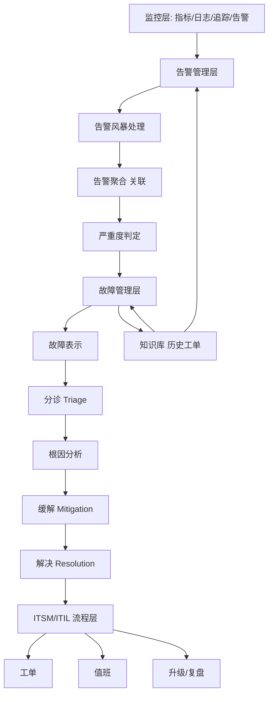
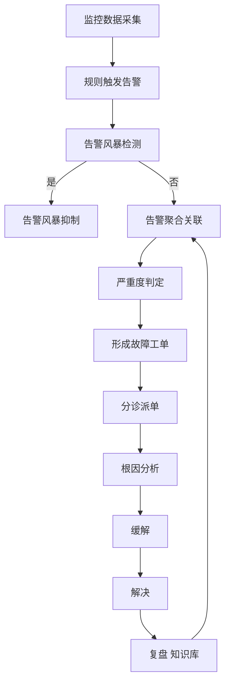

# A Survey on Intelligent Management of Alerts and Incidents in IT Services（Journal of Network and Computer Applications 2024）

> 作者：Qingyang Yu、Nengwen Zhao、Mingjie Li、Zeyan Li、Honglin Wang、Wenchi Zhang、Kaixin Sui、Dan Pei  
> 机构：清华大学计算机科学与技术系；Bizseer Technology  
> 发表年份：2024  
> 会议/期刊：Journal of Network and Computer Applications, Volume 224, 103842 (Elsevier)  
> 关联 PDF：同目录下 `A-survey-on-intelligent-management-of-alerts-and-incidents-in-IT-services.pdf`

## 一、文档信息速览

| 字段 | 值 |
|---|---|
| 标题 | A survey on intelligent management of alerts and incidents in IT services |
| 作者 | Qingyang Yu、Nengwen Zhao、Mingjie Li、Zeyan Li、Honglin Wang、Wenchi Zhang、Kaixin Sui、Dan Pei |
| 机构 | 清华大学计算机科学与技术系；Bizseer Technology |
| 发表年份 | 2024 |
| 会议/期刊 | Journal of Network and Computer Applications（Elsevier） |
| 分类 | 综述 / 告警管理 / 故障管理 |
| 核心问题 | 在大规模复杂 IT 服务系统中，如何统一地、自动地、智能地处理告警（alert）和故障（incident），覆盖告警风暴、告警分级、分诊、根因、缓解与解决 |
| 主要贡献 | (1) 给出统一 AIM 架构；(2) 总结告警管理（alert management）子任务与代表性方法；(3) 总结故障管理（incident management）子任务与代表性方法；(4) 综述数据集与开源工具；(5) 指出未来挑战与研究方向 |

## 二、背景（Background）

现代 IT 服务已经渗透到电商、社交、娱乐、办公、金融等几乎所有行业，Amazon 一次 Prime Day 故障曾造成约 1 亿美元的损失，可见 IT 服务的高可用性至关重要。随着虚拟化、云计算、大数据和微服务架构的发展，单一服务系统的组件数量和依赖复杂度急剧上升，监控数据呈指数级增长。论文给出一个典型 IT 服务系统的依赖图：上游的 Web/App 服务依赖中间件、数据库、容器编排平台，底层依赖物理资源。

在这种规模下，传统"基于规则的手工运维"已经不可持续，主要表现为：告警数量巨大（"alert storm"）；单条告警的语义难以独立解释，需要聚合；告警与故障的因果链路难以人工梳理；工程师无法在告警洪流中快速定位真正严重的故障；故障工单处理缺乏标准化辅助。学术界与工业界共同提出 AIOps（Artificial Intelligence for IT Operations）的概念，希望用 AI/ML 增强 IT 运维，但告警与故障管理领域的研究散落在不同会议、期刊，缺少统一框架。

本综述以清华 NetMan AIOps Lab 与 Bizseer 联合完成的工作为基础，系统梳理 2010-2023 年告警与故障管理（AIM）相关工作，给出统一架构并指出开放问题。

## 三、目的（Problems Solved）

- **缺乏统一 AIM 架构**：现有方法常将告警管理、故障分诊、根因定位、修复建议分开讨论，缺少端到端视图；论文提出"AIM 统一架构"覆盖告警生成→告警管理→故障管理。
- **告警风暴处理无章法**：综述"alert storm handling"相关方法，包括工业系统告警风暴、服务级告警风暴等场景。
- **告警严重度判定难**：综述"alert determination"——区分告警、识别严重告警。
- **故障表示与分诊（triage）**：综述"incident representation"、"incident triage"，把故障分派给负责团队。
- **根因分析**：综述依赖图构建、图遍历、机器学习/深度学习方法。
- **缓解与修复**：综述 incident mitigation、resolution recommendation、自动化 runbook。
- **挑战与未来方向**：综述数据稀缺、解释性、跨域迁移、标准化评估基准、AutoML for AIOps 等问题。

## 四、核心原理（Principles）

**系统总览**：论文以 Fig. 5 给出统一 AIM 架构，自下而上分为四层：

1. **监控层（Monitoring Layer）**：从物理机、容器、应用、中间件、数据库、网络等采集指标、日志、追踪、告警。
2. **告警管理层（Alert Management Layer）**：处理告警风暴、告警聚合、告警分级、严重度判定。
3. **故障管理层（Incident Management Layer）**：故障表示、分诊、根因分析、缓解、解决。
4. **ITSM / ITIL 流程层**：把上述环节嵌入到工单、值班、值班升级、复盘等流程。

**关键概念**：

- **告警（Alert）**：监控数据违反预定义规则后生成的通知（论文 Table 1 列出系统/网络/安全/业务/数据库等类型）。
- **故障（Incident）**：一组相关告警 + 用户投诉 + 故障处置的载体。
- **AIOps 范式**：用 AI/ML 增强告警与故障管理。
- **告警风暴（Alert Storm）**：短时间内大量告警淹没值班工程师。
- **告警聚合 / 关联（Alert Correlation）**：把相关告警聚合为一个语义单元。
- **依赖图（Dependency Graph）**：服务/中间件/资源之间的依赖关系图，用于根因推断。
- **严重度判定（Severity Classification）**：把告警或故障分为不同严重等级。
- **分诊（Triage）**：把故障分配到正确处理团队。
- **故障缓解（Mitigation）**：在根因定位前快速止血。
- **故障解决（Resolution）**：定位并消除根因。

**数学原理**：综述类论文涉及多种方法的数学公式，统一形式较少。代表性方法包括：

- **告警严重度分类**：

$$
\hat{y} = \arg\max_c P(c | x), \quad P(c|x) = \text{softmax}(\text{MLP}(E(x)))
$$

其中 $E(x)$ 是文本/特征编码，$c$ 是严重度类别。

- **告警关联（频繁模式挖掘）**：

$$
\text{FPM}(A) = \{ I \subseteq A \mid \text{supp}(I) \ge \sigma, \text{conf}(I \Rightarrow a) \ge \delta \}
$$

其中 $A$ 是告警集合，$\sigma$、$\delta$ 是支持度与置信度阈值。

- **根因定位（图遍历）**：

$$
\text{Rank}(v) = (1-d) \cdot p_v + d \cdot \sum_{u \in N^-(v)} \frac{w(u,v)}{\sum_{v' \in N^+(u)} w(u,v')} \text{Rank}(u)
$$

类 PageRank 在依赖图上做根因排序。

- **告警时序预测**：

$$
\hat{x}_{t+1} = f_\theta(x_{t-k:t}) + \epsilon
$$

$L_\theta = \sum_t \|x_t - \hat{x}_t\|^2$，残差超阈值即告警。

**与现有技术的差异**：以往综述多聚焦"异常检测"或"根因分析"单一子任务，本文首次在 AIM 全栈视角下做统一综述，明确告警管理、故障管理、流程层的边界与联系，填补综述空白。

## 五、算法详解（Algorithm）

1. **输入 / 输出**：
   - 输入：监控数据、告警流、故障工单、ITSM 流程数据。
   - 输出：聚合告警、严重度判定、分诊结果、根因定位、缓解与修复建议。

2. **核心模块**：
   - **告警聚合**：基于规则、聚类（DBSCAN、层次聚类）、频繁模式挖掘（Apriori、FP-Growth）、图模型。
   - **告警风暴处理**：FPC（False Positive Compression）、scaling、smoothing、sampling。
   - **严重度判定**：基于特征（alert type、metric threshold deviation、service criticality）的分类模型（SVM、随机森林、深度神经网络）。
   - **故障表示**：用结构化字段、嵌入、BERT 等生成向量表示。
   - **分诊**：基于内容、团队历史分配记录、SVM、贝叶斯、CNN 等模型。
   - **根因分析**：依赖图 + 随机游走 / GCN / GNN / DFS / Bayesian Network。
   - **缓解**：基于历史工单的检索式推荐、深度匹配模型。
   - **解决**：自动化 runbook 触发、人工-AI 协同决策。

3. **伪代码**（告警聚合的代表流程）：

```python
def alert_correlation(alerts, threshold_sigma=0.5):
    # 1. extract alert features: type, service, timestamp
    features = [(a.type, a.service, a.timestamp) for a in alerts]
    # 2. cluster alerts within time window using DBSCAN
    clusters = DBSCAN(eps=0.5, min_samples=3).fit(features)
    # 3. for each cluster, find frequent patterns
    for cluster_id in set(clusters.labels_):
        if cluster_id < 0: continue
        cluster_alerts = [a for a, c in zip(alerts, clusters.labels_) if c == cluster_id]
        patterns = fp_growth(cluster_alerts, min_support=0.2, min_conf=0.7)
        # 4. representative alert = highest score pattern
        rep = select_representative(patterns)
    return rep
```

4. **关键数学**：见 §四。

5. **复杂度分析**：
   - DBSCAN 聚类：$O(n \log n)$；
   - 频繁模式挖掘：$O(2^k)$，$k$ 为告警类型数；
   - PageRank：$O(T(|V| + |E|))$；
   - GCN：与节点度、层数相关。
   综述强调工业级 AIOps 系统的复杂度受数据规模与在线延迟约束。

6. **训练与推理**：
   - 训练：监督（严重度判定、分诊）、无监督（聚类、表示）、自监督（BERT 嵌入）；
   - 推理：在线聚合 → 严重度 → 分诊 → 根因 → 缓解。

7. **示例**：监控产生 1000 条告警；DBSCAN 聚类为 12 个 cluster；FP-Growth 提取每 cluster 高频模式；严重度模型输出 Level 1×2, Level 2×5, Level 3×5；分诊模型把 Level 1 派给"数据库团队"、Level 2 派给"网络团队"；根因分析在依赖图上做 PageRank，定位到 DB 节点；缓解模型检索类似历史工单，建议"重启 MySQL 主库"。

## 六、系统架构图（Architecture）



## 七、流程图（Process Flow）



## 八、关键创新点（Key Innovations）

- **+ 统一 AIM 架构**：首次把告警管理与故障管理合并在同一架构中梳理，明确定义 8 个子任务（alert storm handling、alert determination、incident representation、triage、root cause analysis、mitigation、resolution、empirical study）。
- **+ 系统化分类法**：把每类工作分为基于规则、机器学习、深度学习、图模型等子类，提供"工业方案 vs 学术方案"的对比视角。
- **+ 跨论文统一评测视角**：在数据源、公开数据集、评估指标（precision/recall/F1/MTTR）上做横向比较。
- **+ 明确指出研究空白**：数据稀缺、跨域迁移、解释性、AutoML for AIOps 等是未来方向。
- **+ 工业落地视角**：强调 AIOps 系统的可部署性、可维护性、工程师接受度。

## 九、实验与结果（Experiments）

- **数据集**：综述类论文不进行新实验，但系统整理了公开数据集（HDFS、OpenStack、BGL、Thunderbird、Yahoo、SMD、MSL、SMAP 等）与工业数据集（论文团队自有的微服务、银行、运营商数据集）。
- **Baseline**：不直接对比方法，而是把同类工作按发表年份与所解决问题做表格化对比。
- **主要指标**：综述提及常用指标——precision、recall、F1、AUC、MTTR、误报率、漏报率、人工参与时间。
- **关键结果数字**：论文以图表列出各方法在公开数据集上的表现，并指出多数工作仍依赖私有数据、缺乏统一基准。
- **消融实验**：综述类论文不进行；论文以"方法特性对比表"代替，强调不同方法在告警/故障子任务上的差异。
- **效率分析**：综述指出工业级 AIM 系统需要秒级到分钟级响应，深度学习方法在大数据量下面临推理延迟问题。
- **评估方法分析**：提出未来需要标准化评估基准（类似 TSC-TADBench）的方向。

## 十、应用场景（Use Cases）

- **大型云服务商**：阿里云、AWS、Azure 的告警与故障管理系统。
- **金融行业**：银行、证券的实时风控与故障管理。
- **电信运营商**：网络告警风暴处理与故障分诊。
- **电商平台**：双 11、Prime Day 等大促期间的告警与故障协同。
- **企业内部 IT 运维**：传统企业上云后的 AIOps 平台建设。

## 十一、相关论文（Related Papers in this set）

- `Empirical_Analysis`（多变量时序异常检测方法实证分析）
- `AlertRCA_CCGRID2024_CameraReady`（告警根因分析）
- `Chain-of-Event_Interpretable-Root-Cause-Analysis-for-MicroservicesFSE24-Camera-Ready`（事件级根因）
- `MonitorAssistant_CameraReady-v1.5_submitted`（LLM 监控助手）
- `OutSpot`（大规模 KPI 异常检测）
- `Final_AutoKAD_ISSRE23_Camera-Ready-v2.3`（自动 KPI 异常检测模型选择）
- `TSC23-DiagFusion`（多模态故障诊断）
- `LogKG`（日志知识图谱）

## 十二、术语表（Glossary）

- **AIM（Alert and Incident Management）**：告警与故障管理。
- **ITSM（IT Service Management）**：IT 服务管理。
- **ITIL**：IT 基础设施库。
- **AIOps**：AI for IT Operations。
- **Alert Storm**：告警风暴。
- **Alert Correlation**：告警关联。
- **Severity Classification**：严重度分类。
- **Triage**：分诊。
- **Root Cause Analysis (RCA)**：根因分析。
- **Mitigation**：缓解。
- **Resolution**：解决。
- **Runbook**：运维操作手册。
- **MTTR（Mean Time To Repair）**：平均修复时间。
- **Dependency Graph**：依赖图。

## 十三、参考与延伸阅读

- Paper: AIOps: A Survey（Notaro et al., 2020）——AIOps 综述。
- Paper: A Survey of Log Mining Techniques（He et al., 2016）——日志挖掘。
- Paper: A Survey on Root Cause Analysis (RCA)——RCA 综述。
- Paper: ITIL Foundation Manual。
- 公开数据集：HDFS、OpenStack、BGL、Thunderbird、Yahoo S5、SMAP/MSL、SMD。
- 开源工具：Prometheus、Grafana、ELK、ElasticSearch、Splunk、Moogsoft。
- 相关论文：`Empirical_Analysis`、`AlertRCA`、`Chain-of-Event`、`MonitorAssistant`、`OutSpot`、`Final_AutoKAD_ISSRE23_Camera-Ready-v2.3`、`TSC23-DiagFusion`、`LogKG`。
