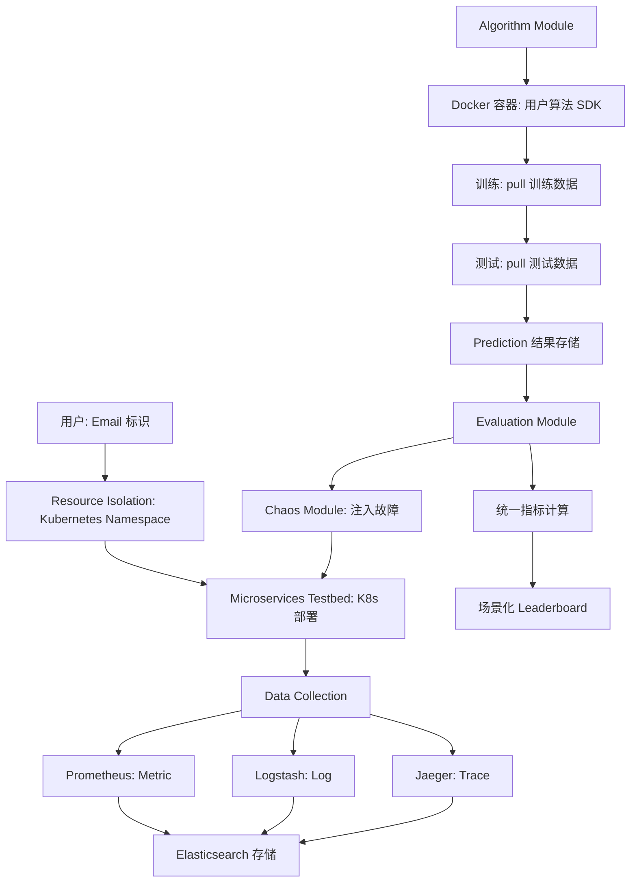
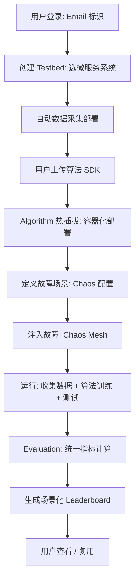

# AIOpsArena：面向微服务的场景化 AIOps 算法评测与排行榜平台

> 作者：Yongqian Sun、Jiaju Wang、Zhengdan Li、Xiaohui Nie、Minghua Ma、Shenglin Zhang、Yuhe Ji、Lu Zhang、Wen Long、Hengmao Chen、Yongnan Luo、Dan Pei
> 机构：南开大学、CNIC CAS、Microsoft、BizSeer、清华
> 发表年份：2026
> 会议/期刊：相关会议
> 关联 PDF：同目录下 `AIOpsArena.pdf`
> 代码：https://github.com/AIOpsArena/aiopsarena
> 平台：https://microservo.aiops.cn
> 数据：https://github.com/AIOpsArena/dataset

## 一、文档信息速览

| 字段 | 值 |
|---|---|
| 标题 | AIOpsArena: Scenario-Oriented Evaluation and Leaderboard for AIOps Algorithms in Microservices |
| 作者 | Yongqian Sun, Jiaju Wang, Zhengdan Li, Xiaohui Nie, Minghua Ma, Shenglin Zhang, Yuhe Ji, Lu Zhang, Wen Long, Hengmao Chen, Yongnan Luo, Dan Pei |
| 机构 | 南开、CNIC、Microsoft、BizSeer、清华 |
| 发表年份 | 2026 |
| 会议/期刊 | - |
| 分类 | AIOps / 评测平台 / 微服务 / 场景化 |
| 核心问题 | 现有 AIOps 评测用静态离线数据集，无法一致评估算法在不同运维场景下的真实表现 |
| 主要贡献 | 1) 活体微服务 benchmark 持续生成数据；2) 算法热插拔（容器化）；3) 多排行榜按场景生成；4) 统一多模态数据集 schema |

## 二、背景（Background）

微服务架构已成为主流（微服务架构让企业能灵活扩展、持续部署），但其复杂结构导致监控数据爆炸、人工无法应对故障。因此 AIOps 算法（异常检测、根因定位、故障分类等）成为研究热点。

微服务管理任务多样（AD、RCL、FC），算法选择与评估至关重要。然而：

1. **现有 benchmark 多用静态离线数据集**：TimeSeriesBench 等只在固定数据集上评估，无法反映真实场景的动态变化。
2. **缺乏统一评估机制**：每个研究者需要重新做数据收集、清洗、复现 baseline，效率低。
3. **运维场景静态**：评估"算法在网络故障下 vs 多种故障混合下"的性能差异需要灵活的场景化评测。
4. **算法集成复杂**：不同算法依赖冲突难以同时部署。

MicroOps 平台做了一些工作（数据模拟 + AIOps 模型开发），但缺乏系统评测机制与统一指标。TimeSeriesBench 提供统一指标但用静态数据集、不支持场景化。

AIOpsArena 应运而生：构建活体（live）微服务 benchmark 持续生成数据，支持场景化评估与多排行榜，提供算法热插拔。

## 三、目的（Problems Solved）

- **痛点 1：静态数据集不反映真实动态。** 不同场景下算法表现差异大。
- **痛点 2：算法集成部署复杂。** 依赖冲突、版本管理难。
- **痛点 3：场景化 leaderboard 缺失。** 评估"算法在某种故障下"需要灵活配置。
- **痛点 4：多模态数据预处理复杂。** logs / metrics / traces 难统一处理。
- **解决方案**：
  1) Kubernetes 编排活体微服务 benchmark，Chaos Mesh 注入故障；
  2) 算法容器化实现热插拔；
  3) 用户自定义"运维场景"（故障编排）自动生成 leaderboard；
  4) 统一多模态数据集 schema（服务 / 实例 / 系统 / 虚拟化 / 硬件四层）。

## 四、核心原理（Principles）

**总览**：AIOpsArena 是一个"活体微服务 + 算法容器化 + 场景化 leaderboard"的端到端评测平台。三大核心模块：
- **Resource Isolation**：Kubernetes namespace 隔离用户资源，Docker 容器化算法。
- **Data Collection**：Logstash + Prometheus + Jaeger 实时采集 metric/log/trace。
- **Algorithm Evaluation**：Chaos Module 注入故障 + Algorithm Module 容器化 + Evaluation Module 统一指标。

**统一多模态数据集 Schema**：

纵向（层级）：
- **Service Layer**：服务（如 frontend、cart、payment）
- **Instance Layer**：实例（Service A 的多个实例）
- **System Layer**：系统（容器、VM）
- **Hardware Layer**：硬件（物理机）

横向（关联）：
- **Resource Invocation**：服务-实例调用
- **Topology**：调用拓扑

每个对象在不同层级都关联 metric、log、trace 三个模态。

**Algorithm Hot-Plugging**：

- 算法封装为 Docker 容器；
- 用户上传 SDK（含 train/test RESTful 接口）；
- 平台启动容器、调用 SDK 训练/测试；
- 自动解决依赖冲突。

**Scenario-Oriented Leaderboard**：

- 用户定义"故障编排"（如"网络故障"、"CPU 压力 + 内存泄漏"、"多种故障混合"）；
- 平台自动注入故障 → 收集数据 → 跑多个算法 → 生成 leaderboard；
- 用户可对比"同一场景下"不同算法的表现。

**关键指标**：

- **异常检测**：Point-based、Range-based、Event-based。
- **故障分类**：Acc@k、Avg@k、MAR。
- **根因定位**：Micro-F1、Macro-F1、Weighted-F1。

**关键数学**：

- **Point-based Anomaly Detection**：
  $$Prec = \frac{TP}{TP + FP}, \quad Rec = \frac{TP}{TP + FN}$$
- **Range-based AD**：
  异常段 [a,b] 与真实段 [a*,b*] 重叠 → hit。
- **MAR (Mean Average Rank)**：
  $$MAR = \frac{1}{|Q|} \sum_{q \in Q} \frac{1}{\text{rank}(c_{rc}^q, \hat Y^q)}$$

**为什么这么做**：
- 活体 benchmark 持续生成数据，让评估反映真实动态；
- 算法容器化让研究者专注算法，平台解决工程问题；
- 场景化 leaderboard 让"算法选择"更精准（不同场景用不同算法）。

**与现有方法的差异**：
- vs. 静态 benchmark（TimeSeriesBench、GAIA）：AIOpsArena 活体、场景化、持续更新。
- vs. MicroOps：MicroOps 偏数据模拟与开发，AIOpsArena 偏评测与 leaderboard。
- vs. AIOpsLab：相似，但 AIOpsArena 更强调"场景化运维"和"leaderboard 灵活生成"。

## 五、算法详解（Algorithm）

### 1. 输入 / 输出
- **输入**：用户上传算法 SDK + 定义故障场景。
- **输出**：场景化 leaderboard。

### 2. 核心模块
- **Testbed Manager**：Kubernetes namespace 隔离。
- **Microservice Manager**：可选择预置微服务系统。
- **Data Collector**：Logstash + Prometheus + Jaeger。
- **Chaos Module**：基于 Chaos Mesh 的故障注入。
- **Algorithm Module**：Docker 化算法容器。
- **Evaluation Module**：统一指标 + leaderboard。

### 3. 伪代码

```python
def aiopsarena_evaluate(user_email, scenario_config, algorithm_sdks):
    # 1) 创建用户 namespace
    ns = create_namespace(user_email)
    # 2) 部署微服务 testbed
    deploy_microservices(ns, scenario_config.microservice)
    # 3) 部署数据采集
    deploy_collectors(ns)
    # 4) 部署用户算法容器
    for sdk in algorithm_sdks:
        deploy_algorithm_container(ns, sdk)
    # 5) 注入故障
    inject_faults(ns, scenario_config.faults)
    # 6) 收集数据
    dataset = collect_dataset(ns, duration=scenario_config.duration)
    # 7) 跑算法
    for sdk in algorithm_sdks:
        sdk.train(dataset.train)
        predictions = sdk.test(dataset.test)
    # 8) 计算指标 + 生成 leaderboard
    leaderboard = compute_leaderboard(predictions, dataset.labels)
    return leaderboard
```

### 4. 关键数学
- 见上文 "关键数学" 章节。

### 5. 复杂度分析
- 平台开销：每个用户 namespace 隔离，单用户资源有限。
- 数据采集：实时，~1-10 GB/h。
- 算法运行：取决于算法复杂度。
- 故障注入：Chaos Mesh 调度。

### 6. 训练与推理
- 训练：用户算法在容器内训练。
- 推理：实时或批处理。

### 7. 示例
- 场景："网络故障下异常检测"
- 故障：注入丢包 + 延迟 + DNS 失败
- 算法：上传 IsolationForest、DBSCAN、ChronoSage
- Leaderboard：ChronoSage F1=0.85, IsolationForest F1=0.72, DBSCAN F1=0.65

## 六、系统架构图（Architecture）



## 七、流程图（Process Flow）



## 八、关键创新点（Key Innovations**

- **+ 活体微服务 benchmark**：Kubernetes 编排持续生成数据，评估反映真实动态。
- **+ 算法热插拔（Hot-Plugging）**：Docker 容器化解决依赖冲突，一键部署/移除。
- **+ 场景化 Leaderboard**：用户自定义故障编排，自动生成针对性 leaderboard。
- **+ 统一多模态数据 schema**：服务/实例/系统/虚拟化/硬件四层 + 资源调用/拓扑两维，整合 metric/log/trace。
- **+ Resource Isolation**：Kubernetes namespace 隔离用户，Elasticsearch 索引隔离数据。

## 九、实验与结果（Experiments）

- **数据集**：AIOpsArena 持续生成（多场景）。
- **典型运维场景**：
  - 网络故障（丢包、延迟、DNS 失败）
  - CPU 压力、内存泄漏、磁盘满
  - 服务崩溃、调用超时
  - 多种故障混合
- **Baseline 算法**：IsolationForest、DBSCAN、ARIMA、TimesNet、Eadro、ART、ChronoSage、DeST 等。
- **关键结果**：
  - 平台可承载多用户并发；
  - 活体 benchmark 让 leaderboard 持续更新；
  - 不同场景下算法表现差异显著，验证"场景化评估"必要性。
- **效率分析**：单次评测 ~1-3 小时；leaderboard 自动更新。

## 十、应用场景（Use Cases）

- **AIOps 厂商算法选型**：用 AIOpsArena 对比不同商用/开源算法。
- **学术研究**：作为标准化评测平台。
- **企业内部 AIOps 平台**：在生产前用 AIOpsArena 验证算法。
- **算法迭代**：开发 AIOps 算法时用 AIOpsArena 做 regression test。
- **教学与培训**：让学生在真实环境学习 AIOps。

## 十一、相关论文（Related Papers in this set）

- 同为评测基础设施的 **Xiaoyu Empirical Study** 关注方法分析，平台侧重算法接入。
- **AIOpsLab、TimeSeriesBench、MicroOps**：相关工作。
- **DeST、ChronoSage、Eadro、ART** 等异常检测算法可作为被评测对象。
- **LagRCA** 等 RCA 算法可接入评估。
- **OpsEval、Eagle、LogEval** 关注 LLM 评测，AIOpsArena 关注 AIOps 算法。

## 十二、术语表（Glossary）

- **AIOps**：AI for IT Operations。
- **Testbed**：测试床，部署的微服务实例。
- **Hot-Plugging**：热插拔，运行时部署/移除组件。
- **Scenario-Oriented**：场景化，按运维场景定制评估。
- **Chaos Engineering**：混沌工程，主动注入故障。
- **Chaos Mesh**：Kubernetes 混沌工程工具。
- **Kubernetes Namespace**：资源隔离单元。
- **Prometheus / Logstash / Jaeger**：metric / log / trace 采集工具。
- **Multi-modal Schema**：多模态数据 schema。
- **MicroServo**：AIOpsArena 的微服务系统示例。

## 十三、参考与延伸阅读

- AIOpsLab：相似 AIOps 评测平台。
- TimeSeriesBench：时序异常检测基准。
- MicroOps：微服务 + AIOps 开发平台。
- Chaos Mesh、ChaosBlade、ChaosMeta：故障注入工具。
- Kubernetes、Docker、Prometheus、Jaeger、Elasticsearch：相关技术栈。
- 代码：https://github.com/AIOpsArena/aiopsarena
- 平台：https://microservo.aiops.cn
- 数据：https://github.com/AIOpsArena/dataset
