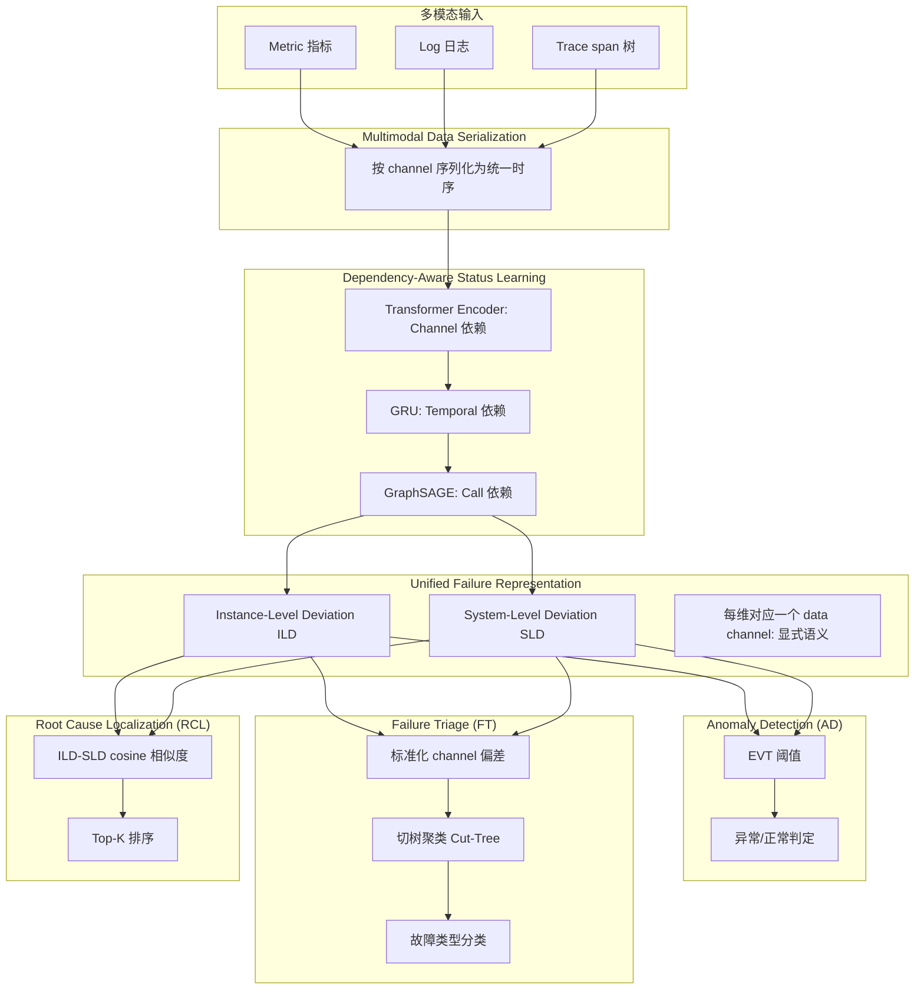
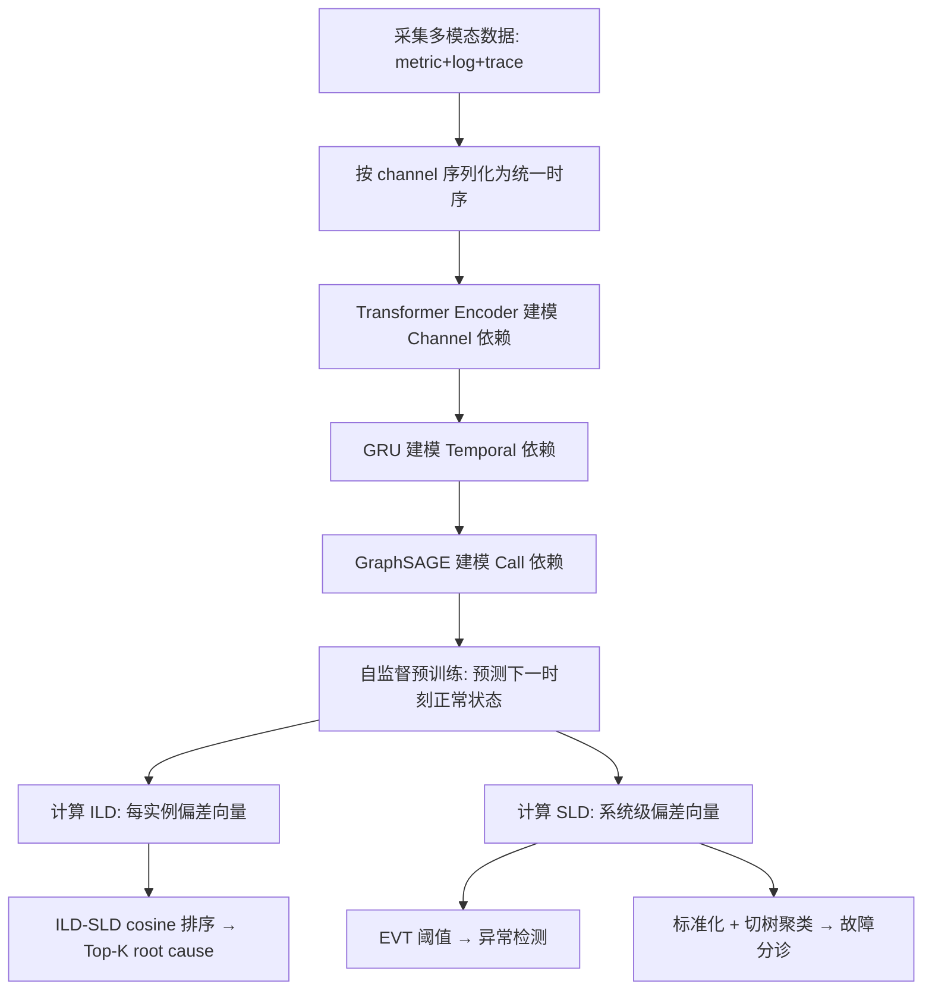

# ART: A Unified Unsupervised Framework for Incident Management in Microservice Systems（ASE 2024）

> 作者：Yongqian Sun, Binpeng Shi, Mingyu Mao, Minghua Ma, Sibo Xia, Shenglin Zhang, Dan Pei  
> 机构：南开大学（TKL-SEHCI、HL-IT）、Microsoft Redmond、清华大学（BNRist）  
> 发表年份：2024  
> 会议/期刊：ASE 2024（39th IEEE/ACM International Conference on Automated Software Engineering）  
> 关联 PDF：同目录下 `ASE24-ART.pdf`  
> 代码：https://github.com/bbyldebb/ART

## 一、文档信息速览

| 字段 | 值 |
|---|---|
| 标题 | ART: A Unified Unsupervised Framework for Incident Management in Microservice Systems |
| 作者 | Yongqian Sun, Binpeng Shi, Mingyu Mao, Minghua Ma, Sibo Xia, Shenglin Zhang, Dan Pei |
| 机构 | 南开大学、Microsoft Redmond、清华大学 |
| 发表年份 | 2024 |
| 会议/期刊 | ASE 2024 |
| 分类 | 微服务 / 事故管理 / 多任务 / 自监督学习 / 异常检测 + 故障分诊 + 根因定位 |
| 核心问题 | 现有事故管理方法为 AD/FT/RCL 三个子任务单独建模，重复工作多、TTM 长；监督方法依赖大量标注；缺乏端到端统一无监督框架。 |
| 主要贡献 | 1) 第一个端到端无监督事故管理框架 ART，集成 AD + FT + RCL；2) 第一次 empirical study 证明"异常偏差"是三任务共享知识；3) Dependency-Aware Status Learning：用 Transformer Encoder + GRU + GraphSAGE 依次建模 channel / temporal / call 三种依赖；4) Unified Failure Representation：把抽象特征绑定到具体数据 channel，提供可解释性；5) 在 2 个微服务系统上 AD 提升 5.65%–60.8%、FT 提升 13.2%–95.7%、RCL 提升 13.3%–205%。 |

## 二、背景（Background）

微服务系统已成为现代互联网服务的核心架构，但其动态复杂性让事故（incidents，如计划外故障、中断）不可避免。2023 年一年里，Microsoft、Google、Alibaba Cloud 等大型互联网公司的微服务系统都经历过大事故。AWS 一项 24 小时的 mission-critical 微服务事故可能造成 34 亿美元直接收入损失。

一个典型的事故生命周期（Fig.1）包含四阶段：
1. **Detection（检测）**：异常系统行为触发告警。
2. **Triage（分诊）**：把事故派给对应工程团队。
3. **Diagnosis（诊断）**：on-call 工程师多轮调查定位 root cause。
4. **Mitigation（缓解）**：采取措施恢复系统健康。

每个阶段都耗时耗力。学术界和工业界对前三阶段（AD、FT、RCL）做了大量自动化研究，但现有方法分两类问题：
- **单任务方法**：每个任务单独建模 → 重复的特征提取、模型训练、数据组织 → TTM 长、效率低。
- **多任务方法**：少数尝试但仍需要大量标注（监督）或手工规则（如因果图），工程负担重。

自监督学习（SSL）从无标注数据提取通用表示，是理想的解决方向。但直接套用 SSL 到事故管理面临三大挑战：
1. **多模态异构 + 复杂依赖**：metrics / logs / traces 三模态有 channel（数据通道）依赖、temporal（时序）依赖、call（实例间调用）依赖，需要模型全面捕捉。
2. **SSL 表示可解释性差**：深度学习抽象特征无法直接映射回原始数据 channel，运维人员难理解。
3. **下游任务标注稀缺**：SSL 预训练后通常需要监督微调，但 AD/FT/RCL 标注成本高。

ART 通过"异常偏差（Anomalous Deviation）"作为三任务共享知识，再用统一 failure representation 把抽象特征绑定到具体 channel，最后用 EVT 阈值 / 切树聚类 / 相关性分析做无监督多任务解决。

## 三、目的（Purpose / Problems Solved）

论文显式给出三大挑战对应方案：

- **挑战 1：微服务系统状态表示学习复杂。** 痛点：channel/temporal/call 三种依赖难全面建模。解决方案：**Dependency-Aware Status Learning**——依次用 Transformer Encoder（channel）、GRU（temporal）、GraphSAGE（call）建模，并强调建模顺序的重要性（论文 §5.3 验证）。
- **挑战 2：SSL 表示缺乏可解释性。** 痛点：抽象特征难映射回原始 channel。解决方案：**Unified Failure Representation**——instance-level / system-level deviations 向量每一维对应一个 channel，提供显式语义信息。
- **挑战 3：下游任务标注稀缺。** 痛点：AD/FT/RCL 标注成本高。解决方案：**无监督解决方案**——AD 用 EVT（极值理论）阈值；FT 用切树聚类（cut-tree based clustering）；RCL 用 SLD-ILD cosine 相关性分析。

## 四、核心原理（Principles）

ART 框架（Fig.3）三大模块：

### 1) Dependency-Aware Status Learning（4.2）
按"浅层到抽象"顺序建模三种依赖：
- **Channel 依赖（CHA）**：用 **Transformer Encoder** 捕捉多模态数据通道之间的关联（如 disk IO 减少 ↔ disk IO time 上升 ↔ trace 响应时间延长）。
- **Temporal 依赖（TEM）**：用 **GRU** 捕捉时序动态（如 cpu_usage_rate 波动、disk_usage_rate 平滑）。
- **Call 依赖（CAL）**：用 **GraphSAGE** 建模实例间调用关系。

模型学"系统下一时刻的正常状态"，作为偏差计算的基础。

### 2) Unified Failure Representation Acquisition（4.3）
- **Instance-Level Deviation (ILD)**：每个实例 $i$ 的 $k$ 维偏差向量，$d_j^{(i)}$ = 实例 $i$ 在第 $j$ 个 channel 的偏差。
- **System-Level Deviation (SLD)**：系统级 $k$ 维偏差向量，聚合所有实例。
- 每一维对应一个具体 data channel，**显式语义**绑定。

empirical study 揭示：
- AD：$\|SLD\|_1$ 在 failure hour 比 normal hour 平均高 22%、中位高 17%，85% 的 failure hour $\ge$ normal hour。
- FT：不同 failure type 对应不同 top-5 channels（如 Container Network → duration、connection_error）。
- RCL：root cause 实例的 ILD 与 SLD cosine 相似度 0.71+，远高于 non-root cause 的 0.49。

### 3) Unsupervised Solutions for Diagnostic Tasks（4.4）
- **AD**：基于 SLD 用 EVT（极值理论）设阈值，超过即报异常。
- **FT**：基于标准化 channel 偏差做切树聚类（cut-tree based），自动归类。
- **RCL**：基于 ILD-SLD cosine 相似度排序，相似度最高的实例为 root cause。

**与现有方法差异**：
- vs **单任务方法**：ART 一站式解决 AD + FT + RCL，避免重复工作。
- vs **多任务监督方法**：ART 完全无监督，破解标注成本难题。
- vs **Eadro / DiagFusion / CloudRCA / Déjàvu**：ART 系统性建模三种依赖 + 显式 channel 语义，可解释性更强。
- vs **基于因果图的方法**：ART 不需要手工构造因果图。

数学核心：

偏差计算（用前一时序作为"正常期望"的近似）：

$$\text{ILD}^{(i)}_t = X^{(i)}_t - \hat{X}^{(i)}_t$$

其中 $\hat{X}^{(i)}_t$ 是模型预测的"正常"下一时刻值。

RCL 排序：

$$\text{score}^{(i)} = \cos(\text{ILD}^{(i)}, \text{SLD})$$

$\text{score}^{(i)}$ 越大越可能是 root cause。

AD 阈值（EVT）：

$$\tau = \mathrm{EVT}(\|SLD_t\|_1)$$

FT 聚类（cut-tree based on standardized channel deviation）：

$$\mathrm{cluster}(X) = \mathrm{CutTree}(\text{standardize}(SLD_t))$$

## 五、算法详解（Algorithm）

### 1. 输入 / 输出

- **输入**：微服务系统的 metrics、logs、traces 三模态数据。
- **输出**：
  - AD：异常/正常判定。
  - FT：故障类型分类。
  - RCL：root cause 实例 top-K 排序。

### 2. 核心模块

- **Multimodal Data Serialization**：把三模态数据按 channel 序列化为统一时序。
- **Dependency-Aware Status Learning**：Transformer (channel) + GRU (temporal) + GraphSAGE (call)。
- **ILD/SLD Computation**：instance-level / system-level 偏差向量。
- **Unsupervised Solutions**：EVT 阈值（AD）、切树聚类（FT）、cosine 排序（RCL）。

### 3. 伪代码

```python
# === 1) Multimodal Data Serialization ===
def serialize_multimodal(metrics, logs, traces):
    channels = []
    for m in metrics:
        channels.append(('metric', m.name, m.values))
    for l in logs:
        # Drain parse → template frequency per window
        channels.append(('log', template_name, freq_seq))
    for t in traces:
        # span duration per window
        channels.append(('trace', 'duration', duration_seq))
    return channels  # List of (modality, channel_name, time_series)

# === 2) Dependency-Aware Status Learning ===
def learn_status(channels, call_graph):
    # Channel dependency
    channel_attn = TransformerEncoder(channels)  # CHA
    # Temporal dependency
    temporal_emb = GRU(channel_attn)  # TEM
    # Call dependency
    graph_emb = GraphSAGE(temporal_emb, call_graph)  # CAL
    return graph_emb  # 每个实例的预测下一时刻状态

# === 3) ILD & SLD ===
def compute_deviations(predicted, actual):
    ILD = actual - predicted  # 每实例偏差
    SLD = ILD.mean(dim=0)    # 系统级偏差 (聚合所有实例)
    return ILD, SLD

# === 4) Unsupervised Solutions ===
def anomaly_detection(sld_seq, threshold_quantile=0.99):
    norms = [||sld||_1 for sld in sld_seq]
    threshold = EVT(norms)  # 极值理论
    return [norm > threshold for norm in norms]

def failure_triage(ild_seq, std_baseline):
    # 标准化 channel 偏差
    std_ild = (ild_seq - std_baseline.mean) / std_baseline.std
    # 切树聚类
    clusters = CutTreeClustering().fit(std_ild)
    return clusters

def root_cause_localization(ild, sld):
    scores = [cosine(ild_i, sld) for ild_i in ild]
    return argsort(scores)[::-1]  # top-K 候选
```

### 4. 关键数学

偏差定义：

$$\text{ILD}^{(i)}_t = X^{(i)}_t - \hat{X}^{(i)}_t$$

L1 范数：

$$\|SLD_t\|_1 = \sum_{j=1}^{k} |d_j|$$

RCL cosine 相似度：

$$\text{score}^{(i)} = \frac{\text{ILD}^{(i)} \cdot SLD}{\|\text{ILD}^{(i)}\| \cdot \|SLD\|}$$

标准化（用于 FT）：

$$z_j = \frac{d_j - \mu_j^{\text{normal}}}{\sigma_j^{\text{normal}}}$$

### 5. 复杂度分析

论文未给严格复杂度公式，强调：
- **Transformer Encoder**：$O(k^2 \cdot d)$，$k$ channels、$d$ 嵌入维度。
- **GRU**：$O(L \cdot d^2)$，$L$ 时序长度。
- **GraphSAGE**：$O(|E| \cdot d)$，$E$ 调用图边数。
- 整体：$O((k^2 + L + |E|) \cdot d)$，与系统规模线性相关。

### 6. 训练与推理

- **训练**：自监督，下一时刻预测为 pretext task；无任何标签。
- **推理**：计算 ILD/SLD → EVT 阈值 / 切树聚类 / cosine 排序。
- **超参**：Transformer 层数、GRU 隐藏层、GraphSAGE 维度、EVT 阈值分位数。

### 7. 示例

论文 Fig.2 展示一个 incident case：根因实例的 metric（cpu_usage_rate 等异常）、log（"request error"）、trace（span duration 异常）的多模态表现。ART 通过 channel-aware 序列化让"异常 channel"明确可识别，通过 ILD/SLD 区分 root cause vs non-root cause（root cause cosine 0.71+ vs non-root cause 0.49）。

Table 1 给出 normal hour vs failure hour 的 SLD L1-范数对比（22% / 17% 提升）。Table 2 列出 5 种 failure type 的 top-5 channels（如 Container Network → duration、connection_error、system.net.udp.in_errors）。Table 3 给出 root cause vs non-root cause 与 SLD 的 cosine 相似度（0.71 vs 0.49）。

## 六、系统架构图（Architecture）



## 七、流程图（Process Flow）



## 八、关键创新点（Key Innovations）

- **+ 第一个端到端无监督事故管理框架 ART**：AD + FT + RCL 一站式，重复工作降到最低。
- **+ Empirical 证明"异常偏差"是三任务共享知识**：通过统计分析（normal vs failure hour、root cause vs non-root cause cosine）给出可量化证据。
- **+ 顺序建模三种依赖（CHA → TEM → CAL）**：从浅层到抽象，论文 §5.3 验证顺序对性能有显著影响。
- **+ Unified Failure Representation = 显式 channel 语义绑定**：每一维对应一个 data channel，运维人员能直接理解"哪个 channel 异常"。
- **+ 无监督多任务解决方案**：EVT 阈值、切树聚类、cosine 排序三个朴素但有效的算法，避免标注依赖。
- **+ 三任务均大幅超越 SOTA**：AD 提升 5.65%–60.8%、FT 提升 13.2%–95.7%、RCL 提升 13.3%–205%。

## 九、实验与结果（Experiments）

- **数据集**：2 个微服务 benchmark——D1（46 实例）、D2（18 实例）。
- **Baseline**：
  - AD：异常检测 baseline。
  - FT：故障分诊 baseline。
  - RCL：根因定位 baseline。
- **评估指标**：F1、Precision、Recall、A@K。
- **关键结果数字**：
  - **AD**：F1 提升 5.65%–60.8%。
  - **FT**：F1 提升 13.2%–95.7%。
  - **RCL**：F1 提升 13.3%–205%。
- **消融实验**：六种依赖建模组合对比，验证"顺序建模"的重要性。
- **效率分析**：训练和推理时间、参数量。
- **超参分析**：Transformer 层数、GRU 隐藏层、GraphSAGE 维度等。

## 十、应用场景（Use Cases）

- **微服务事故全流程管理**：从检测到分诊到根因定位一站式。
- **AIOps 平台核心引擎**：把 AD/FT/RCL 三件套统一为一个 ART 服务。
- **无标注场景**：冷启动系统、刚上线服务，没有历史故障标签。
- **运维培训**：ILDs/SLDs 的 channel 解释能直接用于培训新工程师。
- **跨服务迁移**：SSL 学到的状态表示可迁移到相似系统。
- **多云/混合云运维**：模型对底层平台无要求，可在多云环境部署。

## 十一、相关论文（Related Papers in this set）

- `Mengyao__SiameseLSTM`：KPI 时序异常检测（单任务），与本篇 AD 对照。
- `TSC-TADBench`：trace 异常检测评测，与本篇 trace 维度互补。
- `Shiyu__Accurate_and_Interpretable_Log_Fault_Diagnosis_using_Large_Language_Models-2`：日志故障诊断（仅 log），与本篇多模态对照。
- `InformationSciences-OmniFed`：联邦 MTS 异常检测，与本篇"无监督"思路可结合。
- `3691620.3695489`（Medicine）：多模态故障诊断（侧重 FT），与本篇 ART 三任务对照。
- `24_TOSEM_DeepHunt`：GAE 多模态根因定位（侧重 RCL），与本篇 ART 三任务对照。
- `ASE24-ART`（本篇，ART）：端到端无监督事故管理（AD+FT+RCL），ASE 2024。

## 十二、术语表（Glossary）

- **ART**：本论文的端到端事故管理框架。
- **AD（Anomaly Detection）**：异常检测。
- **FT（Failure Triage）**：故障分诊。
- **RCL（Root Cause Localization）**：根因定位。
- **TTM（Time-to-Mitigate）**：缓解时间。
- **OCE（On-Call Engineer）**：on-call 工程师。
- **CHA / TEM / CAL**：Channel / Temporal / Call 三种依赖。
- **ILD（Instance-Level Deviation）**：实例级偏差向量。
- **SLD（System-Level Deviation）**：系统级偏差向量。
- **EVT（Extreme Value Theory）**：极值理论，用于设置异常阈值。
- **Cut-Tree Clustering**：切树聚类算法。
- **SSL（Self-Supervised Learning）**：自监督学习。
- **Transformer Encoder**：Transformer 编码器，捕捉 channel 依赖。
- **GRU**：门控循环单元，捕捉 temporal 依赖。
- **GraphSAGE**：图采样聚合网络，捕捉 call 依赖。
- **Cosine Similarity**：余弦相似度，用于 RCL 排序。
- **Multimodal Data Serialization**：多模态数据序列化。
- **AWS 24h $3.4B Loss**：论文引用的真实案例。

## 十三、参考与延伸阅读

- **Transformer**（论文 [29]）：Vaswani 等的注意力机制，ART 基础。
- **GRU**（论文 [28]）：Cho 等的循环单元。
- **GraphSAGE**（Hamilton et al.）：图采样聚合网络。
- **EVT**（极值理论）：异常检测经典方法。
- **Cut-Tree Clustering**：层次聚类的变种。
- **Eadro / CloudRCA / DiagFusion / Déjàvu**（论文 [27, 60-62]）：多模态事故管理 baseline，ART 的对照。
- **AnoFusion**（论文 [62]）：跨模态融合方法。
- **Self-Supervised Learning**（论文 [11, 17, 44, 45]）：SSL 综述类工作。
- **ART 代码**：https://github.com/bbyldebb/ART
