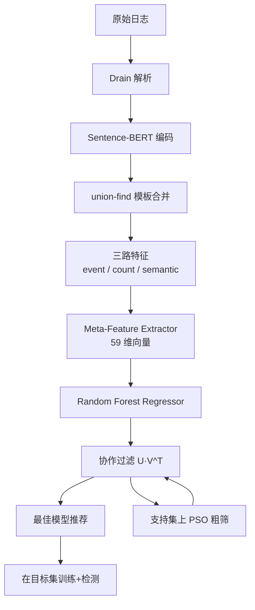
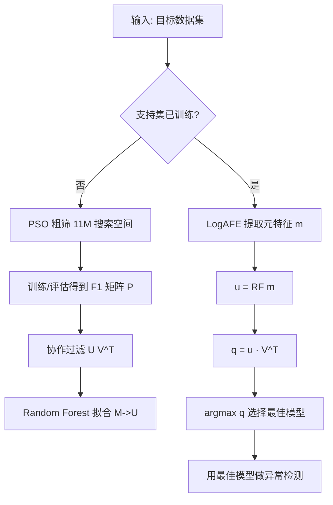

# End-to-End AutoML for Unsupervised Log Anomaly Detection（ASE 2024）

> 作者：Shenglin Zhang, Yuhe Ji, Jiaqi Luan, Xiaohui Nie, Zi'ang Chen, Minghua Ma, Yongqian Sun, Dan Pei  
> 机构：Nankai University、CNIC CAS、Microsoft、TKL-SEHCI、HL-IT、Tsinghua University  
> 发表年份：2024  
> 会议/期刊：39th IEEE/ACM International Conference on Automated Software Engineering (ASE '24), Sacramento, CA, October 27 – November 1, 2024（CCF A）  
> 关联 PDF：同目录下 `ASE24-LogCraft.pdf`

## 一、文档信息速览

| 字段 | 值 |
|---|---|
| 标题 | End-to-End AutoML for Unsupervised Log Anomaly Detection |
| 作者 | Shenglin Zhang, Yuhe Ji, Jiaya Luan, Xiaohui Nie, Zi'ang Chen, Minghua Ma, Yongqian Sun, Dan Pei |
| 机构 | Nankai University, Computer Network Information Center (CAS), Microsoft, Tsinghua University |
| 发表年份 | 2024 |
| 会议/期刊 | ASE 2024 (CCF A) |
| 分类 | 日志解析 / 异常检测 / AutoML / 元学习 |
| 核心问题 | 无监督日志异常检测的"模型选型 + 特征工程 + 调参"完全自动化 |
| 主要贡献 | 1) 首次将 AutoML 端到端用于无监督日志异常检测；2) LogAFE 自适应特征增强框架；3) 基于元学习的协作过滤模型推荐器；4) 在 5 个公开数据集上 F1 平均 0.899 超越次优 0.847 |

## 二、背景（Background）

现代分布式软件系统（云服务、电商、互联网金融等）每天都会生成 GB 到 TB 量级的日志，这些日志记录了系统的运行状态与代码执行路径，是运维人员进行故障定位、性能瓶颈分析、异常检测的关键数据源。在一个拥有数千个微服务的大型系统中，一天的日志条目数往往达到数亿甚至数十亿。在这样的规模下，靠专家手写规则或关键词匹配的传统日志异常检测方法已经不可持续：规则维护成本高、漏报严重、跨系统难以复用。

随着机器学习与深度学习的发展，DeepLog、LogAnomaly、LogBERT、CNN 等多种日志异常检测算法被提出，并在公开数据集上取得了不错的 F1 分数。然而，这些方法在工业部署时遇到了三个顽固的痛点：

1. **算法选择困难**：不同的算法在不同的数据集上表现差异巨大，论文中的实证研究（Table 1）显示 DeepLog 在 BGL 上 F1 最高 0.778、最低 0.501；LogAnomaly 在 BGL 上 0.713/0.671；LogBERT 在 HDFS 上 0.828/0.749。没有任何一个算法能在所有数据集上稳定最优。
2. **特征工程依赖专家**：Drain 是最常用的日志解析器，但默认参数+基础正则只能把 BGL 的解析准确率从 0.901 拉到 0.681，把 HDFS 从 0.990 拉到 0.808。运营人员必须为每种日志定制正则、调 Drain 参数、调模型超参，花费数天到数周时间。
3. **超参组合爆炸**：光是 4 个常用超参 × 3 种算法就有 54 种组合，把搜索空间扩展到 11,136,000 之后调参几乎不可能手工完成。

数据科学项目统计显示 15%–26% 的时间花在模型选型上。因此，作者提出：**与其不断设计新算法，不如用 AutoML 把"选模型 + 调特征 + 调超参"打包成端到端无监督流水线**。

## 三、目的（Purpose / Problems Solved）

- **痛点 1 → 方案**：日志多样性让特征工程难自动化 → 设计 LogAFE 自适应特征增强模块
- **痛点 2 → 方案**：超参组合爆炸 + 无标签 → 用 PSO 在标签支持集上做粗筛，再训练 meta-learner 做精筛
- **痛点 3 → 方案**：跨数据集迁移难 → 设计 59 维元特征向量，并提出 log 数据集相似度衡量
- **痛点 4 → 方案**：新数据集冷启动 → 用支持集训练的协作过滤模型在 NDCG@3 上达到 0.9+ 排序质量

## 四、核心原理（Principles）

LogCraft 由三大部分构成：

**1) LogAFE（Adaptive Log Feature Enhancement）**：先用 Drain 默认参数做第一轮解析得到原始模板；再用 `all-MiniLM-L6-v2` 把每个模板编码成 384 维语义向量；以 cosine 相似度为准则，通过 union-find 把高相似度模板聚合成代表模板；合并后的模板生成 event ID 序列、count 向量、semantic 向量三种特征。

**2) Meta-Learner Construction（基于协作过滤的模型推荐）**：

- **搜索空间初始化**：4 种无监督算法（DeepLog, LogAnomaly, CNN, LogBERT）× 11 个超参维度，总计 11,136,000 组合。  
- **粗筛（PSO）**：在有标签的支持集上跑粒子群优化，3 个算法各保留 top-1000 模型，去重后得到 7,840 个候选，构成矩阵 $P \in \mathbb{R}^{n \times m}$，其中 $P_{ij}$ 是第 $i$ 个数据集上第 $j$ 个模型的 F1 分数。  
- **精筛（Matrix Factorization）**：随机初始化 $U \in \mathbb{R}^{n \times d}$、$V \in \mathbb{R}^{m \times d}$，最小化排序损失：

$$\text{Loss} = 1 - \text{NDCG@3}(P, U V^T)$$

学习完成后用随机森林回归拟合 $M \to U$ 的映射，对新数据集的元特征向量 $m$ 得到 $u = f(m)$，再计算 $q = u \cdot V^T$ 即可得到每个候选模型的预测分数，取最高者部署。

**3) Meta-Feature Extractor**：对每个 log 数据集抽 59 维向量：
- 统计特征（最大、最小、数组长度、方差、偏度、峰度、KPSS 统计量+p值+lag）
- 模型特征（IForest 的决策树数量、LogCluster 的聚类数、簇内/簇间距离）

**4) 与现有技术的差异**：以往的日志异常检测框架都依赖"专家+人工"做特征工程和模型选型；LogCraft 是第一个**端到端无监督 + 元学习**的框架，只有一个超参（语义合并阈值 $s_{th}$）需要人工设置。

## 五、算法详解（Algorithm）

### 5.1 输入 / 输出
- **输入**：未标记的目标 log 数据集
- **输出**：训练好的异常检测模型（在测试集上的预测分数）+ F1 评估结果

### 5.2 核心模块
1. Log 解析 + 语义合并 (LogAFE)
2. 特征组合生成（event / count / semantic / 组合）
3. 粗筛：PSO 选出 top-K 候选模型
4. 训练：协作过滤 $U V^T$
5. 元特征提取 + 随机森林回归
6. 推荐：对新数据集输出最佳模型

### 5.3 伪代码

```python
def logcraft(target_set, support_sets, s_th=0.9):
    # 阶段 1: 训练 meta-learner（仅做一次）
    candidate_models = []
    for ds in support_sets:
        for algo in [DeepLog, LogAnomaly, CNN, LogBERT]:
            top_k = pso_search(algo, ds, n_particles=2000, n_iter=100)
            candidate_models.extend(top_k)
    candidate_models = dedup(candidate_models)  # 7840 个

    P = evaluate_f1(candidate_models, support_sets)  # n x m 矩阵

    # 协作过滤
    U = init_matrix(n, d)
    V = init_matrix(m, d)
    for epoch in range(epochs):
        loss = 1 - ndcg_at_3(P, U @ V.T)
        U, V = sgd_step(loss, U, V)
    rf = train_random_forest(M, U)  # M 是支持集的元特征矩阵

    # 阶段 2: 在目标集上做推荐
    m_target = extract_meta_features(target_set)  # 59 维
    u_target = rf.predict(m_target.reshape(1, -1))
    scores = u_target @ V.T
    best_model_idx = argmax(scores)
    best_model = candidate_models[best_model_idx]
    return best_model
```

### 5.4 关键数学

- NDCG@k：

$$\text{NDCG@k} = \frac{\text{DCG@k}}{\text{IDCG@k}}, \quad \text{DCG@k} = \text{rel}_1 + \sum_{i=2}^{k} \frac{\text{rel}_i}{\log_2(i+1)}$$

- 协作过滤目标：

$$\min_{U, V} 1 - \text{NDCG@3}(P, U V^T)$$

### 5.5 复杂度分析
- 搜索空间大小：$4 \times 10 \times 10 \times 12 \times 2^3 \times 2 \times 10 \times 10 \times 10 = 11,136,000$（论文 Table 4 给出）
- PSO 单数据集单算法：30,082s（含训练+评估） vs. GA 52,169s vs. RS 22,423s
- 推荐阶段：毫秒级（随机森林 + 矩阵乘法）

### 5.6 训练与推理
- 训练目标：NDCG@3 损失，逼近真实模型排名
- 推理：对新数据集先抽元特征再 dot product

## 六、系统架构图（Architecture）



## 七、流程图（Process Flow）



## 八、关键创新点（Key Innovations）

- **+ 端到端无监督 AutoML**：第一个把"特征工程+模型选择+超参搜索"全部自动化的无监督日志异常检测框架
- **+ LogAFE 语义合并**：用 Sentence-BERT 384 维向量 + union-find 自动合并近义模板，把 BGL 模板数从 1823 降到 684，Thunderbird 从 3487 降到 2073
- **+ 协作过滤排序损失**：NDCG@3 替代 RMSE，更关注 top-K 推荐质量
- **+ 59 维元特征向量**：首次将整个 log 数据集用固定维向量表征，可用于数据集相似度分析和跨领域迁移
- **+ 单超参设计**：$s_{th} \in [0.75, 0.95]$，默认 0.9，部署门槛低

## 九、实验与结果（Experiments）

### 数据集
- HDFS（11.18M 条，16.8K 异常，分布式系统）
- BGL（4.75M 条，348K 异常，Blue Gene/L 超算）
- ThunderBird（5M 条，76K 异常，Sandia 超算）
- Spirit（5M 条，765K 异常，Sandia 超算）
- Liberty（5M 条，1.81M 异常，Sandia 超算）

### Baseline
PCA, IM, DeepLog, LogAnomaly, CNN, LogBERT, LogTAD

### 主要结果（F1 Score）
| 数据集 | PCA | IM | DeepLog | LogAnomaly | CNN | LogBERT | LogTAD | LogCraft |
|---|---|---|---|---|---|---|---|---|
| BGL | 0.594 | 0.757 | 0.778 | 0.713 | 0.679 | 0.874 | 0.644 | **0.893** |
| HDFS | 0.622 | 0.668 | 0.944 | 0.883 | 0.828 | 0.953 | 0.854 | **0.992** |
| ThunderBird | 0.501 | 0.533 | 0.723 | 0.734 | 0.740 | 0.803 | 0.038 | **0.859** |
| Spirit | 0.740 | 0.694 | 0.718 | 0.696 | 0.724 | 0.816 | 0.766 | **0.916** |
| Liberty | 0.612 | 0.690 | 0.814 | 0.752 | 0.684 | 0.790 | 0.943 | 0.846 |

**平均 F1 = 0.899**，超过次优 LogBERT 0.847。

### 消融实验
- 去掉语义合并：性能下降 + 解析模板数翻倍
- 用 Global Best 替代协作过滤：NDCG@3 跌到 0.4 以下
- 用 ArgoSmArT 替代：冷启动场景表现差
- 用 RS 替代 PSO：候选集 F1 从 0.899 降到 0.781

### 效率分析
- 端到端训练时间：~30,000s（含 PSO + meta-learner 训练）
- 推理时间：单数据集 < 60s

## 十、应用场景（Use Cases）

1. 互联网公司大规模微服务日志异常检测（电商、社交、金融支付）
2. 云服务提供商的客户日志托管分析
3. 电信运营商核心网日志监控
4. 工业 IoT 设备日志异常检测
5. 一线运维工程师"零门槛"部署

## 十一、相关论文（Related Papers in this set）

- **ART（ASE24-ART）**：同一团队、同一会议，互补解决"事件统一表征 + 多任务"
- **DeepHunt（24_TOSEM_DeepHunt）**：同一团队、同样根因方向
- **UniDiag（24_TSC_UniDiag_TSC）**：同样融合多模态，但目标是故障诊断

## 十二、术语表（Glossary）

- **Drain**：基于树结构的在线日志解析器
- **PSO（Particle Swarm Optimization）**：粒子群优化算法
- **NDCG@k**：归一化折损累计增益，前 k 个排序质量指标
- **Meta-Feature**：表征数据集固有属性的向量
- **NDCG@3 Loss**：用作推荐排序训练目标
- **CVAE（Conditional VAE）**：条件变分自编码器，本篇未直接使用
- **Sentence-BERT / all-MiniLM-L6-v2**：轻量句向量模型
- **KPSS Test**：平稳性检验
- **IForest**：孤立森林，离群点检测算法
- **LogCluster**：日志聚类异常检测算法

## 十三、参考与延伸阅读

- Drain: He et al., "Drain: An Online Log Parsing Approach with Fixed Structure Tree", ICSE 2017
- DeepLog: Du et al., "DeepLog: Anomaly Detection and Diagnosis from System Logs through Deep Learning", CCS 2017
- LogBERT: Guo et al., "LogBERT: Log Anomaly Detection via BERT", IJCNN 2022
- LogAnomaly: Meng et al., "LogAnomaly: Unsupervised Detection of Sequential and Quantitative Anomalies in Unstructured Logs", IJCAI 2019
- LogTAD: Wang et al., "LogTransfer: Cross-system Log Anomaly Detection", ISSRE 2022
- 推荐阅读：Hutter et al., "Automated Machine Learning"（AutoML 综述）
- 开源代码：https://doi.org/10.1145/3691620.3695535（ASE 2024 官方链接）
