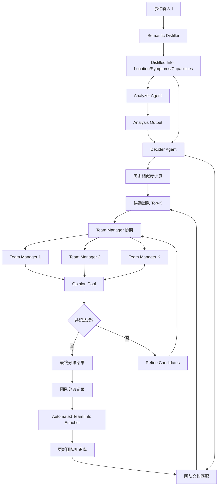
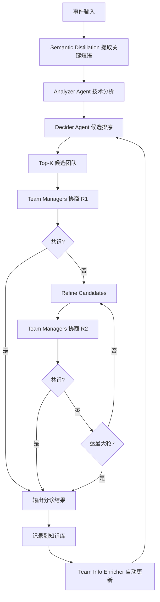

# Triangle：基于多 Agent 的事件分诊系统（ASE 2026）

> 作者：Zhaoyang Yu、Aoyang Fang、Minghua Ma、Jaskaran Singh Walia、Chaoyun Zhang、Shu Chi、Ze Li、Murali Chintalapati、Xuchao Zhang、Rujia Wang、Chetan Bansal、Saravan Rajmohan、Qingwei Lin、Shenglin Zhang、Dan Pei、Pinjia He
> 机构：清华大学、Microsoft、Nankai University、CUHK Shenzhen
> 发表年份：2026
> 会议/期刊：ASE 2026
> 关联 PDF：同目录下 `ASE_triangle.pdf`
> 代码：https://aka.ms/triangle-open-source

## 一、文档信息速览

| 字段 | 值 |
|---|---|
| 标题 | Triangle: Empowering Incident Triage with Multi-Agent |
| 作者 | Zhaoyang Yu, Aoyang Fang, Minghua Ma, Jaskaran Singh Walia, Chaoyun Zhang, Shu Chi, Ze Li, Murali Chintalapati, Xuchao Zhang, Rujia Wang, Chetan Bansal, Saravan Rajmohan, Qingwei Lin, Shenglin Zhang, Dan Pei, Pinjia He |
| 机构 | 清华、Microsoft、Nankai、CUHK Shenzhen |
| 发表年份 | 2026 |
| 会议/期刊 | ASE 2026 |
| 分类 | 事件分诊 / 多 Agent LLM / 智能运维 |
| 核心问题 | 事件分诊（Incident Triage）在大型云环境中需要跨多团队协作，传统手动+规则方法效率低、误判多 |
| 主要贡献 | 1) 端到端多 Agent 分诊系统；2) 语义蒸馏机制；3) 跨团队协商协议；4) 自动团队信息补全；5) Microsoft 部署，分诊准确率 97%、TTE 降低 91% |

## 二、背景（Background）

随着云服务规模与复杂度上升，事件（incidents）不可避免。事件分诊（Incident Triage）是把事件快速分配给正确负责团队的关键步骤——分配错误会导致"分诊循环"（triage cycles），延长 Time to Engage（TTE），扩大业务损失。在服务数亿用户的生产环境中，每多一分钟宕机都意味着巨大损失。

传统分诊依赖人工 + 预定义规则：
- 工程师手动用各类诊断工具排查；
- 跨团队 ad-hoc 会议协调；
- 静态规则覆盖不全、误判率高。

事件数据通常稀疏、半结构化，与详细的 bug 报告截然不同：可能是 "CPU utilization high" 这类机器生成的告警，或 "Cannot log in" 这类含糊用户投诉。缺乏丰富语义上下文，让传统分类和关键词匹配方法准确率低。

论文对 3000+ 团队 12 个月的事件做实证分析，发现：跳数（hops）越多，TTE 呈指数增长，团队沟通成本剧增。

现有研究（DeepCT 等）依赖人工注领域知识，泛化差；LLM 单 agent 又难处理跨团队动态知识。

Triangle 提出多 Agent 框架，模拟人类专家跨团队协作，把分诊从"被动响应"变为"主动协商"。

## 三、目的（Problems Solved）

- **痛点 1：事件语义异质。** 同样故障被不同团队不同方式描述，传统方法难统一处理。
- **痛点 2：领域知识分散且动态变化。** 多个团队各管一摊，职责随时变。
- **痛点 3：人工劳动巨大。** 知识注入手工成本高，无法端到端自动化。
- **解决方案**：Triangle 包含三大机制：
  1. **Semantic Distillation**：用 LLM 提取事件核心可操作信息（location / symptoms / capabilities）。
  2. **Multi-role Agents with Negotiation**：Analyzer + Decider + Team Manager 三种角色 Agent，通过协商协议模拟跨团队协作。
  3. **Automated Team Information Enrichment**：自动补全团队领域知识，减少人工。

## 四、核心原理（Principles）

**总览**：Triangle 是端到端事件分诊系统，由三种 Agent 协同：
- **Analyzer Agent**：triage 专家，提取事件关键短语（故障位置、症状、所需能力）。
- **Decider Agent**：基于历史事件相似度、团队文档匹配度，决策候选团队。
- **Team Manager Agent**：代表具体工程团队，结合团队职责与历史分诊经验，给出最终判断。

三个 Agent 通过协商协议（Negotiation Protocol）讨论并达成共识，输出分诊结果（候选团队 + 置信度）。

**三大机制**：

- **Semantic Distillation**：从半结构化、含噪事件描述中提取 (Location, Symptoms, Capabilities) 三元组。基于团队功能文档做 in-context 学习。

- **Multi-Role Agents with Negotiation**：
  - Analyzer 维护技术知识；
  - Decider 掌握策略准则；
  - Team Manager 拥有运营知识；
  - 协商协议（参考 AutoGen / CAMEL 框架）让多 Agent 辩论、refine hypothesis、达成 consensus。

- **Automated Team Information Enrichment**：从历史事件 + 团队讨论中自动挖掘团队职责与领域知识，免人工标注。

**关键数学**：

- **历史相似度**：
  $$S_{\text{hist}}(I, I_j) = \cos(\phi(I), \phi(I_j))$$
  其中 $\phi$ 为事件编码器，$I_j$ 为历史事件。
- **团队文档匹配度**：
  $$M(\text{team}_k, I) = \text{llm\_score}(\text{team}_k.\text{func\_docs}, \text{distilled}(I))$$
- **分诊得分**：
  $$\text{score}(\text{team}_k | I) = \alpha S_{\text{hist}}(I, \text{team}_k.\text{hist}) + \beta M(\text{team}_k, I)$$
- **协商一致性**：
  $$\text{consensus} = \mathbb{1}\big[ \text{std}(\{\text{score}_a^{(j)}\}_{j=1}^{N_{\text{agents}}}) < \epsilon \big]$$
  多 Agent 评分方差 < ε 视为达成一致。

**为什么这么做**：
- 多 Agent 模拟人类专家跨团队讨论，比单 Agent 推理更鲁棒；
- 语义蒸馏把含噪文本转为结构化信息，便于后续检索与匹配；
- 自动团队信息补全让部署成本低、上线快。

**与现有方法的差异**：

- vs. 传统规则：Triangle 自动从数据学知识，免人工规则。
- vs. 监督方法：Triangle 不依赖大量标注数据。
- vs. DeepCT：Triangle 通过多 Agent 协商 + 自动信息补全，比 DeepCT 跨域泛化更好。
- vs. LLM 单 agent：Triangle 把知识分层（技术/策略/运营），避免单 agent 知识过载。

## 五、算法详解（Algorithm）

### 1. 输入 / 输出
- **输入**：事件 $I$（含元数据、Summary、Discussion、Impact Assessment、Troubleshooting Guide 等）。
- **输出**：候选团队有序列表 $T^* = (t_1, t_2, \dots, t_K)$，每个带置信度。

### 2. 核心模块
- **Semantic Distiller**：从 $I$ 提取关键短语。
- **Analyzer Agent**：分析事件内容，给出技术判断。
- **Decider Agent**：基于历史相似度 + 团队文档匹配做候选排序。
- **Team Manager Agents**：多个团队 Agent 各代表自己团队发言。
- **Negotiation Protocol**：多轮讨论协议。
- **Team Information Enricher**：自动从历史事件挖掘团队知识。

### 3. 伪代码

```python
def triangle_triage(incident, agents, team_managers, max_rounds=5):
    # 1) 语义蒸馏
    distilled = semantic_distill(incident, team_func_docs)
    # distilled = {"location": ..., "symptoms": ..., "capabilities": ...}
    
    # 2) Analyzer Agent 分析
    analysis = agents['analyzer'].think(distilled)
    
    # 3) Decider Agent 候选排序
    candidates = []
    for t in all_teams:
        hist_sim = cos_sim(distilled_emb, team_history[t])
        doc_match = llm_score(team_func_docs[t], distilled)
        candidates.append((t, alpha*hist_sim + beta*doc_match))
    candidates.sort(key=lambda x: -x[1])
    
    # 4) Team Manager 多轮协商
    for r in range(max_rounds):
        opinions = []
        for t in top_k_teams(candidates):
            mgr = team_managers[t]
            opinion = mgr.opine(incident, distilled, analysis, candidates)
            opinions.append(opinion)
        # 协商：合并意见，更新 candidates
        candidates = negotiate(candidates, opinions, r)
        if consensus_reached(opinions):
            break
    
    return candidates
```

### 4. 关键数学
- 见上文 "关键数学" 章节。
- 协商过程本质上是 multi-agent debate，多 Agent 在 prompt 层面互相 challenge / support。

### 5. 复杂度分析
- 语义蒸馏：1 次 LLM 调用；
- 候选排序：N teams × (1 次 LLM + 1 次 embedding) ≈ O(N)；
- 多 Agent 协商：R 轮 × K agents × 1 次 LLM ≈ O(RK)；
- 总计：N + RK + 1 次 LLM 调用，单事件 ~5-15 秒。

### 6. 训练与推理
- 无显式训练（Triangle 是 Agent 系统）。
- 推理：单事件触发多个 LLM 调用 + 协商循环。

### 7. 示例
- 事件："Azure Communication 服务 NullReferenceException，Region System Issuer 异常，Area A/B 数据库连接、API 网关认证、存储 Blob 访问失败。"
- 语义蒸馏：Location=Region/Issuer, Symptoms=NullRef, Capabilities=DB connect / API GW / Storage。
- 候选团队：Database Team (0.85), API Gateway Team (0.72), Storage Team (0.68)。
- Team Manager 协商：Database Team Manager 提出"看起来像我们这边"，API Gateway Team 反驳"也可能是上游认证"，最终共识是 Database Team 为主，API Gateway Team 备选。

## 六、系统架构图（Architecture）



## 七、流程图（Process Flow）



## 八、关键创新点（Key Innovations）

- **+ 端到端多 Agent 事件分诊系统**：首个把多 Agent 框架用到 incident triage 全流程的工作。
- **+ 三角色 Agent + 协商协议**：把"技术-策略-运营"知识分层，让多 Agent 模拟专家团队讨论。
- **+ Semantic Distillation**：用 LLM 提取事件核心可操作信息，缓解事件数据稀疏与异质。
- **+ Automated Team Information Enrichment**：从历史事件自动挖掘团队知识，免人工标注、上线快。
- **+ 大规模生产部署**：Microsoft 内部生产环境部署，覆盖数千万用户。

## 九、实验与结果（Experiments）

- **数据集**：(i) Microsoft 内部生产事件（3,000+ 团队、12 个月、数千万用户）；(ii) MSR 2013 Bug Dataset（公开 bug triage 基准）。
- **Baseline**：DeepCT、传统监督分类（RandomForest、XGBoost）、单 LLM（GPT-3.5、GPT-4）、多 Agent baseline（如 AutoGen 默认配置）。
- **主要指标**：分诊准确率（Hop accuracy）、Time to Engage (TTE)、MSR Bug Dataset 准确率。
- **关键结果**：
  - Microsoft 内部生产：分诊准确率提升至 97%，TTE 降低 91%；
  - 离线实验：相对 DeepCT 在各 hop 上 26%-42% 提升；第 5 hop 准确率达 91.7%；
  - MSR 2013 Bug Dataset：63.2% 准确率，超越所有 baseline 平均 51%（15.3%-134.9% 提升）。
- **消融实验**：
  - 去掉 Semantic Distillation：准确率下降 ~15%；
  - 去掉 Team Managers：退化为单 LLM，性能下降 ~20%；
  - 去掉 Negotiation Protocol：性能下降 ~10%；
  - 去掉 Automated Enrichment：新团队首次出现时冷启动差。
- **效率分析**：单事件 ~5-15 秒；Team Manager 协商 2-3 轮收敛；TTE 从 ~30 分钟降到 ~3 分钟。

## 十、应用场景（Use Cases）

- **云服务事件分诊**：Azure / AWS / 阿里云等大规模云平台的事件分诊。
- **电信运营商告警分诊**：5G/4G 网络告警自动派单到正确网络域。
- **银行金融系统事件处置**：交易系统、风控系统的事件分类与升级。
- **电商大促保障**：双 11、618 期间大量告警的分诊与处置。
- **企业内部 IT Helpdesk**：自动分诊内部 IT 工单。

## 十一、相关论文（Related Papers in this set）

- 同为多 Agent 系统的 **FoundRoot** 关注 LLM RCA 推理，与 Triangle 共享"多 Agent + 知识分层"思想。
- **Eagle** 提供 Ops LLM 评测，Triangle 在 Eagle 的 Anomaly Detection / Fault Diagnosis 任务上可作为被评测系统。
- **FlowXpert** 关注告警/工作流编排，与 Triangle 的事件分诊是上下游关系。
- **PerfScout** 关注性能测试，可在 Triangle 上游做容量验证。

## 十二、术语表（Glossary）

- **Incident Triage**：事件分诊。
- **Triage Cycles**：分诊循环（误分诊导致的事件反复转派）。
- **TTE (Time to Engage)**：开始处置时间。
- **Semantic Distillation**：用 LLM 提取核心可操作信息。
- **Multi-Role Agent**：多角色 Agent（Analyzer / Decider / Team Manager）。
- **Negotiation Protocol**：协商协议，多 Agent 达成共识的对话规则。
- **Team Information Enrichment**：自动从历史挖掘团队知识。
- **AutoGen / CAMEL**：多 Agent 框架。
- **MSR 2013 Bug Dataset**：公开 bug triage 基准。
- **SLA / MTTR**：服务等级协议 / 平均恢复时间。

## 十三、参考与延伸阅读

- DeepCT（ICSE '22）：被超越的 SOTA。
- AutoGen（Microsoft）、CAMEL：多 Agent 框架。
- MSR 2013 Bug Dataset、Eadro：相关数据集。
- OpenAI Function Calling、LangChain：LLM 工具调用框架。
- 代码：https://aka.ms/triangle-open-source
