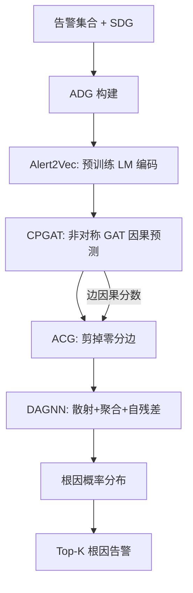
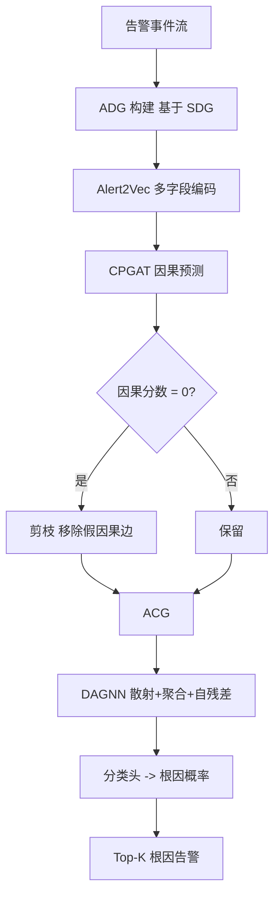

# AlertRCA: Causality Enhanced Graph Representation Learning for Alert-Based Root Cause Analysis（CCGRID 2024）

> 作者：Zhaoyang Yu、Qianyu Ouyang、Changhua Pei、Xin Wang、Wenxiao Chen、Liangfei Su、Huai Jiang、Xuanrun Wang、Jianhui Li、Dan Pei  
> 机构：清华大学 & BNRist；CNIC, CAS；Stony Brook University；华为；eBay Inc.；Lingjun Investment  
> 发表年份：2024  
> 会议/期刊：CCGRID 2024（IEEE/ACM International Symposium on Cluster, Cloud and Internet Computing）  
> 关联 PDF：同目录下 `AlertRCA_CCGRID2024_CameraReady.pdf`

## 一、文档信息速览

| 字段 | 值 |
|---|---|
| 标题 | AlertRCA: Causality Enhanced Graph Representation Learning for Alert-Based Root Cause Analysis |
| 作者 | Zhaoyang Yu、Qianyu Ouyang、Changhua Pei、Xin Wang、Wenxiao Chen、Liangfei Su、Huai Jiang、Xuanrun Wang、Jianhui Li、Dan Pei |
| 机构 | 清华大学 / BNRist；CNIC, CAS；Stony Brook University；华为；eBay；Lingjun Investment |
| 发表年份 | 2024 |
| 会议/期刊 | CCGRID 2024 |
| 分类 | 根因分析 / 告警 / 图神经网络 |
| 核心问题 | 在告警（Alert）级别，利用多模态告警的语义信息自动学习告警之间的因果关系并定位根因告警 |
| 主要贡献 | (1) 提出 AlertRCA 框架，仅依赖告警事件 + 服务依赖图 SDG，无需追踪或专家规则；(2) 设计 Alert2Vec 用预训练 LM 编码告警多字段；(3) 提出 CPGAT（Causality Prediction GAT）通过非对称注意力自动学习告警间因果强度；(4) 提出 DAGNN 沿着故障传播方向聚合信息并结合自残差定位根因；(5) 在真实 782 business + 170 service 故障数据集上达到 Top-1 83.9%、Top-3 96.8% |

## 二、背景（Background）

在线服务系统依赖大量异构监控（指标、日志、追踪）来识别异常并产生告警。一次故障往往会触发数十到数百条告警，SRE 需要快速定位真正"触发雪崩"的那条根因告警以便启动修复。传统根因分析方法要么依赖追踪（trace）数据，但中小公司难以承担全链路追踪的存储与计算开销；要么依赖专家手工配置的因果规则，难以维护且无法跨系统迁移；要么只关注服务级根因，忽略了"同一服务多条告警中哪条才是真正起因"的细粒度区分。

告警事件（Alert Event）是 SRE 日常打交道最多的"故障载体"，其字段包含事件名（如 "ServiceClientErrorSpike"）、服务名（如 "paypal gateway"）、起止时间、严重度、状态码、关键日志等。论文把告警级 RCA 概括为三个优势：(1) 多模态兼容——告警可以记录任何来源的异常与变更；(2) 语义清晰——SRE 可直接阅读；(3) 资源高效——比原始日志/时序小一个量级。

AlertRCA 基于"告警 + 服务依赖图 SDG"工作流：先用 Alert2Vec 把告警编码为向量；再用 CPGAT 在 SDC 构造的 ADG（Alert Dependency Graph）上预测因果强度；最后用 DAGNN 在过滤后的告警因果图（ACG）上做根因排序。

## 三、目的（Problems Solved）

- **告警级 RCA 缺乏自动因果建模**：传统方法要么靠 PageRank 随机游走（无因果强度），要么靠专家规则（维护成本高）；CPGAT 给出连续因果分数，剪掉假因果链接。
- **告警多字段语义难融合**：Alert2Vec 用预训练 LM 把告警每个属性独立编码，再聚合成告警向量，兼容半结构化数据。
- **故障传播方向难建模**：DAGNN 用"散射+聚合"机制沿故障传播方向传播信息，避免 GCN 简单均匀聚合带来的方向丢失。
- **自环依赖**：DAGNN 引入自残差结构，让节点在聚合时同时考虑自身信息与邻居贡献。
- **数据稀缺**：AlertRCA 监督训练仅需 782 business + 170 service 故障，覆盖 15 个月（2020-01 至 2021-04），但效果超过 SOTA。
- **跨数据集泛化**：在开源数据集上对 SOTA 方法 Top-1 提升 24.8% / 15.7%。

## 四、核心原理（Principles）

**系统总览**：AlertRCA 分为四个阶段：(1) ADG 构建（基于 SDG）；(2) Alert2Vec（用预训练 LM 编码告警）；(3) CPGAT（用非对称注意力预测每条 ADG 边的因果分数）；(4) DAGNN（沿故障传播方向聚合 + 自残差，输出根因排序）。

**关键概念**：

- **Alert Event（告警）**：半结构化属性-值对集合。
- **SDG（Service Dependency Graph）**：从 CMDB 构建的服务依赖图。
- **ADG（Alert Dependency Graph）**：在 SDG 上把每个服务下的告警两两相连得到的告警依赖图。
- **ACG（Alert Causal Graph）**：在 ADG 基础上，由 CPGAT 预测因果分数，剪掉零分边后的因果图。
- **CPGAT（Causality Prediction GAT）**：基于 GAT 的非对称注意力因果强度预测器。
- **DAGNN（Dispersing & Aggregating GNN）**：沿故障传播方向散射与聚合的图神经网络。
- **Self-residual**：节点更新时把自身信息与聚合信息相加。

**数学原理**：

- **Alert2Vec 编码**：对告警 $a$ 的每个属性 $p \in P(a)$，用预训练 LM 编码为 $h_p = LM(\text{text}(p))$，再聚合为 $v_a = \text{Aggregate}(\{h_p\}_{p \in P(a)})$。

- **CPGAT 因果预测**：对 ADG 上的每条边 $(a, b)$，用非对称注意力打分

$$
s_{a \to b} = \sigma\left( \text{LeakyReLU}\left( a^\top W [v_a \| v_b] \right) \right)
$$

其中 $W$ 是可学习参数，$\sigma$ 是 sigmoid，$a$ 是可学习向量。GAT 形式的消息传递逐层更新节点表示

$$
v_a^{(k+1)} = \phi\left( \sum_{b \in N(a)} s_{b \to a} W^{(k)} v_b^{(k)} \right)
$$

- **DAGNN 散射 + 聚合**：对节点 $a$ 沿"反向故障传播方向"聚合

$$
u_a = \text{Aggregate}\left( \left\{ \alpha_{a,b} v_b \;\middle|\; b \in N^-(a) \right\} \right)
$$

其中 $\alpha_{a,b}$ 是与 CPGAT 的因果分数共享的可学习权重。

- **自残差更新**：

$$
v_a' = v_a + \beta \cdot u_a
$$

其中 $\beta$ 是可学习残差系数。

- **根因分数**：用 $v_a'$ 经过分类头预测

$$
P(\text{root} = a) = \text{softmax}(W_c v_a' + b_c)[a]
$$

- **训练目标**：监督学习，使用交叉熵损失

$$
L = -\frac{1}{N} \sum_{i=1}^{N} \log P(\text{root} = a_i^*)
$$

**与现有技术的差异**：与 Groot（事件因果图 + 阈值规则）相比，AlertRCA 完全数据驱动并以告警为粒度；与 Eadro / Nezha（多模态 + 神经网络）相比，AlertRCA 不依赖追踪或工单，自然语言编码 + 因果图更轻量；与 TraceAnomaly / MicroHEC 相比，AlertRCA 把根因定位粒度从"服务"细化到"告警"，并能解释"为什么是这条告警"。

## 五、算法详解（Algorithm）

1. **输入 / 输出**：
   - 输入：故障中的告警集合 $A = \{a_1, \ldots, a_N\}$，SDG。
   - 输出：告警根因排序（Top-K）。
   - 训练时还需要每条告警的"是否根因"标签。

2. **核心模块**：
   - **ADG 构建**：根据 SDG 拓扑，连接所有同服务告警与跨服务依赖告警。
   - **Alert2Vec**：用预训练 LM 编码告警每个属性，再聚合成单一向量。
   - **CPGAT**：多层 GAT，输出每条边因果分数 + 节点嵌入。
   - **DAGNN**：沿传播方向聚合，自残差更新，分类头输出根因概率。
   - **训练**：交叉熵反向传播，监督学习。

3. **伪代码**（整合自 Algorithm 1 与 Algorithm 2）：

```python
def build_adg(alerts, sdg):
    ADG = {}
    for a in alerts:
        ADG[a] = []
    for a1 in alerts:
        for a2 in alerts:
            if a1 == a2: continue
            if a1.service == a2.service:
                ADG[a1].append(a2)
            elif sdg.adjacent(a1.service, a2.service):
                ADG[a1].append(a2)
    return ADG

def alert2vec(alert, lm):
    vectors = [lm(textify(p, alert[p])) for p in alert.fields]
    return aggregate(vectors)   # e.g., mean pooling

def cpgat(adg, alert_vecs, num_layers=2):
    h = alert_vecs
    for _ in range(num_layers):
        h_new = {}
        for a in adg:
            neigh = adg[a]
            scores = [sigmoid(leaky_relu(v @ W @ torch.cat([h[a], h[b]]))) for b in neigh]
            agg = sum(s * W_v @ h[b] for s, b in zip(scores, neigh))
            h_new[a] = phi(agg)
        h = h_new
    return h, scores_per_edge

def dagnn(acg, alert_vecs, h_cpgat):
    h_out = {}
    for a in acg:
        u = aggregate([alpha[a, b] * h_cpgat[b] for b in acg.predecessors(a)])
        h_out[a] = h_cpgat[a] + beta[a] * u
    scores = softmax(W_c @ stack(h_out) + b_c)
    return scores

def train_alert_rca(failures, root_labels, epochs=200):
    for ep in range(epochs):
        loss = 0
        for alerts, root in zip(failures, root_labels):
            adg = build_adg(alerts, sdg)
            v_alerts = {a: alert2vec(a, lm) for a in alerts}
            h_cpgat, edge_scores = cpgat(adg, v_alerts)
            acg = prune_zero_edges(adg, edge_scores)
            scores = dagnn(acg, v_alerts, h_cpgat)
            loss += -log(scores[root])
        loss.backward()
    return h_cpgat, W_c
```

4. **关键数学**：见 §四。

5. **复杂度分析**：
   - ADG 构建：$O(N^2)$，$N$ 为告警数；
   - Alert2Vec：每个告警 $O(|P| \cdot L^2)$，$L$ 为属性文本长度，LM 推理占主要成本；
   - CPGAT：每层 $O(|E| d)$，$d$ 为隐藏维度；
   - DAGNN：与 ACG 边数线性相关；
   - 总训练时间：在小规模故障集上分钟级。

6. **训练与推理**：监督训练（交叉熵）；推理时直接前向输出根因排序。

7. **示例**：checkout 系统在某次故障中产生 6 条告警；Alert2Vec 把每条告警编码为 768 维向量；CPGAT 在 ADG 上识别出 "Code Deployment in Service E" 是其他告警的"原因"，分数最高；DAGNN 沿传播方向聚合，最终把 "Code Deployment in Service E" 排为根因。

## 六、系统架构图（Architecture）



## 七、流程图（Process Flow）



## 八、关键创新点（Key Innovations）

- **+ 告警级 RCA 框架**：仅依赖告警 + SDG，无需追踪或专家规则，降低部署门槛。
- **+ Alert2Vec 多字段 LM 编码**：把告警每个属性独立编码再聚合，兼容半结构化数据。
- **+ CPGAT 非对称注意力**：用 GAT 的可学习注意力预测每条边的因果强度，避免手工规则。
- **+ DAGNN 散射+聚合+自残差**：沿故障传播方向传播信息，融合自身信息，给出更准根因排序。
- **+ 真实大规模工业验证**：在 782 business + 170 service 故障数据集上平均 Top-1 83.9%、Top-3 96.8%；开源数据集上对 SOTA 提升 24.8% / 15.7%。

## 九、实验与结果（Experiments）

- **数据集**：自家收集的工业数据集（15 个月、782 business 故障 + 170 service 故障），以及一个开源数据集。
- **Baseline**：PageRank、Random Walk、GCN、GAT、GraphSAGE、GRE（论文中对比的 SOTA 根因方法）。
- **主要指标**：Top-1 准确率、Top-3 准确率。
- **关键结果数字**：
  - service-based：Top-1 77.4%、Top-3 96.8%；
  - business domain：Top-1 85.3%、Top-3 96.7%；
  - 平均：Top-1 83.9%、Top-3 96.8%；
  - 在开源数据集上对 SOTA 提升 Top-1 24.8% / 15.7%。
- **消融实验**：分别去掉 Alert2Vec、CPGAT 因果分数、DAGNN 自残差，验证每模块对准确率的贡献。
- **效率分析**：训练分钟级；推理毫秒级，满足在线 SRE 排障需求。
- **可视化**：论文给出 ACG 的可视化，验证 CPGAT 学习到的因果链接与人工标注一致。

## 十、应用场景（Use Cases）

- **电商订单系统根因定位**：在订单、库存、支付告警中找出真正起因的告警事件。
- **金融支付告警分析**：在多支付通道告警中定位最先异常的支付通道。
- **SaaS 平台故障处置**：在用户投诉 + 系统告警的混合故障中自动给出告警根因。
- **微服务发布后回归**：把"Code Deployment"告警纳入因果图，定位发布相关根因。
- **多云告警聚合**：在跨云告警中找出最先出现的告警源。

## 十一、相关论文（Related Papers in this set）

- `Chain-of-Event_Interpretable-Root-Cause-Analysis-for-MicroservicesFSE24-Camera-Ready`（事件级根因）
- `CMDiagnostor`（基于调用指标的根因）
- `MonitorAssistant_CameraReady-v1.5_submitted`（LLM 监控助手，可解释告警）
- `TraceVAE`（追踪异常检测）
- `TSC23-DiagFusion`（多模态故障诊断）
- `Empirical_Analysis`（多变量时序异常检测实证）
- `Final_AutoKAD_ISSRE23_Camera-Ready-v2.3`（自动 KPI 模型选择）

## 十二、术语表（Glossary）

- **Alert Event（告警）**：半结构化监控事件。
- **SDG（Service Dependency Graph）**：服务依赖图。
- **ADG（Alert Dependency Graph）**：告警依赖图。
- **ACG（Alert Causal Graph）**：告警因果图。
- **Alert2Vec**：用预训练 LM 编码告警的模块。
- **CPGAT（Causality Prediction GAT）**：因果预测 GAT。
- **DAGNN（Dispersing & Aggregating GNN）**：散射与聚合 GNN。
- **Self-residual**：自残差。
- **GAT（Graph Attention Network）**：图注意力网络。
- **Top-K Accuracy**：前 K 名中包含真实根因的比例。
- **Failure Propagation Direction**：故障传播方向。

## 十三、参考与延伸阅读

- Paper: GAT (Veličković et al., 2018).
- Paper: GCN (Kipf & Welling, 2017).
- Paper: Groot (FSE 2023) ——事件因果图。
- Paper: Eadro (KDD 2023) ——多模态端到端根因。
- Paper: MicroHEC、MS-RCA 等指标根因方法。
- 代码仓库：`https://github.com/NetManAIOps/AlertRCA`
- 数据集：论文自有工业数据集（782 business + 170 service 故障）。
