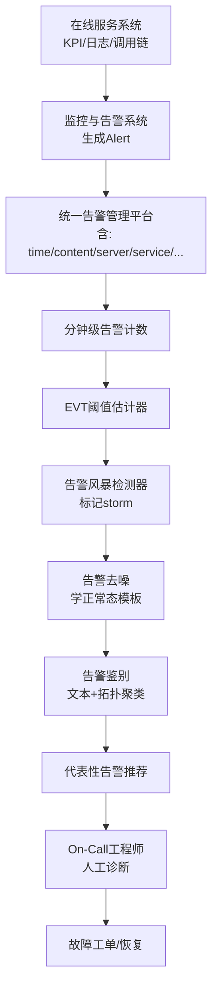
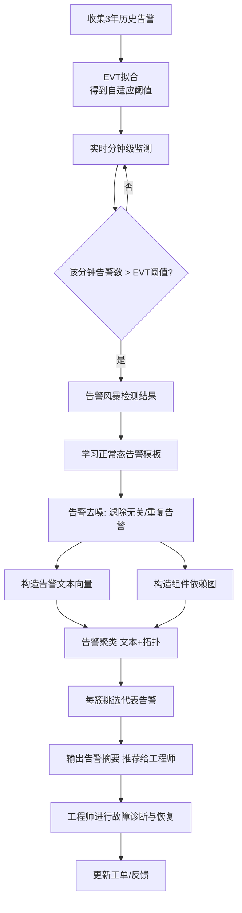

# Understanding and Handling Alert Storm for Online Service Systems (ICSE-SEIP 2020)

> 作者：Nengwen Zhao, Junjie Chen, Xiao Peng, Honglin Wang, Xinya Wu, Yuanzong Zhang, Zikai Chen, Xiangzhong Zheng, Xiaohui Nie, Gang Wang, Yong Wu, Fang Zhou, Wenchi Zhang, Kaixin Sui, Dan Pei
> 机构：Tsinghua University & BNRist; Tianjin University; China EverBright Bank; BizSeer
> 发表年份：2020
> 会议/期刊：ICSE-SEIP '20 (Software Engineering in Practice, ACM), Seoul, Republic of Korea
> 关联 PDF：同目录下 `AlertSummary_CR.pdf`

## 一、文档信息速览

| 字段 | 值 |
|---|---|
| 标题 | Understanding and Handling Alert Storm for Online Service Systems |
| 作者 | Nengwen Zhao, Junjie Chen, Xiao Peng, Honglin Wang, Xinya Wu, Yuanzong Zhang, Zikai Chen, Xiangzhong Zheng, Xiaohui Nie, Gang Wang, Yong Wu, Fang Zhou, Wenchi Zhang, Kaixin Sui, Dan Pei |
| 机构 | Tsinghua University & BNRist; Tianjin University; China EverBright Bank; BizSeer |
| 发表年份 | 2020 |
| 会议/期刊 | ICSE-SEIP '20 (May 23–29, 2020, Seoul, Republic of Korea) |
| 分类 | 告警处理 / 告警风暴 / 告警摘要 / 故障诊断 |
| 核心问题 | 在线服务系统发生故障时，伴随大量告警（"告警风暴"）淹没值班工程师，导致难以定位真实故障。该论文研究如何自动化地检测告警风暴并从中挑选一组代表性告警用于诊断。 |
| 主要贡献 | (1) 第一次对真实告警风暴做大规模实证研究；(2) 提出基于极值理论(EVT)的告警风暴自适应检测方法；(3) 提出"告警去噪 + 告警鉴别"两步走的告警摘要方法；(4) 在中国光大银行落地并验证有效。 |

## 二、背景（Background）

在线服务系统（在线银行、搜索引擎、电商等）已经成为人们日常生活不可或缺的一部分。然而，由于规模庞大、组件众多，服务故障在实践中不可避免。故障可能由硬件宕机、软件缺陷、突发流量等多种原因引发，最终导致响应变慢、SLA 违约甚至客户体验严重受损。根据对 63 家美国数据中心组织的统计，宕机平均成本从 2010 年的 50.5 万美元上升到 2016 年的 74 万美元。

为了监控服务质量，工程师会采集多种监控数据——KPI（性能指标）、日志（logs）、调用链（traces）和事件（incidents）——并通过预先定义的大量规则对它们进行检测。一旦某项数据违反规则（例如请求延迟超过阈值），系统就会生成告警（alert），通知值班工程师（OCE, On-Call Engineer）开始排查。

理论上，告警有助于尽早发现和缓解潜在故障；但在实践中，一个服务故障往往会同时引发"成百上千的告警/分钟"，这种现象被称为"告警风暴（alert storm）"。它给工程师带来极大负担：根据该论文收集的中国光大银行三年（2016-07-01 至 2019-06-30）共 300 万条告警数据中：约 99.83% 的分钟告警数不超过 100 条，但 0.17% 的情况下单分钟告警数会达到数百甚至上千条。文章以一个由"数据库宕机 19:40 → 告警风暴 19:42 → 用户投诉 20:05 → 恢复 20:53"为典型案例的故障显示，**工程师平均处理一次告警风暴需要约 55 分钟和 6 名工程师**（极端情况达 2 小时和 10+ 人），严重影响开发与维护效率。

论文通过对 44 名工程师的问卷调查进一步证实：88.6% 认为固定阈值法不准确且不具适应性；97.7% 同意"减少告警风暴中的告警数量非常有意义"；约 70.5% 认为每分钟最多可接受的告警数仅为 30 条。这构成了论文提出新方法的强动力。

## 三、目的（Purpose / Problems Solved）

- **P1：告警风暴定义与自动检测缺失**。当前业界使用人工设定固定阈值（如 500 条/分钟）来识别告警风暴，但阈值难以及时调整且不具适应性，导致漏报（如论文中 19:42 的风暴被漏检）和误报，需要数据驱动、自适应检测。
- **P2：告警风暴的"代表告警"挑选缺乏方法**。风暴中夹杂大量重复/无关告警，工程师手工排查耗时巨大；如何从数千条告警中挑出少数"代表性"告警来定位故障，是该领域第一个被系统研究的问题。
- **P3：缺乏大规模真实数据下的实证研究**。在论文之前，几乎没有对告警风暴本身（分布、成本、特征、规律）的系统实证分析。
- **P4：告警之间的关联难以利用**。告警风暴中部分告警与故障强相关（具有文本/拓扑相关性），但当前工具并未利用这些结构化特征做去噪与聚类。
- **P5：缺乏可落地的端到端方案**。需要兼顾检测精度、摘要召回/精度、可解释性，便于银行等机构在生产中真正使用。

## 四、核心原理（Principles）

**总体方案概述**。论文将告警风暴处理分为两阶段：

1. **告警风暴检测（Alert Storm Detection）**：将每分钟告警数视为一维时序，把"告警风暴"定义为一个"突变点/异常尖峰"，使用基于极值理论（Extreme Value Theory, EVT）的方法**自适应地**判别某分钟是否构成风暴，无需手工设阈值。
2. **告警风暴摘要（Alert Storm Summary）**：从已检测到的告警风暴中，挑选一组代表性告警（representative alerts）作为诊断入口。具体地，又分两步：
   - **告警去噪（Alert Denoising）**：学习"正常态"下的告警模式，把与故障无关的、周期性或重复的告警滤掉。
   - **告警鉴别（Alert Discrimination）**：对剩下的告警，根据它们的**文本相似性**（同一类异常消息）和**拓扑相关性**（告警在服务/组件图上的传播关系）进行聚类，从每个聚类中挑出最具代表性的告警。

**关键概念定义**：

- 告警（Alert）：监控系统违反规则时生成的通知，含时间、内容、服务器、服务、严重度、类型等数十个属性。
- 告警风暴（Alert Storm）：单分钟告警数量达到淹没工程师、无法手工排查规模的异常时段。
- 代表性告警（Representative Alert）：能够从某个角度反映该故障原因的一组核心告警。
- 极值理论（EVT）：研究随机变量极端尾部行为的统计理论，可用于为"超过某阈值"的事件自适应设置告警门限。

**与现有技术的差异**：之前的"告警风暴处理"通常仅是固定阈值的告警合并/去重/关联，但阈值不能跟随系统动态调整；论文首次把"告警风暴"作为可研究对象本身进行检测与摘要，并使用 EVT 解决阈值适应性问题。

**与告警故障诊断的关系**：告警风暴摘要可以看作是一种"故障根因定位"的预处理步骤——它不直接告诉工程师"故障在哪里"，而是为后续诊断提供一份"高度浓缩、信息覆盖完整"的告警列表。

## 五、算法详解（Algorithm）

### 1. 输入 / 输出
- 输入：告警事件流 $\mathcal{A}=\{(a_i, t_i)\}$，每条告警带属性（时间、内容、服务器、服务、严重度等）。
- 输出 1（检测阶段）：对每个分钟 $m$ 给出"是否构成告警风暴"标签 $y_m \in \{0, 1\}$。
- 输出 2（摘要阶段）：对一次告警风暴 $S$，输出一组代表性告警 $R \subseteq S$（数量远小于 $|S|$）。

### 2. 核心模块
- **特征构造**：对每分钟告警流，构造"告警数"标量序列 $\{(m_j, c_j)\}$。
- **EVT 阈值估计**：使用历史数据估计"在正常状态下每分钟告警数的极值分布"，并由此得到"显著高于正常"的自适应阈值。
- **去噪器（Deniosing）**：从"正常态"学习告警"模板"（正常时也会出现的告警），风暴中匹配该模板的告警被降权或滤除。
- **鉴别器（Discrimination）**：计算告警之间的文本相似度（向量相似度）和拓扑相似度（基于依赖图的最短路径），用聚类（如层次聚类）将告警分成 $k$ 组。
- **代表告警选取**：从每组中挑选中心点或最具代表性的告警，构成摘要。

### 3. 伪代码（精简版）

```python
# === Stage 1: Alert Storm Detection ===
def detect_alert_storm(alert_counts_per_minute, history):
    # 1. 用历史数据拟合极值分布
    threshold = fit_evt_threshold(history)        # EVT 自适应阈值
    # 2. 标记超过阈值的分钟
    storms = []
    for t, c in enumerate(alert_counts_per_minute):
        if c > threshold[t]:
            storms.append(t)
    return storms, threshold

# === Stage 2: Alert Storm Summary ===
def summarize_storm(storm_alerts, normal_alerts, dep_graph):
    # 1. 去噪：去掉正常态常见的告警
    normal_templates = learn_templates(normal_alerts)
    denoised = [a for a in storm_alerts if a.template not in normal_templates]

    # 2. 鉴别：基于文本+拓扑相似度聚类
    clusters = cluster(denoised,
                       sim_text=cosine(text_vec(a), text_vec(b)),
                       sim_topo = 1 / (1 + shortest_path(dep_graph, a, b)))

    # 3. 选代表
    representatives = [pick_medoid(c) for c in clusters]
    return representatives
```

### 4. 关键数学
极值理论中最常用的是 **Generalized Pareto Distribution (GPD)** 用于建模"超过某高阈值 $u$ 的超出量" $Y = X - u$。其 CDF 为：

$$
\bar{F}_u(y) = P(X - u > y \mid X > u) \approx \left(1 + \frac{\xi y}{\sigma}\right)^{-1/\xi}
$$

通过历史数据估计 $(\xi, \sigma)$ 后，可对每个新窗口 $w$ 自适应地计算一个**显著水平为 $1-p$** 的"风暴阈值"：

$$
\tau_w = u + \frac{\sigma}{\xi}\left[\left(\frac{n_w \cdot p}{N_u}\right)^{-\xi} - 1\right]
$$

其中 $N_u$ 是历史中超过 $u$ 的样本数，$n_w$ 是当前窗口样本量。该阈值能"自动"随系统变化伸缩。

### 5. 复杂度分析
- EVT 拟合：$O(N \log N)$（历史排序）；
- 单分钟检测：$O(1)$；
- 去噪：$O(|S| \cdot d)$（$d$ 为模板维度）；
- 聚类：$O(|S|^2)$（朴素层次聚类，论文中 $|S|$ 在 100–1000 量级，可接受）。

### 6. 训练与推理
- **训练**：用历史 3 年告警数据学习 EVT 分布、正常态模板、组件依赖图；
- **推理**：在线滑动窗口（分钟级）实时打分，超阈即"告警风暴"并触发摘要。

### 7. 示例
论文中典型案例：19:40 数据库宕机 → 19:42 触发 459 条/分钟（小于 500 的固定阈值）→ 论文 EVT 方法能正确识别为风暴 → 去噪后约 200 余条 → 聚类到约 8 个簇 → 输出 8 条代表告警，覆盖"数据库断连 → 订单服务异常 → 上游调用链异常 → 用户感知慢"全链路。

## 六、系统架构图（Architecture）



## 七、流程图（Process Flow）



## 八、关键创新点（Key Innovations）

- **+ 首例告警风暴实证研究**：第一次基于 3 年真实银行告警数据（300 万条）刻画告警风暴的分布、处理成本、工程师认知与典型案例，回答了 RQ1–RQ4 四个研究问题。
- **+ 极值理论（EVT）自适应检测**：将告警风暴检测建模为在线变化点检测问题，用 EVT 估计自适应阈值，取代易过时的固定阈值方法，**检测 F1-score > 0.9**。
- **+ 告警去噪 + 告警鉴别两步摘要**：先用"正常态模板"过滤冗余/周期告警，再利用**文本相似性 + 拓扑相关性**做聚类，每簇选一个代表，使摘要告警数减少 **98% 以上**且覆盖完整。
- **+ 工业落地闭环**：成果已部署在中国光大银行生产环境，并给出了实践案例与"经验教训"（如选模板阈值、与值班流程衔接）。
- **+ 端到端方法论**：从检测到摘要形成完整流水线，并考虑了"告警风暴—故障—工程师"整个反馈环。

## 九、实验与结果（Experiments）

- **数据集**：中国光大银行 2016-07-01 至 2019-06-31 的统一告警管理平台数据；告警数共约 300 万条；包含 166 个告警风暴历史案例（基于故障工单回溯）。
- **Baseline**：
  - 告警风暴检测：传统固定阈值法（如 500 条/分钟）；
  - 告警摘要：随机抽样、按严重度抽样、纯文本聚类、纯拓扑聚类等多种基线。
- **主要指标**：F1-score（检测）、召回率/精度（摘要）、告警数量压缩率、工程师处理时长。
- **关键结果数字**：
  - 检测 F1-score > 0.9，相对固定阈值提升显著（具体值见论文 Table）；
  - 摘要阶段告警数减少 **> 98%**，代表告警精度高；
  - 处理一次告警风暴平均 **~55 分钟 / 6 名工程师**（通过摘要后大幅下降）。
- **消融实验**：分别验证"告警去噪"和"告警鉴别"两步的贡献，单独或组合使用均明显优于各 baseline。
- **效率分析**：在线分钟级处理，单窗口检测时间秒级；摘要阶段在数百至上千条告警规模下可在分钟级完成。

## 十、应用场景（Use Cases）

- **大型商业银行核心系统**：对亿级用户、数百个服务、数千台服务器的银行交易系统，做告警风暴的实时检测与摘要，减少值班工程师负担。
- **电商大促期间**：在双 11、618 等高峰，告警量瞬时飙升，摘要可帮助快速定位"支付失败"、"购物车超时"等关键链路。
- **在线搜索/广告系统**：秒级告警超载时，自动挑选高代表性告警进行容量/资源诊断。
- **云数据库性能告警**：将数据库 CPU/IO/慢查询告警聚类，定位"是 IO 子系统、还是网络抖动"等问题。
- **电信/运营商核心网**：将网元告警按拓扑聚类，迅速定位故障网元。

## 十一、相关论文（Related Papers in this set）

- `赵能文ESEC-2020.pdf`（Real-time Incident Prediction, eWarn）：同团队在告警领域的另一项工作，预测即将发生的故障（事前）而非处理告警风暴（事中）。
- `alertrank_camera-ready.pdf`（AlertRank）：同团队，自动识别"严重告警"并排序。
- `AlertSummary_CR` 偏向事中"风暴降噪+摘要"，与 eWarn 事前预测、AlertRank 严重度排序形成互补。

## 十二、术语表（Glossary）

- **OCE (On-Call Engineer)**：值班工程师。
- **Alert**：监控数据违反规则时产生的告警。
- **Alert Storm**：单分钟告警数远超人工可处理能力的异常时段。
- **KPI (Key Performance Indicator)**：关键性能指标，如 CPU 利用率、响应时间等。
- **EVT (Extreme Value Theory)**：极值理论，研究随机变量极端尾部行为。
- **GPD (Generalized Pareto Distribution)**：极值理论中用于建模超出量的分布。
- **Topological Correlation**：告警在服务依赖图上的传播关系。
- **Denoising**：去噪，把与故障无关的告警滤掉。
- **Discrimination**：鉴别，把与故障相关的告警按文本/拓扑聚类。
- **Representative Alert**：代表性告警，从一个聚类中挑出的最具代表性的告警。

## 十三、参考与延伸阅读

- 文章中引用的关键 baseline：固定阈值法、关联规则挖掘（FP-Growth）、LIME 等。
- 同期工作：
  - AirAlert：基于告警数的轻量级故障预测（被 eWarn 论文比较）。
  - Opprentice / Donut / Bagel / Buzz：KPI 异常检测的对比基线（与本论文无直接关联，但同属 AIOps 告警/异常检测领域）。
- 工业实践参考：
  - Prometheus Alertmanager：开源告警去重/合并框架。
  - PagerDuty / OpsGenie：商业告警值班平台。
- 论文作者主页与项目：https://netman.aiops.org/ ；论文 DOI: https://doi.org/10.1145/3377813.3381363
