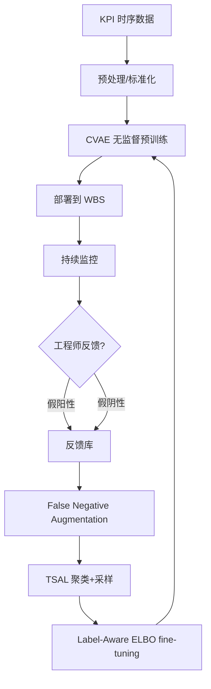
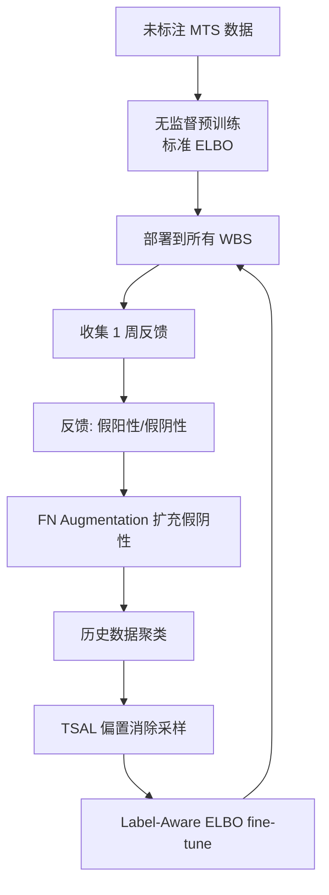

# AnoTuner: Supervised Fine-Tuning for Unsupervised KPI Anomaly Detection for Mobile Web Systems（WWW 2024）

> 作者：Zhaoyang Yu, Shenglin Zhang, Mingze Sun, Yingke Li, Yankai Zhao, Xiaolei Hua, Lin Zhu, Xidao Wen, Dan Pei  
> 机构：Tsinghua University、BNRist、Nankai University、China Mobile Research Institute、BizSeer Technology、HL-IT  
> 发表年份：2024  
> 会议/期刊：Proceedings of the ACM Web Conference 2024 (WWW '24), Singapore, May 13–17, 2024（CCF A）  
> 关联 PDF：同目录下 `AnoTuner-CR_v1.7_submitted.pdf`

## 一、文档信息速览

| 字段 | 值 |
|---|---|
| 标题 | Supervised Fine-Tuning for Unsupervised KPI Anomaly Detection for Mobile Web Systems |
| 作者 | Zhaoyang Yu, Shenglin Zhang, Mingze Sun, Yingke Li, Yankai Zhao, Xiaolei Hua, Lin Zhu, Xidao Wen, Dan Pei |
| 机构 | Tsinghua University & BNRist, Nankai University & HL-IT, China Mobile Research Institute, BizSeer Technology |
| 发表年份 | 2024 |
| 会议/期刊 | WWW 2024 (CCF A) |
| 分类 | 时序异常检测 / 半监督 / 联邦部署 / KPI 监控 |
| 核心问题 | 工业部署后无监督异常检测模型如何有效利用运营人员反馈（特别是稀有假阴性）持续提升性能 |
| 主要贡献 | 1) Label-Aware ELBO 损失函数；2) 假阴性增广机制；3) TSAL 两阶段主动学习；4) 顶级 ISP 真实数据验证 |

## 二、背景（Background）

无线基站（WBS，Wireless Base Station）是移动 Web 系统的核心基础设施。一个 WBS 每天产生 25 项关键性能指标（KPI），包括无线连接成功率、干扰等级、RRC 连接请求数、E-RAB 建立成功率、CCE 利用率等，这些指标以多变量时间序列（MTS）的形式刻画了基站的运行状态。中国移动等大型 ISP 通常拥有数十万到数百万基站，每天产生的数据量达到 TB 级，KPI 异常检测是故障定位的第一道关口。

2021 年 Meta 长达 7 小时的全球宕机、2023 年 Microsoft、Google、Alibaba 的大规模故障，以及 2024 年 Meta 与 OpenAI 的多次中断都说明：及时准确的 KPI 异常检测对保障服务可用性、避免数亿美元营收损失至关重要。

传统做法是先训练一个无监督异常检测模型（避免人工标注），然后部署到所有基站。部署后运营商会反馈两类问题：
- 假阳性（误报）：把正常 KPI 标成异常
- 假阴性（漏报）：把异常 KPI 标成正常

由于基站对用户体验至关重要，运营商普遍把检测器调成"高敏"——宁可误报也不漏报。但这种偏好导致**反馈数据中假阴性极其稀少、假阳性占 2-10 倍**。同时，软件/硬件升级、配置变更又会让**反馈分布和原始训练数据分布出现显著偏移**，直接拿反馈 fine-tune 会造成模型污染（catastrophic forgetting + 数据漂移）。

工业惯例是每周小批量 fine-tune、每季度大规模 retrain。如果 fine-tuning 不能解决故障，类似问题会持续到下一次 retrain 之前，给运维和用户带来持续损害。

## 三、目的（Purpose / Problems Solved）

- **痛点 1 → 方案**：反馈数据中假阴性极少 → 设计 False Negative Augmentation 在 CVAE 隐空间生成更多假阴性样本
- **痛点 2 → 方案**：反馈分布与训练分布偏差大 → 设计 Two-Stage Active Learning (TSAL) 机制聚类历史数据并按 cluster 采样平衡分布
- **痛点 3 → 方案**：fine-tuning 不能用纯无监督损失（因为假阴性本来就被模型学成"正常"了）→ 设计 Label-Aware ELBO 让 $y=1$ 时最大化重建误差
- **痛点 4 → 方案**：反馈周期长、标注成本高 → 模型必须既能复用无监督预训练，又能用少量反馈有效 fine-tune

## 四、核心原理（Principles）

**AnoTuner 的三阶段工作流**（图 3）：

1. **无监督预训练 + 部署**：用 CVAE 在未标注的 MTS 上做无监督训练，然后部署到所有基站。
2. **收集反馈**：运营商每周标注假阳性/假阴性。
3. **监督 fine-tuning**：经过 (a) False Negative Augmentation、(b) TSAL、然后用 Label-Aware ELBO 训练。

**Label-Aware ELBO 损失函数**（论文公式 2）：

$$\mathcal{L}(x, c) = -\mathbb{E}_{z \sim q_\phi(z|x,c)}[\log p_\theta(x|z, c, y=0)] + \mathbb{E}_{z \sim q_\phi(z|x,c)}[\log p_\theta(x|z, c, y=1)] - (2y-1) \int q_\phi(z|x,c) \log \frac{q_\phi(z|x,c)}{p_\theta(z|c)} dz$$

直观理解：
- 当 $y=0$（正常反馈）：保留原始 ELBO 的负重建损失
- 当 $y=1$（假阴性）：反转符号，让 $p_\theta(x|z,c,y=1)$ 的对数概率变小（最大化重建误差），让模型学会"这种模式是异常"
- KL 项乘上 $(2y-1)$：对假阴性样本也反转 KL 散度方向

**False Negative Augmentation**：
- 输入：少量已标注的假阴性样本
- 方法：在 CVAE 隐空间 $z$ 周围加高斯扰动或过采样相似时序子序列
- 输出：扩充的假阴性样本集

**TSAL（Two-Stage Active Learning）**：
- 阶段 1：聚类所有历史 MTS 数据（k-means / DBSCAN）成 $K$ 个 cluster
- 阶段 2：在每个 cluster 中按"分布与反馈最接近"的原则采样，混入 fine-tuning 集
- 目标：消除反馈数据的分布偏差

**与现有技术的差异**：
- 传统半监督：用 pseudo-label 把未标注数据混进去，没有针对"漏报"特别设计
- AnoTuner 是第一个把"假阴性稀有 + 分布漂移"两个工业难题联合解决的工作

## 五、算法详解（Algorithm）

### 5.1 输入 / 输出
- **输入**：未标注的 MTS 训练集 + 少量带标签反馈（假阳性、假阴性）
- **输出**：fine-tuned CVAE 模型

### 5.2 核心模块
1. CVAE 编码器 $q_\phi(z|x,c)$
2. CVAE 解码器 $p_\theta(x|z,c,y)$
3. False Negative Augmentation 模块
4. TSAL 聚类+采样模块
5. Label-Aware ELBO 损失

### 5.3 伪代码

```python
def anotuner_train(unlabeled_data):
    # 阶段 1: 无监督预训练
    cvae = CVAE(input_dim, latent_dim, cond_dim)
    for x, c in unlabeled_data:
        mu, logvar = cvae.encode(x, c)
        z = reparameterize(mu, logvar)
        x_hat = cvae.decode(z, c)
        loss = standard_elbo(x, x_hat, mu, logvar)  # 标准 ELBO
        cvae.update(loss)
    return cvae

def anotuner_finetune(cvae, feedback_data, history_data):
    # False Negative Augmentation
    fn_samples = feedback_data[feedback_data.y == 1]  # 假阴性
    augmented_fn = augment_in_latent_space(cvae, fn_samples, n=10)
    
    # TSAL: 聚类历史数据 + 偏置消除采样
    clusters = kmeans(history_data, k=10)
    bias_eliminating_samples = []
    for cluster in clusters:
        # 在该 cluster 中按与反馈分布最相似原则采样
        bias_eliminating_samples.extend(sample(cluster, feedback_data))
    
    # Label-Aware ELBO fine-tuning
    fine_tuning_data = feedback_data + augmented_fn + bias_eliminating_samples
    for x, c, y in fine_tuning_data:
        mu, logvar = cvae.encode(x, c)
        z = reparameterize(mu, logvar)
        x_hat = cvae.decode(z, c, y)
        loss = label_aware_elbo(x, x_hat, mu, logvar, y)
        cvae.update(loss)
    return cvae
```

### 5.4 关键数学

CVAE 标准 ELBO：

$$\text{ELBO} = \mathbb{E}_{q_\phi(z|x,c)}[\log p_\theta(x|z,c)] - \text{KL}(q_\phi(z|x,c) \| p_\theta(z|c))$$

AnoTuner Label-Aware ELBO（论文公式 2）：

$$\mathcal{L}(x, c) = -\mathbb{E}_{z \sim q_\phi}[\log p_\theta(x|z,c,y=0)] + \mathbb{E}_{z \sim q_\phi}[\log p_\theta(x|z,c,y=1)] - (2y-1) \int q_\phi(z|x,c) \log \frac{q_\phi(z|x,c)}{p_\theta(z|c)} dz$$

### 5.5 复杂度分析
- 编码器/解码器：标准 CVAE 复杂度 $O(D \cdot d + d^2)$
- 聚类：k-means 复杂度 $O(NKI)$
- 总训练成本：预训练 $T_1$ + fine-tuning $T_2$ 远小于 retrain

### 5.6 训练与推理
- 预训练目标：标准 CVAE ELBO
- fine-tuning 目标：Label-Aware ELBO
- 推理：使用编码器-解码器重建误差作为异常分数

## 六、系统架构图（Architecture）



## 七、流程图（Process Flow）



## 八、关键创新点（Key Innovations）

- **+ Label-Aware ELBO**：让 CVAE 在假阴性（$y=1$）样本上最大化重建误差，反转 KL 方向，扩展了 CVAE 损失函数族
- **+ False Negative Augmentation**：在 CVAE 隐空间做数据增广，专治假阴性稀缺
- **+ TSAL 两阶段主动学习**：聚类+采样机制，缓解反馈与训练分布的 drift
- **+ 工业级落地**：在中国移动等顶级 ISP 真实数据上验证，反馈数据仅占 0.6% 即可大幅提升性能

## 九、实验与结果（Experiments）

### 数据集
- 来自某顶级全球 ISP 真实生产数据
- 收集 1 周的反馈数据（仅占总数据集 0.6%–0.74%）
- 基站 25 项 KPI × 数百基站 × 数天时序

### Baseline
- USAD, OmniAnomaly, AnomTransformer 等无监督 SOTA
- 半监督方法（直接用反馈 fine-tune）

### 关键结果
- 实际生产部署：117 天稳定运行
- Figure 2：fine-tuning 前后
  - 假阳性：1178 → 787（-33%）
  - 假阴性：437 → 296（-32%）
- 性能提升显著高于 best baseline 半监督方法（论文表述：significantly higher）
- 仅用 0.74% 的测试集规模反馈数据即达到目标

### 消融实验
- 仅用 False Negative Augmentation：性能提升有限
- 仅用 TSAL：性能提升有限
- 两者结合 + Label-Aware ELBO：性能大幅提升

### 效率分析
- Fine-tuning 时间：分钟级（远低于 retrain）
- 推理时延：毫秒级，满足在线检测

## 十、应用场景（Use Cases）

1. 移动运营商基站 KPI 异常检测（中国移动、Vodafone 等）
2. 互联网公司核心链路 KPI 监控
3. 5G/6G 网络自优化（SON）
4. 边缘节点异常检测
5. 任何"部署后还能持续学习"的工业异常检测场景

## 十一、相关论文（Related Papers in this set）

- **DualLMAD（ISSRE24-DualLMAD）**：同样是多变量时序异常检测，但用预训练大模型而非 CVAE
- **OmniFed（InformationSciences-OmniFed）**：联邦学习方向的 MTS 异常检测
- **Auto-PIP（ISSRE24-Auto-PIP）**：同会议，KPI 趋势/异常检测
- **Self-Evolution（ISSRE24-Self-Evolution）**：同会议，反馈驱动 LLM 持续学习

## 十二、术语表（Glossary）

- **KPI（Key Performance Indicator）**：关键性能指标
- **WBS（Wireless Base Station）**：无线基站
- **MTS（Multivariate Time Series）**：多变量时序
- **CVAE（Conditional VAE）**：条件变分自编码器
- **ELBO（Evidence Lower Bound）**：证据下界
- **LAELBO**：Label-Aware ELBO
- **TSAL**：Two-Stage Active Learning
- **POT（Peak Over Threshold）**：极值理论阈值
- **FN / FP**：假阴性 / 假阳性
- **ISP（Internet Service Provider）**：互联网服务提供商
- **RRC、E-RAB、CCE**：LTE/5G 控制面 KPI
- **BNRist**：北京国家信息科学技术研究中心

## 十三、参考与延伸阅读

- CVAE: Sohn et al., "Learning Structured Output Representation using Deep Conditional Generative Models", NeurIPS 2015
- USAD: Audibert et al., "USAD: UnSupervised Anomaly Detection on Multivariate Time Series", KDD 2020
- OmniAnomaly: Su et al., "Robust Anomaly Detection for Multivariate Time Series through Stochastic Recurrent Neural Network", KDD 2019
- POT: Siffer et al., "Anomaly Detection in Streams with Extreme Value Theory", KDD 2017
- 推荐阅读：Kim et al., "Towards a Rigorous Evaluation of Time-Series Anomaly Detection" (VLDB 2022)
- 开源代码：https://github.com/NetManAIOps/AnoTuner
