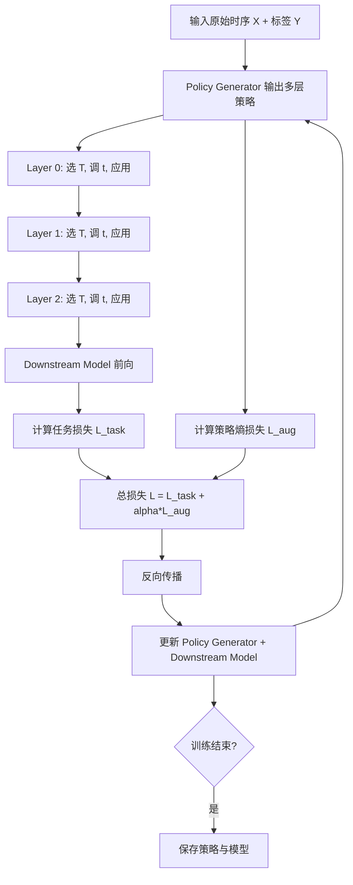

# AutoDA-Timeseries：时序数据自动数据增强（AI-TIME 2026）

> 作者：Zijun Dou、Zhenhe Yao、Zhe Xie、Xidao Wen、Tong Xiao、Dan Pei
> 机构：清华大学 NetMan Lab
> 发表年份：2026
> 会议/期刊：AI-TIME 2026
> 关联 PDF：同目录下 `AutoDA-Timeseries-AI-TIME-v2.pdf`

## 一、文档信息速览

| 字段 | 值 |
|---|---|
| 标题 | AutoDA-Timeseries: Automated Data Augmentation for Time Series |
| 作者 | Zijun Dou, Zhenhe Yao, Zhe Xie, Xidao Wen, Tong Xiao, Dan Pei |
| 机构 | 清华大学 NetMan Lab |
| 发表年份 | 2026 |
| 会议/期刊 | AI-TIME 2026 |
| 分类 | 数据增强 / 时序 / 自动化机器学习 |
| 核心问题 | 时序数据稀缺、增强策略难设计，通用 AutoDA 难以跨任务泛化、忽视时序特征、策略采样粗糙 |
| 主要贡献 | 1) 物理意义驱动的多任务 AutoDA 框架；2) 自适应策略学习（按层差异化）；3) 跨数据集/低样本鲁棒；4) 显著优于 RandAugment、TrivialAugment、UniformAugment、TS2Vec、InfoTS、AutoTCL、A2Aug 等 SOTA |

## 二、背景（Background）

时序数据广泛应用于能源、医疗、AIOps、气象、经济等领域，其下游任务涵盖预测、分类、异常检测等。但高质量时序数据稀缺——采集设备成本高、隐私安全约束严、缺失值普遍。数据增强（Data Augmentation）通过时域、频域、时频域的变换生成多样样本，缓解数据不足。

时序数据增强主要分两大范式：
1. **表示学习（Representation Learning）**：Stage 1 用对比学习学 encoder；Stage 2 训练下游模型。两阶段容易"目标错位"——encoder 学到的不一定适合下游任务。
2. **自动数据增强（AutoDA）**：端到端把 augmentation 与下游任务联合优化，one-stage 是当前主流。

时序数据增强的常用变换：Jittering、Scaling、Downsampling、AAFT、STFT 等。

现有 AutoDA 方法（RandAugment、TrivialAugment、UniformAugment、A2Aug）面临三大局限：
- **任务泛化差**：大多只在单一任务上验证，跨任务性能差。
- **忽视时序特征**：通用变换不感知时序特性（季节性、趋势），可能破坏内在结构。
- **均匀采样**：把所有变换一视同仁，忽略不同变换对不同数据的差异化影响。

## 三、目的（Problems Solved）

- **痛点 1：跨任务 AutoDA 难泛化。** 不同任务（预测、分类、异常检测）最优增强策略差异大。
- **痛点 2：忽视时序特性。** 通用变换可能破坏周期性、趋势等关键结构。
- **痛点 3：策略采样粗糙。** 均匀采样不能根据样本动态调整。
- **痛点 4：与下游模型解耦。** 两阶段方法目标不一致。
- **解决方案**：AutoDA-Timeseries——一个 one-stage、端到端、自适应、按特征驱动（feature-driven）的 AutoDA 框架，物理意义强、效率高、可解释。

## 四、核心原理（Principles）

**总览**：AutoDA-Timeseries 由多层 Augmentation Layer 堆叠而成，每层都包含一组变换及其概率与强度。通过一个"策略生成器"（Policy Generator）端到端学习如何选择变换和强度。

**系统总览**：

- **Augmentation Layer $A_l^{(k)}$**：第 $k$ 层负责选 1 个变换 $T \in \mathcal{T} = \{T_1, T_2, \dots, T_T\}$，并给出选择概率 $p_{l,T}$ 和强度 $t_{l,T}$。
- **策略生成器（Policy Generator）**：以原始时序为输入，输出"用哪个变换、概率多少、强度多少"。
- **下游模型**：单一模型，端到端与增强策略联合训练。
- **复合损失**：增强损失（可选）+ 下游任务损失。

**关键概念**：
- **变换集合 $\mathcal{T}$**：Jittering（加噪）、Scaling（缩放）、Resample（重采样）、TimeWarp（时间扭曲）、FreqWarp（频率扭曲）、MagWarp（幅度扭曲）、Slice（切片）等。
- **物理意义驱动**：每个变换都对应一种"时序特定扰动"——Jittering 模拟传感器噪声、Resample 模拟采样率变化、TimeWarp 模拟时钟漂移、MagWarp 模拟幅度变化。
- **自适应策略**：不同层学到的策略不同——论文可视化发现 Layer 0 快速收敛到少数 operator（确定性 exploitation），Layer 1-2 保持高 entropy（多样性 exploration），形成"稳定 + 适应"互补。

**与现有技术的差异**：

- vs. 两阶段表示学习：one-stage 端到端，避免目标错位。
- vs. RandAugment/TrivialAugment：自适应采样 vs. 均匀采样；可解释 vs. 黑盒。
- vs. TS2Vec/InfoTS：与下游任务联合优化 vs. 先学 encoder 再 fine-tune。
- vs. A2Aug：可跨任务 vs. 单一任务；时序特征感知 vs. 通用变换。

## 五、算法详解（Algorithm）

### 1. 输入 / 输出
- **输入**：原始时序 $X$、下游任务标签 $Y$（分类/预测/异常检测）。
- **输出**：增强后的时序 $X_{\text{aug}}$，用于训练下游模型；同时得到可解释的策略分布。

### 2. 核心模块
- **Policy Generator**：根据样本特征输出策略 $\{(p_T, t_T)\}_T$。
- **Augmentation Layers**：多个 $A_l$ 串接执行。
- **Downstream Model**：分类/预测/异常检测模型。
- **Composite Loss**：$\mathcal{L} = \mathcal{L}_{\text{task}} + \alpha \mathcal{L}_{\text{aug}}$（可选）。

### 3. 伪代码

```python
def autodt_train(X, Y, downstream_model, n_layers=3, T_transforms=...):
    policy_net = PolicyGenerator(input_dim, n_layers, T_transforms)
    optim = Adam(lr=...)
    for epoch in range(n_epochs):
        for batch_x, batch_y in loader(X, Y):
            x = batch_x
            for k in range(n_layers):
                # 1) 策略生成
                p, t = policy_net(x, layer=k)   # (B, T), (B, T)
                # 2) 选择变换（采样或 argmax）
                T_idx = gumbel_softmax_sample(p)
                # 3) 应用变换
                x = apply_transform(x, T_idx, t)
            # 4) 下游任务损失
            y_hat = downstream_model(x)
            loss_task = task_loss(y_hat, batch_y)
            # 5) 可选：增强多样性损失
            loss_aug = -policy_net.entropy()    # 鼓励多样性
            loss = loss_task + alpha * loss_aug
            optim.zero_grad(); loss.backward(); optim.step()
    return policy_net, downstream_model
```

### 4. 关键数学
- **策略分布**：
  $$\pi_\theta(T_k | x, l) = \frac{\exp(s_k^{(l)})}{\sum_{k'} \exp(s_{k'}^{(l)})}$$
  其中 $s_k^{(l)}$ 由 Policy Generator 在第 $l$ 层对变换 $T_k$ 打分。
- **应用变换**：
  $$x_{\text{aug}} = T_{k^*}(x; t_{k^*}), \quad k^* \sim \pi_\theta(\cdot | x, l)$$
- **复合损失**：
  $$\mathcal{L} = \mathbb{E}_{(x,y) \sim \mathcal{D}} \big[ \mathcal{L}_{\text{task}}(f_\phi(\tilde x), y) + \alpha \cdot H(\pi_\theta(\cdot | x, l)) \big]$$
  其中 $H$ 是熵，$-\alpha H$ 鼓励策略多样。

### 5. 复杂度分析
- 训练：单次 iteration 增加 1 次 Policy Generator 前向 + n_layers 次变换；总体开销 ~5-15%。
- 推理：直接用训练好的 downstream model，无额外开销。

### 6. 训练与推理
- **训练**：与下游任务端到端联合训练，one-stage。
- **推理**：单一 downstream model，无 augmentation 推理开销。

### 7. 示例
- 在 ETTh1 训练下游 Transformer 预测器，AutoDA-Timeseries 学会 Layer 0 用 Raw + 轻微 Jittering，Layer 1 用 TimeWarp + MagWarp 组合，Layer 2 用 Resample；最终在 ETTh2、ETTm2 上 zero-shot 评估也取得提升。

## 六、系统架构图（Architecture）

```mermaid
graph TB
    A[原始时序 X] --> B[Policy Generator]
    B --> B1[Layer 0 策略 p0, t0]
    B --> B2[Layer 1 策略 p1, t1]
    B --> B3[Layer 2 策略 p2, t2]
    B1 --> A0[应用变换 T0]
    A0 --> A1[应用变换 T1]
    A1 --> A2[应用变换 T2]
    B2 --> A1
    B3 --> A2
    A2 --> C[Downstream Model]
    C --> D[预测 / 分类 / 异常分数]
    D --> E[L_task]
    B --> F[L_aug = -H(策略)]
    E --> G[总损失 L = L_task + alpha*L_aug]
    F --> G
    G --> H[反向传播更新策略生成器 + 下游模型]
```

## 七、流程图（Process Flow）



## 八、关键创新点（Key Innovations）

- **+ Feature-Driven Physical Meaningful Augmentation**：每个变换都对应可解释的物理/统计扰动，避免通用变换破坏时序结构。
- **+ Adaptive Policy Learning（按层差异）**：不同层学到不同 policy（Layer 0 exploitation，Layer 1-2 exploration），形成稳定 + 适应互补。
- **+ 多任务通用**：同一框架可服务预测、分类、异常检测等任务，跨任务泛化强。
- **+ 端到端 one-stage**：与下游任务联合优化，避免两阶段目标错位。
- **+ 跨数据集/低样本鲁棒**：在 ETTh1 训练后在 ETTh2、ETTm2 直接 zero-shot 评估也提升；在 10%-100% 训练数据下均稳定优于 NoAug。

## 九、实验与结果（Experiments）

- **数据集**：ETTh1、ETTh2、ETTm1、ETTm2、Weather、Energy、AIOps、医疗、经济等。
- **任务**：长期预测、短期预测、分类、异常检测、回归。
- **下游模型**：CNN、RNN、Transformer、生成模型。
- **Baseline**：
  - NoAug（无增强）
  - 表示学习：TS2Vec、InfoTS、AutoTCL
  - 自动增强：RandAugment、UniformAugment、TrivialAugment、A2Aug
- **主要指标**：任务相关指标（MSE、Acc、F1、AUC 等）。
- **关键结果**：
  - 在所有任务上一致优于 NoAug；
  - 在长期预测上超 RandAugment、TrivialAugment、UniformAugment 显著；
  - 在低数据（10%）场景下提升最大（强鲁棒）；
  - 参数规模 / 训练时间均低于 A2Aug、AutoTCL，效率高。
- **消融实验**：
  - 去掉 feature-driven：性能退化；
  - 去掉 adaptive policy：均匀采样退化为 RandAugment；
  - 减少 layer 数：性能下降。
- **效率分析**：训练时间增加 < 15%；推理无额外开销；参数数与 baseline 相当。

## 十、应用场景（Use Cases）

- **能源负荷预测**：电力、风电、光伏等小样本场景的数据增强。
- **AIOps 异常检测**：监控数据稀缺的告警系统。
- **医疗时序**：心电、ICU 数据隐私约束严，增强数据缓解不足。
- **气象/经济预测**：高质量时序稀缺场景。
- **迁移学习**：在一个数据集训练后 zero-shot 到其他数据集。

## 十一、相关论文（Related Papers in this set）

- 同为 NetMan Lab 的 **SPRINT** 关注推理时降采样加速，与 AutoDA 关注训练时增强互补——可结合使用：训练时用 AutoDA 增强数据，推理时用 SPRINT 加速。
- **CMoS** 关注时序预测中的空间相关性建模，可作为 AutoDA 的下游模型 backbone。
- **KAN-AD** 关注时序异常检测，AutoDA 可用于增强其训练数据。

## 十二、术语表（Glossary）

- **AutoDA (Automated Data Augmentation)**：自动数据增强。
- **One-stage vs. Two-stage**：单阶段端到端 vs. 两阶段（先学表示再 fine-tune）。
- **Transformation / Operator**：增强变换，如 Jittering、Scaling。
- **Intensity**：变换的强度参数。
- **Policy**：选择哪个变换、用多大强度的策略。
- **Gumbel-Softmax**：离散选择的可微松弛。
- **Exploitation vs. Exploration**：利用已知好策略 vs. 探索新策略。
- **Feature-Driven**：由数据特征驱动的策略生成。
- **Zero-shot Generalization**：训练后不微调直接泛化到新数据集。
- **Representation Learning**：表示学习，Stage 1 用对比学习等方法学 encoder。

## 十三、参考与延伸阅读

- RandAugment、TrivialAugment、UniformAugment、A2Aug：被比较的 AutoDA baseline。
- TS2Vec、InfoTS、AutoTCL：表示学习 baseline。
- 时序增强经典：Deletion、Mixup、Permutation、MagWarp、TimeWarp、AAFT、STFT。
- Gumbel-Softmax 采样（Jang et al., 2017）。
- 论文关联项目：国家重点研发计划 2024YFB4505903。
