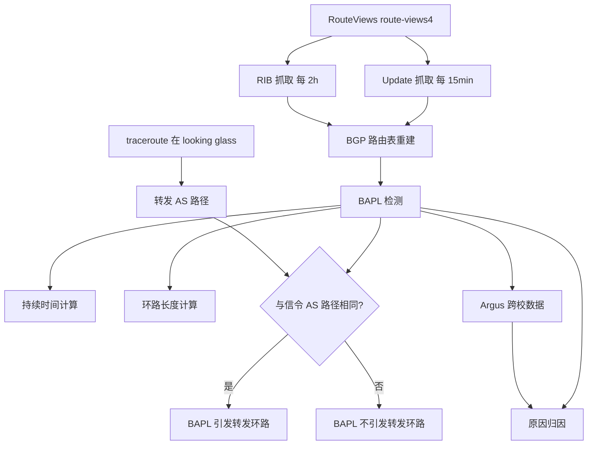
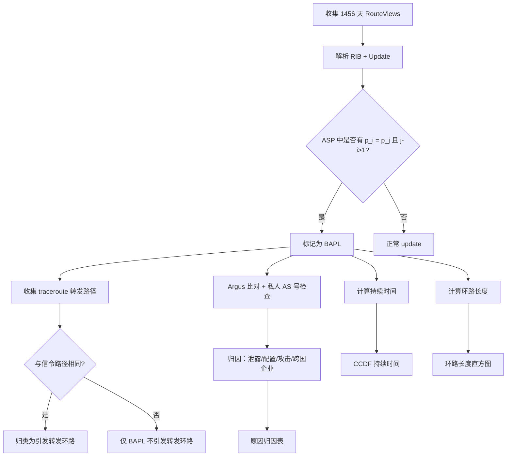

# A Measurement Study on BGP AS Path Looping (BAPL) Behavior

> 作者：Shenglin Zhang、Ying Liu、Dan Pei  
> 机构：清华大学网络科学与网络空间研究院；清华大学计算机科学与技术系；清华大学信息技术国家实验室  
> 发表年份：约 2014  
> 会议/期刊：IEEE ICDCS 2014 / IEEE GLOBECOM 2014（本文为 BAPL 行为测量研究）  
> 关联 PDF：同目录下 `BAPL_publish_version.pdf`

## 一、文档信息速览

| 字段 | 值 |
|---|---|
| 标题 | A Measurement Study on BGP AS Path Looping (BAPL) Behavior |
| 作者 | Shenglin Zhang、Ying Liu、Dan Pei |
| 机构 | 清华大学网络科学与网络空间研究院；清华大学计算机科学与技术系；清华大学信息技术国家实验室 |
| 发表年份 | 约 2014（数据集覆盖 2010-01-01 至 2013-12-31，1456 天） |
| 会议/期刊 | IEEE 国际会议 |
| 分类 | 网络测量 / BGP 路由 / AS 路径环路 |
| 核心问题 | BGP 设计上应能消除 AS 路径环路，但实际中仍出现 BAPL，且可能引起多 AS 转发环路 |
| 主要贡献 | (1) 首次系统化研究 BAPL，覆盖 IPv4 与 IPv6；(2) 给出 BAPL 与转发环路关联；(3) 量化持续时间和环路长度分布；(4) 给出 BAPL 形成的多种解释 |

## 二、背景（Background）

互联网由成千上万个自治系统（AS）组成，每个 AS 在其域内使用 OSPF、RIP、IS-IS 等内部网关协议，跨域通信使用边界网关协议（BGP）。BGP 的 AS-PATH 属性记录了到达目的前缀所经过的 AS 列表，理论上当 AS 收到一条 BGP 更新且其 AS 号已包含在 AS-PATH 中时，应丢弃该消息以打破 AS 路径环路（RFC 4271）。然而，在实际互联网中，BGP AS 路径环路（BAPL）行为仍被观察到，给路由收敛、传输性能与安全带来隐患。

BAPL 出现于 AS-PATH 包含环路的场景：若 AS 路径 asp = (p_n, ..., p_1)，当存在 i, j 满足 p_i = p_j 且 j > i, j - i ≠ 1 时，即形成 BAPL。以往研究或关注转发环路，或关注瞬时 BAPL，但缺乏跨 IPv4/IPv6、覆盖 4 年数据、量化持续时间与环路长度、并对 BAPL 的形成原因进行系统归因的研究。本文基于 RouteViews 真实 BGP 数据 + traceroute 实测数据，对 BAPL 进行全面刻画。

## 三、目的（Problems Solved）

- **BAPL 是否真实存在**：在 IPv4 与 IPv6 上对 1456 天 RouteViews 数据进行系统测量，统计 BAPL 数量与比例。
- **BAPL 是否引发转发环路**：通过 RouteViews + traceroute 实测，分析 BAPL 与多 AS 转发环路的关系。
- **BAPL 持续时间分布**：通过 RIB 与 update 数据定义 BAPL 持续时间，绘制 CCDF。
- **BAPL 环路长度分布**：分析 IPv4/IPv6 中环路长度的年分布。
- **BAPL 形成原因归因**：区分私人 AS 号泄露、跨国企业、防止特定 AS 接收路由、错误配置、恶意攻击等。
- **为网络运维提供决策依据**：为网络运营商减少转发环路、缓解包丢失与延迟提供可量化建议。

## 四、核心原理（Principles）

**系统总览**：本文主要分三部分：（1）数据采集与方法：使用 RouteViews route-views4 collector 抓取 BGP RIB（每 2 小时）与 update（每 15 分钟）数据，结合 traceroute 测得转发 AS 路径；（2）BAPL 与转发环路关联：通过 looking glass 在 RouteView peer AS 上运行 traceroute，对比 signaling AS 路径与 forwarding AS 路径是否相同；（3）BAPL 统计与解释：在 1456 天数据上统计 BAPL 数量、比例、持续时间、环路长度，给出形成原因分类。

**关键概念**：

- **AS（Autonomous System）**：自治系统，一组统一路由策略的 IP 前缀集合。
- **BGP（Border Gateway Protocol）**：边界网关协议。
- **AS-PATH**：BGP 路由属性，记录到目的前缀经过的 AS 序列。
- **signaling AS path / forwarding AS path**：信令路径/转发路径。
- **BAPL（BGP AS Path Looping）**：AS-PATH 中出现环路的现象。
- **RIB / Update**：BGP 路由信息库/路由更新。
- **MRAI（Minimum Route Advertisement Interval）**：BGP 最小路由通告间隔，默认 30s。
- **Private AS Number**：IANA 保留的私有 AS 号（65512-65535），不应在全球 Internet 通告。
- **RouteViews**：Oregon 大学的公开 BGP 数据收集项目。
- **traceroute**：用于观察数据报文实际经过路径的工具。
- **looking glass**：路由器提供的允许外部执行 traceroute 的服务。

**数学原理**：

- **BAPL 定义**：若 AS 路径 asp = (p_n, ..., p_1)，存在 p_i = p_j, j > i 且 j - i ≠ 1，则发生 BAPL。
- **环路长度**：

$$
\text{loop\_length}(asp) = j - i
$$

- **BAPL 持续时间**：

$$
\text{duration} = t_{\text{withdraw}} - t_{\text{announce}}
$$

- **CCDF（互补累积分布函数）**：

$$
\text{CCDF}(x) = P(X > x)
$$

- **BAPL 与转发环路相同的条件**：当一个 BAPL 引起的转发 AS 路径与信令 AS 路径完全一致时，认定该 BAPL 引起转发环路。

- **私人 AS 号泄露判据**：

$$
\forall m \in (i, j), \quad p_m \in [65512, 65535]
$$

- **路由泄漏判据**（跨国企业、prepending）：

$$
\text{同一 AS 号位于不同地理位置} \Rightarrow \text{跨国企业环路}
$$

**与现有技术的差异**：与 Paxson（1997）的端到端路由行为研究相比，本文聚焦于 BGP 信令环路；与 Z. M. Mao 等（SIGCOMM 2003）相比，本文使用 4 年长期数据；与 J. Xia 等相比，本文不仅测量持久转发环路，还量化 BAPL 的持续时间与长度；与 D. Pei 等（ICDCS 2004）相比，本文在 IPv6 与多年时间跨度上扩展。

## 五、算法详解（Algorithm）

1. **输入 / 输出**：
   - 输入：RouteViews RIB（每 2h 一次）、Update（每 15min 一次）、traceroute 实测。
   - 输出：每日 BAPL 数量与比例、CCDF、环路长度分布、原因归因表。

2. **核心模块**：
   - **Data Collection**：从 RouteViews 收集 RIB 与 update。
   - **BAPL Detection**：在 AS-PATH 中检测是否存在 p_i = p_j, j>i, j-i≠1。
   - **Duration Calculation**：以 update 时间戳与下一次 withdraw/replace 时间戳差作为持续时间。
   - **Loop Length Calculation**：以 j-i 计算环路长度。
   - **Forwarding Loop Verification**：用 traceroute 在 looking glass 上抓取转发路径，与信令路径对比。
   - **Cause Attribution**：使用 Argus 跨校 IPv4 异常事件、私人 AS 号集合 [65512,65535]、跨国企业位置等归因。

3. **伪代码**：

```python
def detect_bapl(asp):
    n = len(asp)
    for i in range(n):
        for j in range(i+2, n):
            if asp[i] == asp[j]:
                return True, j - i  # 找到 BAPL
    return False, 0

def bapl_duration(rib_history, prefix):
    t_announce = rib_history[prefix].announce_time
    t_remove = rib_history[prefix].withdraw_time or rib_history[prefix].replace_time
    return t_remove - t_announce

def forwarding_loop_check(sig_path, traceroute_hops):
    fwd_as_path = map_ip_to_as(traceroute_hops)
    return sig_path == fwd_as_path

def private_as_leak(asp):
    for p in asp:
        if 65512 <= p <= 65535:
            return True
    return False

# 统计每日 BAPL
for day in days:
    updates = fetch_updates(day)
    bapls = [u for u in updates if detect_bapl(u.as_path)]
    n_bapl = len(bapls)
    ratio = n_bapl / len(updates)
    record(n_bapl, ratio)
```

4. **关键数学**：见 §四。

5. **复杂度分析**：
   - 单条 update 的 BAPL 检测：$O(n^2)$，n 为 AS 路径长度；
   - 日级统计：$O(U \cdot n^2)$，U 为日 update 数量；
   - 4 年（1456 天）总处理：数十亿条 update，需分布式并行处理。

6. **训练与推理**：
   - 无机器学习训练：纯统计与模式匹配；
   - 推理：日级离线批处理，可脚本化。

7. **示例**：2013-09-08，从 AS1299（RouteView peer 80.91.255.62）观察目的前缀 64.26.148.0/24 的信令 AS 路径为 (AS1299, AS6453, AS577, AS7788, AS6407, AS7788)，AS7788 出现两次形成 2 跳 BAPL。从同一节点 traceroute 抓取的转发 AS 路径与之完全一致，证明 BAPL 引发实际转发环路。

## 六、系统架构图（Architecture）



## 七、流程图（Process Flow）



## 八、关键创新点（Key Innovations）

- **+ 首次系统化研究 BAPL**：在 IPv4/IPv6 上 1456 天 RouteViews 数据，给出 BAPL 数量、比例、持续时间、长度分布。
- **+ BAPL 与转发环路关联**：通过 traceroute 实测，约 1% 的 BAPL 引起多 AS 转发环路。
- **+ 私人 AS 号泄露量化**：1.76% BAPL（IPv4）、0.0027% BAPL（IPv6）由私人 AS 号泄露造成。
- **+ 错误配置/恶意攻击量化**：至少 2.85% BAPL（IPv4）由错误配置或恶意攻击造成。
- **+ 跨国企业 + prepending 等"合理"解释**：提出 NTT（AS2914）跨芝加哥/法兰克福等场景下，相同 AS 号位于不同位置也会导致 BAPL。
- **+ 长期测量数据集**：约 600 万 IPv4 BAPL、144 万 IPv6 BAPL 跨越 4 年。

## 九、实验与结果（Experiments）

- **数据集**：RouteViews route-views4 的 1456 天（2010-01-01 至 2013-12-31，剔除 2011-07-14~2011-07-18 的 5 天空缺）RIB + Update。
- **Baseline**：对比 Z. M. Mao 等（SIGCOMM 2003）的瞬时环路测量、J. Xia 等（Computer Networks 2007）的持久转发环路测量、D. Pei 等（ICDCS 2004）的瞬时 BAPL 测量。
- **主要指标**：BAPL 数量、BAPL/总 update 比例、持续时间 CCDF、环路长度直方图。
- **关键结果数字**：
  - 整体共 5,973,568 条 IPv4 BAPL、1,440,104 条 IPv6 BAPL；
  - IPv4 BAPL 数量 2010→2013 从 1580/天 增至 15808/天，比例 1.03×10⁻³→2.94×10⁻³；
  - IPv6 BAPL 数量远小于 IPv4，2010 年为 0，2013 年 21/天，比例 5.07×10⁻⁵；
  - 91.64% IPv4 BAPL、99.90% IPv6 BAPL 持续时间 < 1 天；
  - 持续时间 > 9 天的 BAPL，IPv4 平均 37.70 天，IPv6 平均 60.97 天；
  - 持续时间 > 89 天的 BAPL，IPv4 平均 224.76 天，IPv6 平均 322.11 天；
  - 私人 AS 号泄露：IPv4 1.76%（105340/5973568），IPv6 0.0027%（39/1440104）；
  - 错误配置/恶意攻击：IPv4 至少 2.85%（170036/5973568）。
- **消融实验**：通过 Argus 跨校数据交叉验证 BAPL 原因。
- **效率分析**：处理 4 年数据需在分布式环境运行，单机不适用。
- **可视化**：Fig.2 日级 BAPL 数量与比例时间序列；Fig.3 持续时间 CCDF；Fig.4 环路长度直方图。

## 十、应用场景（Use Cases）

- **运营商网络运维**：发现并修复 BAPL，减少因 BAPL 引发的多 AS 转发环路。
- **路由安全监测**：通过 Argus 等系统捕捉 BAPL 中的前缀劫持行为。
- **跨国企业网络规划**：识别因同一 AS 号跨多个地理位置导致的 BAPL。
- **互联网路由测量研究**：作为后续 BAPL/转发环路研究的基线数据集。
- **路由器厂商优化**：在 BGP 实现中加强环路检测，避免错误配置导致 BAPL。

## 十一、相关论文（Related Papers in this set）

- `pch-infocom2017`（WiFi 干扰）
- `icccn2017-pch`（WING 干扰量化）
- `iccnc15-li`、`fcs-li`（NDN WLAN 视频）
- `BAPL_publish_version` 本文（BGP BAPL 测量）

## 十二、术语表（Glossary）

- **AS（Autonomous System）**：自治系统。
- **BGP（Border Gateway Protocol）**：边界网关协议。
- **AS-PATH**：BGP AS 路径属性。
- **BAPL**：BGP AS 路径环路。
- **RIB**：路由信息库。
- **Update**：BGP 路由更新。
- **MRAI**：最小路由通告间隔。
- **RouteViews**：Oregon 大学 RouteViews 项目。
- **traceroute**：网络路径探测工具。
- **Looking Glass**：路由器对外的命令行服务。
- **Private AS Number**：私人 AS 号（65512-65535）。
- **Argus**：前缀劫持检测系统。
- **CCDF**：互补累积分布函数。
- **Forwarding AS Path**：转发 AS 路径。
- **Prepending**：在 AS 路径中重复添加某 AS 号以操控路由选择。

## 十三、参考与延伸阅读

- Paper: Y. Rekhter et al., RFC 4271（BGP-4）。
- Paper: Z. M. Mao et al., SIGCOMM 2003（AS-level traceroute）。
- Paper: J. Xia et al., Computer Networks 2007（持久转发环路）。
- Paper: D. Pei et al., ICDCS 2004（瞬时 BGP 路径环路）。
- Paper: R. Mahajan et al., SIGCOMM 2002（BGP 错误配置）。
- Paper: Y. Xiang et al., ICNP 2011（Argus）。
- 数据：RouteViews（http://www.routeviews.org）、traceroute.org。
- 相关论文：`pch-infocom2017`、`icccn2017-pch`、`BAPL_publish_version`。
