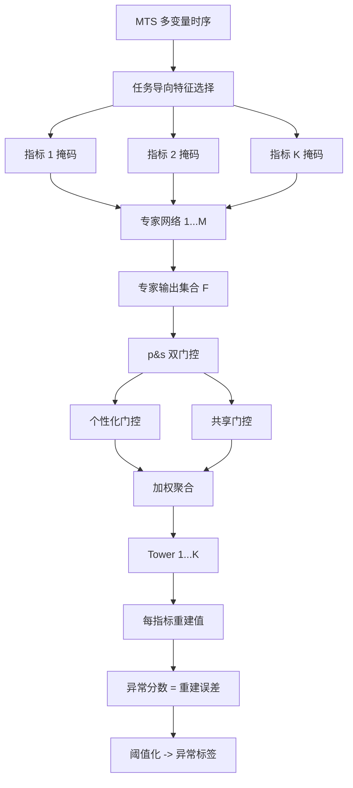
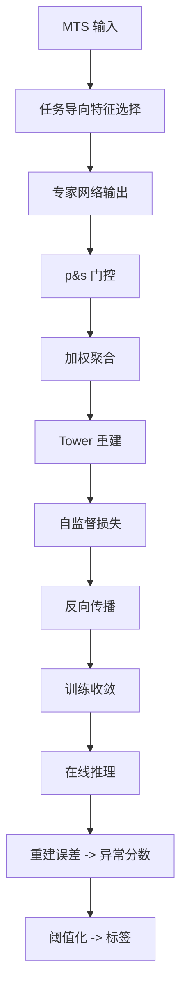

# Beyond Sharing: Conflict-Aware Multivariate Time Series Anomaly Detection（ESEC/FSE 2023）

> 作者：Haotian Si、Changhua Pei、Zhihan Li、Yadong Zhao、Jingjing Li、Haiming Zhang、Zulong Diao、Jianhui Li、Gaogang Xie、Dan Pei  
> 机构：CNIC, CAS；快手；计算所；清华大学；UCAS  
> 发表年份：2023  
> 会议/期刊：ESEC/FSE '23（2023 年 12 月 3-9 日，美国 San Francisco）  
> 关联 PDF：同目录下 `Beyond_Sharing_Conflict-Aware_Multivariate_Time_Se.pdf`

## 一、文档信息速览

| 字段 | 值 |
|---|---|
| 标题 | Beyond Sharing: Conflict-Aware Multivariate Time Series Anomaly Detection |
| 作者 | Haotian Si、Changhua Pei、Zhihan Li、Yadong Zhao、Jingjing Li、Haiming Zhang、Zulong Diao、Jianhui Li、Gaogang Xie、Dan Pei |
| 机构 | CNIC, CAS；快手；计算所；清华大学；UCAS |
| 发表年份 | 2023 |
| 会议/期刊 | ESEC/FSE '23 |
| 分类 | 多变量时序异常检测 / 多任务学习 / 冲突感知 |
| 核心问题 | 现有 MTS 异常检测共享一个网络时，不同指标的损失目标可能"冲突"（稳定指标 vs 基线漂移指标），导致共享网络表现下降；MMoE 在大任务数时收敛困难 |
| 主要贡献 | (1) 首次发现 MTS 中指标间"目标冲突"现象；(2) 提出 CAD 冲突感知多任务学习框架；(3) 任务导向特征选择 + p&s（个性化+共享）门控机制；(4) 在三个公开数据集上 F1 提升 4.3%-37.9%（点调整）/ 4.2%-93.1%（k-th 点调整） |

## 二、背景（Background）

现代互联网服务和企业 IT 系统通过监控程序持续产生大量时序数据（KPI），涵盖 CPU、QPS、响应时间等多种指标。传统单变量时序（UTS）异常检测对每个指标独立判定，但忽略了"指标间依赖"——例如某服务 CPU 升高伴随 QPS 下降（违反正常正相关）就是异常；UTS 难以识别"绝对值在正常范围但相对关系异常"的情况。多变量时序（MTS）异常检测同时建模时序依赖与指标间依赖，已成为研究热点。

现有 MTS 方法大多采用自监督回归学习（因异常稀缺），但把所有指标的回归目标合并为整体优化目标。论文通过实证发现：在真实系统中，不同指标的目标可能"冲突"——例如大多数指标 baseline 稳定，模型应关注细微变化；但某些指标频繁出现 baseline drift（BD）或固有随机波动（ISF），且这些不应被标为异常。共享网络使两类指标的梯度方向相反，整体性能下降。

Google 提出的 MMoE（Multi-gate Mixture-of-Experts）用多门控 + 专家网络解决"任务相关性 vs 干扰"问题，但在 MTS 场景下遇到两个新挑战：(1) 输入-输出空间错位：每个子任务输出是全输入的子空间，需要合适的映射；(2) 任务数远大于 MMoE 原始场景，朴素门控无法稳定分配梯度。

论文提出 CAD（Conflict-Aware Anomaly Detection）：(1) 为每个指标设计专属结构以隔离冲突；(2) 任务导向特征选择；(3) p&s（personalized & shared）门控提升收敛稳定性。

## 三、目的（Problems Solved）

- **指标目标冲突**：为每个指标设计专属结构，避免共享网络被冲突梯度拖累。
- **输入-输出错位**：用任务导向特征选择，让每个子任务从全特征空间抽取最相关信息。
- **大任务数收敛难**：用 p&s 双门控（个性化 + 共享）稳定专家选择。
- **专家坍缩**：个性化门控防止专家学"一样的东西"。
- **快速收敛**：共享门控保证专家选择的鲁棒性。
- **真实数据集验证**：3 个公开数据集上显著优于 SOTA。

## 四、核心原理（Principles）

**系统总览**：CAD 框架：(1) 多专家网络（CNN-based）从多视角提取时序-空间依赖；(2) 任务导向特征选择（每指标专属特征子集）；(3) p&s 双门控机制：个性化门控为每指标选最相关专家，共享门控保证专家学多样化表示；(4) 多个 tower 网络输出每指标异常分数。

**关键概念**：

- **MTS（Multivariate Time Series）**：多变量时序。
- **Conflict（冲突）**：不同指标的训练目标不一致，梯度方向相反。
- **MMoE（Multi-gate Mixture-of-Experts）**：多门控专家混合模型。
- **Task-oriented Feature Selection**：任务导向特征选择。
- **p&s Gating（personalized & shared gating）**：个性化+共享双门控。
- **Expert（专家）**：CNN 子网络，提取特定视角依赖。
- **Tower Network**：每指标专属的输出网络。
- **BD & ISF（Baseline Drift & Inherent Stochastic Fluctuations）**：基线漂移与固有随机波动。

**数学原理**：

- **MMoE 原始公式**：

$$
y_k = h_k(g_k(x) \odot F(x))
$$

其中 $F$ 是 $M$ 个专家的输出，$g_k$ 是第 $k$ 任务的门控，$h_k$ 是 tower。

- **CAD 任务导向特征选择**：

$$
\tilde{x}_k = x \odot s_k
$$

$s_k$ 是可学习的第 $k$ 指标特征掩码。

- **p&s 门控**：

$$
g_k^{\text{personalized}} = \text{softmax}(W_k^{\text{pers}} \tilde{x}_k)
$$
$$
g_k^{\text{shared}} = \text{softmax}(W^{\text{shared}} \tilde{x}_k)
$$
$$
g_k = \alpha g_k^{\text{personalized}} + (1-\alpha) g_k^{\text{shared}}
$$

$\alpha$ 平衡两者。

- **专家输出**：

$$
F(x) = [e_1(x), e_2(x), \ldots, e_M(x)], \quad e_m = \text{CNN}_m(x)
$$

- **异常分数**：

$$
s_t^k = \| x_t^k - \hat{x}_t^k \|_2^2
$$

$\hat{x}_t^k$ 是第 $k$ 指标 tower 重建值。

- **训练目标**（自监督回归）：

$$
\mathcal{L} = \sum_k \sum_t \| x_t^k - \hat{x}_t^k \|_2^2
$$

- **点调整评估**（Point-adjustment）：

$$
\text{F1}_{\text{adj}} = \text{F1}\left(\bigcup_{t \in \text{anomaly}} \text{segment}, \text{pred}\right)
$$

**与现有技术的差异**：与 MMoE（原始 IR 任务）相比，CAD 引入任务导向特征选择 + p&s 双门控；与现有 MTS 方法（DAGMM、USAD、GDN、TranAD）相比，CAD 显式建模冲突；与单变量方法（DONUT、FCVAE）相比，CAD 多变量融合。

## 五、算法详解（Algorithm）

1. **输入 / 输出**：
   - 输入：MTS 多变量时序 + 标签（评估用）。
   - 输出：每指标的异常分数 + 0/1 标签。

2. **核心模块**：
   - **专家网络**：$M$ 个 CNN 子网络。
   - **任务导向特征选择**：每指标专属掩码。
   - **p&s 双门控**：个性化 + 共享。
   - **Tower 网络**：每指标专属输出。
   - **自监督训练**：回归损失。
   - **异常判定**：阈值化。

3. **伪代码**：

```python
def cad_train(mts, n_experts=8, n_towers=K, epochs=100):
    experts = [CNNExpert() for _ in range(n_experts)]
    masks = [FeatureMask(input_dim) for _ in range(n_towers)]
    gate_pers = [LinearGate() for _ in range(n_towers)]
    gate_shared = LinearGate()
    towers = [TowerNetwork() for _ in range(n_towers)]
    for ep in range(epochs):
        F = torch.stack([e(mts) for e in experts], dim=1)   # (B, M, d)
        loss = 0
        for k in range(n_towers):
            x_k = mts[:, k, :] * masks[k]                    # task-oriented selection
            g_p = gate_pers[k](x_k)
            g_s = gate_shared(x_k)
            g = alpha * g_p + (1-alpha) * g_s
            agg = (g.unsqueeze(-1) * F).sum(dim=1)
            x_hat = towers[k](agg)
            loss += mse(x_hat, mts[:, k, :])
        loss.backward()
    return model

def cad_detect(mts, model, threshold):
    # 前向推理
    x_hat = model.forward(mts)
    s = ((mts - x_hat) ** 2).mean(dim=-1)
    return (s > threshold).int()
```

4. **关键数学**：见 §四。

5. **复杂度分析**：
   - 专家网络：$O(M \cdot d^2)$；
   - 门控：$O(K d)$；
   - Tower：$O(K d^2)$；
   - 总计：GPU 上分钟级到小时级（取决于数据规模）。

6. **训练与推理**：自监督训练（不需要异常标签）；推理用重建误差 + 阈值化。

7. **示例**：某系统 3 个指标 (QPS、CPU、RT)，指标 3 频繁出现 baseline drift（不应报异常）；指标 1/2 稳定；CAD 为指标 3 分配"宽松"专家，对指标 1/2 分配"敏感"专家；当 QPS 与 CPU 出现违反正相关的突刺时，CAD 准确识别异常。

## 六、系统架构图（Architecture）



## 七、流程图（Process Flow）



## 八、关键创新点（Key Innovations）

- **+ 首次发现指标目标冲突**：解释现有共享网络方法性能下降的根因。
- **+ 任务导向特征选择**：让每指标从全特征空间抽取最相关信息。
- **+ p&s 双门控**：个性化 + 共享，兼顾多样性与收敛稳定性。
- **+ 多专家多 Tower 架构**：避免单一共享网络被冲突拖累。
- **+ 真实数据集大幅提升**：3 个公开数据集 F1 提升 4.3%-93.1%。

## 九、实验与结果（Experiments）

- **数据集**：3 个公开数据集（SWaT、WADI、MSL 等）。
- **Baseline**：DAGMM、USAD、GDN、TranAD、AnomalyTransformer、MMoE 等。
- **主要指标**：F1-score（点调整 + k-th 点调整）、Precision、Recall。
- **关键结果数字**：
  - Best-F1（点调整）平均提升 4.3% - 37.9%；
  - Best-F1（k-th 点调整）平均提升 4.2% - 93.1%；
  - 在 BD&ISF 频繁的数据集上提升尤为显著。
- **消融实验**：分别去掉任务导向特征选择、个性化门控、共享门控、专家数变化，验证每部分贡献。
- **效率分析**：与 MMoE 相比训练时间略增；推理时间相当。
- **可视化**：专家输出分布、p&s 门控权重。

## 十、应用场景（Use Cases）

- **多指标监控**：CPU、内存、QPS、RT 等多变量联合监控。
- **金融交易监控**：交易量、延迟、错误率联合异常检测。
- **制造业 IoT**：传感器多变量异常检测。
- **电商业务监控**：订单量、支付成功率、客单价联合监控。
- **运营商网络监控**：流量、延迟、丢包率联合检测。

## 十一、相关论文（Related Papers in this set）

- `Empirical_Analysis`（多变量时序异常检测实证）
- `OutSpot`（大规模 KPI 异常检测）
- `Revisiting-VAE-for-Unsupervised-Time-Series-Anomaly-Detection-A-Frequency-Perspective`（VAE 频域）
- `Final_AutoKAD_ISSRE23_Camera-Ready-v2.3`（自动 KPI 模型选择）
- `MonitorAssistant_CameraReady-v1.5_submitted`（LLM 监控助手）
- `A-survey-on-intelligent-management-of-alerts-and-incidents-in-IT-services`（AIOps 综述）

## 十二、术语表（Glossary）

- **MTS（Multivariate Time Series）**：多变量时序。
- **UTS（Univariate Time Series）**：单变量时序。
- **Conflict**：指标训练目标冲突。
- **MMoE（Multi-gate Mixture-of-Experts）**：多门控专家混合模型。
- **Expert**：专家网络。
- **Tower Network**：每指标输出网络。
- **Task-oriented Feature Selection**：任务导向特征选择。
- **p&s Gating**：个性化+共享双门控。
- **BD & ISF**：基线漂移与固有随机波动。
- **Point-adjustment F1**：点调整 F1 评估。
- **k-th Point-adjustment F1**：k-th 点调整 F1 评估。

## 十三、参考与延伸阅读

- Paper: MMoE（Ma et al., KDD 2018）——多门控专家混合。
- Paper: DAGMM（ICML 2016）——深度自编码高斯混合。
- Paper: USAD（KDD 2020）——对抗异常检测。
- Paper: GDN（AAAI 2021）——图偏差网络。
- Paper: TranAD（VLDB 2022）——Transformer 异常检测。
- Paper: AnomalyTransformer（ICLR 2022）。
- 工具：PyTorch、TensorFlow、Prometheus。
- 数据集：SWaT、WADI、MSL、SMD 等。
- 相关论文：`Empirical_Analysis`、`OutSpot`、`Revisiting-VAE-for-Unsupervised-Time-Series-Anomaly-Detection-A-Frequency-Perspective`、`Final_AutoKAD_ISSRE23_Camera-Ready-v2.3`、`MonitorAssistant_CameraReady-v1.5_submitted`。
