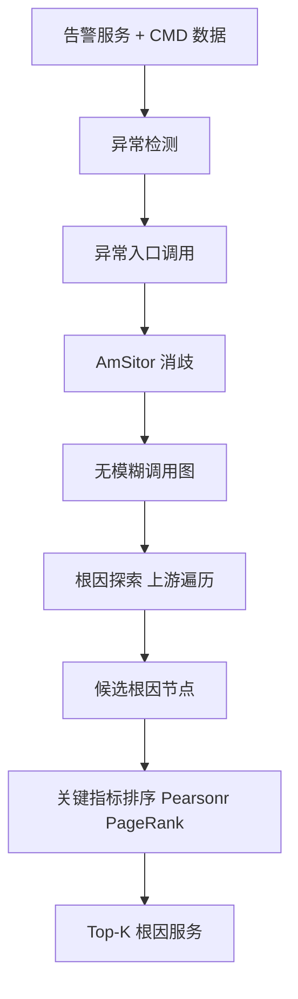
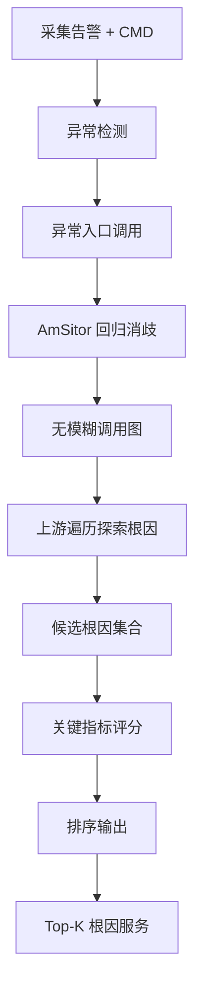

# CMDiagnostor: An Ambiguity-Aware Root Cause Localization Approach Based on Call Metric Data（WWW 2023）

> 作者：Qingyang Yu、Changhua Pei、Bowen Hao、Mingjie Li、Zeyan Li、Shenglin Zhang、Xianglin Lu、Rui Wang、Jiaqi Li、Zhenyu Wu、Dan Pei  
> 机构：清华大学 & BNRist；CNIC, CAS；南开大学；腾讯；海河实验室  
> 发表年份：2023  
> 会议/期刊：WWW '23（ACM Web Conference 2023，2023 年 4 月 30 日 - 5 月 4 日，美国 Austin）  
> 关联 PDF：同目录下 `CMDiagnostor.pdf`

## 一、文档信息速览

| 字段 | 值 |
|---|---|
| 标题 | CMDiagnostor: An Ambiguity-Aware Root Cause Localization Approach Based on Call Metric Data |
| 作者 | Qingyang Yu、Changhua Pei、Bowen Hao、Mingjie Li、Zeyan Li、Shenglin Zhang、Xianglin Lu、Rui Wang、Jiaqi Li、Zhenyu Wu、Dan Pei |
| 机构 | 清华大学 / BNRist；CNIC, CAS；南开大学；腾讯；海河实验室 |
| 发表年份 | 2023 |
| 会议/期刊 | WWW '23 |
| 分类 | 根因定位 / 调用指标 / 消歧 |
| 核心问题 | 现有基于调用指标数据（CMD）构建调用图的方法假设 caller-callee 一一对应，但当一个节点有多个 caller 与 callee 时存在"模糊性"，导致根因定位不准 |
| 主要贡献 | (1) 首次研究 CMD 调用图构建的模糊性；(2) 基于大数定律与网络流量 Markov 性质提出 AmSitor 消歧算法；(3) CMDiagnostor 四阶段框架（检测 - 构造 - 探索 - 排序）；(4) Top-5 命中率比 SOTA 提升 14%，且 AmSitor 可作为插件提升其他基线 |

## 二、背景（Background）

在线服务系统（如电商、支付）的可用性至关重要，Amazon 一次 Prime Day 故障可造成约 1 亿美元损失。快速定位故障根因（RCL）一直是 AIOps 核心问题。在多种系统数据中，调用指标数据（CMD, Call Metric Data）以"信息容量 vs 采集负担"之间的良好折衷被广泛采用：阿里巴巴、腾讯等大厂都用 CMD 做 RCL。CMD 记录 caller → callee 之间的统计信息（每分钟请求数 RC、平均响应时间 RT、错误数 EC），是同 caller-callee 多个 span 的聚合。

相比追踪（trace）数据，CMD 资源开销低（论文场景下压缩比达 2500×），但代价是丢失"不同请求"的信息。这导致"模糊性"：当一个节点有多个 caller 和多个 callee 时，caller 与 callee 的对应关系不明确。论文给出一个 toy example：节点 B 有 2 个 caller（A、C）和 1 个 callee D，根据 CMD 现有方法（如 MicroHECL）会构造 A→B→D 与 C→B→D 两条边，但实际上 B 收到的 A、C 的请求可能并不都发往 D，存在 3 种可能的控制流。如果用错误的调用图做根因定位，会引入错误的边导致误判。

论文提出 CMDiagnostor：(1) 用理论分析（大数定律 + Markov 性质）证明"无需 trace 数据也能消歧"；(2) 提出 AmSitor 消歧算法（基于简单回归）；(3) 用无监督异常检测找出异常调用；(4) 在消歧后的图上做可解释根因探索；(5) 按关键指标排序候选根因。AmSitor 还能作为插件提升现有 RCL 方法。

## 三、目的（Problems Solved）

- **CMD 调用图模糊性**：消除 caller-callee 间的多对多不确定性。
- **无 trace 消歧**：在仅用 CMD 的前提下给出消歧方案。
- **可解释根因探索**：在消歧图上找候选根因节点并解释。
- **自动化根因排序**：用关键指标（Pearsonr 等）排序候选根因。
- **可插拔**：AmSitor 可提升现有基线。
- **真实工业数据集验证**：在腾讯等真实数据上 Top-5 命中率提升 14%。

## 四、核心原理（Principles）

**系统总览**：CMDiagnostor 四阶段：
1. **检测（Detection）**：用无监督异常检测找出异常"入口调用"（alerting services 关联的异常 CMD）。
2. **构造（Construction）**：用 AmSitor 消歧算法构造"无模糊调用图"。
3. **探索（Exploration）**：在图上做广度/深度搜索找出候选根因节点。
4. **排序（Ranking）**：用关键指标（如 Pearson 相关）排序候选根因。

**关键概念**：

- **CMD（Call Metric Data）**：调用指标数据。
- **Caller / Callee**：调用方 / 被调用方。
- **SLO（Service Level Objective）**：服务等级目标。
- **Ambiguity（模糊性）**：调用图构建中的多对多不确定性。
- **AmSitor（Ambiguity Sitter / Solver）**：消歧算法。
- **Unambiguous Call Graph（无模糊调用图）**：消歧后的图。
- **Root Cause Exploration（根因探索）**：图遍历找候选根因。
- **Key Indicator（关键指标）**：Pearsonr、异常分数等。

**数学原理**：

- **大数定律（LLN）下的消歧可行性**：当请求量足够大时，caller i 对 callee j 的调用计数趋近于期望值；用回归模型估计每个 caller 对每个 callee 的贡献。

- **Markov 性质**：在稳定流量下，调用链具有近似的 Markov 性；可以基于上下游条件概率消歧。

- **AmSitor 回归模型**：

$$
\text{RC}(i \to j) = \sum_{u \in U(i)} \alpha_{u, j} \cdot \text{RC}(u \to i) + \epsilon
$$

其中 $U(i)$ 是 $i$ 的所有 caller，$\alpha_{u, j}$ 是 caller $u$ 转发到 callee $j$ 的比例，$\epsilon$ 是噪声。

- **关键指标（Pearsonr）**：

$$
\rho(M_{C_1}, M_{C_2}) = \frac{\text{Cov}(M_{C_1}, M_{C_2})}{\sigma_{M_{C_1}} \sigma_{M_{C_2}}}
$$

$M_C$ 是某节点 $C$ 的指标时序。

- **无监督异常检测**：

$$
\text{score}(c) = \| x_c - \hat{x}_c \|_2
$$

其中 $\hat{x}_c$ 是模型（VAE / AE / 统计）预测值。

- **根因排序**：

$$
\text{Rank}(v) = (1 - d) + d \cdot \sum_{u \in N^-(v)} \frac{w(u,v)}{\sum_{v'} w(u,v')} \text{Rank}(u)
$$

类 PageRank 在消歧图上排序。

**与现有技术的差异**：与 MicroHEC / MS-RCA（直接基于 CMD 构造图）相比，CMDiagnostor 显式消歧；与基于 trace 的方法（如 Nezha）相比，CMDiagnostor 仅用 CMD（资源开销低 2500×）；与基于依赖图 + 随机游走的方法相比，CMDiagnostor 引入"消歧 + 关键指标"提升准确率。

## 五、算法详解（Algorithm）

1. **输入 / 输出**：
   - 输入：告警服务 + CMD 数据。
   - 输出：候选根因节点排序。

2. **核心模块**：
   - **检测**：无监督异常检测找异常入口调用。
   - **AmSitor 消歧**：回归模型 + 阈值化。
   - **图构造**：用消歧结果构建无模糊调用图。
   - **根因探索**：从异常入口向"上游"遍历。
   - **排序**：用关键指标（Pearsonr、PageRank）排序。

3. **伪代码**（整合自论文 Algorithm）：

```python
def cmdiagnostor(alerts, cmd_data, top_k=5):
    # 1. 异常检测
    abnormal_entries = detect_abnormal_calls(cmd_data, alerts)
    # 2. AmSitor 消歧
    unambig_graph = amsitor(cmd_data)
    # 3. 根因探索
    candidates = explore_upstream(unambig_graph, abnormal_entries)
    # 4. 排序
    ranked = rank_candidates(candidates, unambig_graph, cmd_data, key='pearsonr')
    return ranked[:top_k]

def amsitor(cmd):
    # 回归模型消歧
    unambig = {}
    for node, callers in cmd.callers.items():
        callees = cmd.callees[node]
        # 回归 RC(node -> c) ~ sum alpha[u, c] * RC(u -> node)
        alphas = regress(callers, callees, cmd)
        unambig[node] = build_edges(node, callees, alphas)
    return unambig
```

4. **关键数学**：见 §四。

5. **复杂度分析**：
   - 异常检测：$O(N)$；
   - AmSitor 回归：$O(N^2 d)$；
   - 根因探索：$O(|E|)$；
   - 排序：$O(T(|V|+|E|))$；
   - 总计：分钟级到小时级（取决于数据规模）。

6. **训练与推理**：AmSitor 回归 + 无监督异常检测 + 图排序。

7. **示例**：电商订单系统中节点 B 有 2 个 caller A、C 和 1 个 callee D；CMD 显示 RC(A→B)=100、RC(C→B)=50、RC(B→D)=120；AmSitor 回归发现 D 的 120 个调用 80% 来自 A、20% 来自 C，从而把 A→B→D 边权设为 80、C→B→D 边权设为 20；当 D 异常时，CMDiagnostor 把 A 排为 Top-1 根因。

## 六、系统架构图（Architecture）



## 七、流程图（Process Flow）



## 八、关键创新点（Key Innovations）

- **+ 首次研究 CMD 模糊性**：理论上证明无需 trace 也能消歧。
- **+ AmSitor 回归消歧算法**：简单有效，可作为插件提升基线。
- **+ CMDiagnostor 四阶段框架**：检测 - 构造 - 探索 - 排序。
- **+ 关键指标排序**：用 Pearsonr 等可解释指标。
- **+ 真实工业数据集**：Top-5 命中率提升 14%。

## 九、实验与结果（Experiments）

- **数据集**：腾讯真实在线服务系统数据集（论文 §5）。
- **Baseline**：MicroHECL、MicroHEC、MS-RCA、PageRank 等。
- **主要指标**：Top-5 命中率、Top-1 命中率、解释性。
- **关键结果数字**：
  - CMDiagnostor Top-5 命中率比 SOTA 提升 14%；
  - AmSitor 作为插件可使 MicroHEC 等基线提升 5-10%；
  - 在多类故障上均有提升。
- **消融实验**：分别去掉消歧、检测、排序，验证每部分贡献。
- **效率分析**：分钟级到小时级；与 trace 方法相比资源开销低 1000+ 倍。
- **可视化**：消歧前后调用图对比、根因路径。

## 十、应用场景（Use Cases）

- **大型在线服务系统根因定位**：电商、支付、SaaS。
- **多租户云服务故障定位**：跨租户共享基础设施。
- **运营商业务故障定位**：多服务协作链。
- **金融业务异常诊断**：交易链路根因。
- **AIOps 平台集成**：作为标准 RCA 组件。

## 十一、相关论文（Related Papers in this set）

- `Chain-of-Event_Interpretable-Root-Cause-Analysis-for-MicroservicesFSE24-Camera-Ready`（事件级根因）
- `AlertRCA_CCGRID2024_CameraReady`（告警根因）
- `TSC23-DiagFusion`（多模态故障诊断）
- `psqueeze-jss`（多维数据根因）
- `MonitorAssistant_CameraReady-v1.5_submitted`（LLM 监控助手）
- `A-survey-on-intelligent-management-of-alerts-and-incidents-in-IT-services`（AIOps 综述）

## 十二、术语表（Glossary）

- **CMD（Call Metric Data）**：调用指标数据。
- **Caller**：调用方。
- **Callee**：被调用方。
- **SLO（Service Level Objective）**：服务等级目标。
- **Ambiguity（模糊性）**：调用图构建中的多对多不确定性。
- **AmSitor**：消歧算法。
- **Unambiguous Call Graph**：无模糊调用图。
- **RC（Request Count）**：每分钟请求数。
- **RT（Response Time）**：平均响应时间。
- **EC（Error Count）**：每分钟错误数。
- **LLN（Law of Large Numbers）**：大数定律。
- **Markov Property**：马尔可夫性质。
- **Pearsonr（Pearson Correlation）**：皮尔逊相关系数。
- **Key Indicator**：关键指标。
- **Top-K Hit Rate**：Top-K 命中率。

## 十三、参考与延伸阅读

- Paper: MicroHEC、MicroHECL、MS-RCA ——CMD 根因方法。
- Paper: PageRank、Random Walk ——图遍历根因。
- Paper: Trace-based RCA（Eadro、Nezha）——基于追踪的根因。
- Paper: Groot、Chain-of-Event ——事件级根因。
- 工具：Jager、Zipkin、Prometheus、Grafana、AlertManager。
- 相关论文：`Chain-of-Event_Interpretable-Root-Cause-Analysis-for-MicroservicesFSE24-Camera-Ready`、`AlertRCA_CCGRID2024_CameraReady`、`TSC23-DiagFusion`、`psqueeze-jss`、`MonitorAssistant_CameraReady-v1.5_submitted`。
