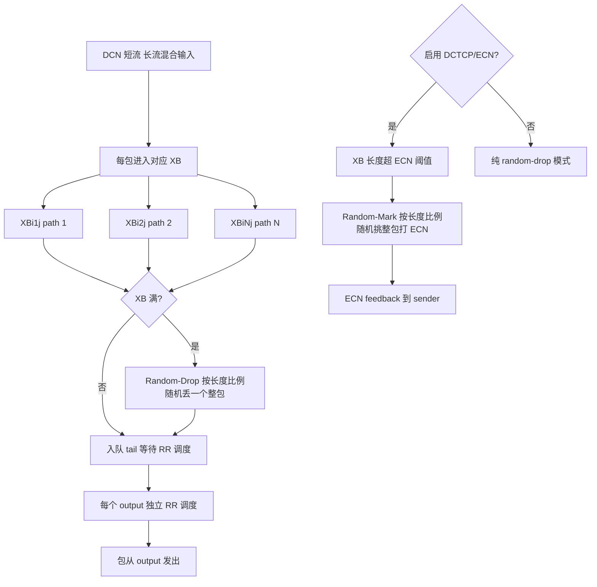
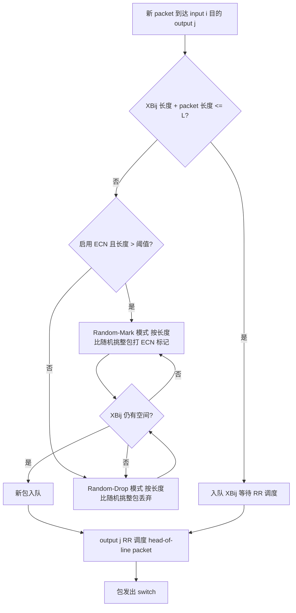

# CQRD: Alleviating Flow Interference in Data Center Networks through Fine-Grained Switch Queue Management（Computer Networks 2015）

> 作者：Guo Chen, Youjian Zhao, Dan Pei（通讯作者）
> 机构：清华大学计算机科学与技术系（北京 100084）
> 发表年份：2015
> 会议/期刊：Computer Networks, vol. 91, pp. 593–613, 2015（Elsevier；会议初版 LCN 2014）
> 关联 PDF：同目录下 `CQRD-ComputerNetworks15.pdf`

## 一、文档信息速览

| 字段 | 值 |
|---|---|
| 标题 | Alleviating flow interference in data center networks through fine-grained switch queue management |
| 作者 | Guo Chen、Youjian Zhao、Dan Pei（通讯作者） |
| 机构 | 清华大学计算机科学与技术系 |
| 发表年份 | 2015 |
| 会议/期刊 | Computer Networks (Elsevier)，vol. 91，pp. 593–613；会议初版 LCN 2014 |
| 分类 | 数据中心网络 / 交换机队列管理 / 短流优化 |
| 核心问题 | commodity DCN 交换机输出队列（OQ）让少量长流占用大部分 buffer + link，让 ~90% 短流（<100KB）的 FCT 升高 10× |
| 主要贡献 | (1) 提出 CQRD：crosspoint-queue with random-drop，零端主机协议栈改动；(2) 在 ECN/DCTCP 环境下扩展为 random-mark 方案；(3) NS2 仿真：单交换机短流 FCT 下降 >25%，多级 DCN 下降 30–50%；(4) 通过配置 Broadcom BCM56842 实现 8×8 逻辑 CQRD 交换机，real testbed 验证 |

## 二、背景（Background）

DCN 承载搜索、web retail、社交等实时交互业务，>90% 流是延迟敏感的短流（<100KB），但少数"带宽贪婪型"长流（如 backup、replication）会占据共享 OQ 的 buffer + link 资源，让短流排队/丢包，FCT 增加 10× 以上。

DCTCP、HULL、D²TCP 等 transport-layer 方案通过 ECN 调速尝试把队列维持在低位，但 bursty traffic 下精确速率控制很难。pFabric、PDQ 等流调度方案在多跳 DCN 中调度延迟过长，且需要大量端/网元改动。HCF（Hashed Credits Fair）基于 hash + credit 公平分享 HP/LP 队列，但粒度仍不够细。

论文提出用"fine-grained queue management"解决根因：把 commodity OQ 拆为"输入-输出对" 粒度的 crosspoint queue（XB），给每个流路径提供"flow separation"，再在 XB 满时用 random-drop 减少同 path 内长短流相互挤占。论文 §III 用 toy example（7 短流 + 2 长流到同一 8 端口 OQ 交换机）量化 OQ/HCF/CQ 的差异：短流 FCT 在 CQ 上比 OQ 低 3 个数量级、比 HCF 低 1 个数量级。

## 三、目的（Problems Solved）

- **OQ 中长流挤占短流**：用 crosspoint 队列为"不同输入-输出对"提供物理 buffer 隔离，path-contending 短流不再与长流共享 buffer。
- **HCF 仍不够细**：HCF 的 hash-credit 粒度仅到 bin，bin 内部仍可能 hash 冲突。
- **纯 CQ 满队列 tail-drop 不公平**：随机丢整包无法保障小流 packet 进入。
- **DCN 短流 FCT 数量级下降**：仿真上 CQRD 让单交换机短流 FCT 下降 >25%，多级 DCN 下降 30–50%。
- **与 DCTCP/ECN 协同**：当 buffer 超过标记阈值，用 random-mark 替代 random-drop，避免短流被误标记。
- **可增量部署**：50% ToR 部署即可让短流 FCT 下降 10–24%。
- **可配置 commodity 交换机实现**：无需 ASIC 重设计，用现有 Broadcom BCM56842 即可。

## 四、核心原理（Principles）

**定义**：
- **Output Contending**：两流在同一 switch 共享同一输出端口。
- **Switch Path**：同一 switch 的输入-输出对。
- **Path Contending**：两流在同一 switch path 上时间重叠。
- **OC-PC**：output contending but not path contending（论文重点优化的"大多数"短流场景）。

**Queue 管理演进**：
- **OQ**：所有 OC 流共享输出 buffer，tail-drop；G/D/1/K 排队模型，丢包率随利用率指数增长。
- **HCF**：把每个输出 buffer 拆为 HP/LP，对 flow hash 到 bin 后按 credit 投放；HP 服务空后与 LP 交换。
- **CQ**：每个 input-output pair 单独 buffer（XB），用 RR 调度；提供完全流分离，但 tail-drop 时大流继续占满小流的 buffer。
- **CQRD**：在 CQ 基础上，把 tail-drop 改为 **random-drop**：XB 满时按 packet 长度比例随机挑一个整包丢弃，给小流"露脸"机会。

**关键数学（§4.3）**：
对 path-contending 短流 Fs2 的 RTT 比较：

$$
RTT_c = \bar N \cdot (\bar L_c - \bar D) \cdot t \le N \cdot \frac{L}{2} \cdot t = RTT_o
$$

其中 $\bar N$ 是平均同时有 packet 的 XB 数，$\bar L_c$ 是 XB 平均长度，$\bar D$ 是被 random-drop 的 packet 数。

丢包率比较（Eq. 5）：

$$
Loss_c = P_{Loss_c} \cdot \frac{L_{s2}}{L} < Loss_o = P_{Loss_o}
$$

当 $P_{Loss_c}/P_{Loss_o} < L/L_{s2}$（小流 $L_{s2}$ 占 buffer 很少）即成立。

**吞吐保持**：极端情况下 2 个长流共用同一 XB，需要 BDP 缓冲（生产 DCN 约 25KB @ 1Gbps×200μs）。48×48 CQRD 约 58MB on-chip memory 即可；当前 commodity ASIC 可支持 128×128（25KB XB）或 48×48（250KB XB）。

**DCTCP/ECN 集成（§4.3.3）**：当 XB 长度超过 ECN 阈值时，不是简单标记新包，而是用 random-mark 从 buffer 中（含新包）按长度比例随机挑一个整包打 ECN 标记，进一步降低短流被误标记概率。

**Work-conserving + Random-Drop 调度**：
- **Arrival phase**：对每个新 packet，XB 若有空间直接入队；若没空间，按长度比例随机挑一个 packet 丢弃（可能是新包或老包），循环直到有空间。
- **Departure phase**：每个输出独立 RR 选择非空 XB，调度整包。

## 五、算法详解（Algorithm）

1. **输入 / 输出**
   - 输入：$N \times N$ 交换机；每 XB 容量 $L$ cells；traffic 流。
   - 输出：每流 packet 调度结果（入队 / 丢弃 / 标记）；统计 FCT、goodput、丢包率。
2. **核心模块**
   - **Crosspoint Buffer Allocation**：每对 input-output 分配独立 XB，容量 $L$。
   - **Round-Robin Scheduler**：每个输出独立按 RR 顺序调度非空 XB 中的 head-of-line packet。
   - **Random-Drop on Full XB**：XB 满时按 packet 长度比例随机丢弃一个整包，给小流留 entry 机会。
   - **Random-Mark for ECN**：当 XB 长度超过 ECN 阈值时按相同比例随机挑一个整包打 ECN 标记。
   - **Commodity Switch Configuration**：把 OQ 拆为 priority queue（per-input）+ RED random-drop，逻辑等效 CQRD。
3. **伪代码**

```python
class CQRDXBuf:
    def __init__(self, capacity_L):
        self.cap = capacity_L
        self.queue = []  # list of (cells_per_pkt, start_of_packet)
        self.length = 0  # current cell count

    def arrival(self, pkt_cells, ecn_threshold=None):
        if self.length + pkt_cells <= self.cap:
            self.queue.append(pkt_cells)
            self.length += pkt_cells
        else:
            # Random-drop loop
            while self.length + pkt_cells > self.cap:
                # pick random packet weighted by cell count
                weights = [p for p in self.queue]
                victim_idx = weighted_choice(range(len(self.queue)), weights)
                victim_cells = self.queue.pop(victim_idx)
                self.length -= victim_cells
                if victim_idx == len(self.queue):  # 丢弃的是新包
                    return False  # new packet dropped
            # 入队新包（或在 ECN 模式下打标记）
            if ecn_threshold and self.length > ecn_threshold:
                # random-mark: 也可能标记新包
                self.mark_randomly(ecn_threshold)
            self.queue.append(pkt_cells)
            self.length += pkt_cells
        return True

    def departure_round_robin(self, output_selector):
        # 由 output 调度器从其列中选非空 XB
        for xb in output_selector:
            if xb.queue:
                pkt = xb.queue.pop(0)
                xb.length -= pkt
                return pkt
        return None
```

4. **关键数学**：见 §四。
5. **复杂度分析**
   - 调度：$O(N)$ RR 选 XB 头；
   - Random-Drop：$O(1)$ per arrival（pipelined，cell-by-cell 流水线化后无额外 latency）；
   - 实现：BCM56842 8×8 逻辑 CQRD 仅需 8 个 priority queue + WRR + ingress ICAP classification + RED 即可（论文 §5.1）。
6. **训练与推理**：无机器学习；纯交换机内部启发式。
7. **示例**：24×24 交换机单层仿真：5MB 总 buffer 拆为 ~210KB/output（OQ）、~105KB HP + 105KB LP（HCF）、~9KB XB（CQRD）；6000 flow 在 moderate 10% / heavy 40% / extreme 70% 三种负载下，CQRD 平均短流 FCT 比 HCF/OQ 低 25%+、比 CQ 低 5–7%；99 分位仍低 10%+。

## 六、系统架构图（Architecture）



## 七、流程图（Process Flow）



## 八、关键创新点（Key Innovations）

- **+ 把 classic CQ 引入 DCN 交换机**：跨领域借鉴 internet router 思想但用现代 ASIC 实现。
- **+ Random-Drop 替代 tail-drop**：在 XB 满时按 packet 长度比例随机丢整包，给小流"露脸"机会。
- **+ Random-Mark 适配 DCTCP/ECN**：避免 OQ 中短流被误标记。
- **+ commodity 交换机可配置实现**：在 Broadcom BCM56842 上用 priority queue + WRR + RED 模拟，论文 §5.1 给出 8×8 物理配置。
- **+ 增量部署**：50% ToR 部署即可让短流 FCT 下降 10–24%。
- **+ 25%–50% 短流 FCT 下降**：单交换机 >25%，多级 DCN 30–50%，长流 goodput 仅小幅下降。
- **+ 与 transport 协同**：与 DCTCP 叠加可再降 30–40%。

## 九、实验与结果（Experiments）

- **NS2 仿真**：
  - **Experiment 1（24×24 单交换机）**：5MB 物理 buffer，10Gbps 端口 + 4μs 链路延迟 = 16μs RTT。6000 flow 随机端口。在 10%/40%/70% 负载下，CQRD 平均短流 FCT 比 HCF/OQ 低 25%+、99 分位低 10%+；长流 goodput 几乎与 HCF/OQ 持平（<5% 下降）。
  - **Experiment 2（480 host 多级 DCN）**：24 racks × 20 hosts + 24 ToR + 2 Agg（每 Agg 5MB buffer / 10×10Gbps ToR 端口 + 4×10Gbps 上行）+ ECMP。20000 flow。CQRD 平均短流 FCT 比 HCF/OQ 低 30–50%，比 CQ 低 6–8%；99 分位显著优于其他；长流 goodput 几乎一致。
  - **Experiment 3（增量部署）**：按 partition/cluster 或 tier 级别 50% 部署 CQRD，平均短流 FCT 仍可下降 10–24%；全部 ToR 部署时下降 30–50%。
  - **Experiment 4（buffer 大小影响）**：XB ≥ 9KB 时 CQRD 性能已接近极限；buffer 进一步增加收益递减。
  - **Experiment 5（DCTCP 协同）**：CQRD + DCTCP 比 OQ + DCTCP 短流 FCT 再降 30–40%。
- **Testbed 实施**：8×8 logical CQRD on Broadcom BCM56842（32×32 10Gbps 交换机，9MB shared buffer，拆为 8 priority queue 每 output、WRR、ICAP classification + RED 模拟 random-drop）。小规模验证。
- **Back-of-envelope 计算**：48×48 CQRD 需约 58MB on-chip memory（每 XB ≥ 25KB BDP）；128×128 CQRD 用更小 XB 仍可工作；当前 ASIC 工艺可支持 48×48 250KB XB（适配 100Gbps×20μs BDP）。

## 十、应用场景（Use Cases）

- **大型 DCN 短流优化**：搜索、广告、电商 partition-aggregate 等 90% 短流场景。
- **混合 criticality 工作负载**：长短流并存，short flow latency 关键。
- **可增量部署**：50% ToR 部署即可获益，避免一次性硬件替换。
- **与 DCTCP / ECN 共存**：在已部署 DCTCP 的 DCN 中进一步优化。
- **可复用到其它共享 buffer 交换机**：论文设计思路可用于其他 on-chip memory 充足的可编程交换机。

## 十一、相关论文（Related Papers in this set）

- `CQRD-LCN`（会议短版 LCN 2014）
- `F2Tree-ICDCS15` / `f2tree`（Fat Tree 快速故障恢复）
- `FUSO-ATC16`（多路径 TCP 快速重传）
- `conext15-final2`（FUNNEL 软件变更性能评估）
- `NLB-ICCCN2015-paper`（NDN 直播 WLAN）
- `Multi-AS-cooperative-incoming-traffic-engineering-in-a-transit-edge-separate-internet-zhang2014`（LISP 边 AS 协作 TE）
- `firewall`（防火墙指纹与 DoF 攻击）
- `chen_npc14_CQ`（CQ 交换机 buffer 容量设计）

## 十二、术语表（Glossary）

- **DCN (Data Center Network)**：数据中心网络。
- **OQ (Output Queue)**：传统 commodity 交换机输出队列。
- **HP / LP Queue**：HCF 引入的高/低优先级队列。
- **CQ (Crosspoint Queue)**：crossbar 输入-输出对粒度的 buffer。
- **CQRD (Crosspoint-Queue with Random-Drop)**：本文方案。
- **XB (Crosspoint Buffer)**：CQ 交换机中每对输入-输出之间的 buffer。
- **RR / WRR (Round-Robin / Weighted RR)**：调度策略。
- **ICAP (Ingress Content Aware Processor)**：BCM56842 入向分类器。
- **RED (Random Early Detection)**：随机早期检测，可模拟 random-drop。
- **FCT (Flow Completion Time)**：流完成时间。
- **Goodput**：应用层吞吐。
- **OC / OC-PC / PC**：output contending / output contending but not path contending / path contending。
- **BDP (Bandwidth-Delay Product)**：带宽-时延积，决定 XB 大小下界。
- **ASIC**：Application-Specific Integrated Circuit。
- **ECN / DCTCP**：显式拥塞通知 / Data Center TCP。
- **Random-Mark / Random-Drop**：随机标记 / 随机丢弃。
- **G/D/1/K**：排队论中通用到达/确定服务/单服务器/K 容量。
- **Tail-drop / Head-drop**：队尾/队头丢弃。

## 十三、参考与延伸阅读

- Paper: CQRD Computer Networks 2015（本文，期刊扩展版）。
- Paper: CQRD LCN 2014（会议短版）。
- Paper: DCTCP（Alizadeh et al., SIGCOMM 2010）——DCN TCP 拥塞控制。
- Paper: HCF（SIGCOMM 2014 / CoNEXT 2014）——基于 hash + credit 的 DCN 公平队列。
- Paper: pFabric / PDQ（SIGCOMM 2013 / NSDI 2012）——流调度方案。
- Paper: D²TCP、HULL、pHost 等 transport 层方案。
- 工具：NS2、Quagga、iperf、Linux kernel TCP 栈。
- 相关论文：`CQRD-LCN`、`F2Tree-ICDCS15`、`f2tree`、`FUSO-ATC16`、`conext15-final2`、`NLB-ICCCN2015-paper`、`Multi-AS-cooperative-incoming-traffic-engineering-in-a-transit-edge-separate-internet-zhang2014`、`firewall`、`chen_npc14_CQ`。
