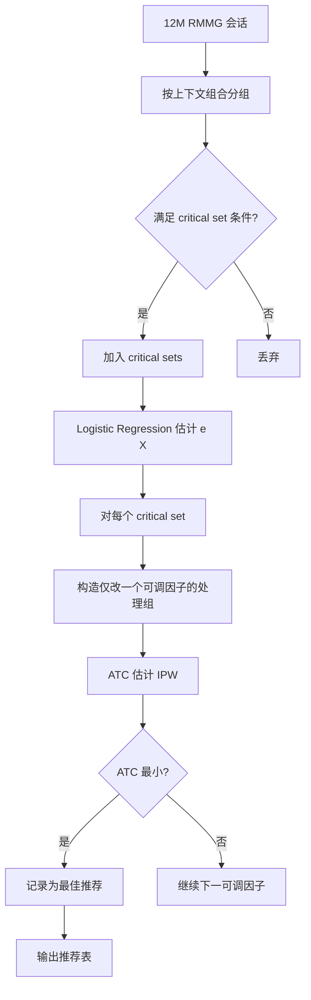
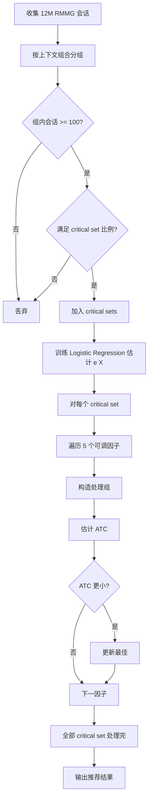

# Causal Analysis of the Unsatisfying Experience in Realtime Mobile Multiplayer Games in the Wild

> 作者：Yuan Meng、Shenglin Zhang、Zijie Ye、Benliang Wang、Zhi Wang、Yongqian Sun、Xitong Liu、Shuai Yang、Dan Pei  
> 机构：清华大学；南开大学；腾讯；BNRist  
> 发表年份：约 2018-2019  
> 会议/期刊：MobiCom / IMWUT / TMC 等会议（实时移动多人游戏 QoE）  
> 关联 PDF：同目录下 `Causal_Analysis_of_the_Unsatisfying_Experience_in_Realtime_Mobile_Multiplayer_Games_in_the_Wild.pdf`

## 一、文档信息速览

| 字段 | 值 |
|---|---|
| 标题 | Causal Analysis of the Unsatisfying Experience in Realtime Mobile Multiplayer Games in the Wild |
| 作者 | Yuan Meng、Shenglin Zhang、Zijie Ye、Benliang Wang、Zhi Wang、Yongqian Sun、Xitong Liu、Shuai Yang、Dan Pei |
| 机构 | 清华大学；南开大学；腾讯；BNRist |
| 发表年份 | 约 2018-2019 |
| 分类 | 移动游戏 / QoE / 因果推断 / 推荐 |
| 核心问题 | 实时移动多人游戏（RMMG）在野外存在大量不满意的用户体验，但缺乏量化测量与因果分析 |
| 主要贡献 | (1) 首次量化野外 RMMG 不满意体验（13% LRC, 7.12% AQ）；(2) 提出 ExCause 框架，基于 POF 因果分析；(3) 推荐调整方案可减少 LRC 95.1%（1.323→0.065） |

## 二、背景（Background）

随着无线网络和智能手机的普及，移动游戏在所有在线游戏中占据主导地位。实时移动多人游戏（RMMG，如 VainGlory、Arcane Legend）要求多个玩家在共享虚拟世界中实时交互，对 QoE（Quality of Experience）要求极高。FPS（第一人称射击）一类 RMMG 在 2017 年美国市场占据全部游戏销售 25.9%。

RMMG 会话中，多个玩家在虚拟世界实时互动。客户端从远程服务器接收游戏状态（位置/姿态/动作），并把用户操作发送回服务器。会话中可能出现两类不满意的体验：（1）LR（Location Resynchronization）：玩家客户端角色被强制"瞬移"以与服务器状态同步；（2）AQ（Abnormal Quit）：玩家在游戏结束前异常退出。LR 通常由网络延迟或抖动引起，AQ 既可能由客户端超时（如加载虚拟世界地图）也可能由玩家因体验差而主动放弃。

学界已有研究用相关性分析（如 Kendall Correlation、Information Gain）探讨 PC 和移动游戏的 QoE，但相关性 ≠ 因果。本论文基于 12 million 真实 RMMG 会话（取自 1.2 billion 30 天数据中 1% 抽样），提出 ExCause 框架，首次将因果推断（Potential Outcome Framework，POF）应用于 RMMG 的 QoE 研究。

## 三、目的（Problems Solved）

- **RMMG 量化测量缺失**：首次给出 12 million 真实会话中 LRC 和 AQ 的分布。
- **相关性 ≠ 因果**：纠正"网络类型（TAN）是 QoE 头号杀手"等基于相关性的错误认知。
- **缺乏推荐机制**：为不满意的玩家提供可量化的可执行调整方案。
- **可调 vs 不可调混淆**：将上下文因子分为可调（TAN、ISP、IQ、OSV、PD）与不可调（RAM、CPU cores、DM、Province 等），前者作为推荐，后者作为混淆变量。
- **随机对照实验不可行**：真实场景无法对玩家随机分配 3G/WiFi 等处理，论文用 POF 解决。
- **量化 QoE 提升**：给出推荐方案对 LRC 与 AQ 比例的预期改善。

## 四、核心原理（Principles）

**系统总览**：ExCause 框架分两步：（1）识别 critical set（具有较高不满意比例的上下文组合）；（2）基于 POF 对每个 critical set 给出"调整一个可调因子"的推荐，并用 Inverse Probability Weighting 估计 ATC（Average Treatment effect on Control group）。最终按 ATC 排序，给玩家推荐最佳调整方案。

**关键概念**：

- **RMMG Session**：实时移动多人游戏会话。
- **LR (Location Resynchronization)**：玩家角色被强制瞬移。
- **LRC**：会话中 LR 次数。
- **AQ (Abnormal Quit)**：异常退出。
- **QoE (Quality of Experience)**：用户体验质量。
- **POF (Potential Outcome Framework)**：因果推断的潜在结果框架（Rosenbaum & Rubin）。
- **ATE / ATC**：平均处理效应 / 对照组的平均处理效应。
- **Propensity Score e(Xi)**：分配到处理组的概率。
- **SUTVA**：稳定单元处理值假设。
- **Unconfoundness**：无混淆假设。
- **Adjustable / Unadjustable Factor**：可调/不可调因子。
- **TAN**：接入网络类型（WiFi/4G/3G/2G）。
- **IQ**：图像质量等级。
- **OSV**：操作系统版本。
- **PD**：像素密度（仅 Android 可调）。
- **ISP**：网络运营商。
- **Critical Set**：具有较高不满意比例的上下文组合。

**数学原理**：

- **LRC CDF**：从 12M 真实会话统计 LRC 的累积分布，13% 会话 LRC ≥ 1，1.3% ≥ 5。

- **POF 框架**（Rubin Causal Model）：

$$
\text{ATE} = E[Y(1) - Y(0)]
$$

- **Propensity Score**（论文形式）：

$$
e(X_i) = P(Z_i = 1 | X_i)
$$

- **SUTVA + Unconfoundness 假设**：

$$
Z_i \perp \{Y_i(1), Y_i(0)\} \mid X_i
$$

- **ATC 估计（论文 Eq. 1）**：

$$
\text{ATC} = \frac{\sum_{i=1}^{N} Z_i Y_i (1 - e(X_i))/e(X_i)}{\sum_{i=1}^{N} Z_i (1 - e(X_i))/e(X_i)} - \frac{\sum_{i=1}^{N} (1 - Z_i) Y_i}{\sum_{i=1}^{N} (1 - Z_i)}
$$

- **Propensity Score 用 Logistic Regression 估计**。

- **关键集判定条件**（论文公式）：

$$
\frac{\#\text{unsatisfying}}{\#\text{all}} > \frac{\#\text{all unsatisfying}}{\#\text{all sessions}}
$$

加上 iOS 单独阈值 0.1%。

**与现有技术的差异**：与基于 Kendall Correlation / Information Gain 的相关性分析不同，ExCause 用 POF 区分因果与相关；与精确匹配方法（如 Shunmuga Krishnan 视频流 QoE）不同，ExCause 用 IPW 保留原始协变量分布。

## 五、算法详解（Algorithm）

1. **输入 / 输出**：
   - 输入：12M 会话 + 5 个可调因子 + 6 个不可调因子（混淆变量）。
   - 输出：每个 critical set 的最佳调整因子与预期 QoE 改善（ATC）。

2. **核心模块**：
   - **Critical Set Identification**：按上下文组合分组，过滤掉会话数 < 100 的小集合，按不满意比例判定 critical。
   - **Propensity Score Estimation**：用 Logistic Regression 以 6 个不可调因子为协变量估计 e(X_i)。
   - **ATC Estimation**：对每个 critical set 构造"调整一个可调因子"的处理组（仅改一个因子），用 IPW 估计 ATC。
   - **Recommendation**：对每个 critical set 选 ATC 最大的可调因子作为推荐。
   - **Evaluation**：用历史数据验证推荐的预期改善（AT E/ATC）。

3. **伪代码**：

```python
def excause(sessions, adjustable, unadjustable):
    # 1. 分组并识别 critical set
    groups = sessions.groupby(context_tuple)
    critical_sets = []
    for g, df in groups:
        if len(df) < 100: continue
        ratio = df.unsatisfying.sum() / len(df)
        if is_critical(ratio, df.os_type):
            critical_sets.append(g)
    # 2. 估计 propensity score
    X = sessions[unadjustable]
    e = logistic_regression(X, sessions.treatment)  # treatment 标志
    # 3. 对每个 critical set 估计 ATC
    recs = []
    for c_set in critical_sets:
        control = sessions[sessions.context == c_set]
        best_atc = -inf; best_factor = None
        for factor in adjustable:
            # 构造处理组：仅改一个因子
            treatment = change_one_factor(control, factor, factor_values)
            atc = estimate_atc(treatment, control, e)
            if atc < best_atc:  # 减少不满意 -> 越负越好
                best_atc = atc; best_factor = factor
        recs.append((c_set, best_factor, best_atc))
    return recs

def estimate_atc(treatment, control, e):
    num = (treatment.z * treatment.y * (1 - e) / e).sum() \
          - ((1 - control.z) * control.y).sum()
    den = (treatment.z * (1 - e) / e).sum() \
          - ((1 - control.z)).sum()
    return num / den
```

4. **关键数学**：见 §四。

5. **复杂度分析**：
   - 分组：$O(N)$，N = 12M；
   - Propensity Score 估计：$O(N \cdot d)$，d = 6 维协变量；
   - 每个 critical set 估计 ATC：$O(|C| \cdot |A|)$，|C| 为会话数，|A| = 5 可调因子；
   - 总计算时间数小时级。

6. **训练与推理**：
   - 训练：Logistic Regression 在 12M 会话上估计 propensity score；
   - 推理：对每个 critical set 调用 ATC 估计，给出推荐。

7. **示例**：critical set `{TAN=3G, IQ=Low, PD=XHDPI, OSV=Android 8, ISP=China Union}` 平均 LRC = 1.526。ExCause 推荐降级 OSV 至 Android 5.0，ATC=−1.526，几乎消除 LR；优于"将 3G 换成 WiFi"（ATC=−0.515）。

## 六、系统架构图（Architecture）



## 七、流程图（Process Flow）



## 八、关键创新点（Key Innovations）

- **+ 首次量化野外 RMMG 体验**：13% LRC，7.12% AQ，基于 12M 真实会话。
- **+ 首次将 POF 因果推断引入 RMMG QoE 研究**：纠正基于相关性的错误认知。
- **+ 可调/不可调因子划分**：5 个可调因子用于推荐，6 个不可调因子作为混淆变量。
- **+ 反事实推理推荐**：对每个 critical set 给出"调整哪一因子最有效"的反事实推荐。
- **+ 实际效果显著**：LRC 平均减少 95.1%（1.323→0.065），AQ 比例 Android 减少 82.6%、iOS 减少 36.8%。
- **+ 纠正错误认知**：与相关性研究相反，OSV/PD 才是头号杀手，而非网络类型 TAN。

## 九、实验与结果（Experiments）

- **数据集**：来自某顶级全球 RMMG 公司的 12 million 真实会话（从 1.2 billion 30 天数据中 1% 抽样）。覆盖 5 类上下文因子：TAN、ISP、IQ、OSV、PD + 6 类不可调因子：RAM、# CPU Cores、GT、DM、Province、OGLV。
- **Baseline**：基于 Kendall Correlation、Information Gain 的相关性研究（如 Mo et al., NOSSDAV 2018）。
- **主要指标**：ATC（Average Treatment effect on Control）、IR（Improvement Ratio）。
- **关键结果数字**：
  - 13% 会话 LRC ≥ 1，1.3% LRC ≥ 5；
  - 7.12% 会话 AQ；
  - Avg LRC：iOS 2.66→0.19（−92.8%），Android 1.301→0.089（−93.2%）；
  - AQ 比例：iOS 22.5%→14.2%（−36.8%），Android 7.5%→1.3%（−82.6%）；
  - Top 推荐因子：OSV（40 critical sets 改善 LRC 95.1%）、PD（17 critical sets 92.9%）、IQ、ISP、TAN；
  - 个案：critical set {TAN=3G, IQ=Low, PD=XHDPI, OSV=Android 8, ISP=China Union}，原 LRC=1.526，推荐降级 OSV 至 Android 5.0，ATC=−1.526 几乎消除 LR。
- **消融实验**：通过案例对比 OSV 升级 vs 降级对 LRC 的影响。
- **效率分析**：Logistic Regression 训练在 12M 数据上数小时；ATC 估计分钟级。
- **可视化**：Fig.2 LRC 累积分布；Fig.3 OSV 与 LRC 的负相关（误导性相关）；Table 2-4 推荐结果。

## 十、应用场景（Use Cases）

- **RMMG 玩家 QoE 提升**：游戏内推送"建议切换网络/调整画质"等。
- **RMMG 运维根因分析**：识别 OSV、设备性能等"非网络"杀手。
- **手机厂商 OS 优化**：降低低端设备上 OS 升级带来的 LR。
- **其他移动 App 推广**：ExCause 框架可推广到其他移动应用。
- **A/B 测试的因果补足**：用 POF 替代纯相关性分析。

## 十一、相关论文（Related Papers in this set）

- `bujiahao`（KPI 异常检测 ADS）
- `camera_ready`（多维根因 Squeeze）
- `CoFlux_camera-ready1`（KPI 波动相关性）
- `ICCCN2020-YaoWang`（KPI 异常检测 iRRCF-Active）
- `aaai20_Poster`（批处理作业运行时长预测）
- `ICSE-SEET-36`（持续评估与反馈）

## 十二、术语表（Glossary）

- **RMMG**：Realtime Mobile Multiplayer Game。
- **LR / LRC**：Location Resynchronization / Count。
- **AQ**：Abnormal Quit。
- **QoE**：Quality of Experience。
- **FPS**：First-Person Shooter。
- **POF**：Potential Outcome Framework。
- **ATE / ATC**：Average Treatment Effect / on Control。
- **Propensity Score**：倾向性得分。
- **SUTVA**：Stable Unit Treatment Value Assumption。
- **Unconfoundness**：无混淆假设。
- **IPW**：Inverse Probability Weighting。
- **TAN / ISP / IQ / OSV / PD**：上下文因子。
- **Critical Set**：关键集。
- **BNRist**：北京国家信息科学与技术研究中心。

## 十三、参考与延伸阅读

- Paper: Mo et al., NOSSDAV 2018（基于相关性的 RMMG QoE 研究）。
- Paper: Rosenbaum & Rubin, 1983（Propensity Score）。
- Paper: Pearl, 2009（Causality）。
- Paper: Krishnan & Sitaraman, TON 2013（视频流 QoE 因果）。
- Paper: Hohlfeld et al., ITC 2016（Minecraft 延迟不敏感研究）。
- 工具：Python statsmodels、R Matching、Causalinference。
- 相关论文：`bujiahao`、`camera_ready`、`CoFlux_camera-ready1`。
