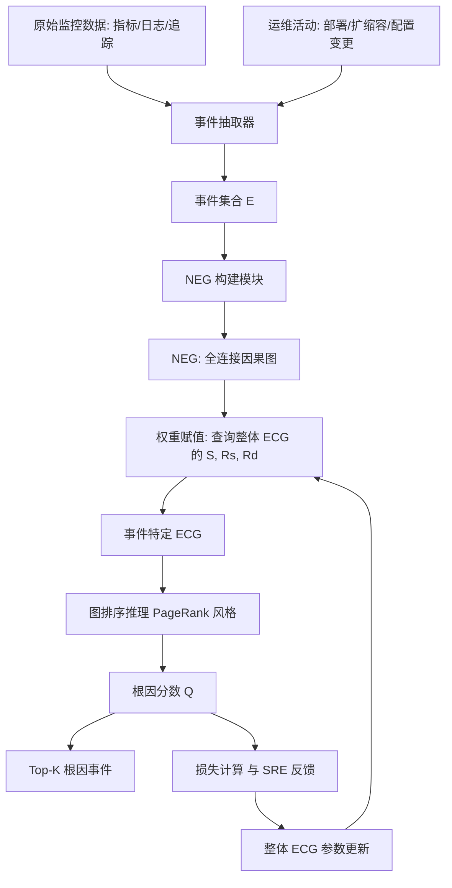
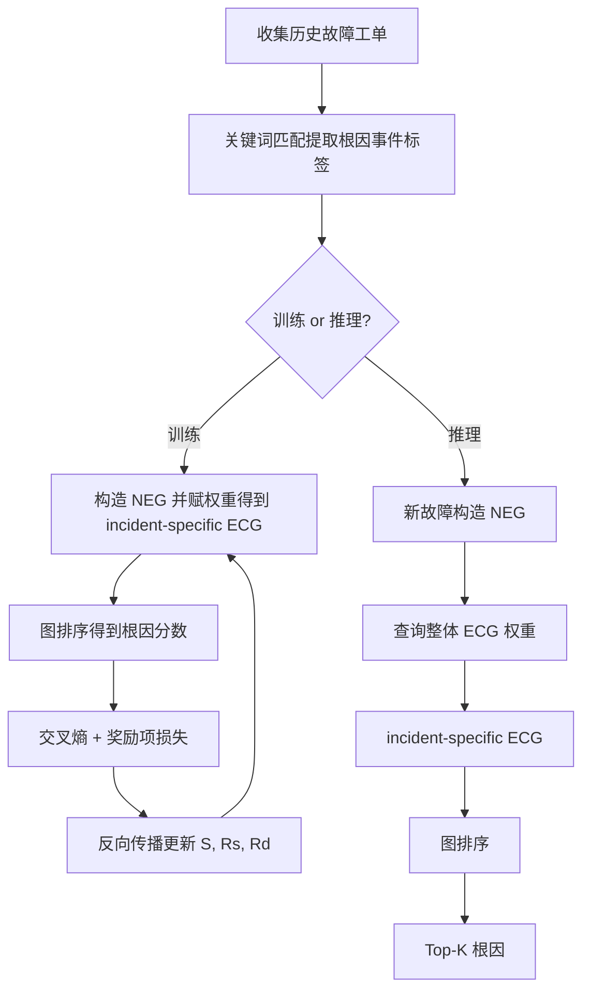

# Chain-of-Event: Interpretable Root Cause Analysis for Microservices through Automatically Learning Weighted Event Causal Graph（FSE Companion 2024）

> 作者：Zhenhe Yao、Changhua Pei、Wenxiao Chen、Hanzhang Wang、Liangfei Su、Huai Jiang、Zhe Xie、Xiaohui Nie、Dan Pei  
> 机构：清华大学 & BNRist；HIAS, UCAS & CNIC, CAS；eBay Inc.  
> 发表年份：2024  
> 会议/期刊：FSE Companion '24（ACM International Conference on the Foundations of Software Engineering，巴西 Porto de Galinhas，2024 年 7 月 15-19 日）  
> 关联 PDF：同目录下 `Chain-of-Event_Interpretable-Root-Cause-Analysis-for-MicroservicesFSE24-Camera-Ready.pdf`

## 一、文档信息速览

| 字段 | 值 |
|---|---|
| 标题 | Chain-of-Event: Interpretable Root Cause Analysis for Microservices through Automatically Learning Weighted Event Causal Graph |
| 作者 | Zhenhe Yao、Changhua Pei、Wenxiao Chen、Hanzhang Wang、Liangfei Su、Huai Jiang、Zhe Xie、Xiaohui Nie、Dan Pei |
| 机构 | 清华大学 / BNRist；HIAS, UCAS / CNIC, CAS；eBay Inc. |
| 发表年份 | 2024 |
| 会议/期刊 | FSE Companion '24 |
| 分类 | 根因分析 / 事件因果图 / 可解释性 |
| 核心问题 | 在多模态（指标、日志、追踪）微服务系统中，给定一次故障中的事件集合，如何让 SRE 参与的可解释算法自动学到事件之间的因果强度并定位根因事件 |
| 主要贡献 | (1) 提出事件因果图 ECG 框架，统一多模态数据；(2) 设计可解释参数（事件重要度 + 链接权重）使 SRE 经验可直接注入；(3) 通过 PageRank 式图排序在 NEG 上自动推理根因分数；(4) 提出整体 ECG 训练算法，规避人工规则；(5) 在 eBay 5000+ 服务两类数据集上达到 SOTA，Top-1 79.30%/85.3%，Top-3 98.8%/96.6% |

## 二、背景（Background）

微服务架构已经成为大型互联网公司软件交付的事实标准，电商、社交、支付等业务普遍采用数百乃至数千个独立部署的服务协作完成一次请求。这种架构虽然带来了可扩展性与复用性，但服务的复杂依赖关系使得一次故障极易"雪崩"——一个小服务的 GC 飙升可能拖垮上游 API 响应时间，进而导致下游订单失败、用户报错。论文给出一个工业数据：全球 Top 5 的电商系统每天产生 10 TB 以上的监控数据（KPI 指标、追踪、日志），涉及超过 5000 个在线服务，要在这样的数据规模下进行根因分析（RCA）成本极高。

SRE 在处理线上故障时通常会经历三个阶段：异常检测、根因定位、修复。前两个阶段自动化程度较高，而根因定位阶段却常常依赖工程师经验。一旦定位失败，恢复时间会拉长、损失扩大，因此 RCA 一直是工业运维中最重要的痛点。学术上已有的方法大体分为三类：基于指标的方法（MicroHEC、MS-RCA 等）只能处理 KPI；基于日志的方法（LogCluster、FT-tree 等）只解析日志模板；基于追踪的方法（TraceAnomaly 等）依赖 trace 调用链。它们各自只能消费一种模态，论文将这一痛点列为第一个挑战：**多模态数据整合（Multi-Modal Data Integration）**。

近年来 Eadro、Nezha 等方法尝试把多模态数据联合输入神经网络做端到端 RCA，但 Eadro 用了三阶段模态融合，Nezha 用了抽象的"事件模式（event pattern）"概念，参数与中间层缺乏直观物理意义，工程师难以判断参数是否合理，也难以用日常运维经验去干预模型。这引出第二个挑战：**可解释性（Interpretability）**。另一方面，PDiagnose、Groot 等方法虽然与 SRE 经验对齐（依赖阈值规则、人工配置的事件因果关系），但其规则需要 SRE 手动配置，带来额外负担，构成第三个挑战：**自动因果性学习（Automatic Causality Learning）**。

针对上述三大挑战，本文提出了 **Chain-of-Event (CoE)**：一个基于事件（Event）的根因分析框架，通过"事件 → 事件链 → 事件因果图"的层次化抽象，把多模态数据降维为可解释的事件集合，再以图排序与可学习参数的方式完成自动 RCA。

## 三、目的（Problems Solved）

- **多模态融合下的因果粒度问题**：将指标、日志、追踪和运维活动统一抽象为"事件"，让 RCA 工作在事件层而非原始数据层，从而在保留关键信息的同时控制存储/计算成本。
- **可解释参数与 SRE 经验对齐**：让模型的核心参数具有明确物理含义——"事件重要度"代表该事件在系统中的关键程度；"因果链接权重"代表事件 A 引发事件 B 的可能性，从而让 SRE 能直接基于经验调整这些数值。
- **自动学习事件因果关系**：用监督学习从历史故障工单中自动学到"整体事件因果图（overall ECG）"，推理时只需在 NEG 上查询这些参数，避免人工配置阈值与规则。
- **统一推理算法**：在已构建的事件因果图上设计 PageRank 风格的图排序算法，一次性输出所有事件的根因分数。
- **支持 SRE 闭环反馈**：参数可被 SRE 主动修改或注入，形成"数据驱动 + 知识驱动"的协同 RCA 工作流。
- **跨数据集泛化**：论文强调 CoE 能够在服务级（Service dataset）和业务级（Business dataset）两种粒度的事件集上均表现优异。

## 四、核心原理（Principles）

**系统总览**：CoE 把一次微服务故障中的事件抽象为有向图中的节点（事件）与边（因果链接）。整个方案分两条线：

- **训练阶段**：从历史工单中提取事件集合与已知的根因事件标签，对每个故障构造一个"朴素事件因果图（NEG）"，再从可训练的"整体事件因果图（overall ECG）"中查询并赋权重，得到"事件特定的因果图（incident-specific ECG）"，通过图排序计算每个事件的根因分数，与真实根因计算损失，整体 ECG 的参数（事件重要度 S、链内因果链接权重 Rs、链间因果链接权重 Rd）被端到端更新。
- **推理阶段**：对一个新故障，构造 NEG，从已学到的整体 ECG 拉取链接权重和事件重要度，得到 incident-specific ECG，执行图排序，取根因分数最大的事件作为根因。

**关键概念**：

- **事件（Event）**：包含 WHAT（事件类型，例如 "CPU HIGH"、"Code Deployment"）、WHEN（时间戳）、WHERE（所属服务）三个字段的元组。
- **事件链（Event Chain）**：一串首尾相接的因果链接（长度可为 0，0 表示该事件是自身根因）。
- **因果链接（Causal Link）**：从结果事件指向原因事件的有向边，权重表示"结果由该原因引发"的似然。
- **朴素事件因果图 NEG**：同一服务内事件两两双向、邻近服务间按调用方向单向连边的全连接图，权重视为 1。
- **事件因果图 ECG**：在 NEG 基础上为节点和边赋予（学习或人工）权重后的图；可分"整体 ECG"和"事件特定 ECG"。
- **图排序（Graph Ranking）**：借鉴 PageRank 思想的事件根因分数计算。
- **人类知识整合**：训练完成后，SRE 可对整体 ECG 的 S 和 Rs/Rd 进行微调，这些调整直接参与推理。

**数学原理**：

- 图排序的迭代公式：记第 t 步的事件分数向量为 $Q^{(t)} \in \mathbb{R}^{|V|}$，则

$$
Q^{(t+1)} = \alpha \cdot M Q^{(t)} + (1-\alpha) \cdot Q^{(0)}
$$

其中 $M$ 是按出度归一化的链接权重矩阵，$Q^{(0)}$ 是按事件重要度 $S$ 归一化后的先验，$\alpha \in (0,1)$ 为阻尼因子。

- 事件根因分数：对每个事件 $v$，把所有经过 $v$ 的事件链（长度为 $0\ldots T$）按链接权重相乘后求和，再乘上 $v$ 的事件重要度 $S_v$，得到 $v$ 的"由他人引起"分数；同时单独保留 $S_v$ 归一化值作为 $v$ 的"自身根因"分数。最终该事件的根因分数 = 自身根因分数 + 由他人引起分数（其中他人分数再乘以 $1-\alpha$ 与 $\alpha$ 折中）。参数 $\alpha$ 和最大链长 $T$ 共同决定逼近误差上界

$$
\epsilon = \left(\frac{1+\alpha}{1}\right)^{T+1}
$$

论文取 $\alpha=0.2, T=100$，误差上界 $<10^{-8}$，远小于典型根因分数量级。

- 训练目标：使用多分类交叉熵损失（softmax over incident 内事件），对 incident-specific ECG 上计算得到的根因分数取 softmax 后与根因事件 one-hot 标签对齐；同时附加"出度奖励（Out-edge bonus term）"和"链长奖励（Length-bonus term）"正则化项，提升事件链与重要度的一致性。

**与现有技术的差异**：

- 与 Eadro / Nezha 相比：Eadro 端到端深度学习、Nezha 用抽象 event pattern，参数不可解释；CoE 把参数显式化（事件重要度、链接权重），可直接被 SRE 调整。
- 与 PDiagnose 相比：PDiagnose 用阈值规则 + 统计检测，对阈值敏感；CoE 把阈值替换为"事件"层抽象，自动从历史数据学习规则。
- 与 Groot 相比：Groot 用人工二元因果规则；CoE 用 NEG 初始化 + 连续权重学习，无需人工维护规则。
- 与 PageRank 相比：CoE 引入先验 $Q^{(0)}$、出度奖励与链长奖励，使其更适合"因果"而非"流行度"语义。

## 五、算法详解（Algorithm）

1. **输入 / 输出**：
   - 输入：一次故障的事件集合 $E = \{e_1, \ldots, e_N\}$，每个事件带服务、时间戳、类型。
   - 输出：每个事件的根因分数，取最大者为根因事件。
   - 训练时还需输入根因标签 $e^*$。

2. **核心模块**：
   - **NEG 构建**：根据服务调用关系生成全连接图。
   - **权重赋值**：从整体 ECG 查询链接权重 $R_s$ / $R_d$ 与事件重要度 $S$。
   - **图排序推理**：迭代计算事件根因分数。
   - **损失计算**：softmax + 交叉熵 + 正则化项。
   - **参数更新**：端到端反向传播更新 $R_s, R_d, S$。

3. **伪代码**（整合自论文 Algorithm 1 与 Algorithm 2）：

```python
def build_neg(incident_events, service_dep):
    G = {}
    for e in incident_events:
        G[e] = set()
    for e1 in incident_events:
        for e2 in incident_events:
            if e1 == e2: continue
            if e1.service == e2.service:
                G[e1].add(e2)  # bidirectional intra-service
            elif service_dep.is_adjacent(e1.service, e2.service):
                if service_dep.calls(e1.service, e2.service):
                    G[e1].add(e2)  # directed inter-service
    return G

def graph_ranking(G, S, R_s, R_d, alpha=0.2, T=100):
    Q0 = normalize(S)            # event importance as prior
    Q = Q0.copy()
    for t in range(T):
        Q_new = {}
        for v in G:
            incoming = 0.0
            for u in G:
                if v in G[u]:
                    w = R_s if u.service == v.service else R_d[(u.service, v.service)]
                    incoming += w * Q[u] / max(sum_w(G[u], R_s, R_d), 1e-9)
            Q_new[v] = (1 - alpha) * Q0[v] + alpha * incoming
        Q = Q_new
    return Q

def train_coe(historical_incidents, root_cause_labels, epochs=200):
    S = init_event_importance()
    R_s, R_d = init_link_weights()
    for ep in range(epochs):
        total_loss = 0
        for inc, rc in zip(historical_incidents, root_cause_labels):
            G = build_neg(inc.events, inc.service_dep)
            assign_weights(G, S, R_s, R_d)   # build incident-specific ECG
            Q = graph_ranking(G, S, R_s, R_d)
            # softmax cross-entropy
            p = softmax(Q)
            loss = -log(p[rc])
            # regularization: out-edge bonus + length bonus
            loss += lambda1 * out_edge_bonus(G, Q)
            loss += lambda2 * length_bonus(G, Q)
            total_loss += loss
        # end-to-end update S, R_s, R_d via backprop
        S, R_s, R_d = optimizer.step(total_loss)
    return S, R_s, R_d
```

4. **关键数学**：

$$
Q^{(t+1)}[v] = (1-\alpha) Q^{(0)}[v] + \alpha \sum_{u: v \in G[u]} \frac{E[(u,v)]}{\sum_{u'} E[(u,u')]} Q^{(t)}[u]
$$

$$
\text{Score}(v) = S_v + \sum_{l=1}^{T} \sum_{\text{chain} \in C_l(v)} \prod_{(a,b) \in \text{chain}} E[(a,b)]
$$

$$
\text{Loss} = -\frac{1}{N}\sum_{i=1}^{N} \log p_{i}[\text{rc}_i] + \lambda_1 \mathcal{L}_{\text{out-bonus}} + \lambda_2 \mathcal{L}_{\text{len-bonus}}
$$

5. **复杂度分析**：图排序每次迭代 $O(|V| + |E|)$，T 次迭代共 $O(T(|V|+|E|))$；整体 ECG 训练时反向传播对每个 incident 重复一次，复杂度与训练集大小线性相关。NEG 节点数与 incident 内事件数同量级，论文实验 incident 平均 5-10 个事件，规模小、训练高效。

6. **训练与推理**：
   - 训练输入：历史故障工单，关键词匹配得到根因事件标签，事件集合从监控平台拉取。
   - 训练目标：softmax 交叉熵 + 奖励项正则。
   - 推理：对新故障构造 NEG → 查询整体 ECG → 图排序 → 取 Top-K 事件。

7. **示例**（简化）：某次故障含 4 个事件：①"Code Deployment"（服务 A，t0）、②"High CPU"（服务 B，t1）、③"Latency Spike"（服务 B，t2）、④"API Timeout Spike"（服务 C，t3）。先建 NEG：A-B 邻近（A 调用 B），A-B 之间单链；B 内双向；B-C 邻近（B 调用 C），B-C 单链。然后查询整体 ECG：Code Deployment → High CPU 权重 0.7；High CPU → Latency Spike 权重 0.8；Latency Spike → API Timeout 权重 0.6。设置 α=0.2、T=100 反复迭代 Q，最终 "Code Deployment" 获得最高分（因作为根链起点的先验 S 较大），被判为根因。

## 六、系统架构图（Architecture）



## 七、流程图（Process Flow）



## 八、关键创新点（Key Innovations）

- **+ 事件级多模态融合抽象**：把异构监控数据统一抽象为"事件"，降维、保留关键信息、降低存储与计算成本，使 RCA 不再受模态限制。
- **+ 可解释且与 SRE 经验对齐的参数设计**：参数 $S$（事件重要度）、$R_s$/$R_d$（因果链接权重）都有明确物理含义；SRE 凭借经验直接调整这些数值即可影响模型输出。
- **+ NEG 初始化 + 连续权重自动学习**：用 NEG 提供结构先验，再以监督学习自动学到连续链接权重，规避 Groot 等方法的人工规则维护。
- **+ PageRank 风格图排序 + 事件链奖励项**：将根因分析转化为图上的随机游走问题，并通过出度奖励和链长奖励引导推理关注因果而非流行度。
- **+ 端到端工业级验证**：在 eBay 真实 5000+ 服务数据集上同时验证了服务级和业务级 RCA 准确率，证明落地可行性。

## 九、实验与结果（Experiments）

- **数据集**：来自 eBay 的两个真实数据集——Service dataset（服务级事件）和 Business dataset（业务级事件），包含 5000+ 服务产生的多模态数据。
- **Baseline**：包括 MicroHEC、MS-RCA、CMDiagnostor、RN Rank、PageRank、Random、MicroCause 等多类方法。
- **主要指标**：Top-1 准确率、Top-3 准确率。
- **关键结果数字**：
  - Service dataset：CoE 取得 79.30% Top-1、98.8% Top-3；
  - Business dataset：CoE 取得 85.3% Top-1、96.6% Top-3；
  - 相比 Groot、PageRank 等基线提升 10-30 个百分点（具体数据见论文 Table 2/3）。
- **消融实验**：分别去掉出度奖励项 $T$、链长奖励项 $LB$、事件重要度 $S$、事件链长度 $T$ 限制等组件，验证各自对 Top-1 准确率均有贡献（论文中以柱状图展示）。
- **效率分析**：在标准硬件（CPU + GPU）上，单次推理（一次故障）毫秒级完成；训练时间在数百次 epoch 内收敛，可与 SRE 工单记录周期匹配。
- **可解释性研究**：通过一个实际故障案例展示 SRE 可以直接把"Code Deployment" 事件的 $S$ 调高，让模型在类似故障中更倾向把它判为根因，并验证了调整后的效果。

## 十、应用场景（Use Cases）

- **电商订单系统故障定位**：在订单、库存、支付等 5000+ 服务规模下，自动定位"Code Deployment"、某服务 CPU 飙高等根因事件。
- **在线广告投放链路异常分析**：把广告投放链路上各服务的"延迟尖峰""错误码"事件作为输入，定位上游投放配置变更。
- **金融支付系统 SLA 保障**：当用户支付失败率飙升时，自动找到引发雪崩的源服务事件（例如"DB 连接池满"事件）。
- **SaaS 平台发布后回归监控**：CoE 与发布系统联动，把"发布"事件纳入 NEG，提升发布相关根因识别率。
- **运维 AI Copilot**：将 CoE 的 Top-K 根因解释给 LLM，让 LLM 生成自然语言故障报告，赋能 SRE 一线处置。

## 十一、相关论文（Related Papers in this set）

本批与同主题相关的论文：
- `MonitorAssistant_CameraReady-v1.5_submitted`（基于 LLM 的指标异常检测与告警解释，可与 CoE 的根因结果串联成完整"检测+定位"流水线）
- `AlertRCA_CCGRID2024_CameraReady`（告警根因分析方向，可作为 CoE 的同类替代/补充方法）
- `CMDiagnostor`（多模态因果诊断，关注云服务故障诊断）
- `TraceVAE`（基于追踪的异常检测）
- `Final_AutoKAD_ISSRE23_Camera-Ready-v2.3`（自动 KAD 告警诊断）
- `Empirical_Analysis`（告警/事件的实证分析）
- `GTrace_FSE_Industry2023_upload`（行业实践中基于追踪的故障定位）

## 十二、术语表（Glossary）

- **Event（事件）**：在指定时间发生在指定服务上的一种可观测现象（指标异常、错误码、异常日志、运维活动等）。
- **Incident（故障）**：一段时间窗口内一组相关事件的集合，对应一次线上事故。
- **Root Cause Event（根因事件）**：引发其他事件、在故障中起首要作用的事件。
- **Causal Link（因果链接）**：事件间有向边，表示"由 A 引发的可能性"。
- **Event Chain（事件链）**：多个因果链接串联而成的有序序列。
- **Naive Event-Causal Graph (NEG)**：不携带权重的全连接事件因果图。
- **Event-Causal Graph (ECG)**：在 NEG 基础上加权和/或剪枝后的因果图。
- **Overall ECG / Incident-specific ECG**：覆盖全系统的事件因果图 / 单次故障的事件因果子图。
- **Graph Ranking（图排序）**：基于链接结构的迭代式节点重要性打分。
- **SRE（Site Reliability Engineer）**：站点可靠性工程师。
- **Top-K Accuracy**：模型返回前 K 个候选中包含真实根因的比例。

## 十三、参考与延伸阅读

- Paper: Groot: Topology-aware Root Cause Analysis for Cloud Microservices（FSE 2023）——事件因果图思想的先驱。
- Paper: Nezha: Interpretable Fine-Grained Root Cause Analysis via事件模式（VLDB 2023）——同类多模态根因方法。
- Paper: Eadro: An End-to-End Troubleshooting Framework（KDD 2023）——三阶段模态融合方法。
- Paper: MicroHEC / MS-RCA（多指标/多服务根因）——CoE 实验中对比的方法。
- 代码仓库：`https://github.com/NetManAIOps/Chain-of-Event`
- 相关综述：A-survey-on-intelligent-management-of-alerts-and-incidents-in-IT-services（同批）
