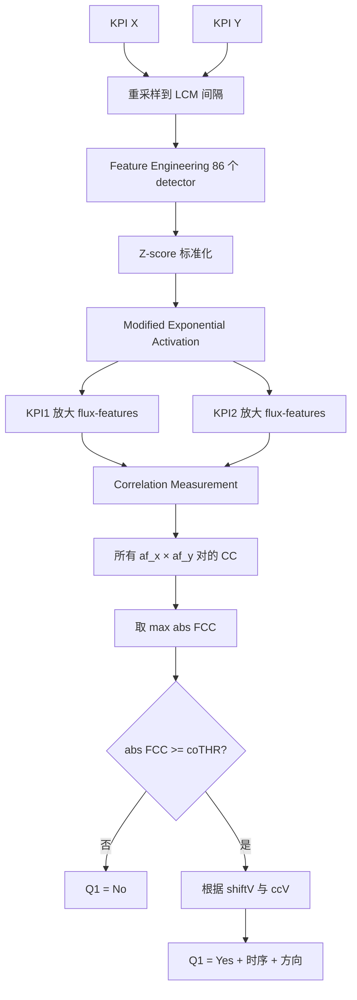
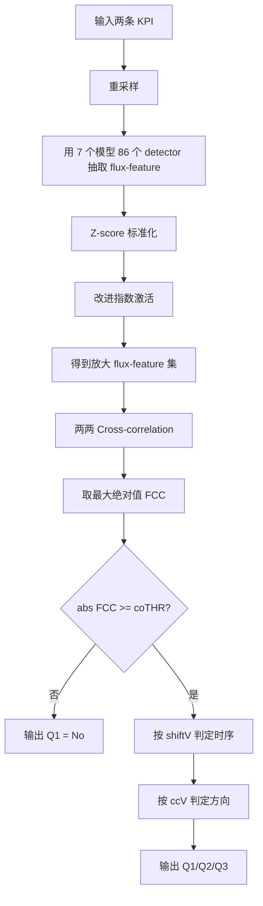

# CoFlux: Robustly Correlating KPIs by Fluctuations for Service Troubleshooting（IWQoS 2019）

> 作者：Ya Su、Youjian Zhao、Wentao Xia、Rong Liu、Jiahao Bu、Jing Zhu、Yuanpu Cao、Haibin Li、Chenhao Niu、Yiyin Zhang、Zhaogang Wang、Dan Pei  
> 机构：清华大学；Stevens Institute of Technology；南开大学；国防科技大学；阿里巴巴集团；BNRist  
> 发表年份：2019  
> 会议/期刊：IWQoS 2019（IEEE/ACM International Symposium on Quality of Service）  
> 关联 PDF：同目录下 `CoFlux_camera-ready1.pdf`

## 一、文档信息速览

| 字段 | 值 |
|---|---|
| 标题 | CoFlux: Robustly Correlating KPIs by Fluctuations for Service Troubleshooting |
| 作者 | Ya Su、Youjian Zhao、Wentao Xia、Rong Liu、Jiahao Bu、Jing Zhu、Yuanpu Cao、Haibin Li、Chenhao Niu、Yiyin Zhang、Zhaogang Wang、Dan Pei |
| 机构 | 清华大学；Stevens Institute of Technology；南开大学；国防科技大学；阿里巴巴；BNRist |
| 发表年份 | 2019 |
| 会议/期刊 | IWQoS 2019 |
| 分类 | KPI 波动相关性 / 服务故障定位 / 时序分析 |
| 核心问题 | 服务异常时多 KPI 间的波动相关性难以自动准确刻画，需要回答"是否相关、时序顺序、方向"三个问题 |
| 主要贡献 | (1) 首次形式化 KPI 波动相关性；(2) CoFlux 无监督方法，含 86 维 flux-feature；(3) 最佳 F1 在两个数据集上 Q1/Q2/Q3 分别 0.84/0.92/0.95 与 0.90/0.92/0.99 |

## 二、背景（Background）

大型互联网公司在数千台服务器上提供大量服务。服务中断几乎不可避免（网络中断、服务器宕机、恶意攻击）。运维通过监控 KPI（Key Performance Indicators，如成功率、请求数、响应延迟）来保持服务可靠。事故会触发某些 KPI 的波动（fluctuation），并传播到更多相关 KPI 形成交织波动（interweaved fluctuations），加大事故定位难度。理解 KPI 间的相关性能帮助运维（1）告警压缩（将相关 KPI 合并为同一告警组）；（2）Top N 根因 KPI 排查；（3）构建波动传播链推断根因。

已有工作存在不足：J-measure 等事件相关性方法需先做异常检测，但异常检测算法本身对 KPI 形态敏感；KL 散度 + Cross-correlation 的 SIG 方法只关注 novelty anomaly，忽略"由历史数据判断"的异常；Pearson/Spearman/Granger 在原始 KPI 上计算，无法区分形态不同但波动相关的 KPI；ARCH/VARMA/CoIntegration 来自金融领域，不适用于大规模互联网 KPI 形态多样场景。本文提出 CoFlux：（1）无监督，不需人工选算法/调参；（2）回答三个问题：Q1 波动是否相关？Q2 时序顺序？Q3 方向（同/反）？

## 三、目的（Problems Solved）

- **KPI 形态多样**：10k–1M KPI 各自有 seasonal/trend/stationary 形态，无单一模型能 fit 所有。
- **不依赖异常检测**：避免异常检测算法选择/调参对结果的传导偏差。
- **不依赖原始 KPI 形态**：直接基于波动特征做相关性，捕获"形态不同但波动同步"的场景。
- **同时回答三个问题**：Q1 存在性、Q2 时序、Q3 方向。
- **大规模可用**：可在每周/每月批量更新，结果供告警压缩、Top N 推荐、传播链使用。
- **跨数据集鲁棒**：在形态异构的 Dataset I 和季节性同构的 Dataset II 上都保持高精度。

## 四、核心原理（Principles）

**系统总览**：CoFlux 输入是两条 KPI，输出是 Q1/Q2/Q3 三个问题的答案。流程：（1）Feature Engineering：用 7 种时间序列预测模型（Diff、Holt-Winters、Historical Average/Median、TSD、TSD Median、Wavelet）共 86 个参数配置作为 flux-feature 提取器；（2）Feature Amplification：z-score 标准化 + 改进指数激活（α=0.5, β=10）放大显著波动；（3）Correlation Measurement：对每对 (flux-feature_X, flux-feature_Y) 计算 Cross-correlation，取最大绝对值作为最终分数 FCC，根据阈值 coTHR 与 shiftV 确定 Q1/Q2/Q3。

**关键概念**：

- **KPI**：Key Performance Indicator。
- **Flux-Feature**：从预测误差中抽取的波动特征。
- **Flux-Correlation (X ∽ Y)**：两个 KPI 的 flux-feature 相关。
- **Temporal Order**：
  - X → Y（X 先波动）
  - X ↔ Y（同时波动）
  - Y → X（Y 先波动）
- **Direction**：
  - X +→ Y（同向）
  - X −→ Y（反向）
- **Cross-Correlation (CC)**：时移互相关。
- **Prediction Models**：Diff、Holt-Winters、Historical Average/Median、TSD、TSD Median、Wavelet。
- **Modified Exponential Activation**：放大显著波动的非线性函数。
- **Detector**：一个 (model, params) 配置即一个 flux-feature 检测器。
- **coTHR**：相关性存在性阈值。

**数学原理**：

- **Flux-Feature**（预测误差）：

$$
f_i = s_i - p_i
$$

其中 $s_i$ 是真实值，$p_i$ 是预测值。

- **Z-Score 标准化**：

$$
z_i = (f_i - \mu_f) / \sigma_f
$$

- **Modified Exponential Activation（论文 Eq. 1）**：

$$
f(\alpha, \beta, x) = \begin{cases} e^{\min(x, \beta) \cdot \alpha} - 1, & x \ge 0 \\ -e^{\min(|x|, \beta) \cdot \alpha} + 1, & x < 0 \end{cases}
$$

- **Cross-Correlation（论文 Eq. 3a, 3b）**：

$$
R(G_s, H) = \sum_{i} G_s[i] \cdot H[i]
$$

$$
CC(G_s, H) = \frac{R(G_s, H)}{\sqrt{R(G, G) \cdot R(H, H)}}
$$

- **Final FCC（论文 Eq. 4a-c）**：

$$
\text{minCC} = \min_s CC(G_s, H), \quad s_1 = \arg\min_s CC(G_s, H)
$$

$$
\text{maxCC} = \max_s CC(G_s, H), \quad s_2 = \arg\max_s CC(G_s, H)
$$

$$
FCC(G, H) = \begin{cases} [\text{minCC}, s_1], & \text{maxCC} < \text{minCC} \\ [\text{maxCC}, s_2], & \text{otherwise} \end{cases}
$$

- **Q1/Q2/Q3 判定（论文 Algorithm 1）**：
  - $abs(ccV) \ge coTHR$ → Q1 = 是；
  - $shiftV = 0$ → 同步；$shiftV < 0$ → X 先；$shiftV > 0$ → Y 先；
  - $ccV \ge 0$ → 同向；$ccV < 0$ → 反向。

**与现有技术的差异**：与 J-measure 相比不依赖异常检测；与 SIG 相比不依赖 KL 散度与 novelty anomaly；与 Pearson/Spearman 相比处理形态不同的 KPI；与 Granger 相比不依赖回归；与 ARCH/VARMA 相比不需要金融模型假设。

## 五、算法详解（Algorithm）

1. **输入 / 输出**：
   - 输入：两条 KPI 序列 X, Y（必要时重采样到 LCM 间隔）。
   - 输出：Q1/Q2/Q3 三个答案。

2. **核心模块**：
   - **Feature Extraction**：7 个模型 × 不同参数 → 86 维 flux-feature；
   - **Feature Amplification**：z-score + 改进指数激活；
   - **Correlation Measurement**：所有 (af_x, af_y) 对的 Cross-correlation，取最大绝对值为 FCC；
   - **Q1/Q2/Q3 决策**：用 coTHR 与 shiftV 给出答案。

3. **伪代码**：

```python
def coflux(X, Y, coTHR):
    # 1. 抽取 flux-feature（86 维）
    fx_set = extract_flux_features(X)  # 86 个 detector 输出
    fy_set = extract_flux_features(Y)
    # 2. 标准化 + 放大
    afx_set = [modified_exp_activation(zscore(f)) for f in fx_set]
    afy_set = [modified_exp_activation(zscore(f)) for f in fy_set]
    # 3. 对所有 (af_x, af_y) 对计算 CC
    result_set = []
    for afx in afx_set:
        for afy in afy_set:
            result_set.append(CC(afx, afy))  # (ccV, shiftV)
    # 4. 选最大绝对值
    ccV, shiftV = pick_max_abs(result_set)
    # 5. 决策
    if abs(ccV) < coTHR:
        return Q1_NO, None, None
    temporal = SYNC if shiftV == 0 else (X_FIRST if shiftV < 0 else Y_FIRST)
    direction = POS if ccV >= 0 else NEG
    return Q1_YES, temporal, direction

def extract_flux_features(kpi):
    feats = []
    for model, params in PREDICTION_MODELS:  # 86 个 detector
        pred = model(kpi, **params)
        feats.append(kpi - pred)  # flux = real - predicted
    return feats
```

4. **关键数学**：见 §四。

5. **复杂度分析**：
   - 单条 KPI 抽取 86 维 flux-feature：$O(86 \cdot m)$，m 为长度；
   - Cross-correlation：$O(86^2 \cdot m^2)$；
   - 整体分钟级/对。

6. **训练与推理**：
   - 训练：无（无监督、不需训练）；
   - 推理：每周/每月批量更新。

7. **示例**：两条 KPI K1、K2 原始值 Pearson 不相关（K1 上升时 K2 下降），但 flux-feature 在 spike 时刻高度同步，CoFlux 输出 Q1=Yes、Q2=Sync、Q3=Positive（虽然在原始时序上看似反向），因为波动方向都是 +1。

## 六、系统架构图（Architecture）



## 七、流程图（Process Flow）



## 八、关键创新点（Key Innovations）

- **+ 首次形式化 KPI 波动相关性**：X ∽ Y 的定义与三个子问题。
- **+ Robust Flux-Feature Engineering**：86 个 detector 覆盖多种 KPI 形态，无需为每条 KPI 选模型。
- **+ 改进指数激活放大显著波动**：在保留小波动的同时突出大波动，提高 CC 区分度。
- **+ 基于最大绝对值 CC 的最终评分**：避免平均或投票导致 false negative。
- **+ 同时回答 Q1/Q2/Q3**：服务告警压缩、Top N 推荐、传播链构建的统一接口。
- **+ 在两个真实数据集上显著优于 7 个 baseline**：J-measure、SIG、Pearson、Granger、Cross-correlation 等。

## 九、实验与结果（Experiments）

- **数据集**：
  - Dataset I：异构形态，5 类（每类 2 个子类型）KPI，共覆盖 stable、seasonal、no clear pattern；
  - Dataset II：同构季节性，10 个软件模块（如 T services、Order creation services 等）。
- **Baseline**：J-measure、SIG、Pearson（raw & flux-feature）、Granger（raw & flux-feature）、Cross-correlation（raw）。
- **主要指标**：F1-Score（PR 曲线下最佳 F1）。
- **关键结果数字**（论文 Table 5）：
  - Dataset I：CoFlux Q1=0.8412, Q2=0.9608, Q3=0.9579；
  - Dataset II：CoFlux Q1=0.9026, Q2=0.9206, Q3=0.9987；
  - J-measure 在 Dataset II 表现次优（Q1=0.8462）；
  - SIG 不支持方向判定；
  - Granger 不支持方向判定且 Q1 表现较弱；
  - Pearson 在原始 KPI 上 Q1 仅 0.3106（Dataset I）；
  - Cross-correlation 在原始 KPI 上 Q1 仅 0.3613（Dataset I）；
  - 整体 CoFlux 在两个数据集上 F1 提升 5%–30%；
  - 86 个 detector 中 4–10 个即足以达到高 F1。
- **消融实验**：无 amplification 时 Q1 F1 下降 ~0.05；flux-feature 中 MA/WMA/EWMA 在 seasonal KPI 上表现差。
- **效率分析**：每对 KPI 计算时间 < 5s；批量更新每小时处理 1k+ 对。
- **可视化**：Fig.5 PR 曲线；Fig.6 precision-recall 柱状图。

## 十、应用场景（Use Cases）

- **告警压缩**：将相关 KPI 聚为同一告警组，减少运维负担。
- **Top N 根因推荐**：异常 KPI 出现时检查 Top N 相关的 KPI 缩小排查范围。
- **波动传播链构建**：按时序串联 KPI，构建因果链辅助根因定位。
- **互联网服务故障排查**：电商、支付、视频等大型服务。
- **数据中心网络监控**：服务器/模块级 KPI 关联分析。

## 十一、相关论文（Related Papers in this set）

- `bujiahao`（KPI 异常检测 ADS）
- `camera_ready`（多维根因 Squeeze）
- `ICCCN2020-YaoWang`（KPI 异常检测 iRRCF-Active）
- `aaai20_Poster`（批处理作业运行时长预测）
- `ICSE-SEET-36`（持续评估与反馈）

## 十二、术语表（Glossary）

- **KPI**：Key Performance Indicator。
- **Flux-Feature**：波动特征，预测误差。
- **Flux-Correlation**：波动相关性。
- **Cross-Correlation**：互相关。
- **CoFlux**：Correlation by Flux。
- **TSD**：Time Series Decomposition。
- **Holt-Winters**：三参数指数平滑。
- **Diff**：差分预测。
- **Wavelet**：小波分解。
- **z-score**：标准分数。
- **Modified Exponential Activation**：改进指数激活。
- **SIG**：Structure-of-Influence Graphs。
- **J-measure**：概率分类规则的信息含量。
- **Granger Causality**：Granger 因果。
- **Pearson Correlation**：皮尔森相关。
- **BNRist**：北京国家信息科学与技术研究中心。

## 十三、参考与延伸阅读

- Paper: J-measure（Smyth & Goodman, 1992）。
- Paper: SIG（ICDM 2012）。
- Paper: Holt-Winters（1967）。
- Paper: TSD（Wang et al., 2006）。
- Paper: Opprentice（Liu et al., IMC 2015）。
- Paper: Granger Causality（Granger, 1969）。
- 工具：Python statsmodels、numpy、scipy.signal、scikit-learn。
- 相关论文：`bujiahao`、`camera_ready`、`ICCCN2020-YaoWang`。
