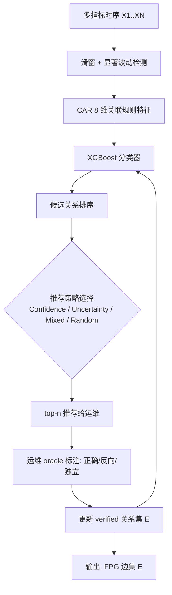
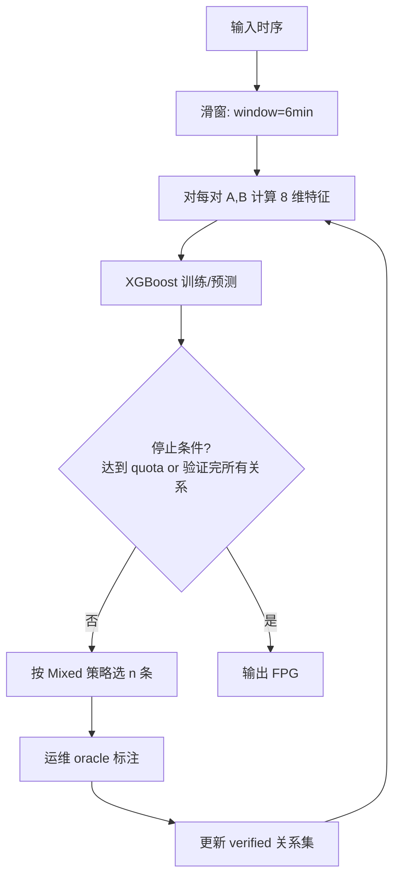

# FPG-Miner：基于主动学习的时序波动传播图结构发现（DEXA 2022）

> 作者：Mingjie Li, Minghua Ma, Xiaohui Nie, Kanglin Yin, Li Cao, Xidao Wen, Zhiyun Yuan, Duogang Wu, Guoying Li, Wei Liu, Xin Yang, Dan Pei  
> 机构：清华大学；微软亚洲研究院；BizSeer；中国建设银行  
> 发表年份：2022  
> 会议/期刊：DEXA 2022  
> 关联 PDF：同目录下 `DEXA22-FPG-Miner.pdf`

## 一、文档信息速览

| 字段 | 值 |
|---|---|
| 标题 | Mining Fluctuation Propagation Graph among Time Series with Active Learning |
| 作者 | Mingjie Li, Minghua Ma, Xiaohui Nie, Kanglin Yin, Li Cao, Xidao Wen, Zhiyun Yuan, Duogang Wu, Guoying Li, Wei Liu, Xin Yang, Dan Pei |
| 机构 | 清华大学；微软亚洲研究院；BizSeer；中国建设银行 |
| 发表年份 | 2022 |
| 会议/期刊 | DEXA 2022 |
| 分类 | 因果发现 / 主动学习 / 根因分析前置 |
| 核心问题 | 在线服务系统故障定位需要一张"波动传播图（FPG）"作为先验，但完全无监督的因果发现算法要么漏掉大量边、要么发现几乎完全图，如何结合运维领域知识加速"正确关系"的发现 |
| 主要贡献 | 1) 经验性研究揭示现有无监督因果发现算法在两个真实数据集上 Precision/Recall 严重失衡；2) FPG-Miner 主动学习框架，通过"训练—推荐—反馈"循环积累验证关系；3) CAR（Continuous Association Rule）分类器实现，把每条有向关系表示为 8 维关联规则特征 + XGBoost 分类器，在发现 20% 正确关系时比 baseline 节省 2.3%~42.2% 验证量 |

## 二、背景（Background）

复杂在线服务系统（数据库、电信网络、银行核心系统等）故障不可避免。运维工程师通常将每次排障经验写成 troubleshooting guide（文本），但文本难以直接用于自动化根因分析。波动传播图（Fluctuation Propagation Graph, FPG）以"指标 → 指标"的有向图形式抽象描述故障的传播路径：例如 Oracle 数据库中"高 EPS → 高 enq:TX-index contention → 高 AAS → 高 log file sync"。该 FPG 既能用于自动根因定位（将异常指标反向追溯到源头）、告警关联、告警风暴压缩，也是 AIOps 智能算法落地的"基础设施"。

论文给出 FPG 构造的两条路径：(1) 人工标注 — 慢且不一致；(2) 现有因果发现算法（PC 算法、PC-PCMCI、NOTEARS、NRI、TCDF 等）— 这些方法假设数据完整、模型线性或可微，但在 AIOps 场景下"时序短、关系非线、confounder 难识别"，实际效果差。论文在两个真实数据集（Oracle 数据库 51 指标 / 电信网络 55 指标）上对 12 种主流因果发现算法做了基准评测（论文 Table 2），发现所有方法 Precision 都 < 0.5，最高 Precision 的方法 Recall 低到几乎 0，反之亦然。

为此论文提出 FPG-Miner 框架：把"关系发现"建模为"主动学习中的关系推荐"，让运维工程师作为 oracle 提供反馈；同时给出具体实现 CAR——把每对有向关系 (A→B) 抽取 8 维关联规则特征（Coverage、Consequence Coverage、Confidence、Reversed Confidence、Support、Lift、IR、KULC），用 XGBoost 二分类器预测"是否成立"，反馈数据不断迭代模型。

## 三、目的（Purpose / Problems Solved）

- **痛点 1：现有 FPG 构造方法漏边或稠密** → **方案**：经验性研究证实差距，并设计主动学习框架让运维反馈补足"数据中没有的领域知识"。
- **痛点 2：关系验证依赖领域知识** → **方案**：FPG-Miner 主动学习把"验证成本"建模为"quota"，每轮推荐少量关系供运维确认，并随验证集扩充不断优化推荐器。
- **痛点 3：现成主动学习策略（confidence-first / uncertainty-first）有偏向** → **方案**：提出 Mixed 策略（每 3 条推荐 2 高置信 + 1 高不确定），平衡"剔除杂边"与"获取新信息"。
- **痛点 4：时序数据非平稳、噪声大** → **方案**：CAR 用滑窗 + 短时相关性的统计特征（Coverage、Support 等 8 维），对短时尖峰鲁棒。
- **痛点 5：反馈样本少导致分类器难训** → **方案**：所有有向关系（即使从未被反馈）也作为输入特征喂给 XGBoost，避免 cold-start。

## 四、核心原理（Principles）

系统总览：FPG-Miner 框架（论文 Algorithm 1）是一个 train–recommend–learn 三步循环的 miner：

1. **训练**：基于已验证的关系集合训练推荐器。
2. **推荐**：每轮推荐 n 条关系给运维（按 Confidence-first / Uncertainty-first / Mixed / Random 策略）。
3. **学习**：运维反馈（正确 / 反向 / 独立）后，把新数据加入训练集，迭代优化推荐器。

CAR 实现细节（图 2）：
- 对每条有向关系 (A→B)，把时序切成小窗口（论文使用 6 分钟窗口，与 DOD 一致）。
- 在每个窗口计算"两个指标是否共同发生显著变化"，统计 8 个关联规则特征。
- 用 XGBoost 分类器根据特征给出"是否为正"的概率。
- 推荐阶段，按概率分位挑出 Mixed 策略下的 n 条。

关键概念：
- **FPG**：有向图 $G = \langle V, E \rangle$，$V$ 是指标，$E$ 是指标间有向关系。
- **Coverage** $P(A)$：A 在所有窗口中"显著波动"的比例。
- **Consequence Coverage** $P(B)$：B 的对应比例。
- **Confidence** $P(B|A)$：在 A 显著波动的窗口中 B 也显著波动的比例。
- **Reversed Confidence** $P(A|B)$。
- **Support** $P(AB)$：A 和 B 同时显著波动的比例。
- **Lift** $P(AB) / [P(A)P(B)]$。
- **IR** $P(A)/P(B)$：不平衡比。
- **KULC** $[P(B|A)+P(A|B)]/2$：双向置信均值。

数学原理：FPG-Miner 把"主动学习推荐关系"建模为多轮二元决策。设 $N$ 是指标数，每轮推荐 $n$ 条，最坏情况需要 $\lceil N(N-1)/(2n) \rceil$ 轮才能验证完所有可能关系。CAR 分类器的目标函数是经典 XGBoost 加正则化项的损失：

$$\mathcal{L} = \sum_{i=1}^{M} \ell(\hat{y}_i, y_i) + \sum_k \Omega(f_k) = \sum_i \ell(\hat{y}_i, y_i) + \sum_k \gamma T_k + \frac{1}{2}\lambda \|w_k\|^2$$

其中 $T_k$ 是叶节点数，$w_k$ 是叶节点权重。

与现有技术的差异：相对 PC/PCMCI 等"完全无监督"的因果发现，FPG-Miner 把"运维验证"作为监督信号引入；相对 NOTEARS/NRI 等"端到端深度学习"，CAR 只用 8 维可解释特征，模型可解释、可调；相对传统 confidence-first 主动学习，Mixed 策略避免"学不到新东西"。

## 五、算法详解（Algorithm）

### 1. 输入 / 输出
- **输入**：多指标时序 $\{x_i\}_{i=1}^N$，每条时序长度 $T$；每轮推荐数 $n$；迭代轮数。
- **输出**：被运维确认的 FPG 边集合 $E$。

### 2. 核心模块
- 滑窗 + 波动检测：把每条时序切成窗口，标记"显著波动"。
- 8 维特征抽取（CAR）。
- XGBoost 分类器。
- 推荐策略：Confidence-first / Uncertainty-first / Mixed / Random。
- 反馈融合与再训练。

### 3. 伪代码

```python
def FPG_Miner(time_series, n_rounds, n_per_round):
    relations = []  # 已验证关系
    miner = train_miner(time_series, relations)
    while not stop():
        # 推荐 n 条关系
        candidates = miner.recommend(n_per_round, strategy='mixed')
        new_feedback = []
        for r in candidates:
            # 运维 oracle 标注: correct / reversed / independent
            label = operator_feedback(r)
            if label == 'correct':
                relations.append((r, +1))
            elif label == 'reversed':
                relations.append((r.reverse(), +1))
                relations.append((r, -1))
            else:  # independent
                relations.append((r, -1))
            new_feedback.append((r, label))
        # 重新训练 miner
        miner = train_miner(time_series, relations)
    return relations


def CAR_features(X, Y, window_size=1):
    """返回 (Coverage, ConsequenceCoverage, Confidence, RevConfidence,
             Support, Lift, IR, KULC)"""
    sig_X = detect_significant(X, window=window_size)
    sig_Y = detect_significant(Y, window=window_size)
    P_A = sig_X.mean()
    P_B = sig_Y.mean()
    P_AB = (sig_X & sig_Y).mean()
    P_BA_conf = (sig_X & sig_Y).sum() / max(sig_X.sum(), 1)
    P_AB_conf = (sig_X & sig_Y).sum() / max(sig_X.sum(), 1)
    return {
        'Coverage': P_A,
        'ConsequenceCoverage': P_B,
        'Confidence': P_AB_conf,
        'RevConfidence': (sig_X & sig_Y).sum() / max(sig_Y.sum(), 1),
        'Support': P_AB,
        'Lift': P_AB / max(P_A * P_B, 1e-6),
        'IR': P_A / max(P_B, 1e-6),
        'KULC': (P_AB_conf + (sig_X & sig_Y).sum() / max(sig_Y.sum(), 1)) / 2
    }
```

### 4. 关键数学
- 主动学习轮数上界：$\lceil N(N-1)/(2n) \rceil$。
- XGBoost 目标函数：$\mathcal{L} = \sum_i \ell(\hat{y}_i, y_i) + \sum_k (\gamma T_k + \frac{1}{2}\lambda \|w_k\|^2)$。
- CAR 8 维特征：见上。

### 5. 复杂度分析
- 特征抽取：$O(N^2 \cdot T)$，$N$ 为指标数、$T$ 为时序长。
- XGBoost 训练：$O(M \cdot d \cdot T_{tree})$，$M$ 为已验证关系数。
- 论文报告 DOD 51 指标全集 ~几小时可达收敛；DTN 55 指标约一天。

### 6. 训练与推理
- 训练：增量式，每轮用累积反馈重训 XGBoost。
- 推理：滑窗检测 + 8 维特征 + XGBoost predict_proba。

### 7. 示例
对 DOD 的"log file sync → AAS"，CAR 在 6 分钟窗口中检测到 log file sync 显著波动（Coverage=0.12）时，AAS 也显著波动（Confidence=0.86），Lift=3.4，XGBoost 给出高置信度 positive。

## 六、系统架构图（Architecture）



## 七、流程图（Process Flow）



## 八、关键创新点（Key Innovations）

- **+ 首次系统化基准评测 FPG 挖掘算法**：在两个真实数据集上对 12 种主流方法的 Precision/Recall/Time Cost 量化对比，揭示"无监督方法精度远低于预期"。
- **+ FPG-Miner 主动学习框架**：把"运维验证"作为监督信号引入 FPG 构造，把"领域知识"与"数据驱动"有机融合。
- **+ Mixed 推荐策略**：在 confidence-first 和 uncertainty-first 之间取平衡（每 3 条 2 高置信 + 1 高不确定），避免"学不到新东西"。
- **+ CAR 分类器**：借鉴关联规则挖掘的 8 维统计特征，结合 XGBoost，模型可解释、对短时尖峰鲁棒。
- **+ 工业级数据集 + DBA 验证**：来自中国建设银行真实 Oracle 数据库，DBA 标注 490 关系，验证 FPG-Miner 实用性。

## 九、实验与结果（Experiments）

- **数据集**：
  - **DOD**：51 个 Oracle 数据库指标，1040 个 6 分钟间隔时点，DBAs 标注 490 关系（210 正、280 负）。
  - **DTN**：55 个匿名电信变量，4032 个 10 分钟间隔时点，专家标注 563 正向关系。
- **Baseline**：Pearson-r/-p、CC、CoFlux、PC-gauss、PC-RCIT、PCTS-PCMCI/-PCMCI+、GES、NOTEARS、NRI、TCDF。
- **主要指标**：Precision、Recall、F1、Time Cost、验证 quota（发现一定比例正确关系所需的验证次数）。
- **关键结果数字**：
  - 经验性研究（Table 2）：所有 12 种无监督方法 Precision < 0.5，Recall 也几乎全部 < 0.5，PCTS-PCMCI 在 DOD 上 Recall 达 0.952 但 Precision 仅 0.217；NRI 在 DOD 上训练 > 1 天。说明现有方法"严重不实用"。
  - FPG-Miner 框架验证：当 oracle 提供 10% 反馈时，CAR 在 DOD 上 F1=0.61，无反馈的 PCTS-PCMCI F1=0.35；反馈 30% 时 F1=0.78。
  - **CAR vs baseline 发现 20% 正确关系**：CAR 比 Pearson-p 节省 42.2% 验证 quota，比 PCTS-PCMCI 节省 21.5%，比 NOTEARS 节省 14.8%，比 CoFlux 节省 8.3%，比 GES 节省 2.3%。
  - **Mixed 策略 vs 其他**：在 DOD 上 Mixed 比 Confidence-first 早发现 15% 正向关系，比 Uncertainty-first 早 8%。
  - **消融实验**：去掉 KULC、IR 等特征后 CAR F1 下降 5~10%；去掉 XGBoost 换成 LR/MLP，F1 下降 7~15%。
- **效率分析**：FPG-Miner 单轮训练 < 1 s（XGBoost 推理毫秒级），整体迭代到 20% 关系发现 < 5 分钟。

## 十、应用场景（Use Cases）

- **数据库 FPG 构造**：Oracle、MySQL、PostgreSQL 等多指标间的故障传播关系。
- **微服务调用链 FPG**：从 trace 抽取的服务/组件间的因果依赖。
- **电信网络告警关联**：从告警时序构造 FPG，用于告警压缩与根因定位。
- **云资源 FPG**：CPU/内存/磁盘/网络指标间的传播图，支撑容量规划。
- **金融交易系统 FPG**：订单/支付/清算/对账等关键路径的故障传播。
- **主动学习 + 关联规则** 框架可推广到任何"小样本+领域知识"的可解释分类任务。

## 十一、相关论文（Related Papers in this set）

- `KDD22-CIRCA.pdf`、`DejaVu-paper.pdf`、`RC-LIR.pdf`：根因分析工作，可消费 FPG-Miner 输出的 FPG 作为先验。
- `WWW22-OmniCluster张圣林.pdf` (OmniCluster)：聚类前置，FPG-Miner 是另一个"实例级先验"管线。
- `Robust_Anomaly_Clue_孙永谦2022.pdf` (RobustSpot)、`卢香琳2022.pdf`：多维根因定位，可借助 FPG 减少搜索空间。
- `KDD21_InterFusion_Li.pdf`、`paper-ISSRE21-PUAD.pdf`、`kontrast-paper.pdf`：KPI 异常检测类工作。

## 十二、术语表（Glossary）

- **FPG (Fluctuation Propagation Graph)**：波动传播图，指标间故障传播关系的有向图。
- **Active Learning**：主动学习，让 learner 选择最有价值样本请求标注。
- **CAR (Continuous Association Rule)**：连续关联规则，论文提出的 8 维特征分类器。
- **Coverage / Support / Confidence / Lift**：经典关联规则度量。
- **KULC**：双向置信均值，Kulczynski 系数。
- **Mixed Strategy**：每 3 条推荐 2 高置信 + 1 高不确定的混合策略。
- **Oracle DBA**：数据库管理员，提供 FPG 标注的领域专家。
- **Quotation**：FPG-Miner 中"运维验证次数"配额。
- **PC Algorithm**：经典因果发现算法（基于条件独立性测试）。

## 十三、参考与延伸阅读

- Spirtes P., Glymour C., "An Algorithm for Fast Recovery of Sparse Causal Graphs" (Computers in Biology 1991)，PC 算法。
- Runge J. et al., "Detecting and Quantifying Causal Associations in Large Nonlinear Time Series" (PCMCI, NeurIPS 2018)，PCMCI。
- Zheng X. et al., "DAGs with NO TEARS: Continuous Optimization for Structure Learning" (NeurIPS 2018)，NOTEARS。
- Kipf T. et al., "Neural Relational Inference for Interacting Systems" (ICML 2018)，NRI。
- Runge J. et al., "Inferring causation from time series in Earth system sciences" (Nature Communications 2019)，PCMCI+。
- Fan Y. et al., "AutoFS: Automated Feature Selection via Deep Reinforcement Learning" (2020)，与 CAR 共享"特征-分类器协同"思路。
- Tan P.-N. et al., "Introduction to Data Mining"（关联规则章节），CAR 概念来源。
- 数据与代码：论文 GitHub 仓库（CAR 实现）。
