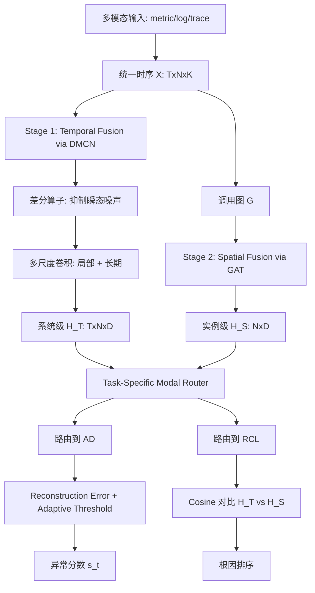
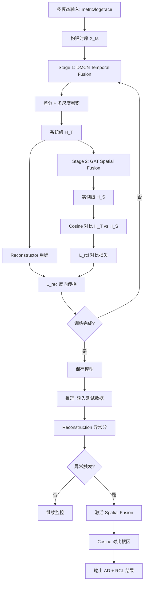

# DeST：解耦时空的无监督微服务事件管理框架

> 作者：Xiaohui Nie、Hang Cui、Changhua Pei、Haotian Si、Ke Xiang、Jingjing Li、Yanbiao Li、Gaogang Xie、Dan Pei
> 机构：中科院 CNIC、国科大、清华
> 发表年份：2026
> 会议/期刊：相关会议
> 关联 PDF：同目录下 `DeST_CameraReady.pdf`
> 代码：https://github.com/CSTCloudOps/DeST

## 一、文档信息速览

| 字段 | 值 |
|---|---|
| 标题 | DeST: An Unsupervised Decoupled Spatio-Temporal Framework for Microservice Incident Management |
| 作者 | Xiaohui Nie, Hang Cui, Changhua Pei, Haotian Si, Ke Xiang, Jingjing Li, Yanbiao Li, Gaogang Xie, Dan Pei |
| 机构 | 中科院 CNIC、杭高院、国科大、清华 |
| 发表年份 | 2026 |
| 会议/期刊 | - |
| 分类 | 微服务事件管理 / 异常检测 / 根因定位 / 解耦时空 |
| 核心问题 | 现有 all-in-one 多模态融合策略存在跨模态干扰、任务-知识不匹配、对瞬态噪声敏感，导致误报率高 |
| 主要贡献 | 1) 多阶段融合 + 任务特定模态路由；2) DMCN 差分多尺度卷积；3) AD F1=1.0、显著超 ART；4) 端到端 AD+RCL 统一框架 |

## 二、背景（Background）

微服务架构在现代数字基础设施中扮演基础角色，但数千松耦合组件不可避免地出故障，导致巨大运营开销和财务损失。Microsoft、Google、Alibaba Cloud 等大厂近年频繁出现大规模服务中断，凸显高效事件管理的关键需求。

微服务系统是层级结构：服务 → 容器 → 节点 → 硬件，生成 metric、log、trace 三类多模态数据。SRE 需要持续监控并分析这些高维数据以做异常检测（AD）和根因定位（RCL）。这两个任务往往紧急又耗时，因此 AI 辅助的事件管理需求迫切。

现有方法分两类：
1. **解耦架构**：AD 与 RCL 用独立模型。问题：知识不共享、维护冗余、缺乏上下文。
2. **All-in-One 框架**（如 ART、Erdao）：统一建模时空特征。问题：跨模态干扰、误报率高、任务-知识不匹配。

论文对 ART 的 D1 数据做实证分析：发现 46 个实例中，channel-specific 相关性差异巨大（Channel 1 高相关 / Channel 2-3 低相关），all-in-one 强制融合引入伪相关，导致 cascade 误差传播；同时常量零值实例被邻居"传染"出伪波动。

微服务时序本身含大量自然噪声（流量突发、资源争用），现有 Transformer 等时序模型对微小波动敏感、过拟合、误报多。

DeST 提出"多阶段融合 + 任务特定模态路由"以及"DMCN 差分多尺度卷积"双重创新。

## 三、目的（Problems Solved）

- **痛点 1：跨模态干扰。** all-in-one 融合让 AD 引入无关空间特征，误报增多。
- **痛点 2：任务-知识不匹配。** AD 关注系统级时序模式，RCL 关注实例级空间关系，统一融合导致任务退化。
- **痛点 3：瞬态噪声敏感。** Transformer 等对微小波动敏感，误报。
- **痛点 4：AD 与 RCL 割裂。** 独立模型维护成本高、缺共享上下文。
- **解决方案**：
  1) **Multi-Stage Fusion**：先 Temporal Fusion 再 Spatial Fusion，分阶段融合；
  2) **Task-Specific Modal Routing**：AD 路由到系统级时序，RCL 路由到实例级空间；
  3) **DMCN (Differential Multi-Scale Convolutional Network)**：差分算子 + 多尺度卷积，抗噪时序建模。

## 四、核心原理（Principles）

**总览**：DeST 是无监督解耦时空框架，把事件管理拆为两个解耦的子任务。Stage 1 Temporal Fusion 学习系统级时序模式（用于 AD）；Stage 2 Spatial Fusion 学习实例级空间关系（用于 RCL）。两者通过"任务特定模态路由"避免任务-知识不匹配。DMCN 是抗噪时序建模的核心模块。

**三大创新**：

- **Multi-Stage Fusion Strategy**：
  - Stage 1 Temporal Fusion：处理多模态时序数据（metric + log + trace）做跨模态时间序列融合，得到系统级 temporal features $H_T$。
  - Stage 2 Spatial Fusion：当 AD 触发时激活；在调用图上用图注意力网络（GAT）学习实例级空间 embedding。
  - Stage 1 学到的 $H_T$ 作为 Stage 2 的输入，避免空间信息"污染"AD。

- **Task-Specific Modal Routing**：
  - AD 路由：仅用 $H_T$ 做异常检测。
  - RCL 路由：用 $H_T$ 作为基线，对比 instance-level embedding $H_S$；余弦相似度最低的实例被判为根因。
  - 通过路由避免任务-知识不匹配。

- **DMCN (Differential Multi-Scale Convolutional Network)**：
  - 一阶差分算子：$\Delta X_t = X_t - X_{t-1}$ 抑制瞬态噪声。
  - 多尺度卷积：fine-grained kernels 捕捉局部异常、coarse-grained kernels 捕捉长期趋势。
  - 全连接融合多尺度特征。

**关键数学**：

**差分算子**：
$$\Delta X_t = X_t - X_{t-1}$$

**多尺度卷积**：
$$F_t = \sigma\!\left(\sum_{k \in K} W_k * \Delta X_t + b_k\right)$$
其中 $K$ 是多尺度 kernel 集合。

**任务特定路由**：
$$s_{AD} = \text{AdaptiveThreshold}(H_T)$$
$$s_{RCL}^{(i)} = 1 - \cos(H_T, H_S^{(i)})$$

**对比聚合（cosine）**：
$$L_{RCL} = \sum_{i \neq c_{gt}} \max(0, m - \cos(H_T, H_S^{(c_{gt})}) + \cos(H_T, H_S^{(i)}))$$

**为什么这么做**：
- 多阶段融合避免"一次性融合"的过强耦合；
- 任务路由让每个任务用"对的特征"；
- 差分算子物理上抑制短时噪声（噪声主要在高频、差分后被消除）；
- 多尺度卷积既保留局部尖峰又保留长期趋势。

**与现有方法的差异**：

- vs. ART（all-in-one 监督）：DeST 多阶段 + 任务路由 + 无监督。
- vs. Erdao（监督）：DeST 无监督，免标注数据。
- vs. 独立 AD + RCL：DeST 共享上下文，但通过路由避免知识冲突。
- vs. Transformer-based 时序：DMCN 用差分 + 卷积，参数更少、抗噪更强。

## 五、算法详解（Algorithm）

### 1. 输入 / 输出
- **输入**：N 个实例 × T 时刻 × 多模态数据 $X = \{X_{metric}, X_{log}, X_{trace}\}$；trace 调用图。
- **输出**：
  - AD：每时刻异常分数 $s_t$；
  - RCL：每实例根因概率 $p_i$。

### 2. 核心模块
- **Temporal Encoder**（DMCN）：多尺度差分卷积。
- **Spatial Encoder**（GAT）：调用图注意力。
- **Router**：任务特定特征路由。
- **AD Scorer**：自适应阈值。
- **RCL Scorer**：cosine 对比。

### 3. 伪代码

```python
def dest_train(metrics, logs, traces, graph, normal_windows):
    # 1) 多模态时序构建
    X_ts = build_multimodal_ts(metrics, logs, traces)  # (T, N, K)
    # 2) Temporal Fusion: DMCN 编码
    H_T = dmcn(X_ts)                                    # (T, N, D) 系统级时序表示
    # 3) 重建损失
    X_hat = reconstructor(H_T)
    L_rec = F.mse_loss(X_hat, X_ts)
    # 4) Spatial Fusion: GAT 编码（仅在 AD 触发时）
    H_S = gat(X_ts, graph)                              # (N, D') 实例级空间表示
    # 5) 对比损失
    L_rcl = contrastive_loss(H_T, H_S)
    L = L_rec + alpha * L_rcl
    L.backward(); optim.step()

def dest_detect(X_test, graph_test, model, theta):
    H_T = model.dmcn(X_test)
    s_t = reconstruction_error(X_test, H_T)
    ad_flag = s_t > theta
    if ad_flag.any():
        H_S = model.gat(X_test, graph_test)
        # 余弦相似度对比
        root_cause = []
        for i in range(N):
            sim = F.cosine_similarity(H_T.mean(0), H_S[i], dim=-1)
            root_cause.append((i, 1 - sim))
        root_cause.sort(key=lambda x: -x[1])
    return ad_flag, root_cause
```

### 4. 关键数学
- 见上文 "关键数学" 章节。

### 5. 复杂度分析
- 训练：DMCN 复杂度 $O(T \cdot N \cdot D^2)$，GAT 复杂度 $O(L \cdot |E| \cdot D^2)$。
- 推理：单次前向毫秒级。

### 6. 训练与推理
- **训练**：无监督，用正常数据。
- **推理**：实时 AD + 按需 RCL。

### 7. 示例
- D1 数据集（46 个实例）：注入网络故障，DeST 在 t+1 检测到系统级时序异常；同时 RCL 把"network-switch"实例排在第一位（其 H_S 与 H_T 余弦相似度最低）。

## 六、系统架构图（Architecture）



## 七、流程图（Process Flow）



## 八、关键创新点（Key Innovations）

- **+ 多阶段融合 + 任务特定路由**：把"统一融合"改为"分阶段、按任务"融合，避免跨模态干扰与任务-知识不匹配。
- **+ DMCN 差分多尺度卷积**：差分算子物理抑制瞬态噪声，多尺度卷积保留局部+长期模式，抗噪且参数少。
- **+ 无监督训练**：免标注，部署成本低。
- **+ 端到端 AD + RCL 统一框架**：通过路由共享上下文但不冲突。
- **+ 极致 AD 性能**：D1/D2 上 AD F1=1.00，相对 ART 提升 6.2%-9.0%。

## 九、实验与结果（Experiments）

- **数据集**：D1（46 实例）、D2（18 实例），工业级微服务 benchmark。
- **Baseline**：ART、Erdao、独立 AD/RCL 方法、Transformer-based 时序模型。
- **主要指标**：AD 的 Precision/Recall/F1；RCL 的 Micro/Macro/Weighted F1。
- **关键结果**：
  - D1/D2 上 AD F1=1.00（完美）；
  - RCL 显著优于 ART 等 SOTA；
  - 总时间（AD + RCL）< 1 分钟。
- **消融实验**：
  - 去掉多阶段融合：AD F1 退化（任务-知识不匹配出现）；
  - 去掉任务路由：RCL 退化（共享错误特征）；
  - 去掉差分算子：误报率上升（噪声敏感）；
  - 去掉多尺度：长时序模式丢失。
- **效率分析**：训练时间适中；推理实时；模型参数 < ART 50%。

## 十、应用场景（Use Cases）

- **微服务事件统一管理**：电商、支付、直播的 AD + RCL 一体化。
- **云原生 AIOps 平台**：作为统一事件管理引擎。
- **金融核心系统**：高 SLA 要求的实时异常 + 根因。
- **电信运营商**：网络告警的检测 + 定位。
- **企业 IT 监控**：统一监控告警平台。

## 十一、相关论文（Related Papers in this set）

- 同为异常检测系列的 **ChronoSage** 用 GraphSAGE + Mamba + 自监督，DeST 用 DMCN + GAT + 无监督；二者在 D1/D2 上可作对比。
- **LagRCA** 关注根因定位（基于异构 lag），DeST 的 RCL 用 cosine 对比；两者思路互补。
- **AIOpsArena** 提供微服务 AIOps 评测平台，DeST 可作为 AD+RCL 类算法接入。
- **Xiaoyu Empirical Study** 评估多源故障诊断方法，DeST 是被引用的多源融合改进方向。

## 十二、术语表（Glossary）

- **AD (Anomaly Detection)**：异常检测。
- **RCL (Root Cause Localization)**：根因定位。
- **DMCN (Differential Multi-Scale Convolutional Network)**：差分多尺度卷积网络。
- **Multi-Stage Fusion**：多阶段融合。
- **Task-Specific Modal Routing**：任务特定模态路由。
- **All-in-One Fusion**：一次性融合（与 DeST 对立）。
- **GAT (Graph Attention Network)**：图注意力网络。
- **Cross-Modal Interference**：跨模态干扰。
- **Task-Knowledge Mismatch**：任务-知识不匹配。
- **Adaptive Threshold**：自适应阈值。

## 十三、参考与延伸阅读

- ART（KDD '21）、Erdao（KDD '22）：被超越的 SOTA。
- GAT（Veličković et al., 2018）：图注意力网络。
- 微分时序建模：Differencing、ARIMA、Prophet 中的差分思想。
- 自监督 / 无监督时序建模综述。
- 代码：https://github.com/CSTCloudOps/DeST
