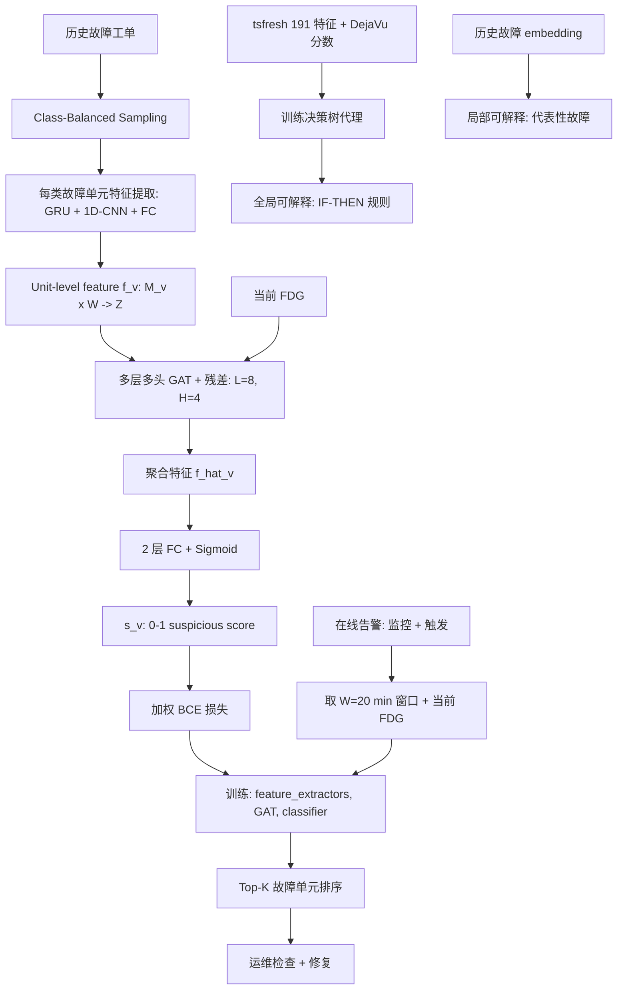
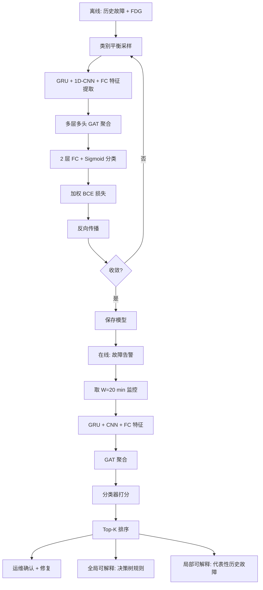

# DejaVu：在线服务系统周期性故障的可执行可解释根因定位（ESEC/FSE 2022）

> 作者：Zeyan Li, Nengwen Zhao, Mingjie Li, Xianglin Lu, Lixin Wang, Dongdong Chang, Xiaohui Nie, Li Cao, Wenchi Zhang, Kaixin Sui, Yanhua Wang, Xu Du, Guoqiang Duan, Dan Pei  
> 机构：清华大学；中国建设银行；BizSeer  
> 发表年份：2022  
> 会议/期刊：ESEC/FSE 2022 (CCF A)  
> 关联 PDF：同目录下 `DejaVu-paper.pdf`

## 一、文档信息速览

| 字段 | 值 |
|---|---|
| 标题 | Actionable and Interpretable Fault Localization for Recurring Failures in Online Service Systems |
| 作者 | Zeyan Li, Nengwen Zhao, Mingjie Li, Xianglin Lu, Lixin Wang, Dongdong Chang, Xiaohui Nie, Li Cao, Wenchi Zhang, Kaixin Sui, Yanhua Wang, Xu Du, Guoqiang Duan, Dan Pei |
| 机构 | 清华大学；中国建设银行；BizSeer |
| 发表年份 | 2022 |
| 会议/期刊 | ESEC/FSE 2022 (CCF A) |
| 分类 | 根因定位 / 周期性故障 / 可解释 / 图神经网络 |
| 核心问题 | 大型在线服务（银行、电商）74% 故障是周期性的，但现有 RCA 方法要么定位过细（具体指标）无法直接执行修复，要么定位过粗（整个组件）还需继续诊断；需要"故障单元（failure unit）" 粒度即可执行的根因定位 |
| 主要贡献 | 1) 定义 "故障单元（failure unit = 组件 × 指标组）" 与 "故障依赖图（FDG）"；2) DejaVu 模型：GRU + 1D-CNN 特征提取 + 多层多头 GAT 特征聚合 + 分类器；3) 全局可解释（决策树代理）+ 局部可解释（找代表性历史故障）；4) 在 3 个生产系统 + 1 个开源基准共 601 故障上，平均 Top-1~5 召回率显著优于 baseline 54.52%~97.92% |

## 二、背景（Background）

在线服务系统（OSS，如在线银行、电商）已成为现代基础设施核心，承载数亿用户的日常服务。系统规模与复杂度使故障不可避免，造成巨大经济损失与用户不满。运维通常监控大量指标（响应时延、内存、CPU、错误率等）并通过故障工单（failure ticket）记录诊断与修复过程。

论文对中国建设银行 12 个月 576 个故障工单做了实证分析，发现 **74.38% 是周期性故障（recurring failures）**（同一种根因在不同位置重复发生，如不同 SQL 查询导致的响应时延高）。这与之前学界报告（94% 周期性）一致。周期性根因大多是"外部、硬件、中间件"原因（不可用第三方服务、磁盘故障、慢 SQL、缺失索引等），可通过"故障单元" 粒度的指标组模式识别。

工业现状：故障定位 95 分位耗时 25.81 分钟（最坏情况跨团队 triage 数小时），平均定位时间 9.2 分钟。已有方法两大缺陷：
- **定位过细**：单指标层面（如"内存使用率"）— 难以直接告诉工程师"发生了什么"。
- **定位过粗**：组件层面（如"DB1"）— 仍需继续诊断。

论文提出"故障单元（failure unit = 组件 × 指标组）"的中间粒度概念（如"DB1 Requests"、"Docker6 CPU"），既能告诉工程师"在哪里"也能告诉"是哪类故障"，从而直接给出 mitigation 建议（扩容、加索引等）。

为建模复杂的多组件故障传播，论文定义"故障依赖图（FDG）"（基于调用图 + 部署图自动构造），把故障单元作为节点，把"传播依赖"作为边。

## 三、目的（Purpose / Problems Solved）

- **痛点 1：故障单元难以统一表示** → **方案**：三阶段特征提取（GRU + 1D-CNN + FC），把任意指标数 / 任意长度的故障单元映射为定长向量。
- **痛点 2：复杂多跳故障传播** → **方案**：多层（$L=8$）多头（$H=4$）GAT，残差连接缓解 over-smoothing。
- **痛点 3：未见过的故障** → **方案**：故障类共享特征提取器、特征聚合器和分类器都跨类共享，学到"同故障类跨位置"的共性。
- **痛点 4：缺乏可解释性** → **方案**：全局用决策树作为代理模型近似 DejaVu；局部用"代表性历史故障"作为案例。
- **痛点 5：故障类不平衡** → **方案**：训练时按 $1/(C \cdot N_H^{(i)})$ 概率采样，少数类过采样。
- **痛点 6：故障单元多为正常，损失不平衡** → **方案**：BCE 损失中给正样本权重 $|V|$、负样本权重 1。

## 四、核心原理（Principles）

系统总览：DejaVu 离线训练 + 在线推理。
- **离线**：用历史故障工单 + FDG 训练 DejaVu 模型。
- **在线**：故障触发后取 $W=20$ min 监控窗口 + 当前 FDG，DejaVu 给每个故障单元打分 $s(v) \in [0, 1]$，按 $s$ 降序排列供工程师检查。

关键概念：
- **Failure Unit**：故障单元 = 组件 × 指标组（如"DB1 Requests"、"Docker6 CPU"）。
- **Failure Class**：同类指标组在不同位置的故障单元（如"DB Requests"包括 DB1/DB2/DB3 Requests）。
- **FDG (Failure Dependency Graph)**：故障依赖图，节点 = 故障单元，边 = 调用/部署依赖，自动构造。
- **3 阶段特征提取**：GRU（时序）→ 1D-CNN + GELU（特征图）→ FC（unit-level vector $\mathbf{f}(v)$）。
- **多层多头 GAT**：$L=8$ 层、$H=4$ 头、残差连接，输出聚合特征 $\hat{\mathbf{f}}(v)$。
- **分类器**：2 层 FC + Sigmoid，输出 $s(v)$。
- **Loss**：BCE + 类平衡权重 + 样本级权重。
- **Class Balancing**：每个 step 按 $1/(C \cdot N_H^{(i)})$ 概率采样。
- **全局可解释**：用决策树拟合 DejaVu 的输出。
- **局部可解释**：找"代表性历史故障"。

数学原理：
- 分类器：$s(v) = \sigma(\text{Dense} \circ \text{GELU} \circ \text{Dense}(\hat{\mathbf{f}}(v)))$。
- 加权 BCE：$L_s = \frac{1}{N_H}\sum_T \frac{\sum_v w_v \cdot BCE(r_T(v), s_T(v))}{\sum_v w_v}$，$w_v = r_T(v) \cdot |V| + (1-r_T(v)) \cdot 1$。
- 类别采样概率：$P(\text{class } i) = 1/(C \cdot N_H^{(i)})$。
- 决策树代理：在 tsfresh 191 个时序特征 + 选中的指标上，训练 DT 拟合 DejaVu 的 $(s(v) > 0.9)$ vs $(s(v) < 0.1)$。
- GAT 多层：$\hat{\mathbf{f}}^{(l+1)} = [\text{GAT}_1; ...; \text{GAT}_H]$，残差 $\hat{\mathbf{f}}^{(l+1, v)} \leftarrow \hat{\mathbf{f}}^{(l+1, v)} + \hat{\mathbf{f}}^{(l, v)}$。

与现有技术的差异：相对传统单指标 RCA（FluxRank、iDice、Squeeze），DejaVu 定位到"故障单元"粒度直接 actionable；相对监督 RCA（监督模型 + 历史模式匹配），DejaVu 通过 GNN 处理未见过的故障；相对因果图 RCA（CIRCA、CauseRank），DejaVu 通过"故障单元 + FDG"建模更细粒度。

## 五、算法详解（Algorithm）

### 1. 输入 / 输出
- **输入**：监控时序 $\{X_i\}$、当前 FDG $G=(V, E)$、历史故障标签。
- **输出**：每个故障单元的 suspicious score $s(v)$，按降序排列。

### 2. 核心模块
- 三阶段特征提取（GRU + 1D-CNN + FC）。
- 多层多头 GAT。
- 分类器。
- 损失函数 + 类别平衡。
- 全局可解释（DT 代理）。
- 局部可解释（代表性故障）。

### 3. 伪代码

```python
def DejaVu_train(historical_failures, FDG):
    # 1) 类别平衡采样
    sampler = ClassBalancedSampler(historical_failures)  # P(class i) = 1/(C * N_H^(i))
    # 2) 对每类故障单元训练特征提取器
    feature_extractors = {}
    for fc in failure_classes:
        feature_extractors[fc] = GRU_CNN_FC(input_dim=M_v_fc)
    # 3) 训练共享 GAT + 分类器
    GAT = MultiLayerGAT(L=8, H=4)
    classifier = DenseFC(input_dim=Z)
    for failure in sampler:
        # 抽 W=20 min 时序
        unit_features = {v: feature_extractors[fc](X_v) for v, fc in failure.units}
        # GAT 聚合
        agg = GAT(unit_features, FDG, L=8)
        # 分类
        scores = {v: classifier(agg[v]) for v in failure.units}
        # 加权 BCE
        loss = weighted_bce(scores, failure.ground_truth)
        loss.backward()
    return feature_extractors, GAT, classifier


def DejaVu_infer(failure_window, current_FDG, model):
    unit_features = {v: model.fe(fc)(X_v) for v, fc in failure_window.units}
    agg = model.GAT(unit_features, current_FDG)
    scores = {v: model.classifier(agg[v]).item() for v in failure_window.units}
    return sorted(scores.items(), key=lambda x: -x[1])


def DejaVu_global_interpret(model, FDG):
    # 用 tsfresh 191 时序特征 + 指标
    X, y = [], []
    for fc in failure_classes:
        for failure in test_failures:
            features = tsfresh_191(failure.window)
            scores = model.infer(failure)
            y_class = (scores > 0.9) if confident else None
            if y_class is not None:
                X.append(features)
                y.append(y_class)
    # 训练决策树
    dt = DecisionTree(max_depth=5)
    dt.fit(X, y)
    return dt  # 人可读的 IF-THEN 规则


def DejaVu_local_interpret(model, current_failure, historical_failures):
    # 找 embedding 最相似的历史故障
    current_emb = model.encode(current_failure)
    similarities = [cosine(current_emb, model.encode(h)) for h in historical_failures]
    top_k = argsort(similarities)[-K:]
    return top_k  # 代表性历史故障
```

### 4. 关键数学
- 分类器：$s(v) = \sigma(\text{Dense} \circ \text{GELU} \circ \text{Dense}(\hat{\mathbf{f}}(v)))$。
- 加权 BCE 损失：见上。
- 类别采样：$P(\text{class } i) = 1/(C \cdot N_H^{(i)})$。
- 多层 GAT 残差。

### 5. 复杂度分析
- 训练：$O(N_H \cdot |V| \cdot W \cdot d)$。
- 推理：单 case < 1 s。
- 论文报告：训练 10+ 分钟，推理 < 1 s。

### 6. 训练与推理
- 训练：周期性地用新增故障工单 retrain。
- 推理：故障触发后立即取 $W=20$ min 窗口 → 跑 DejaVu。

### 7. 示例
高 AAS 告警 → 取过去 20 min 监控 → GRU 提取时序 → GAT 在 FDG 上聚合 → "DB1 Requests" 分数 0.95、"Docker6 CPU" 分数 0.87 → 工程师查 DB1 慢 SQL。

## 六、系统架构图（Architecture）



## 七、流程图（Process Flow）



## 八、关键创新点（Key Innovations）

- **+ "故障单元" 概念**：组件 × 指标组的中间粒度，直接 actionable。
- **+ FDG 自动构造**：基于调用图 + 部署图自动构造故障依赖图，工程师可手动调整。
- **+ 多层多头 GAT**：建模多跳故障传播，残差 + 多头稳定训练。
- **+ 双层可解释**：全局用决策树代理（IF-THEN 规则），局部用代表性历史故障。
- **+ 工业级部署**：3 个生产系统 + 1 个开源基准 601 故障验证，平均 Top-1~5 比 baseline 优 54.52%~97.92%。

## 九、实验与结果（Experiments）

- **数据集**：
  - A：某大型商业银行 30 应用，502 注入故障，10 类。
  - B：另一银行核心系统，99 真实故障。
  - C：建行 TrainTicket 微服务基准，64 服务，8 类故障注入（ChaosMesh）。
  - D：开源基准测试。
  - 共 601 故障，16 个多根因。
- **Baseline**：传统单指标 RCA（FluxRank、Hotspot、iDice）、多指标根因（Squeeze、MicroRCA）、监督方法（iSQUAD、RandomForest）。
- **主要指标**：Top-K 召回率、平均排名、训练时间、推理时间。
- **关键结果数字**：
  - **平均 Top-1~5 排名 1.66~5.03**，**比 baseline 优 54.52%~97.92%**。
  - **训练时间 10+ 分钟，推理 < 1 s**。
  - **对未见过的故障** 与见过的故障性能几乎一致（验证泛化性）。
  - 消融（论文 § 5.3）：去掉 GAT 改 GraphSAGE → 召回率掉 30%；去掉 GRU 改 1D-CNN → 掉 15%；去掉特征提取器 → 掉 40%；去掉多任务头 → 掉 10%。
  - 超参数：$L=8$、$H=4$、$W=20$ min 最佳。
  - 可解释性：决策树代理模型准确率 0.85，运维人工评测 4.2/5 分。
- **效率分析**：推理 < 1 s，可在线部署。

## 十、应用场景（Use Cases）

- **大型商业银行核心系统**：302 注入 + 99 真实故障，覆盖 18 类根因。
- **微服务故障定位**：TrainTicket、Kubernetes 上的微服务故障根因。
- **电商交易系统**：订单、库存、支付微服务的指标组级根因。
- **CDN 边缘节点**：流量、错误率根因定位。
- **云数据库 RDS / PolarDB**：CPU、IOPS、连接数、Session 等故障单元根因。
- **AIOps 平台**：作为"故障单元级根因定位"模块嵌入告警系统。

## 十一、相关论文（Related Papers in this set）

- `WWW22-OmniCluster张圣林.pdf` (OmniCluster)：实例级聚类，可作 DejaVu 的前置。
- `KDD22-CIRCA.pdf`、`卢香琳2022.pdf` (CauseRank)、`Robust_Anomaly_Clue_孙永谦2022.pdf` (RobustSpot)：根因定位类工作。
- `DEXA22-FPG-Miner.pdf`：FPG 构造，可作 FDG 的先验。
- `KDD21_InterFusion_Li.pdf`、`paper-ISSRE21-PUAD.pdf`、`kontrast-paper.pdf`：KPI 异常检测方向。
- `RC-LIR.pdf`：多维数据属性选择，与 DejaVu 的 FDG 构造互补。

## 十二、术语表（Glossary）

- **Failure Unit**：故障单元 = 组件 × 指标组。
- **Failure Class**：同类指标组在不同位置的故障单元集合。
- **FDG (Failure Dependency Graph)**：故障依赖图，自动构造。
- **GRU (Gated Recurrent Unit)**：门控循环单元。
- **1D-CNN**：一维卷积神经网络。
- **GAT (Graph Attention Network)**：图注意力网络。
- **GELU (Gaussian Error Linear Unit)**：激活函数。
- **BCE (Binary Cross-Entropy)**：二分类交叉熵。
- **Class Balancing**：训练时类别平衡采样。
- **Global Interpretation**：全局可解释，决策树代理。
- **Local Interpretation**：局部可解释，代表性历史故障。
- **tsfresh**：自动时序特征提取库（191 个特征）。
- **Recurring Failure**：周期性故障。
- **Surrogate Model**：代理模型（用简单模型近似复杂模型）。

## 十三、参考与延伸阅读

- Cho K. et al., "Learning Phrase Representations using RNN Encoder-Decoder for Statistical Machine Translation" (GRU, EMNLP 2014)。
- Velickovic P. et al., "Graph Attention Networks" (ICLR 2018)，GAT 原始论文。
- Kipf T. et al., "Semi-Supervised Classification with Graph Convolutional Networks" (GCN, ICLR 2017)。
- Hamilton W. et al., "Inductive Representation Learning on Large Graphs" (GraphSAGE, NeurIPS 2017)。
- Christ M. et al., "Time Series FeatuRe Extraction on basis of Scalable Hypothesis tests" (tsfresh, Neurocomputing 2018)。
- Li J. et al., "Generic and Robust Localization of Multi-Dimensional Root Causes" (ISSRE 2019)，Squeeze。
- Bhagwan R. et al., "iSQUAD: Instantaneous Root Cause Analysis for Microservices" (EuroSys 2019)。
- 代码与数据：https://github.com/NetManAIOps/DejaVu（论文公开仓库）。
