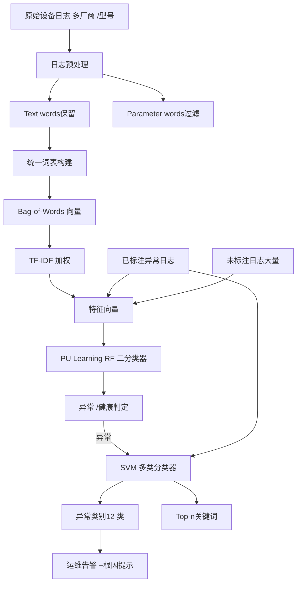

# Device-Agnostic Log Anomaly Classification with Partial Labels（IWQoS2018）

> 作者：Weibin Meng, Ying Liu, Shenglin Zhang, Dan Pei, Hui Dong, Lei Song, Xulong Luo
>机构：清华大学；南开大学；百度；BNRist
> 发表年份：2018
>会议/期刊：IWQoS2018（IEEE/ACM26th International Symposium on Quality of Service）
>关联 PDF：同目录下 `Device_Agnostic_Log_Anomaly_Classification.pdf`

## 一、文档信息速览

|字段 | 值 |
|---|---|
|标题 | Device-Agnostic Log Anomaly Classification with Partial Labels |
| 作者 | Weibin Meng, Ying Liu, Shenglin Zhang, Dan Pei, Hui Dong, Lei Song, Xulong Luo |
|机构 |清华大学；南开大学；百度；BNRist |
| 发表年份 |2018 |
|会议/期刊 | IWQoS2018 |
|分类 |设备日志异常分类 / PU Learning / Bag-of-words + TF-IDF |
|核心问题 |不同厂商 /型号网络设备的日志格式各异；正则表达式方法通用性差；海量日志无法全部标注；现有文本分类方法无法学习设备无关的词表 |
| 主要贡献 | (1) 提出 LogClass 数据驱动框架，结合词袋模型与 PU Learning；(2)异常检测 F1=99.515%；(3)异常分类 Macro-F1=95.32%，Micro-F1=99.74%；(4)训练 /分类时间显著优于 L-LDA 与正则表达式 |

## 二、背景（Background）

随着数据中心网络流量爆炸式增长，交换机、路由器、VPN、防火墙等网络设备数量激增。当网络设备出现异常时，会显著影响业务，因此运维人员需要持续监控并快速定位根因。基于 KPI曲线（CPU 利用率、内存占用等）的方法只能回答"设备是否异常"，但无法判断异常类别（如 reboot / packet loss / port down 等），而异常分类对快速定位根因至关重要。

网络设备日志（如 syslog）记录了大量异常事件，比 KPI 更丰富。例如日志 "System is rebooting now" 可立即定位为 "SYSTEM REBOOT" 类异常。但现有方法（基于正则表达式 RE）存在三大问题：

1. **通用性差**：每种设备型号需单独配置正则；不同厂商日志差异大，无法共享。
2. **维护成本高**：海量新类型日志不断出现，需不断更新正则；20%-45% 的日志语句在软件生命周期内会变化。
3. **计算效率低**：在大型数据中心数千万条日志上运行大量正则极慢。

此外，设备日志的"部分标注"（partial label）特性使得传统监督学习无法直接使用——绝大多数异常日志未被标注，只有少数被正则捕获的异常日志是已标注。

## 三、目的（Problems Solved）

- **设备无关的词表**：用 bag-of-words词袋模型从所有厂商 /型号日志中学习统一词表。
- **部分标注**：用 PU Learning（Positive-Unlabeled Learning）从已标注异常日志 +未标注日志（混合健康与异常）中训练二分类器。
- **多类别异常分类**：用 SVM多类分类器把检测出的异常日志分到具体类别（FAN RECOVERED / BOARD DISABLE / SYSTEM REBOOT / BGP NEIGHBOR CHANGED 等12 类）。
- **白盒可解释**：通过 SVM系数排序得到每个类别的 top-n关键词，便于运维理解。
- **快速训练与推理**：训练时间247.73 秒、分类时间4.836 秒，比 L-LDA 快17.91 /5.91 倍，比 RE 快约86.74 倍。

## 四、核心原理（Principles）

**系统总览**：LogClass包含四步：(1) 日志预处理（把词分为 text word 与 parameter word，过滤参数）；(2)特征构造（bag-of-words + TF-IDF 加权）；(3) PU Learning 二分类（异常 /健康）；(4) SVM 多类分类（12 类异常）。特征词表是设备无关的——所有厂商 /型号日志统一映射到同一词表空间，从而实现跨设备通用。

**关键概念**：

- **Text Word**：模板词，描述事件语义（如 "Interface"、"changed"、"down"）。
- **Parameter Word**：变量词，随设备变化的参数（IP、接口号）。
- **Bag-of-Words**：词袋模型，把日志表示为词频向量。
- **TF-IDF**：词频 -逆文档频率加权。
- **PU Learning**：仅用正样本 +未标注样本训练二分类器。
- **SVM**：支持向量机。
- **Random Forest (RF)**：随机森林（对比基线）。
- **Labeled-LDA (L-LDA)**：监督主题模型（对比基线）。
- **Regular Expression (RE)**：正则表达式（工业界主流方法）。
- **Anomaly Category**：异常类别（FAN RECOVERED、OSPF NEIGHBOR CHANGED 等）。
- **Top-n Important Words**：SVM系数排序得到每类异常最关键的词。

**数学原理**：

- **PU Learning标签概率假设**（论文 Eq.1,2）：

$$
p(s=1|x, y=0) =0
$$

$$
p(s=1|x, y=1) = p(s=1|y=1)
$$

只有正样本可能被标注，未标注样本可能为正或负。

- **从非传统分类器 $g(x) = p(s=1|x)$ 得到传统分类器 $f(x) = p(y=1|x)$**（论文 Eq.3）：

$$
f(x) = \frac{g(x)}{c}, \quad c = p(s=1|y=1)
$$

- **$c$的简单估计**（论文 Eq.4）：

$$
c = \frac{1}{n} \sum_{x \in P} g(x)
$$

其中 $P$ 为标注集中的正样本集合。

- **TF-IDF**：

$$
\operatorname{TF\text{-}IDF}(w, d) = \operatorname{tf}(w, d) \cdot \log\frac{N}{\operatorname{df}(w)}
$$

其中 $N$ 为日志总数，$\operatorname{df}(w)$ 为包含词 $w$ 的日志数。

- **SVM决策函数**：

$$
f(x) = \operatorname{sgn}\!\left(\sum_{i} \alpha_i y_i K(x_i, x) + b\right)
$$

- **Precision / Recall / F1 / Macro-F1 / Micro-F1**：

$$
P = \frac{TP}{TP+FP}, \quad R = \frac{TP}{TP+FN}, \quad F1 = \frac{2PR}{P+R}
$$

$$
\text{Macro-F1} = \frac{1}{n}\sum_i F1_i, \quad \text{Micro-F1} = \frac{2 \cdot \sum_i TP_i}{\sum_i (TP_i + FP_i) + \sum_i (TP_i + FN_i)}
$$

**与现有技术的差异**：与正则表达式相比，LogClass设备无关、可学习、可扩展；与 L-LDA相比，LogClass 在 Macro-F1 与训练 /分类速度上均显著领先；与 FT-tree等模板提取方法相比，LogClass 直接面向异常分类而非模板提取。

## 五、算法详解（Algorithm）

1. **输入 / 输出**：
 - 输入：来自多种厂商 /型号网络设备的原始 syslog +已标注的少量异常日志。
 - 输出：(a) 每条日志的异常 /健康判定；(b)异常日志所属类别；(c) 每个类别的 top-n关键词。

2. **核心模块**：
 - **日志预处理**：把日志词分为 text word（保留）与 parameter word（过滤），基于域知识的格式规则（如纯字母 → text，纯数字 → parameter）。
 - **特征构造**：bag-of-words 向量 + TF-IDF 加权，形成高维稀疏特征。
 - **PU Learning 二分类**：把已标注异常日志作为正样本 $P$，未标注日志作为 $U$，训练 RF 二分类器，并按 $c$做校正。
 - **SVM 多类分类**：把已标注异常日志按12 个类别，训练 SVM分类器；用 SVM系数排序得到每类 top-n关键词。
 - **在线检测 /分类**：实时日志 →特征 →PU 二分类 →若异常则 SVM 多分类 →类别 +关键词。

3. **伪代码**：

```python
def preprocess_log(log):
 """日志预处理：把日志词分为 text/parameter"""
 words = tokenize(log)
 text_words = []
 for w in words:
 if is_text_word(w):
 text_words.append(w)
 # 否则过滤（parameter word）
 return text_words

def build_vocab(logs):
 """从所有厂商 /型号日志构建统一词表"""
 vocab = set()
 for log in logs:
 for w in preprocess_log(log):
 vocab.add(w)
 return {w: i for i, w in enumerate(sorted(vocab))}

def featurize(log, vocab, idf):
 """bag-of-words + TF-IDF"""
 text_words = preprocess_log(log)
 vec = np.zeros(len(vocab))
 for w in text_words:
 vec[vocab[w]] +=1
 vec *= idf
 return vec

def pu_binary_classify(positive_X, unlabeled_X):
 """PU Learning 二分类"""
 # Step1:训练非传统分类器 g(x) = p(s=1|x)
 rf = RandomForest()
 X = np.vstack([positive_X, unlabeled_X])
 s = np.concatenate([np.ones(len(positive_X)), np.zeros(len(unlabeled_X))])
 rf.fit(X, s)
 # Step2:估计常数 c
 c = np.mean([rf.predict_proba(x)[0][1] for x in positive_X])
 # Step3:校正为 f(x) = g(x)/c
 def predict_proba(x):
 g = rf.predict_proba(x)[0][1]
 return g / c
 return predict_proba

def svm_multiclass(positive_X, labels):
 """SVM 多类分类（one-vs-rest）"""
 svm = LinearSVC(multi_class="ovr")
 svm.fit(positive_X, labels)
 return svm

def detect_and_classify(log, vocab, idf, pu_clf, svm_clf):
 """在线检测 +分类"""
 x = featurize(log, vocab, idf)
 p_anom = pu_clf(x)
 if p_anom >0.5:
 category = svm_clf.predict([x])[0]
 top_words = top_n_keywords(svm_clf, category)
 return "anomalous", category, top_words
 return "healthy", None, None
```

4. **关键数学**：见 §四。

5. **复杂度分析**：
 -特征构造：$O(|V|)$，$V$ 为词表大小。
 - PU Learning RF训练：$O(N \cdot d \cdot T)$，$N$样本数，$d$特征维度，$T$树数。
 - SVM训练：$O(N^2 \cdot d)$。
 - 在线推理：$O(d)$，毫秒级。

6. **训练与推理**：
 -训练：(1) 日志预处理；(2)词表构建；(3) TF-IDF拟合；(4) PU Learning RF训练；(5) SVM 多类训练。
 -推理：单条日志预处理 →TF-IDF 向量化 →PU 二分类 →若是异常则 SVM 多分类。

7. **示例**：输入两条交换机日志：
 - L1: `Interface TenGigabitEthernet1/0/30 is protocol down.`（已标注 anomalous）。
 - L2: `Interface TenGigabitEthernet1/0/12 is link down.`（unlabeled）。
 LogClass 把日志 token化为 text words：["Interface", "TenGigabitEthernet", "is", "down"]，过滤 IP /接口号等参数词，用 bag-of-words + TF-IDF转为特征向量。PU Learning RF 检测 L2 为 anomalous（与 L1共享 "Interface / down"等关键词）。SVM 多分类把 L2归类为 "INTERFACE DOWN"类。运维人员通过 top-5关键词 `interface, down, state, GigabitEthernet, link`直观理解该类异常。

## 六、系统架构图（Architecture）



## 七、流程图（Process Flow）

```mermaid
flowchart TD
 S1[原始 syslog 多厂商] --> S2[Tokenize 分词]
 S2 --> S3[Text / Parameter分类]
 S3 --> S4[过滤 Parameter词]
 S4 --> S5[统一词表]
 S5 --> S6[Bag-of-Words 向量化]
 S6 --> S7[TF-IDF 加权]
 S7 --> S8[特征向量 X]
 S9[已标注异常日志] --> S10[正样本集 P]
 S10 --> S11[RF训练 g(x) p s=1 x]
 S11 --> S12[估计 c p s=1 y=1]
 S12 --> S13[PU分类器 f x g x c]
 S8 --> S13
 S13 --> S14{是否异常?}
 S14 -->|否| S15[健康日志]
 S14 -->|是| S16[SVM 多类分类]
 S16 --> S17[异常类别 +Top-n关键词]
 S17 --> S18[运维告警]
```

## 八、关键创新点（Key Innovations）

- **+设备无关词表**：跨厂商 /型号统一词表，无需为每种设备训练单独模型。
- **+PU Learning 处理部分标注**：传统监督方法在 partial label 下 F1急剧下降，LogClass保持稳定。
- **+ TF-IDF词袋特征**：简单但有效，无需深度学习也能达到99.5% F1。
- **+白盒关键词解释**：通过 SVM系数排序得到 top-n关键词，运维人员可直接理解每个异常类别。
- **+训练 /分类速度**：训练247.73 秒、分类4.836 秒，远快于 L-LDA 与 RE。
- **+首次工业级部署**：在顶级全球搜索引擎的58 种交换机、10+ 数据中心、2 周数据上验证。

## 九、实验与结果（Experiments）

- **数据集**（论文 Table III）：
 -来自某顶级全球搜索引擎的58 种交换机、10+ 数据中心、2 周数据。
 -1,758,458 已标注异常设备日志 +16,702,547 未标注设备日志。
 -12 个异常类别：FAN RECOVERED、OSPF NEIGHBOR CHANGED、FAN FAILED、BOARD DISABLE、BGP NEIGHBOR CHANGED、POWER DOWN、SYSTEM REBOOT、INTERFACE DOWN、PORT DOWN、PROTOCOL DOWN、OSPF DOWN、MODEL OUT。
- **Baseline**：RandomForest（RF）、Labeled-LDA（L-LDA）、Regular Expression（RE）。
- **指标**：Precision、Recall、F1-score、Macro-F1、Micro-F1、训练时间、分类时间。
- **关键结果数字**（论文 Table V / Table VII）：
 - **异常检测 F1=99.515%**（10-fold cross-validation），Precision=99.048%，Recall=99.988%。
 - **新设备测试**（5 种新加入交换机，10% 日志）：F1=99.106%，Precision=99.081%，Recall=99.132%。
 - **异常分类 Macro-F1=95.32%，Micro-F1=99.74%**，训练时间247.73 秒，分类时间4.836 秒。
 - 对比 L-LDA：Macro-F1=89.68%，Micro-F1=93.53%，训练时间4436.4 秒（17.91x），分类时间28.59 秒（5.91x）。
 - 对比 RE：150 条正则平均分类时间419.47 秒（86.74x），且无法给出 F1（工业 RE 通常维护成本高）。
- **消融实验**：
 - PU Learning vs RF（论文 Fig.3）：随未标注日志中混入的异常比例上升，RF 的 F1显著下降（9% 时完全失效），而 PU Learning保持稳定。
 -实际检测案例（论文 Table VI）：L2（unlabeled）被 LogClass判为 anomalous。
- **可视化**：每类异常的 top-5关键词（论文 Table VIII）：INTERFACE DOWN → `interface, down, state, GigabitEthernet, link`。

## 十、应用场景（Use Cases）

- **数据中心网络设备日志异常分类**：识别 reboot / packet loss / port down / OSPF邻居变化 / fan故障等12 类异常。
- **新设备型号冷启动**：在已有58 种交换机训练好的模型上直接应用于新加入的5 种交换机。
- **AIOps根因定位**：异常类别直接对应根因，缩短 MTTR。
- **工业正则表达式替代**：避免手动维护数百条正则，自动从数据中学习。
- **跨厂商统一异常检测**：Cisco /华为 / H3C交换机统一处理。
- **运维可解释报告**：top-n关键词帮助运维理解每个类别。

##十一、相关论文（Related Papers in this set）

- `孟伟斌LogClass_Anomalous_Log_Identification_and_Classification_With_Partial_Labels`（TNSM21）：LogClass期刊版，新增 TF-ILF 与更多数据集。
- `LogAnomaly`（IJCAI19）：同作者团队，关注日志异常检测（非分类）。
- `LogParse-ICCCN20`：同作者团队，关注日志解析。
- `paper-ISSRE20-LogTransfer`：跨系统日志异常检测迁移学习。
- `DeepLog`（CCS17）：日志异常检测深度学习方法。
- `latent-scope`、`fluxinfer` 等：AIOps异常检测系统。

##十二、术语表（Glossary）

- **Device-Agnostic**：设备无关，跨厂商 /型号通用。
- **Text Word**：模板词，描述事件语义。
- **Parameter Word**：变量词，随设备变化的参数。
- **Bag-of-Words**：词袋模型。
- **TF-IDF**：词频 -逆文档频率加权。
- **PU Learning**：Positive-Unlabeled Learning，仅用正样本与未标注样本训练。
- **SVM**：支持向量机。
- **Random Forest (RF)**：随机森林。
- **Labeled-LDA (L-LDA)**：监督主题模型。
- **Regular Expression (RE)**：正则表达式。
- **Anomaly Category**：异常类别。
- **Top-n Important Words**：SVM系数排序得到的关键词。
- **Macro-F1 / Micro-F1**：多类 F1指标。
- **Syslog**：UNIX/Linux 系统日志协议。

##十三、参考与延伸阅读

- Paper: PU Learning（Elkan & Noto, KDD2008）——Positive-Unlabeled Learning。
- Paper: Labeled-LDA（Ramage et al., EMNLP2009）——监督主题模型。
- Paper: FT-Tree（Zhang et al., IWQoS2017）——日志模板提取。
- Paper: Spell（Du & Li, ICDM2016）——日志流式解析。
- Paper: TF-IDF综述（Wu et al., ACM TOIS2008）——TF-IDF权重解释。
- Paper: Prefix（Zhang et al., SIGMETRICS2018）——交换机故障预测。
- Paper: LogAnomaly（Meng et al., IJCAI2019）——日志异常检测。
- Paper: DeepLog（Du et al., CCS2017）——LSTM 日志异常检测。
-工具：Scikit-learn（Mallet for L-LDA）、RandomForest、LinearSVC。
- 相关论文目录：`孟伟斌LogClass_Anomalous_Log_Identification_and_Classification_With_Partial_Labels`、`LogAnomaly`、`LogParse-ICCCN20`、`paper-ISSRE20-LogTransfer`。
