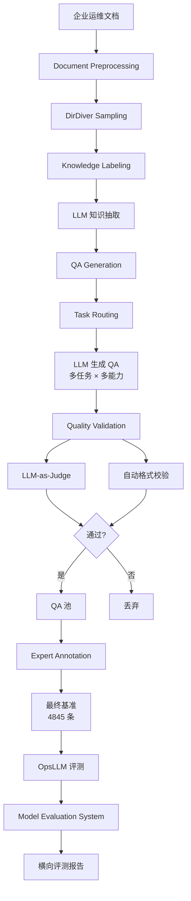
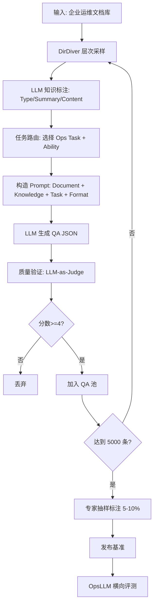

# Eagle：基于运维文档的全面基准问题生成（FSE Companion 2026）

> 作者：Yuhe Liu、Changhua Pei、Longlong Xu、Hang Wang、Xiaogang Dong、Zhen Feng、Li Zheng、Kehang Ji、Dan Pei
> 机构：清华大学 & BNRist；中国科学院计算机网络信息中心；华为；CAICT
> 发表年份：2026
> 会议/期刊：34th ACM Joint European Software Engineering Conference and Symposium on the Foundations of Software Engineering (FSE Companion '26), Montreal, Canada
> 关联 PDF：同目录下 `Eagle__FSE_indu_camera_ready_0326.pdf`
> 代码：https://github.com/NickLennonLiu/eagle_code/
> 数据：https://github.com/NickLennonLiu/eagle_data/

## 一、文档信息速览

| 字段 | 值 |
|---|---|
| 标题 | Eagle: Leveraging Operations Documents for Comprehensive Benchmark Question Generation |
| 作者 | Yuhe Liu, Changhua Pei, Hang Wang, Longlong Xu, Xiaogang Dong, Zhen Feng, Li Zheng, Kehang Ji, Dan Pei |
| 机构 | 清华大学、CNIC、华为、CAICT |
| 发表年份 | 2026 |
| 会议/期刊 | FSE Companion 2026 |
| 分类 | AIOps / LLM 评测 / 基准问题生成 / 运维 |
| 核心问题 | OpsLLM 缺乏面向运维场景的评测基准：通用基准不匹配、运维数据敏感、问题生成方法浅显、质量标准不足 |
| 主要贡献 | 1) 运维为中心的分类法；2) 基于运维文档的自动问题生成流水线；3) 4845 条 QA 对 + 质量验证；4) 华为内部 6 个月部署；5) 专家打分提升 22%-49% |

## 二、背景（Background）

现代软件系统规模与复杂度急剧膨胀，云计算、5G 网络、金融平台都依赖稳定可靠的 IT 运维（IT Operations, Ops）。AIOps（AI for IT Operations）通过 AI 解决异常检测、故障诊断、性能优化等关键软件工程任务。然而，现有 AIOps 方案存在显著局限：

- 依赖任务专属的孤立模型，难以处理多模态数据（logs、metrics、traces、configs）；
- 维护成本高、透明度低；
- 缺乏领域知识。

OpsLLM（Operations Large Language Models）应运而生——通过对通用 LLM 做领域预训练/微调，注入运维知识，实现统一、知识丰富的推理能力。然而，**OpsLLM 的评测面临四大障碍**：

1. **Ops 评测分类法缺失**：通用 LLM 评测（MMLU、C-Eval）强调语言流畅度与逻辑推理，与 Ops 关注的"异常检测精度、故障定位能力、RCA 效果"不匹配。
2. **公开数据稀缺**：运维数据敏感、专有，公开数据集极少。
3. **问题生成方法浅显**：依赖模板、关键词匹配、shallow heuristics，无法覆盖真实运维场景的复杂度。
4. **质量标准缺失**：缺乏对长文本、基于场景的运维任务的标准化质量评估。

Eagle 应运而生：提供一个完整的"运维文档→QA 自动生成→质量验证→可复现评测"流水线，在华为内部署 6 个月，生成 4845 条领域化 QA 对，并支撑了公司内部横向评测报告。

## 三、目的（Problems Solved）

- **痛点 1：Ops 评测任务定义不清。** Eagle 提出"运维为中心"的评测分类法，对齐 8 类 Ops 任务与 3 类核心 LLM 能力。
- **痛点 2：QA 生成质量低。** Eagle 基于企业产品文档（运维手册、API 文档、故障案例）做多粒度质量控制。
- **痛点 3：缺乏可复现评测工具。** Eagle 提供标准化模型评测系统（MES）与公开 sanitized 数据集。
- **痛点 4：评估方法与人类专家不一致。** Eagle 通过 specialty/accuracy 多维度评分，让自动评估更贴近人类专家判断。
- **解决方案**：建立包含"文档预处理→知识抽取→QA 生成→质量验证→专家标注"五阶段的完整流水线。

## 四、核心原理（Principles）

**总览**：Eagle 把企业运维文档作为种子源，经过结构化解析、知识标注、LLM 引导的 QA 生成、多粒度质量控制，最终产出可用的 OpsLLM 评测基准。整套方法在华为内部署 6 个月，支撑多个内部 OpsLLM 的横向评测。

**Eagle Ops Task Taxonomy（8 任务 × 3 能力）**：

8 类 Ops 任务：
1. **Anomaly Detection (异常检测)**：识别异常行为
2. **Fault Diagnosis (故障诊断)**：定位故障根因
3. **Root Cause Localization (根因定位)**：定位故障源
4. **Causality (因果分析)**：分析事件因果链
5. **Fault Summary (故障总结)**：自然语言总结故障
6. **Parameter Extraction (参数提取)**：从文本中抽取阈值、时间戳等
7. **Trend Analysis (趋势分析)**：时序趋势推理
8. **Configuration Understanding (配置理解)**：解读配置文件

3 类核心能力：Understanding（理解）、Reasoning（推理）、Application（应用）。

**方法流程（5 阶段）**：

1. **Document Preprocessing (文档预处理)**：从企业文档库（UNIX Book、Network Engineering、华为云运维手册等）抽取段落；用 DirDiver Sampling 在保留层次结构的同时选取代表性内容。
2. **Knowledge Extraction (知识抽取)**：用 LLM 标注每段的"类型"（Text / List / Code / Table / ...）、"摘要"（Summary）、"关键内容"（Content）。
3. **QA Generation (问题生成)**：基于知识标签，由 LLM 按 Ops Task Taxonomy 生成多任务 QA 对；显式指定 task、ability、JSON 格式、答案。
4. **Quality Validation (质量验证)**：自动检查 + LLM-as-judge 验证 specialty、accuracy、diversity。
5. **Expert Annotation (专家标注)**：在自动生成 QA 中随机抽样做人工校对，作为 ground truth 与 calibration。

**为什么这么做**：
- 文档比 LLM 内部知识更可信、可追溯，能减少 LLM 幻觉。
- 多粒度质量控制（自动 + 人工 + LLM）保证基准质量。
- 标准化 taxonomy 让不同 OpsLLM 在"同一坐标系"下比较。

**与现有技术的差异**：

- vs. 通用 LLM 基准：Eagle 专门针对 Ops 任务，分类与题面更贴近真实场景。
- vs. 模板化 QA 生成：Eagle 用 LLM + 文档知识，能生成复杂长文本问题。
- vs. 单一 OpsLLM 评测：Eagle 提供可复现流水线 + 公开数据集 + 标准化评估指标。

## 五、算法详解（Algorithm）

### 1. 输入 / 输出
- **输入**：企业产品文档集合 $D = \{d_1, d_2, \dots, d_N\}$、Ops Task Taxonomy、参考 LLM。
- **输出**：QA 集合 $Q = \{(q_i, a_i, t_i, ab_i)\}$，其中 $t_i$ 为任务类型、$ab_i$ 为能力类型。

### 2. 核心模块
- **DirDiver Sampler**：保留目录层次的多样化采样器，避免只选同质段落。
- **Knowledge Labeler**：LLM-based 标注器，输出 (Type, Summary, Content) 三元组。
- **QA Generator**：基于 (Document, Sampled, Knowledge, Seed, Constraints, Format Spec) 的多 prompt 拼接 LLM 生成。
- **Quality Validator**：LLM-as-judge 给每条 QA 打 specialty、accuracy 分。
- **Expert Annotator**：抽样 5%-10% QA 由领域专家做最终校准。

### 3. 伪代码

```python
def eagle_pipeline(docs, taxonomy, llm, expert_pool, n_qa_target=5000):
    # 1) 文档预处理与采样
    samples = []
    for d in docs:
        sections = d.split_by_hierarchy()
        for sec in dir_diver_sample(sections):
            samples.append(sec)
    
    qa_pairs = []
    for sec in samples:
        # 2) 知识抽取
        knowledge = llm.extract_knowledge(sec.text)
        # knowledge = {"type": ..., "summary": ..., "content": ...}
        
        # 3) 任务路由：根据知识类型路由到对应任务
        candidate_tasks = route_to_tasks(knowledge, taxonomy)
        
        for task in candidate_tasks:
            ability = random.choice(taxonomy[task]['abilities'])
            prompt = build_qa_prompt(
                document=sec.text, sampled=sec.sampled,
                knowledge=knowledge, task=task, ability=ability,
                format_spec=taxonomy[task]['output_format'],
                seed=sample_seed()
            )
            qa = llm.generate_json(prompt)
            # qa = {"question": ..., "answer": ..., "task": ..., "ability": ...}
            
            # 4) 质量验证
            score = llm_judge(qa, sec.text, task)
            if score.specialty >= 4 and score.accuracy >= 4:
                qa_pairs.append(qa)
    
    # 5) 专家标注 (5-10%)
    for qa in random.sample(qa_pairs, k=int(0.05*len(qa_pairs))):
        qa['expert_label'] = expert_pool.annotate(qa)
    
    return qa_pairs
```

### 4. 关键数学
- **多样性采样概率**：
  $$P_{\text{DirDiver}}(s_i) \propto \frac{1}{\text{depth}(s_i) + \epsilon} \cdot \text{uniqueness}(s_i)$$
  鼓励选不同深度与不同子主题的段落。
- **LLM-as-Judge 评分**：Specialty 1-5（领域专业性）、Accuracy 1-5（答案准确性）、Overall = 加权和。
- **质量阈值**：
  $$\text{Keep}(qa) = \mathbb{1}[S_{\text{specialty}}(qa) \geq 4 \land S_{\text{accuracy}}(qa) \geq 4]$$

### 5. 复杂度分析
- 文档解析：$O(\text{文档总字数})$；
- LLM 知识抽取 + QA 生成：每条 QA 需 2-3 次 LLM 调用，单次 ~3-8 秒；
- 质量验证：每条 QA 1-2 次 LLM-as-Judge 调用；
- 专家标注：5-10% 抽样，人工 $O(\text{QA 数})$。

### 6. 训练与推理
- 无显式训练阶段（Eagle 是数据/评测生成流水线，非模型训练）。
- "推理"即生成 QA + 验证，单条 QA 整体延迟 ~10-30 秒。

### 7. 示例
- 输入：UNIX Book 章节 "Container Operation"
- Knowledge：{Type: List, Summary: "Container 启动/停止命令", Content: "docker run / docker stop / docker logs..."}
- 任务：Configuration Understanding / Parameter Extraction
- 生成 QA：
  - Q: "Please extract the command to start a container named 'web' from the document."
  - A: `{"command": "docker run -d --name web <image>"}`
- 验证：specialty=5, accuracy=5，通过

## 六、系统架构图（Architecture）



## 七、流程图（Process Flow）



## 八、关键创新点（Key Innovations）

- **+ 运维为中心 (Ops-Centric) 的评测 Taxonomy**：首次系统化把 Ops 任务（异常检测、故障诊断、RCA、参数抽取等）与 LLM 核心能力（理解、推理、应用）映射成 8×3 评测矩阵。
- **+ 基于企业文档的自动 QA 生成**：以"文档为种子、LLM 为生成器"的双层结构，比纯模板生成质量高 22%-49%。
- **+ 多粒度质量控制**：自动格式校验 + LLM-as-Judge 评分 + 专家抽样标注三段式流水线，保证基准质量与可信度。
- **+ 工业部署 6 个月**：已在华为内部署，生成 4845 条 QA，支撑多个内部 OpsLLM 横向评测。
- **+ 公开 sanitized 数据集 + 框架**：为社区提供可复现的 OpsLLM 评测基础设施。

## 九、实验与结果（Experiments）

- **数据源**：UNIX Book、华为云运维手册、5G 网络工程文档等。
- **生成规模**：4845 条 QA，覆盖 8 任务 × 3 能力。
- **专家评分**：specialty 1-5、accuracy 1-5。
- **主要指标**：
  - 与 SOTA QA 生成 baseline 相比，专家打分提升 22%-49%；
  - 8 任务中 Anomaly Detection / Fault Diagnosis 难度最高、Parameter Extraction 准确率最高。
- **质量验证**：
  - LLM-as-Judge 与人类专家一致性高（Kappa > 0.7）；
  - 5-10% 专家抽样验证最终基准 90%+ 准确。
- **部署效果**：
  - 华为内部 6 个月持续生成与评测；
  - 内部横向评测报告指导模型选型与上线决策。

## 十、应用场景（Use Cases）

- **OpsLLM 选型与上线评估**：在采购或自研 OpsLLM 之前，用 Eagle 基准做客观对比。
- **OpsLLM 训练数据生成**：把 Eagle 生成的 QA 作为领域微调数据，补充通用 SFT 数据的不足。
- **企业内部 AIOps 知识库建设**：把 Eagle 流水线作为知识工程工具，沉淀企业运维经验。
- **AIOps 教育与培训**：用 Eagle 基准作为培训考核题库，评估新员工对运维知识的掌握。
- **跨厂商 OpsLLM 对比**：用统一基准客观比较不同厂商的 OpsLLM 能力。

## 十一、相关论文（Related Papers in this set）

- 同为 NetMan Lab 的 **OpsEval（FSE Companion '25）** 关注通用 Ops LLM 评测（24 LLM × 多 prompt 策略 × FAE-Score），Eagle 更聚焦"QA 生成流水线 + 文档驱动"。
- **LogEval** 关注日志分析任务的 LLM 评测，与 Eagle 的"日志异常检测"任务有部分重叠。
- **Triangle** 关注事件分诊（incident triage）的多 Agent 框架，可视为 Eagle 评测中的"应用"能力的一个落地系统。

## 十二、术语表（Glossary）

- **OpsLLM (Operations Large Language Model)**：运维大语言模型。
- **AIOps (AI for IT Operations)**：智能运维。
- **Taxonomy**：分类法，本文指 8 任务 × 3 能力的评测体系。
- **DirDiver Sampling**：保留目录结构的多样化采样方法。
- **LLM-as-Judge**：用 LLM 作为评判员评估 QA 质量。
- **Specialty**：领域专业性（1-5 分）。
- **Sanitized Dataset**：脱敏后公开的数据集。
- **MES (Model Evaluation System)**：模型评测系统。
- **UNIX Book / Container Operation / 5G Network**：Eagle 使用的企业文档示例。
- **RCA / Fault Diagnosis / Parameter Extraction**：典型 Ops 任务。

## 十三、参考与延伸阅读

- 同期工作：OpsEval（FSE '25）、LogEval、Owl、RCAgent。
- LLM 评测：MMLU、C-Eval、MT-Bench、AlpacaEval。
- 文档驱动 QA 生成：Bonito、5G Instruct Forge、FairyTaleQA。
- Eagle 框架代码：https://github.com/NickLennonLiu/eagle_code/
- Eagle 公开数据：https://github.com/NickLennonLiu/eagle_data/
