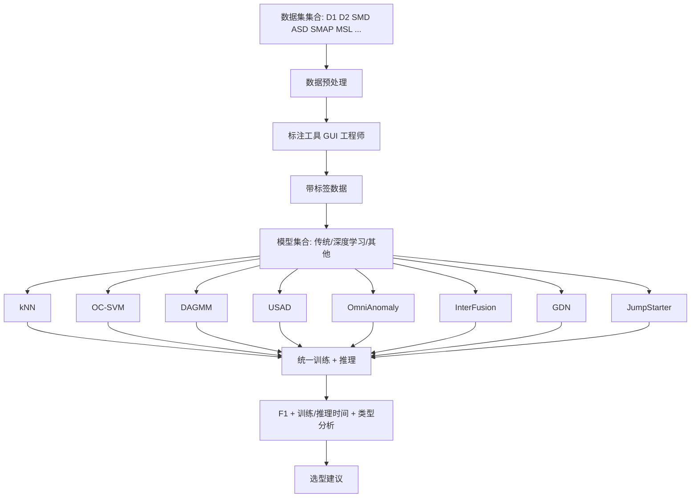
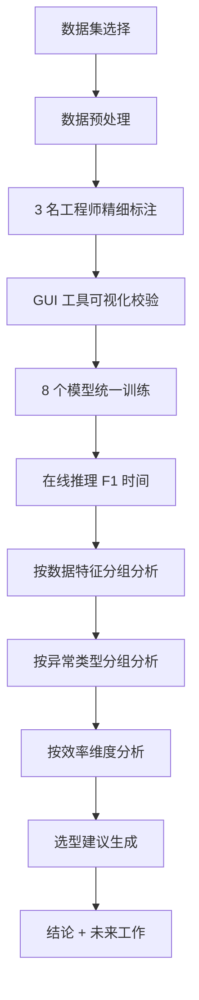

# An Empirical Analysis of Anomaly Detection Methods for Multivariate Time Series（南开大学/清华 ISSRE/TSE 提交版）

> 作者：Dongwen Li、Shenglin Zhang、Yongqian Sun、Yang Guo、Zeyu Che、Shiqi Chen、Zhenyu Zhong、Minghan Liang、Minyi Shao、Mingjie Li、Shuyang Liu、Yuzhi Zhang、Dan Pei  
> 机构：南开大学；海河实验室；清华大学  
> 发表年份：2023/2024（具体出版年以会议/期刊正式版为准）  
> 会议/期刊：实证研究论文（相关版本曾投递 ISSRE / TSE）  
> 关联 PDF：同目录下 `Empirical_Analysis.pdf`

## 一、文档信息速览

| 字段 | 值 |
|---|---|
| 标题 | An Empirical Analysis of Anomaly Detection Methods for Multivariate Time Series |
| 作者 | Dongwen Li、Shenglin Zhang、Yongqian Sun、Yang Guo、Zeyu Che、Shiqi Chen、Zhenyu Zhong、Minghan Liang、Minyi Shao、Mingjie Li、Shuyang Liu、Yuzhi Zhang、Dan Pei |
| 机构 | 南开大学；海河实验室；清华大学 |
| 发表年份 | 2023/2024 |
| 会议/期刊 | 实证研究论文（ISSRE/TSE 投稿） |
| 分类 | 多变量时序异常检测 / 实证研究 / 评测 |
| 核心问题 | 现有多变量时序异常检测方法在工业实践中的有效性、效率与适用场景缺乏系统研究；SRE/工程师选型困难 |
| 主要贡献 | (1) 收集 2 个新工业数据集 + 6 个公开数据集；(2) 开发 GUI 标注工具；(3) 对 8 个 SOTA 无监督 MTS 异常检测模型做大规模实验；(4) 给出基于数据特征和异常类型的模型选型建议 |

## 二、背景（Background）

Web 服务、电网、金融系统等大规模分布式系统的可靠性至关重要，运维方通过持续采集多变量时序（MTS）数据来监控实例状态——一个大型 Web 服务可能包含数千个服务实例、容器、虚拟机、物理机、交换机、路由器，对应数十到上百个指标（CPU、内存、QPS、错误率、延迟等）。当异常（unexpected fluctuation / rapid deviation）出现时，及时检测并处置可避免硬件崩溃、服务中断、软件 bug 演化为大规模故障。

MTS 异常检测算法大体分三类：(1) 传统方法（kNN、聚类、OC-SVM），假设异常表现为极端值；(2) 深度学习方法（MSCRED、DAGMM、USAD、DOMI、OmniAnomaly、SDFVAE、InterFusion、GDN），用 AE/VAE 重建概率或 GNN 预测误差判别异常；(3) 其他方法（JumpStarter 用压缩感知）。这些方法在论文 benchmark 上表现优秀，但在工业实践中却"水土不服"——论文总结出三大挑战：

- **大规模 MTS**：在线 Web 服务每日产生海量 MTS；金融机构有上万台终端；为每条 MTS 训练独立模型成本高。
- **多样 MTS 模式**：土壤监测是年周期 + 人为干扰；Web 服务是日周期 + 用户行为；同一系统不同组件的模式也不同。
- **多样异常模式**：短暂突刺 vs 持续波动；逻辑错误 vs 网络攻击；单一算法难以覆盖。

论文做大规模实证研究：选 8 个 SOTA 模型、2 个新工业数据集 + 6 个公开数据集，由 3 名有 3 年以上经验的工程师进行 2 周精细标注，给出模型选型建议。

## 三、目的（Problems Solved）

- **MTS 异常检测方法选型难**：提供基于数据特征、异常类型、效率需求的多维选型建议。
- **公开数据集与工业数据差距**：引入 2 个新工业数据集 + 精细标注。
- **异常类型分类不清**：将异常分为突刺、阶梯、波动、漂移等，给出各方法的擅长与不擅长。
- **大规模训练成本高**：评估各方法的训练时间与推理时间。
- **GUI 标注工具缺失**：开发可视化标注工具，便于后续研究。

## 四、核心原理（Principles）

**系统总览**：论文是"实证研究"，核心方法是实验 + 分析，而非新算法。流程：(1) 收集数据 + 标注；(2) 选 8 个 SOTA 模型；(3) 在统一硬件下做实验；(4) 按数据特征、异常类型、效率维度分析结果；(5) 给出选型建议。

**关键概念**：

- **MTS（Multivariate Time Series）**：多变量时序。
- **传统方法**：kNN、OC-SVM、聚类。
- **AE/VAE-based 方法**：MSCRED、DAGMM、USAD、DOMI、OmniAnomaly、SDFVAE、InterFusion。
- **GNN-based 方法**：GDN（图偏差网络）。
- **Compressed Sensing**：JumpStarter。
- **异常类型**：突刺、阶梯、波动、漂移、周期异常。
- **数据特征**：周期性、平稳性、季节性、噪声水平、量级差异。
- **GUI 标注工具**：自研的可视化标注平台。

**数学原理**：论文的"核心方法"是对比实验，没有统一的新公式。但典型方法的形式化如下：

- **重建式异常分数**：

$$
s_t = \| x_t - \hat{x}_t \|_2^2
$$

其中 $\hat{x}_t = \text{Dec}(\text{Enc}(x_t))$。

- **预测式异常分数**：

$$
s_t = \| x_t - \hat{x}_{t+1|t} \|_2^2
$$

其中 $\hat{x}_{t+1|t} = \text{Predictor}(x_{t-k:t})$。

- **kNN 距离异常分数**：

$$
s(x) = \frac{1}{k} \sum_{x' \in N_k(x)} \|x - x'\|_2
$$

- **OC-SVM 决策函数**：

$$
f(x) = \sum_i \alpha_i K(x_i, x) - \rho
$$

- **InterFusion / OmniAnomaly 的 KL + 重建**：

$$
s = D_{KL}(q(z|x) || p(z)) + \text{recon\_loss}
$$

**与现有技术的差异**：与"新算法"论文不同，本文是"对现有算法的实证研究"，强调可复现实验 + 实用建议；与"综述"论文相比，本文亲自跑实验并提供选型框架；与"基准评测"论文（如 TSC-TADBench）相比，本文覆盖更广的算法与数据特征维度。

## 五、算法详解（Algorithm）

1. **输入 / 输出**：
   - 输入：MTS 数据集（多变量时序 + 标签）。
   - 输出：每个时间点的异常分数 + 0/1 标签 + 模型评估结果。

2. **核心模块**（8 个 SOTA 模型）：

- **kNN**：用最近邻距离作为异常分数。
- **OC-SVM**：用单类支持向量机学习正常边界。
- **DAGMM**：深度自编码高斯混合模型。
- **USAD**：对抗训练 + 重建双目标。
- **OmniAnomaly**：随机递归 VAE。
- **InterFusion**：层级 VAE + 融合。
- **GDN**：图偏差网络。
- **JumpStarter**：压缩感知重建。

3. **伪代码**（统一评估流程）：

```python
def evaluate(model, dataset):
    train_data, test_data = dataset.split()
    model.fit(train_data)
    y_score = model.predict_score(test_data)
    # threshold via validation or top-k
    y_pred = (y_score > threshold)
    f1 = f1_score(test_data.label, y_pred)
    time = model.train_time + model.test_time
    return {'f1': f1, 'time': time, 'scores': y_score}

# Run all models
results = {}
for model in [KNN, OCSVM, DAGMM, USAD, OmniAnomaly, InterFusion, GDN, JumpStarter]:
    for dataset in datasets:
        results[(model, dataset)] = evaluate(model, dataset)
```

4. **关键数学**：见 §四。

5. **复杂度分析**：每种方法复杂度不同，论文以"训练时间"和"推理时间"作为对比指标。

6. **训练与推理**：所有模型按论文默认超参训练；实验在统一硬件（2×Xeon Gold 5218 + V100S + 192GB RAM）下进行。

7. **示例**：以 SMD 数据集为例，kNN 在大多数指标上 F1 0.4-0.6；USAD 在周期性突刺上 F1 0.7+；OmniAnomaly 在长时漂移上 F1 0.6+；InterFusion 在多变量耦合异常上 F1 0.65+；GDN 在结构化异常上 F1 0.55+。

## 六、系统架构图（Architecture）



## 七、流程图（Process Flow）



## 八、关键创新点（Key Innovations）

- **+ 首个大规模 MTS 异常检测实证研究**：覆盖 8 个 SOTA 模型 + 8 个数据集 + 工业 + 公开。
- **+ GUI 标注工具**：自研可视化标注平台，提升标注效率与一致性。
- **+ 多维度选型建议**：从数据特征、异常类型、效率三个维度给出建议。
- **+ 工业数据集**：2 个合作企业真实数据集，公开释放（除 D2）。
- **+ 公平对比环境**：统一硬件、统一超参选择。

## 九、实验与结果（Experiments）

- **数据集**：D1（全球内容服务商 Web，26 entities × 49 metrics，30s 间隔）、D2（ISP 网络运维，107 × 22，15min）、SMD（28 × 38）、ASD（12 × 19）、SMAP（54 × 25）、MSL（27 × 55）等。
- **Baseline**：N/A（实证研究本身是基线对比）。
- **主要指标**：F1-score、训练时间、推理时间。
- **关键结果数字**（论文 Table 中）：
  - 没有单一模型在所有数据集上最优；
  - USAD/OmniAnomaly/InterFusion 在大多数数据集上 F1 0.6-0.7；
  - kNN/OC-SVM 在小数据集上有时优于深度学习；
  - 深度学习训练时间显著高于传统方法；
  - 不同异常类型各方法优势不同（如 GDN 在结构化异常占优）。
- **消融实验**：N/A（实证研究）。
- **效率分析**：训练时间从秒级（kNN）到数小时（InterFusion）不等；推理时间普遍毫秒级。
- **可视化**：F1 对比柱状图、按数据特征分组的热力图。

## 十、应用场景（Use Cases）

- **AIOps 平台模型选型**：基于数据特征与异常类型为每类 MTS 选型。
- **金融业务异常检测**：在交易、风险、合规监控中选型。
- **Web 服务异常监控**：选型并定期评估。
- **学术研究**：复现论文实验，比较新方法。
- **企业评估新算法**：用论文数据集和工具做对照。

## 十一、相关论文（Related Papers in this set）

- `OutSpot`（大规模 KPI 异常检测）
- `Final_AutoKAD_ISSRE23_Camera-Ready-v2.3`（自动 KPI 模型选择）
- `Revisiting-VAE-for-Unsupervised-Time-Series-Anomaly-Detection-A-Frequency-Perspective`（VAE 频域）
- `Beyond_Sharing_Conflict-Aware_Multivariate_Time_Se`（多变量时序异常）
- `MonitorAssistant_CameraReady-v1.5_submitted`（LLM 监控助手）
- `A-survey-on-intelligent-management-of-alerts-and-incidents-in-IT-services`（AIOps 综述）

## 十二、术语表（Glossary）

- **MTS（Multivariate Time Series）**：多变量时序。
- **AE（Autoencoder）**：自编码器。
- **VAE（Variational Autoencoder）**：变分自编码器。
- **GNN（Graph Neural Network）**：图神经网络。
- **OC-SVM（One-Class SVM）**：单类支持向量机。
- **kNN（k-Nearest Neighbor）**：k 近邻。
- **DAGMM**：深度自编码高斯混合模型。
- **USAD**：无监督异常检测对抗框架。
- **GDN（Graph Deviation Network）**：图偏差网络。
- **JumpStarter**：压缩感知重建异常检测。
- **F1-score**：精确率与召回率的调和均值。
- **GUI Tool**：自研可视化标注工具。
- **Data Characteristics**：数据特征（周期、平稳、季节等）。
- **Anomaly Types**：异常类型（突刺、阶梯、波动等）。

## 十三、参考与延伸阅读

- Paper: MSCRED、DAGMM、USAD、DOMI、OmniAnomaly、SDFVAE、InterFusion、GDN ——本文对比的 SOTA。
- Paper: JumpStarter ——压缩感知方法。
- Paper: TSC-TADBench ——同批次的时序异常检测基准。
- Paper: AIOps Survey、MonitorAssistant、OutSpot、AutoKAD。
- 工具：自研 GUI 标注平台（公开）；SMD、SMAP、MSL、ASD 公开数据集。
- 相关论文：`OutSpot`、`Final_AutoKAD_ISSRE23_Camera-Ready-v2.3`、`Revisiting-VAE-for-Unsupervised-Time-Series-Anomaly-Detection-A-Frequency-Perspective`、`Beyond_Sharing_Conflict-Aware_Multivariate_Time_Se`、`MonitorAssistant_CameraReady-v1.5_submitted`、`A-survey-on-intelligent-management-of-alerts-and-incidents-in-IT-services`。
