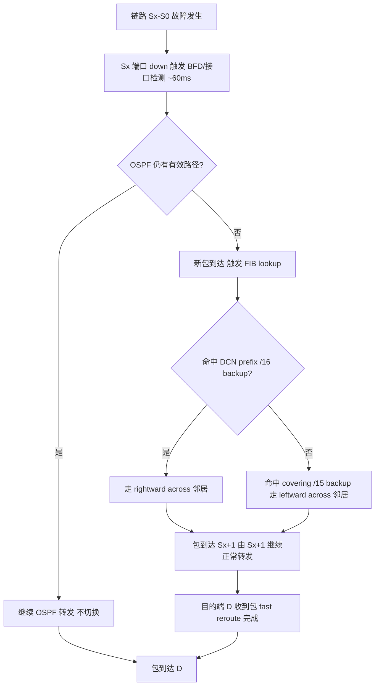

# F2 Tree: Rewiring 2 Links is Enough: Accelerating Failure Recovery in Production Data Center Networks（ICDCS 2015）

> 作者：Guo Chen, Youjian Zhao, Dan Pei, Dan Li
> 机构：清华大学计算机科学与技术系（北京 100084）
> 发表年份：2015
> 会议/期刊：ICDCS 2015（35th IEEE International Conference on Distributed Computing Systems）
> 关联 PDF：同目录下 `F2Tree-ICDCS15.pdf`

## 一、文档信息速览

| 字段 | 值 |
|---|---|
| 标题 | Rewiring 2 Links is Enough: Accelerating Failure Recovery in Production Data Center Networks |
| 作者 | Guo Chen、Youjian Zhao、Dan Pei（通讯作者）、Dan Li |
| 机构 | 清华大学计算机科学与技术系 |
| 发表年份 | 2015 |
| 会议/期刊 | ICDCS 2015 |
| 分类 | 数据中心网络 / 故障恢复 / Fat Tree 增强 |
| 核心问题 | 多根树型生产 DCN 中，下行链路缺乏即时备份路径；分布式路由（OSPF/BGP）收敛时间长，无法满足 100ms 内的实时业务 deadline |
| 主要贡献 | (1) F2 Tree：通过在每个 pod 内为每台 aggregation/core 交换机重布 2 条线形成 ring，零协议/零软件改动；(2) 配合 2 条静态备份路由实现 fast rerouting；(3) testbed + 大规模仿真显示故障恢复时间减少 78%、partition-aggregate 业务 deadline-missing 减少 96% |

## 二、背景（Background）

数据中心网络（DCN）是搜索、零售、社交等互联网服务的基础设施，承载了越来越苛刻的实时交互业务（300ms 级端到端 deadline、DC 内任务 <100ms）。生产 DCN 普遍采用 multi-rooted tree（Fat Tree、Leaf-Spine、VL2 等）+ 分布式路由（OSPF、BGP）架构。然而近年研究[3,4]指出，故障恢复时间在当前生产 DCN 中非常长，对实时业务影响很大。

论文用一个 4 端口 3 层 Fat Tree + Quagga OSPF 的小测试床（VMware ESXi 5）再现了该问题：在 t=0ms 源端 S 开始向目的端 D 发送 UDP 流；t=380ms 人工断开 ToR-aggregation 链路 S16-S8。S16 接口故障检测约 60ms，OSPF LSA 传播几乎瞬时，但 S1 要等 OSPF 最短路径计算定时器（默认 200ms）过期，再花 10ms 更新 FIB。整个收敛时间 >272ms，其间 UDP 包继续被转发到已失败的 S16-S8，导致长达 272ms 的连通性丢失。

论文把根因总结为两条：
1. **多根树拓扑中下行链路（downward link）缺乏即时备份路径**——S16 检测到下行链路失败时找不到立刻可用的备选下一跳。
2. **分布式路由协议需要时间学习并对故障做出反应**——OSPF timer 在大型不稳定网络中会指数级回退到数秒级别。

现有方案多沿两条路：修改路由协议并改变拓扑[3]、或修改控制/转发面[4,15]，但都依赖 routing/forwarding 协议的 non-trivial 改动，难以在生产 DCN 中部署。

论文提出 F2 Tree（Fault-tolerant Fat Tree）：仅通过"少量重布线 + 少量交换机配置"，在不修改任何路由/转发协议/软件的前提下，提升下行链路的冗余与本地快速重路由能力。

## 三、目的（Problems Solved）

- **下行链路无备份路径**：在 aggregation 与 core 交换机上各预留 1 个上行 + 1 个下行端口形成 across-link ring，把每个下行链路的"即时备份链路数"从 0 提升到 2。
- **OSPF/BGP 收敛太慢**：在每台 agg/core 交换机上静态配置 2 条更短前缀的 backup route（DCN prefix 10.11.0.0/16 与 covering prefix 10.10.0.0/15），故障发生时直接走本地 FIB 查找，几 ms 内完成切换。
- **可读部署**：方案不要求任何软件/协议改动，全部在现有生产交换机上完成。
- **跨多类型拓扑与协议**：论文 §V 验证对 Leaf-Spine、VL2、BGP 同样适用。
- **控制平面开销与额外收益**：在 1Gbps 测试床、8 端口 3 层大规模仿真上系统化评估。

## 四、核心原理（Principles）

**F2 Tree 拓扑**：N 端口交换机的 Fat Tree，每个 pod 内 aggregation/core 交换机预留 rightmost downward 端口做"右向 across 端口"、rightmost upward 端口做"左向 across 端口"，并在每个 pod 内首尾相连形成 ring。其余 N-2 个端口一半上行、一半下行，与 Fat Tree 相同（no oversubscription、rich path diversity）。每台 agg/core 交换机新增 2 条 immediate backup link for downward link。

**ECMP 与 immediate backup link 概念**：ECMP 把"cost 相同的几条最短路径"放入转发表；本论文定义"链路 L 的 immediate backup link"为：L 失效后，直连交换机 S 仅凭本地信息就能用该备份链路把原本经 L 转发的报文送达目的地。原始 Fat Tree 中每条上行链路有 N/2-1 条 immediate backup link（ECMP 候选），但每条下行链路只有 0 条。

**Fast Rerouting 方案**：在每台 agg/core 交换机上添加 2 条不重分发到 OSPF 的静态路由：
- 一条指向 rightward across neighbor（如 S8→S9），前缀是 DCN prefix（如 10.11.0.0/16）；
- 一条指向 leftward across neighbor（如 S8→S10），前缀是 covering prefix（如 10.10.0.0/15），长度更短。
它们与 OSPF 路由共存：只要 OSPF 还能找到更具体的前缀，就走 OSPF；只有当原 OSPF 路径不可达时，FIB 才会落到 backup 路由。这避免了任何 FIB 更新延迟。

**防止 forwarding loop**：因为两条 backup 路由前缀长度故意不同（一条 /16、一条 /15），S8 优先走 S9（更长前缀）；只有当 S9 也失效时才走 S10，从而避免在 2 个相邻交换机同时出现 downward 链路失败时在 ring 上发生临时环路。

**Address assignment（DCN 典型约定）**：每台 ToR 下的主机在同一子网内（10.11.0/24），ToR 把该子网 redistribute 到 OSPF；本交换机接口 IP 如 S8=10.12.0.1。

**支持向上链路失败**：F2 Tree 同样提供比 Fat Tree 多 1 条上行链路的 immediate backup link（聚合 ECMP + 2 条 across），但论文把分析焦点放在下行。

**性能公式（互推 immediate backup link 数）**：

$$
\text{Backup}_{\text{downward}}^{\text{F2Tree}} = 2
$$

$$
\text{Backup}_{\text{upward}}^{\text{FatTree}} = N/2 - 1, \quad \text{Backup}_{\text{upward}}^{\text{F2Tree}} = (N/2-2)_{\text{ECMP}} + 2_{\text{across}} = N/2
$$

**Scalability 对比**（N 端口同构 3 层 DCN）：

| 拓扑 | 交换机数 | 节点数 | 改协议 | 改数据面 |
|---|---|---|---|---|
| Fat tree | $5N^2/4$ | $N^3/4$ | n/a | n/a |
| VL2 | $5N/2$ | $N^2/2$ | n/a | n/a |
| **F2 Tree** | $5N^2/4$ | $N^3/4 - N^2 + N$ | **no** | **no** |
| Aspen tree (f,0) | $5N^2/4(f+1)$ | $N^3/4(f+1)$ | yes | no |
| F10 | $5N^2/4$ | $N^3/4$ | yes | yes |
| DDC | n/a | n/a | yes | yes |

N=128 时，F2 Tree 仅比 Fat Tree 少约 2% 节点；Aspen tree 若 f=1 则少 50% 节点。

## 五、算法详解（Algorithm）

1. **输入 / 输出**
   - 输入：原始 Fat Tree 拓扑与配置；若干条链路故障事件。
   - 输出：fast rerouting 后的等价无故障路径（local reroute）；故障恢复时间统计。
2. **核心模块**
   - **Link Rewiring**：在每个 pod 内，对每台 agg/core 交换机拆掉 1 条上行 + 1 条下行，把空出的端口接到该 pod 内"顺时针邻居"形成 ring。
   - **Across-link Static Route Configuration**：通过 bash 脚本在每台 agg/core 交换机上 disable OSPF on across 端口（避免不必要扩散），并添加 2 条不同前缀的静态 backup 路由。
   - **Fast Rerouting on Local Failure**：当某条 downward 链路 Sx-S0 失效，Ox 检测失败后即用本地 FIB 命中 backup 路由，把报文立即经 across 邻居 Sx+1（或 Sx-1）转发，无需 OSPF 重算或 FIB 大改。
   - **Deployment Scheme（5 步）**：(1) 规划端口/拓扑变化；(2) 迁移被剪节点上的服务；(3) 在 across 端口 disable OSPF（这一步保证 non-stop forwarding）；(4) 配置 backup 路由；(5) 进行物理改线。
3. **伪代码**

```python
def configure_f2tree(switches, topology):
    # Step 1: 规划 across 端口
    for sw in switches:
        if sw.role in ('aggregation', 'core'):
            sw.reserve_port('rightmost_downward', role='right_across')
            sw.reserve_port('rightmost_upward',   role='left_across')

    # Step 2: 迁移服务到非剪枝节点
    migrate_services_to_non_pruned_nodes()

    # Step 3: 在 across 端口 disable 路由协议（保证 non-stop forwarding）
    for sw in switches:
        for port in sw.across_ports():
            sw.disable_routing_protocol(port)

    # Step 4: 配置 backup 路由（不重分发到 OSPF）
    for sw in switches:
        sw.add_static_route(prefix=DCN_PREFIX,    # 如 10.11.0.0/16
                             next_hop=sw.rightward_across_neighbor())
        sw.add_static_route(prefix=COVERING_PREFIX,# 如 10.10.0.0/15
                             next_hop=sw.leftward_across_neighbor())

    # Step 5: 物理改线，把 across 端口按 ring 接好
    rewire_physical(topology)


def on_link_failure(sw, failed_link):
    # sw 检测到 Sx-S0 失败
    for pkt in sw.pending_packets(dest_subnet=DCN_PREFIX):
        if sw.can_reach_via_ospf(pkt.dest):
            sw.forward_via_ospf(pkt)
        else:
            # 落到更具体的 /16 backup -> rightward across
            sw.forward(pkt, via=sw.rightward_across_neighbor())
    return  # 本地切换完成，无需控制平面计算
```

4. **关键数学**：见 §四（immediate backup link 数与 scalability 公式）。
5. **复杂度分析**
   - 拓扑改造：每台 agg/core 交换机只动 2 条线、2 条静态路由——$O(N^2)$ 台交换机上的 $O(1)$ 操作；
   - 故障检测：BFD 风格约 60ms（与 fat tree 相同）；
   - 故障恢复：FIB lookup time（μs 级），相对 OSPF timer 200ms 量级几乎可忽略；
   - 部署：5 步可全脚本化，每步独立可回滚。
6. **训练与推理**：无机器学习步骤；fast rerouting 是纯静态配置。
7. **示例**：电商订单链路 S-S1-S10-S20-S16-S8-D，S16-S8 突然 down；F2 Tree 中 S16 直接经 S15（across 链路）→ S8 把报文送达 D；ping 测试中 UDP 接收端 throughput 仅在 60ms 内下降到 0（≈BFD 检测时间），相对 Fat Tree 的 272ms 大幅缩短。

## 六、系统架构图（Architecture）

```mermaid
graph TB
    A[原始 Fat Tree 拓扑] --> B[Step1 规划 across 端口]
    B --> C[Step2 迁移被剪节点服务]
    C --> D[Step3 disable OSPF on across 端口]
    D --> E[Step4 配置静态 backup 路由]
    E --> F[Step5 物理改线 ring 化]
    F --> G[F2 Tree 生产拓扑]
    G --> G1[aggregation ring 1]
    G --> G2[aggregation ring 2]
    G --> G3[core ring]
    G1 --> H[下行链路 Sx-S0 故障]
    G2 --> H
    G3 --> H
    H --> I[Sx 本地检测链路 down]
    I --> J[FIB 命中 backup 路由]
    J --> J1[/16 backup -> right across Sx+1]
    J --> J2[/15 backup -> left  across Sx-1]
    J1 --> K[沿 Sx-Sx+1-...-D 转发]
    J2 --> K
    K --> L[OSPF 不重算 FIB 不大改]
    L --> M[毫秒级 fast reroute 完成]
```

## 七、流程图（Process Flow）



## 八、关键创新点（Key Innovations）

- **+ 2-link rewiring 即足**：每个 pod 内每台 agg/core 交换机只需重布 2 条线 + 2 条静态路由，零协议改动。
- **+ 跨 pod 立即可见的 fast reroute**：下行链路 backup 链路数 0→2，路径冗余与上行链路相当。
- **+ 不重分发的静态路由技巧**：FIB 在 OSPF 路径失效前已装好 backup 路由，切换仅需本地查找。
- **+ 5 步 non-stop deployment**：第 3 步 disable OSPF on across 端口保证改线期间不丢包。
- **+ 与协议无关**：OSPF/BGP 同样适用；Leaf-Spine、VL2 拓扑同样适用（论文 §V 讨论）。
- **+ 78% 故障恢复时间下降、96% deadline-missing 请求下降**：在 1Gbps 测试床与 8 端口 3 层大规模仿真上验证。

## 九、实验与结果（Experiments）

- **测试床**：4 端口 3 层 Fat Tree / F2 Tree 拓扑，VMware ESXi 5 上跑 Quagga 0.99.22 OSPF + ECMP，每台交换机 4×1Gbps，ToR 1Gbps 上挂 8 个 host。链路故障注入通过 shutdown 接口，BFD-style 60ms 检测。
- **大规模仿真**：Quagga + Linux 数据面通过 NS3 Direct Code Execution（NS3-DCE）跑 8 端口 3 层拓扑；2.4GHz/12 核服务器；1Gbps 链路 + 5μs 传播延迟 → RTT ~250μs；60ms 故障检测 + 10ms FIB update 延迟叠加在所有 baseline 之上。
- **Baseline**：原版 Fat Tree（OSPF/ECMP）；Aspen Tree 与 F10 因需改协议/数据面未纳入对比。
- **关键结果数字（Table III）**：
  - Fat Tree：连通性丢失 272.847 ms，丢包 1302，TCP 吞吐崩塌 700 ms；
  - F2 Tree：连通性丢失 60.619 ms（下降 ~78%），丢包 310（下降 76%），TCP 吞吐崩塌 220 ms；
  - 多失败条件 C1–C7：F2 Tree 几乎在所有条件下保持 60ms 级别恢复，仅极端 C7（同一 pod 内 3 条特定链路同时失败）退化为 Fat Tree。
- **Partition-aggregate 业务**（≥3000 请求 + 1500 background flow，600s，1 / 5 个并发故障）：Fat Tree 0.4% / 1.6% 请求超 250ms deadline；F2 Tree 在 1 并发失败时 0 个请求超 deadline，5 并发失败时仅约 0.06% 超 deadline（96% 减少）；并且最大完成时间不再受 OSPF timer 9s 拖累。
- **迁移无丢包**：UDP 流在 5 步迁移过程中 0 丢包，TCP throughput 平稳（iperf + 自研流量发生器重复验证）。

## 十、应用场景（Use Cases）

- **生产 DCN 增量升级**：在不替换交换机的前提下，把现网 Fat Tree 升级为 F2 Tree，零停机、零协议变更。
- **实时搜索/广告/电商**等 ≤100ms 延迟敏感的 partition-aggregate 业务。
- **多租户云数据中心**：不同租户的 bursty 流经常触发下行链路故障，F2 Tree 提供毫秒级本地恢复。
- **Leaf-Spine / VL2 拓扑**：论文 §V 给出改写为 F2 Tree 风格的一般化方式。
- **支持 OSPF 之外的分布式路由**：BGP 场景同样可借鉴。

## 十一、相关论文（Related Papers in this set）

- `f2tree`（IEEE/ACM TON 期刊扩展版，详细部署 + 测试床 + 大规模评估）
- `CQRD-ComputerNetworks15`（Fat Tree 中交换机内部 CQRD 队列缓解下行流冲突）
- `CQRD-LCN`（CQRD 会议短版）
- `FUSO-ATC16`（多路径 TCP 快速重传，恢复 FCT）
- `conext15-final2`（FUNNEL：软件变更后性能变更快速检测）
- `NLB-ICCCN2015-paper`（NDN 直播 WLAN 跨层优化）

## 十二、术语表（Glossary）

- **DCN (Data Center Network)**：数据中心网络。
- **Fat Tree / Multi-rooted Tree**：多根树型 DCN 拓扑。
- **ToR (Top-of-Rack)**：机架顶交换机。
- **Aggregation / Core switch**：聚合层 / 核心层交换机。
- **Pod**：共用同一子树的多台 ToR + aggregation 集合。
- **ECMP (Equal-Cost Multi-Path)**：等价多路径负载分担。
- **OSPF / BGP**：域内 / 域间分布式路由协议。
- **LSA (Link State Advertisement)**：OSPF 链路状态通告。
- **FIB (Forwarding Information Base)**：转发表。
- **BFD (Bidirectional Forwarding Detection)**：毫秒级链路故障检测协议。
- **Immediate Backup Link**：本地信息即可重路由的备份链路。
- **Across Neighbor / Across Link**：F2 Tree 中同 pod 内的 ring 邻居及其链路。
- **DCN Prefix / Covering Prefix**：覆盖所有 DCN 主机的最短与次短前缀。
- **Non-Stop Forwarding**：改线/迁移过程中保持转发不中断。
- **Partition-Aggregate Workload**：分区-汇总型业务（前段 DCN 典型负载）。
- **Incast**：多对一同步突发流量模式。
- **Bursty Loss / Random Loss**：突发丢包 / 随机丢包两种 loss 模式。

## 十三、参考与延伸阅读

- Paper: F2Tree ICDCS 2015（本文）——Fat Tree 改造方案。
- Paper: `f2tree`（IEEE/ACM TON 2017）——期刊扩展版，含更详尽部署 + 大规模评估。
- Paper: Aspen Tree（SIGCOMM 2014）——通过上下层冗余提升容错，但需改协议。
- Paper: F10（NSDI 2013）——拓扑+协议协同重设计。
- Paper: DDC（NSDI 2013）——数据中心漂移控制。
- 工具：Quagga、NS3、NS3-DCE、VMware ESXi、iperf、FFmpeg、Linux netem。
- 相关论文：`CQRD-ComputerNetworks15`、`CQRD-LCN`、`FUSO-ATC16`、`conext15-final2`、`NLB-ICCCN2015-paper`。
