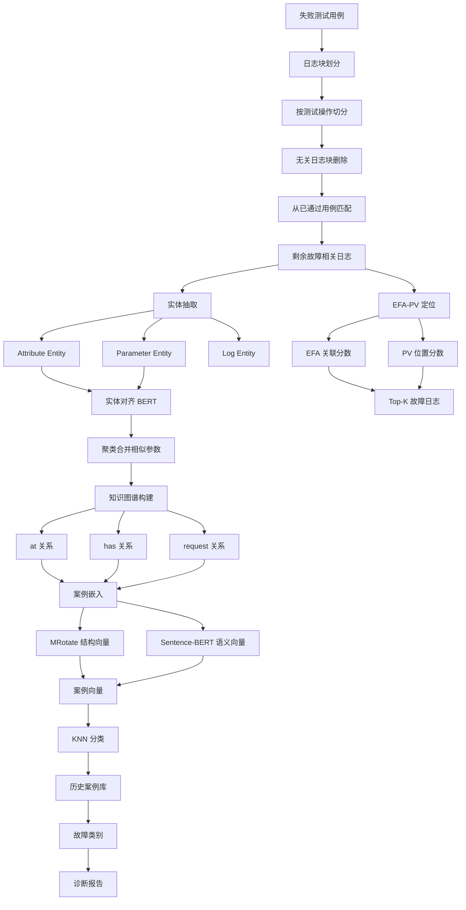
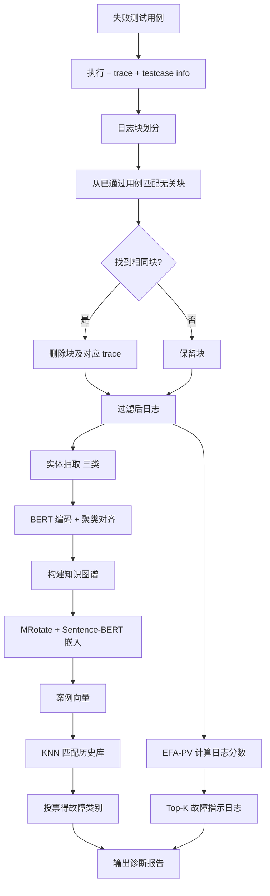

# SynthoDiag: Fault Diagnosis for Test Alarms in Microservices through Multi-source Data（FSE Companion 2024）

> 作者：Shenglin Zhang, Jun Zhu, Bowen Hao, Yongqian Sun, Xiaohui Nie, Jingwen Zhu, Xilin Liu, Xiaoqian Li, Yuchi Ma, Dan Pei  
> 机构：南开大学（HL-IT、TKL-SEHCI）；中科院网络信息中心（CNIC, CAS）；华为云；清华大学（BNRist）  
> 发表年份：2024  
> 会议/期刊：FSE Companion 2024（ACM 32nd International Conference on the Foundations of Software Engineering）  
> 关联 PDF：同目录下 `FSE_2024_SynthoDiag.pdf`

## 一、文档信息速览

| 字段 | 值 |
|---|---|
| 标题 | Fault Diagnosis for Test Alarms in Microservices through Multi-source Data |
| 简称 | SynthoDiag |
| 作者 | Shenglin Zhang, Jun Zhu, Bowen Hao, Yongqian Sun, Xiaohui Nie, Jingwen Zhu, Xilin Liu, Xiaoqian Li, Yuchi Ma, Dan Pei |
| 机构 | 南开大学；中科院网络信息中心；华为云；清华大学 |
| 发表年份 | 2024 |
| 会议/期刊 | FSE Companion 2024 |
| 分类 | 微服务测试告警 / 故障诊断 / 知识图谱 / 多源日志 |
| 核心问题 | 微服务系统 SIT 测试中，每天数千测试用例，5% 失败 → 数百告警需诊断；现有方法只处理执行日志，忽略 trace 日志；<10% 日志与故障相关但难过滤；新模板日志难定位 |
| 主要贡献 | (1) 知识图谱融合执行日志 + trace 日志 + 测试用例信息；(2) 基于日志块的差异策略过滤无关日志；(3) EFA-PV 算法定位故障日志；(4) 在华为云 1687 个真实失败用例上 Micro-F1 0.872 / Macro-F1 0.891，相对 SOTA 分别提升 21% 和 30%；Top-5 故障定位精度 0.819 |

## 二、背景（Background）

微服务架构将应用拆分为小、轻量、可独立部署的服务，频繁迭代。每次发布或更新前进行严格的 SIT（System and Integration Testing）测试。测试用例失败触发告警，工程师需要分析海量日志（来自客户端执行日志、服务端 trace 日志、测试用例信息），分类故障类别（Service Issue / Environment Issue / Script Defect / Tool Defect），定位故障根因。

故障类别及其解决方案（论文 Table 1）：
- **Service Issue**：服务内部问题 → 提交 bug 报告给开发。
- **Environment Issue**：服务外部环境问题 → 重新执行测试或重设环境。
- **Script Defect**：测试脚本错误 → 修正测试脚本。
- **Tool Defect**：第三方测试工具缺陷 → 联系工具支持。

华为云每天执行数千测试用例，5% 失败 → 数百失败用例，手动分析每条耗时 5+ 分钟，几乎不可能。现有方法如 LFF（Amar & Rigby 2019）、CAM（Jiang et al. 2017）等只处理执行日志，忽略了 trace 日志的细粒度服务端信息；且无法有效过滤掉与故障无关的日志（占比 > 90%）；新模板日志（系统升级引入）定位困难。

## 三、目的（Problems Solved）

- **多源日志融合**：执行日志（半结构化文本）+ trace 日志（树结构含 span）+ 测试用例信息，融合为知识图谱。
- **故障无关日志过滤**：基于"日志块"（log block）的差异策略，按测试操作切分日志，保留上下文，过滤无关块。
- **新模板日志定位**：EFA-PV（Entity Fault Association - Position Value）算法，结合内容与关系评估日志重要性。
- **多分类诊断**：用 KNN 在历史已标注案例库中匹配分类。
- **可解释报告**：除类别外，输出故障指示日志条目，便于工程师验证。
- **工业部署**：在华为云自动化测试平台上部署 7+ 个月，每周诊断数千故障用例。

## 四、核心原理（Principles）

**系统总览**：SynthoDiag 包含三个主要组件：(1) 日志过滤（log filtering）：用基于块的差异策略过滤故障无关日志；(2) 案例嵌入（case embedding）：基于剩余故障相关日志构建知识图谱，用 KGE + Sentence-BERT 编码为向量；(3) 故障诊断（fault diagnosing）：KNN 分类 + EFA-PV 定位。

**关键概念**：

- **Test Case（测试用例）**：SIT 阶段的一组测试操作 + 检查点。
- **Test Operation（测试操作）**：测试的最小单元。
- **Log Block（日志块）**：一个测试操作对应的日志集合（开始 → 结束）。
- **Execution Log（执行日志）**：客户端日志，测试操作信息。
- **Trace Log（trace 日志）**：服务端日志，调用流 + 消息。
- **Testcase Info（测试用例信息）**：测试前写好，包括 purpose/id/executors。
- **Knowledge Graph（知识图谱）**：三类实体（Attribute/Parameter/Log）+ 关系。
- **MRotate**：知识图谱嵌入算法（关系视为复数空间旋转）。
- **Sentence-BERT**：句向量模型，用于日志条目语义编码。
- **Drain**：He et al. 2017 提出的日志解析算法。
- **EFA（Entity Fault Association）**：实体与故障类别的关联分数。
- **PV（Position Value）**：实体在当前测试用例中的位置重要性。

**数学原理**：

- **EFA 分数**（实体 $e$ 对故障类别 $i$）：

$$
\text{EFA}_i^e = -\text{mse}(D_e) \cdot \frac{1}{\log(1 - n_i^e / N_i)}
$$

其中 $D_e$ 是实体 $e$ 在各类别中的分布，$N_i$ 是类别 $i$ 的测试用例数，$n_i^e$ 是实体 $e$ 出现在类别 $i$ 的次数。值越大，关联越强。

- **PV 分数**（参数实体 $e$ 的位置价值）：

$$
\text{PV}^e = (L_{\text{exe}}^e + 1) \cdot (L_{\text{trace}}^e + 1)
$$

其中 $L_{\text{exe}}^e$ 是连接到执行日志的次数，$L_{\text{trace}}^e$ 是连接到 trace 日志的次数。值越大，连接越多，在当前用例越重要。

- **EFA-PV 联合分数**：

$$
\text{EFA-PV}_i^e = \text{EFA}_i^e \times \text{PV}^e
$$

- **日志条目分数**（聚合其参数实体的 EFA-PV）：

$$
\text{Score}(\text{entry}) = \sum_{e \in \text{params}} \text{EFA-PV}_i^e
$$

- **Macro-F1 公式**（论文 Eq. 4）：

$$
\text{Macro-F1} = \frac{1}{k} \sum_{i=1}^{k} \frac{2 \times \text{Recall}_i \times \text{Precision}_i}{\text{Recall}_i + \text{Precision}_i}
$$

- **MRotate 关系旋转**：把头实体 $\mathbf{h}$ 通过复数旋转 $r$ 映射到尾实体 $\mathbf{t}$，$\mathbf{h} \circ \mathbf{r} = \mathbf{t}$，其中 $\circ$ 是复数乘法（逐元素）。

**与现有技术的差异**：与 LFF（仅执行日志 + 模板匹配）相比，SynthoDiag 融合 trace 日志；与 CAM（IR-based）相比，SynthoDiag 用知识图谱捕获结构；与 OnCall、MicroHECL 等运行时方法相比，SynthoDiag 专注于测试阶段。

## 五、算法详解（Algorithm）

1. **输入 / 输出**：
   - 输入：失败测试用例的执行日志 + trace 日志 + 测试用例信息。
   - 输出：故障类别（4 类之一）+ Top-K 故障指示日志条目。

2. **核心模块**：
   - **日志块划分（Log Block Division）**：按测试操作的开始/结束标识（"Begin to send request" / "Check point fail"）用正则表达式切分。
   - **无关日志块删除（Irrelevant Log Block Removal）**：从已通过（passed）的相同测试用例中查找相同块，匹配"请求部分 + 响应部分"都相同的块，连同对应 trace 日志一起删除。
   - **实体抽取（Entity Extraction）**：
     - Attribute Entity：结构化属性（INFO/WARN/ERROR、服务名）→ 正则。
     - Parameter Entity：可变参数 → Drain 解析。
     - Log Entity：非结构化原始内容。
   - **实体对齐（Entity Alignment）**：用 BERT 编码参数实体向量，相似聚类合并。
   - **知识图谱构建**：Log 与 Attribute 关系 `at`、Log 与 Parameter 关系 `has`、服务名 Attribute 之间 `request`。
   - **案例嵌入（Case Embedding）**：MRotate 编码结构向量 + Sentence-BERT 编码语义向量 → 实体向量 → 平均得案例向量。
   - **KNN 分类**：在历史已标注案例库中找最相似的 K 个，投票故障类别。
   - **EFA-PV 定位**：计算每个日志条目的故障指示分数，排序取 Top-K。

3. **伪代码**：

```python
def log_block_division(exec_logs):
    """按 'Begin to send request' / 'Check point fail' 切分日志块"""
    blocks = []
    cur = []
    for line in exec_logs:
        cur.append(line)
        if "Check point fail" in line or "Check point pass" in line:
            blocks.append(cur)
            cur = []
    return blocks

def remove_irrelevant_blocks(blocks, passed_cases):
    """从通过用例中找相同块并删除"""
    kept = []
    for blk in blocks:
        matched = find_same_block(blk, passed_cases)
        if matched is None:
            kept.append(blk)
    return kept

def extract_entities(blk, exec_logs, trace_logs):
    """从日志块中抽取三类实体"""
    attrs = [regex_extract(line) for line in exec_logs + trace_logs]
    params = drain_parse(blk)
    log_entities = [strip_structured(line) for line in exec_logs + trace_logs]
    return attrs, params, log_entities

def align_parameters(params, bert):
    """BERT 编码参数，相似的合并"""
    vecs = bert.encode([str(p) for p in params])
    clusters = cluster_cosine(vecs, threshold=0.85)
    centers = [params[c[0]] for c in clusters]
    return centers

def build_kg(attrs, params, log_entities):
    """构建知识图谱"""
    kg = KnowledgeGraph()
    for log in log_entities:
        for a in attrs:
            kg.add(log, 'at', a)
        for p in params:
            kg.add(log, 'has', p)
    for svc_a, svc_b in service_pairs(attrs):
        kg.add(svc_a, 'request', svc_b)
    return kg

def embed_case(kg, mrotate, sbert):
    """MRotate 结构向量 + Sentence-BERT 语义向量"""
    struct_vecs = mrotate.encode(kg)
    log_texts = [e.text for e in kg.log_entities]
    sem_vecs = sbert.encode(log_texts)
    entity_vecs = np.concatenate([struct_vecs, sem_vecs], axis=-1)
    case_vec = entity_vecs.mean(axis=0)
    return case_vec

def knn_classify(case_vec, library, k=3):
    """KNN 分类"""
    sims = [cosine(case_vec, v) for v, _ in library]
    topk = np.argsort(sims)[-k:]
    labels = [library[i][1] for i in topk]
    return majority(labels)

def efa_pv_score(params, history, category):
    """EFA-PV 分数"""
    scores = []
    for p in params:
        n_i = count_in_category(p, history, category)
        N_i = total_in_category(history, category)
        efa = -mse(p.distribution) / np.log(1 - n_i / N_i + 1e-9)
        pv = (p.num_exe_links + 1) * (p.num_trace_links + 1)
        scores.append((p, efa * pv))
    return scores

def localize(entries, scores):
    """按分数排序输出 Top-K 故障指示日志"""
    return sorted(zip(entries, scores), key=lambda x: -x[1])[:5]
```

4. **关键数学**：见 §四。

5. **复杂度分析**：
   - 日志块划分：$O(L)$，$L$ 日志条数。
   - 知识图谱构建：$O(L \cdot E)$，$E$ 实体数。
   - KGE 训练：$O(|E| \cdot d \cdot I)$，$d$ 维度，$I$ 迭代。
   - KNN 分类：$O(N \cdot d)$，$N$ 库大小。
   - 整体诊断：单用例 0.39 秒。

6. **训练与推理**：
   - 训练：用五折交叉验证，每折 4/5 训练。
   - 推理：K=3 效果最好；F1-score 0.872/0.891。

7. **示例**：华为云失败测试用例"Request b to delete tester_factory_001 Exception: Connection Timeout"，执行日志中"Begin to send request"开始，"Check point fail"结束。结合 trace 日志，可知连接超时的真实原因是环境问题（Environment Issue），输出 Top-5 日志条目指向服务端连接失败。

## 六、系统架构图（Architecture）



## 七、流程图（Process Flow）



## 八、关键创新点（Key Innovations）

- **+ 多源日志融合知识图谱**：首次把执行日志 + trace 日志 + 测试用例信息联合建模。
- **+ 日志块差异策略**：按测试操作切分，保留上下文；用已通过用例匹配删除无关块，比行级过滤更有效。
- **+ EFA-PV 定位算法**：结合内容（EFA）与位置（PV）打分，解决新模板日志定位难。
- **+ 工业部署**：华为云自动化测试平台 7+ 个月，每周数千故障。
- **+ 效率高**：单用例 0.39 秒，比 CAM（2.22s）快 5.7 倍。
- **+ KNN 分类可解释**：相比 Random Forest 给出可理解的邻居案例。

## 九、实验与结果（Experiments）

- **数据集**：华为云 1687 个失败测试用例，4 类故障分布：Service Issue 9.0%、Environment Issue 53.2%、Script Defect 36.3%、Tool Defect 1.5%。
- **Baseline**：LogCluster（Lin et al. 2016）、Cloud19（Yuan et al. 2019）、LFF（Amar & Rigby 2019）、CAM（Jiang et al. 2017）。
- **主要指标**：Micro-F1、Macro-F1、Top-5 Accuracy、诊断时间。
- **关键结果数字**：
  - SynthoDiag Micro-F1 = 0.872、Macro-F1 = 0.891；
  - LFF Micro-F1 = 0.761、Macro-F1 = 0.587；
  - CAM Micro-F1 = 0.602、Macro-F1 = 0.538；
  - Cloud19 Micro-F1 = 0.538、Macro-F1 = 0.285；
  - LogCluster Micro-F1 = 0.536、Macro-F1 = 0.262；
  - SynthoDiag 相对最优 baseline（Micro-F1+21%、Macro-F1+30%）；
  - Top-5 故障定位精度 0.819（vs EFA 0.736、PV 0.697、TF-IDF 0.763）；
  - 诊断时间 0.39s/case（vs LFF 34s、CAM 2.22s、LogCluster 1.76s）。
- **消融实验**：
  - 块级过滤 vs 行级过滤 vs 不过滤：Macro-F1 0.891 vs 0.668 vs 0.577；
  - 多源日志 vs 仅执行 vs 仅 trace：Macro-F1 0.891 vs 0.835 vs 0.597；
  - 嵌入消融：w/o Bert、w/o KGE、one-hot 分别 0.858/0.846/0.826；
  - KNN(K=1/3/5)：0.872/0.872/0.867；
  - KNN vs RF/Bayes/GBC/ABC：KNN 略优于 RF，但 KNN 可解释。
- **部署反馈**：85% 分类召回，80% 定位精度。

## 十、应用场景（Use Cases）

- **云服务测试告警诊断**：华为云自动化测试平台。
- **微服务发布前回归测试**：识别新版本引入的故障类别。
- **第三方工具集成测试**：区分 Tool Defect 与 Script Defect。
- **跨服务接口异常定位**：环境问题 vs 服务问题。
- **持续集成/部署（CI/CD）流水线**：自动诊断失败用例。

## 十一、相关论文（Related Papers in this set）

- `alertrank_camera-ready`（严重告警识别）
- `SCWarn`（多模态异常检测）
- `TraceSieve_ISSRE23`（追踪异常检测）
- `mining-causality-niexiaohui`（因果图根因分析）
- `SparseRCA__Unsupervised_Root_Cause_Analysis_in_Sparse_Microservice_Testing_Traces__ISSRE24_Camera_Ready_`（测试环境稀疏追踪 RCA）

## 十二、术语表（Glossary）

- **SIT**：System and Integration Testing。
- **Log Block**：日志块，一个测试操作对应的日志。
- **Knowledge Graph**：知识图谱。
- **Attribute Entity**：属性实体（INFO/WARN/ERROR 等）。
- **Parameter Entity**：参数实体（Drain 解析得到）。
- **Log Entity**：日志实体（原始非结构化内容）。
- **Drain**：He et al. 2017 的日志解析算法。
- **MRotate**：知识图谱嵌入算法。
- **Sentence-BERT**：句向量模型。
- **EFA**：Entity Fault Association，实体故障关联。
- **PV**：Position Value，位置价值。
- **KNN**：K-Nearest Neighbors。

## 十三、参考与延伸阅读

- Paper: He et al. 2017《Drain: An online log parsing approach》——Drain 日志解析。
- Paper: Jiang et al. 2017《What causes my test alarm?》——CAM 测试告警原因分析。
- Paper: Amar & Rigby 2019《Mining historical test logs》——LFF。
- Paper: Reimers & Gurevych 2019《Sentence-BERT》——句向量。
- Paper: Huang et al. 2021《Knowledge graph embedding by relational and entity rotation》——MRotate。
- Paper: Lin et al. 2016《Log clustering based problem identification》——LogCluster。
- Paper: Yuan et al. 2019《An approach to cloud execution failure diagnosis》——Cloud19。
- 工具：Drain 解析器、Sentence-BERT、MRotate。
- 相关论文：`SparseRCA`、`alertrank_camera-ready`。
