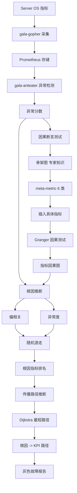
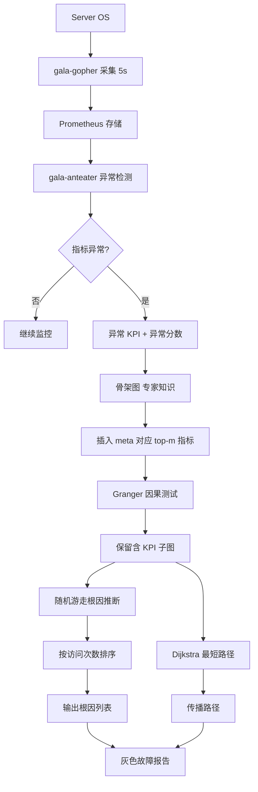

# GrayScope: Illuminating the Gray Zone: Non-intrusive Gray Failure Localization in Server Operating Systems（FSE Companion 2024）

> 作者：Shenglin Zhang, Yongxin Zhao, Xiao Xiong, Yongqian Sun, Xiaohui Nie, Jiacheng Zhang, Fenglai Wang, Xian Zheng, Yuzhi Zhang, Dan Pei  
> 机构：南开大学（HL-IT、TKL-SEHCI）；中科院网络信息中心（CNIC, CAS）；华为技术；清华大学（BNRist）  
> 发表年份：2024  
> 会议/期刊：FSE Companion 2024（ACM 32nd International Conference on the Foundations of Software Engineering）  
> 关联 PDF：同目录下 `FSE_24_GrayScope.pdf`

## 一、文档信息速览

| 字段 | 值 |
|---|---|
| 标题 | Illuminating the Gray Zone: Non-intrusive Gray Failure Localization in Server Operating Systems |
| 简称 | GrayScope |
| 作者 | Shenglin Zhang, Yongxin Zhao, Xiao Xiong, Yongqian Sun, Xiaohui Nie, Jiacheng Zhang, Fenglai Wang, Xian Zheng, Yuzhi Zhang, Dan Pei |
| 机构 | 南开大学；中科院网络信息中心；华为技术；清华大学 |
| 发表年份 | 2024 |
| 会议/期刊 | FSE Companion 2024 |
| 分类 | 灰色故障定位 / 服务端 OS / 因果学习 / 专家知识融合 |
| 核心问题 | 服务器 OS 灰色故障（介于健康与不健康之间）频发但难定位；传统侵入式方法（Panomara、OmegaGen）需改源码；纯因果学习方法因果图过大；忽略指标相关性导致定位不准；缺少传播路径解释 |
| 主要贡献 | (1) 专家知识 + Granger 因果测试构建紧凑因果图；(2) 偏相关 + 异常度融合的根因推断；(3) 传播路径推断增强可解释性；(4) 1241 注入灰色故障 + 135 工业故障评估，AC@5 = 0.90、Avg@5 = 0.82、解释精度 81% |

## 二、背景（Background）

服务器是大型数据管理和网络服务的核心。服务器 OS（Server OS）作为应用与硬件之间的中介，负责资源分配、调度、I-O 处理、安全管理。OS 各组件复杂交互容易导致性能或可用性问题。灰色故障（Gray Failure）是一种关键状态：OS 处于"健康"和"不健康"之间，可能引发系统不稳定或运行效率下降。

灰色故障包括：性能下降、容量压力、I-O 抖动、内存抖动、随机丢包、非致命异常等。它是许多灾难性故障的根源（例如高磁盘 I-O 等待会让依赖磁盘的数据库变慢）。灰色故障频发但难定位，华为云服务器 OS 故障工单显示，从故障发生到定位根因平均 8 小时，部分长达数周。

现有方法分两类：
- **侵入式**（Panomara、OmegaGen）：需修改应用源码，部署成本高、定位周期长。
- **非侵入式**：基于指标。但 (a) 纯统计方法（FluxRank、ε-diagnosis）受噪声影响大；(b) 特征学习方法需大量高质量标注，OS 故障类型多变难标注；(c) 因果图方法（CauseInfer、MicroCause、TS-InvarNet、CIRCA）有前景但忽略专家知识、相关性利用不足、缺解释性。

## 三、目的（Problems Solved）

- **复杂因果关系**：指标数量多（数百个）、相互依赖动态变化，纯 PC/Granger 方法因果图过大。
- **相关性利用不足**：当前方法只用异常度（DFS/PageRank），忽略指标与 KPI 的相关性。
- **可解释性差**：故障在 OS 组件间传播，缺乏传播路径信息，工程师难以快速修复。
- **专家知识缺失**：纯学习算法不能利用运维专家数十年经验。
- **非侵入式定位**：不修改源码即可定位灰色故障根因。
- **多场景泛化**：适用于 GaussDB/Redis/Kafka/Tomcat 等多应用。

## 四、核心原理（Principles）

**系统总览**：GrayScope 包含四个模块：(1) 数据采集与异常检测（gala-gopher + Prometheus + gala-anteater）；(2) 因果图学习（专家知识骨架 + Granger 因果测试）；(3) 根因推断（结合偏相关 + 异常度的随机游走）；(4) 传播路径推断（最短路径 + 异常分数加权）。

**关键概念**：

- **Gray Failure（灰色故障）**：至少一个组件感知 OS 不健康但观察者认为健康。
- **KPI（Key Performance Indicator）**：衡量应用性能的指标（响应时间、错误率、PV）。
- **Metric（指标）**：衡量 OS 基础组件的指标（CPU、内存、网络、磁盘、TCP）。
- **Meta-metric（元指标）**：6 类（性能、CPU、内存、网络、磁盘、TCP）的聚合。
- **Granger Causality Test（Granger 因果检验）**：若 X 的过去能更好预测 Y，且 Y 自身过去不能，则 X Granger-causes Y。
- **PC Algorithm**：Spirtes & Glymour 1991 通过条件独立性测试构建因果图。
- **Partial Correlation Coefficient（偏相关系数）**：在控制其他变量时两变量的相关性。
- **Anomaly Score（异常分数）**：gala-anteater 给出的指标异常程度。
- **Skeleton Graph（骨架图）**：基于专家知识的元指标间有向边。
- **Causality Graph（因果图）**：加入具体指标节点的子图。
- **Random Walk（随机游走）**：在因果图上从 KPI 节点游走到候选根因。
- **EulerOS**：华为基于 RHEL 开发的服务器 OS。

**数学原理**：

- **异常度（relative anomaly degree）**（论文 Eq. 1）：

$$
\text{anomaly\_degree}(v_j) = \frac{\text{anomaly\_score}(v_j)}{\text{anomaly\_score}(v_i) + \text{anomaly\_score}(v_j)}
$$

- **Granger F 检验**（核心思想）：建回归模型

$$
Y_t = \sum_{l=1}^{L} \alpha_l Y_{t-l} + \sum_{l=1}^{L} \beta_l X_{t-l} + \epsilon_t
$$

F 检验比较含/不含 $X$ 滞后项的拟合优度，若拒绝零假设，则 $X$ Granger-causes $Y$。

- **前向步转移概率**（论文 Eq. 2）：

$$
H'_{i,j} = \lambda \cdot \text{correlation}(v_j) + (1 - \lambda) \cdot \text{anomaly\_degree}(v_j)
$$

其中 $\lambda$ 控制偏相关与异常度的权重。

- **后向步转移概率**（论文 Eq. 3）：

$$
H'_{j,i} = \rho \cdot (\lambda \cdot \text{correlation}(v_i) + (1 - \lambda) \cdot \text{anomaly\_degree}(v_i))
$$

- **自步转移概率**（论文 Eq. 4-5）：

$$
H'_{j,j} = \max[0, H'_{j,j} - \max_k H'_{j,k}]
$$

- **归一化**：每行归一化得最终 $H$。

- **网络抖动 $J$**（评估用户组稳定性）：

$$
J = \frac{\sum_{s=2}^{n} |X_s - X_{s-1}| / X_s}{n-1}
$$

$J \leq T$ 表明该用户组满足 RL 连续性。

- **Granger 因果检验显著性**：$p_{\text{threshold}} = 0.05$，最大滞后阶 $\text{maxlag} = 2$。

**与现有技术的差异**：与 PC 算法（Spirtes & Glymour 1991）相比，GrayScope 融合专家知识减少假阳性；与 CauseInfer（INFOCOM 2014）相比，GrayScope 用 Granger 而非 PC 捕获时间序列连续因果；与 MicroCause（IWQoS 2020）相比，GrayScope 增加异常度 + 偏相关联合推断；与 TS-InvarNet（ICWS 2022）相比，GrayScope 基于全局图而非局部不变网络。

## 五、算法详解（Algorithm）

1. **输入 / 输出**：
   - 输入：服务器 OS 指标 + KPI（每 5 秒采集）。
   - 输出：根因指标排名 + 故障传播路径。

2. **核心模块**：
   - **数据采集与异常检测**：gala-gopher 采集 OS 指标（5 秒间隔）；Prometheus 存储；gala-anteater 异常检测。
   - **骨架图（Skeleton Graph）**：专家定义的 6 类元指标间有向边（如 network → CPU）。
   - **指标插入（Plug-in）**：把每个 meta-metric 对应的 top-$m$ 异常度指标插入骨架图，得 metric causality structure graph。
   - **Granger 因果测试**：用最近 $w$（=36）分钟数据验证每条边，保留显著的边。
   - **根因推断**：从 KPI 节点开始，在因果图上做随机游走（结合偏相关 + 异常度），按访问次数排序候选根因。
   - **传播路径推断**：基于因果图，用 Dijkstra 风格最短路径算法，权重为 $w_{i,j} = AS[i]^2 + AS[j]^2$（异常分数），找根因到 KPI 的最高累积异常路径。

3. **伪代码**：

```python
def build_skeleton_graph(meta_metrics):
    """基于专家知识定义 6 类元指标间有向边"""
    edges = [
        ('network', 'CPU'), ('CPU', 'memory'),
        ('memory', 'disk'), ('disk', 'TCP'),
        ('TCP', 'network'), ('network', 'performance'),
    ]
    return edges

def plug_metrics(skeleton, metrics, m=2):
    """每个 meta-metric 插入 top-m 异常度指标"""
    structure = skeleton.copy()
    for meta in skeleton.nodes:
        top = sorted(metrics[meta], key=lambda x: -x.anomaly_score)[:m]
        for ind in top:
            structure.add(meta, ind)
            for ind2 in top:
                if ind != ind2:
                    structure.add_full_connect(ind, ind2)
    return structure

def granger_filter(structure, kpi_metric, time_series, w=36, p=0.05, maxlag=2):
    """用 Granger 因果测试过滤边"""
    G = nx.DiGraph()
    for u, v in structure.edges:
        ts_u = time_series[u][-w:]
        ts_v = time_series[v][-w:]
        f, pval, _ = grangercausalitytests(
            np.vstack([ts_v, ts_u]).T, maxlag=maxlag, verbose=False)
        if pval[maxlag] < p:
            G.add_edge(u, v)
    # 保留含 KPI 的子图
    nodes_reach_kpi = nx.ancestors(G, kpi_metric) | {kpi_metric}
    return G.subgraph(nodes_reach_kpi).copy()

def random_walk_infer(G, kpi_metric, anomaly_scores, lam=0.2, rho=0.2, N=1000):
    """随机游走推断根因"""
    H = build_transition_matrix(G, kpi_metric, anomaly_scores, lam, rho)
    visits = {n: 0 for n in G.nodes}
    cur = kpi_metric
    for _ in range(N):
        nxt = np.random.choice(G.nodes, p=H[cur])
        visits[nxt] += 1
        cur = nxt
    return sorted(visits.items(), key=lambda x: -x[1])

def shortest_path_infer(G, root, kpi, anomaly_scores):
    """基于异常分数的最短路径"""
    G_undir = G.to_undirected()
    dist = {n: np.inf for n in G.nodes}
    prev = {n: None for n in G.nodes}
    dist[root] = 0
    pq = [(0, root)]
    while pq:
        d, u = heappop(pq)
        if u == kpi:
            break
        for v in G_undir.neighbors(u):
            w = anomaly_scores[u]**2 + anomaly_scores[v]**2
            alt = d + w
            if alt < dist[v]:
                dist[v] = alt
                prev[v] = u
                heappush(pq, (alt, v))
    return reconstruct_path(prev, kpi)
```

4. **关键数学**：见 §四。

5. **复杂度分析**：
   - Granger 因果测试：$O(|E| \cdot w \cdot \text{maxlag})$，$|E|$ 边数。
   - 随机游走：$O(N)$，$N$ 步数。
   - 最短路径（Dijkstra）：$O(|E| \log |V|)$。
   - 整体定位：单故障 8.74 秒。

6. **训练与推理**：
   - 训练：5 物理机 + 11 虚拟机，EulerOS，Chaosblade 注入 4 类灰色故障。
   - 推理：每个 OS 部署 GrayScope，KPI 异常时触发。

7. **示例**：GaussDB 应用 CPU 耗尽 → 进程 `cpu_user_msec` 升高 → 磁盘 I-O 排队（`disk_util` 下降）→ 数据库吞吐量 `sli_tps` 下降。GrayScope 输出根因 `cpu_user_msec` + 传播路径。

## 六、系统架构图（Architecture）



## 七、流程图（Process Flow）



## 八、关键创新点（Key Innovations）

- **+ 专家知识 + Granger 融合**：用元指标骨架 + Granger 测试减少纯算法误判。
- **+ 偏相关 + 异常度联合推断**：在随机游走中既考虑指标相关又考虑异常程度。
- **+ 传播路径推断**：Dijkstra 风格基于异常分数的最短路径，输出可解释路径。
- **+ 非侵入式**：不需修改源码，gala-gopher + Prometheus 部署。
- **+ 多应用支持**：GaussDB/Redis/Kafka/Tomcat 4 个应用场景验证。
- **+ 工业部署**：华为云 4 个月部署，处理真实生产故障。

## 九、实验与结果（Experiments）

- **数据集**：16 台 EulerOS 服务器，4 应用 × 4 类故障，共 1241 注入 + 135 工业故障。注入分布：CPU exhaustion 212、disk IO high load 274、network latency 336、network packet loss 419。工业数据集 48 网络延迟、50 磁盘高负载、37 高内存。
- **Baseline**：CauseInfer（INFOCOM 2014）、MicroCause（IWQoS 2020）、TS-InvarNet（ICWS 2022）、CIRCA（KDD 2022）。
- **主要指标**：AC@k（top-k 内含根因的概率）、Avg@k（前 k 个的平均 AC）、解释精度。
- **关键结果数字**：
  - GrayScope All：AC@3=0.86、AC@5=0.90、Avg@5=0.82；
  - CauseInfer：0.23/0.25/0.21；
  - MicroCause：0.68/0.75/0.64；
  - TS-InvarNet：0.68/0.80/0.63；
  - CIRCA：0.51/0.64/0.50；
  - 工业：网络延迟 AC@3=0.83、磁盘 AC@3=0.98、高内存 AC@3=0.94；
  - 解释精度：163/200 = 81.5%；
  - 定位效率：8.74s/case（CauseInfer 307.72s、MicroCause 19.71s、TS-InvarNet 9.96s、CIRCA 2.40s）。
- **消融实验**（C1-C5）：
  - C1 去掉骨架图：AC@5=0.82（vs 0.90）；
  - C2 用 PC 替代 Granger：AC@5=0.34（vs 0.90）；
  - C3 仅偏相关：0.74；
  - C4 仅异常度：0.80；
  - C5 用 DFS 替代随机游走：0.73。
- **超参数敏感**：$p_{\text{threshold}}=0.05$、$\text{maxlag}=2$、$\rho=0.2$、$\lambda=0.2$ 最优。
- **三种真实案例**：CPU 耗尽、网络延迟、磁盘高负载，路径均被工程师验证。

## 十、应用场景（Use Cases）

- **服务器 OS 灰色故障定位**：华为云生产环境。
- **数据库性能诊断**：GaussDB 性能下降根因。
- **缓存服务异常定位**：Redis 响应时间飙升。
- **消息队列监控**：Kafka 生产率下降。
- **Web 容器诊断**：Tomcat Servlet 处理时间异常。

## 十一、相关论文（Related Papers in this set）

- `alertrank_camera-ready`（告警分级）
- `SCWarn`（多模态异常检测）
- `SynthoDiag`（测试告警诊断）
- `TraceSieve_ISSRE23`（追踪异常检测）
- `SparseRCA__Unsupervised_Root_Cause_Analysis_in_Sparse_Microservice_Testing_Traces__ISSRE24_Camera_Ready_`（稀疏追踪 RCA）
- `ISSRE24-Self-Evolution`（LLM 微调）

## 十二、术语表（Glossary）

- **Gray Failure**：灰色故障。
- **KPI**：Key Performance Indicator，应用性能指标。
- **Metric**：OS 基础组件指标。
- **Meta-metric**：元指标，6 类聚合。
- **Granger Causality Test**：Granger 因果检验。
- **PC Algorithm**：Spirtes & Glymour 1991 因果发现。
- **Partial Correlation**：偏相关系数。
- **Anomaly Score**：异常分数。
- **Skeleton Graph**：骨架图。
- **Causality Graph**：因果图。
- **EulerOS**：华为服务器 OS。
- **gala-gopher**：openEuler eBPF 探针框架。
- **Prometheus**：时序数据库。
- **gala-anteater**：openEuler 异常检测算法集。
- **Chaosblade**：阿里巴巴混沌工程工具。

## 十三、参考与延伸阅读

- Paper: Huang et al. 2017《Gray Failure: The Achilles' Heel of Cloud-Scale Systems》——灰色故障定义。
- Paper: Chen et al. 2014《CauseInfer》——分布式系统因果推断。
- Paper: Meng et al. 2020《MicroCause》——微服务因果定位。
- Paper: Hu et al. 2022《TS-InvarNet》——时序不变网络。
- Paper: Li et al. 2022《CIRCA》——干预识别 RCA。
- Paper: Spirtes & Glymour 1991 PC 算法。
- Paper: Granger 1969 因果检验。
- 工具：gala-gopher、Prometheus、Chaosblade、EulerOS、openEuler。
- 相关论文：`SCWarn`、`alertrank_camera-ready`。
