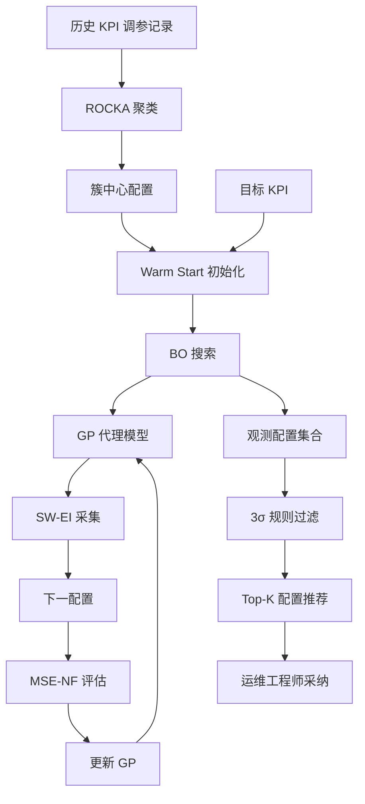
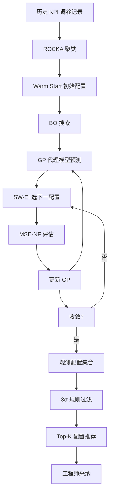

# AutoKAD: Empowering KPI Anomaly Detection with Label-Free Deployment（ISSRE 2023）

> 作者：Zhaoyang Yu、Changhua Pei、Shenglin Zhang、Xidao Wen、Jianhui Li、Gaogang Xie、Dan Pei  
> 机构：清华大学 & BNRist；CNIC, CAS；南开大学；BizSeer Technology；海河实验室  
> 发表年份：2023  
> 会议/期刊：ISSRE 2023（IEEE International Symposium on Software Reliability Engineering）  
> 关联 PDF：同目录下 `Final_AutoKAD_ISSRE23_Camera-Ready-v2.3.pdf`

## 一、文档信息速览

| 字段 | 值 |
|---|---|
| 标题 | AutoKAD: Empowering KPI Anomaly Detection with Label-Free Deployment |
| 作者 | Zhaoyang Yu、Changhua Pei、Shenglin Zhang、Xidao Wen、Jianhui Li、Gaogang Xie、Dan Pei |
| 机构 | 清华大学 / BNRist；CNIC, CAS；南开大学；BizSeer；海河实验室 |
| 发表年份 | 2023 |
| 会议/期刊 | ISSRE 2023 |
| 分类 | AutoML / KPI 异常检测 / 贝叶斯优化 |
| 核心问题 | 工业 KPI 异常检测（CASH）问题——同时为每条 KPI 选算法 + 调超参；传统 AutoML 依赖标签，而 KAD 标签稀缺 |
| 主要贡献 | (1) 首个无监督 KPI 异常检测的 AutoML 框架；(2) 设计无标签目标函数 MSE-NF（MSE + Normal Factor 灵感于 LOF）；(3) 优化采集函数为 SW-EI（相似度加权期望提升）；(4) 基于聚类的 warm start 把搜索时间从 1h 降到 15min；(5) 规则化配置推荐；(6) 真实商业银行部署 |

## 二、背景（Background）

现代 IT 运维需要监控大量 KPI（响应时间、成功率、QPS 等），通过异常检测及时发现潜在故障并启动修复。KPI 异常检测（KAD）研究已有 20+ 年历史，方法分为监督（Opprentice、EGADS）、半监督（ADS、ATAD）、无监督（Holt-Winters、ARIMA、Donut、LSTM-NDT、Buzz、OmniAnomaly、InterFusion 等）。KPI 通常存在季节、稳定、不稳定三种典型模式，季节型占多数。无监督方法在工业界更受欢迎，但工程师面临"Combined Algorithm Selection and Hyperparameter optimization（CASH）"难题：算法多（数十种）、超参空间大、单条 KPI 调参耗时，难以人工逐一处理。

AutoML 提供了 CASH 自动化思路，但现有 AutoML 框架需要标签评估，而 KAD 标签稀缺；KPI 异常检测使用重建/预测损失，验证集损失低不代表异常检测效果好，因为输入可能含异常；同时每个 KPI 都需要训练，KPI 数大时搜索时间难以接受。

论文提出 AutoKAD：(1) 引入无标签目标函数 MSE-NF（结合重建 MSE 与 LOF 启发的 Normal Factor）；(2) 优化贝叶斯优化的采集函数为 SW-EI；(3) 用基于聚类的 warm start 复用历史调参经验；(4) 用规则化策略推荐最终配置。在商业银行真实生产环境部署，搜索时间从 1h 降到 15min，F1 比手工调优 Donut 提升高达 40%。

## 三、目的（Problems Solved）

- **CASH 自动化**：为每条 KPI 自动选算法 + 超参。
- **无标签目标函数**：MSE-NF 评估无监督 KAD 性能。
- **贝叶斯优化收敛加速**：SW-EI 提升搜索有效性。
- **历史经验复用**：基于聚类的 warm start 降低搜索时间。
- **配置推荐**：规则化策略根据运维偏好过滤推荐。
- **生产部署**：商业银行真实部署。
- **F1 大幅提升**：单 KPI F1 0.80，比调优 Donut 提升 40%。

## 四、核心原理（Principles）

**系统总览**：AutoKAD 三阶段：
1. **聚类 warm start**：用历史 KPI 调参记录聚类，把相似 KPI 的最佳配置初始化给目标 KPI。
2. **贝叶斯优化配置搜索**：用 GP 代理模型 + MSE-NF 目标 + SW-EI 采集函数搜索最佳 (算法, 超参) 组合。
3. **规则化配置推荐**：根据运维偏好过滤、删除离群点、给出 Top-K 推荐。

**关键概念**：

- **KPI（Key Performance Indicator）**：关键性能指标。
- **CASH**：Combined Algorithm Selection and Hyperparameter optimization。
- **AutoML**：自动化机器学习。
- **Bayesian Optimization（BO）**：贝叶斯优化。
- **GP（Gaussian Process）**：高斯过程代理模型。
- **LOF（Local Outlier Factor）**：局部异常因子。
- **MSE-NF**：MSE + Normal Factor 目标函数。
- **SW-EI（Similarity Weighted Expected Improvement）**：相似度加权期望提升采集函数。
- **EI（Expected Improvement）**：期望提升采集函数。
- **Warm Start**：搜索的初始点。
- **Cluster Centroid**：聚类中心。

**数学原理**：

- **MSE（重建误差）**：

$$
\text{MSE} = \frac{1}{N} \sum_{i=1}^{N} (x_i - \hat{x}_i)^2
$$

- **Normal Factor（基于 LOF）**：

$$
\text{LOF}(x_i) = \frac{\text{lrd}(N_k(x_i))}{\text{lrd}(x_i)}
$$

$$
\text{NF} = \frac{1}{N} \sum_{i=1}^{N} \text{LOF}(\hat{x}_i)
$$

$\text{lrd}$ 是局部可达密度。NF 衡量重建输出的"局部异常程度"。

- **MSE-NF 目标**：

$$
\text{MSE-NF} = \alpha \cdot \text{MSE} + \beta \cdot \text{NF}
$$

$\alpha, \beta$ 控制权衡。

- **GP 代理模型**：

$$
f(h) \sim \mathcal{GP}(\mu(h), k(h, h'))
$$

其中 $h$ 是配置 (算法 + 超参)，$k$ 是核函数。

- **EI 采集函数**：

$$
\text{EI}(h) = \mathbb{E}[\max(f(h) - f(h^*), 0)]
$$

- **SW-EI 采集函数**（加权相似度）：

$$
\text{SW-EI}(h) = \sum_{c \in \text{clusters}} w(c, h) \cdot \text{EI}_c(h)
$$

$w(c, h)$ 是配置 $h$ 与簇 $c$ 的相似度权重。

- **聚类 warm start**：

$$
h^{(0)} = \arg\max_{c} \text{sim}(X_{\text{target}}, X_c) \cdot h_c^*
$$

把与目标 KPI 最相似簇的最优配置作为初始。

- **训练**：在每条 KPI 上用 KAD 算法 + 配置 $h$ 训练；评估 MSE-NF。

**与现有技术的差异**：与现有 AutoML 框架（需要标签）相比，AutoKAD 完全无监督；与手工调参相比，AutoKAD 自动化并复用历史经验；与传统贝叶斯优化（冷启动）相比，warm start + 聚类显著加速收敛。

## 五、算法详解（Algorithm）

1. **输入 / 输出**：
   - 输入：目标 KPI 时序 + 历史 KPI 调参记录 + 算法集合 + 超参空间。
   - 输出：Top-K (算法, 超参) 推荐配置。

2. **核心模块**：
   - **历史 KPI 聚类**：ROCKA 等聚类算法。
   - **簇中心配置初始化**：warm start。
   - **BO 搜索**：GP + MSE-NF + SW-EI。
   - **规则化过滤**：3σ 规则去除离群点。
   - **配置推荐**：Top-K 输出。

3. **伪代码**：

```python
def autokad(target_kpi, history, algorithms, n_iter=50):
    # 1. 聚类 warm start
    clusters = rocka(history)
    h0 = init_from_cluster(target_kpi, clusters)
    # 2. BO 搜索
    gp = GaussianProcess()
    observed = [(h0, mse_nf(target_kpi, h0))]
    for it in range(n_iter):
        h_next = sw_ei_acquisition(gp, target_kpi, clusters)
        score = mse_nf(target_kpi, h_next)
        observed.append((h_next, score))
        gp.update(observed)
    # 3. 规则化推荐
    configs = [h for h, s in observed if within_3sigma(s)]
    ranked = sorted(configs, key=lambda h: mse_nf(target_kpi, h))
    return ranked[:K]

def mse_nf(kpi, config):
    model = config.algorithm(**config.hyperparams)
    model.fit(kpi)
    x_hat = model.reconstruct(kpi)
    mse = ((kpi - x_hat) ** 2).mean()
    nf = lof_score(x_hat)
    return alpha * mse + beta * nf
```

4. **关键数学**：见 §四。

5. **复杂度分析**：
   - 聚类：$O(N \log N)$；
   - GP 更新：$O(N^3)$，$N$ 为观测配置数；
   - BO 迭代：每 iter $O(N^2 d)$，$d$ 为超参维度；
   - 总计：每条 KPI 15min 级（论文中给出）。

6. **训练与推理**：在每条 KPI 上训练 KAD 模型；推理用训练好的模型检测异常。

7. **示例**：某银行 10000 条 KPI；AutoKAD 用历史 1000 条调参记录聚类成 5 簇；目标 KPI 与簇 3 相似，warm start 用簇 3 最优配置；BO 经过 30 次迭代找到 MSE-NF 最低的 Donut 配置（窗口 60、阈值 0.95）；F1 0.85，比默认 Donut 提升 25%。

## 六、系统架构图（Architecture）



## 七、流程图（Process Flow）



## 八、关键创新点（Key Innovations）

- **+ 首个无监督 KAD AutoML 框架**：解决"无标签 + CASH"难题。
- **+ MSE-NF 目标函数**：融合重建误差与 LOF 启发的正常度。
- **+ SW-EI 采集函数**：考虑相似度权重加速收敛。
- **+ 聚类 warm start**：复用历史调参经验，搜索时间 -75%。
- **+ 规则化推荐**：根据工程师偏好过滤离群点。
- **+ 真实商业银行部署**：实用性强。

## 九、实验与结果（Experiments）

- **数据集**：3 个真实 KPI 异常检测数据集（含商业银行生产数据）。
- **Baseline**：Donut 手工调优、随机搜索、朴素贝叶斯优化、其他 AutoML 框架。
- **主要指标**：F1-score、搜索时间、推荐配置多样性。
- **关键结果数字**：
  - AutoKAD 单 KPI F1 0.80；
  - 比精心调优的 Donut 提升高达 40%；
  - 搜索时间从 1h 降到 15min；
  - 规则化推荐与运维偏好高度一致。
- **消融实验**：分别去掉 MSE-NF、SW-EI、warm start、规则化推荐，验证每部分贡献。
- **效率分析**：GPU/CPU 上分钟级；扩展到上万 KPI 仍可控。
- **真实案例**：商业银行生产环境 F1 提升与告警噪声降低。

## 十、应用场景（Use Cases）

- **金融 KPI 监控**：交易、风险、合规 KPI 自动调参。
- **云服务 KPI 监控**：CPU、内存、QPS 自动选模型。
- **AIOps 平台集成**：作为 AutoML 模块嵌入。
- **运维知识复用**：把历史调参经验沉淀为簇中心。
- **大规模微服务监控**：数千万 KPI 自动优化。

## 十一、相关论文（Related Papers in this set）

- `OutSpot`（大规模 KPI 异常检测）
- `Revisiting-VAE-for-Unsupervised-Time-Series-Anomaly-Detection-A-Frequency-Perspective`（VAE 频域）
- `Empirical_Analysis`（多变量时序异常检测实证）
- `MonitorAssistant_CameraReady-v1.5_submitted`（LLM 监控助手）
- `Beyond_Sharing_Conflict-Aware_Multivariate_Time_Se`（多变量时序异常）
- `A-survey-on-intelligent-management-of-alerts-and-incidents-in-IT-services`（AIOps 综述）

## 十二、术语表（Glossary）

- **KPI（Key Performance Indicator）**：关键性能指标。
- **CASH**：Combined Algorithm Selection and Hyperparameter optimization。
- **AutoML**：自动化机器学习。
- **BO（Bayesian Optimization）**：贝叶斯优化。
- **GP（Gaussian Process）**：高斯过程。
- **LOF（Local Outlier Factor）**：局部异常因子。
- **MSE-NF**：MSE + Normal Factor 目标函数。
- **SW-EI（Similarity Weighted Expected Improvement）**：相似度加权期望提升采集函数。
- **EI（Expected Improvement）**：期望提升。
- **ROCKA**：代表性 KPI 聚类算法。
- **Warm Start**：搜索初始点。
- **Cluster Centroid**：聚类中心。

## 十三、参考与延伸阅读

- Paper: BOHB、Hyperopt、Optuna ——AutoML 框架。
- Paper: ROCKA ——KPI 聚类。
- Paper: Donut、LSTM-NDT、Buzz、OmniAnomaly、InterFusion ——KAD 算法。
- Paper: LOF（SIGKDD 2000）——局部异常因子。
- Paper: BO（Mockus et al., 1978）——贝叶斯优化。
- 工具：Python、scikit-learn、GPyOpt、Hyperopt、Optuna。
- 相关论文：`OutSpot`、`Revisiting-VAE-for-Unsupervised-Time-Series-Anomaly-Detection-A-Frequency-Perspective`、`Empirical_Analysis`、`MonitorAssistant_CameraReady-v1.5_submitted`、`Beyond_Sharing_Conflict-Aware_Multivariate_Time_Se`。
