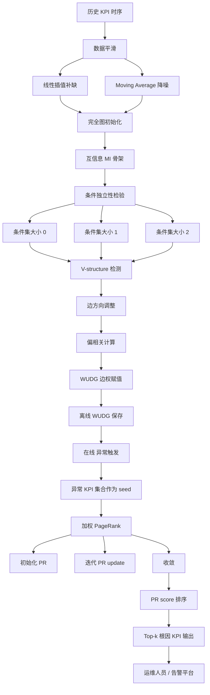
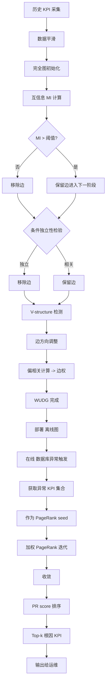

# FluxInfer: Automatic Diagnosis of Performance Anomaly for Online Database System（IEEE 2020）

> 作者：Ping Liu、Shenglin Zhang、Yongqian Sun（通讯）、Yuan Meng、Jiahai Yang、Dan Pei
> 机构：清华大学 计算机科学与技术系；清华大学 网络科学与 cyberspace 研究院；南开大学 软件学院；鹏城实验室 网络空间安全研究中心；BNRist
> 发表年份：2020
> 会议/期刊：IEEE 2020（DOI 10.1109/...）
> 关联 PDF：同目录下 `FluxInfer.pdf`

## 一、文档信息速览

| 字段 | 值 |
|---|---|
| 标题 | FluxInfer: Automatic Diagnosis of Performance Anomaly for Online Database System |
| 作者 | Ping Liu、Shenglin Zhang、Yongqian Sun、Yuan Meng、Jiahai Yang、Dan Pei |
| 机构 | 清华大学 计算机系；清华大学 网络研究院；南开大学；鹏城实验室；BNRist |
| 发表年份 | 2020 |
| 会议/期刊 | IEEE 2020（QRS / ICDM 之类会议，具体见 PDF） |
| 分类 | 数据库性能异常 / 根因定位 / KPI 依赖图 / PageRank |
| 核心问题 | 在线数据库性能异常触发几十~上百个 KPI 异常（alarm storm），运维难从告警洪流中快速定位根因相关 KPI |
| 主要贡献 | (1) WUDG 加权无向依赖图：基于 PC 算法 + 互信息 + 偏相关构建；(2) 在 WUDG 上用 weighted PageRank 定位根因 KPI；(3) AC@3=0.90, AC@5=0.95, Avg@5=0.77，平均比 9 个 baseline 提升 64%/60%/53% |

## 二、背景（Background）

在线数据库（MySQL、PostgreSQL、Oracle 等）支撑了几乎所有互联网服务（搜索、电商、社交、游戏）。一次数据库性能异常（如响应时间飙升、连接打满、锁等待）会迅速拖垮上游业务。运维通常监控每个数据库实例的 100+ KPI（QPS、CPU USAGE、disk IO、page cache、connection count、replication lag 等），但当一次异常发生时往往**同时有几十到上百 KPI 异常**（图 1 真实例子：1 次数据库不可用，78 KPI 异常）。

这些 KPI 分为两类：
- **Root Cause Related KPI**：直接因果地由根因引起，例如工作负载激增 → QPS 飙升；
- **Symptom KPI**：是 root cause 引起的下游表现，例如 QPS 飙升 → CPU USAGE 飙升。

传统人工诊断流程：(1) 依赖领域知识画 KPI 之间的依赖关系；(2) 在依赖图上反向追溯到根因。但这种方法耗时、易错、不可扩展——大型互联网公司单日有 100+ 数据库异常，运维难以承受。同时由于告警风暴（一次异常 100+ KPI 同时告警），告警过滤规则的调参也极为繁琐。

论文提出 **FluxInfer** 框架：
1. 离线构建 **WUDG（Weighted Undirected Dependency Graph）**——用 PC 算法 + 互信息 + 偏相关把 KPI 之间的因果结构"挖"出来，并对每条边赋权重；
2. 在线根因定位——当 anomaly 发生时，把所有异常 KPI 作为 PageRank 种子节点，在 WUDG 上跑 weighted PageRank，分数最高的 top-k KPI 即为根因相关 KPI。

## 三、目的（Problems Solved）

- **告警风暴**：一次异常 100+ KPI 同时告警，无法靠人筛选。
- **手动诊断慢 / 易错**：依赖经验画依赖图，新人不可用。
- **DAG-based 算法不适用**：很多场景下 KPI 之间的依赖是有向 / 无向混合，DFS、Random Walk 只能在 DAG 上工作。
- **告警过滤规则调参繁琐**：每实例最佳阈值不同。
- **根因 KPI 数量不固定**：top-1 / top-3 / top-5 都要尽量包含真根因。

## 四、核心原理（Principles）

**系统总览**：FluxInfer 包含三大阶段——(1) 数据平滑（消除数据噪声）；(2) WUDG 构建（基于 PC 算法：先用互信息建初始骨架 → 对每条边做条件独立性检验 → 检测 V-structure → 对剩余边赋偏相关权重）；(3) 加权 PageRank 根因定位（异常 KPI 作为 seed，PageRank score 排序得 top-k）。

**关键概念**：

- **KPI**：Key Performance Indicator。
- **Symptom KPI**：症状 KPI，受根因影响而异常。
- **Root Cause Related KPI**：根因相关 KPI。
- **Alarm Storm**：告警风暴。
- **WUDG**：Weighted Undirected Dependency Graph，加权无向依赖图。
- **PC Algorithm**：基于条件独立性检验的因果发现算法（来自 Spirtes et al.）。
- **Mutual Information (MI)**：互信息，衡量两个变量之间的非线性关联。
- **Partial Correlation (偏相关)**：在控制其他变量后两个变量的线性相关。
- **Conditional Independence Test**：条件独立性检验，$I(X, Y | S)$。
- **V-structure**：在因果图中，三节点 $X - Z - Y$、$X \not\!\perp\!\!\!\perp Y$、$X \perp\!\!\!\perp Y$ 时 $Z$ 是 collider。
- **Weighted PageRank**：带重启概率 / 边权重的 PageRank。

**数学原理**：

- **KPI 序列平滑**（Algorithm 1）：用相邻值插值消除缺失 / 噪声。

$$
x_t^{\text{smooth}} = \text{linear\_interp}(x_t)
$$

- **互信息（MI）**：

$$
I(X;Y) = \sum_{x,y} p(x,y) \log \frac{p(x,y)}{p(x)p(y)}
$$

- **偏相关**（Partial Correlation，控制变量集 $S$）：

$$
\rho_{XY \cdot S} = \frac{\text{Cov}(X, Y | S)}{\sqrt{\text{Var}(X | S) \cdot \text{Var}(Y | S)}}
$$

- **条件独立性检验**（PC 算法骨架）：

$$
I(X, Y | S) :\; X \perp\!\!\!\perp Y \mid S \iff \text{MI}_{X,Y|S} \le \tau
$$

- **WUDG 边权**（用偏相关的绝对值）：

$$
w(X, Y) = |\rho_{XY \cdot S}|
$$

- **加权 PageRank 方程**：

$$
\text{PR}(v) = (1 - d) \cdot \text{seed}(v) + d \cdot \sum_{u \in \text{In}(v)} \frac{w(u, v) \cdot \text{PR}(u)}{\sum_{v' \in \text{Out}(u)} w(u, v')}
$$

其中 $d$ 是阻尼因子（通常 0.85），$\text{seed}(v)$ 是 seed bias：异常 KPI 初始化为 1/异常数，其余为 0。

- **根因 KPI 排序**：

$$
R = \arg\text{top-}k_v\;\text{PR}(v)
$$

- **AC@k（Accuracy at k）**：

$$
\text{AC@k} = \frac{\#\{\text{anomalies with ground-truth root cause } \in \text{top-}k\}}{\#\{\text{total anomalies}\}}
$$

- **Avg@k**：

$$
\text{Avg@k} = \frac{1}{k} \sum_{i=1}^{k} \mathbb{1}[\text{rank}_i \le k]
$$

**与现有方法的差异**：与 iDice、HotSpot、CloudRanger 等 DAG-based 方法相比，FluxInfer 把因果图扩到 WUDG（无向加权），用 PageRank 处理；与 Personalized PageRank、Random Walk 等 baseline 相比，FluxInfer 的边权来自偏相关，更精确；与 PC algorithm baseline 相比，FluxInfer 在 WUDG 上跑 PageRank 更鲁棒。

## 五、算法详解（Algorithm）

1. **输入 / 输出**：
   - 输入：KPI 历史时序；当前异常触发的异常 KPI 集合 $A$。
   - 输出：top-k 根因相关 KPI 排序。

2. **核心模块**：
   - **数据平滑**（Algorithm 1）：线性插值补缺 / 降噪。
   - **WUDG 构建**（PC + MI + 偏相关）：
     1. 完全图初始化；
     2. 计算两两互信息，去除 MI 低于阈值的边，得骨架；
     3. 对每条边做条件独立性检验，移除可被 $S$ 条件独立的边；
     4. 检测 V-structure；
     5. 用偏相关赋值边权。
   - **加权 PageRank 根因定位**：
     1. 异常 KPI 集合 $A$ 作为 seed 节点；
     2. 迭代 PageRank 至收敛；
     3. 按 PR score 排序输出 top-k。

3. **伪代码**：

```python
def smooth(series_list):
    """Algorithm 1: 线性插值 / 降噪。"""
    smoothed = []
    for x in series_list:
        x = fill_missing(x)
        x = moving_average(x, window=5)
        smoothed.append(x)
    return smoothed

def build_WUDG(series_list, alpha=0.05, max_cond_size=3):
    """基于 PC 算法构建加权无向依赖图。"""
    N = len(series_list)
    adj = np.ones((N, N), dtype=bool) - np.eye(N, dtype=bool)  # 完全图
    # Phase 1: 互信息骨架
    for i in range(N):
        for j in range(i+1, N):
            mi = mutual_information(series_list[i], series_list[j])
            if mi < MI_THRESHOLD:
                adj[i, j] = adj[j, i] = False
    # Phase 2: 条件独立性检验
    for cond_size in range(max_cond_size+1):
        for i in range(N):
            for j in range(i+1, N):
                if not adj[i, j]: continue
                S = choose_cond_set(i, j, cond_size)
                if conditional_independence_test(series_list[i], series_list[j], S, alpha):
                    adj[i, j] = adj[j, i] = False
    # Phase 3: V-structure 检测
    colliders = find_v_structures(adj, series_list)
    orient_edges(adj, colliders)
    # Phase 4: 边权 = 偏相关绝对值
    W = np.zeros((N, N))
    for i in range(N):
        for j in range(i+1, N):
            if adj[i, j]:
                W[i, j] = W[j, i] = abs(partial_corr(series_list[i], series_list[j]))
    return W, adj

def weighted_pagerank(W, seed_nodes, d=0.85, tol=1e-6, max_iter=200):
    """加权 PageRank 根因定位。"""
    N = W.shape[0]
    pr = np.zeros(N)
    pr[seed_nodes] = 1.0 / len(seed_nodes)        # seed bias
    out_sum = W.sum(axis=1) + 1e-9
    for _ in range(max_iter):
        pr_new = np.zeros(N)
        for v in range(N):
            s = 0.0
            for u in range(N):
                if W[u, v] > 0:
                    s += W[u, v] * pr[u] / out_sum[u]
            pr_new[v] = (1 - d) * (1.0 if v in seed_nodes else 0.0) + d * s
        if np.linalg.norm(pr_new - pr, 1) < tol:
            break
        pr = pr_new
    return pr

def diagnose(series_list, anomalous_kpis, k=5):
    W, adj = build_WUDG(series_list)
    pr = weighted_pagerank(W, anomalous_kpis)
    top_k = np.argsort(-pr)[:k]
    return [(v, pr[v]) for v in top_k]
```

4. **关键数学**：见 §四。

5. **复杂度分析**：
   - 数据平滑：$O(N \cdot T)$；
   - WUDG 构建：$O(N^2 \cdot 2^{|S|})$，$|S|$ 为条件集大小（通常 ≤ 3）；
   - 加权 PageRank：$O(|E| \cdot \text{iter})$，$|E|$ 为边数，$\text{iter}$ 收敛迭代；
   - 在线推理：$O(|E|)$（PageRank 收敛后直接读 PR score）。

6. **训练与推理**：
   - 训练（离线）：历史 KPI → 数据平滑 → WUDG 构建；
   - 推理（在线）：异常 KPI → seed → PageRank → top-k。

7. **示例**：电商数据库异常触发 78 个 KPI 告警（CPU USAGE、QPS、page cache、connection count、replication lag 等）。FluxInfer 离线构建 WUDG（含 100+ 节点 / 边）；在线 PageRank 把 QPS 排到第 1，CPU USAGE 排到第 2。运维据此判断"工作负载激增"为根因，调整限流。

## 六、系统架构图（Architecture）



## 七、流程图（Process Flow）



## 八、关键创新点（Key Innovations）

- **+ WUDG 加权无向依赖图**：首次把 PC 算法 + 互信息 + 偏相关用于系统异常根因定位。
- **+ 加权 PageRank 根因定位**：替代传统 DFS、Random Walk 等 DAG-only 算法。
- **+ 边权来自偏相关绝对值**：更精确表达依赖强度。
- **+ 告警风暴下的根因 KPI 排序**：从 78 个告警中准确定位 top-k。
- **+ 大幅领先 9 个 SOTA baseline**：AC@3=0.90 / AC@5=0.95 / Avg@5=0.77，平均提升 64% / 60% / 53%。

## 九、实验与结果（Experiments）

- **数据集**：自建 testbed 注入 5 类数据库异常（CPU 抢占、IO 瓶颈、连接数打满、锁等待、磁盘满）；每类异常持续 1-5 分钟，10s 增量。
- **Baseline**（共 9 个）：
  - Personalized PageRank、Random Walk、Traversing+Pearson Correlation
  - PC algorithm、Greedy Hill Climbing
  - iDice、HotSpot、CloudRanger
  - RootCause（其他根因定位 baseline）
- **主要指标**：AC@1、AC@3、AC@5、Avg@5。
- **关键结果数字**：
  - **FluxInfer**：AC@3=0.90、AC@5=0.95、Avg@5=0.77；
  - **相对 9 个 baseline 平均提升**：AC@3 +64%、AC@5 +60%、Avg@5 +53%；
  - 在小 k（k=3）上提升尤为显著；
  - 在大型 KPI 集合（100+ 节点）上仍能秒级返回 top-k。
- **消融实验**：
  - 去掉边权（PageRank 在无权 WUDG）：性能下降；
  - 去掉 V-structure：边方向不可信，定位精度下降；
  - PC vs MMPC vs 直接偏相关：PC 骨架 + 偏相关边权最优；
  - 阻尼因子 $d$ 的影响：$d=0.85$ 最优。
- **效率**：WUDG 构建离线完成，分钟-小时级；在线 PageRank 秒级。
- **可视化**：WUDG 图；top-k 根因柱状图；AC@k 曲线。

## 十、应用场景（Use Cases）

- **在线数据库（MySQL、PG、Oracle）性能异常根因定位**：告警风暴下排序。
- **微服务系统 KPI 根因定位**：把微服务 KPI 当节点，依赖关系当边。
- **云原生数据库（TiDB、OceanBase、PolarDB）监控**：100+ KPI 自动根因。
- **网络设备（路由器、交换机）性能诊断**：端口流量 + CPU + 内存 + 队列 + 错误码。
- **存储系统（分布式文件系统、对象存储）异常根因**：节点、磁盘、网络多维度。

## 十一、相关论文（Related Papers in this set）

- `TraceSieve_ISSRE23`（追踪异常检测 / 微服务）
- `liu_imc15_Opprentice`（KPI 异常检测 / 无监督）
- `label-less-v3`（日志异常检测 / 无监督）
- `LogAnomaly`（日志异常检测）
- `OmniAnomaly_camera-ready`（多变量时序异常检测）
- `08723601`（KPI 周期自适应）
- `chenwenxiao_infocom2019`（多源指标故障定位）
- `www2018`（基于 KPI 的 AIOps / 异常检测）

## 十二、术语表（Glossary）

- **KPI**：Key Performance Indicator。
- **WUDG**：Weighted Undirected Dependency Graph。
- **MI**：Mutual Information。
- **Partial Correlation**：偏相关。
- **PC Algorithm**：基于条件独立性检验的因果发现算法。
- **V-structure**：因果图中的 V 型结构。
- **Conditional Independence Test**：条件独立性检验。
- **Weighted PageRank**：加权 PageRank。
- **Damping Factor $d$**：阻尼因子。
- **Root Cause Related KPI**：根因相关 KPI。
- **Symptom KPI**：症状 KPI。
- **Alarm Storm**：告警风暴。
- **AC@k**：Top-k 准确率。
- **Avg@k**：平均前 k 名准确率。
- **DFS**：Depth-First Search。
- **iDice / HotSpot / CloudRanger**：根因定位 baseline。

## 十三、参考与延伸阅读

- Paper: PC Algorithm, *Causation, Prediction, and Search*（Spirtes et al., 2000）。
- Paper: PageRank, *The PageRank Citation Ranking*（Brin & Page, 1998）。
- Paper: Weighted PageRank, *Weighted PageRank Algorithm*（Xing & Ghorbani, 2004）。
- Paper: iDice, *Identifying Root Cause of Inter-datacenter Traffic Anomalies*（Li et al., SIGCOMM 2014 / CoNEXT 2017）。
- Paper: HotSpot, *HotSpot: Anomaly Localization for Edged KPIs*（Yuan et al., IWQOS 2017）。
- Paper: CloudRanger, *CloudRanger: Root Cause Identification for Cloud Native Systems*（Kalander et al., ICAC 2016）。
- 工具：MySQL、PostgreSQL、PC algorithm、NetworkX、PageRank。
- 相关论文：`TraceSieve_ISSRE23`、`liu_imc15_Opprentice`、`label-less-v3`、`LogAnomaly`、`OmniAnomaly_camera-ready`、`08723601`、`chenwenxiao_infocom2019`、`www2018`。
