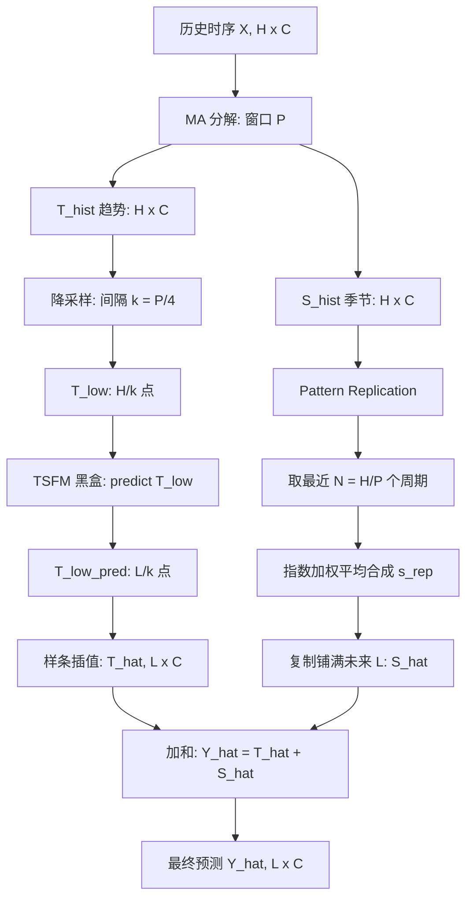
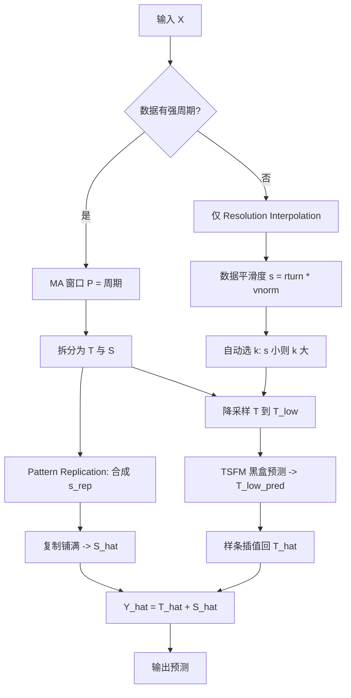

# See More, Forecast Better and Faster: Enhancing Time Series Foundation Models via Inference-Time Plug-and-Play Downsampling（ICML 2026）

> 作者：Longlong Xu、Zeyan Li、Xiao He、Zhaoyang Yu、Dazhong Wen、Mingze Sun、Changhua Pei、Dan Pei  
> 机构：清华大学；字节跳动；中国科学院计算机网络信息中心  
> 发表年份：2026  
> 会议/期刊：The 43rd International Conference on Machine Learning (ICML 2026)，首尔  
> 关联 PDF：同目录下 `ICML26_SPRINT_20260522.pdf`

## 一、文档信息速览

| 字段 | 值 |
|---|---|
| 标题 | See More, Forecast Better and Faster: Enhancing Time Series Foundation Models via Inference-Time Plug-and-Play Downsampling |
| 作者 | Longlong Xu, Zeyan Li, Xiao He, Zhaoyang Yu, Dazhong Wen, Mingze Sun, Changhua Pei, Dan Pei |
| 机构 | 清华大学；字节跳动；中科院计算网络信息中心 |
| 发表年份 | 2026 |
| 会议/期刊 | ICML 2026 |
| 分类 | 时序基础模型 / 长时序预测 / 推理加速 |
| 核心问题 | 现有 TSFMs 处理长 / 超长序列时计算 / 内存爆炸，且零样本精度下降 |
| 主要贡献 | (1) 提出 SPRINT：训练免费的即插即用框架；(2) Resolution Interpolation 处理低频趋势；(3) Pattern Replication 保留高频季节；(4) 9 数据集 / 7 TSFM 全方位验证，精度+19%，效率 6.4× 内存 / 16.9× 推理时间 |

## 二、背景（Background）

时序基础模型（Time Series Foundation Models, TSFMs）——TimesFM、Chronos、Moirai、Timer、TimeMoE、ToTo、VisionTS、TTM 等——通过大规模预训练在跨域零样本任务上取得显著成绩。然而现实部署中存在两类典型困难：

1. **高采样率 / 长序列**：MarmAudio 等数据集采样率达 96 kHz；分钟级数据一个日周期就 1440 个点，覆盖周 / 月级模式需要数万点。
2. **超长预测（Ultra LTSF）**：预测长度 L 与回看长度 H 都很长，TSFMs 的 attention 复杂度（平方级）导致计算与内存爆炸；同时由于长程依赖复杂，零样本预测精度也显著下降。

关键观察：**时序数据有显著冗余**——基于香农采样定理和频域压缩的理论，许多复杂信号可从更少的"关键成分"被准确重建。这意味着核心信息在降采样后仍可保留。

由此引出本文的核心 idea：**在降采样后的低分辨率空间做预测**。这种"降采样 + 重建"的策略让 TSFMs 能"看见"更长的历史窗口，同时显著降低推理成本。但实现这一思想面临三大挑战：

1. **信息损失**：朴素降采样（如直接抽点）会丢失高频分量（尖峰、周期模式），而这些对预测至关重要。
2. **分辨率不匹配**：降采样空间是粗粒度的，但目标输出是细粒度的，需要准确且高效地把低分辨率预测插值回原始分辨率。
3. **模型无关性**：作为基础性改进，方案应当是**通用适配器**——对任何 TSFM 即插即用，无须微调或新增参数。

## 三、目的（Problems Solved）

- **提升 TSFMs 长 / 超长预测的精度**：在不修改骨干模型的前提下，让现有 TSFMs 在 L ∈ {96, 192, 336, 720, 1440, 2880, 4320, 5760} 上预测误差显著降低。
- **降低 TSFMs 推理成本**：通过降采样把骨干的输入长度压缩 $1/k$，把 GPU 内存、MACs、推理时间分别降至 1/6.4、1/343、1/16.9。
- **保留高频信息**：通过把"降采样 + 重建"和"周期模式直接复用"分离，避免尖峰、突变被破坏。
- **模型无关 / 即插即用**：同一套代码可作用于 7 种不同架构的 TSFMs（编码器-解码器、纯编码器、纯解码器、VLM-based）。
- **处理非周期 / 平滑数据**：自动 k 选择机制允许 SPRINT 在弱周期数据上仅保留 Resolution Interpolation 部分。

## 四、核心原理（Principles）

**总览**：SPRINT（**S**easonal **P**attern **R**eplication and **T**rend **R**esolution **INT**erpolation）是一个**训练免费、推理时使用、即插即用**的 wrapper。它对输入时序做三步处理：(1) 用移动平均（窗口 = 周期 P）把序列拆成**低频趋势** $T$ 与**高频季节** $S$；(2) 对 $T$ 做**Resolution Interpolation**——降采样后输入 TSFM 得到低分辨率预测，再用样条插值回到原分辨率；(3) 对 $S$ 做**Pattern Replication**——从历史取最近 N 个完整周期，用指数加权平均合成"代表模式" $s_{\text{rep}}$，直接复用到预测窗口。最终 $\hat Y = \hat T + \hat S$。

**关键概念**：
- **季节-趋势分解（Moving Average）**：$T_t = \frac{1}{P}\sum_{i=0}^{P-1} X_{t-i}$，$S_t = X_t - T_t$。MA 窗口 $P$ 通常等于数据内禀周期。
- **Resolution Interpolation**：低分辨率趋势 $T_{\text{low}} \in \mathbb{R}^{\lfloor H/k \rfloor}$ 进 TSFM，输出 $\hat T_{\text{low}}$，再用样条插值到 $\hat T \in \mathbb{R}^{L}$。
- **Pattern Replication**：从最近 N 个周期 $\{s_1, ..., s_N\}$ 用 $s_{\text{rep}} = \frac{\sum_{i=1}^{N} w^{N-i} s_i}{\sum_{i=1}^{N} w^{N-i}}$ 合成代表模式，直接重复铺满未来 L 步。
- **降采样间隔 k**：默认 $k = P/4$，需满足 $k < P/2$（Nyquist 条件）。
- **模型无关**：TSFM 被视为黑盒，不修改其架构与参数。

**核心数学**：
- **趋势重建（基于 Nyquist-Shannon）**：设 MA 窗口为 P，则 $f_{\max} \approx 1/P$。要满足 $1/k > 2 f_{\max}$，需要 $k < P/2$。趋势可被连续插值完美重建。
- **季节误差界（Proposition 4.3）**：设 $S_t = S_{t-P} + \epsilon_t$，则 Pattern Replication 累积误差 $\in O(L^2 \epsilon_{\max})$，**多项式增长**，远好于自回归预测的指数级误差累积。
- **自动 k 选择**：对非周期数据用 $s = r_{\text{turn}} \cdot v_{\text{norm}}$ 度量平滑度（转向点比例 × 归一化波动），s 越小越平滑，可选更大的 k。

**为什么这样做**：
- 时序数据的高频信息（季节、尖峰）本质上是**可重复**的（最近周期的复刻），无须复杂 DL 模型预测；
- 时序数据的低频信息（趋势）**平滑且可学习**，可以降采样后用更小代价预测，再用连续插值还原；
- 把二者解耦可同时获得**精度提升**（高/低频分别最适处理）和**效率提升**（骨干只处理低频短序列）。

## 五、算法详解（Algorithm）

1. **输入 / 输出**
   - 输入：历史时序 $X \in \mathbb{R}^{H\times C}$，TSFM 模型 $M$（黑盒），预测长度 L
   - 输出：未来预测 $\hat Y \in \mathbb{R}^{L\times C}$

2. **核心模块**
   - **MA 分解器**：输出趋势 $T$ 与季节 $S$
   - **Pattern Replication**：从 $S$ 取最近 N 个周期合成 $s_{\text{rep}}$ 并复制铺满
   - **Resolution Interpolation**：降采样 → TSFM → 样条上采样
   - **加和器**：$\hat Y = \hat T + \hat S$
   - **（可选）自动 k 选择器**：仅对非周期数据使用

3. **伪代码**（推理时）

```python
def sprint_forecast(X, tsfm, L, P, k=None, w=0.9):
    H, C = X.shape
    # === 1) 季节-趋势分解（移动平均窗口 P）===
    T_hist = moving_average(X, window=P)         # R^{H x C}
    S_hist = X - T_hist                          # R^{H x C}

    # === 2) Pattern Replication 预测季节 ===
    N = H // P
    cycles = [S_hist[i*P:(i+1)*P] for i in range(N)]  # 多个 P x C 周期
    # 指数加权平均合成代表模式
    weights = [w**(N-1-i) for i in range(N)]
    s_rep = sum(w_i * s_i for w_i, s_i in zip(weights, cycles)) / sum(weights)
    # 复制铺满未来 L
    S_hat = np.tile(s_rep, ((L + P - 1) // P, 1))[:L]   # R^{L x C}

    # === 3) Resolution Interpolation 预测趋势 ===
    if k is None:
        k = max(1, P // 4)                       # 默认 k = P/4
    T_low = T_hist[::k]                          # 降采样
    T_low_pred = tsfm.predict(T_low, length=L//k)  # TSFM 黑盒
    # 样条插值回原分辨率
    coarse_idx = np.arange(len(T_low_pred)) * k
    fine_idx = np.arange(L)
    T_hat = np.stack([
        scipy.interpolate.interp1d(coarse_idx, T_low_pred[:, c], kind='cubic')(fine_idx)
        for c in range(C)
    ], axis=1)                                    # R^{L x C}

    # === 4) 加和 ===
    Y_hat = T_hat + S_hat
    return Y_hat
```

4. **关键数学**
   - 趋势重建：$k < P/2$（Nyquist），$T_{\text{low}} \in \mathbb{R}^{\lfloor H/k\rfloor}$，$\hat T_{\text{low}} \in \mathbb{R}^{\lfloor L/k\rfloor}$
   - 季节合成：$s_{\text{rep}} = \frac{\sum_{i=1}^N w^{N-i} s_i}{\sum_{i=1}^N w^{N-i}}$，$\hat S_t = s_{\text{rep},\, t\bmod P}$
   - 平滑度：$s = r_{\text{turn}} \cdot v_{\text{norm}}$
   - Pearson 相关：$\text{corr}(s, \log_2 k_{\text{opt}}) = -0.859$（金融数据上）

5. **复杂度分析**
   - TSFM 计算：原本 $O((H+L)^2 d)$，降采样后 $O((H/k + L/k)^2 d) \approx O((H+L)^2 d / k^2)$
   - 季节：$O(P \cdot C)$（常数级）
   - 插值：$O(L \cdot C)$
   - 整体：骨干调用规模缩小 $1/k^2$ 量级

6. **训练与推理**
   - **无训练**：SPRINT 是 wrapper，所有"参数"（P, k, w）由数据驱动或默认
   - **推理**：单次降采样 + TSFM + 上采样 + 季节复制，毫秒级

7. **示例**
   对 ETTm1（每 15 分钟一个点，$P=96$）：$H=2880=30P$，$k=24$，$T_{\text{low}} \in \mathbb{R}^{120}$，TSFM 预测 $L/k=30$ 个点，再用样条插值到 $L=720$ 个点；季节部分取最近 30 个周期（每个 96 点）加权合成 $s_{\text{rep}}$，直接复制 7.5 次。

## 六、系统架构图（Architecture）



## 七、流程图（Process Flow）



## 八、关键创新点（Key Innovations）

- **+ 训练免费即插即用 TSFM wrapper**：SPRINT 不修改任何 TSFM 参数，可在 7 个 SOTA TSFMs 上即插即用（Chronos / Moirai / TimesFM / TimeMoE / Timer / ToTo / VisionTS）。
- **+ 趋势与季节解耦的双路径处理**：低频趋势用"降采样 + TSFM + 样条插值"路径；高频季节用"周期模式复制"路径，理论保证 Pattern Replication 误差 $O(L^2)$，远好于自回归的指数累积。
- **+ Nyquist-Shannon 指导的降采样间隔选择**：要求 $k < P/2$，默认 $k = P/4$，既保证趋势可被连续插值完美重建，又最大化计算节省。
- **+ 自动 k 选择 + 平滑度指标**：对非周期数据用 $s = r_{\text{turn}} \cdot v_{\text{norm}}$ 量化平滑度，自动选 k，无需人工调参。
- **+ 大幅效率提升**：MACs 降低 343.62×、GPU 内存降低 6.36×、推理时间降低 16.87×，且精度反而提升 19%。

## 九、实验与结果（Experiments）

- **数据集**：9 个数据集跨 5 域——ETTh1/ETTh2/ETTm1/ETTm2（电力）、Weather（气象）、Solar（光伏）、Wind（风电）、ZafNoo、Service（自建高采样率数据集）。
- **TSFM 骨干**：Chronos (Small)、Moirai (2.0 Small)、TimesFM、TimeMoE、Timer、ToTo、VisionTS、Seasonal Naive（基线）。
- **主要指标**：MSE、MACs、Max Memory、Infer Time。
- **配置**：$k = P/4$，$w = 0.9$，$H = 30P$，L ∈ {96, 192, 336, 720}（标准 LTSF）和 {1440, 2880, 4320, 5760}（超长 LTSF）。
- **关键结果**：
  - **标准 LTSF**：在所有 TSFM × 所有数据集上，SPRINT 几乎全部带来 MSE 下降，平均相对下降范围 6.60%~29.81%。在 Solar 与 Service（高采样、高频）上收益最大。
  - **超长 LTSF**：L=1440 时平均相对下降 18.45%~32.39%；L=5760 时 Timer（无 SPRINT 会 NaN）配合 SPRINT 仍能正常出结果。
  - **效率**：ETTm1 H=2880 L=720 batch=12：MACs 从 6.44T 降到 181.92G（35.4×）；Max Memory 从 12.48GB 降到 3.40GB（3.67×）；Infer Time 从 1707ms 降到 28.45ms（60×）。
- **消融实验**（ETTh2/ETTm2/Weather/Service × Chronos/Moirai/TimeMoE）：
  - w/o Decomposition：性能显著下降（直接在原序列做降采样丢失高频信息）。
  - STL Decomposition：效果不如 MA 分解且慢（STL 不支持 tensor 计算）。
  - Season Only（不要趋势）：误差大（趋势对非平稳漂移很重要）。
  - Season Last（用最近一个周期代替加权平均）：效果下降（缺少全局上下文，对噪声和漂移敏感）。
  - w/o Trend Downsampling（趋势不做降采样）：误差上升（验证了降采样的去噪和简化作用）。
- **组件级分析**：
  - 季节预测误差（仅用 Pattern Replication）在所有数据集上比 TSFM 整体预测误差小一个数量级，证明高频季节可绕过 DL。
  - 趋势预测（TSFM 在低分辨率上）的 MSE 比整体预测低很多（Prop 4.1 验证）。
  - 趋势重建（降采样→插值）的 MSE 可忽略（< 0.01），证明 Nyquist 条件满足时低频信号可被完美重建。

## 十、应用场景（Use Cases）

- **大规模云监控容量预测**：对分钟级、秒级 KPI 做长程预测，用 SPRINT 加速推理并提升精度。
- **超长电力 / 气象 / 能源预测**：周级、月级负荷预测，传统 TSFM 撑不住长度，SPRINT 降采样后轻松处理。
- **资源受限的边缘部署**：IoT 设备 / 嵌入式系统跑不了大 TSFM，SPRINT 把内存 / 时间大幅压低。
- **TSFM 服务降本**：在线 TSFM 推理服务通过 SPRINT 把单请求 GPU 时间压缩 ~17×，TCO 显著下降。
- **金融 / 高频时序**：对强周期 + 高频信号（如订单流、报价）SPRINT 收益最大，Solar / Service 上 MSE 减半。

## 十一、相关论文（Related Papers in this set）

- 同为 NetMan AIOps Lab 的 **TameR**（ICML 2026）研究"recent-data bias"并提出训练时随机采样 + 基投影；SPRINT 研究"推理时降采样"。两者都强调"充分利用全局上下文 / 长上下文"，但**训练 vs 推理时**互补。
- 同样来自 NetMan 的 **AutoDA-Timeseries** 处理训练时数据增强，与 SPRINT 在"数据压缩 / 减负"上有相似思想。

## 十二、术语表（Glossary）

- **TSFM (Time Series Foundation Model)**：时序基础模型。
- **LTSF / Ultra-LTSF**：Long-Term / Ultra-Long-Term Time Series Forecasting。
- **MACs**：Multiply-Accumulate Operations，乘累加运算数。
- **Nyquist-Shannon 采样定理**：若采样率 > 2 × 信号最高频率，则信号可被完美重建。
- **MA (Moving Average)**：移动平均，用于趋势-周期分解。
- **Cubic Spline Interpolation**：三次样条插值，连续平滑。
- **Pattern Replication**：周期性模式直接复制。
- **Spline**：分段多项式插值函数。
- **Pearson Correlation**：皮尔逊相关系数，本文 -0.859。
- **Turning Points**：局部极值点（序列方向改变的点）。
- **r_turn / v_norm**：转向点比例 / 归一化波动率。

## 十三、参考与延伸阅读

- Das et al., **TimesFM**（ICML 2024）；Ansari et al., **Chronos**；Woo et al., **Moirai 2.0**；Shi et al., **TimeMoE**；Liu et al., **Timer**；Cohen et al., **ToTo**——被 SPRINT 验证的 6 个 TSFM 骨干。
- Chen et al., **VisionTS**：VLM-based TSFM，是 SPRINT 的兼容基线。
- Cleveland et al., **STL: A Seasonal-Trend Decomposition Procedure Based on Loess**（1990）：本文消融中对比的季节-趋势分解方法。
- Shannon, **Communication in the Presence of Noise**（1949）：Nyquist-Shannon 采样定理。
- 代码：https://github.com/NetManAIOps/SPRINT
